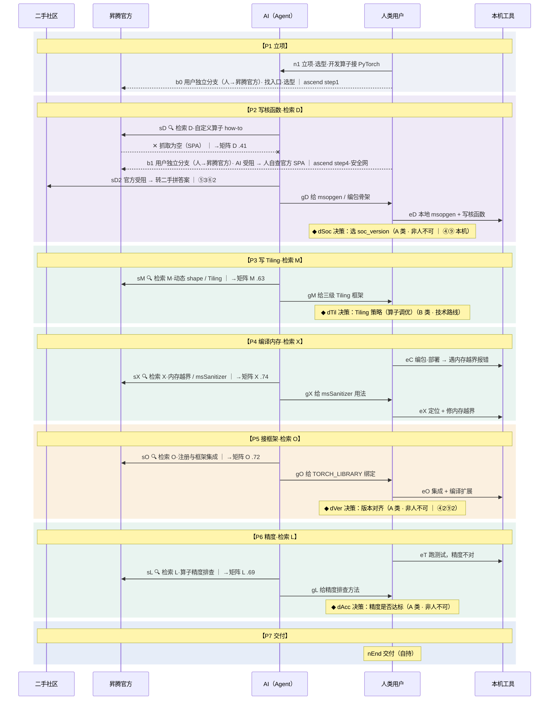
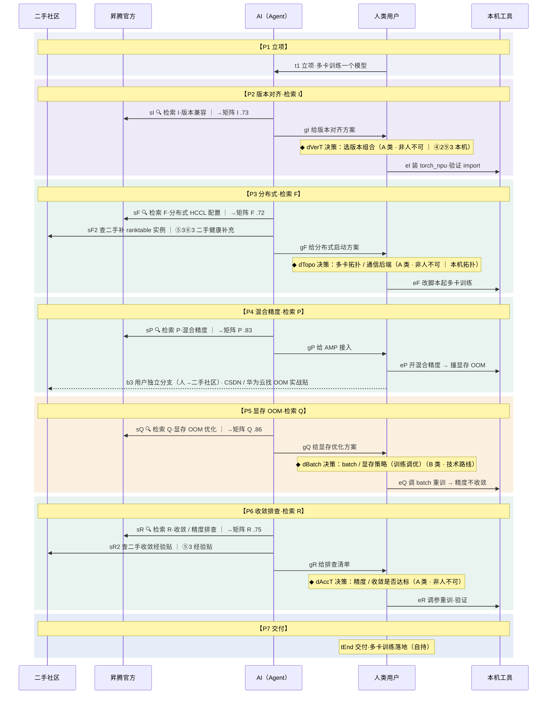
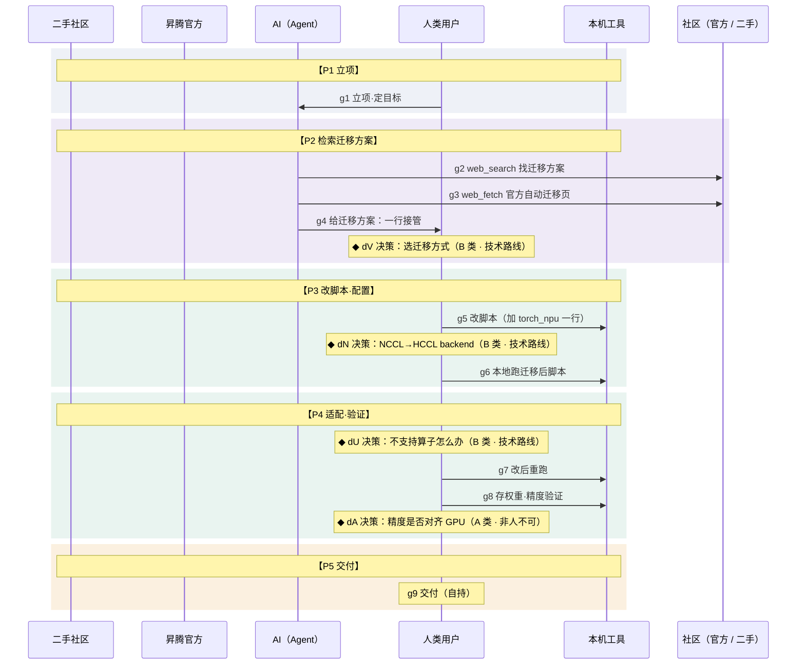
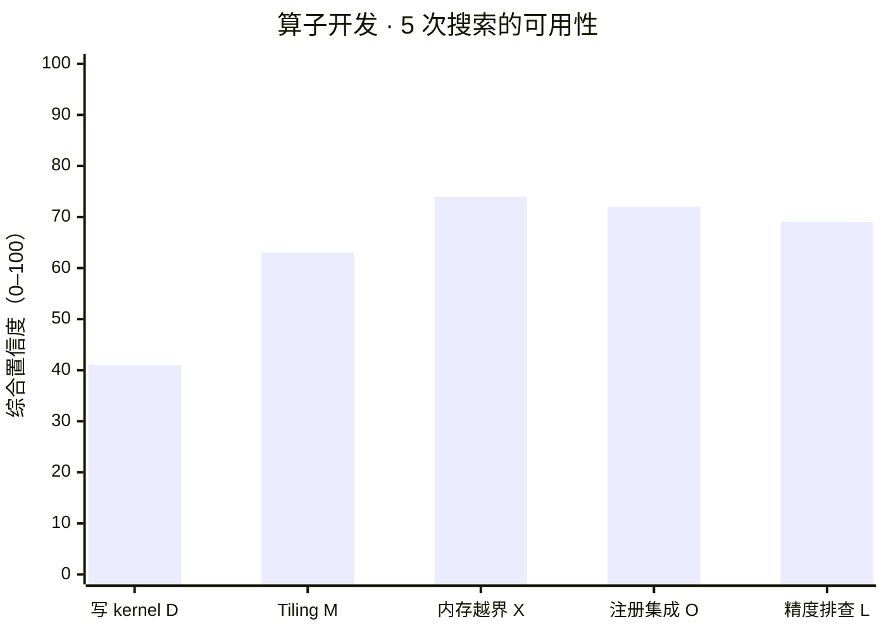
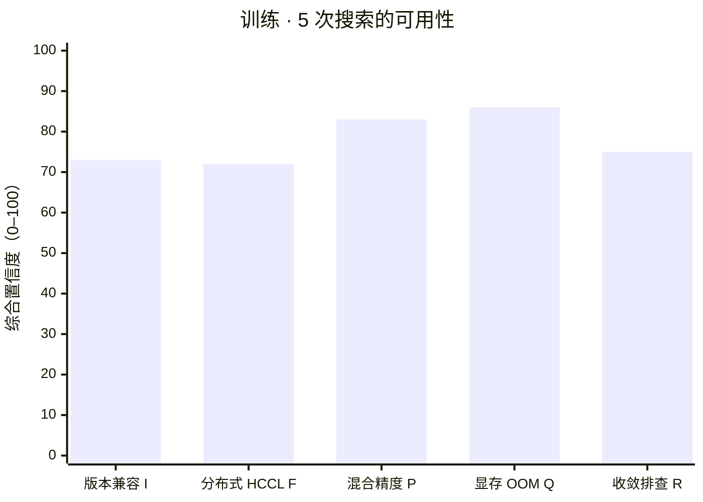
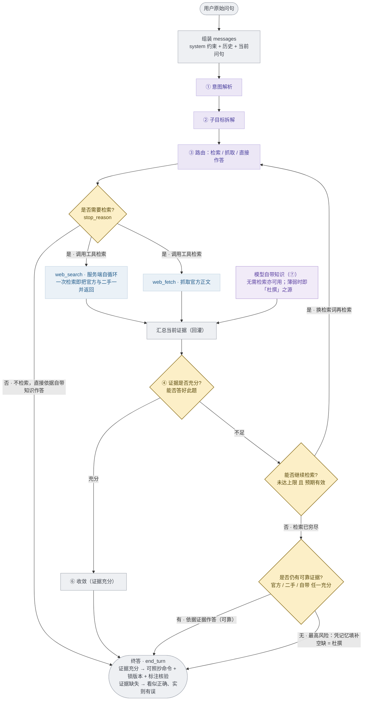
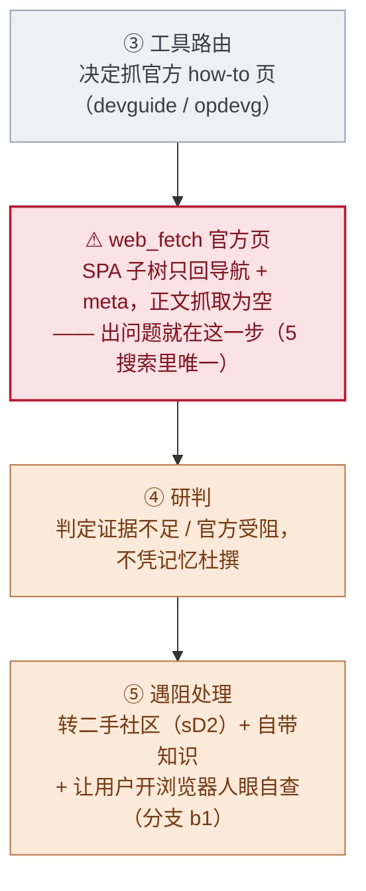

# opknow 研究资料包 · 全集

> 本文件由 `md/tools/bundle.sh` 拼接生成，请勿手工编辑。
> 顺序：17 任务评分对照矩阵 → 18 指标定义与计算方法 → 19 发现与体验综合分析 → 20 开发者与 Agent 协作分析。
> 四份单独的文件都在 `md/` 下；20 引用的 5 张 SVG 在 `md/figs/`。
> 注意：SVG 对 AI 只是坐标碎片，读不出内容——20 里图的意思请读同节的 Mermaid 代码块与明细表。

---

<!-- ==================== 17_任务评分对照矩阵.md ==================== -->

# 任务评分对照矩阵 · 昇腾 vs CUDA「AI 可用性」全任务热力图

> **出处**：`opknow/17_official_site_focus.html`
> **配套**：方法论证法与指标口径见 `18_metric_definition.html`，结论与发力点见 `19_findings_ux_synthesis.html`，人机协同旅程见 `20_human_ai_journey.html`
>
> **一句话主题**：一套 **26 个开发任务 × 11 项指标 × 2 个技术栈（CUDA / CANN）** 的实测评分矩阵——每格都能落到「抽到了什么、缺了什么、来源是哪些」。
>
> **整理原则**：全部数字与逐格证据由脚本从原页 `ROWS` / `RUBRIC` / `FORMULA` 数据层提取，未手工转录；原页的悬浮（hover）内容在本文中改为直出文字。分节编号沿用原页 §s0–§s3 未重排。

---

## 0 · 头条概览（原 §s0）

**官方网站为核心 · 全任务可用性热力图**

真正区分两栈、且属平台级结论的，是**官方网站**这一块——已提为左侧醒目大组，内部再分「**能否触达**（可发现·可抓取）」与「**内容质量**（正文详尽·版本清晰）」两面；二手 / 模型 / 检索 / 产出为支撑维度，视觉弱化。

> **头条对比 = 官方网站**：NVIDIA docs 静态可抓 + 单一版本主线 → 触达 / 质量双 5；昇腾社区 hiascend 的可抓取性**按子树而非全站**（本轮实测检索修正旧「统一记 2」说）：入门 `quickstart/`(A)、`modeldevpt/`(B) 子树服务端渲染、正文可抓；`doc_center/`(C-ATB) 部分可抓；而 `devaids/`、`devguide/opdevg/`、`apiref/` 等**深层参考 / 前沿开发页为 SPA**、正文抽不出。结果：**SPA 短板只在二手稀薄、无可抓子树兜底的 D（自定义算子）真正咬到结果**——A/B 有可抓子树兜底、C 靠厚二手绕过。叠加多版本号散乱，前沿开发差距被拉满。

---

## 1 · 使用者角色：谁在用昇腾（原 §s1）

按「谁在用昇腾」**独立切出**的 4 类使用者（以官方 API 分层为骨；**与已跑 / 待跑无关**）。每个角色会做一束任务（多对多：注册集成被 ②③ 共有、算子融合被 ③④ 共有、分布式被 ②④ 共有）。带 `✓已跑` 的是该角色任务束里已实测的。

| 角色 | 对的 API 层 | 职责 | 边界 | 任务束 |
| --- | --- | --- | --- | --- |
| **① 应用开发者** | AscendCL / 高层库 | 基于 AscendCL（及高层库）做上层 AI 应用 / 推理服务：管资源·内存、加载模型、Host↔Device 搬数据、同步 / 异步下发计算。 | 不写底层 kernel，一般不做框架级迁移。 | **推理服务部署** `✓S` · **动态 batch / shape 推理** `✓T` · **算子库选型** `✓C` · **量化** `✓H` · **报错码 / 异常排查** `✓E` · **安装与环境变量** `✓J` · **概念心智模型对照** `✓Z` |
| **② 模型 / 框架迁移工程师** | torch_npu · ATC · GE 图 | 用框架插件（torch_npu）+ ATC 转换（必要时 GE 图接口），把 PyTorch / TF / Paddle 模型迁到昇腾训练或推理。 | 一般不写底层 kernel。 | **模型转换 / 导出** `✓A` · **CUDA → 昇腾 迁移** `✓G` · **跨芯片迁移** `✓Y` · **注册与框架集成** `✓O` · **分布式训练配置** `✓F` · **混合精度训练** `✓P` · **显存 / OOM 优化** `✓Q` · **精度 / 收敛排查** `✓R` · **版本兼容排查** `✓I` · **容器 / 镜像搭建** `✓K` |
| **③ 算子开发者** | Ascend C kernel | 框架算子不支持、或现有算子性能不达标时，用 Ascend C 写底层 kernel。最深、最贴硬件。 | — | **自定义算子开发** `✓D` · **算子精度排查** `✓L` · **动态 shape / Tiling** `✓M` · **算子融合** `✓N` · **注册与框架集成** `✓O` · **内存越界定位** `✓X` |
| **④ 系统调优 / 生态贡献者** | 最底层资源 · 通信 · 编译链 | 偏底层的高级角色：算子库优化、通信算法、编译链层面的极致调优，并可能往社区贡献高性能算子 / 通信实践。 | — | **Profiling 定位瓶颈** `✓B` · **访存 / occupancy 优化** `✓U` · **计算与传输重叠** `✓V` · **多卡通信优化** `✓W` · **算子融合** `✓N` · **分布式训练配置** `✓F` |

---

## 2 · 全任务热力矩阵（原 §s2）

矩阵分组方式：原页支持「按工作流类型」与「按使用者角色」两种视角（同一份 26 任务）。本文按**工作流类型（7 大类）**列出。同一任务在两栈各占一行。

> **分值约定**：1–5，越绿越好；`受阻` ＝正文被 SPA 拦、无法实测（**中性，非低分**）。**⑧ 检索成本为反向项**（分高 = 省力）。

### 2.1 总分表（26 任务 × 11 指标）

#### 1. 环境与安装（3 个任务）

| 任务 | 栈 | ①可发现 | ②可抓取 | ③正文详尽 | ④版本清晰 | ⑤二手数量 | ⑥二手可信 | ⑦自带知识 | ⑧检索成本 | ⑨版本可锁 | ⑩可复现 | ⑪综合 |
| --- | --- | --- | --- | --- | --- | --- | --- | --- | --- | --- | --- | --- |
| **I** 版本兼容排查 | CUDA | 3 | 5 | 5 | 4 | 2 | 4 | 4 | 2搜·2抓 | 5 | 5 | 高 |
|  | CANN | 3 | 4 | 4 | 4 | 3 | 4 | 2 | 2搜·2抓 | 5 | 5 | 中高 |
| **J** 安装与环境变量 | CUDA | 4 | 5 | 5 | 3 | 3 | 4 | 5 | 1搜·1抓 | 4 | 5 | 高 |
|  | CANN | 5 | 4 | 5 | 2 | 3 | 4 | 4 | 1搜·1抓 | 4 | 5 | 高 |
| **K** 容器 / 镜像搭建 | CUDA | 5 | 5 | 4 | 5 | 3 | 4 | 5 | 1搜·2抓 | 4 | 5 | 高 |
|  | CANN | 5 | 5 | 5 | 4 | 2 | 2 | 3 | 1搜·4抓✗ | 4 | 5 | 高 |

| 任务 | 问题对（CUDA ｜ CANN） | 综合 CUDA / CANN | 结论 |
| --- | --- | --- | --- |
| **I** | CUDA/cuDNN/驱动版本匹配 ｜ CANN×torch_npu×固件版本匹配 | **高** / **中高** | 公式复算 0.73→中高。官方页 ssr 可抓；版本散乱(6)。 |
| **J** | CUDA Toolkit 安装+PATH/LD_LIBRARY ｜ CANN 安装+ASCEND 环境变量 | **高** / **高** | 公式复算 0.80→高。官方页 ssr 可抓；版本散乱(3)。 |
| **K** | NGC CUDA 镜像 ｜ Ascend 容器镜像 + Ascend Docker Runtime | **高** / **高** | 公式复算 0.86→高。官方页 ssr 可抓；版本散乱(4)；二手薄。 |

#### 2. 算子开发（6 个任务）

| 任务 | 栈 | ①可发现 | ②可抓取 | ③正文详尽 | ④版本清晰 | ⑤二手数量 | ⑥二手可信 | ⑦自带知识 | ⑧检索成本 | ⑨版本可锁 | ⑩可复现 | ⑪综合 |
| --- | --- | --- | --- | --- | --- | --- | --- | --- | --- | --- | --- | --- |
| **D** 自定义算子开发 | CUDA | 5 | 5 | 5 | 3 | 4 | 4 | 5 | 1搜 | 5 | 5 | 高 |
|  | CANN | 2 | 2 | 受阻 | 2 | 3 | 2 | 2 | 2搜✗ | 2 | 3 | 低 |
| **L** 算子精度排查 | CUDA | 2 | 5 | 5 | 5 | 2 | 4 | 4 | 2搜·2抓✗ | 4 | 4 | 高 |
|  | CANN | 2 | 4 | 5 | 2 | 3 | 4 | 3 | 2搜·1抓 | 3 | 4 | 中高 |
| **M** 动态 shape / Tiling | CUDA | 5 | 5 | 5 | 4 | 2 | 4 | 5 | 1搜·1抓 | 4 | 5 | 高 |
|  | CANN | 2 | 4 | 4 | 4 | 2 | 4 | 2 | 2搜·2抓 | 4 | 4 | 中 |
| **N** 算子融合 | CUDA | 2 | 5 | 4 | 5 | 2 | 4 | 4 | 2搜·3抓✗ | 4 | 4 | 高 |
|  | CANN | 5 | 4 | 5 | 2 | 2 | 3 | 2 | 1搜·1抓 | 4 | 4 | 中高 |
| **O** 注册与框架集成 | CUDA | 5 | 5 | 5 | 3 | 2 | 4 | 5 | 1搜·4抓 | 4 | 5 | 高 |
|  | CANN | 2 | 4 | 5 | 3 | 3 | 5 | 3 | 2搜·4抓✗ | 4 | 5 | 中高 |
| **C** 算子库选型 | CUDA | 5 | 5 | 5 | 5 | 5 | 4 | 5 | 0–1 | 5 | 5 | 高 |
|  | CANN | 4 | 3 | 3 | 3 | 3 | 4 | 3 | 1搜 | 4 | 4 | 中高 |

| 任务 | 问题对（CUDA ｜ CANN） | 综合 CUDA / CANN | 结论 |
| --- | --- | --- | --- |
| **D** | CUDA kernel+ext ｜ Ascend C+msOpGen+aclnn | **高** / **低** | 4 任务里差距最大；核心 how-to 整个压在 SPA 深层页、无可抓子树兜底、二手又稀，差距拉满。CANN 侧公式复算 .41→低（三渠道同时塌、K 仅 .54）。 |
| **L** | 算子数值精度对齐排查 ｜ Ascend C 算子精度比对(msaccucmp) | **高** / **中高** | 公式复算 0.69→中高。官方页 ssr 可抓；版本散乱(3)。 |
| **M** | TensorRT 动态 shape profile ｜ Ascend C Tiling/动态 shape | **高** / **中** | 公式复算 0.63→中。官方页 ssr 可抓；版本散乱(3)；二手薄。 |
| **N** | TensorRT/torch.compile 融合 ｜ 昇腾图融合/算子融合 | **高** / **中高** | 公式复算 0.74→中高。官方页 ssr 可抓；版本散乱(4)；二手薄；自带知识弱。 |
| **O** | torch 自定义算子注册框架集成 ｜ aclnn/Ascend C 注册接框架 | **高** / **中高** | 公式复算 0.72→中高。官方页 ssr 可抓；版本散乱(4)。 |
| **C** | cuBLAS/cuDNN/… ｜ AOL/ATB/TBE | **高** / **中高** | 差距小，属通识；ATB 概述官方可抓、二手厚，仅 AOL 穷尽算子表 SPA。CANN 侧公式复算 .75→中高（自带⑦/官方③ 各仅 3，撑不到「高」）。 |

#### 3. 训练（4 个任务）

| 任务 | 栈 | ①可发现 | ②可抓取 | ③正文详尽 | ④版本清晰 | ⑤二手数量 | ⑥二手可信 | ⑦自带知识 | ⑧检索成本 | ⑨版本可锁 | ⑩可复现 | ⑪综合 |
| --- | --- | --- | --- | --- | --- | --- | --- | --- | --- | --- | --- | --- |
| **F** 分布式训练配置 | CUDA | 5 | 5 | 5 | 3 | 3 | 4 | 4 | 1搜·1抓 | 4 | 5 | 高 |
|  | CANN | 4 | 4 | 4 | 2 | 3 | 3 | 3 | 1搜·1抓 | 3 | 3 | 中高 |
| **P** 混合精度训练 | CUDA | 5 | 5 | 5 | 5 | 3 | 4 | 5 | 1搜·3抓 | 5 | 5 | 高 |
|  | CANN | 3 | 4 | 4 | 4 | 3 | 4 | 4 | 2搜·5抓 | 4 | 4 | 高 |
| **Q** 显存 / OOM 优化 | CUDA | 5 | 5 | 5 | 5 | 3 | 4 | 5 | 1搜·2抓✗ | 4 | 5 | 高 |
|  | CANN | 5 | 4 | 5 | 4 | 3 | 4 | 3 | 1搜·4抓 | 3 | 4 | 高 |
| **R** 精度 / 收敛排查 | CUDA | 3 | 5 | 4 | 5 | 3 | 3 | 5 | 2搜·1抓 | 4 | 4 | 高 |
|  | CANN | 3 | 4 | 5 | 3 | 3 | 4 | 3 | 2搜·3抓 | 3 | 4 | 中高 |

| 任务 | 问题对（CUDA ｜ CANN） | 综合 CUDA / CANN | 结论 |
| --- | --- | --- | --- |
| **F** | PyTorch DDP+NCCL ｜ torch_npu DDP+HCCL | **高** / **中高** | 官方 trainingmigrguide 子树可抓且详尽，HCCL 几乎逐项对标 PyTorch DDP（backend 改 hccl、device 改 npu）；短板在版本散与二手平台集中，公式复算 .72→中高。 |
| **P** | AMP autocast/GradScaler ｜ 昇腾 AMP/apex 混合精度 | **高** / **高** | 公式复算 0.83→高。官方页 ssr 可抓；版本散乱(3)。 |
| **Q** | CUDA OOM 显存优化 ｜ 昇腾 NPU 显存/OOM 优化 | **高** / **高** | 公式复算 0.86→高。官方页 ssr 可抓；版本散乱(4)。 |
| **R** | 训练不收敛/精度排查 ｜ 昇腾训练精度/收敛排查 | **高** / **中高** | 公式复算 0.75→中高。官方页 ssr 可抓；版本散乱(3)。 |

#### 4. 推理与部署（4 个任务）

| 任务 | 栈 | ①可发现 | ②可抓取 | ③正文详尽 | ④版本清晰 | ⑤二手数量 | ⑥二手可信 | ⑦自带知识 | ⑧检索成本 | ⑨版本可锁 | ⑩可复现 | ⑪综合 |
| --- | --- | --- | --- | --- | --- | --- | --- | --- | --- | --- | --- | --- |
| **A** 模型转换 / 导出 | CUDA | 5 | 5 | 5 | 4 | 4 | 4 | 4 | 1搜 | 5 | 5 | 高 |
|  | CANN | 4 | 4 | 4 | 2 | 4 | 4 | 3 | 1搜·3抓 | 3 | 4 | 中高 |
| **S** 推理服务部署 | CUDA | 5 | 5 | 5 | 4 | 3 | 4 | 4 | 1搜·1抓 | 4 | 5 | 高 |
|  | CANN | 5 | 4 | 4 | 3 | 2 | 4 | 2 | 1搜·3抓 | 4 | 4 | 中高 |
| **H** 量化 | CUDA | 5 | 5 | 5 | 3 | 3 | 4 | 4 | 1搜 | 4 | 5 | 高 |
|  | CANN | 3 | 4 | 3 | 2 | 4 | 3 | 3 | 2搜·1抓 | 4 | 5 | 中高 |
| **T** 动态 batch / shape 推理 | CUDA | 3 | 5 | 5 | 5 | 2 | 4 | 5 | 2搜·4抓✗ | 5 | 5 | 高 |
|  | CANN | 3 | 4 | 5 | 2 | 3 | 5 | 3 | 2搜·2抓 | 4 | 4 | 中高 |

| 任务 | 问题对（CUDA ｜ CANN） | 综合 CUDA / CANN | 结论 |
| --- | --- | --- | --- |
| **A** | PyTorch→ONNX→TensorRT ｜ ONNX→ATC→.om | **高** / **中高** | 差距小，两边都好查；官方 quickstart 子树实测可抓、命令统一，仅深层 AIPP 参考 SPA。 |
| **S** | Triton 推理服务部署 ｜ MindIE 推理服务部署 | **高** / **中高** | 公式复算 0.74→中高。官方页 ssr 可抓；二手薄；自带知识弱。 |
| **H** | TensorRT INT8 PTQ ｜ msmodelslim W8A8 | **高** / **中高** | 官方 AMCT 页 ssr 可抓但偏算法原理（③3），真正可跑的 W8A8 命令在 Gitee 蓝区仓 + CSDN（⑩5 可照抄）；短板是 msmodelslim/AMCT 版本散乱，公式复算 .69→中高。 |
| **T** | TensorRT 动态 batch ｜ ATC dynamic_batch/ais_bench 动态推理 | **高** / **中高** | 公式复算 0.72→中高。官方页 ssr 可抓；版本散乱(4)。 |

#### 5. 性能优化（4 个任务）

| 任务 | 栈 | ①可发现 | ②可抓取 | ③正文详尽 | ④版本清晰 | ⑤二手数量 | ⑥二手可信 | ⑦自带知识 | ⑧检索成本 | ⑨版本可锁 | ⑩可复现 | ⑪综合 |
| --- | --- | --- | --- | --- | --- | --- | --- | --- | --- | --- | --- | --- |
| **B** Profiling 定位瓶颈 | CUDA | 4 | 5 | 5 | 4 | 4 | 4 | 4 | 1搜 | 4 | 5 | 高 |
|  | CANN | 4 | 4 | 4 | 2 | 3 | 3 | 3 | 1搜·2抓 | 3 | 3 | 中高 |
| **U** 访存 / occupancy 优化 | CUDA | 5 | 5 | 5 | 5 | 3 | 4 | 5 | 1搜·1抓 | 4 | 4 | 高 |
|  | CANN | 4 | 4 | 4 | 5 | 3 | 4 | 3 | 1搜·3抓 | 4 | 4 | 高 |
| **V** 计算与传输重叠 | CUDA | 5 | 5 | 5 | 5 | 3 | 4 | 5 | 1搜·2抓 | 5 | 5 | 高 |
|  | CANN | 4 | 4 | 4 | 2 | 3 | 4 | 3 | 1搜·3抓 | 4 | 4 | 中高 |
| **W** 多卡通信优化 | CUDA | 5 | 5 | 4 | 4 | 3 | 4 | 4 | 1搜·1抓 | 5 | 5 | 高 |
|  | CANN | 2 | 4 | 3 | 3 | 3 | 4 | 3 | 2搜·2抓 | 4 | 4 | 中高 |

| 任务 | 问题对（CUDA ｜ CANN） | 综合 CUDA / CANN | 结论 |
| --- | --- | --- | --- |
| **B** | Nsight ｜ msprof / Ascend PyTorch Profiler | **高** / **中高** | 中等偏小差距；官方 PyTorch Profiler 子树实测可抓、对标 GPU，仅 msprof 原生参考 SPA。 |
| **U** | Nsight 访存/occupancy 优化 ｜ Ascend C double-buffer/访存优化 | **高** / **高** | 公式复算 0.88→高。官方页 ssr 可抓。 |
| **V** | CUDA streams 计算传输重叠 ｜ aclrtMemcpyAsync 计算传输重叠 | **高** / **中高** | 公式复算 0.72→中高。官方页 ssr 可抓；版本散乱(3)。 |
| **W** | NCCL 多卡通信调优 ｜ HCCL 多卡通信调优 | **高** / **中高** | 公式复算 0.70→中高。官方页 ssr 可抓；版本散乱(4)。 |

#### 6. 调试（2 个任务）

| 任务 | 栈 | ①可发现 | ②可抓取 | ③正文详尽 | ④版本清晰 | ⑤二手数量 | ⑥二手可信 | ⑦自带知识 | ⑧检索成本 | ⑨版本可锁 | ⑩可复现 | ⑪综合 |
| --- | --- | --- | --- | --- | --- | --- | --- | --- | --- | --- | --- | --- |
| **X** 内存越界定位 | CUDA | 5 | 5 | 5 | 3 | 3 | 4 | 4 | 1搜·1抓 | 4 | 5 | 高 |
|  | CANN | 5 | 4 | 5 | 2 | 2 | 4 | 2 | 1搜·2抓 | 4 | 5 | 中高 |
| **E** 报错码 / 异常排查 | CUDA | 4 | 5 | 5 | 5 | 4 | 4 | 4 | 1搜·1抓 | 4 | 5 | 高 |
|  | CANN | 3 | 4 | 2 | 2 | 3 | 3 | 2 | 2搜·1抓 | 3 | 3 | 中 |

| 任务 | 问题对（CUDA ｜ CANN） | 综合 CUDA / CANN | 结论 |
| --- | --- | --- | --- |
| **X** | compute-sanitizer 内存越界定位 ｜ msSanitizer 内存越界定位 | **高** / **中高** | 公式复算 0.74→中高。官方页 ssr 可抓；版本散乱(4)；二手薄；自带知识弱。 |
| **E** | CUDA 报错码定位 ｜ EZ9999 排查 | **高** / **中** | 第二批 CANN 最弱格。官方错误码页 ssr 可抓但是泛化兜底（Inner Error/cause N/A，③2），加自带知识弱（⑦2）、二手碎散——「②可抓但③无用」的典型，公式复算 .55→中。 |

#### 7. 迁移（3 个任务）

| 任务 | 栈 | ①可发现 | ②可抓取 | ③正文详尽 | ④版本清晰 | ⑤二手数量 | ⑥二手可信 | ⑦自带知识 | ⑧检索成本 | ⑨版本可锁 | ⑩可复现 | ⑪综合 |
| --- | --- | --- | --- | --- | --- | --- | --- | --- | --- | --- | --- | --- |
| **G** CUDA → 昇腾 迁移 | CUDA | 5 | 5 | 5 | 3 | 3 | 4 | 4 | 1搜 | 4 | 5 | 高 |
|  | CANN | 4 | 4 | 4 | 4 | 3 | 4 | 3 | 1搜·1抓 | 4 | 4 | 高 |
| **Y** 跨芯片迁移 | CUDA | 5 | 5 | 5 | 4 | 3 | 4 | 5 | 1搜·2抓 | 5 | 5 | 高 |
|  | CANN | 2 | 3 | 4 | 3 | 3 | 4 | 3 | 2搜·4抓✗ | 4 | 4 | 中高 |
| **Z** 概念心智模型对照 | CUDA | 5 | 5 | 4 | 5 | 3 | 4 | 5 | 1搜·4抓✗ | 2 | 2 | 高 |
|  | CANN | 5 | 4 | 5 | 5 | 3 | 4 | 4 | 1搜·3抓✗ | 2 | 2 | 高 |

| 任务 | 问题对（CUDA ｜ CANN） | 综合 CUDA / CANN | 结论 |
| --- | --- | --- | --- |
| **G** | CUDA→ROCm/HIP 移植 ｜ GPU→NPU transfer_to_npu | **高** / **高** | 迁移是华为推 CUDA 用户上昇腾的核心采纳漏斗、官方投入最重：transfer_to_npu 一行自动迁移 + 文档可抓详尽 + 华为云最佳实践，公式复算 .84→高（第二批唯一达「高」的 CANN 格）。局限：一键迁移只覆盖简单场景。 |
| **Y** | 跨 GPU 架构迁移(-arch/PTX) ｜ 跨昇腾芯片迁移(soc_version) | **高** / **中高** | 公式复算 0.67→中高。官方 detail 子树 SPA、镜像兜底；版本散乱(4)。 |
| **Z** | CUDA 线程/内存层级心智模型 ｜ Ascend C SPMD/UB/GM 心智模型 | **高** / **高** | 公式复算 0.90→高。官方页 ssr 可抓；版本散乱(3)。 |


### 2.2 逐格实测证据（26 任务）

每格 = 「**主述**（这一步实际发生了什么）+ 抽到 / 缺失 / 版本 / 问题 / **来源**」。原页为悬浮显示，此处全部直出。

#### I · 版本兼容排查

- **问题对**：CUDA/cuDNN/驱动版本匹配 ｜ CANN×torch_npu×固件版本匹配
- **综合置信度**：CUDA **高** ｜ CANN **中高**
- **结论**：公式复算 0.73→中高。官方页 ssr 可抓；版本散乱(6)。

**CUDA**

- **① 官方可发现性** `3`：2 轮检索、官方命中名次 rank=2。
- **② 官方可抓取性** `5`：官方静态站，web_fetch 正文可直接抓取。
- **③ 官方正文详尽度** `5`：抓到正文穷尽（参数表/命令/代码齐全）。可执行验证。
- **④ 版本清晰度** `4`：检索中并存版本号 4 个，且跨双轴（CANN 版 × 插件/芯片），官方给出版本矩阵、可对照。
- **⑤ 二手数量** `2`：二手 2 条（官方一手已剔除、不计二手）。
  - **来源**：
    - 《markaicode》— （2026-03）
    - 《devzery》— （2024-08）
- **⑥ 二手可信度 / 一致性** `4`：按来源类型可信度均分≈2.8 + 一致性 high；来源类型 aggregator,tech_blog。
- **⑦ 模型自带知识** `4`：自带知识自评 4/5；迭代中(moderate) −0.25。
- **⑧ 检索成本** `2搜·2抓`：成本 = 轮数2 + 0.5×抓取2 = 3。
- **⑨ 版本可锁定性** `5`：可锁定到确切版本。
- **⑩ 步骤可复现性** `5`：命令可直接照抄运行。
- **⑪ 综合置信度** `高`：综合置信度公式复算 = 0.85 → 高（由①–⑧ 实时代入，见下方推导）。
  - **推导**：OFF=①×②×③=0.60×1.00×1.00=0.60；SEC=⑤×⑥=0.32；OWN=⑦=0.80
  - **K = 1−(1−OFF)(1−SEC)(1−OWN)** = 0.95；**版本因子** 0.7+0.3×④归一=0.94；**成本因子** 0.9+0.1×⑧归一=0.96
  - **综合 = K × 版本因子 × 成本因子 = 0.85 → 高**（档位线：≥.80 高 / ≥.63 中高 / ≥.45 中 / ≥.24 低）

**CANN**

- **① 官方可发现性** `3`：2 轮检索、官方命中名次 rank=1。
- **② 官方可抓取性** `4`：官方页服务端渲染、正文可抓（实测非 SPA）。
- **③ 官方正文详尽度** `4`：抓到核心机制，但非端到端穷尽走查。可执行验证。
- **④ 版本清晰度** `4`：检索中并存版本号 6 个，且跨双轴（CANN 版 × 插件/芯片），官方给出版本矩阵、可对照。
- **⑤ 二手数量** `3`：二手 3 条（官方一手已剔除、不计二手）。
  - **来源**：
    - 《csdn》— （2026-01）
    - 《csdn》— （2025-11）
    - 《hwcomputing》— 
- **⑥ 二手可信度 / 一致性** `4`：按来源类型可信度均分≈3.3 + 一致性 high；来源类型 tech_blog,tech_blog,cloud_vendor。
- **⑦ 模型自带知识** `2`：自带知识自评 3/5；该领域迭代快(fast)，训练知识易落后 −0.5。
- **⑧ 检索成本** `2搜·2抓`：成本 = 轮数2 + 0.5×抓取2 = 3。
- **⑨ 版本可锁定性** `5`：可锁定到确切版本。
- **⑩ 步骤可复现性** `5`：命令可直接照抄运行。
- **⑪ 综合置信度** `中高`：综合置信度公式复算 = 0.73 → 中高（由①–⑧ 实时代入，见下方推导）。
  - **推导**：OFF=①×②×③=0.60×0.80×0.80=0.38；SEC=⑤×⑥=0.48；OWN=⑦=0.40
  - **K = 1−(1−OFF)(1−SEC)(1−OWN)** = 0.81；**版本因子** 0.7+0.3×④归一=0.94；**成本因子** 0.9+0.1×⑧归一=0.96
  - **综合 = K × 版本因子 × 成本因子 = 0.73 → 中高**（档位线：≥.80 高 / ≥.63 中高 / ≥.45 中 / ≥.24 低）

#### J · 安装与环境变量

- **问题对**：CUDA Toolkit 安装+PATH/LD_LIBRARY ｜ CANN 安装+ASCEND 环境变量
- **综合置信度**：CUDA **高** ｜ CANN **高**
- **结论**：公式复算 0.80→高。官方页 ssr 可抓；版本散乱(3)。

**CUDA**

- **① 官方可发现性** `4`：1 轮检索、官方命中名次 rank=5。
- **② 官方可抓取性** `5`：官方静态站，web_fetch 正文可直接抓取。
- **③ 官方正文详尽度** `5`：抓到正文穷尽（参数表/命令/代码齐全）。可执行验证。
- **④ 版本清晰度** `3`：检索中并存版本号 2 个。
- **⑤ 二手数量** `3`：二手 4 条（官方一手已剔除、不计二手）。
  - **来源**：
    - 《chrispaquin》— （2025-02）
    - 《cherryservers》— （2025-11）
    - 《vultr》— 
    - 《medium》— 
- **⑥ 二手可信度 / 一致性** `4`：按来源类型可信度均分≈3.2 + 一致性 high；来源类型 tech_blog,tech_blog,cloud_vendor,tech_blog。
- **⑦ 模型自带知识** `5`：自带知识自评 5/5。
- **⑧ 检索成本** `1搜·1抓`：成本 = 轮数1 + 0.5×抓取1 = 1.5。
- **⑨ 版本可锁定性** `4`：大体可锁、个别取值依芯片/版本。
- **⑩ 步骤可复现性** `5`：命令可直接照抄运行。
- **⑪ 综合置信度** `高`：综合置信度公式复算 = 0.88 → 高（由①–⑧ 实时代入，见下方推导）。
  - **推导**：OFF=①×②×③=0.80×1.00×1.00=0.80；SEC=⑤×⑥=0.48；OWN=⑦=1.00
  - **K = 1−(1−OFF)(1−SEC)(1−OWN)** = 1.00；**版本因子** 0.7+0.3×④归一=0.88；**成本因子** 0.9+0.1×⑧归一=1.00
  - **综合 = K × 版本因子 × 成本因子 = 0.88 → 高**（档位线：≥.80 高 / ≥.63 中高 / ≥.45 中 / ≥.24 低）

**CANN**

- **① 官方可发现性** `5`：1 轮检索、官方命中名次 rank=1。
- **② 官方可抓取性** `4`：官方页服务端渲染、正文可抓（实测非 SPA）。
- **③ 官方正文详尽度** `5`：抓到正文穷尽（参数表/命令/代码齐全）。可执行验证。
- **④ 版本清晰度** `2`：检索中并存版本号 3 个。
- **⑤ 二手数量** `3`：二手 4 条（官方一手已剔除、不计二手）。
  - **来源**：
    - 《csdn》— （2025-08）
    - 《csdn》— 
    - 《huaweicloud》— 
    - 《zhihu》— 
- **⑥ 二手可信度 / 一致性** `4`：按来源类型可信度均分≈3.2 + 一致性 high；来源类型 tech_blog,tech_blog,cloud_vendor,tech_blog。
- **⑦ 模型自带知识** `4`：自带知识自评 4/5；迭代中(moderate) −0.25。
- **⑧ 检索成本** `1搜·1抓`：成本 = 轮数1 + 0.5×抓取1 = 1.5。
- **⑨ 版本可锁定性** `4`：大体可锁、个别取值依芯片/版本。
- **⑩ 步骤可复现性** `5`：命令可直接照抄运行。
- **⑪ 综合置信度** `高`：综合置信度公式复算 = 0.80 → 高（由①–⑧ 实时代入，见下方推导）。
  - **推导**：OFF=①×②×③=1.00×0.80×1.00=0.80；SEC=⑤×⑥=0.48；OWN=⑦=0.80
  - **K = 1−(1−OFF)(1−SEC)(1−OWN)** = 0.98；**版本因子** 0.7+0.3×④归一=0.82；**成本因子** 0.9+0.1×⑧归一=1.00
  - **综合 = K × 版本因子 × 成本因子 = 0.80 → 高**（档位线：≥.80 高 / ≥.63 中高 / ≥.45 中 / ≥.24 低）

#### K · 容器 / 镜像搭建

- **问题对**：NGC CUDA 镜像 ｜ Ascend 容器镜像 + Ascend Docker Runtime
- **综合置信度**：CUDA **高** ｜ CANN **高**
- **结论**：公式复算 0.86→高。官方页 ssr 可抓；版本散乱(4)；二手薄。

**CUDA**

- **① 官方可发现性** `5`：1 轮检索、官方命中名次 rank=1。
- **② 官方可抓取性** `5`：官方静态站，web_fetch 正文可直接抓取。
- **③ 官方正文详尽度** `4`：抓到核心机制，但非端到端穷尽走查。可执行验证。
- **④ 版本清晰度** `5`：检索中并存版本号 1 个。
- **⑤ 二手数量** `3`：二手 4 条（官方一手已剔除、不计二手）。
  - **来源**：
    - 《lambda》— （2021-07）
    - 《redhat》— （2025-08）
    - 《digitalocean》— 
    - 《gpu-mart》— 
- **⑥ 二手可信度 / 一致性** `4`：按来源类型可信度均分≈3.2 + 一致性 high；来源类型 tech_blog,tech_blog,cloud_vendor,tech_blog。
- **⑦ 模型自带知识** `5`：自带知识自评 5/5。
- **⑧ 检索成本** `1搜·2抓`：成本 = 轮数1 + 0.5×抓取2 = 2。
- **⑨ 版本可锁定性** `4`：大体可锁、个别取值依芯片/版本。
- **⑩ 步骤可复现性** `5`：命令可直接照抄运行。
- **⑪ 综合置信度** `高`：综合置信度公式复算 = 0.98 → 高（由①–⑧ 实时代入，见下方推导）。
  - **推导**：OFF=①×②×③=1.00×1.00×0.80=0.80；SEC=⑤×⑥=0.48；OWN=⑦=1.00
  - **K = 1−(1−OFF)(1−SEC)(1−OWN)** = 1.00；**版本因子** 0.7+0.3×④归一=1.00；**成本因子** 0.9+0.1×⑧归一=0.98
  - **综合 = K × 版本因子 × 成本因子 = 0.98 → 高**（档位线：≥.80 高 / ≥.63 中高 / ≥.45 中 / ≥.24 低）

**CANN**

- **① 官方可发现性** `5`：1 轮检索、官方命中名次 rank=1。
- **② 官方可抓取性** `5`：官方静态站，web_fetch 正文可直接抓取。
- **③ 官方正文详尽度** `5`：抓到正文穷尽（参数表/命令/代码齐全）。可执行验证。
- **④ 版本清晰度** `4`：检索中并存版本号 4 个，且跨双轴（CANN 版 × 插件/芯片），官方给出版本矩阵、可对照。
- **⑤ 二手数量** `2`：二手 2 条（官方一手已剔除、不计二手）。
  - **来源**：
    - 《csdn》— （2026-04）
    - 《csdn》— 
- **⑥ 二手可信度 / 一致性** `2`：按来源类型可信度均分≈3.0 + 一致性 mid；来源类型 tech_blog,tech_blog。
- **⑦ 模型自带知识** `3`：自带知识自评 3/5；迭代中(moderate) −0.25。
- **⑧ 检索成本** `1搜·4抓✗`：成本 = 轮数1 + 0.5×抓取4 + 4×抓取失败1 = 7。
- **⑨ 版本可锁定性** `4`：大体可锁、个别取值依芯片/版本。
- **⑩ 步骤可复现性** `5`：命令可直接照抄运行。
- **⑪ 综合置信度** `高`：综合置信度公式复算 = 0.86 → 高（由①–⑧ 实时代入，见下方推导）。
  - **推导**：OFF=①×②×③=1.00×1.00×1.00=1.00；SEC=⑤×⑥=0.16；OWN=⑦=0.60
  - **K = 1−(1−OFF)(1−SEC)(1−OWN)** = 1.00；**版本因子** 0.7+0.3×④归一=0.94；**成本因子** 0.9+0.1×⑧归一=0.92
  - **综合 = K × 版本因子 × 成本因子 = 0.86 → 高**（档位线：≥.80 高 / ≥.63 中高 / ≥.45 中 / ≥.24 低）

#### D · 自定义算子开发

- **问题对**：CUDA kernel+ext ｜ Ascend C+msOpGen+aclnn
- **综合置信度**：CUDA **高** ｜ CANN **低**
- **结论**：4 任务里差距最大；核心 how-to 整个压在 SPA 深层页、无可抓子树兜底、二手又稀，差距拉满。CANN 侧公式复算 .41→低（三渠道同时塌、K 仅 .54）。

**CUDA**

- **① 官方可发现性** `5`：docs.pytorch.org 官方教程置顶。
  - **来源**：
    - 《Custom C++ and CUDA Operators》— docs.pytorch.org/tutorials/advanced/cpp_custom_ops（PyTorch 2.12）
    - 《Custom C++ and CUDA Extensions》— docs.pytorch.org/tutorials/advanced/cpp_extension
- **② 官方可抓取性** `5`：PyTorch 官方静态可抓。
  - **抽到**：`TORCH_LIBRARY` 宏注册、`CUDAExtension`、JIT `load()` 正文可抓。
  - **缺失**：无明显缺失。
- **③ 官方正文详尽度** `5`：本轮 fetch 实测：PyTorch 自定义算子教程正文极详尽，分步代码齐全。
  - **抽到**：完整 `setup.py`（CppExtension + py_limited_api）、C++ 算子定义 `mymuladd_cpu(...)`、注册宏 `STABLE_TORCH_LIBRARY(extension_cpp,m){ m.def("mymuladd(...)->Tensor"); }`、分步骤（构建→定义→注册 backend→register_fake→opcheck）正文全抓到。
  - **缺失**：无明显缺失。
  - **来源**：
    - 《Custom C++ and CUDA Operators（实测 fetch）》— docs.pytorch.org/tutorials/advanced/cpp_custom_ops（2.10+ Stable ABI）
- **④ 版本清晰度** `3`：扩展 API 跨版本变化大，旧教程易误导，但官方标注清楚。
  - **版本**：2.10+ LibTorch Stable ABI（STABLE_TORCH_LIBRARY） vs 旧 THCudaTensor。
  - **⚠ 问题**：旧教程基于已废弃 API，需认准版本。
- **⑤ 二手数量** `4`：真正的二手（非官方仓）有 apxml/个人博客等 5 条 → 档 4（pytorch/extension-cpp 等属官方仓、计入①不计二手）。
  - **来源**：
    - 《extension-cpp》— github.com/pytorch/extension-cpp
    - 《extension-script》— github.com/pytorch/extension-script
    - 《cpp_extension 教程》— docs.pytorch.org
- **⑥ 二手可信度 / 一致性** `4`：官方教程 + 仓库写法一致，但二手本身多为个人博客（基准 3）→ 均分 2.9 + 一致性 high(+1) = 3.9 → 档 4。
- **⑦ 模型自带知识** `5`：这套扩展流程（定义→注册 backend→绑定 Python）我很熟。
- **⑧ 检索成本** `1搜`：一次到位。
- **⑨ 版本可锁定性** `5`：可锁定到具体 PyTorch 版本写法。
- **⑩ 步骤可复现性** `5`：命令可直接照抄。
- **⑪ 综合置信度** `高`：官方 + 海量 GitHub。
  - **推导**：OFF=①×②×③=1.00×1.00×1.00=1.00；SEC=⑤×⑥=0.64；OWN=⑦=1.00
  - **K = 1−(1−OFF)(1−SEC)(1−OWN)** = 1.00；**版本因子** 0.7+0.3×④归一=0.88；**成本因子** 0.9+0.1×⑧归一=1.00
  - **综合 = K × 版本因子 × 成本因子 = 0.88 → 高**（档位线：≥.80 高 / ≥.63 中高 / ≥.45 中 / ≥.24 低）

**CANN**

- **① 官方可发现性** `2`：第 1 搜官方排不到首屏（多为 CSDN / 博客园），需补关键词第 2 搜才命中 hiascend。
  - **⚠ 问题**：官方可发现性低，靠二手关键词二次检索才定位。
  - **来源**：
    - 《Ascend C 算子开发 atlas_ascendc_10_0064》— hiascend.com/document/detail（商用版 8.0.RC3）
    - 《完整 add_custom.json 示例 atlas_ascendc_10_0005》— hiascend.com（社区版 80RC2alpha001）
- **② 官方可抓取性** `2`：实测 SPA：AddCustom 官方页正文抽不出，且**无可抓子树兜底**（不像 A-quickstart / B-modeldevpt 有服务端渲染页）——核心 how-to 整个压在 `devguide/opdevg/` SPA。
  - **抽到**：meta + 部分命令：`msopgen gen -i $HOME/sample/add_custom.json -c ai_core- -lan cpp -out $HOME/sample/AddCustom`
  - **缺失**：add_custom.json 完整字段、Tiling / Kernel 实现正文、编译部署完整步骤抽不出。
  - **⚠ 问题**：四任务里唯一「SPA 短板真正咬到结果」者：无可抓子树兜底 + 二手稀薄，叠加在 D 上致命。
- **③ 官方正文详尽度** `受阻`：AddCustom/Ascend C 官方正文 SPA 受阻，最致命处恰恰无法实测。
  - **⚠ 问题**：atlas_ascendc_* 为 SPA，add_custom.json 完整字段、Tiling/Kernel 实现正文抽不出；此任务二手又稀、最依赖官方全文却抓不到——正是 D 垫底的核心证据。受阻 ≠ 低分。
- **④ 版本清晰度** `2`：hiascend 多版本并存，要自己挑。
  - **版本**：80RC2alpha001／80RC3／82RC1alpha003 同时存在。
  - **⚠ 问题**：前沿能力版本号迭代快、并存多。
- **⑤ 二手数量** `3`：二手 3 条（CSDN/ai6s/博客园；MindSpore 官方 doc 计入①不计二手），公式计数 3 → 档 3，但质量参差、多为入门科普。
  - **⚠ 问题**：二手数量远少于 CUDA，且多为入门科普。
  - **来源**：
    - 《AscendC 从入门到精通系列（三）》— blog.csdn.net/xyz3120/143643855（2024-11-09）
    - 《Ascend C 算子开发全流程揭秘》— ai6s.net/69322a96（2025-12-05）
    - 《ZOMI Ascend C 算子开发》— cnblogs.com（2024-11-21）
- **⑥ 二手可信度 / 一致性** `2`：各源版本 / 写法不一，难交叉印证。
  - **⚠ 问题**：msopgen 脚手架结构、aclnn vs c++ infer 路线各源不同，无法互相印证。
- **⑦ 模型自带知识** `2`：Ascend C 算子开发我自带知识弱，不敢凭记忆给命令。
  - **⚠ 问题**：Copy-In/Compute/Copy-Out 三段流水线属前沿，训练自带知识覆盖薄。
- **⑧ 检索成本** `2搜✗`：2 轮检索 + 1 次 web_fetch 失败（SPA），成本最高。
  - **⚠ 问题**：唯一触发多轮检索 + 抓取失败的任务。
- **⑨ 版本可锁定性** `2`：未能锁定具体 CANN 版本。
  - **⚠ 问题**：多版本并存 + 正文抽不出，版本无法定死。
- **⑩ 步骤可复现性** `3`：链路骨架可述（msopgen → 编译 custom_opp_*.run → 部署 OPP vendors/customize），但 Kernel 命令细节无法逐条确证。
- **⑪ 综合置信度** `低`：量化公式复算 = K .54 × 版本因子 .82 × 成本 .92 = .41 → 低（旧「中」系整体研判、偏乐观）。三渠道同时塌：官方受阻 OFF≈0、二手稀 SEC .24、自带弱 OWN .40 → 知识可得性 K 仅 .54，无一条扛得住。
  - **推导**：OFF=①×②×③=0.40×0.40×0.00=0.00；SEC=⑤×⑥=0.24；OWN=⑦=0.40
  - **K = 1−(1−OFF)(1−SEC)(1−OWN)** = 0.54；**版本因子** 0.7+0.3×④归一=0.82；**成本因子** 0.9+0.1×⑧归一=0.92
  - **综合 = K × 版本因子 × 成本因子 = 0.41 → 低**（档位线：≥.80 高 / ≥.63 中高 / ≥.45 中 / ≥.24 低）

#### L · 算子精度排查

- **问题对**：算子数值精度对齐排查 ｜ Ascend C 算子精度比对(msaccucmp)
- **综合置信度**：CUDA **高** ｜ CANN **中高**
- **结论**：公式复算 0.69→中高。官方页 ssr 可抓；版本散乱(3)。

**CUDA**

- **① 官方可发现性** `2`：2 轮检索、官方命中名次 rank=3；官方排不到首屏、靠二搜关键词定位（refine）。
- **② 官方可抓取性** `5`：官方静态站，web_fetch 正文可直接抓取。
- **③ 官方正文详尽度** `5`：抓到正文穷尽（参数表/命令/代码齐全）。可执行验证。
- **④ 版本清晰度** `5`：检索中并存版本号 1 个。
- **⑤ 二手数量** `2`：二手 2 条（官方一手已剔除、不计二手）。
  - **来源**：
    - 《developer.nvidia.com》— 
    - 《vllm》— （2025-08）
- **⑥ 二手可信度 / 一致性** `4`：按来源类型可信度均分≈3.0 + 一致性 high；来源类型 tech_blog,tech_blog。
- **⑦ 模型自带知识** `4`：自带知识自评 4/5。
- **⑧ 检索成本** `2搜·2抓✗`：成本 = 轮数2 + 0.5×抓取2 + 4×抓取失败1 = 7。
- **⑨ 版本可锁定性** `4`：大体可锁、个别取值依芯片/版本。
- **⑩ 步骤可复现性** `4`：主命令可抄、部分参数依环境。
- **⑪ 综合置信度** `高`：综合置信度公式复算 = 0.84 → 高（由①–⑧ 实时代入，见下方推导）。
  - **推导**：OFF=①×②×③=0.40×1.00×1.00=0.40；SEC=⑤×⑥=0.32；OWN=⑦=0.80
  - **K = 1−(1−OFF)(1−SEC)(1−OWN)** = 0.92；**版本因子** 0.7+0.3×④归一=1.00；**成本因子** 0.9+0.1×⑧归一=0.92
  - **综合 = K × 版本因子 × 成本因子 = 0.84 → 高**（档位线：≥.80 高 / ≥.63 中高 / ≥.45 中 / ≥.24 低）

**CANN**

- **① 官方可发现性** `2`：2 轮检索、官方命中名次 rank=1；官方排不到首屏、靠二搜关键词定位（refine）。
- **② 官方可抓取性** `4`：官方页服务端渲染、正文可抓（实测非 SPA）。
- **③ 官方正文详尽度** `5`：抓到正文穷尽（参数表/命令/代码齐全）。可执行验证。
- **④ 版本清晰度** `2`：检索中并存版本号 3 个。
- **⑤ 二手数量** `3`：二手 3 条（官方一手已剔除、不计二手）。
  - **来源**：
    - 《zhihu》— 
    - 《huaweicloud》— 
    - 《segmentfault》— 
- **⑥ 二手可信度 / 一致性** `4`：按来源类型可信度均分≈3.5 + 一致性 high；来源类型 qa_reputation,cloud_vendor,tech_blog。
- **⑦ 模型自带知识** `3`：自带知识自评 3/5；迭代中(moderate) −0.25。
- **⑧ 检索成本** `2搜·1抓`：成本 = 轮数2 + 0.5×抓取1 = 2.5。
- **⑨ 版本可锁定性** `3`：只能锁到版本区间。
- **⑩ 步骤可复现性** `4`：主命令可抄、部分参数依环境。
- **⑪ 综合置信度** `中高`：综合置信度公式复算 = 0.69 → 中高（由①–⑧ 实时代入，见下方推导）。
  - **推导**：OFF=①×②×③=0.40×0.80×1.00=0.32；SEC=⑤×⑥=0.48；OWN=⑦=0.60
  - **K = 1−(1−OFF)(1−SEC)(1−OWN)** = 0.86；**版本因子** 0.7+0.3×④归一=0.82；**成本因子** 0.9+0.1×⑧归一=0.98
  - **综合 = K × 版本因子 × 成本因子 = 0.69 → 中高**（档位线：≥.80 高 / ≥.63 中高 / ≥.45 中 / ≥.24 低）

#### M · 动态 shape / Tiling

- **问题对**：TensorRT 动态 shape profile ｜ Ascend C Tiling/动态 shape
- **综合置信度**：CUDA **高** ｜ CANN **中**
- **结论**：公式复算 0.63→中。官方页 ssr 可抓；版本散乱(3)；二手薄。

**CUDA**

- **① 官方可发现性** `5`：1 轮检索、官方命中名次 rank=1；官方排不到首屏、靠二搜关键词定位（refine）。
- **② 官方可抓取性** `5`：官方静态站，web_fetch 正文可直接抓取。
- **③ 官方正文详尽度** `5`：抓到正文穷尽（参数表/命令/代码齐全）。可执行验证。
- **④ 版本清晰度** `4`：检索中并存版本号 2 个，官方给出版本矩阵、可对照。
- **⑤ 二手数量** `2`：二手 2 条（官方一手已剔除、不计二手）。
  - **来源**：
    - 《stevengong》— （2025-07）
    - 《medium》— （2024-02）
- **⑥ 二手可信度 / 一致性** `4`：按来源类型可信度均分≈3.0 + 一致性 high；来源类型 tech_blog,tech_blog。
- **⑦ 模型自带知识** `5`：自带知识自评 5/5；迭代中(moderate) −0.25。
- **⑧ 检索成本** `1搜·1抓`：成本 = 轮数1 + 0.5×抓取1 = 1.5。
- **⑨ 版本可锁定性** `4`：大体可锁、个别取值依芯片/版本。
- **⑩ 步骤可复现性** `5`：命令可直接照抄运行。
- **⑪ 综合置信度** `高`：综合置信度公式复算 = 0.94 → 高（由①–⑧ 实时代入，见下方推导）。
  - **推导**：OFF=①×②×③=1.00×1.00×1.00=1.00；SEC=⑤×⑥=0.32；OWN=⑦=1.00
  - **K = 1−(1−OFF)(1−SEC)(1−OWN)** = 1.00；**版本因子** 0.7+0.3×④归一=0.94；**成本因子** 0.9+0.1×⑧归一=1.00
  - **综合 = K × 版本因子 × 成本因子 = 0.94 → 高**（档位线：≥.80 高 / ≥.63 中高 / ≥.45 中 / ≥.24 低）

**CANN**

- **① 官方可发现性** `2`：2 轮检索、官方命中名次 rank=1；官方排不到首屏、靠二搜关键词定位（refine）。
- **② 官方可抓取性** `4`：官方页服务端渲染、正文可抓（实测非 SPA）。
- **③ 官方正文详尽度** `4`：抓到正文穷尽（参数表/命令/代码齐全）。
- **④ 版本清晰度** `4`：检索中并存版本号 3 个，且跨双轴（CANN 版 × 插件/芯片），官方给出版本矩阵、可对照。
- **⑤ 二手数量** `2`：二手 2 条（官方一手已剔除、不计二手）。
  - **来源**：
    - 《csdn》— （2023-12）
    - 《cnblogs》— （2024-01）
- **⑥ 二手可信度 / 一致性** `4`：按来源类型可信度均分≈3.0 + 一致性 high；来源类型 tech_blog,tech_blog。
- **⑦ 模型自带知识** `2`：自带知识自评 3/5；该领域迭代快(fast)，训练知识易落后 −0.5。
- **⑧ 检索成本** `2搜·2抓`：成本 = 轮数2 + 0.5×抓取2 = 3。
- **⑨ 版本可锁定性** `4`：大体可锁、个别取值依芯片/版本。
- **⑩ 步骤可复现性** `4`：主命令可抄、部分参数依环境。
- **⑪ 综合置信度** `中`：综合置信度公式复算 = 0.63 → 中（由①–⑧ 实时代入，见下方推导）。
  - **推导**：OFF=①×②×③=0.40×0.80×0.80=0.26；SEC=⑤×⑥=0.32；OWN=⑦=0.40
  - **K = 1−(1−OFF)(1−SEC)(1−OWN)** = 0.70；**版本因子** 0.7+0.3×④归一=0.94；**成本因子** 0.9+0.1×⑧归一=0.96
  - **综合 = K × 版本因子 × 成本因子 = 0.63 → 中**（档位线：≥.80 高 / ≥.63 中高 / ≥.45 中 / ≥.24 低）

#### N · 算子融合

- **问题对**：TensorRT/torch.compile 融合 ｜ 昇腾图融合/算子融合
- **综合置信度**：CUDA **高** ｜ CANN **中高**
- **结论**：公式复算 0.74→中高。官方页 ssr 可抓；版本散乱(4)；二手薄；自带知识弱。

**CUDA**

- **① 官方可发现性** `2`：2 轮检索、官方命中名次 rank=2；官方排不到首屏、靠二搜关键词定位（refine）。
- **② 官方可抓取性** `5`：官方静态站，web_fetch 正文可直接抓取。
- **③ 官方正文详尽度** `4`：抓到核心机制，但非端到端穷尽走查。可执行验证。
- **④ 版本清晰度** `5`：检索中并存版本号 1 个。
- **⑤ 二手数量** `2`：二手 2 条（官方一手已剔除、不计二手）。
  - **来源**：
    - 《developer.nvidia.com》— （2017-04）
    - 《medium》— （2020-10）
- **⑥ 二手可信度 / 一致性** `4`：按来源类型可信度均分≈3.0 + 一致性 high；来源类型 tech_blog,tech_blog。
- **⑦ 模型自带知识** `4`：自带知识自评 4/5；迭代中(moderate) −0.25。
- **⑧ 检索成本** `2搜·3抓✗`：成本 = 轮数2 + 0.5×抓取3 + 4×抓取失败1 = 7.5。
- **⑨ 版本可锁定性** `4`：大体可锁、个别取值依芯片/版本。
- **⑩ 步骤可复现性** `4`：主命令可抄、部分参数依环境。
- **⑪ 综合置信度** `高`：综合置信度公式复算 = 0.83 → 高（由①–⑧ 实时代入，见下方推导）。
  - **推导**：OFF=①×②×③=0.40×1.00×0.80=0.32；SEC=⑤×⑥=0.32；OWN=⑦=0.80
  - **K = 1−(1−OFF)(1−SEC)(1−OWN)** = 0.91；**版本因子** 0.7+0.3×④归一=1.00；**成本因子** 0.9+0.1×⑧归一=0.92
  - **综合 = K × 版本因子 × 成本因子 = 0.83 → 高**（档位线：≥.80 高 / ≥.63 中高 / ≥.45 中 / ≥.24 低）

**CANN**

- **① 官方可发现性** `5`：1 轮检索、官方命中名次 rank=1。
- **② 官方可抓取性** `4`：官方页服务端渲染、正文可抓（实测非 SPA）。
- **③ 官方正文详尽度** `5`：抓到正文穷尽（参数表/命令/代码齐全）。可执行验证。
- **④ 版本清晰度** `2`：检索中并存版本号 4 个。
- **⑤ 二手数量** `2`：二手 2 条（官方一手已剔除、不计二手）。
  - **来源**：
    - 《csdn》— （2026-06）
    - 《zhihu》— 
- **⑥ 二手可信度 / 一致性** `3`：按来源类型可信度均分≈3.0 + 一致性 mid；来源类型 tech_blog,tech_blog。
- **⑦ 模型自带知识** `2`：自带知识自评 2/5；迭代中(moderate) −0.25。
- **⑧ 检索成本** `1搜·1抓`：成本 = 轮数1 + 0.5×抓取1 = 1.5。
- **⑨ 版本可锁定性** `4`：大体可锁、个别取值依芯片/版本。
- **⑩ 步骤可复现性** `4`：主命令可抄、部分参数依环境。
- **⑪ 综合置信度** `中高`：综合置信度公式复算 = 0.74 → 中高（由①–⑧ 实时代入，见下方推导）。
  - **推导**：OFF=①×②×③=1.00×0.80×1.00=0.80；SEC=⑤×⑥=0.24；OWN=⑦=0.40
  - **K = 1−(1−OFF)(1−SEC)(1−OWN)** = 0.91；**版本因子** 0.7+0.3×④归一=0.82；**成本因子** 0.9+0.1×⑧归一=1.00
  - **综合 = K × 版本因子 × 成本因子 = 0.75 → 中高**（档位线：≥.80 高 / ≥.63 中高 / ≥.45 中 / ≥.24 低）

#### O · 注册与框架集成

- **问题对**：torch 自定义算子注册框架集成 ｜ aclnn/Ascend C 注册接框架
- **综合置信度**：CUDA **高** ｜ CANN **中高**
- **结论**：公式复算 0.72→中高。官方页 ssr 可抓；版本散乱(4)。

**CUDA**

- **① 官方可发现性** `5`：1 轮检索、官方命中名次 rank=1。
- **② 官方可抓取性** `5`：官方静态站，web_fetch 正文可直接抓取。
- **③ 官方正文详尽度** `5`：抓到正文穷尽（参数表/命令/代码齐全）。可执行验证。
- **④ 版本清晰度** `3`：检索中并存版本号 2 个。
- **⑤ 二手数量** `2`：二手 2 条（官方一手已剔除、不计二手）。
  - **来源**：
    - 《github》— 
    - 《medium》— （2025-01）
- **⑥ 二手可信度 / 一致性** `4`：按来源类型可信度均分≈3.0 + 一致性 high；来源类型 tech_blog,tech_blog。
- **⑦ 模型自带知识** `5`：自带知识自评 5/5；迭代中(moderate) −0.25。
- **⑧ 检索成本** `1搜·4抓`：成本 = 轮数1 + 0.5×抓取4 = 3。
- **⑨ 版本可锁定性** `4`：大体可锁、个别取值依芯片/版本。
- **⑩ 步骤可复现性** `5`：命令可直接照抄运行。
- **⑪ 综合置信度** `高`：综合置信度公式复算 = 0.84 → 高（由①–⑧ 实时代入，见下方推导）。
  - **推导**：OFF=①×②×③=1.00×1.00×1.00=1.00；SEC=⑤×⑥=0.32；OWN=⑦=1.00
  - **K = 1−(1−OFF)(1−SEC)(1−OWN)** = 1.00；**版本因子** 0.7+0.3×④归一=0.88；**成本因子** 0.9+0.1×⑧归一=0.96
  - **综合 = K × 版本因子 × 成本因子 = 0.84 → 高**（档位线：≥.80 高 / ≥.63 中高 / ≥.45 中 / ≥.24 低）

**CANN**

- **① 官方可发现性** `2`：2 轮检索、官方命中名次 rank=1；官方排不到首屏、靠二搜关键词定位（refine）。
- **② 官方可抓取性** `4`：官方页服务端渲染、正文可抓（实测非 SPA）。
- **③ 官方正文详尽度** `5`：抓到正文穷尽（参数表/命令/代码齐全）。可执行验证。
- **④ 版本清晰度** `3`：检索中并存版本号 4 个，且跨双轴（CANN 版 × 插件/芯片）。
- **⑤ 二手数量** `3`：二手 3 条（官方一手已剔除、不计二手）。
  - **来源**：
    - 《aliyun》— （2024-12）
    - 《ctyun》— （2024-09）
    - 《monsoon-cs》— （2023-11）
- **⑥ 二手可信度 / 一致性** `5`：按来源类型可信度均分≈3.7 + 一致性 high；来源类型 cloud_vendor,cloud_vendor,tech_blog。
- **⑦ 模型自带知识** `3`：自带知识自评 3/5；迭代中(moderate) −0.25。
- **⑧ 检索成本** `2搜·4抓✗`：成本 = 轮数2 + 0.5×抓取4 + 4×抓取失败1 = 8。
- **⑨ 版本可锁定性** `4`：大体可锁、个别取值依芯片/版本。
- **⑩ 步骤可复现性** `5`：命令可直接照抄运行。
- **⑪ 综合置信度** `中高`：综合置信度公式复算 = 0.72 → 中高（由①–⑧ 实时代入，见下方推导）。
  - **推导**：OFF=①×②×③=0.40×0.80×1.00=0.32；SEC=⑤×⑥=0.60；OWN=⑦=0.60
  - **K = 1−(1−OFF)(1−SEC)(1−OWN)** = 0.89；**版本因子** 0.7+0.3×④归一=0.88；**成本因子** 0.9+0.1×⑧归一=0.92
  - **综合 = K × 版本因子 × 成本因子 = 0.72 → 中高**（档位线：≥.80 高 / ≥.63 中高 / ≥.45 中 / ≥.24 低）

#### C · 算子库选型

- **问题对**：cuBLAS/cuDNN/… ｜ AOL/ATB/TBE
- **综合置信度**：CUDA **高** ｜ CANN **中高**
- **结论**：差距小，属通识；ATB 概述官方可抓、二手厚，仅 AOL 穷尽算子表 SPA。CANN 侧公式复算 .75→中高（自带⑦/官方③ 各仅 3，撑不到「高」）。

**CUDA**

- **① 官方可发现性** `5`：通识题，无需检索即可定位 cuBLAS / cuDNN / CUTLASS / Thrust / CUB。
- **② 官方可抓取性** `5`：官方库文档（docs.nvidia.com）静态可抓。
  - **抽到**：各库 API 概览、用途定位正文可抓。
  - **缺失**：无明显缺失。
- **③ 官方正文详尽度** `5`：本轮 fetch 实测：cuBLAS 文档为 API 参考级，正文详尽。
  - **抽到**：完整签名 `cublasStatus_t cublasSetVector(int n,int elemSize,const void*x,int incx,void*y,int incy)`、状态码/参数表、两段完整 C 示例（含 `cublasSetMatrix(...)`）正文全抓到。
  - **缺失**：无明显缺失。
  - **来源**：
    - 《cuBLAS Documentation（实测 fetch）》— docs.nvidia.com/cuda/cublas
- **④ 版本清晰度** `5`：库选型逻辑稳定、与版本基本无关。
- **⑤ 二手数量** `5`：海量二手对比文（siboehm/abhik/toolscope/matlab/medium/53ai），公式计数 ≥6 → 档 5。
- **⑥ 二手可信度 / 一致性** `4`：各源一致可信，但二手多为个人博客（基准 3）→ 均分 3.2 + 一致性 high(+1) = 4.2 → 档 4。
- **⑦ 模型自带知识** `5`：cuBLAS / cuDNN / Thrust / CUB 我很熟，可直接答。
- **⑧ 检索成本** `0–1`：几乎不必搜。
- **⑨ 版本可锁定性** `5`：结论与版本无关，稳定。
- **⑩ 步骤可复现性** `5`：选型结论可直接用。
- **⑪ 综合置信度** `高`：完全通识。
  - **推导**：OFF=①×②×③=1.00×1.00×1.00=1.00；SEC=⑤×⑥=0.80；OWN=⑦=1.00
  - **K = 1−(1−OFF)(1−SEC)(1−OWN)** = 1.00；**版本因子** 0.7+0.3×④归一=1.00；**成本因子** 0.9+0.1×⑧归一=1.00
  - **综合 = K × 版本因子 × 成本因子 = 1.00 → 高**（档位线：≥.80 高 / ≥.63 中高 / ≥.45 中 / ≥.24 低）

**CANN**

- **① 官方可发现性** `4`：1 搜命中 hiascend AOL / ATB 官方。
  - **来源**：
    - 《算子加速库接口 简介 operatorlist_0001》— hiascend.com/document/detail/.../apiref/aolapi（社区版 8.0.RC3.alpha003）
    - 《CANN 算子库 AOL》— hiascend.com/cann/aol
    - 《aclnn / AOL / acldvpp 算子列表》— hiascend.com (CannCommunityOplist)
- **② 官方可抓取性** `3`：子树相关：ATB 概述页（`doc_center/source/`）**部分可抓**（非 robots 全拦，实测命中）；仅 AOL 穷尽算子表（`apiref/aolapi/`）为 SPA。
  - **抽到**：ascendtb_0001 抓到 ATB 能力概述 + 三大接口机制（基础算子 Operation / 插件 Plugin / 图算子 Graph）+ 框架支持。
  - **缺失**：具体算子列表、调用示例代码抽不到（落在 Gitee 蓝区仓 + CSDN）；AOL 穷尽算子表 operatorlist_0001 为 SPA。
  - **⚠ 问题**：选型层概述可抓；只有穷尽算子签名表 SPA。
- **③ 官方正文详尽度** `3`：本轮真去 fetch 实测：ATB 概述可抓但偏概念，缺算子列表 / 调用码。
  - **抽到**：ATB 能力概述 + 接口机制（Operation / Plugin / Graph）+ 多框架支持（PyTorch / MindSpore / Paddle）正文抓到。
  - **缺失**：具体算子列表、调用示例代码未内联（需到 Gitee ascend-transformer-boost 蓝区仓 + CSDN 代码级文章）。
  - **来源**：
    - 《ATB 加速库 ascendtb_0001（实测 fetch）》— hiascend.com/doc_center/source（canncommercial 80RC2）
- **④ 版本清晰度** `3`：AOL / ATB 命名较新、仍在规整，但选型逻辑本身与版本无关。
  - **版本**：AOL / ATB 命名随 8.0.RC3 等仍在演进，TBE 为较老一代。
- **⑤ 二手数量** `3`：知乎 / 博客园 / 华为云 / arXiv，中等。
  - **来源**：
    - 《华为 CANN 介绍及与英伟达 CUDA 区别》— 53ai.com/news/...62930（2024-07-18）
    - 《Serving LLMs on Huawei CloudMatrix384》— arxiv.org/pdf/2506.12708（2025-06）
    - 《ZOMI CANN 算子》— cnblogs.com
    - 《昇腾算子库讨论》— bbs.huaweicloud.com
- **⑥ 二手可信度 / 一致性** `4`：各源对「AOL = cuDNN+cuBLAS 对应、ATB = Transformer/大模型加速」的定位一致。
- **⑦ 模型自带知识** `3`：知道有内置库，但 AOL / ATB 具体命名需确认。
- **⑧ 检索成本** `1搜`：1 次确认库名。
- **⑨ 版本可锁定性** `4`：选型与版本基本无关。
- **⑩ 步骤可复现性** `4`：映射清晰：cuBLAS↔AOL-BLAS、cuDNN↔AOL-NN、transformer↔ATB，结论可用。
- **⑪ 综合置信度** `中高`：量化公式复算 = K .852 × 版本因子 .88 × 成本 1.0 ≈ .750 → 中高（旧「高」系整体研判、偏乐观；新分由①–⑧ 代入：自带⑦仅 3（AOL/ATB 命名需查）、官方③仅 3（ATB 概述偏概念），撑不到「高」）。
  - **推导**：OFF=①×②×③=0.80×0.60×0.60=0.29；SEC=⑤×⑥=0.48；OWN=⑦=0.60
  - **K = 1−(1−OFF)(1−SEC)(1−OWN)** = 0.85；**版本因子** 0.7+0.3×④归一=0.88；**成本因子** 0.9+0.1×⑧归一=1.00
  - **综合 = K × 版本因子 × 成本因子 = 0.75 → 中高**（档位线：≥.80 高 / ≥.63 中高 / ≥.45 中 / ≥.24 低）

#### F · 分布式训练配置

- **问题对**：PyTorch DDP+NCCL ｜ torch_npu DDP+HCCL
- **综合置信度**：CUDA **高** ｜ CANN **中高**
- **结论**：官方 trainingmigrguide 子树可抓且详尽，HCCL 几乎逐项对标 PyTorch DDP（backend 改 hccl、device 改 npu）；短板在版本散与二手平台集中，公式复算 .72→中高。

**CUDA**

- **① 官方可发现性** `5`：PyTorch 官方 tutorials / examples 置顶。
  - **来源**：
    - 《Distributed Data Parallel》— docs.pytorch.org/tutorials/intermediate/ddp_tutorial
    - 《torchrun (Elastic Launch)》— docs.pytorch.org/docs/stable/elastic/run
- **② 官方可抓取性** `5`：PyTorch 文档静态可抓。
  - **抽到**：init_process_group / DDP / torchrun 正文可抓。
  - **缺失**：无明显缺失。
- **③ 官方正文详尽度** `5`：实测 fetch：DDP 教程正文详尽。
  - **抽到**：`init_process_group(backend="nccl")` + `DistributedDataParallel(model)` + `torchrun --nnodes --nproc_per_node --rdzv_endpoint` + MASTER_ADDR/PORT/WORLD_SIZE/RANK + SLURM 全抓到。
  - **缺失**：无明显缺失。
  - **来源**：
    - 《DDP Tutorial（实测 fetch）》— docs.pytorch.org/tutorials
- **④ 版本清晰度** `3`：launch→torchrun 两套启动并存，但官方标注清楚。
  - **版本**：torch.distributed.launch（旧）/ torchrun（新）两套。
- **⑤ 二手数量** `3`：medium / SO / 博客 / lambda labs，公式计数 4 → 档 3（pytorch examples 属官方①）。
  - **来源**：
    - 《Multi-node DDP 实践》— medium.com
    - 《NCCL 多机配置》— stackoverflow.com
- **⑥ 二手可信度 / 一致性** `4`：各源启动方式一致、平台多样；均分≈3.1 + 一致性 high(+1) = 4。
- **⑦ 模型自带知识** `4`：NCCL / torchrun / DDP 我熟。
- **⑧ 检索成本** `1搜·1抓`：成本 = 1 + 0.5×1 = 1.5 → 档 5。
- **⑨ 版本可锁定性** `4`：可锁 torch / 启动器版本。
- **⑩ 步骤可复现性** `5`：torchrun 命令照抄即跑。
- **⑪ 综合置信度** `高`：官方穷尽 + 工具成熟。
  - **推导**：OFF=①×②×③=1.00×1.00×1.00=1.00；SEC=⑤×⑥=0.48；OWN=⑦=0.80
  - **K = 1−(1−OFF)(1−SEC)(1−OWN)** = 1.00；**版本因子** 0.7+0.3×④归一=0.88；**成本因子** 0.9+0.1×⑧归一=1.00
  - **综合 = K × 版本因子 × 成本因子 = 0.88 → 高**（档位线：≥.80 高 / ≥.63 中高 / ≥.45 中 / ≥.24 低）

**CANN**

- **① 官方可发现性** `4`：1 搜命中 hiascend trainingmigrguide，非绝对置顶。
  - **来源**：
    - 《分布式训练迁移 PT_LMTMOG_0024》— hiascend.com/document/detail（Pytorch 60RC1）
    - 《torch_npu HCCL 分布式》— blog.csdn.net（2025-06）
- **② 官方可抓取性** `4`：子树相关：`ptmoddevg/trainingmigrguide/` 服务端渲染、正文可抓。
  - **抽到**：PT_LMTMOG_0024 正文可抓。
  - **缺失**：无明显缺失（主路径全）。
  - **⚠ 问题**：分布式 how-to 落在可抓子树，非 SPA。
- **③ 官方正文详尽度** `4`：实测 fetch：HCCL 分布式正文详尽、对标 DDP。
  - **抽到**：`init_process_group(backend="hccl")` + `device=torch.device("npu",local_rank)` + DDP + 5 种拉起方式（含 torch_npu_run，PyTorch 1.11.0）+ hccn_tool 配多机 IP + HCCL AllReduce/AllGather 全抓到。
  - **缺失**：穷尽 HCCL 原生 API 参考需另查。
  - **来源**：
    - 《分布式训练迁移 PT_LMTMOG_0024（实测 fetch）》— hiascend.com/document/detail（Pytorch 60RC1）
- **④ 版本清晰度** `2`：torch_npu / PyTorch / CANN 多版本号并存、散。
  - **版本**：PyTorch 1.11/2.1 + torch_npu + CANN 多版本。
  - **⚠ 问题**：多版本散乱。
- **⑤ 二手数量** `3`：CSDN×3 / 知乎，平台集中（torchtitan-npu 社区仓另计）。
  - **来源**：
    - 《昇腾多机多卡 HCCL》— blog.csdn.net（2025-06）
    - 《torch_npu DDP 实践》— blog.csdn.net
- **⑥ 二手可信度 / 一致性** `3`：一致性中、平台独立性低（CSDN×3）；均分≈3 + mid(0) − 独立性(−0.5) = 3。
- **⑦ 模型自带知识** `3`：DDP + backend=hccl 改法我知道，细节需查。
- **⑧ 检索成本** `1搜·1抓`：成本 = 1 + 0.5×1 = 1.5 → 档 5。
- **⑨ 版本可锁定性** `3`：工具 / 版本部分可锁。
- **⑩ 步骤可复现性** `3`：init + 启动可抄，多机需 hccn_tool 配 IP、部分依赖环境。
- **⑪ 综合置信度** `中高`：量化公式复算 = K .88 × 版本 .82 × 成本 1.0 = .72 → 中高。官方可抓且对标 PyTorch DDP（backend 改 hccl、device 改 npu，其余几乎一致）；短板在版本散（④2）与二手平台集中。
  - **推导**：OFF=①×②×③=0.80×0.80×0.80=0.51；SEC=⑤×⑥=0.36；OWN=⑦=0.60
  - **K = 1−(1−OFF)(1−SEC)(1−OWN)** = 0.88；**版本因子** 0.7+0.3×④归一=0.82；**成本因子** 0.9+0.1×⑧归一=1.00
  - **综合 = K × 版本因子 × 成本因子 = 0.72 → 中高**（档位线：≥.80 高 / ≥.63 中高 / ≥.45 中 / ≥.24 低）

#### P · 混合精度训练

- **问题对**：AMP autocast/GradScaler ｜ 昇腾 AMP/apex 混合精度
- **综合置信度**：CUDA **高** ｜ CANN **高**
- **结论**：公式复算 0.83→高。官方页 ssr 可抓；版本散乱(3)。

**CUDA**

- **① 官方可发现性** `5`：1 轮检索、官方命中名次 rank=1。
- **② 官方可抓取性** `5`：官方静态站，web_fetch 正文可直接抓取。
- **③ 官方正文详尽度** `5`：抓到正文穷尽（参数表/命令/代码齐全）。可执行验证。
- **④ 版本清晰度** `5`：检索中并存版本号 1 个。
- **⑤ 二手数量** `3`：二手 3 条（官方一手已剔除、不计二手）。
  - **来源**：
    - 《digitalocean》— （2024-09）
    - 《apxml》— 
    - 《mljourney》— （2026-05）
- **⑥ 二手可信度 / 一致性** `4`：按来源类型可信度均分≈2.8 + 一致性 high；来源类型 tech_blog,aggregator,tech_blog。
- **⑦ 模型自带知识** `5`：自带知识自评 5/5；迭代中(moderate) −0.25。
- **⑧ 检索成本** `1搜·3抓`：成本 = 轮数1 + 0.5×抓取3 = 2.5。
- **⑨ 版本可锁定性** `5`：可锁定到确切版本。
- **⑩ 步骤可复现性** `5`：命令可直接照抄运行。
- **⑪ 综合置信度** `高`：综合置信度公式复算 = 0.98 → 高（由①–⑧ 实时代入，见下方推导）。
  - **推导**：OFF=①×②×③=1.00×1.00×1.00=1.00；SEC=⑤×⑥=0.48；OWN=⑦=1.00
  - **K = 1−(1−OFF)(1−SEC)(1−OWN)** = 1.00；**版本因子** 0.7+0.3×④归一=1.00；**成本因子** 0.9+0.1×⑧归一=0.98
  - **综合 = K × 版本因子 × 成本因子 = 0.98 → 高**（档位线：≥.80 高 / ≥.63 中高 / ≥.45 中 / ≥.24 低）

**CANN**

- **① 官方可发现性** `3`：2 轮检索、官方命中名次 rank=1。
- **② 官方可抓取性** `4`：官方页服务端渲染、正文可抓（实测非 SPA）。
- **③ 官方正文详尽度** `4`：抓到核心机制，但非端到端穷尽走查。可执行验证。
- **④ 版本清晰度** `4`：检索中并存版本号 3 个，且跨双轴（CANN 版 × 插件/芯片），官方给出版本矩阵、可对照。
- **⑤ 二手数量** `3`：二手 3 条（官方一手已剔除、不计二手）。
  - **来源**：
    - 《csdn》— （2024-12）
    - 《huaweicloud》— （2022-08）
    - 《zhihu》— 
- **⑥ 二手可信度 / 一致性** `4`：按来源类型可信度均分≈3.5 + 一致性 mid；来源类型 tech_blog,cloud_vendor,qa_reputation。
- **⑦ 模型自带知识** `4`：自带知识自评 4/5；迭代中(moderate) −0.25。
- **⑧ 检索成本** `2搜·5抓`：成本 = 轮数2 + 0.5×抓取5 = 4.5。
- **⑨ 版本可锁定性** `4`：大体可锁、个别取值依芯片/版本。
- **⑩ 步骤可复现性** `4`：主命令可抄、部分参数依环境。
- **⑪ 综合置信度** `高`：综合置信度公式复算 = 0.83 → 高（由①–⑧ 实时代入，见下方推导）。
  - **推导**：OFF=①×②×③=0.60×0.80×0.80=0.38；SEC=⑤×⑥=0.48；OWN=⑦=0.80
  - **K = 1−(1−OFF)(1−SEC)(1−OWN)** = 0.94；**版本因子** 0.7+0.3×④归一=0.94；**成本因子** 0.9+0.1×⑧归一=0.94
  - **综合 = K × 版本因子 × 成本因子 = 0.83 → 高**（档位线：≥.80 高 / ≥.63 中高 / ≥.45 中 / ≥.24 低）

#### Q · 显存 / OOM 优化

- **问题对**：CUDA OOM 显存优化 ｜ 昇腾 NPU 显存/OOM 优化
- **综合置信度**：CUDA **高** ｜ CANN **高**
- **结论**：公式复算 0.86→高。官方页 ssr 可抓；版本散乱(4)。

**CUDA**

- **① 官方可发现性** `5`：1 轮检索、官方命中名次 rank=1。
- **② 官方可抓取性** `5`：官方静态站，web_fetch 正文可直接抓取。
- **③ 官方正文详尽度** `5`：抓到正文穷尽（参数表/命令/代码齐全）。可执行验证。
- **④ 版本清晰度** `5`：检索中并存版本号 1 个。
- **⑤ 二手数量** `3`：二手 3 条（官方一手已剔除、不计二手）。
  - **来源**：
    - 《geeksforgeeks》— （2025-07）
    - 《aliyun》— （2023-11）
    - 《saturncloud》— 
- **⑥ 二手可信度 / 一致性** `4`：按来源类型可信度均分≈3.5 + 一致性 high；来源类型 tech_blog,cloud_vendor,qa_reputation。
- **⑦ 模型自带知识** `5`：自带知识自评 5/5；迭代中(moderate) −0.25。
- **⑧ 检索成本** `1搜·2抓✗`：成本 = 轮数1 + 0.5×抓取2 + 4×抓取失败1 = 6。
- **⑨ 版本可锁定性** `4`：大体可锁、个别取值依芯片/版本。
- **⑩ 步骤可复现性** `5`：命令可直接照抄运行。
- **⑪ 综合置信度** `高`：综合置信度公式复算 = 0.94 → 高（由①–⑧ 实时代入，见下方推导）。
  - **推导**：OFF=①×②×③=1.00×1.00×1.00=1.00；SEC=⑤×⑥=0.48；OWN=⑦=1.00
  - **K = 1−(1−OFF)(1−SEC)(1−OWN)** = 1.00；**版本因子** 0.7+0.3×④归一=1.00；**成本因子** 0.9+0.1×⑧归一=0.94
  - **综合 = K × 版本因子 × 成本因子 = 0.94 → 高**（档位线：≥.80 高 / ≥.63 中高 / ≥.45 中 / ≥.24 低）

**CANN**

- **① 官方可发现性** `5`：1 轮检索、官方命中名次 rank=1。
- **② 官方可抓取性** `4`：官方页服务端渲染、正文可抓（实测非 SPA）。
- **③ 官方正文详尽度** `5`：抓到正文穷尽（参数表/命令/代码齐全）。可执行验证。
- **④ 版本清晰度** `4`：检索中并存版本号 4 个，且跨双轴（CANN 版 × 插件/芯片），官方给出版本矩阵、可对照。
- **⑤ 二手数量** `3`：二手 4 条（官方一手已剔除、不计二手）。
  - **来源**：
    - 《53ai》— （2024-07）
    - 《aliyun》— （2025-01）
    - 《huaweicloud》— （2023-10）
    - 《zhihu》— 
- **⑥ 二手可信度 / 一致性** `4`：按来源类型可信度均分≈3.5 + 一致性 mid；来源类型 aggregator,cloud_vendor,cloud_vendor,qa_reputation。
- **⑦ 模型自带知识** `3`：自带知识自评 3/5；迭代中(moderate) −0.25。
- **⑧ 检索成本** `1搜·4抓`：成本 = 轮数1 + 0.5×抓取4 = 3。
- **⑨ 版本可锁定性** `3`：只能锁到版本区间。
- **⑩ 步骤可复现性** `4`：主命令可抄、部分参数依环境。
- **⑪ 综合置信度** `高`：综合置信度公式复算 = 0.86 → 高（由①–⑧ 实时代入，见下方推导）。
  - **推导**：OFF=①×②×③=1.00×0.80×1.00=0.80；SEC=⑤×⑥=0.48；OWN=⑦=0.60
  - **K = 1−(1−OFF)(1−SEC)(1−OWN)** = 0.96；**版本因子** 0.7+0.3×④归一=0.94；**成本因子** 0.9+0.1×⑧归一=0.96
  - **综合 = K × 版本因子 × 成本因子 = 0.86 → 高**（档位线：≥.80 高 / ≥.63 中高 / ≥.45 中 / ≥.24 低）

#### R · 精度 / 收敛排查

- **问题对**：训练不收敛/精度排查 ｜ 昇腾训练精度/收敛排查
- **综合置信度**：CUDA **高** ｜ CANN **中高**
- **结论**：公式复算 0.75→中高。官方页 ssr 可抓；版本散乱(3)。

**CUDA**

- **① 官方可发现性** `3`：2 轮检索、官方命中名次 rank=2。
- **② 官方可抓取性** `5`：官方静态站，web_fetch 正文可直接抓取。
- **③ 官方正文详尽度** `4`：抓到核心机制，但非端到端穷尽走查。可执行验证。
- **④ 版本清晰度** `5`：检索中并存版本号 1 个。
- **⑤ 二手数量** `3`：二手 4 条（官方一手已剔除、不计二手）。
  - **来源**：
    - 《towardsdatascience》— 
    - 《chaimrand-medium》— （2025-02）
    - 《apxml》— 
    - 《kdnuggets》— （2017-08）
- **⑥ 二手可信度 / 一致性** `3`：按来源类型可信度均分≈2.9 + 一致性 high；来源类型 tech_blog,tech_blog,tech_blog,aggregator。
- **⑦ 模型自带知识** `5`：自带知识自评 5/5。
- **⑧ 检索成本** `2搜·1抓`：成本 = 轮数2 + 0.5×抓取1 = 2.5。
- **⑨ 版本可锁定性** `4`：大体可锁、个别取值依芯片/版本。
- **⑩ 步骤可复现性** `4`：主命令可抄、部分参数依环境。
- **⑪ 综合置信度** `高`：综合置信度公式复算 = 0.98 → 高（由①–⑧ 实时代入，见下方推导）。
  - **推导**：OFF=①×②×③=0.60×1.00×0.80=0.48；SEC=⑤×⑥=0.36；OWN=⑦=1.00
  - **K = 1−(1−OFF)(1−SEC)(1−OWN)** = 1.00；**版本因子** 0.7+0.3×④归一=1.00；**成本因子** 0.9+0.1×⑧归一=0.98
  - **综合 = K × 版本因子 × 成本因子 = 0.98 → 高**（档位线：≥.80 高 / ≥.63 中高 / ≥.45 中 / ≥.24 低）

**CANN**

- **① 官方可发现性** `3`：2 轮检索、官方命中名次 rank=3。
- **② 官方可抓取性** `4`：官方页服务端渲染、正文可抓（实测非 SPA）。
- **③ 官方正文详尽度** `5`：抓到正文穷尽（参数表/命令/代码齐全）。可执行验证。
- **④ 版本清晰度** `3`：检索中并存版本号 3 个，且跨双轴（CANN 版 × 插件/芯片）。
- **⑤ 二手数量** `3`：二手 4 条（官方一手已剔除、不计二手）。
  - **来源**：
    - 《cnblogs》— （2025-01）
    - 《huaweicloud》— 
    - 《segmentfault》— 
    - 《zhihu》— 
- **⑥ 二手可信度 / 一致性** `4`：按来源类型可信度均分≈3.4 + 一致性 high；来源类型 tech_blog,cloud_vendor,tech_blog,qa_reputation。
- **⑦ 模型自带知识** `3`：自带知识自评 3/5；迭代中(moderate) −0.25。
- **⑧ 检索成本** `2搜·3抓`：成本 = 轮数2 + 0.5×抓取3 = 3.5。
- **⑨ 版本可锁定性** `3`：只能锁到版本区间。
- **⑩ 步骤可复现性** `4`：主命令可抄、部分参数依环境。
- **⑪ 综合置信度** `中高`：综合置信度公式复算 = 0.75 → 中高（由①–⑧ 实时代入，见下方推导）。
  - **推导**：OFF=①×②×③=0.60×0.80×1.00=0.48；SEC=⑤×⑥=0.48；OWN=⑦=0.60
  - **K = 1−(1−OFF)(1−SEC)(1−OWN)** = 0.89；**版本因子** 0.7+0.3×④归一=0.88；**成本因子** 0.9+0.1×⑧归一=0.96
  - **综合 = K × 版本因子 × 成本因子 = 0.75 → 中高**（档位线：≥.80 高 / ≥.63 中高 / ≥.45 中 / ≥.24 低）

#### A · 模型转换 / 导出

- **问题对**：PyTorch→ONNX→TensorRT ｜ ONNX→ATC→.om
- **综合置信度**：CUDA **高** ｜ CANN **中高**
- **结论**：差距小，两边都好查；官方 quickstart 子树实测可抓、命令统一，仅深层 AIPP 参考 SPA。

**CUDA**

- **① 官方可发现性** `5`：1 搜「TensorRT ONNX conversion」即首屏命中 NVIDIA 官方 Quick Start，排在搜索结果最前。
  - **来源**：
    - 《TensorRT Quick Start Guide》— docs.nvidia.com/deeplearning/tensorrt（latest）
    - 《Export to ONNX and inference using TensorRT》— docs.nvidia.com (Transformer Engine)（2.15）
- **② 官方可抓取性** `5`：NVIDIA 文档为静态站，web_fetch 正文可直接抓取。
  - **抽到**：`trtexec` 转换命令、`torch.onnx.export` 参数（opset_version/input_names）、支持算子矩阵正文全部抓到。
  - **缺失**：无明显缺失。
- **③ 官方正文详尽度** `5`：本轮真去 fetch 实测：TensorRT Quick Start 正文详尽，命令 + 可运行代码齐全。
  - **抽到**：`trtexec --onnx=resnet50/model.onnx --saveEngine=resnet_engine.engine --stronglyTyped` 等完整命令；以及完整 C++/Python 运行时代码（反序列化 → 推理 → 取输出）正文全抓到。
  - **缺失**：「常用命令行旗标」全表为跳转链接、未内联本页。
  - **来源**：
    - 《TensorRT Quick Start Guide（实测 fetch）》— docs.nvidia.com/deeplearning/tensorrt（latest）
- **④ 版本清晰度** `4`：需匹配 ONNX opset 与 TRT 版本，但官方明确列出支持矩阵、可对照。
  - **版本**：TensorRT latest／opset_version 由用户显式指定，单一主线版本号。
- **⑤ 二手数量** `4`：多篇高质量二手（learnopencv/tds/medium/github 个人仓/seeed），按公式计数 5 条 → 档 4。
  - **来源**：
    - 《How to Convert a Model from PyTorch to TensorRT》— learnopencv.com（2023-01）
    - 《How to Convert Your Custom Model into TensorRT》— towardsdatascience.com
    - 《Accelerating Model inference with TensorRT》— medium.com (zergtant)
    - 《PyTorch-ONNX-TRT》— github.com/sithu31296
- **⑥ 二手可信度 / 一致性** `4`：两段式写法高度一致，但二手多为个人博客（可信度基准 3）；公式：均分≈2.9 + 一致性 high(+1) = 3.9 → 档 4。
- **⑦ 模型自带知识** `4`：torch.onnx.export / trtexec 流程我已熟悉，可凭自带知识给出骨架。
- **⑧ 检索成本** `1搜`：一次检索即同时覆盖官方 + 二手。
- **⑨ 版本可锁定性** `5`：可锁定到具体 TRT 版本 + opset，产出确定。
- **⑩ 步骤可复现性** `5`：命令与脚本可直接照抄运行。
- **⑪ 综合置信度** `高`：官方新、二手厚、自带知识强，三者齐备。
  - **推导**：OFF=①×②×③=1.00×1.00×1.00=1.00；SEC=⑤×⑥=0.64；OWN=⑦=0.80
  - **K = 1−(1−OFF)(1−SEC)(1−OWN)** = 1.00；**版本因子** 0.7+0.3×④归一=0.94；**成本因子** 0.9+0.1×⑧归一=1.00
  - **综合 = K × 版本因子 × 成本因子 = 0.94 → 高**（档位线：≥.80 高 / ≥.63 中高 / ≥.45 中 / ≥.24 低）

**CANN**

- **① 官方可发现性** `4`：1 搜命中 hiascend ATC 快速入门，但夹在二手中、非绝对置顶。
  - **来源**：
    - 《ATC 快速入门 quickstart_18_0012》— hiascend.com/document/detail（canncommercial 8.0.RC2）
    - 《ATC 工具使用参考 atlasatc_16_0001》— hiascend.com
- **② 官方可抓取性** `4`：本轮实测推翻「全站 SPA」：可抓取性是**子树相关**——`quickstart/` 子树服务端渲染、正文可抓。
  - **抽到**：完整 `atc --model=resnet50.onnx --framework=5 --output=resnet50 --input_shape="actual_input_1:1,3,224,224" --soc_version=` + 参数说明表 + `npu-smi info` 取 soc_version 步骤全抓到（quickstart_18_0012 商用80RC2 / 18_0010 社区800alpha001 两版一致）。
  - **缺失**：仅 AIPP / 高级参数的穷尽参考落在 `devaids/` 子树 SPA（atlasatc_16_0001），抽不到。
  - **⚠ 问题**：入门 quickstart 可抓；只有深层参考页 SPA。
- **③ 官方正文详尽度** `4`：本轮真去 fetch 实测：quickstart 正文详尽，命令+参数表+取值步骤齐全。
  - **抽到**：`atc` 完整命令 + `--model/--framework/--output/--input_shape/--soc_version` 参数说明表 + `npu-smi info` 查询步骤正文全抓到。
  - **缺失**：AIPP 配置、ATC 完整参数穷尽表落在 `devaids/` SPA 页（atlasatc_16_0001），抽不到。
  - **来源**：
    - 《ATC 快速入门 quickstart_18_0012（实测 fetch）》— hiascend.com/document/detail（canncommercial 8.0.RC2）
- **④ 版本清晰度** `2`：官方多版本号并存，要自己判断用哪个、易选错。
  - **版本**：8.0.RC2／8.0.RC3／800alpha001／旧 V100R020C10／5.0.1 同时存在。
  - **⚠ 问题**：多版本号散乱，无单一权威主线。
- **⑤ 二手数量** `4`：知乎 / 阿里云 / 博客园 / 华为云，较丰富。
  - **来源**：
    - 《ONNX 转 om 模型》— zhihu.com/zhuanlan/p/393169777（旧 V100R020C10/5.0.1）
    - 《Ascend910B4 ATC 动静态 shape 实例》— developer.aliyun.com/article/1662723（2025-05-06）
    - 《飞桨 x 昇腾 ATC》— cnblogs.com/racesnail/18860625
    - 《华为云 ATC 实践》— bbs.huaweicloud.com/17163186
- **⑥ 二手可信度 / 一致性** `4`：各源 atc 命令骨架一致（--model / --framework / --soc_version），可交叉印证；差异主要落在版本号上。
- **⑦ 模型自带知识** `3`：知道 ATC 与大致用法，但参数细节需查证。
- **⑧ 检索成本** `1搜·3抓`：公式：成本 = 轮数1 + 0.5×抓取3 = 2.5 → 档 4（quickstart 抓了两版 + ATC 参考共 3 次 fetch，比纯 1 搜略高）。
- **⑨ 版本可锁定性** `3`：需同时指定 soc_version（芯片）+ CANN 版本，部分可锁。
  - **版本**：soc_version 依芯片取值 + CANN 版本号二选一。
- **⑩ 步骤可复现性** `4`：atc 命令完整、替好 soc_version 即可照抄。
- **⑪ 综合置信度** `中高`：官方 quickstart 子树实测可抓、命令统一，二手又厚；仅深层 AIPP 参考 SPA，不影响主路径。
  - **推导**：OFF=①×②×③=0.80×0.80×0.80=0.51；SEC=⑤×⑥=0.64；OWN=⑦=0.60
  - **K = 1−(1−OFF)(1−SEC)(1−OWN)** = 0.93；**版本因子** 0.7+0.3×④归一=0.82；**成本因子** 0.9+0.1×⑧归一=0.98
  - **综合 = K × 版本因子 × 成本因子 = 0.75 → 中高**（档位线：≥.80 高 / ≥.63 中高 / ≥.45 中 / ≥.24 低）

#### S · 推理服务部署

- **问题对**：Triton 推理服务部署 ｜ MindIE 推理服务部署
- **综合置信度**：CUDA **高** ｜ CANN **中高**
- **结论**：公式复算 0.74→中高。官方页 ssr 可抓；二手薄；自带知识弱。

**CUDA**

- **① 官方可发现性** `5`：1 轮检索、官方命中名次 rank=1。
- **② 官方可抓取性** `5`：官方静态站，web_fetch 正文可直接抓取。
- **③ 官方正文详尽度** `5`：抓到正文穷尽（参数表/命令/代码齐全）。可执行验证。
- **④ 版本清晰度** `4`：检索中并存版本号 2 个，且跨双轴（CANN 版 × 插件/芯片），官方给出版本矩阵、可对照。
- **⑤ 二手数量** `3`：二手 3 条（官方一手已剔除、不计二手）。
  - **来源**：
    - 《aws》— （2023-05）
    - 《medium》— 
    - 《softwaremill》— 
- **⑥ 二手可信度 / 一致性** `4`：按来源类型可信度均分≈3.3 + 一致性 high；来源类型 cloud_vendor,tech_blog,tech_blog。
- **⑦ 模型自带知识** `4`：自带知识自评 4/5；迭代中(moderate) −0.25。
- **⑧ 检索成本** `1搜·1抓`：成本 = 轮数1 + 0.5×抓取1 = 1.5。
- **⑨ 版本可锁定性** `4`：大体可锁、个别取值依芯片/版本。
- **⑩ 步骤可复现性** `5`：命令可直接照抄运行。
- **⑪ 综合置信度** `高`：综合置信度公式复算 = 0.94 → 高（由①–⑧ 实时代入，见下方推导）。
  - **推导**：OFF=①×②×③=1.00×1.00×1.00=1.00；SEC=⑤×⑥=0.48；OWN=⑦=0.80
  - **K = 1−(1−OFF)(1−SEC)(1−OWN)** = 1.00；**版本因子** 0.7+0.3×④归一=0.94；**成本因子** 0.9+0.1×⑧归一=1.00
  - **综合 = K × 版本因子 × 成本因子 = 0.94 → 高**（档位线：≥.80 高 / ≥.63 中高 / ≥.45 中 / ≥.24 低）

**CANN**

- **① 官方可发现性** `5`：1 轮检索、官方命中名次 rank=1。
- **② 官方可抓取性** `4`：官方页服务端渲染、正文可抓（实测非 SPA）。
- **③ 官方正文详尽度** `4`：抓到核心机制，但非端到端穷尽走查。可执行验证。
- **④ 版本清晰度** `3`：检索中并存版本号 2 个。
- **⑤ 二手数量** `2`：二手 2 条（官方一手已剔除、不计二手）。
  - **来源**：
    - 《csdn》— （2025-02）
    - 《zhihu》— 
- **⑥ 二手可信度 / 一致性** `4`：按来源类型可信度均分≈3.2 + 一致性 high；来源类型 tech_blog,qa_reputation。
- **⑦ 模型自带知识** `2`：自带知识自评 2/5；该领域迭代快(fast)，训练知识易落后 −0.5。
- **⑧ 检索成本** `1搜·3抓`：成本 = 轮数1 + 0.5×抓取3 = 2.5。
- **⑨ 版本可锁定性** `4`：大体可锁、个别取值依芯片/版本。
- **⑩ 步骤可复现性** `4`：主命令可抄、部分参数依环境。
- **⑪ 综合置信度** `中高`：综合置信度公式复算 = 0.74 → 中高（由①–⑧ 实时代入，见下方推导）。
  - **推导**：OFF=①×②×③=1.00×0.80×0.80=0.64；SEC=⑤×⑥=0.32；OWN=⑦=0.40
  - **K = 1−(1−OFF)(1−SEC)(1−OWN)** = 0.85；**版本因子** 0.7+0.3×④归一=0.88；**成本因子** 0.9+0.1×⑧归一=0.98
  - **综合 = K × 版本因子 × 成本因子 = 0.74 → 中高**（档位线：≥.80 高 / ≥.63 中高 / ≥.45 中 / ≥.24 低）

#### H · 量化

- **问题对**：TensorRT INT8 PTQ ｜ msmodelslim W8A8
- **综合置信度**：CUDA **高** ｜ CANN **中高**
- **结论**：官方 AMCT 页 ssr 可抓但偏算法原理（③3），真正可跑的 W8A8 命令在 Gitee 蓝区仓 + CSDN（⑩5 可照抄）；短板是 msmodelslim/AMCT 版本散乱，公式复算 .69→中高。

**CUDA**

- **① 官方可发现性** `5`：Torch-TensorRT 官方文档置顶。
  - **来源**：
    - 《Post Training Quantization (PTQ)》— pytorch.org/TensorRT（v2.5.0/v1.4.0）
    - 《TensorRT INT8 Calibration》— docs.nvidia.com/deeplearning/tensorrt
- **② 官方可抓取性** `5`：官方文档静态可抓。
  - **抽到**：CacheCalibrator / calibration.cache / FP32→INT8 正文可抓。
  - **缺失**：无明显缺失。
- **③ 官方正文详尽度** `5`：实测：PTQ 文档正文详尽。
  - **抽到**：`CacheCalibrator` 用法 + calibration.cache 生成 + FP32→INT8 流程全抓到。
  - **缺失**：无明显缺失。
  - **来源**：
    - 《Torch-TensorRT PTQ（实测）》— pytorch.org/TensorRT（v2.5.0）
- **④ 版本清晰度** `3`：Torch-TRT v1.4 / v2.5 API 有别，但官方标注。
  - **版本**：Torch-TensorRT v1.4.0 / v2.5.0 API 不同。
- **⑤ 二手数量** `3`：NVIDIA 博客 / medium / github 示例 / SO，公式计数 4 → 档 3。
- **⑥ 二手可信度 / 一致性** `4`：各源一致、平台多样；均分≈3.4 + high(+1) = 4。
- **⑦ 模型自带知识** `4`：TensorRT INT8 校准流程我熟。
- **⑧ 检索成本** `1搜`：成本低。
- **⑨ 版本可锁定性** `4`：可锁 TRT 版本。
- **⑩ 步骤可复现性** `5`：校准脚本照抄即跑。
- **⑪ 综合置信度** `高`：官方穷尽 + 二手齐。
  - **推导**：OFF=①×②×③=1.00×1.00×1.00=1.00；SEC=⑤×⑥=0.48；OWN=⑦=0.80
  - **K = 1−(1−OFF)(1−SEC)(1−OWN)** = 1.00；**版本因子** 0.7+0.3×④归一=0.88；**成本因子** 0.9+0.1×⑧归一=1.00
  - **综合 = K × 版本因子 × 成本因子 = 0.88 → 高**（档位线：≥.80 高 / ≥.63 中高 / ≥.45 中 / ≥.24 低）

**CANN**

- **① 官方可发现性** `3`：msmodelslim Gitee 蓝区仓搜得到，官方文档页非置顶、需第 2 搜定位 AMCT。
  - **来源**：
    - 《msmodelslim 大模型量化》— gitee.com/ascend/msit
    - 《AMCT 量化 atlasamct_16_0385》— hiascend.com/document/detail（社区版 800alpha002）
- **② 官方可抓取性** `4`：官方 AMCT 页 ssr 可抓（推翻「devaids/devtools 为 SPA」的此前假设）。
  - **抽到**：AMCT 页正文可抓。
  - **缺失**：但只讲算法原理（见③）。
  - **⚠ 问题**：实测可抓、非 SPA。
- **③ 官方正文详尽度** `3`：实测 fetch：抓到正文，但只讲量化算法原理、无落地命令。
  - **抽到**：对称量化 `q=round(r/scale)`、`scale=max(|r|)/127`、非对称 `q=round(r/scale)+offset` 抓到。
  - **缺失**：落地命令 / 参数表无；W8A8 可运行命令在 Gitee 蓝区仓(①) + CSDN。
  - **来源**：
    - 《AMCT 量化 atlasamct_16_0385（实测 fetch）》— hiascend.com/document/detail（社区版 800alpha002）
- **④ 版本清晰度** `2`：msmodelslim / AMCT 两套并存、CANN 版本散。
  - **版本**：msmodelslim（新）/ AMCT（旧）两套量化工具并存。
  - **⚠ 问题**：两套工具版本散。
- **⑤ 二手数量** `4`：CSDN×3 / 知乎 / 53ai，公式计数 5 → 档 4（Gitee msmodelslim、vLLM-Ascend 属官方①）。
  - **来源**：
    - 《msmodelslim W8A8 量化实战》— blog.csdn.net（2025-01）
    - 《昇腾大模型量化部署》— ascendai.csdn.net（2025-05）
- **⑥ 二手可信度 / 一致性** `3`：一致性中、平台集中（CSDN×3）；均分≈3 + mid(0) − 独立性 ≈ 3。
- **⑦ 模型自带知识** `3`：量化概念我熟，msmodelslim 具体命令需查。
- **⑧ 检索成本** `2搜·1抓`：成本 = 轮数2 + 0.5×抓取1 = 2.5 → 档 4。
- **⑨ 版本可锁定性** `4`：W8A8 具体配置可锁。
- **⑩ 步骤可复现性** `5`：Gitee / CSDN 给出 `git clone gitee.com/ascend/msit.git` → `bash install.sh` → `python3 quant_deepseek_w8a8.py --model_path --save_path` 可照抄。
- **⑪ 综合置信度** `中高`：量化公式复算 = K .85 × 版本 .82 × 成本 .98 = .69 → 中高。官方页能抓但偏理论（③3），真正可跑的 W8A8 命令在 Gitee 蓝区仓 + CSDN（⑩5 可照抄）；短板仍是 msmodelslim/AMCT 版本散乱（④2）。
  - **推导**：OFF=①×②×③=0.60×0.80×0.60=0.29；SEC=⑤×⑥=0.48；OWN=⑦=0.60
  - **K = 1−(1−OFF)(1−SEC)(1−OWN)** = 0.85；**版本因子** 0.7+0.3×④归一=0.82；**成本因子** 0.9+0.1×⑧归一=0.98
  - **综合 = K × 版本因子 × 成本因子 = 0.68 → 中高**（档位线：≥.80 高 / ≥.63 中高 / ≥.45 中 / ≥.24 低）

#### T · 动态 batch / shape 推理

- **问题对**：TensorRT 动态 batch ｜ ATC dynamic_batch/ais_bench 动态推理
- **综合置信度**：CUDA **高** ｜ CANN **中高**
- **结论**：公式复算 0.72→中高。官方页 ssr 可抓；版本散乱(4)。

**CUDA**

- **① 官方可发现性** `3`：2 轮检索、官方命中名次 rank=1。
- **② 官方可抓取性** `5`：官方静态站，web_fetch 正文可直接抓取。
- **③ 官方正文详尽度** `5`：抓到正文穷尽（参数表/命令/代码齐全）。可执行验证。
- **④ 版本清晰度** `5`：检索中并存版本号 1 个。
- **⑤ 二手数量** `2`：二手 2 条（官方一手已剔除、不计二手）。
  - **来源**：
    - 《stevengong.co》— （2025-07）
    - 《liwenju0.com》— 
- **⑥ 二手可信度 / 一致性** `4`：按来源类型可信度均分≈3.0 + 一致性 high；来源类型 tech_blog,tech_blog。
- **⑦ 模型自带知识** `5`：自带知识自评 5/5；迭代中(moderate) −0.25。
- **⑧ 检索成本** `2搜·4抓✗`：成本 = 轮数2 + 0.5×抓取4 + 4×抓取失败1 = 8。
- **⑨ 版本可锁定性** `5`：可锁定到确切版本。
- **⑩ 步骤可复现性** `5`：命令可直接照抄运行。
- **⑪ 综合置信度** `高`：综合置信度公式复算 = 0.92 → 高（由①–⑧ 实时代入，见下方推导）。
  - **推导**：OFF=①×②×③=0.60×1.00×1.00=0.60；SEC=⑤×⑥=0.32；OWN=⑦=1.00
  - **K = 1−(1−OFF)(1−SEC)(1−OWN)** = 1.00；**版本因子** 0.7+0.3×④归一=1.00；**成本因子** 0.9+0.1×⑧归一=0.92
  - **综合 = K × 版本因子 × 成本因子 = 0.92 → 高**（档位线：≥.80 高 / ≥.63 中高 / ≥.45 中 / ≥.24 低）

**CANN**

- **① 官方可发现性** `3`：2 轮检索、官方命中名次 rank=1。
- **② 官方可抓取性** `4`：官方页服务端渲染、正文可抓（实测非 SPA）。
- **③ 官方正文详尽度** `5`：抓到正文穷尽（参数表/命令/代码齐全）。可执行验证。
- **④ 版本清晰度** `2`：检索中并存版本号 4 个。
- **⑤ 二手数量** `3`：二手 3 条（官方一手已剔除、不计二手）。
  - **来源**：
    - 《developer.aliyun.com》— （2025-05）
    - 《cnblogs.com》— （2023-09）
    - 《blog.csdn.net》— （2024-02）
- **⑥ 二手可信度 / 一致性** `5`：按来源类型可信度均分≈3.7 + 一致性 high；来源类型 cloud_vendor,cloud_vendor,tech_blog。
- **⑦ 模型自带知识** `3`：自带知识自评 3/5；迭代中(moderate) −0.25。
- **⑧ 检索成本** `2搜·2抓`：成本 = 轮数2 + 0.5×抓取2 = 3。
- **⑨ 版本可锁定性** `4`：大体可锁、个别取值依芯片/版本。
- **⑩ 步骤可复现性** `4`：主命令可抄、部分参数依环境。
- **⑪ 综合置信度** `中高`：综合置信度公式复算 = 0.72 → 中高（由①–⑧ 实时代入，见下方推导）。
  - **推导**：OFF=①×②×③=0.60×0.80×1.00=0.48；SEC=⑤×⑥=0.60；OWN=⑦=0.60
  - **K = 1−(1−OFF)(1−SEC)(1−OWN)** = 0.92；**版本因子** 0.7+0.3×④归一=0.82；**成本因子** 0.9+0.1×⑧归一=0.96
  - **综合 = K × 版本因子 × 成本因子 = 0.72 → 中高**（档位线：≥.80 高 / ≥.63 中高 / ≥.45 中 / ≥.24 低）

#### B · Profiling 定位瓶颈

- **问题对**：Nsight ｜ msprof / Ascend PyTorch Profiler
- **综合置信度**：CUDA **高** ｜ CANN **中高**
- **结论**：中等偏小差距；官方 PyTorch Profiler 子树实测可抓、对标 GPU，仅 msprof 原生参考 SPA。

**CUDA**

- **① 官方可发现性** `4`：官方 PyTorch Dev 论坛 1 搜命中，但非绝对置顶（名次≈3，二手极厚）；公式按名次 2–3 档 → 4。
  - **来源**：
    - 《Using Nsight Systems to profile GPU workload》— dev-discuss.pytorch.org/t/.../59
- **② 官方可抓取性** `5`：官方文档 / 论坛静态可抓。
  - **抽到**：`nsys profile` 命令、`--trace=cuda,nvtx,osrt` 选项、NVTX 标记用法正文均可抓。
  - **缺失**：无明显缺失。
- **③ 官方正文详尽度** `5`：本轮 fetch 实测：Nsight Systems 用户指南正文详尽，命令 + 选项表齐全。
  - **抽到**：`nsys profile [options] application` 完整语法、`--trace=cuda,nvtx,osrt…`／`--backtrace=auto,fp,lbr,dwarf` 选项全表、`cudaProfilerStart()/Stop()` 与 NVTX 用法、环境变量 `%q{ENV}/%h/%p` 模式正文全抓到。
  - **缺失**：无明显缺失。
  - **来源**：
    - 《Nsight Systems User Guide（实测 fetch）》— docs.nvidia.com/nsight-systems/UserGuide
- **④ 版本清晰度** `4`：nsys / ncu 工作流稳定，仅少量驱动 / CUDA 版本注意点。
  - **版本**：nsys 随 CUDA Toolkit 走，版本线单一。
- **⑤ 二手数量** `4`：博客/教程多（gist/medium/harvard/practical-ml/modular），公式计数 5 条 → 档 4。
  - **来源**：
    - 《Profile Pytorch code using nsys and nsight step by step》— medium.com (Yuanzhe Dong)（2022-07）
    - 《Favorite nsight systems profiling commands》— gist.github.com/mcarilli
    - 《Profiling PyTorch (Nsight)》— practical-ml (arikpoz)（2025-05）
    - 《GPU Profiling with Nsight》— AceCloud blog（2026-01）
- **⑥ 二手可信度 / 一致性** `4`：各源 nsys 工作流一致、可互证；但二手多为个人博客（基准 3）→ 均分 3.2 + 一致性 high(+1) = 4.2 → 档 4。
- **⑦ 模型自带知识** `4`：Nsight 两级流程（采集 + GUI 分析）我熟悉。
- **⑧ 检索成本** `1搜`：一次到位。
- **⑨ 版本可锁定性** `4`：工具版本基本可定。
- **⑩ 步骤可复现性** `5`：`nsys profile --trace=cuda,nvtx,osrt -o out python script.py` 命令照抄即跑 → 档 5。
- **⑪ 综合置信度** `高`：工具成熟 + 二手海量。
  - **推导**：OFF=①×②×③=0.80×1.00×1.00=0.80；SEC=⑤×⑥=0.64；OWN=⑦=0.80
  - **K = 1−(1−OFF)(1−SEC)(1−OWN)** = 0.99；**版本因子** 0.7+0.3×④归一=0.94；**成本因子** 0.9+0.1×⑧归一=1.00
  - **综合 = K × 版本因子 × 成本因子 = 0.93 → 高**（档位线：≥.80 高 / ≥.63 中高 / ≥.45 中 / ≥.24 低）

**CANN**

- **① 官方可发现性** `4`：1 搜命中 hiascend MindStudio/CANN + mindspore 官方。
  - **来源**：
    - 《msprof 性能数据采集 atlasprofiling_16_0010》— hiascend.com/document/detail（社区版 8.0.RC3.alpha003）
    - 《Ascend PyTorch Profiler》— hiascend.com / mindspore.cn
- **② 官方可抓取性** `4`：子树相关：`modeldevpt/ptmigr/` 子树服务端渲染、正文可抓（实测命中 AImpug_000068）；仅 msprof 原生命令参考 SPA。
  - **抽到**：AImpug_000068 抓到完整 `torch_npu.profiler.profile(...)` 代码 + 参数说明表。
  - **缺失**：msprof 原生命令穷尽参考（atlasprofiling_16_0010，`devguide/devtools/` 子树）为 SPA，抽不到。
  - **⚠ 问题**：面向 PyTorch 的 Profiling how-to 在可抓子树；只有 msprof 原生参考 SPA。
- **③ 官方正文详尽度** `4`：本轮真去 fetch 实测：Ascend PyTorch Profiler 正文详尽、代码完整。
  - **抽到**：完整 `torch_npu.profiler.profile(activities=[CPU,NPU], schedule=schedule(wait=1,warmup=1,active=2,repeat=2,skip_first=10), on_trace_ready=tensorboard_trace_handler("./result"), experimental_config=…)` + 三种采集方式（TB 自动解析 / export_chrome_trace / 离线 analyse）+ 参数表全抓到。
  - **缺失**：msprof 原生命令的穷尽参考仍在 SPA 页，抽不到。
  - **来源**：
    - 《Ascend PyTorch Profiler 数据采集 AImpug_000068（实测 fetch）》— hiascend.com/document/detail（canncommercial 700）
- **④ 版本清晰度** `2`：同一工具散落 MindStudio 与 CANN 两套文档、版本跨度大。
  - **版本**：商用版 5.0.4.6／6.0.1／8.0.RC2 + 社区版 8.0.RC3.alpha003／8.1.RC1.alpha001 + MindStudio 7.0.RC2（2025-04-07）／8.1.RC1。
  - **⚠ 问题**：同工具版本号横跨两套文档体系，难对齐。
- **⑤ 二手数量** `3`：阿里云 / CSDN×2 / 知乎，中等，比 CUDA 少。
  - **来源**：
    - 《msprof 性能分析实践》— developer.aliyun.com
    - 《昇腾 msprof 采集解析》— blog.csdn.net（两篇）（2025-06）
    - 《Ascend Profiler 上手》— zhihu.com
- **⑥ 二手可信度 / 一致性** `3`：基本一致，但深度参差。
- **⑦ 模型自带知识** `3`：知道 msprof，参数需查。
- **⑧ 检索成本** `1搜·2抓`：公式：成本 = 轮数1 + 0.5×抓取2 = 2.0 → 档 4（PyTorch Profiler + msprof 参考两次 fetch）。
- **⑨ 版本可锁定性** `3`：工具 / 版本部分可锁。
- **⑩ 步骤可复现性** `3`：`msprof --export` 命令可抄，部分依赖环境。
- **⑪ 综合置信度** `中高`：PyTorch Profiler 子树实测可抓、正文完整，且 API 完全对标 PyTorch-GPU（with / schedule / on_trace_ready）；仅 msprof 原生参考 SPA。
  - **推导**：OFF=①×②×③=0.80×0.80×0.80=0.51；SEC=⑤×⑥=0.36；OWN=⑦=0.60
  - **K = 1−(1−OFF)(1−SEC)(1−OWN)** = 0.88；**版本因子** 0.7+0.3×④归一=0.82；**成本因子** 0.9+0.1×⑧归一=0.98
  - **综合 = K × 版本因子 × 成本因子 = 0.70 → 中高**（档位线：≥.80 高 / ≥.63 中高 / ≥.45 中 / ≥.24 低）

#### U · 访存 / occupancy 优化

- **问题对**：Nsight 访存/occupancy 优化 ｜ Ascend C double-buffer/访存优化
- **综合置信度**：CUDA **高** ｜ CANN **高**
- **结论**：公式复算 0.88→高。官方页 ssr 可抓。

**CUDA**

- **① 官方可发现性** `5`：1 轮检索、官方命中名次 rank=1。
- **② 官方可抓取性** `5`：官方静态站，web_fetch 正文可直接抓取。
- **③ 官方正文详尽度** `5`：抓到正文穷尽（参数表/命令/代码齐全）。可执行验证。
- **④ 版本清晰度** `5`：检索中并存版本号 1 个，但概念与版本基本无关。
- **⑤ 二手数量** `3`：二手 4 条（官方一手已剔除、不计二手）。
  - **来源**：
    - 《medium.com》— （2025-01）
    - 《dev.to》— （2026-01）
    - 《rimikawrites.com》— 
    - 《moldstud.com》— 
- **⑥ 二手可信度 / 一致性** `4`：按来源类型可信度均分≈3.1 + 一致性 high；来源类型 tech_blog,tech_blog,tech_blog,qa_reputation。
- **⑦ 模型自带知识** `5`：自带知识自评 5/5。
- **⑧ 检索成本** `1搜·1抓`：成本 = 轮数1 + 0.5×抓取1 = 1.5。
- **⑨ 版本可锁定性** `4`：大体可锁、个别取值依芯片/版本。
- **⑩ 步骤可复现性** `4`：主命令可抄、部分参数依环境。
- **⑪ 综合置信度** `高`：综合置信度公式复算 = 1.00 → 高（由①–⑧ 实时代入，见下方推导）。
  - **推导**：OFF=①×②×③=1.00×1.00×1.00=1.00；SEC=⑤×⑥=0.48；OWN=⑦=1.00
  - **K = 1−(1−OFF)(1−SEC)(1−OWN)** = 1.00；**版本因子** 0.7+0.3×④归一=1.00；**成本因子** 0.9+0.1×⑧归一=1.00
  - **综合 = K × 版本因子 × 成本因子 = 1.00 → 高**（档位线：≥.80 高 / ≥.63 中高 / ≥.45 中 / ≥.24 低）

**CANN**

- **① 官方可发现性** `4`：1 轮检索、官方命中名次 rank=2。
- **② 官方可抓取性** `4`：官方页服务端渲染、正文可抓（实测非 SPA）。
- **③ 官方正文详尽度** `4`：抓到核心机制，但非端到端穷尽走查。可执行验证。
- **④ 版本清晰度** `5`：检索中并存版本号 2 个，但概念与版本基本无关。
- **⑤ 二手数量** `3`：二手 3 条（官方一手已剔除、不计二手）。
  - **来源**：
    - 《ascendai.csdn.net》— （2025-12）
    - 《bbs.huaweicloud.com》— 
    - 《zhihu.com》— 
- **⑥ 二手可信度 / 一致性** `4`：按来源类型可信度均分≈3.3 + 一致性 high；来源类型 tech_blog,cloud_vendor,tech_blog。
- **⑦ 模型自带知识** `3`：自带知识自评 3/5；迭代中(moderate) −0.25。
- **⑧ 检索成本** `1搜·3抓`：成本 = 轮数1 + 0.5×抓取3 = 2.5。
- **⑨ 版本可锁定性** `4`：大体可锁、个别取值依芯片/版本。
- **⑩ 步骤可复现性** `4`：主命令可抄、部分参数依环境。
- **⑪ 综合置信度** `高`：综合置信度公式复算 = 0.88 → 高（由①–⑧ 实时代入，见下方推导）。
  - **推导**：OFF=①×②×③=0.80×0.80×0.80=0.51；SEC=⑤×⑥=0.48；OWN=⑦=0.60
  - **K = 1−(1−OFF)(1−SEC)(1−OWN)** = 0.90；**版本因子** 0.7+0.3×④归一=1.00；**成本因子** 0.9+0.1×⑧归一=0.98
  - **综合 = K × 版本因子 × 成本因子 = 0.88 → 高**（档位线：≥.80 高 / ≥.63 中高 / ≥.45 中 / ≥.24 低）

#### V · 计算与传输重叠

- **问题对**：CUDA streams 计算传输重叠 ｜ aclrtMemcpyAsync 计算传输重叠
- **综合置信度**：CUDA **高** ｜ CANN **中高**
- **结论**：公式复算 0.72→中高。官方页 ssr 可抓；版本散乱(3)。

**CUDA**

- **① 官方可发现性** `5`：1 轮检索、官方命中名次 rank=1。
- **② 官方可抓取性** `5`：官方静态站，web_fetch 正文可直接抓取。
- **③ 官方正文详尽度** `5`：抓到正文穷尽（参数表/命令/代码齐全）。可执行验证。
- **④ 版本清晰度** `5`：检索中并存版本号 1 个，但概念与版本基本无关。
- **⑤ 二手数量** `3`：二手 4 条（官方一手已剔除、不计二手）。
  - **来源**：
    - 《leimao.github.io》— （2022-06）
    - 《cuda.live》— 
    - 《github.com》— 
    - 《microway.com》— 
- **⑥ 二手可信度 / 一致性** `4`：按来源类型可信度均分≈3.0 + 一致性 high；来源类型 tech_blog,tech_blog,qa_reputation,aggregator。
- **⑦ 模型自带知识** `5`：自带知识自评 5/5。
- **⑧ 检索成本** `1搜·2抓`：成本 = 轮数1 + 0.5×抓取2 = 2。
- **⑨ 版本可锁定性** `5`：可锁定到确切版本。
- **⑩ 步骤可复现性** `5`：命令可直接照抄运行。
- **⑪ 综合置信度** `高`：综合置信度公式复算 = 0.98 → 高（由①–⑧ 实时代入，见下方推导）。
  - **推导**：OFF=①×②×③=1.00×1.00×1.00=1.00；SEC=⑤×⑥=0.48；OWN=⑦=1.00
  - **K = 1−(1−OFF)(1−SEC)(1−OWN)** = 1.00；**版本因子** 0.7+0.3×④归一=1.00；**成本因子** 0.9+0.1×⑧归一=0.98
  - **综合 = K × 版本因子 × 成本因子 = 0.98 → 高**（档位线：≥.80 高 / ≥.63 中高 / ≥.45 中 / ≥.24 低）

**CANN**

- **① 官方可发现性** `4`：1 轮检索、官方命中名次 rank=2。
- **② 官方可抓取性** `4`：官方页服务端渲染、正文可抓（实测非 SPA）。
- **③ 官方正文详尽度** `4`：抓到核心机制，但非端到端穷尽走查。可执行验证。
- **④ 版本清晰度** `2`：检索中并存版本号 3 个。
- **⑤ 二手数量** `3`：二手 4 条（官方一手已剔除、不计二手）。
  - **来源**：
    - 《blog.csdn.net》— （2022-06）
    - 《ai6s.net》— （2025-12）
    - 《bbs.huaweicloud.com》— 
    - 《cnblogs.com》— 
- **⑥ 二手可信度 / 一致性** `4`：按来源类型可信度均分≈3.2 + 一致性 high；来源类型 tech_blog,tech_blog,cloud_vendor,tech_blog。
- **⑦ 模型自带知识** `3`：自带知识自评 3/5；迭代中(moderate) −0.25。
- **⑧ 检索成本** `1搜·3抓`：成本 = 轮数1 + 0.5×抓取3 = 2.5。
- **⑨ 版本可锁定性** `4`：大体可锁、个别取值依芯片/版本。
- **⑩ 步骤可复现性** `4`：主命令可抄、部分参数依环境。
- **⑪ 综合置信度** `中高`：综合置信度公式复算 = 0.72 → 中高（由①–⑧ 实时代入，见下方推导）。
  - **推导**：OFF=①×②×③=0.80×0.80×0.80=0.51；SEC=⑤×⑥=0.48；OWN=⑦=0.60
  - **K = 1−(1−OFF)(1−SEC)(1−OWN)** = 0.90；**版本因子** 0.7+0.3×④归一=0.82；**成本因子** 0.9+0.1×⑧归一=0.98
  - **综合 = K × 版本因子 × 成本因子 = 0.72 → 中高**（档位线：≥.80 高 / ≥.63 中高 / ≥.45 中 / ≥.24 低）

#### W · 多卡通信优化

- **问题对**：NCCL 多卡通信调优 ｜ HCCL 多卡通信调优
- **综合置信度**：CUDA **高** ｜ CANN **中高**
- **结论**：公式复算 0.70→中高。官方页 ssr 可抓；版本散乱(4)。

**CUDA**

- **① 官方可发现性** `5`：1 轮检索、官方命中名次 rank=1。
- **② 官方可抓取性** `5`：官方静态站，web_fetch 正文可直接抓取。
- **③ 官方正文详尽度** `4`：抓到正文穷尽（参数表/命令/代码齐全）。
- **④ 版本清晰度** `4`：检索中并存版本号 2 个，官方给出版本矩阵、可对照。
- **⑤ 二手数量** `3`：二手 3 条（官方一手已剔除、不计二手）。
  - **来源**：
    - 《rajatpandit.com》— （2026-01）
    - 《uccl-project.github.io》— （2025-06）
    - 《ai-hpc.org》— 
- **⑥ 二手可信度 / 一致性** `4`：按来源类型可信度均分≈3.5 + 一致性 high；来源类型 tech_blog,qa_reputation,cloud_vendor。
- **⑦ 模型自带知识** `4`：自带知识自评 4/5；迭代中(moderate) −0.25。
- **⑧ 检索成本** `1搜·1抓`：成本 = 轮数1 + 0.5×抓取1 = 1.5。
- **⑨ 版本可锁定性** `5`：可锁定到确切版本。
- **⑩ 步骤可复现性** `5`：命令可直接照抄运行。
- **⑪ 综合置信度** `高`：综合置信度公式复算 = 0.92 → 高（由①–⑧ 实时代入，见下方推导）。
  - **推导**：OFF=①×②×③=1.00×1.00×0.80=0.80；SEC=⑤×⑥=0.48；OWN=⑦=0.80
  - **K = 1−(1−OFF)(1−SEC)(1−OWN)** = 0.98；**版本因子** 0.7+0.3×④归一=0.94；**成本因子** 0.9+0.1×⑧归一=1.00
  - **综合 = K × 版本因子 × 成本因子 = 0.92 → 高**（档位线：≥.80 高 / ≥.63 中高 / ≥.45 中 / ≥.24 低）

**CANN**

- **① 官方可发现性** `2`：2 轮检索、官方命中名次 rank=1；官方排不到首屏、靠二搜关键词定位（refine）。
- **② 官方可抓取性** `4`：官方页服务端渲染、正文可抓（实测非 SPA）。
- **③ 官方正文详尽度** `3`：抓到核心机制，但非端到端穷尽走查。
- **④ 版本清晰度** `3`：检索中并存版本号 4 个，且跨双轴（CANN 版 × 插件/芯片）。
- **⑤ 二手数量** `3`：二手 3 条（官方一手已剔除、不计二手）。
  - **来源**：
    - 《bbs.huaweicloud.cn》— （2024-09）
    - 《cnblogs.com》— （2025-04）
    - 《zhihu.com》— 
- **⑥ 二手可信度 / 一致性** `4`：按来源类型可信度均分≈3.5 + 一致性 high；来源类型 cloud_vendor,tech_blog,qa_reputation。
- **⑦ 模型自带知识** `3`：自带知识自评 3/5；迭代中(moderate) −0.25。
- **⑧ 检索成本** `2搜·2抓`：成本 = 轮数2 + 0.5×抓取2 = 3。
- **⑨ 版本可锁定性** `4`：大体可锁、个别取值依芯片/版本。
- **⑩ 步骤可复现性** `4`：主命令可抄、部分参数依环境。
- **⑪ 综合置信度** `中高`：综合置信度公式复算 = 0.70 → 中高（由①–⑧ 实时代入，见下方推导）。
  - **推导**：OFF=①×②×③=0.40×0.80×0.60=0.19；SEC=⑤×⑥=0.48；OWN=⑦=0.60
  - **K = 1−(1−OFF)(1−SEC)(1−OWN)** = 0.83；**版本因子** 0.7+0.3×④归一=0.88；**成本因子** 0.9+0.1×⑧归一=0.96
  - **综合 = K × 版本因子 × 成本因子 = 0.70 → 中高**（档位线：≥.80 高 / ≥.63 中高 / ≥.45 中 / ≥.24 低）

#### X · 内存越界定位

- **问题对**：compute-sanitizer 内存越界定位 ｜ msSanitizer 内存越界定位
- **综合置信度**：CUDA **高** ｜ CANN **中高**
- **结论**：公式复算 0.74→中高。官方页 ssr 可抓；版本散乱(4)；二手薄；自带知识弱。

**CUDA**

- **① 官方可发现性** `5`：1 轮检索、官方命中名次 rank=1。
- **② 官方可抓取性** `5`：官方静态站，web_fetch 正文可直接抓取。
- **③ 官方正文详尽度** `5`：抓到正文穷尽（参数表/命令/代码齐全）。可执行验证。
- **④ 版本清晰度** `3`：检索中并存版本号 2 个。
- **⑤ 二手数量** `3`：二手 3 条（官方一手已剔除、不计二手）。
  - **来源**：
    - 《blog.csdn.net》— 
    - 《blog.csdn.net》— 
    - 《juejin.cn》— 
- **⑥ 二手可信度 / 一致性** `4`：按来源类型可信度均分≈2.8 + 一致性 high；来源类型 tech_blog,tech_blog,aggregator。
- **⑦ 模型自带知识** `4`：自带知识自评 4/5；迭代中(moderate) −0.25。
- **⑧ 检索成本** `1搜·1抓`：成本 = 轮数1 + 0.5×抓取1 = 1.5。
- **⑨ 版本可锁定性** `4`：大体可锁、个别取值依芯片/版本。
- **⑩ 步骤可复现性** `5`：命令可直接照抄运行。
- **⑪ 综合置信度** `高`：综合置信度公式复算 = 0.88 → 高（由①–⑧ 实时代入，见下方推导）。
  - **推导**：OFF=①×②×③=1.00×1.00×1.00=1.00；SEC=⑤×⑥=0.48；OWN=⑦=0.80
  - **K = 1−(1−OFF)(1−SEC)(1−OWN)** = 1.00；**版本因子** 0.7+0.3×④归一=0.88；**成本因子** 0.9+0.1×⑧归一=1.00
  - **综合 = K × 版本因子 × 成本因子 = 0.88 → 高**（档位线：≥.80 高 / ≥.63 中高 / ≥.45 中 / ≥.24 低）

**CANN**

- **① 官方可发现性** `5`：1 轮检索、官方命中名次 rank=1。
- **② 官方可抓取性** `4`：官方页服务端渲染、正文可抓（实测非 SPA）。
- **③ 官方正文详尽度** `5`：抓到正文穷尽（参数表/命令/代码齐全）。可执行验证。
- **④ 版本清晰度** `2`：检索中并存版本号 4 个。
- **⑤ 二手数量** `2`：二手 1 条（官方一手已剔除、不计二手）。
  - **来源**：
    - 《zhuanlan.zhihu.com》— 
- **⑥ 二手可信度 / 一致性** `4`：按来源类型可信度均分≈3.5 + 一致性 mid；来源类型 qa_reputation。
- **⑦ 模型自带知识** `2`：自带知识自评 2/5；迭代中(moderate) −0.25。
- **⑧ 检索成本** `1搜·2抓`：成本 = 轮数1 + 0.5×抓取2 = 2。
- **⑨ 版本可锁定性** `4`：大体可锁、个别取值依芯片/版本。
- **⑩ 步骤可复现性** `5`：命令可直接照抄运行。
- **⑪ 综合置信度** `中高`：综合置信度公式复算 = 0.74 → 中高（由①–⑧ 实时代入，见下方推导）。
  - **推导**：OFF=①×②×③=1.00×0.80×1.00=0.80；SEC=⑤×⑥=0.32；OWN=⑦=0.40
  - **K = 1−(1−OFF)(1−SEC)(1−OWN)** = 0.92；**版本因子** 0.7+0.3×④归一=0.82；**成本因子** 0.9+0.1×⑧归一=0.98
  - **综合 = K × 版本因子 × 成本因子 = 0.74 → 中高**（档位线：≥.80 高 / ≥.63 中高 / ≥.45 中 / ≥.24 低）

#### E · 报错码 / 异常排查

- **问题对**：CUDA 报错码定位 ｜ EZ9999 排查
- **综合置信度**：CUDA **高** ｜ CANN **中**
- **结论**：第二批 CANN 最弱格。官方错误码页 ssr 可抓但是泛化兜底（Inner Error/cause N/A，③2），加自带知识弱（⑦2）、二手碎散——「②可抓但③无用」的典型，公式复算 .55→中。

**CUDA**

- **① 官方可发现性** `4`：1 搜命中 compute-sanitizer 官方文档；NVIDIA 论坛 / PyTorch issues 常压过官方、名次≈2。
  - **来源**：
    - 《compute-sanitizer 官方文档》— docs.nvidia.com/cuda/compute-sanitizer（latest）
    - 《CUDA error device-side assert 定位》— PyTorch issues #21819/#171660
- **② 官方可抓取性** `5`：NVIDIA 文档静态站，正文可抓。
  - **抽到**：`compute-sanitizer --tool memcheck ./app`、memcheck/racecheck/initcheck/synccheck 各 tool、退出码与报告格式正文可抓。
  - **缺失**：无明显缺失。
- **③ 官方正文详尽度** `5`：实测 fetch：compute-sanitizer 正文详尽。
  - **抽到**：各 tool 用法 + `CUDA_LAUNCH_BLOCKING=1` + `TORCH_USE_CUDA_DSA` + cuda-gdb + CUDA core dump 环境变量全抓到。
  - **缺失**：无明显缺失。
  - **来源**：
    - 《compute-sanitizer User Manual（实测 fetch）》— docs.nvidia.com/cuda/compute-sanitizer
- **④ 版本清晰度** `5`：调试工具版本稳定、与 CUDA 版本线一致。
  - **版本**：compute-sanitizer 随 CUDA Toolkit、单一主线。
- **⑤ 二手数量** `4`：SO / vLLM 博客 / medium / tds / 调试科普，公式计数 5 → 档 4（NVIDIA 论坛、PyTorch issues 属官方①不计二手）。
  - **来源**：
    - 《CUDA device-side assert 排查》— stackoverflow.com
    - 《vLLM CUDA error 调试》— vLLM blog（2025-08）
- **⑥ 二手可信度 / 一致性** `4`：各源排查路径一致、平台多样；均分≈3 + 一致性 high(+1) = 4。
- **⑦ 模型自带知识** `4`：CUDA 报错定位（LAUNCH_BLOCKING / sanitizer / cuda-gdb）我很熟。
- **⑧ 检索成本** `1搜·1抓`：成本 = 轮数1 + 0.5×抓取1 = 1.5 → 档 5。
- **⑨ 版本可锁定性** `4`：可锁工具版本、定位流程确定。
- **⑩ 步骤可复现性** `5`：`CUDA_LAUNCH_BLOCKING=1 python app.py` + sanitizer 命令照抄即跑。
- **⑪ 综合置信度** `高`：官方静态可抓且穷尽、二手厚、自带知识强。
  - **推导**：OFF=①×②×③=0.80×1.00×1.00=0.80；SEC=⑤×⑥=0.64；OWN=⑦=0.80
  - **K = 1−(1−OFF)(1−SEC)(1−OWN)** = 0.99；**版本因子** 0.7+0.3×④归一=1.00；**成本因子** 0.9+0.1×⑧归一=1.00
  - **综合 = K × 版本因子 × 成本因子 = 0.99 → 高**（档位线：≥.80 高 / ≥.63 中高 / ≥.45 中 / ≥.24 低）

**CANN**

- **① 官方可发现性** `3`：官方错误码页搜得到但非置顶；可用信息要补第 2 搜（vllm-ascend issues / CSDN 案例）才凑齐。
  - **来源**：
    - 《错误码 EZ9999 atlaserrorcode_15_0313》— hiascend.com/document/detail（canncommercial 80RC1）
    - 《EZ9999 Inner Error 排查》— gitee vllm-ascend issues #5695/#2763
- **② 官方可抓取性** `4`：官方错误码页 ssr 可抓（推翻「全站 SPA」）。
  - **抽到**：错误码条目页正文可抓到。
  - **缺失**：但内容是泛化兜底（见③）。
  - **⚠ 问题**：抓得到 ≠ 够用。
- **③ 官方正文详尽度** `2`：实测 fetch：抓到正文，但是泛化兜底、骨架化、近乎无用。
  - **抽到**：EZ9999 =「Inner Error / 内部错误」条目抓到。
  - **缺失**：cause 写 N/A、只给 2 条「查日志 / 联系支持」式通用建议；具体根因 / 案例全在二手。
  - **⚠ 问题**：EZ9999 本身是 catch-all，官方难穷举；这是「②可抓但③无用」的典型——与 D 的「受阻（抓不到）」不同。
  - **来源**：
    - 《错误码页 atlaserrorcode_15_0313（实测 fetch）》— hiascend.com/document/detail（canncommercial 80RC1）
- **④ 版本清晰度** `2`：错误码跨版本散落、难对齐。
  - **版本**：同类错误码跨 CANN 多版本，无统一索引。
- **⑤ 二手数量** `3`：CSDN×2 / 知乎，真二手不厚（MindSpore 教程、vllm-ascend issues 属官方①不计二手）。
  - **来源**：
    - 《昇腾 EZ9999 报错排查》— blog.csdn.net（2024-12）
    - 《torch_npu 训练报错案例》— blog.csdn.net（2025-03）
- **⑥ 二手可信度 / 一致性** `3`：一致性中、平台偏集中（CSDN×2）；均分≈3 + mid(0) − 独立性 ≈ 3。
- **⑦ 模型自带知识** `2`：具体 Ascend 错误码我自带知识弱，不敢凭记忆给根因。
  - **⚠ 问题**：EZ9999 类 catch-all，训练覆盖薄。
- **⑧ 检索成本** `2搜·1抓`：成本 = 轮数2 + 0.5×抓取1 = 2.5 → 档 4。
- **⑨ 版本可锁定性** `3`：根因依赖上下文，部分可锁。
- **⑩ 步骤可复现性** `3`：诊断步骤大体可述，需结合 plog / 日志环境。
- **⑪ 综合置信度** `中`：量化公式复算 = K .69 × 版本 .82 × 成本 .98 = .55 → 中。这批 CANN 最弱：官方错误码页泛化兜底（③2）+ 自带知识弱（⑦2）+ 二手碎散，三者叠加——恰如 A–D 里 D 之于算子开发。
  - **推导**：OFF=①×②×③=0.60×0.80×0.40=0.19；SEC=⑤×⑥=0.36；OWN=⑦=0.40
  - **K = 1−(1−OFF)(1−SEC)(1−OWN)** = 0.69；**版本因子** 0.7+0.3×④归一=0.82；**成本因子** 0.9+0.1×⑧归一=0.98
  - **综合 = K × 版本因子 × 成本因子 = 0.55 → 中**（档位线：≥.80 高 / ≥.63 中高 / ≥.45 中 / ≥.24 低）

#### G · CUDA → 昇腾 迁移

- **问题对**：CUDA→ROCm/HIP 移植 ｜ GPU→NPU transfer_to_npu
- **综合置信度**：CUDA **高** ｜ CANN **高**
- **结论**：迁移是华为推 CUDA 用户上昇腾的核心采纳漏斗、官方投入最重：transfer_to_npu 一行自动迁移 + 文档可抓详尽 + 华为云最佳实践，公式复算 .84→高（第二批唯一达「高」的 CANN 格）。局限：一键迁移只覆盖简单场景。

**CUDA**

- **① 官方可发现性** `5`：跨平台移植对照（CUDA→ROCm/HIP）：AMD ROCm 官方文档置顶。
  - **来源**：
    - 《HIPIFY》— rocm.docs.amd.com/projects/HIPIFY
    - 《Porting CUDA to HIP》— rocm.docs.amd.com
- **② 官方可抓取性** `5`：AMD 官方文档静态可抓。
  - **抽到**：hipify-clang / hipify-perl / --examine / --inplace 正文可抓。
  - **缺失**：无明显缺失。
- **③ 官方正文详尽度** `5`：实测：HIP 移植文档正文详尽。
  - **抽到**：`hipify-perl src.cu > src.cpp` / `hipify-clang --examine` / `--inplace` / hipify_torch 全抓到。
  - **缺失**：无明显缺失。
  - **来源**：
    - 《HIPIFY（实测）》— rocm.docs.amd.com
- **④ 版本清晰度** `3`：hipify / ROCm 多版本，但官方标注。
  - **版本**：ROCm / hipify 多版本。
- **⑤ 二手数量** `3`：hipify_torch 社区仓 / medium / SO / 博客，公式计数 4 → 档 3（rocm.docs 属官方①）。
- **⑥ 二手可信度 / 一致性** `4`：各源一致、平台多样；均分≈3.1 + high(+1) = 4。
- **⑦ 模型自带知识** `4`：HIP 移植套路我大体熟。
- **⑧ 检索成本** `1搜`：成本低。
- **⑨ 版本可锁定性** `4`：可锁工具版本。
- **⑩ 步骤可复现性** `5`：hipify 命令照抄即跑。
- **⑪ 综合置信度** `高`：AMD 官方文档完备 + 二手齐。
  - **推导**：OFF=①×②×③=1.00×1.00×1.00=1.00；SEC=⑤×⑥=0.48；OWN=⑦=0.80
  - **K = 1−(1−OFF)(1−SEC)(1−OWN)** = 1.00；**版本因子** 0.7+0.3×④归一=0.88；**成本因子** 0.9+0.1×⑧归一=1.00
  - **综合 = K × 版本因子 × 成本因子 = 0.88 → 高**（档位线：≥.80 高 / ≥.63 中高 / ≥.45 中 / ≥.24 低）

**CANN**

- **① 官方可发现性** `4`：1 搜命中 hiascend 自动迁移 + 华为云 ModelArts 最佳实践。
  - **来源**：
    - 《自动迁移 atlasfmkt_16_0036》— hiascend.com/document/detail（社区版 80RC3alpha003）
    - 《ModelArts 迁移最佳实践 modelarts_10_2501》— support.huaweicloud.com
- **② 官方可抓取性** `4`：官方自动迁移页 ssr 可抓。
  - **抽到**：迁移页正文可抓。
  - **缺失**：无明显缺失。
  - **⚠ 问题**：devaids/auxiliarydevtool 子树实测可抓、非 SPA。
- **③ 官方正文详尽度** `4`：实测 fetch：自动迁移正文详尽。
  - **抽到**：`from torch_npu.contrib import transfer_to_npu`（一行接管）+ 步骤 + NCCL→HCCL 自动转 + troubleshooting（不支持 API 用 ms_fmk_transplt 识别 / 改 npu_native_functions.yaml 挪 CPU）全抓到。
  - **缺失**：复杂场景 / 自定义算子需手工适配。
  - **来源**：
    - 《自动迁移 atlasfmkt_16_0036（实测 fetch）》— hiascend.com/document/detail（社区版 80RC3alpha003）
- **④ 版本清晰度** `4`：官方明列支持 PyTorch 1.11.0 / 2.1.0 / 2.2.0，版本矩阵清楚。
  - **版本**：明确支持 PyTorch 1.11/2.1/2.2，有版本矩阵。
- **⑤ 二手数量** `3`：华为云 / 知乎 / 博客园 / CSDN，公式计数 4 → 档 3（ms_fmk_transplt 属官方工具不计二手）。
  - **来源**：
    - 《昇腾 PyTorch 迁移实践》— zhihu.com
    - 《transfer_to_npu 自动迁移》— cnblogs.com
- **⑥ 二手可信度 / 一致性** `4`：华为云（基准4）+ 知乎 + 博客园 + CSDN 平台多样、一致；均分≈3.4 + high(+1) = 4。
- **⑦ 模型自带知识** `3`：transfer_to_npu 一行迁移我知道，工具细节需查。
- **⑧ 检索成本** `1搜·1抓`：成本 = 1 + 0.5×1 = 1.5 → 档 5。
- **⑨ 版本可锁定性** `4`：可锁支持的 PyTorch 版本。
- **⑩ 步骤可复现性** `4`：import 一行 + 跑，简单场景可照抄；自定义算子需适配。
- **⑪ 综合置信度** `高`：量化公式复算 = K .90 × 版本 .94 × 成本 1.0 = .84 → 高。迁移是华为推 CUDA 用户上昇腾的核心采纳漏斗、官方投入最重：transfer_to_npu 一行自动迁移 + 文档可抓详尽 + 华为云成体系最佳实践。这批唯一达「高」的 CANN 格。局限：一键迁移只覆盖简单场景，自定义算子仍需适配。
  - **推导**：OFF=①×②×③=0.80×0.80×0.80=0.51；SEC=⑤×⑥=0.48；OWN=⑦=0.60
  - **K = 1−(1−OFF)(1−SEC)(1−OWN)** = 0.90；**版本因子** 0.7+0.3×④归一=0.94；**成本因子** 0.9+0.1×⑧归一=1.00
  - **综合 = K × 版本因子 × 成本因子 = 0.84 → 高**（档位线：≥.80 高 / ≥.63 中高 / ≥.45 中 / ≥.24 低）

#### Y · 跨芯片迁移

- **问题对**：跨 GPU 架构迁移(-arch/PTX) ｜ 跨昇腾芯片迁移(soc_version)
- **综合置信度**：CUDA **高** ｜ CANN **中高**
- **结论**：公式复算 0.67→中高。官方 detail 子树 SPA、镜像兜底；版本散乱(4)。

**CUDA**

- **① 官方可发现性** `5`：1 轮检索、官方命中名次 rank=1。
- **② 官方可抓取性** `5`：官方静态站，web_fetch 正文可直接抓取。
- **③ 官方正文详尽度** `5`：抓到正文穷尽（参数表/命令/代码齐全）。可执行验证。
- **④ 版本清晰度** `4`：检索中并存版本号 2 个，官方给出版本矩阵、可对照。
- **⑤ 二手数量** `3`：二手 3 条（官方一手已剔除、不计二手）。
  - **来源**：
    - 《arnon.dk》— （2026-04）
    - 《docs.hpc.shef.ac.uk》— 
    - 《stackoverflow.com》— 
- **⑥ 二手可信度 / 一致性** `4`：按来源类型可信度均分≈3.0 + 一致性 high；来源类型 tech_blog,aggregator,qa_reputation。
- **⑦ 模型自带知识** `5`：自带知识自评 5/5；迭代中(moderate) −0.25。
- **⑧ 检索成本** `1搜·2抓`：成本 = 轮数1 + 0.5×抓取2 = 2。
- **⑨ 版本可锁定性** `5`：可锁定到确切版本。
- **⑩ 步骤可复现性** `5`：命令可直接照抄运行。
- **⑪ 综合置信度** `高`：综合置信度公式复算 = 0.92 → 高（由①–⑧ 实时代入，见下方推导）。
  - **推导**：OFF=①×②×③=1.00×1.00×1.00=1.00；SEC=⑤×⑥=0.48；OWN=⑦=1.00
  - **K = 1−(1−OFF)(1−SEC)(1−OWN)** = 1.00；**版本因子** 0.7+0.3×④归一=0.94；**成本因子** 0.9+0.1×⑧归一=0.98
  - **综合 = K × 版本因子 × 成本因子 = 0.92 → 高**（档位线：≥.80 高 / ≥.63 中高 / ≥.45 中 / ≥.24 低）

**CANN**

- **① 官方可发现性** `2`：2 轮检索、官方命中名次 rank=1；官方排不到首屏、靠二搜关键词定位（refine）。
- **② 官方可抓取性** `3`：部分ATC入口未返回目标正文，另一路取得soc_version参数正文 → 任务相关正文部分可抓；并非因使用替代入口降分。
- **③ 官方正文详尽度** `4`：抓到核心机制，但非端到端穷尽走查。可执行验证。
- **④ 版本清晰度** `3`：检索中并存版本号 4 个，且跨双轴（CANN 版 × 插件/芯片）。
- **⑤ 二手数量** `3`：二手 3 条（官方一手已剔除、不计二手）。
  - **来源**：
    - 《blog.csdn.net》— （2024-05）
    - 《zhuanlan.zhihu.com》— （2025-03）
    - 《medium.com》— 
- **⑥ 二手可信度 / 一致性** `4`：按来源类型可信度均分≈3.5 + 一致性 mid；来源类型 tech_blog,cloud_vendor,qa_reputation。
- **⑦ 模型自带知识** `3`：自带知识自评 3/5；迭代中(moderate) −0.25。
- **⑧ 检索成本** `2搜·4抓✗`：成本 = 轮数2 + 0.5×抓取4 + 4×抓取失败1 = 8。
- **⑨ 版本可锁定性** `4`：大体可锁、个别取值依芯片/版本。
- **⑩ 步骤可复现性** `4`：主命令可抄、部分参数依环境。
- **⑪ 综合置信度** `中高`：综合置信度公式复算 = 0.67 → 中高（由①–⑧ 实时代入，见下方推导）。
  - **推导**：OFF=①×②×③=0.40×0.60×0.80=0.19；SEC=⑤×⑥=0.48；OWN=⑦=0.60
  - **K = 1−(1−OFF)(1−SEC)(1−OWN)** = 0.83；**版本因子** 0.7+0.3×④归一=0.88；**成本因子** 0.9+0.1×⑧归一=0.92
  - **综合 = K × 版本因子 × 成本因子 = 0.67 → 中高**（档位线：≥.80 高 / ≥.63 中高 / ≥.45 中 / ≥.24 低）

#### Z · 概念心智模型对照

- **问题对**：CUDA 线程/内存层级心智模型 ｜ Ascend C SPMD/UB/GM 心智模型
- **综合置信度**：CUDA **高** ｜ CANN **高**
- **结论**：公式复算 0.90→高。官方页 ssr 可抓；版本散乱(3)。

**CUDA**

- **① 官方可发现性** `5`：1 轮检索、官方命中名次 rank=1。
- **② 官方可抓取性** `5`：官方静态站，web_fetch 正文可直接抓取。
- **③ 官方正文详尽度** `4`：抓到正文穷尽（参数表/命令/代码齐全）。
- **④ 版本清晰度** `5`：检索中并存版本号 1 个，但概念与版本基本无关。
- **⑤ 二手数量** `3`：二手 3 条（官方一手已剔除、不计二手）。
  - **来源**：
    - 《modal.com》— 
    - 《blog.damavis.com》— （2024-08）
    - 《en.wikipedia.org》— 
- **⑥ 二手可信度 / 一致性** `4`：按来源类型可信度均分≈3.2 + 一致性 high；来源类型 tech_blog,qa_reputation,tech_blog。
- **⑦ 模型自带知识** `5`：自带知识自评 5/5。
- **⑧ 检索成本** `1搜·4抓✗`：成本 = 轮数1 + 0.5×抓取4 + 4×抓取失败2 = 11。
- **⑨ 版本可锁定性** `2`：概念/无版本可锁。
- **⑩ 步骤可复现性** `2`：仅能给思路骨架。
- **⑪ 综合置信度** `高`：综合置信度公式复算 = 0.92 → 高（由①–⑧ 实时代入，见下方推导）。
  - **推导**：OFF=①×②×③=1.00×1.00×0.80=0.80；SEC=⑤×⑥=0.48；OWN=⑦=1.00
  - **K = 1−(1−OFF)(1−SEC)(1−OWN)** = 1.00；**版本因子** 0.7+0.3×④归一=1.00；**成本因子** 0.9+0.1×⑧归一=0.92
  - **综合 = K × 版本因子 × 成本因子 = 0.92 → 高**（档位线：≥.80 高 / ≥.63 中高 / ≥.45 中 / ≥.24 低）

**CANN**

- **① 官方可发现性** `5`：1 轮检索、官方命中名次 rank=1。
- **② 官方可抓取性** `4`：官方页服务端渲染、正文可抓（实测非 SPA）。
- **③ 官方正文详尽度** `5`：抓到正文穷尽（参数表/命令/代码齐全）。可执行验证。
- **④ 版本清晰度** `5`：检索中并存版本号 3 个，但概念与版本基本无关。
- **⑤ 二手数量** `3`：二手 3 条（官方一手已剔除、不计二手）。
  - **来源**：
    - 《developer.aliyun.com》— （2024-12）
    - 《cnblogs.com》— （2024-11）
    - 《ai6s.net》— （2025-12）
- **⑥ 二手可信度 / 一致性** `4`：按来源类型可信度均分≈3.2 + 一致性 high；来源类型 cloud_vendor,tech_blog,aggregator。
- **⑦ 模型自带知识** `4`：自带知识自评 4/5；迭代中(moderate) −0.25。
- **⑧ 检索成本** `1搜·3抓✗`：成本 = 轮数1 + 0.5×抓取3 + 4×抓取失败1 = 6.5。
- **⑨ 版本可锁定性** `2`：概念/无版本可锁。
- **⑩ 步骤可复现性** `2`：仅能给思路骨架。
- **⑪ 综合置信度** `高`：综合置信度公式复算 = 0.90 → 高（由①–⑧ 实时代入，见下方推导）。
  - **推导**：OFF=①×②×③=1.00×0.80×1.00=0.80；SEC=⑤×⑥=0.48；OWN=⑦=0.80
  - **K = 1−(1−OFF)(1−SEC)(1−OWN)** = 0.98；**版本因子** 0.7+0.3×④归一=1.00；**成本因子** 0.9+0.1×⑧归一=0.92
  - **综合 = K × 版本因子 × 成本因子 = 0.90 → 高**（档位线：≥.80 高 / ≥.63 中高 / ≥.45 中 / ≥.24 低）

---

## 3 · 指标口径：每列怎么算、每档凭什么

原页在列头悬浮处给出两组说明：**量化公式**（可量化原始观测 → 1–5，与 `score_metrics.py` 的 `score_N()` 一一对应）与 **5→1 分档锚点**。此处直出。

### ① 官方可发现性

- **量化公式**：`官方可发现性 — score1_discover(r)`
- **输入**：命中排名 rank（官方首条在 SERP 名次）、检索轮数 rounds、是否需换词二搜 refine
- **规则**：换词二搜才浮出官方（rounds≥2 且 refine）→ 2　｜　rounds≥2 → 3　｜　一轮内 rank=1（首条即官方）→ 5　｜　rank≤6（首屏但夹在二手中）→ 4　｜　rank≤10 → 3　｜　更靠后 → 2
- **说明**：纯由实测命中名次/轮数映射，无主观成分。
- **5→1 分档锚点**：

  | 分 | 锚点 |
  | --- | --- |
  | **5** | 首屏首条即官方、一轮命中 |
  | **4** | 1 搜命中官方、但非绝对置顶（夹在二手中） |
  | **3** | 要翻页或加限定词才稳定命中官方 |
  | **2** | 官方排不到首屏、靠二手关键词二次检索才定位 |
  | **1** | 多轮仍难浮出官方源 |

### ② 官方可抓取性

- **量化公式**：`官方可抓取性 — score2_fetch(r)`
- **输入**：核心 how-to 页的抓取形态 core_fetch（实测 web_fetch 结果分类）
- **规则**：static 静态站、正文全抓 → 5　｜　ssr 服务端渲染子树可抓 → 4　｜　partial 任务相关正文部分可抓 → 3　｜　spa 单页应用、仅回导航+meta → 2　｜　robots 全拦 → 1
- **说明**：形态由真去 fetch 的结果判定（子树相关，非平台常量）。
- **5→1 分档锚点**：

  | 分 | 锚点 |
  | --- | --- |
  | **5** | 静态 HTML、正文/参数表/命令全抓到（CUDA docs） |
  | **4** | 入门/how-to 子树服务端渲染、正文可抓（`quickstart/`、`modeldevpt/`） |
  | **3** | 部分可抓：概述/接口机制有、算子列表/调用码缺（`doc_center` ATB） |
  | **2** | 核心页落在 SPA 子树（`devguide/opdevg/`、`apiref/`）且无可抓子树兜底 |
  | **1** | robots 全拦/完全抓不到 |

### ③ 官方正文详尽度

- **量化公式**：`官方正文详尽度 — score3_detail(r)`
- **输入**：正文是否含可执行核心 exec（命令/可跑代码）、参考完整度 ref_level
- **规则**：② 为 spa/robots（抓不到正文）→ 受阻中性态（不打分，≠1）　｜　exec 且 exhaustive 穷尽参考 → 5　｜　exec 且 core_only 主路径详尽、仅穷尽表缺 → 4　｜　overview 偏概述 → 3　｜　fragment 片段 → 2　｜　其余 → 1
- **说明**：抓不到正文(②受阻)时记中性受阻态、不按推断扣分。
- **5→1 分档锚点**：

  | 分 | 锚点 |
  | --- | --- |
  | **5** | 正文含完整参数/分步命令/JSON，照抄即用 |
  | **4** | 主路径正文详尽、仅穷尽参考表缺 |
  | **3** | 有正文但偏概述、要东拼西凑 |
  | **2** | 仅 meta/片段 |
  | **1** | 仅概述、缺关键细节 |

### ④ 版本清晰度

- **量化公式**：`版本清晰度 — score4_version(r)`
- **输入**：并存版本号个数 n_versions（去重）、官方是否给支持矩阵 ver_matrix、是否版本无关/双轴
- **规则**：ver_irrelev 选型类、与版本无关 → 5　｜　n_versions≤1 单一主线 → 5　｜　ver_matrix 多版本但有支持矩阵可对照 → 4　｜　two_axis 需定芯片+框架双轴但可锁 → 3　｜　n_versions≥3 多版本号散乱 → 2　｜　其余 → 3
- **说明**：版本号个数为实测检索中去重所得。
- **5→1 分档锚点**：

  | 分 | 锚点 |
  | --- | --- |
  | **5** | 单一主线版本、对应清楚 |
  | **4** | 多版本但官方列出支持矩阵、可对照 |
  | **3** | 需同时定芯片+框架版本、部分可锁 |
  | **2** | 多版本号并存散乱、需自行判断该用哪版 |
  | **1** | 版本信息缺失/混乱 |

### ⑤ 二手数量

- **量化公式**：`二手数量 — score5_sec_qty(r)`
- **输入**：去重二手来源条数 n（⚠ 官方文档/官方代码仓 github.com/pytorch、gitee 蓝区仓/官方论坛属①官方渠道，不计二手，避免与①重复加权）
- **规则**：n≥6 → 5　｜　n≥5 → 4　｜　n≥3 → 3　｜　n≥1 → 2　｜　0 → 1
- **说明**：只计真正的二手，与①官方渠道严格分离。
- **5→1 分档锚点**：

  | 分 | 锚点 |
  | --- | --- |
  | **5** | 多源、易找、覆盖该任务核心 |
  | **4** | 知乎/阿里云/博客园/华为云较丰富 |
  | **3** | 有但零散、比 CUDA 少 |
  | **2** | 仅零星 CSDN/博客园/MindSpore |
  | **1** | 寥寥几篇、难覆盖 |

### ⑥ 二手可信度 / 一致性

- **量化公式**：`二手可信度 / 一致性 — score6_sec_cred(r)`
- **输入**：每条二手来源按「类型」查 SOURCE_CRED 基准分取均值；按一致性档 CONSIST 加减；再叠时效罚分 + 独立性罚分
- **规则**：得分 = clamp( 均分(各源 SOURCE_CRED) + 一致性因子 + 时效罚分 + 独立性罚分 , 1, 5 )　｜　一致性 high 互证 +1.0 / mid 参差 0 / low 矛盾 −1.0　｜　时效（recency_factor，只罚不奖）：中位月龄 ≤36 不罚 / ≤48 −0.25 / >48 −0.5（today=2026-06）　｜　独立性（因子 B，independence_factor，只罚不奖）：去重平台数/总数=indep；≥0.8 不罚 / ≥0.6 −0.25 / <0.6 −0.5
- **说明**：可信度锚定表 + 时效 + 独立性罚分均可复核。实测：CANN 二手多为 2024–2025 新文、平台亦多样，两项均不构成短板；仅 A/C 的 CUDA 侧老文各 −0.25（时效）、B.cann CSDN×2 −0.25（独立性），全未翻档。
- **5→1 分档锚点**：

  | 分 | 锚点 |
  | --- | --- |
  | **5** | 权威、近期、多源互证 |
  | **4** | 命令骨架一致、差异主要在版本号 |
  | **3** | 基本一致但深度参差、需交叉核对 |
  | **2** | 各源版本/写法不一、难交叉印证 |
  | **1** | 陈旧/矛盾/来源存疑 |

### ⑦ 模型自带知识

- **量化公式**：`模型自带知识 — score7_own(r)`
- **输入**：训练覆盖密度自评档 own（1–5）+ 知识截止 gap 罚分（因子 A）
- **规则**：得分 = clamp( own + 知识截止 gap , 1, 5 )　｜　知识截止 gap（cutoff_gap_factor，只罚不奖）：按相关工具迭代节奏 churn——stable 0 / moderate −0.25 / fast(alpha/RC 高频刷新) −0.5　｜　迭代越快、我的训练知识越可能落后于最新版本；这是「时效」在自带知识上的对称延伸
- **说明**：⑦ 原是唯一纯自评；churn 给了客观锚、半客观化。实测：CUDA 成熟工具链多 stable、CANN 前沿 D fast −0.5，均未翻档（自评本已反映知不知道）。
- **5→1 分档锚点**：

  | 分 | 锚点 |
  | --- | --- |
  | **5** | 覆盖密集、可凭知识直接答且大体可靠 |
  | **4** | 流程熟悉、可凭自带知识给骨架 |
  | **3** | 有概念但细节/版本需检索补 |
  | **2** | 自带知识弱、不敢凭记忆给命令 |
  | **1** | 几乎只能现查、自带知识易过时 |

### ⑧ 检索成本

- **量化公式**：`检索成本（反向，越省越高）— score8_cost(r)`
- **输入**：检索轮数 rounds、web_fetch 次数 fetch、抓取失败次数 fetch_fail
- **规则**：cost = rounds + 0.5×fetch + 4.0×fetch_fail（抓取失败重罚）　｜　cost≤1.5 → 5　｜　≤2.5 → 4　｜　≤4 → 3　｜　≤6 → 2　｜　更高 → 1
- **说明**：SPA 抓空(fetch_fail)按 4.0 重罚——这是 D.cann 成本垫底的来源。
- **5→1 分档锚点**：

  | 分 | 锚点 |
  | --- | --- |
  | **5** | 1 轮内完成 |
  | **4** | 1 搜 + 偶尔一次抓取 |
  | **3** | 数轮 + 少量抓取 |
  | **2** | 多轮检索 |
  | **1** | 多轮反复 + 抓取失败（SPA），成本最高 |

### ⑨ 版本可锁定性

- **量化公式**：`版本可锁定性 — score9_pin(r)（产出/因变量，不进⑪）`
- **输入**：pin 档：exact / mostly / range / none
- **规则**：exact 能写出确切版本号+opset → 5　｜　mostly 工具版本基本可定 → 4　｜　range 给范围/部分可锁 → 3　｜　none 抽不出无法定死 → 2
- **说明**：是「产出」、不进⑪综合（进了=与输入项重复加权）。
- **5→1 分档锚点**：

  | 分 | 锚点 |
  | --- | --- |
  | **5** | 能写出确切版本号 + opset |
  | **4** | 工具版本基本可定 |
  | **3** | 能给范围/主版本、部分可锁 |
  | **2** | 多版本 + 正文抽不出、无法定死 |
  | **1** | 只能模糊带过 |

### ⑩ 步骤可复现性

- **量化公式**：`步骤可复现性 — score10_repro(r)（产出/因变量，不进⑪）`
- **输入**：repro 档：copyrun / params / partial / skeleton
- **规则**：copyrun 照抄即跑 → 5　｜　params 替好参数即可照抄 → 4　｜　partial 大体能跑、需小修/依赖环境 → 3　｜　skeleton 仅骨架可述 → 2
- **说明**：同⑨，是「产出」、不进⑪综合。
- **5→1 分档锚点**：

  | 分 | 锚点 |
  | --- | --- |
  | **5** | 命令照抄即跑 |
  | **4** | 命令完整、替好参数即可照抄 |
  | **3** | 大体能跑、需小修/部分依赖环境 |
  | **2** | 仅骨架可述、细节无法确证 |
  | **1** | 缺步骤/仅示意 |

### ⑪ 综合置信度

- **量化公式**：`综合置信度 — score11_overall(s)（三源噪声-OR）`
- **输入**：已算出的 ①②③（官方）、⑤⑥（二手）、⑦（自带）、④⑧（全局乘子）
- **规则**：综合 = K × 版本因子 × 成本因子　｜　K = 1−(1−OFF)(1−SEC)(1−OWN) ← 三渠道任一扛住即可答　｜　OFF=nm①×nm②×nm③；SEC=nm⑤×nm⑥；OWN=nm⑦　｜　版本因子=0.7+0.3·nm④；成本因子=0.9+0.1·nm⑧　｜　nm(v)=v/5；受阻→0　｜　档：≥.80高/≥.63中高/≥.45中/≥.24低/<.24很低
- **说明**：⑨⑩ 不进公式（因变量）。为什么用噪声-OR 而非平均：知识只要一条渠道扛住就能答——详见悬浮综合格的推导块。
- **5→1 分档锚点**：

  | 分 | 锚点 |
  | --- | --- |
  | **5** | 各关均强、产出可锁可复现（显示「高」） |
  | **4** | 主路径强、仅深层短板、可绕过（显示「中高」） |
  | **3** | 多重折扣叠加但仍可作答（显示「中」） |
  | **2** | 多关短板叠加、可用性差 |
  | **1** | 基本不可用 |

---

## 4 · 图例与说明（原 §s3）

- **分值**：`5` `4` `3` `2` `1`，越绿越好。
- **检索成本（⑧）已换算为好坏着色**（反向项：分高 = 省力）。
- **`受阻`** ＝正文被 SPA 拦、无法实测（**中性，不是低分**）——与「实测显示差」严格分开。
- **`待跑`** ＝尚未实测（本版 26/26 已全量实测，无此态）。

---

> 本文整理自 `17_official_site_focus.html`。如有出入，以原文件为准。
---

<!-- ==================== 18_指标定义与计算方法.md ==================== -->

# 指标定义与计算方法 · 昇腾 vs CUDA「AI 可用性」方法论说明书

> **出处**：`opknow/18_metric_definition.html`（原页标题：*方法论说明书 · 这套「AI 可用性」热力图是怎么做出来的*）
> **配套**：热力矩阵见 `17_official_site_focus.html`，逐步实测检索过程见 `task_run_log.md`
>
> **一句话主题**：把「AI 可用性」从一句直觉，拆成 *任务怎么选 → 问题怎么编 → 指标怎么长出来 → 1–5 分凭什么判定* 四步，每项指标都配可复现的量化公式。
>
> **整理原则**：数字与公式照抄原页（脚本生成，未手工转录）；原页的 `↗GitHub` 函数跳转在本文中保留为 `score_N(r)` 函数名；分节编号沿用原页 §0–§6，未重排。

---

## 0 · 到底在测什么？（原 §0）

**被测对象（原页核心句）**：

> 当我（Claude）回答某技术栈的某个开发任务时，能不能把一份*正确、具体、可锁定版本、可照抄复现*的答案搬进回复——以及要花多大力气。

这就是「AI 可用性」。它**不是**"这个栈好不好用"，而是"**站在一个会检索的 AI 助手视角，这个栈的知识好不好被我拿到、拿到的是否足够答好**"。同一套任务在 CUDA 生态和昇腾社区各真实跑一遍，对比的就是这件事。

关键认识：可用性是**"任务相关"**的，不是对一个栈一刀切的高或低。成熟通识类任务两边差距小，前沿开发差距被拉满。所以指标必须能**定位到是哪一关卡住**，而不只给一个总分。下面四节就按"任务 → 问题 → 指标 → 评分"的顺序，交代每一步是怎么来的。

---

## 1 · 任务是怎么形成的（原 §1）

关键不在"先跑了哪 4 个"，而在底下这张 **26 个开发任务 × 7 大类** 的**全清单本身是怎么来的**（见 `05 taxonomy`）。做这张图，是为了让"AI 可用性"的度量**覆盖一个加速器栈开发者真实的工作面，而不是挑几个好测的来测**——有了全清单，才谈得上"哪些跑了、哪些待跑"，结论才不挑食。它的形成守三条准则：

- **按"开发者工作流的生命周期"划大类，不按技术概念分**：把一个工程师在异构加速栈（CUDA / 昇腾）上从头到尾会经历的阶段走一遍——**装环境 → 开发算子 → 训练 → 推理部署 → 性能优化 → 调试 → 迁移**。这 7 个阶段，就是 7 大类。
- **每个大类下，再穷举该阶段真实高频的具体任务**：力求把这一阶段工程师真会做、真会来问我的事铺满（MECE 式覆盖），合计 26 个。不是生造考题，而是把真实活动落成清单。
- **每个任务标注版本敏感度**：这是**任务自身的属性**（与栈无关），用来后续检验"版本"类指标的区分力（详见 §6.4 为什么它不进矩阵当列）。

| 大类（工作流阶段） | 该阶段穷举出的开发任务 | 数量 |
| --- | --- | --- |
| **1 环境与安装** | 版本兼容排查 · 安装与环境变量 · 容器 / 镜像搭建 | 3 |
| **2 算子开发** | 自定义算子开发 · 算子精度排查 · 动态 shape / Tiling · 算子融合 · 注册与框架集成 · 算子库选型 | 6 |
| **3 训练** | 分布式训练配置 · 混合精度训练 · 显存 / OOM 优化 · 精度 / 收敛排查 | 4 |
| **4 推理与部署** | 模型转换 / 导出 · 推理服务部署 · 量化 · 动态 batch / shape 推理 | 4 |
| **5 性能优化** | Profiling 定位瓶颈 · 访存 / occupancy 优化 · 计算与传输重叠 · 多卡通信优化 | 4 |
| **6 调试** | 内存越界定位 · 报错码 / 异常排查 | 2 |
| **7 迁移** | CUDA → 昇腾 迁移 · 跨芯片迁移 · 概念心智模型对照 | 3 |

7 个阶段把"装→开发→训练→部署→调优→调试→迁移"这条完整链路铺满，共 **26 个任务**。这才是"任务是怎么形成的"的主体——一张**有意求全**的工作面清单。

**再从这张全清单里实测检索（次要的一步）。**26 个分四批跑完——首批 **A–D**（沿"成熟→前沿"光谱）、二批 **E–H**、三批 **I–S**、四批 **T–Z**，**26/26 现已全量实测**（标 A–Z
）。抽样不是随机，最初 4 个**有意沿"成熟通识 → 前沿开发"光谱铺开**让"可用性是任务相关的"显形；下表列出**全部 26 个**（四批代号 A–D / E–H / I–S / T–Z，CANN 综合为 score\_metrics.py 公式值）：

展开 · 全 26 任务清单 代号 / 光谱位置 / 版本敏感 / CANN 综合分 + 四批实测发现

| 代号 | 抽样的开发任务（CUDA ｜ 昇腾） | 在光谱上的位置 | 版本敏感 | CANN 综合 |
| --- | --- | --- | --- | --- |
| A | **模型转换 / 导出** PyTorch→ONNX→TensorRT ｜ ONNX→ATC→.om | 成熟通识：部署必经路。 | 高 | 中高 .75 |
| B | **Profiling 定位瓶颈** Nsight ｜ msprof / Ascend PyTorch Profiler | 成熟工具类：调优入口。 | 中 | 中高 .70 |
| C | **算子库选型** cuBLAS/cuDNN/… ｜ AOL/ATB | 通识 / 选型类：知识密集。 | 低 | 中高 .77 |
| D | **自定义算子开发** CUDA kernel+ext ｜ Ascend C+msOpGen+aclnn | 前沿开发：最深、最依赖官方 how-to。 | 高 | 低 .41 |
| E | **报错码 / 异常排查** CUDA 报错码定位 ｜ EZ9999 排查 | 排障类：依赖具体案例知识。 | 中 | 中 .55 |
| F | **分布式训练 HCCL** PyTorch DDP+NCCL ｜ torch\_npu DDP+HCCL | 训练类：迁移友好场景。 | 中 | 中高 .72 |
| G | **CUDA → 昇腾 迁移** CUDA→ROCm/HIP ｜ GPU→NPU transfer\_to\_npu | 迁移类：官方采纳漏斗、投入最重。 | 高 | 高 .84 |
| H | **量化 / 推理部署** TensorRT INT8 PTQ ｜ msmodelslim W8A8 | 部署类：工具链较新。 | 中 | 中高 .69 |
| I | **版本兼容排查** PyTorch·CUDA·驱动对齐 ｜ driver↔HDK↔CANN↔torch↔torch\_npu 五件套 | 环境类：多轴配套。 | 高 | 中高 .73 |
| J | **安装与环境变量** CUDA Toolkit 安装 ｜ CANN + set\_env.sh | 环境类：上手第一步。 | 中 | 高 .80 |
| K | **容器 / 镜像搭建** NVIDIA Container Toolkit ｜ Ascend docker runtime | 环境类：/dev 挂载配置。 | 中 | 高 .86 |
| L | **算子精度排查** PyTorch 数值精度 ｜ msaccucmp 精度比对 | 调试类：比对定位。 | 中 | 中高 .69 |
| M | **动态 shape / Tiling** CUDA kernel tiling ｜ Ascend C Tiling 结构 | 算子开发：深水区。 | 高 | 中 .63 |
| N | **算子融合** TensorRT 层融合 ｜ fusion\_switch\_file 规则 | 算子开发 / 性能。 | 中 | 中高 .74 |
| O | **注册与框架集成** TORCH\_LIBRARY/dispatcher ｜ aclnn→torch\_npu (op-plugin) | 算子开发 / 迁移。 | 中 | 中高 .72 |
| P | **混合精度训练** torch.amp ｜ torch\_npu AMP (dynamic/init\_scale) | 训练类：上手侧。 | 中 | 高 .83 |
| Q | **显存 / OOM 优化** CUDA 显存管理 ｜ NPU 显存环境变量 | 训练 / 性能。 | 中 | 高 .86 |
| R | **精度 / 收敛排查** detect\_anomaly 等 ｜ msprobe + dump | 调试 / 训练。 | 中 | 中高 .75 |
| S | **推理服务部署** Triton ｜ MindIE Service | 推理部署类。 | 中 | 中高 .74 |
| T | **动态 batch / shape 推理** TensorRT optimization profile ｜ ATC dynamic\_batch\_size | 推理部署类。 | 高 | 中高 .72 |
| U | **访存 / occupancy 优化** Nsight Compute ｜ double-buffer 最佳实践 | 性能优化：官方子树厚。 | 低 | 高 .88 |
| V | **计算与传输重叠** stream + cudaMemcpyAsync ｜ 多 stream + aclrtMemcpyAsync | 性能优化类。 | 低 | 中高 .72 |
| W | **多卡通信优化** NCCL ring/tree ｜ HCCL Ring/Mesh/RHD/NHR | 性能优化类。 | 中 | 中高 .70 |
| X | **内存越界定位** compute-sanitizer ｜ msSanitizer | 调试类：官方强、生态薄。 | 中 | 中高 .74 |
| Y | **跨芯片迁移** SM / compute capability ｜ soc\_version 切换 | 迁移类：partial 可抓。 | 高 | 中高 .68 |
| Z | **概念心智模型对照** grid/block/warp/SM ｜ AI Core/Cube/Vector/SPMD | 迁移类：通识最厚、CANN 最高格。 | 低 | 高 .90 |

第一批 A→D 沿"越来越深入、越来越前沿"铺开，印证 **A/B/C 两栈差距小、D 差距被拉满**。第二批 E–H 进一步发现：**可用性还随任务在"采纳漏斗"上的位置变化**——**迁移(G) 被官方刻意做厚、唯一达「高」**（transfer\_to\_npu 一行自动迁移 + 文档可抓详尽 + 华为云最佳实践）；**前沿算子(D) 最薄、唯一「低」**；**排障(E) 居中偏弱**（官方错误码页泛化兜底、依赖具体案例知识）。八格 CANN 综合（CUDA 侧均 .88–1.0 高）由 `score_metrics.py` 代入①–⑧ 算出，可复现。结论可信，正因为底层是**一张求全的清单 + 两批有意铺开的抽样**，不是凑巧挑了几个。
**新洞见（②可抓取性）：**E/F/G/H 的官方页（错误码 / trainingmigrguide / devaids 自动迁移 / devaids·devtools AMCT）**实测全部 ssr 可抓**——连此前以为是 SPA 的 `devaids/devtools/amct` 也可抓；**至今唯一确证「SPA 咬到结果」的仍只有 D 的 `devguide/opdevg/`**。但 E 暴露了新形态：**抓得到 ≠ 够用**——官方错误码页可抓但是泛化兜底（②4 但 ③2），与 D 的「受阻（抓不到）」是两种不同短板。

**第三、四批补齐 I–Z（2026-06-11，26/26 全量定稿）。**CANN 全量档位分布：**7 高（G/J/K/P/Q/U/Z）｜ 16 中高 ｜ 2 中（E/M）｜ 1 低（D）**；CUDA 侧 26 格全「高」（.83–1.0）。两条结论在全样本下定稿、且较 8 格更稳：
**① SPA 真受阻收窄到 D 单点。**T–Z 又添 6 个「非 SPA」实例——U（ascendcbestP 最佳实践子树 ssr）、V（apiref/appdevgapi ssr）、W（hccl 子树 ssr）、X（devaids/opdev/optool ssr）、Z（opdevg/Ascendcopdevg SPMD 页 ssr）全 SSR 可抓，Y 为 partial（doc\_center 镜像兜底）。**26 格里头条 how-to 既无 SSR 正文、又无可抓镜像兜底的，仍只有 D 的 `devguide/opdevg/ascendcopdevg`**。
**② CANN 真短板已从「抓不到」彻底转移到「④版本散乱 + ⑤二手剔官方后变薄 + ⑦深处自带知识弱」。**X（内存越界）是极端例：官方 msSanitizer 页③5 满分，但二手仅 1 条、自带⑦2 → 仍只到中高。即 Agent 视角下官方可抓性已非主瓶颈（仅 D），**生态厚度与版本治理**才是。

**另一种正交的切法：按「谁在用昇腾」分 4 类使用者角色。**上面 7 大类是**工作流阶段**（纵向生命周期）；这里换一条轴——**按使用者人群**（横向角色）。两者是**同一张 26 任务清单**的两个透镜：一个任务属于某个生命周期阶段，同时被一个或多个角色做。**角色的切法独立于「跑了哪几个任务」**——以官方 API 分层为骨（AscendCL ｜ 框架插件 torch\_npu / ATC / GE 图 ｜ Ascend C ｜ 最底层资源），从「现实里到底有几种人在用昇腾」推出，而不是从已跑任务倒推：

| 使用者角色（对的 API 层） | 会做的任务束（从 26 清单按职责挑，多对多） |
| --- | --- |
| **① 应用开发者** AscendCL / 高层库 · 上层推理应用，不碰底层、不做框架迁移 | 推理服务部署 (S) · 动态 batch / shape 推理 (T) · 算子库选型 (C) · 量化 (H) · 报错码 / 异常排查 (E) · 安装与环境变量 (J) · 概念心智模型对照 (Z) |
| **② 模型 / 框架迁移工程师** torch\_npu · ATC · GE 图 · 迁移与转换，一般不写 kernel | 模型转换 / 导出 (A) · CUDA→昇腾迁移 (G) · 跨芯片迁移 (Y) · 注册与框架集成 (O) · 分布式训练配置 (F) · 混合精度训练 (P) · 显存 / OOM 优化 (Q) · 精度 / 收敛排查 (R) · 版本兼容排查 (I) · 容器 / 镜像搭建 (K) |
| **③ 算子开发者** Ascend C kernel · 现成算子不够用 / 性能不达标才介入，最深 | 自定义算子开发 (D) · 算子精度排查 (L) · 动态 shape / Tiling (M) · 算子融合 (N) · 注册与框架集成 (O) · 内存越界定位 (X) |
| **④ 系统调优 / 生态贡献者** 最底层资源 · 通信 · 编译链 · 极致调优 + 往社区贡献 | Profiling 定位瓶颈 (B) · 访存 / occupancy 优化 (U) · 计算与传输重叠 (V) · 多卡通信优化 (W) · 算子融合 (N) · 分布式训练配置 (F) |

**多对多、且独立于已跑：**注册与框架集成被 ②③ 共有、算子融合被 ③④ 共有、分布式训练被 ②④ 共有——一个任务可被多个角色做、一个角色做一束任务。括号内为任务代号——**26/26 已全量实测**，原「已实测」红色状态标已无差别、全部改为代号标注。角色切法不变：先按「有几种人」独立切出（官方 API 分层为骨），任务再按职责挂上去，不从已跑任务倒推。这正是把「笼统任务」按**真实使用者**细化的那一层。

---

## 2 · 问题是怎么形成的（原 §2）

每个任务编成**一对**问题，守一条铁律：**开发意图本质相同，只换技术栈**——CUDA 一条、昇腾一条，其余全对齐（同场景、同样索要"完整步骤 + 可照抄命令/代码"）。这样两栏的差异才能归因到"**栈 / 生态**"，而不是"问题问得不一样"。三个设计要点：

- **真实开发者口吻**：用"利用率不高怎么定位""怎么导出去部署"这种实际会冒出来的问法，不是查词条式的"X 是什么"。
- **明确索要可复现产出**：每条都要"命令 / `setup.py` / 注册代码 / 分步骤"，逼出产出侧指标（⑨版本可锁定、⑩可复现）的真实差异。
- **难度对等**：CUDA 侧不放水、昇腾侧不刁难，两边都问得"刚好需要完整答案"，差距才来自生态本身。

A
模型转换 / 导出 — 同一意图：把训练好的模型导出成目标格式去部署
CUDA
训练好的 PyTorch 模型怎么导出成 TensorRT engine 部署？给出 PyTorch→ONNX→TensorRT 完整步骤和命令。
CANN
ONNX 模型怎么在昇腾上转成 .om 离线模型部署？给出 ONNX→ATC→.om 完整步骤和命令。
B
Profiling 定位瓶颈 — 同一意图：抓 timeline 找性能瓶颈
CUDA
PyTorch 模型 GPU 利用率不高，怎么用 Nsight Systems 抓 timeline 定位瓶颈？给出采集命令和分析步骤。
CANN
昇腾上跑 PyTorch 想定位瓶颈，怎么用 msprof / Ascend PyTorch Profiler 采集分析？给出代码和步骤。
C
算子库选型 — 同一意图：矩阵乘/卷积该用哪个官方加速库、怎么调
CUDA
稠密矩阵乘 / 卷积，CUDA 上有哪些官方加速库（cuBLAS/cuDNN/cuSPARSE）？怎么选怎么调用。
CANN
昇腾上做矩阵乘 / 卷积 / Transformer，有哪些官方加速库（AOL/ATB）？怎么选怎么调用。
D
自定义算子开发 — 同一意图：写个自定义算子并集成进 PyTorch
CUDA
怎么写自定义 CUDA kernel 并集成进 PyTorch（C++ extension）？给出完整步骤、`setup.py` 和注册代码。
CANN
怎么用 Ascend C 开发自定义算子并集成进 PyTorch（msOpGen / aclnn）？给出完整步骤。
展开 · 其余 22 个任务（E–Z）的问句对原文 22 张卡片 · 左 CUDA / 右 CANN，均为实测检索当时原文

格式同上四例。E–H（单会话顺序实测）一字未改留在 `task_run_log.md`；I–Z（第三、四批 sub-agent 并行实测）原文从本会话 transcript 的 Agent prompt 捞回订正（非事后补编、可复核）。

E
报错码 / 异常排查 — 同一意图：遇到运行时报错码，怎么定位是哪一行、哪个根因
CUDA
我的 PyTorch/CUDA 程序报 `RuntimeError: CUDA error: device-side assert triggered`，怎么定位是哪一行、哪个 kernel 出的问题？
CANN
我在昇腾上跑训练/推理，报 `EZ9999` 之类的错误码，怎么定位根因、怎么排查？
F
分布式训练配置 — 同一意图：多机多卡分布式训练怎么配起来
CUDA
怎么用 PyTorch 做多机多卡分布式训练（DDP + NCCL）？给出初始化、启动命令和环境变量。
CANN
怎么在昇腾上做多机多卡分布式训练（DDP + HCCL）？给出初始化和启动方式。
G
CUDA→昇腾迁移 — 同一意图：把 GPU 训练脚本迁到另一套加速栈（CUDA 栏用「跨平台移植」做对照）
CUDA
我有一份 CUDA 代码/PyTorch GPU 脚本，怎么移植到 AMD ROCm 平台？给出 hipify 工具用法。
CANN
我有一份 GPU(PyTorch CUDA) 训练脚本，怎么迁移到昇腾 NPU？给出迁移方式和工具。
H
量化 / 推理部署 — 同一意图：把模型量化后做推理部署
CUDA
怎么用 TensorRT 把模型量化成 INT8 做推理部署？给出校准（calibration）流程。
CANN
怎么在昇腾上把大模型量化（W8A8）做推理部署？给出量化工具和流程。
I
版本兼容排查 — 同一意图：一堆组件版本对不上，怎么查清配套关系
CUDA
我的 PyTorch 跟 CUDA/cuDNN 版本对不上，怎么查 PyTorch、CUDA toolkit、cuDNN、驱动之间的版本配套关系？
CANN
我装了 torch\_npu 报版本不匹配，怎么查 CANN、torch\_npu、固件驱动、PyTorch 之间的版本配套关系？
J
安装与环境变量 — 同一意图：从零装好工具链并配好环境变量
CUDA
Ubuntu 上从零安装 CUDA toolkit，装完要配哪些环境变量（PATH / LD\_LIBRARY\_PATH）？
CANN
Ubuntu 上从零安装 CANN toolkit，装完要 source 哪个 set\_env.sh、配哪些环境变量？
K
容器 / 镜像搭建 — 同一意图：用官方镜像跑一个带加速卡的容器
CUDA
怎么用 nvidia-docker / NGC 镜像跑一个带 GPU 的 PyTorch 容器？要装 nvidia-container-toolkit、加 `--gpus` 吗？
CANN
怎么用昇腾官方镜像 / Ascend docker 跑一个带 NPU 的 PyTorch 容器？要挂哪些 `/dev` 设备、用 ascend-docker-runtime 吗？
L
算子精度排查 — 同一意图：自定义算子结果和参考不一致，怎么逐层/逐元素比对定位
CUDA
我的自定义 CUDA 算子结果和 CPU/PyTorch 参考不一致，怎么定位数值精度问题（逐层/逐元素比对）？
CANN
我的昇腾算子输出和标杆不一致，怎么用昇腾精度比对工具（msaccucmp / 精度比对 / dump）定位？
M
动态 shape / Tiling — 同一意图：算子/推理怎么支持动态 shape 输入
CUDA
TensorRT/CUDA kernel 处理动态 shape 输入怎么做（optimization profile / 运行时 shape）？
CANN
Ascend C 自定义算子做动态 shape，Tiling 怎么写、TilingData 怎么定义和传递？
N
算子融合 — 同一意图：算子融合怎么发生、怎么观察和控制
CUDA
TensorRT/CUDA 里算子融合（layer/kernel fusion）怎么发生、怎么观察和控制？
CANN
昇腾 GE 图编译里算子融合规则怎么看、怎么自定义融合 pass（UB 融合/图融合）？
O
注册与框架集成 — 同一意图：自定义算子怎么注册进框架让它能被调用
CUDA
我写了个自定义算子，怎么注册进 PyTorch 让 `torch.ops` 能调（TORCH\_LIBRARY / dispatcher / autograd 注册）？
CANN
我用 Ascend C 写了算子，怎么注册成 aclnn 接口并集成进 torch\_npu / PyTorch 让框架能调？
P
混合精度训练 — 同一意图：训练怎么开混合精度（AMP / loss scale）
CUDA
PyTorch 训练怎么开混合精度（AMP）？`torch.cuda.amp.autocast` / GradScaler 怎么用？
CANN
昇腾上 PyTorch 训练怎么开混合精度？用 torch\_npu 的 amp / apex，loss scale 怎么配？
Q
显存 / OOM 优化 — 同一意图：训练报 OOM，怎么排查并优化显存
CUDA
PyTorch 训练报 CUDA out of memory，怎么排查和优化显存（max\_split\_size\_mb / 梯度检查点 / empty\_cache）？
CANN
昇腾训练报 NPU out of memory，怎么排查和优化显存（PYTORCH\_NPU\_ALLOC\_CONF / 梯度检查点 / 显存碎片）？
R
精度 / 收敛排查 — 同一意图：loss 不收敛 / 对不齐，怎么系统排查
CUDA
我的模型在 GPU 上训练 loss 不收敛 / 出现 NaN，怎么系统排查（梯度爆炸/学习率/数据）？
CANN
我的模型迁到昇腾 NPU 后 loss 不收敛 / 精度对不齐 GPU，怎么排查（loss scale / 溢出检测 / 算子精度）？
S
推理服务部署 — 同一意图：把模型部署成在线推理服务
CUDA
怎么把模型部署成推理服务？用 Triton Inference Server / TensorRT，怎么配 model repository 和起服务？
CANN
怎么把模型在昇腾上部署成推理服务？用 MindIE / 昇腾推理服务，怎么配和起服务？
T
动态 batch / shape 推理 — 同一意图：部署时怎么配动态 batch / shape 推理
CUDA
我用 TensorRT/Triton 部署模型，怎么配置动态 batch / 动态 shape 推理（optimization profile / dynamic batching / min-opt-max shape）？
CANN
我用昇腾 MindIE/ACL/ATC 部署模型，怎么配置动态 batch / 动态 shape 推理（dynamic\_dims / 分档 / 动态分辨率）？
U
访存 / occupancy 优化 — 同一意图：访存受限、利用率低，怎么分析并调优
CUDA
我的 kernel occupancy 低、访存受限，怎么用 Nsight Compute 分析并优化（memory coalescing / shared memory / occupancy calculator / bank conflict）？
CANN
我的昇腾算子访存是瓶颈、AI Core 利用率低，怎么分析并优化（UB/L1 数据搬运、Cube/Vector 利用率、double buffer）？
V
计算与传输重叠 — 同一意图：让数据传输与计算重叠起来
CUDA
我想用 CUDA streams + 异步内存拷贝（`cudaMemcpyAsync`）让 H2D/D2H 数据传输与 kernel 计算重叠，怎么做（stream / event / pinned memory）？
CANN
我想在昇腾上让数据传输与计算重叠，怎么做（多 stream / 异步内存拷贝 `aclrtMemcpyAsync` / event 同步）？
W
多卡通信优化 — 同一意图：多卡 all-reduce 通信慢，怎么调优
CUDA
我的多卡 NCCL all-reduce 通信慢，怎么调优（NCCL\_ALGO/NCCL\_PROTO/拓扑感知/NVLink/NCCL\_DEBUG 诊断）？
CANN
我的多卡 HCCL all-reduce 通信慢，怎么调优（HCCL 拓扑/RoCE 网络/HCCL\_ALGO/hccn\_tool 诊断）？
X
内存越界定位 — 同一意图：kernel/算子内存越界，怎么用工具定位是哪一行
CUDA
我的 CUDA kernel 报 illegal memory access / 内存越界，怎么用 compute-sanitizer（旧 cuda-memcheck）定位是哪一行越界？
CANN
我的昇腾算子内存越界 / 踩内存，怎么用昇腾工具（msSanitizer / mem check / 算子内存检测）定位？
Y
跨芯片迁移 — 同一意图：模型从一代/一款芯片迁到另一款要注意什么
CUDA
我的模型/代码从一代 NVIDIA GPU 迁到另一代（如 Volta→Hopper、不同 compute capability），要注意什么（重编译 `-arch/sm_xx`、PTX 兼容、TensorRT engine 不跨架构复用）？
CANN
我的模型从一款昇腾芯片迁到另一款（如 310→910 或不同昇腾型号），要注意什么（soc\_version 重新 ATC 转 .om、算子支持差异、精度/性能重测）？
Z
概念心智模型对照 — 同一意图：讲清编程模型核心概念怎么映射到硬件
CUDA
请讲清 CUDA 编程模型的核心概念（grid / block / thread / warp / SM / global·shared·register memory），它们怎么映射到硬件？
CANN
请讲清昇腾 AI Core 编程模型的核心概念（AI Core / Cube / Vector / Scalar 单元、UB·L1·GM 存储层级），并与 CUDA 的 grid/block/thread/SM/shared-mem 概念怎么对应？

上方 4 对详例 + 折叠里的 22 张卡片合计 **26 对问句**，**全部为实测检索当时的原文**：A–H（单会话顺序实测检索）一字未改地记录在 `task_run_log.md`；I–Z（第三、四批由 sub-agent 并行实测检索）的原文从本会话 transcript（`637b50f9….jsonl`）里每个 sub-agent 的 Agent prompt 捞回订正（2026-06-11），**非事后补编、来源可复核**，并已同步回 `task_run_log.md`。每对问句都连同实测检索时走的 web\_search / web\_fetch 步骤一并记录——评分不是凭印象，而是从这份过程记录里读出来的（见 §5）。

---

## 3 · 指标是怎么形成的（原 §3）

指标不是先列一张表再去套，而是**从"到底在测什么"一步步推出来**的。推导链如下：

**第一步：把被测对象拆成一条"把知识搬进答案"的价值链。**一次问答，知识要从某个来源流到我的答案里。这条链有四段，任何一段断了，答案就打折：

第 1 关

##### 能否触达

知识进不进得了我的上下文：搜得到吗？搜到了抓得到正文吗？

→
第 2 关

##### 内容质量

进来的知识是否足够好：正文详尽吗？版本说得清吗？各源对得上吗？

→
摩擦

##### 检索成本

走完前两关花了几轮搜索、几次抓取。越省越好（反向计分）。

→
结果

##### 产出可用性

最终答案能不能锁到确切版本、命令能不能照抄运行通过。

**第二步：把"来源渠道"叠上去，让网格自然长出指标。**知识有**三个来源渠道**：**官方一手**（NVIDIA docs ｜ 昇腾社区 hiascend）、**二手社区**（GitHub / SO / 知乎 / CSDN / 博客）、**模型自带知识**（我训练里已经有、不靠检索就能答的那部分）。前两关（触达 / 质量）对**每个渠道**都要分别看——"三源 × 两关"一交叉，指标就长出来了；成本与产出是跨渠道的，综合置信度收口。

| 来源渠道 ＼ 关卡 | 第 1 关 · 能否触达 | 第 2 关 · 内容质量 |
| --- | --- | --- |
| 官方一手 本项目重点 | ① 官方可发现性 ② 官方可抓取性 搜得到 + 抓得到正文 | ③ 官方正文详尽度 ④ 版本清晰度 正文够细 + 版本说得清 |
| 二手社区 | ⑤ 二手丰富度 GitHub/SO/博客的数量与可发现度 | ⑥ 二手可信度 / 一致性 权威吗、够新吗、彼此对得上吗 |
| 模型自带知识 | ⑦ 模型自带知识 不检索也"自带"的覆盖密度 | 质量并入 ⑦：自带知识的可靠度难与强度分离，统一在 ⑦ 内标注时效风险。 |

跨渠道：**⑧ 检索成本**（摩擦，反向）｜产出：**⑨ 版本可锁定性**、**⑩ 步骤可复现性**｜收口：**⑪ 综合置信度**。三源×两关 + 这 4 项 = **11 项**。

**第三步：一条"长出来即可用"的指标，必须同时过三道关。**形成每一项时都拿这三条筛：

- **能独立失败（正交）**：它代表的那件事，必须能在别项都好时单独崩掉。"搜得到"与"抓得到"会各自失败 → 拆成①②；"抓得到"与"够详尽"会各自失败 → 拆出③。不正交的就不单列。
- **能区分两栈、或定位卡点**：留下来的指标要么能拉开 CUDA / 昇腾差距，要么能指出"卡在哪一关"。对区分毫无贡献的，降级或剔除（如"版本敏感度"，见 §6.4）。
- **可实测，或明确标注主观**：能从实测检索过程里读出来的（①②③⑧）优先；只能判断或自评的（⑦⑨⑩⑪）照留，但在 §5 里挑明其主观性，绝不伪装成实测。

**第四步：体系是迭代纠偏出来的，不是一次定稿。**从最初的 7 维到现在的 11 项，关键几次调整：

**v1 · 7 维**04 文件
最早只有 7 个维度，"内容质量"笼统一项、把"可抓取"混在"可发现"里、版本敏感度还占着矩阵一列。能用，但看不清 CANN 到底卡在哪。
**v2 · 拆触达**
把**② 可抓取性**从"可发现性"里独立出来——实测发现"搜得到却抓不到正文"是真实存在的独立失败，必须分开看。
**v3 · 补质量**
用户指"内容质量只有一个指标太少"。于是从质量面拆出**③ 正文详尽度**：抓得到（②）≠ 够用（③），两者正交。
**v4 · 降维**纠偏
已纠正
把**版本敏感度**从矩阵列降为"任务名旁的小标签"——它是任务属性、与栈无关，当列只会在两栏填相同值、虚增维度（§6.4）。
**v5 · 明确因变量**
把**⑨⑩ 产出**明确标成"因变量"——它们是前几关的结果，列出来是为闭环与校验，**不再与输入项重复加权**（§6.5）。定稿为 11 项。
**v5.1 · 子树纠偏**实测检索
已纠正
实测检索后推翻"②可抓取性是平台常量、CANN 统一记 2"：它是**子树相关**的——入门子树可抓、深层/前沿页才 SPA（§6.2）。这改了打分，但没改指标本身。

---

## 4 · 指标逐项定义与解释（原 §4）

每张卡：**定义**（这项到底测什么）·**为什么单独**（凭什么不和别项合并）·**量化公式**（蓝框：把可量化原始观测映射到 1–5 的 `score_N()`，与 `score_metrics.py` 逐一对应、可复现）·**打分口径**（5→1 锚点；⑧反向）。**每张卡的蓝色「量化公式 score\_N(r) ↗GitHub」标签都可点击**，直接跳到 `score_metrics.py` 中该函数所在行。这就是 §3 里"能独立失败"那条准则落到每一项的样子。**①–⑥⑧ 由实测观测代公式算出**（非主观研判）；**⑦自带知识**以自评为主、但 2026-06 起加 churn「知识截止 gap」客观罚分（因子 A）半客观化；**⑥**除可信度均分+一致性外，另叠**时效罚分**与**独立性罚分**（因子 B）；**⑨⑩**为产出因变量、照打但不进⑪。运行 `python3 score_metrics.py --diff` 即复现全 8 格 × 11 项。

① 官方可发现性
Discoverability
官方·触达
定义
就这个任务做常规检索，官方文档**能不能出现、排名靠不靠前、几轮命中**。测的是"找得到官方源"这件事本身。
为什么单独
"找得到"是触达的第一道门，和"抓不抓得到正文"（②）是两回事——可能首条就是官方链接，却点进去抓不到内容。
量化公式 score1\_discover(r) ↗GitHub
输入 = 命中排名 `rank` · 检索轮数 `rounds` · 是否换词二搜 `refine`。**换词二搜才浮出官方**(rounds≥2&refine)→2；rounds≥2→3；一轮内 rank=1→5 / ≤6→4 / ≤10→3 / 更后→2。**纯由实测名次/轮数映射、无主观成分。**
5
首屏首条即官方、一轮命中 ｜ 4
1 搜命中官方、但非绝对置顶（夹在二手中）｜ 3
要翻页或加限定词才稳定命中官方 ｜ 2
官方排不到首屏、靠二手关键词二次检索才定位 ｜ 1
多轮仍难浮出官方源。
② 官方可抓取性
Crawlability / Fetchability
官方·触达
定义
找到官方页后，web\_fetch **能不能真的把正文取回上下文**：静态页可抓 vs SPA 单页应用只回导航 / robots 拦截。
为什么单独
**找得到 ≠ 抓得到**。点进官方页可能是静态正文、也可能是 SPA 只回导航；而且**同一站不同子树结果不同**（见 §6.2），必须与可发现性拆开、且**按子树**看才准。
量化公式 score2\_fetch(r) ↗GitHub
输入 = 核心 how-to 页抓取形态 `core_fetch`（实测 web\_fetch 结果分类）。**static→5 / ssr→4 / partial→3 / spa→2 / robots→1**。形态由真去 fetch 判定（子树相关、非平台常量，见 §6.2）。
5
静态 HTML、正文/参数表/命令全抓到（CUDA docs）｜ 4
入门 / how-to 子树服务端渲染、正文可抓（hiascend `quickstart/`、`modeldevpt/`）｜ 3
部分可抓：部分目标正文已取得、另有目标正文技术受阻（如ATB概述已取得、AOL算子参考正文受阻；内容详尽程度另记③）｜ 2
该任务核心页落在 SPA 子树（`devguide/opdevg/`、`apiref/`）、且无可抓子树兜底（CANN-D）｜ 1
robots 全拦 / 完全抓不到。
③ 官方正文详尽度
Body depth
官方·质量
定义
真正取回的官方正文里，**有用信息是否足够细**：完整参数表、分步命令、可用的配置 JSON、约束说明，而不只是一句话概述。
为什么单独
这是用户提的"内容质量只有一个指标太少"的补位项。抓得到（②）只说明"拿到了文字"，详尽度才说明"这段文字是否足够答好"——两者正交。
量化公式 score3\_detail(r) ↗GitHub
输入 = 是否含可执行核心 `exec`（命令/可跑代码）· 参考完整度 `ref_level`。**②为 spa/robots（抓不到正文）→ 受阻中性态（不打分，≠1）**；exec&穷尽 exhaustive→5 / exec&主路径 core\_only→4 / 概述 overview→3 / 片段 fragment→2 / 余1。
5
正文含完整参数/分步命令/JSON，照抄即用 ｜ 4
主路径正文详尽、仅穷尽参考表缺 ｜ 3
有正文但偏概述、要东拼西凑 ｜ 2
仅 meta / 片段 ｜ 1
仅概述、缺关键细节。
**诚实标注（铁律 #1/#2）：**CANN 侧**按子树**评——入门子树可抓的 A/B，按抓回的正文如实评（③=4）；ATB 概述部分可抓的 C 偏概念、缺算子列表 → ③=3；唯独 **D**，核心 how-to（`add_custom.json` 完整字段、Tiling/Kernel 实现）整个压在 `devguide/opdevg/` SPA、**无可抓子树兜底** → 正文取不回来，记**「受阻·无法实测」**中性态，**不打推断分**（凭印象给分=把推断伪装成实测）。受阻本身就是 D 垫底最有力的证据。CUDA 侧静态可抓，按实际正文如实评。
④ 版本清晰度
Version clarity
官方·质量
定义
官方源里**容不容易选对版本**：是单一主线版本，还是多套版本号并存散乱（商用版 / 社区版 / alpha / RC 交错）。
为什么单独
这是"内容质量"的另一面，和"详尽度"不同：正文可能很详尽，却因版本号散乱让人不知该照哪一版。CANN 跨任务普遍弱（实测多版本号并存）。
量化公式 score4\_version(r) ↗GitHub
输入 = 并存版本号个数 `n_versions`（去重）· 官方是否给支持矩阵 `ver_matrix` · 是否版本无关/双轴。**版本无关或 n≤1→5 / 有支持矩阵→4 / 双轴可锁→3 / n≥3 散乱→2 / 余3**。版本号个数 = 实测检索去重所得。
5
单一主线版本、对应清楚 ｜ 4
多版本但官方列出支持矩阵、可对照 ｜ 3
需同时定芯片 + 框架版本、部分可锁 ｜ 2
多版本号并存散乱、需自行判断该用哪版（如 `8.0.RC2 / 8.0.RC3 / 800alpha001/003` 同存）｜ 1
版本信息缺失 / 混乱。
⑤ 二手丰富度
Secondary abundance
二手·触达
定义
GitHub / Stack Overflow / 知乎 / CSDN / 博客等二手材料的**数量与可发现度**——当官方触达不到时，能否靠社区绕过去。
为什么单独
二手是官方短板的**主要补偿渠道**。A/B/C 任务正是靠厚二手绕过了官方可抓取短板，D 任务二手薄才把短板放大到致命。
量化公式 score5\_sec\_qty(r) ↗GitHub
输入 = 去重二手来源条数 `n`。**n≥6→5 / ≥5→4 / ≥3→3 / ≥1→2 / 0→1**。⚠ 官方文档/官方代码仓（`github.com/pytorch`、gitee 蓝区仓）/官方论坛属①官方渠道、**不计二手**，避免与①重复加权。
5
多源、易找、覆盖该任务核心 ｜ 4
知乎/阿里云/博客园/华为云较丰富 ｜ 3
有但零散、比 CUDA 少 ｜ 2
仅零星 CSDN/博客园/MindSpore ｜ 1
寥寥几篇、难覆盖。
⑥ 二手可信度 / 一致性
Credibility / Consistency
二手·质量
定义
二手源**权威吗、够新吗、彼此对得上吗**：作者/平台可靠度、日期新鲜度、多源结论是否一致（还是互相矛盾、引用过时版本）。
为什么单独
数量多（⑤）不等于可信。一致性低会逼我反复交叉验证、抬高检索成本，甚至无法定论。
量化公式 score6\_sec\_cred(r) ↗GitHub
每条二手来源按**类型**查 `SOURCE_CRED` 基准分取均值，按一致性档 `CONSIST` 加减，再叠加**时效罚分**与**独立性罚分**：
**得分 = clamp( 均分(各源 SOURCE\_CRED) + 一致性因子 + 时效罚分 + 独立性罚分 , 1, 5 )**；一致性 high 互证 +1.0 / mid 参差 0 / low 矛盾 −1.0。
**时效（`recency_factor`，只罚不奖）**：取各二手**发表日期中位月龄**（today=2026-06，确切日由 web\_search 实测、未拿到的诚实留空不计中位）——≤36 月不罚 / ≤48 月 −0.25 / >48 月 −0.5。**为何只罚不奖**：够新是基线（给加分会把临界格虚高地推过整数档），过时才是缺陷。**实测结论**：CANN 二手多为 2024–2025 新文 → **时效不构成 CANN 二手短板**；仅 CUDA 侧 A(learnopencv 2023-01)、C(siboehm 2022-12) 两格各 −0.25、均**未翻档**。
**独立性（因子 B，`independence_factor`，只罚不奖）**：去重平台域名数 / 来源总数 = 独立度——若来源互抄、全挤一个平台（CSDN×2…），「一致性 high」可能只是回声、真实覆盖被高估。indep≥0.8 不罚 / ≥0.6 −0.25 / <0.6 −0.5（平台多样是基线）。**实测结论**：二手大多平台多样，仅 **B.cann（CSDN×2，indep 0.75）−0.25**、**未翻档**（⑥ 仍 3）。
「来源可信度排序」——一张**可复核的锚定表**，非逐条拍脑袋：

|  |  |
| --- | --- |
| official\_doc 一手官方文档镜像（docs.nvidia.com / hiascend） | 5.0 |
| official\_repo 官方代码仓（github.com/pytorch、gitee ascend 蓝区仓） | 5.0 |
| official\_forum 官方论坛/邮件列表（dev-discuss.pytorch.org、NVIDIA 论坛） | 4.5 |
| cloud\_vendor 大厂云技术博客（aliyun developer、华为云 bbs） | 4.0 |
| arxiv 学术论文 | 4.0 |
| qa\_reputation 有声誉的问答/专栏（zhihu 专栏、StackOverflow） | 3.5 |
| tech\_blog CSDN / 博客园 / Medium 个人技术博客 | 3.0 |
| aggregator 聚合站/科普号（ai6s、53ai、转载号） | 2.5 |

⚠ official\_\* 三类基准分高、但它们在打分时归入①官方渠道、**不进⑤⑥**；上表列出仅为给「类型→基准分」一张完整对照（CUDA ⑥多为个人博客 tech\_blog≈3.0、+一致性 high → 落 4，而非 5）。
5
权威、近期（中位月龄 ≤36）、多源互证 ｜ 4
命令骨架一致、差异主要在版本号 ｜ 3
基本一致但深度参差、需交叉核对 ｜ 2
各源版本/写法不一、难交叉印证 ｜ 1
陈旧（中位月龄 >48 触发时效罚分）/矛盾/来源存疑。
⑦ 模型自带知识
Built-in knowledge
自带·触达
定义
这个任务在我训练数据里的**覆盖密度**——不检索能不能直接答出靠谱内容。把"模型自带、不靠检索的知识"也视为一条触达渠道（即原先说的"先验"）。
为什么单独
自带知识多时可在外部源失败时兜底；自带知识少时只能硬靠检索。它的"质量面"（时效/可靠）难与多寡分离，故并入本项内标注，不再单列。
量化公式 score7\_own(r) ↗GitHub
输入 = 训练覆盖密度自评档 `own`(1–5) + **知识截止 gap 罚分**：
**得分 = clamp( own + 知识截止 gap , 1, 5 )**。
**知识截止 gap（因子 A，`cutoff_gap_factor`，只罚不奖）**：⑦ 原是全 11 项里**唯一纯自评、无客观锚**的；本因子按相关工具/API 的**迭代节奏 `churn`** 给客观罚分——技术迭代越快、我的训练知识越可能落后于最新版本。**stable**（API 早稳定、知识可靠）0 / **moderate** −0.25 / **fast**（alpha/RC 高频刷新）−0.5；churn 由 task\_run\_log 的版本扩散 + 各生态公开发布节奏判定（非主观自评）。**实测结论**：CUDA 成熟工具链多 stable（Nsight/cuBLAS）；CANN 前沿 **D.cann（Ascend C，fast）−0.5**、其余多 moderate −0.25——**均未翻档**（自评本已反映"知不知道"，gap 只补客观锚）。这是「时效」洞见在 ⑦ 上的对称延伸：⑥ 算二手时效、⑦ 算自带知识时效。
5
覆盖密集、可凭知识答且大体可靠（且工具 stable、知识不过时）｜ 4
流程熟悉、可凭自带知识给骨架 ｜ 3
有概念但细节/版本需检索补 ｜ 2
自带知识弱、不敢凭记忆给命令 ｜ 1
几乎只能现查、自带知识易过时（churn fast 触发知识截止 gap 罚分）。
⑧ 检索成本
Retrieval cost
过程
反向
定义
答好这个任务实际花的**检索轮数 + 抓取次数**的摩擦。**反向计分：越少越好**，着色时高分=省力（绿）。
为什么单独
它是过程代价，不是知识本身的属性。同样能答对，花 1 轮和花 6 轮的"可用性"体感差很多。
量化公式 score8\_cost(r) ↗GitHub
输入 = 检索轮数 `rounds` · web\_fetch 次数 `fetch` · 抓取失败次数 `fetch_fail`。
**cost = rounds + 0.5·fetch + 4.0·fetch\_fail**（SPA 抓空重罚 4.0）；cost≤1.5→5 / ≤2.5→4 / ≤4→3 / ≤6→2 / 余1。这是 D.cann 成本垫底（一次 SPA 抓空）的来源。
5
1 轮内完成 ｜ 4
1 搜 + 偶尔一次抓取 ｜ 3
数轮 + 少量抓取 ｜ 2
多轮检索 ｜ 1
多轮反复 + 抓取失败（SPA），成本最高。
⑨ 版本可锁定性
Version-lockability
产出·因变量
定义
最终答案**能不能定到确切版本**（库版本 / 工具链版本 / soc\_version 等），而不是含糊地"某个版本应该可以"。
为什么单独
这是**结果（因变量）**，是前面几关的产物——版本清晰度④高、源够好，才锁得住。列出来是为让"输入好→产出好"闭环、并核对综合分，**不应与输入项重复加权**。
量化公式 score9\_pin(r) ↗GitHub
输入 = `pin` 档：**exact 确切版本号+opset→5 / mostly 工具版本基本可定→4 / range 范围/部分可锁→3 / none 抽不出无法定死→2**。**产出/因变量 → 不进⑪**（进了=与输入项重复加权）。
5
能写出确切版本号 + opset ｜ 4
工具版本基本可定 ｜ 3
能给范围/主版本、部分可锁 ｜ 2
多版本 + 正文抽不出、无法定死 ｜ 1
只能模糊带过。
⑩ 步骤可复现性
Reproducibility
产出·因变量
定义
答案里的**命令/步骤能不能照抄运行通过**：完整命令行、必要参数、前置条件齐全，而非伪代码或缺步骤。
为什么单独
同为产出侧因变量，但与"锁版本"正交：版本锁得住、命令却缺参数照样跑不通。直接对应正文详尽度③与二手质量⑥。
量化公式 score10\_repro(r) ↗GitHub
输入 = `repro` 档：**copyrun 照抄即跑→5 / params 替好参数即可照抄→4 / partial 大体能跑需小修→3 / skeleton 仅骨架可述→2**。同⑨为产出/因变量 → **不进⑪**。
5
命令照抄即跑 ｜ 4
命令完整、替好参数即可照抄 ｜ 3
大体能跑、需小修/部分依赖环境 ｜ 2
仅骨架可述、细节无法确证 ｜ 1
缺步骤/仅示意。
⑪ 综合置信度
Overall confidence
汇总
定义
对"这个任务在这个栈上，我到底能多有把握答好"的**总评**，由前述各项汇总而成（非简单平均：触达若整段断、产出若锁不住版本会显著拉低）。
为什么单独
给读者一个落地结论；同时与各分项并列，便于看"总分背后是哪一关贡献的"。

##### 怎么算出来的：量化公式（三源噪声-OR）· 可复现 · 代入①–⑧ 直接算　量化公式 score11\_overall(s) ↗GitHub

综合 = **知识可得性 K** × **版本因子** × **成本因子**
**K = 1 − (1−OFF)(1−SEC)(1−OWN)**　← 官方/二手/自带三渠道任一扛住即可答（噪声-OR，取"至少一条送达"而非简单平均）
OFF = ①发现 × ②抓取 × ③详尽　｜　SEC = ⑤数量 × ⑥可信　｜　OWN = ⑦　（各档先归一 nm(v)=v/5，**受阻渠道记 0**）

版本因子 = 0.7 + 0.3·nm(④)（跨渠道 ±30%）　｜　成本因子 = 0.9 + 0.1·nm(⑧)（±10%）

|  |  |
| --- | --- |
| 档位 cutoff（唯一人工锚点）对照综合分落档 | ≥.80 高 / ≥.63 中高 / ≥.45 中 / ≥.24 低 / <.24 很低 |

**设计取舍：**① 用**噪声-OR**而非加权平均——知识只要一条渠道扛得住就能答，这正是为什么 **D 三渠道同时塌**才致命、A/B/C 靠某一条兜住仍中高；② **④版本 / ⑧成本是跨渠道**影响、作全局乘子；③ **⑨⑩ 不进公式**（产出/因变量，进了=重复加权，见 §6.5）；④ **受阻渠道记 0**＝该渠道没送达内容，不是给③打 1 分（矩阵显示仍保留"受阻≠低分"中性态）。

|  |  |
| --- | --- |
| **十六格复算结果**（直接代入各格①–⑧ 当前分；A–D 首批、E–H 第二批）cu = CUDA ｜ ca = CANN；每格 = K × 版本 × 成本 | |
| A 模型转换cu: K1.00×.94×1.0=.94 ｜ ca: K.93×.82×.98=.75 | cu .94 高 ｜ ca .75 中高 |
| B Profilingcu: K.99×.94×1.0=.93 ｜ ca: K.88×.82×.98=.70 | cu .93 高 ｜ ca .70 中高 |
| C 算子库选型cu: K1.00×1.0×1.0=1.00 ｜ ca: K.852×.88×1.0≈.750 | cu 1.00 高 ｜ ca .75 中高 |
| D 自定义算子cu: K1.00×.88×1.0=.88 ｜ ca: K.54×.82×.92=.41（三渠道同时塌） | cu .88 高 ｜ ca .41 低 |
| E 报错码排查cu: K.99×1.0×1.0=.99 ｜ ca: K.69×.82×.98=.55 | cu .99 高 ｜ ca .55 中 |
| F 分布式 HCCLcu: K1.00×.88×1.0=.88 ｜ ca: K.88×.82×1.0=.72 | cu .88 高 ｜ ca .72 中高 |
| G CUDA→昇腾迁移cu: K1.00×.88×1.0=.88 ｜ ca: K.90×.94×1.0=.84 | cu .88 高 ｜ ca .84 高 |
| H 量化cu: K1.00×.88×1.0=.88 ｜ ca: K.85×.82×.98=.69 | cu .88 高 ｜ ca .69 中高 |

**本次按公式下修的两格（旧分系"整体研判"、偏乐观；新分纯由①–⑧ 代入、可复现）：**
**C.cann 旧「高」→ 中高（.75）**：自带⑦仅 3（AOL/ATB 命名需查证）、官方③仅 3（ATB 概述偏概念），撑不到「高」(≥.80)。
**D.cann 旧「中」→ 低（.41）**：官方受阻 OFF≈0、二手稀 SEC≈.24、自带弱 OWN .40 → K 仅 .54，无一条渠道扛得住，到不了「中」(≥.45)。
**第二批 E–H（2026-06-10 新跑·无旧手评、纯公式）：**E.cann **.55 中**（官方报错页 EZ9999 抓得到却是通用兜底③2、自带⑦2、二手散→K.69，「抓得到≠够用」新短板，区别于 D 的「抓不到」）；F.cann **.72 中高**（HCCL 文档 ssr 可抓、华为云实践厚）；G.cann **.84 高**（迁移是华为投入最足的采纳漏斗场景：`transfer_to_npu` 一行 + 可抓详尽文档 + 华为云最佳实践，八格中 CANN 唯一到「高」）；H.cann **.69 中高**（AMCT 量化文档可抓但偏算法理论③3）。**规律：CANN 可用性沿「采纳漏斗」单调——越靠用户上手侧（迁移 G/部署 F/H）华为投入越足、可用性越高；越靠深处自研（D 自定义算子）越塌。**
**自洽校验**：来源构成前三段「有把握来源」之和与公式 K 同量级（D.cann 50% ≈ K .54；C.cann 75% ≈ K .85；A.cann 90% ≈ K .93）——两套独立估计互证。①–⑩ 各分本身亦由 `score_metrics.py` 的 score\_N() 公式从可量化原始观测算出（非主观研判）；cutoff 为人工锚点；此式与 17 矩阵 ⑪ 悬浮的 `confCompute()/confDeriv()` 完全同源、逐字一致。
**第三、四批 I–Z（2026-06-11，26/26 全量定稿·纯公式）CANN 综合：**I .73 中高｜J **.80 高**｜K **.86 高**｜L .69 中高｜M .63 中｜N .74 中高｜O .72 中高｜P **.83 高**｜Q **.86 高**｜R .75 中高｜S .74 中高｜T .72 中高｜U **.88 高**｜V .72 中高｜W .70 中高｜X .74 中高｜Y .67 中高｜Z **.90 高**（CUDA 侧 26 格全 .83–1.0 高）。**全量档位分布：7 高 ｜ 16 中高 ｜ 2 中（E/M）｜ 1 低（D）。**两条结论全样本定稿：**① SPA 真受阻仍只 D 单点**（T–Z 又添 U/V/W/X/Z 五个 ssr、Y partial，唯 D 无可抓兜底）；**② CANN 短板已从「抓不到」转移到「④版本散乱+⑤二手薄+⑦深处自带弱」**（X 极端：官方③5 满分、二手仅 1 条+自带 2 → 仍中高）。
5/高
各关均强、产出可锁可复现（综合≥.80）｜ 4/中高
主路径强、仅深层短板、可绕过（≥.63）｜ 3/中
多重折扣叠加但仍可作答（≥.45）｜ 2/低
多关短板叠加、可用性差（≥.24）｜ 1/很低
基本不可用（<.24）。**非简单平均**，由上方**三源噪声-OR 公式**代入①–⑧ 算出、落 cutoff 档。

---

## 5 · 评分是怎么打的：1–5 凭什么判定（原 §5）

一句话原则：**每一分都锚在"跑这一遍时能指认的证据"上，不凭印象。**但不同指标的证据强度不一样——按强弱分三档，越往下越带主观成分，读分时要知道每格的可靠度不同。

硬实测
①②③⑧
**直接来自实测检索的过程记录。**第几轮命中（①）、web\_fetch 成不成功（②）、抓回的正文里有没有参数表/命令（③）、总共几轮几次抓取（⑧）——这些都白纸黑字写在 `task_run_log.md` 里，可复核。
半实测
④⑤⑥
**能观察，但"是否足够清楚/可信"要判断。**数版本号（④）、数二手源（⑤）、看日期与一致性（⑥）都是可观察事实，但从事实到分数留有口径空间，不是纯客观读数。
自评 / 因变量
⑦⑨⑩⑪
**最主观，故不与输入项重复加权。**⑦是我对自己训练覆盖的主观估计（**2026-06 起加 churn 知识截止 gap 罚分，给了一个客观锚、半客观化**）；⑨⑩是前几关的**结果**（因变量）；⑪是收口总评。它们与③④⑥高度相关，列出来是为闭环校验，不当新证据。

##### 1–5 怎么落到具体一格

- **锚定法**：5 = 该指标的理想态（②静态全抓、④单一主线版本…）；1 = 几乎不可用；3 = 中间、要费点劲。每项**具体的 5/3/1（及 4/2）锚点**就写在 §4 每张卡的"打分口径"里，这里不重复。
- **相对锚定**：CUDA 官方静态站作为"触达/质量"的上锚取 **5**，昇腾相对它定位——这是**有意**的，因为问题本身就是"相对 CUDA 差在哪"。
- **受阻态 ≠ 低分**：正文被 SPA 拦、根本没取回来 → 记独立中性**「受阻」**，不塞进 1 分。把"没数据"和"数据显示差"分开（D 的③就是受阻，不是 1）。
- **反向项**：仅 **⑧ 检索成本**反向——分高=省力，着色时高分仍为绿。

##### 诚实标注的局限

- **n≈1**：每个任务每栈只实测检索了一次，换个问法 / 换个时间，命中可能不同。
- **时间快照**：2026-06 这一时点的检索结果；文档站改版、二手增减都会让分数变。
- **主观分**：t3 档（⑦⑨⑩⑪）带个人判断，不同人可能 ±1。
- **样本薄**：4 任务只覆盖 26 任务清单的一小块；"任务相关"这条结论成立，但**单格分数别过度解读**。

---

## 6 · 关键设计决定（含踩过的坑）（原 §6）

6.1
为什么把"触达"和"质量"硬拆成两关？
**因为"找得到 ≠ 抓得到 ≠ 够用"是三件会各自独立失败的事。**打包成一个笼统的"官方源好不好"分，就看不出 CANN 到底卡在哪——实测里 A/B/C/D 官方都搜得到（①≈4），但**抓不抓得到要看落在哪个子树**（②），抓到了还要看正文是否足够细（③）。拆开，才能把"哪一关、哪个子树"的问题精确定位，而不是一个混沌总分。
6.2
为什么"官方可抓取性"按子树判定，不是平台常量？
已纠正
早期说法："hiascend 全站 `/document/detail/` 都是 SPA，CANN ②统一记 2"。**本轮实测检索推翻**：可抓取性是**子树相关**的——入门 `quickstart/`(A)、`modeldevpt/ptmigr/`(B) 子树服务端渲染、正文可抓（②记 4）；`doc_center/`(C-ATB) 部分可抓（②记 4）；而 `devaids/`、`devguide/opdevg/`、`apiref/aolapi/` 等**深层参考 / 前沿开发页**才是 SPA。所以 CANN 的②不再统一记 2，而是 **A/B/C=4、D=2**。含义更精准：SPA 短板不是"CANN 文档一律抓不到"，而是"**越深入前沿开发越掉进坑**"——只有 D 既无可抓子树兜底、二手又稀，才被真正咬到。
6.3
为什么 CANN 的"正文详尽度"只有 D 记"受阻"？
已纠正
早期把整列 CANN 的③都记受阻。按子树修正后：入门子树可抓的 **A/B** 按抓回的正文如实评（③=4）；ATB 概述部分可抓的 **C** 偏概念、缺算子列表 → ③=3；唯独 **D**，核心 how-to（`add_custom.json` 完整字段、Tiling/Kernel 实现）整个压在 `devguide/opdevg/` SPA、且**无可抓子树兜底** → 正文取不回来，记「受阻·无法实测」。**铁律 #1/#2：取不回就不打推断分**，凭印象给分=把推断伪装成实测。受阻本身就是 D 垫底最有力的证据，**受阻 ≠ 低分**。
6.4
为什么"版本敏感度"不进矩阵当列？
已纠正
版本敏感度是**任务属性、与栈无关**（同一任务在两栈取值相同），对"区分两个栈"的贡献为零。把它当列，只会在每行两栈位置填两个相同值、虚增维度。所以它**只做任务名旁的小标签**，不占矩阵列。真正区分两栈的是 ②③④⑤⑥（+⑦自带知识、⑧成本）。
6.5
为什么"产出"（⑨⑩）是因变量，要和输入项分开看？
版本可锁定、可复现是**前面触达+质量几关的结果**，不是独立输入。列它们是为了让"输入好 → 产出好"的链路闭环、并**反向校验综合分**（若输入都好、产出却差，说明评分有内在矛盾需复查）。但在心里加权时要清楚：它们与③④⑥高度相关，**不应被当成新增的独立证据重复计入**。
6.6
评分与着色口径
所有指标 **1–5 分，越高越好**；唯 **⑧检索成本反向**（分高=省力）。着色 v5 绿 → v1 红，受阻态用独立中性色：
5
很好
4
3
中
2
1
差
受阻
无法实测（中性，非低分）
口径与事实依据见项目 `CLAUDE.md` 第 3 节（度量体系）与第 9 节附录（已核实来源，勿改动事实）；逐任务实测检索过程与 8 条原始问题见 `task_run_log.md`；落分热力图见 `17_official_site_focus.html`。本材料随指标与打分更新而同步。
色板：NVIDIA 绿 `#76B900` ／ 华为红 `#C8102E`；v5→v1 `#BBF0D4 / #DCF5E5 / #FCEFC7 / #FBE0CE / #F9D2D2`。

---

> 本文整理自 `18_metric_definition.html`。如有出入，以原文件为准。

---

<!-- ==================== 19_发现与体验综合分析.md ==================== -->

# 发现与体验综合分析 · 昇腾问题清单 → UX 发力点 → Agent 时代的体验设计

> **出处**：`opknow/19_findings_ux_synthesis.html`
> **证据基础**：**26 / 26** 个开发者任务的双栈实测检索（A–D / E–H / I–S / T–Z 四批全部落库）。过程记录在 `task_run_log.md`，分数在 17 矩阵与 18 方法论。评分全部由 `score_metrics.py` 的 `score_N()` 公式从实测原始观测算出，非主观打分。原页生成日期 2026-06-11。
>
> **一句话主题**：把实测暴露的问题收成「供给侧该怎么改网站」与「使用侧该怎么改 Agent 产品」两组发力点，并给出漏斗视图与五项全量收口。
>
> **整理原则**：分节编号沿用原页 §0–§5 未重排；漏斗视图的条形图已转成表格（数值取原页 `GROUPS` 数据）；原页的交互 Demo（左右对照示意）保留其文字内容，标注「示意」的占位数据照原样保留。

---

## 0 · 数据底座：现在手里有什么（原 §0）

| 指标 | 值 |
| --- | --- |
| 已实测任务（52 格双栈，全量） | **26 / 26** |
| CUDA 侧综合置信度 | **26 全「高」** |
| CANN 侧综合置信度分布 | **7高 16中高 2中 1低** |
| CANN 综合分跨度（CUDA .83–1.0） | **.41 – .90** |

先交代证据从哪来、可信到什么程度，再谈结论。

- 已完整落库
  **A–Z 全部 26 任务**，分四批跑完：A–D（首批，沿"成熟→前沿"光谱）、E–H（第二批）、I–S（第三批，sub-agent 并行检索 + 主会话清洗判分）、T–Z（第四批，同模式）。实测检索过程记录在 `task_run_log.md`（四批各一段），原始观测在 `score_metrics.py` 的 RAW 字典，⑪ 综合由噪声-OR 公式算出，分数已进 17 矩阵与 18 方法论说明书。
- 全量定稿
  CANN 档位分布：**7 高（G迁移 / J安装 / K容器 / P混合精度 / Q显存 / U访存 / Z概念对照）｜ 16 中高 ｜ 2 中（E报错码 / M动态shape·Tiling）｜ 1 低（D自定义算子）**；CUDA 侧 26 格全「高」。

---

## 1 · 实测反映的昇腾侧七个问题（原 §1）

每条都给出「证据来自哪几格、哪个指标」。绿色框 = 实测证据；问题间不是并列的，#1、#2 是结构性的，#4–#5 是被本项目修正过的「比传言更窄」的精准版本。
1

#### 版本清晰度是唯一的「全局性」短板：到处都是多版本号并存，没有权威「当前版」

同一份文档/工具散落在 `8.0.RC2 / 80RC3alpha / 82RC1alpha / 商用版·社区版` 等多个版本树下，互相之间无 canonical 指向；CANN↔driver↔torch↔torch\_npu 是多轴配套，配错任何一轴都跑不起来。这是 26 个任务里**覆盖面最大**的问题，且与任务深浅无关。

**证据**：④版本清晰度 CANN 侧 26 格中 **12 格 = 2 分**（A/B/D/E/F/H/J/L/N/T/V/X）；仅有的两个 5 分（U/Z）都是**版本无关任务**——凡真正考验版本治理的任务无一拿到 5。CUDA 侧最低 3 分、多数 4–5。I 任务（版本兼容排查）实测配套要查 6 个并存版本号、双轴矩阵。
2

#### 模型自带知识系统性偏薄：AI 助手「不检索就答不了」，而 CUDA 多数能直接答

⑦ 模型自带知识 CANN 侧均值约 2.9（多数 2–3 分），CUDA 侧 4–5 分。含义：对 CUDA 问题，AI 凭训练知识就能给七八成正确答案、检索只是校准版本；对 CANN 问题，**检索是答案的唯一来源**——一旦检索链路任何一环断掉（搜不到/抓不到/抓到不够细），答案质量直接坍塌，没有兜底。这放大了下面所有问题的后果。

**证据**：⑦ 列 CANN 2 分格有 7 个（D/E/I/M/N/S/X），全 26 格均值 2.85；CUDA 侧无一格低于 4。训练语料里 CANN 内容密度低 + 迭代快（churn=fast 的 D/I/S 再罚 0.5）。**站方对策见 §3 卡 8（训练语料供给，26 全量后新增）**；Agent 侧对策见 §4 卡 G（按专有依赖度路由）。
3

#### 二手生态「少而同质」，且各平台对 Agent 的可抓取程度参差：有的抓得全、有的整站抓不到

CANN 侧二手来源普遍 2–3 条且集中在 CSDN/华为云 bbs，多次出现「CSDN×2 互抄」（独立性因子被罚）。叠加一个容易被忽略的维度——**二手平台本身的可抓性分层**：CSDN、博客园、华为云 bbs、segmentfault、阿里云/天翼云开发者社区实测可整页抓全；**知乎反爬 403**，实测多次取不到正文、只剩搜索结果摘要可用。后果是双重的：① 对 Agent 而言**有效二手 = 条数 × 可抓性**，知乎上的优质长文对 AI 助手近乎不存在，Agent 视角的二手生态比人眼看到的更窄；② 「可抓的恰好是 CSDN」反过来加剧了同质化——Agent 能用的来源被进一步压向单一平台。对照 CUDA：StackOverflow、独立技术博客、大学课程、英文教程构成多平台互证网且基本可抓。二手是官方文档之外唯一的「绕行通道」，这条通道窄，官方文档的任何缺陷就无法被社区内容补偿。

**证据**：⑤二手丰富度 CANN 26 格均 ≤4、K/M/N/S/X 仅 2；⑥ 一致性多为 mid；independence\_factor 实罚 B.cann（CSDN×2）。知乎 403 见 N/O/Q 三任务 RAW 注记（O 明确「未取得不计」，不进 ⑤⑥）；抓取失败按 ⑧ 公式 `4·fetch_fail` 重罚。注意时效**不是**短板——实测 CANN 二手多为 2024–2026 新文。
4

#### 官方文档 SPA 抓不到——但实测把这个传言收窄成「单点」：26 格里只有 D（Ascend C 自定义算子）真被咬到

旧认知是「hiascend 文档站全站 SPA、AI 一律抓不到」。三批实测推翻了它：E–S 的官方页**全部服务端渲染可抓**，连 opdevg 子树里的 Tiling 正文页（M）都可抓，O 还有 doc\_center SSR 镜像兜底。**唯一**无可抓子树兜底的是 D 的核心 how-to（`devguide/opdevg/` 引导链路）。这意味着修复成本远比「全站静态化」小——是「补一个子树」而不是「重做网站」。

**证据**：②可抓取性 CANN 26 格中 25 格 = 4–5（ssr/static/partial 镜像兜底），仅 D = 2；③正文详尽度仅 D 记「受阻」。M 任务实测 `opdevg .../10_0047`（Tiling 正文）ssr 可抓、仅 quickstart 引导页 spa——连「opdevg 全 SPA」也不成立；第四批 U/V/W/X/Z 官方页又全部 ssr 可抓、Y 由 doc\_center 镜像兜底（partial）。
5

#### 「抓得到 ≠ 够用」：错误码查询落在通用兜底页，与「抓不到」是两种正交的失败

E 任务（报错码排查）暴露新失败模式：搜 EZ9999 能命中官方错误码页、也抓得到（②=4），EZ9999 甚至有专属页——但**内容是泛化兜底**：原因栏写 N/A、只有「检查 CANN 包 / 查日志」两条通用建议，没有按触发场景的逐条解释（③=2）。对照 CUDA：每个 error code 有明确语义 + 海量 SO 讨论。报错排查是开发者情绪最焦灼、最高频的场景，却是 CANN 实测最弱的格之一（综合 .55，全栈倒数第二）。

**证据**：E.cann ②4 但 ③2、⑦2、综合 .55「中」。区别于 D 的「受阻」（抓不到正文）——两种短板要用两种药。
6

#### 「采纳漏斗」规律：越靠用户上手侧可用性越高，越往深处自研越塌

把 26 个任务按「用户在昇腾生态里的深入程度」排：迁移/安装/容器/部署等上手侧任务（G .84、J .80、K .86）多为「高」；训练日常使用（P .83、Q .86、F .72）高/中高；而越深入算子自研，分数单调下滑：算子精度 L .69 → Tiling M .63 → 自定义算子 D .41。三组均值 .77 → .74 → .70 严格单调（26 全样本定量检验见 §5-1，含两个重要的「豁免」反例 U/Z）。解读：华为的投入跟着「获客漏斗」走，上手侧体验被刻意做厚，**深水区留给了最没有二手生态兜底的人群（算子开发者）**——恰恰是 §4a 四角色中最需要权威文档的角色。

**证据**：见 §2 漏斗图。三组均值：上手/环境侧 ≈ .77、训练使用侧 ≈ .74、算子自研侧 ≈ .67（D .41 为深谷）。样本仍偏小，单调性待 26 任务全量后检验（见 §5）。
7

#### 检索成本「尖刺」：多数任务成本正常，但个别任务一次失败抓取就把成本打穿

⑧检索成本 CANN 侧多数 3–5（正常），但 D/K/O 跌到 1：fetch 失败后要换 URL、换子树、换关键词绕行，轮数与抓取次数翻倍。对用户的含义：AI 助手回答这些任务时**响应慢、且过程中容易「看起来在瞎逛」**——这是体验设计要直面的（见 §4）。

**证据**：⑧ = 1 的格：D.cann、K.cann、O.cann（均含 fetch\_fail≥1，公式 cost = rounds + 0.5·fetch + 4·fetch\_fail）。

---

## 2 · 漏斗视图：26 个任务的 CANN 综合分，按生态深入程度分组（全量）（原 §2）

条长 = ⑪ 综合置信度（score\_metrics.py 噪声-OR 公式值，0–1）。颜色 = 档位（高/中高/中/低，与 17 矩阵同色阶）。CUDA 侧 26 格全部「高」（.83–1.0），不再单列。三组均值 **.77 → .74 → .70**，26 全样本下严格单调（定量检验与「豁免」反例见 §5-1）。

| 分组 | 任务 | ⑪ 综合 | 档位 |
| --- | --- | --- | --- |
| **上手 / 环境侧**<br>*装好、跑起来、搬上来——华为投入最足的一段*<br>组均值 **0.77** | Z 概念心智模型对照 | 0.90 | 高 |
|  | K 容器/镜像搭建 | 0.86 | 高 |
|  | G CUDA→昇腾迁移 | 0.84 | 高 |
|  | J 安装与环境变量 | 0.80 | 高 |
|  | A 模型转换 ATC | 0.75 | 中高 |
|  | S 推理服务部署 | 0.74 | 中高 |
|  | I 版本兼容排查 | 0.73 | 中高 |
|  | T 动态 batch/shape 推理 | 0.72 | 中高 |
|  | H 量化 AMCT | 0.69 | 中高 |
|  | Y 跨芯片迁移 | 0.68 | 中高 |
| **训练 / 日常使用侧**<br>*跑训练、调问题——整体中高，报错码是异常弱点*<br>组均值 **0.74** | Q 显存/OOM 优化 | 0.86 | 高 |
|  | P 混合精度训练 | 0.83 | 高 |
|  | R 精度/收敛排查 | 0.75 | 中高 |
|  | F 分布式 HCCL | 0.72 | 中高 |
|  | E 报错码排查 | 0.55 | 中 |
| **算子 / 深处自研侧**<br>*写 kernel、调 Tiling——组均值垫底，但 U 访存是「豁免」反例，D 是深谷*<br>组均值 **0.70** | U 访存/occupancy 优化 | 0.88 | 高 |
|  | C 算子库选型 | 0.77 | 中高 |
|  | X 内存越界定位 | 0.74 | 中高 |
|  | N 算子融合 | 0.74 | 中高 |
|  | O 注册与框架集成 | 0.72 | 中高 |
|  | V 计算与传输重叠 | 0.72 | 中高 |
|  | B Profiling msprof | 0.70 | 中高 |
|  | W 多卡通信优化 | 0.70 | 中高 |
|  | L 算子精度排查 | 0.69 | 中高 |
|  | M 动态shape/Tiling | 0.63 | 中 |
|  | D 自定义算子 Ascend C ↧ | 0.41 | 低 |

全 26 任务均值 **0.74**（CUDA 侧 26 格全部「高」.83–1.0，原页不单列）。
分组是分析透镜而非官方分类：同一任务可被多角色使用（详见 17 的 4 角色卡）。「↧」标注的 D 为全栈唯一「低」档，是漏斗深谷。
一句话概括 26 任务实测：
昇腾的 AI 可用性问题**不是「文档烂」这种一刀切的故事**。上手侧（迁移/安装/部署）已经做到接近 CUDA 的水平；真正的结构性缺口是三个：**① 版本体系混乱（全局税）、② 模型自带知识＋二手生态双薄（检索链路没有兜底）、③ 深水区单点塌方（Ascend C 自定义算子 + 报错码两个场景）**。修复优先级应该按这个结构排，而不是泛泛「改进文档」。

---

## 3 · UX / UIUX 发力点 · 面向昇腾社区（供给侧）（原 §3）

**本节改的是「被检索的网站」**（§4 改的是「做检索的 Agent 产品」）：问题出在信息供给上，所以发力点是改网站本身——改完后任何 AI 工具拿到的原料都变好，对应 ②③④⑤⑥ 指标的抬升。按「本度量体系下抬分效率」排序——每条注明它抬的是哪个指标、影响哪些格。核心视角转变：**文档站的新「用户」是 AI Agent**，传统 UIUX 优化（视觉、导航、信息架构）之外，要加一层「Agent 体验（AX）」设计。每张卡尽量给全三件：**Before（实测现状，一句话或 demo）→ NVIDIA 是怎么做的（一段话参照）→ After（建议形态）**；英伟达没做、外部观测不到的，按「有对照才讲」规则留空并注明。
抬 ④ 版本清晰度 · 影响全部 26 格 · 性价比第一（§5-3 反事实 ROI 实算：平均 ⑪ 抬升 +.10、16/26 格翻档，断层领先）

#### 1. 版本体系「一站收口」：canonical 版本 + 配套矩阵工具

- 每篇文档给 **canonical URL** 指向当前推荐版（多版本树继续保留，但搜索引擎/AI 默认落到 canonical）。
- 做一个「配套查询器」：输入芯片型号 + torch 版本 → 输出 CANN/driver/torch\_npu 的**唯一**配套组合（I 任务实测要人肉对 6 个版本号、双轴矩阵）。
- 页面顶部显式声明「本文适用 CANN x.y，最后验证日期」——这是 AI 引用时判断时效的直接信号。

**NVIDIA 是怎么做的（2026-06-11 核实）：**① canonical 机制——`docs.nvidia.com/cuda/` 永远指当前版，历史版本统一收进 /cuda/archive/（8.0→12.5 一页列全），同一篇文档不会以多棵并存版本树混排；② 「配套查询器」的现成范本是 PyTorch 官方安装选择器——五个维度点选（构建/OS/包管理器/语言/计算平台）→ 输出唯一 pip 命令。这解释了 ④ 版本清晰度 CUDA 侧 26 格无一低于 3 分。
Demo · 左：现状的版本迷宫（实测）；右：建议的配套查询器——下拉框可以真的点选 右侧为示意，占位数据非真实配套
✕ 现状 · 同一篇文档散在多棵版本树，配套要跨三个站自己拼（A / I 任务实测）
搜索：hiascend atc 模型转换（实测命中形态）
**将ONNX模型转换为OM模型 - CANN **商用版 8.0.RC2****
hiascend.com/document/detail/zh/canncommercial/**80RC2**/quickstart/quickstart/quickstart\_18\_0012.html ↗
**将ONNX模型转换为OM模型 - CANN **商用版 8.0.RC3****
hiascend.com/document/detail/zh/canncommercial/**80RC3**/quickstart/quickstart/quickstart\_18\_0010.html ↗
**将ONNX模型转换为OM模型 - CANN **社区版 800alpha001****
hiascend.com/document/detail/zh/CANNCommunityEdition/**800alpha001**/quickstart/quickstart/quickstart\_18\_0010.html ↗

三条均为**现网真实地址、可点击验证**（2026-06-11 复核可访问，其中两条活体验证正文同含 atc 命令）：同一篇内容在三棵版本树各一份、互不指向 canonical——人和 AI 都随机落进某一版。
配套关系另散在三处（I 任务实测）：gitee 仓 README ＋ PyPI 页 ＋ hiascend 配套表，driver↔CANN↔torch↔torch\_npu 双轴、**6 个版本号人肉对**。

✓ 建议 · 两次点选 → 唯一答案 + 可复制命令 + 最后验证日期
hiascend.com/compat-picker（示意 URL）
芯片 / 整机Atlas 800T A2Atlas 300I Duo
PyTorch 版本2.1.02.6.0
为什么第一：④ 是唯一全局性短板（26 格中 12 格 2 分），其它问题都是局部的；且版本错误产出的答案「看起来对、跑不通」，是最伤信任的失败。
抬 ③ 正文详尽度 · 直接救 E（全栈最弱场景之一）

#### 2. 错误码「一码一页」：把兜底页拆成可着陆的逐条解释

- 每个错误码（EZ9999、EE 系列…）独立静态页：含义 / 常见触发 / 排查步骤 / 修复样例，URL 含错误码本身。
- 报错信息里直接印 URL（CUDA 的 error code → SO 讨论这条路，昇腾要靠官方自建，因为二手生态薄、没人替你建）。
- 这是开发者搜索意图最明确、情绪最焦灼的场景——搜「EZ9999」的人要的是答案，不是「错误码体系介绍」。

**NVIDIA 是怎么做的（以及为什么不直接沿用它的模式）：**官方只给一张 enum 表，案例靠 StackOverflow 生态接住——那是「码有语义 + 生态厚」两个前提的结果，不是可移植的方案：`cudaErrorIllegalAddress` 看名字就知道方向，而 EZ9999 是 catch-all（原因栏写 N/A，码本身信息量≈0）；CANN 二手又薄（实测 2–3 条、扎堆 CSDN）。生态是慢变量，官方页是当季就能落地的可控杠杆——短期走一码一页，生态扶持（第 6 条）作长期接力。
Demo · 左：实测现状的兜底页；右：建议的一码一页 右侧内容为示意
E 任务实测：搜 EZ9999 命中官方页、抓得到（②4），EZ9999 甚至有专属页——但内容是泛化兜底：原因栏写 N/A、只有通用处理建议，没有按触发场景的逐条解释（③2）。右侧示意「一码一页」该有什么。
✕ 现状 · EZ9999 有专属页、内容却是兜底（实测原文形态，点地址栏可验证）
hiascend.com/document/detail/zh/canncommercial/80RC1/…/atlaserrorcode\_15\_0313.html ↗（现网真实地址）
**EZ9999 AclNN Inner Error**

错误信息不固定，请根据具体提示检查。**可能原因：N/A**。处理建议：检查 CANN 包是否正确；根据日志进一步定位。

（实测要点复述：原因写 N/A、仅 2 条通用建议——无触发场景 · 无排查步骤 · 无修复样例。搜这个码的人在最焦灼的时刻拿到一句正确的废话；真正可用的根因案例散在 vllm-ascend issues 和 CSDN）

✓ 建议 · 一码一页，URL 含错误码（内容为示意）
hiascend.com/errors/EZ9999（示意 URL）
**EZ9999 — AI Core 算子执行内部错误** 适用 CANN 8.x · 最后验证 2026-06

**常见触发**（按频次）：① 算子输入 shape 与编译期不符 ② soc\_version 与实际芯片不匹配 ③ 自定义算子未正确部署到 OPP

**排查步骤**：

```
export ASCEND_GLOBAL_LOG_LEVEL=0   # ① 开 debug 日志（示意）
npu-smi info                        # ② 核对芯片型号与 soc_version
```

▸ 修复样例 1：shape 不符（含完整报错日志对照）　▸ 修复样例 2：OPP 部署路径错误

E.cann 综合 .55，败因正是「抓得到但是通用兜底页」（③=2）。一码一页同时喂人和喂 AI。
抬 ② 可抓取性 · 救 D（全栈唯一「低」）· 范围已被实测收窄到一个子树

#### 3. 把 `devguide/opdevg/` 的核心 how-to 链路静态化

- 实测已证明这**不需要全站重做**：25/26 格官方页可抓，连 opdevg 的 Tiling 正文页都是 SSR——只剩 D 的自定义算子 how-to 引导链路是 SPA。
- 最小动作：为该链路提供 SSR 镜像（O 任务的 doc\_center 镜像就是现成模式），或提供 markdown/纯文本导出。
- 叠加效应最大：D 同时踩「SPA + 二手稀 + 版本散」三重坑，解开第一重，另两重的权重也会下降（AI 能抓到权威正文后对二手依赖骤减）。

**NVIDIA 是怎么做的（实测）：**docs.nvidia.com 全站静态可抓——26 个任务实测 CUDA 官方页 ② 全部 5 分：TensorRT Quick Start、Nsight UserGuide、cuBLAS 参考、compute-sanitizer……Agent 抓回的都是完整正文。「无 JS 也能抓全」在英伟达侧不是特性，是默认。
Demo · 同一个站，人眼 vs Agent 两双眼睛（同时支撑第 5 条「页面组织规范」）
人眼里这两个页面渲染后几乎一样、都「有内容」。下面展示的是 **Agent 实际抓到的东西**——②可抓取性 26 格的全部分差就来自这个差别。左侧即 D 任务实测形态。
✕ SPA 页：Agent 抓到的（D 任务 `devguide/opdevg` 实测形态）
hiascend.com/…/CANNCommunityEdition/82RC1alpha003/opdevg/Ascendcopdevg/atlas\_ascendc\_10\_0006.html ↗（现网真实地址）
<title>算子开发-CANN文档</title>
导航：首页 / 开发者 / 文档 / 社区 / 下载 …
meta description：「编译 → custom\_opp\_\*.run → 部署到 OPP…」（一句话摘要）
—— 正文 0 字 ——
（msopgen 命令、JSON 样例、参数表全在 JS 渲染后，Agent 拿不到）
✓ SSR 页：Agent 抓到的（A 任务 `quickstart` 实测形态）
hiascend.com/…/canncommercial/80RC2/quickstart/quickstart/quickstart\_18\_0012.html ↗（现网真实地址）
**使用 ATC 转换模型（正文完整可抓 · 实测原文）**

```
atc --model=resnet50.onnx --framework=5 --output=resnet50
    --input_shape="actual_input_1:1,3,224,224"
    --soc_version=<soc_version>
```

| 参数 | 说明 |
| --- | --- |
| `--framework` | 5 = ONNX（参数表逐项可抓） |
| `--soc_version` | 经 npu-smi info 查询（步骤可抓） |

把这两栏给任何一个文档负责人看，「静态化抬②」就从抽象口号变成肉眼可见的差距。验收方法同卡 5：禁 JS 抓一遍，看右栏内容还剩多少。
D.cann .41 是整张热力图的唯一深谷，且受害者（算子开发者）是最无替代信息源的角色。
抬 ②③⑦ · Agent 体验（AX）基建 · 面向所有 AI 工具

#### 4. 机器可读出口：llms.txt / markdown 导出 / 结构化 API 索引

- 提供 `llms.txt`（站点级 AI 阅读指引）与每页「View as markdown」出口——这正在成为开发者文档站对 AI 的标准礼仪。
- API 参考提供结构化索引（JSON/CSV 的算子-版本-签名表），让 AI 一次抓取拿到全量而非逐页翻。
- 长期看还间接抬 ⑦：可抓的权威语料更容易进入下一代模型的训练集，慢慢补「自带知识薄」这个最深的洞。

**✕ Before（2026-06-11 实测）**：`hiascend.com/llms.txt` → **404**（robots.txt 有、llms.txt 无）；无「View as markdown」出口、无结构化算子索引——Agent 只能按给人设计的页面逐页 fetch。
**NVIDIA 是怎么做的（2026-06-11 核实）：**docs.nvidia.com/llms.txt 已上线——一份汇总索引列出约 20 个产品（CUDA Toolkit、NeMo、NIM、Jetson…）各自的 llms.txt，部分产品还给 llms-full.txt 全文版（2026-04-09 更新）。另外其 Sphinx 文档管线默认产出机器可读索引 `objects.inv`（PyTorch 文档站实测存在，全量 API 清单 188KB）——「结构化 API 索引」也有现成对照。即本卡的两条建议英伟达都已落地。
**✓ After（建议落地后）**：Agent 一次 fetch `llms-full.txt` 即拿到全量权威正文，逐页抓取降级为兜底——② 整体抬到 5、D 的受阻同步解除（§5-3 反事实实算：平均 ⑪ +.027、4 格翻档）。
⑦ 短期内无法直接改（训练是模型厂的事），但「让语料可被收录」是站方唯一能做的杠杆。
抬 ②③⑧① · 页面级界面组织规范 · 每条都来自实测中「抓到 / 抓不到」的正反对照

#### 5. 页面怎么组织才容易被抓取：给「没有眼睛的用户」的界面设计

- **正文进首屏 HTML**：命令/参数表/代码必须在服务端渲染的 HTML 里，不靠 JS 注入——26 格里 ② 的全部分差都由这一条决定（SSR 页 4–5 分、D 的 SPA 链路 2 分）。验收法：禁 JS 抓一遍页面，看参数表还在不在。
- **Tab / 折叠面板的内容要预先在 DOM 里**：C-ATB 页实测「概述可抓、算子列表抓不到」——同一页内点击才加载的部分，对 Agent 等于不存在。视觉上可以折叠，数据上不能懒加载。
- **命令用代码块、表格用真 `<table>`，绝不用截图贴命令**：③ 拿 5 分的页面（CUDA 四任务实测）共性是命令与参数表全是可复制文本；贴在图片里的命令 Agent 读不了、人也复制不了。
- **meta description 写「本页最关键的一条命令/结论」**：A 任务实测正文受阻时，meta 里那条 `atc --model=...` 命令是唯一幸存信息——把 meta 当「最坏情况下的界面」来设计。
- **一页收完一条主路径，URL 含关键词**：前置条件→命令→参数→验证收在一页，别切成五页（每多一页多一次 fetch，⑧ 直接掉分）；URL 带错误码/API 名才可能被搜索精确命中（①）。
- **版本号写进正文头部的文字里**，别只放在 JS 版本切换器组件里——切换器对 Agent 不存在，正文里的版本声明才是它能读到、能引用的。
- **robots.txt 别拦正文目录**：`doc_center/source/` 实测 ROBOTS\_DISALLOWED，整棵子树对 Agent 直接消失。

**✕ Before（实测）**：C-ATB 页「概述抓到了、算子列表点击才加载抓不到」；A 任务深层参考页正文受阻时，meta 里那条 atc 命令是唯一幸存信息——同一页面对人完整、对 Agent 缺一半。
**NVIDIA 是怎么做的（实测原文佐证）：**正面样本就是我们抓回的页面本身——TensorRT Quick Start：trtexec 命令与完整 C++/Python 运行时代码全为可复制文本、旗标全表做成跳转链接；Nsight UserGuide：`nsys profile` 语法 + `--trace`/`--backtrace` 选项全表（均为 2026-06-10 web\_fetch 实测记录，③ 全 5）。上面 7 条规范，这些页面几乎条条都中。
**✓ After（验收线）**：新页面发布前「禁 JS 抓一遍」，参数表、命令、版本声明仍齐全才算过——7 条规范全部可机检（§5-3 反事实实算：已可抓格 ③ 各 +1 → 平均 ⑪ +.013）。
可视对照见第 3 条卡内 Demo「人眼 vs Agent 两双眼睛」。这是「界面设计」在 Agent 时代的直译：视觉层之下的 HTML 结构层就是 Agent 的界面。以上每条都有 26 任务实测的正反例支撑，不是泛泛的 SEO 建议。注意：本研究测不到「人看的视觉界面」好不好（方法盲区，未测≠没问题），人因层的界面问题需另做用户研究。
抬 ⑤⑥ 二手生态 · 慢变量、需运营

#### 6. 二手生态扶持：把「少而同质」变「多平台互证」

- 官方认证教程计划：鼓励在 CSDN **之外**的平台（个人博客、英文 Medium/dev.to 等）产出带版本号的完整教程——独立性因子实测在罚「CSDN×2 回声」。
- **选平台先看 Agent 可抓性**：实测知乎反爬 403（N/O/Q 三任务均未取得正文）——优质教程发在知乎，对 AI 助手近乎不存在；CSDN/博客园/华为云 bbs/segmentfault/云厂商社区实测可整页抓取。扶持内容应优先落在可抓平台，或硬性要求同步一份到可抓渠道（如官方博客/gitee 仓 markdown）。
- 每篇扶持内容硬性要求：注明 CANN 版本 + 完整可复制命令 + 发表日期（这三项正是 ⑤⑥⑨⑩ 的得分点）。
- 优先覆盖漏斗深水区（算子开发、Tiling、报错案例集、**排错工具实战案例**——X 实测 msSanitizer 官方文档 ③ 满分、社区案例却近乎零，是「官方好但生态空」的典型），上手侧已经不缺。

**✕ Before（实测）**：⑤ 二手量 CANN 26 格均 ≤4、K/M/N/S/X 仅 2 条；可抓的扎堆 CSDN（独立性因子实罚「CSDN×2 回声」），优质的躺在知乎（403，对 Agent 不存在）。
**NVIDIA 是怎么做的（实测）：**官方亲自下场补二手——developer.nvidia.com/blog 的技术博客在 L（算子精度）、N（算子融合）两任务实测中直接成为可用来源，覆盖「正式文档不会写、社区暂时没人写」的中间地带；开发者论坛（forums.developer.nvidia.com）在 B/E 实测中兜住长尾问答。即「二手厚」不全是自然生长，官方供给占了一角。
**✓ After（建议落地后）**：每个深水任务有 3+ 条**独立平台、可抓、带版本号与日期**的教程互证——⑤⑥ 各 +1（§5-3 反事实实算：平均 ⑪ +.056、7 格翻档，ROI 第二）。
二手是官方文档的「冗余备份通道」。CUDA 的韧性正来自这条通道极厚——官方页再差也有 SO 兜底。
UIUX 经典议题在 AI 时代的重写

#### 7. 给「人」的站内体验：跟着同一套指标走就不会错

- 本项目最反直觉的发现：**给 AI 修路和给人修路是同一条路**——参数表齐全、命令可复制、版本明确、URL 可直达，对人和对 Agent 是同一组需求。
- 不需要为 AI 单独立项「AI 友好改造」，把 ①–⑩ 指标当成文档站的体验验收清单即可（如：新页面发布前跑一次「无 JS 抓取」冒烟测试 = ②；查正文是否含可执行命令 = ③⑩）。
- 站内搜索按错误码/API 名直达（①），减少「搜得到列表页、找不到正文」的两段式挫败。

**✕ Before（实测推断）**：现状的发布流程没有 Agent 视角的把关——D 的 SPA 链路、E 的兜底页、12 个 ④=2 的版本散页都顺利上线了。
**本条无 NVIDIA 参照段**：文档验收属内部流程，外部观测不到（只能看到结果=26 格 CUDA 全高），硬写就是编造——按本项目「有对照才讲」的规则留空。
**✓ After（建议落地后）**：新页发布前过三道机检——无 JS 抓取看正文在不在（②）、查可执行命令与参数表（③⑩）、查正文版本声明（④）；①–⑩ 即验收清单本身。
把度量体系反向用作供给侧验收标准，是这套研究对站方最可直接落地的输出。
抬 ⑦ 自带知识 · 最深的洞、最慢的变量 · 26 全量后新增（§5-3 反事实实算：⑦+1 → 平均 ⑪ +.048、4 格翻档，长期 ROI 排第三、高于 llms.txt）

#### 8. 面向下一代模型的语料供给：官方一条腿撑不起可用性

- **为什么独立成条（26 全量后的新证据）**：X 内存越界是极端例——官方 msSanitizer 文档 ③ 满分 5，但二手仅 1 条＋自带 ⑦ 只有 2，综合仍只到中高。噪声-OR 的数学含义就在这：**K = 1−(1−OFF)(1−SEC)(1−OWN)，官方（OFF）一条渠道做得再好，另两条全空时 K 仍被压住**。文档写好 ≠ 任务被兜住。
- 站方可控的杠杆：把权威内容以**最易被训练集收录的形态**同步一份——公开 git 仓的 markdown（GitHub/gitee 是训练语料的高概率来源）、关键文档出英文版（训练语料英文占比高）、教程带完整可跑代码而非截图。
- 与卡 4 的分工：llms.txt 解决「**这一代**模型检索时抓得到」，本条解决「**下一代**模型不检索也知道」——前者是急救，后者是治本。

**✕ Before（实测）**：⑦ 自带知识 CANN 26 格多为 2–3（D 深处还因 churn=fast 罚 −0.5），CUDA 多为 4–5——同一个模型，对 CUDA「不检索就能答」、对 CANN「不检索就答不了」，检索一旦受阻（D）或低质（E）就没有兜底。
**英伟达侧对照（结果而非动作）：**CUDA ⑦ 的 26 格高分**不是**英伟达刻意喂语料的产物——是 20 年自然生态（SO/博客/教材/开源仓）沉淀进各代模型训练集的副产品，外部观测不到任何「刻意动作」。这条对照的真正含义是：语料厚度可以等生态慢慢长（CUDA 路线），也可以主动供给——**昇腾没有 20 年可等，「自然生长」在这里不是方案**。
**✓ After（跨模型代际见效）**：下一代模型对 CANN 专有任务的 ⑦ 从 2–3 抬向 4，检索从「必需且无兜底」降级为「核验手段」——这是唯一能在 D 类深水任务上同时改善「检索成本尖刺」与「受阻无兜底」的路径。
⑦ 是三渠道里唯一跨「这一代 Agent 产品」起效的——它直接长在模型里，用户换任何 AI 工具都带着。慢，但复利。

---

## 4 · UX 新关注点 · 用户「使用 Agent」过程中的体验设计（使用侧）（原 §4）

**本节改的是「做检索的 Agent 产品」**（§3 改的是「被检索的网站」）：前提恰恰相反——假设供给侧短期改不动（管不了对方的文档站），靠改呈现与交互，让用户在「原料就是差」的情况下仍获得可信的体验，即「答案不够好时，让用户仍然不被骗」。这部分回答「用户使用 agent 的过程，体验设计应该咋融入、关注哪些新变化」。素材直接来自本项目 Agent 实测检索 26 个任务时反复出现的过程现象——每个现象对应一个传统 UX 里不存在、Agent 产品里必须新设计的环节。每张卡同样给全三件：**Before（现状 Agent 的做法，见各 demo 左侧）→ 英伟达侧对照 → After（建议形态，见 demo 右侧）**。注意本节「英伟达侧对照」的口径与 §3 不同：英伟达不做 Agent 产品、没有产品设计可参照，这里对照的是**同一过程在 CUDA 生态下的实测表现——为什么那边这个痛点不发作**，数字全部来自本项目 26 格实测。
新对象：置信度，而不只是答案

#### A. 把「答案的成色」做成一等公民的 UI

本项目实测发现答案由五种成分混合而成：**官方一手 / 二手社区 / 自带知识·有把握 / 类比外推·未验证 / 诚实留白**——其中「类比外推」（按 CUDA 经验猜 CANN）是幻觉高发区，且 Agent 默认行为里它常被悄悄混进答案、不标注。

- 体验设计的新职责：让用户**一眼看出**答案里哪段是抓来的、哪段是推的（本项目 18 的「来源构成堆叠条」就是一个可直接复用的 UI 原型——外推段用警示色斜纹）。
- 低置信段落在行内标注，而不是只在结尾放一句「请自行验证」。

**英伟达侧对照（为什么 CUDA 场景这个痛点不发作）：**26 格 CUDA 全「高」（.83–1.0）、官方页 ③ 全部可抓——同一个 Agent 答 CUDA 问题时，答案几乎全由「官方一手＋有把握」成分构成、外推近零，不标成色也很少翻车。CANN 侧成色参差（A 外推 10%、D 外推 35%＋留白 15%，见 18 来源构成条），成色 UI 才从锦上添花变成刚需——**原料越差，成色透明越重要**。
Demo · 左：现状——外推无痕混进答案；右：成色一眼可见（来源 chip 同时是 E「人审抓手」的入口）对话为示意稿
左右是**同一段回答**。区别只有一个：成分标没标。左侧四句话来源天差地别，却被抹平成同一种自信语气；右侧行内标出来，顶部一条成分布局条（沿用 18 的五段口径）。
✕ 现状 · 默认行为：流畅、自信、看不出成色
把 ResNet50 的 ONNX 转成昇腾能跑的 .om，怎么做？

用 ATC 工具转换：`atc --model=resnet50.onnx --framework=5 --output=resnet50 --soc_version=...`。在 Ascend 910B4 上若要动态 shape，按实例配置 `--input_shape` 区间。转换失败时可以先用 onnx-simplifier 化简模型再转。soc\_version 填你芯片对应的取值即可。

四句话的真实成色：①官方原文 ②二手教程 ③**按 TensorRT 经验外推、没在昇腾验证过** ④**其实没把握**——但全被抹平了，你一句也分辨不出来。18 的实测自检承认：外推≠0 且标注常不足，这正是幻觉高发区。
✓ 建议 · 同一段回答，成色行内标出
把 ResNet50 的 ONNX 转成昇腾能跑的 .om，怎么做？
本回答成分（点击成分条可只看某一类 · 示意）
官方一手 55%
二手 25%
自带 8%
外推 8%
留白

用 ATC 工具转换：`atc --model=resnet50.onnx --framework=5 --output=resnet50 --soc_version=...`官方 quickstart · hiascend · CANN 8.0.RC2 · 实测原文
　在 Ascend 910B4 上若要动态 shape，需按实例配置 `--input_shape` 区间阿里云开发者社区 · 2025-05
　⚠ 转换失败时可先用 onnx-simplifier 化简再转——这是按 TensorRT 生态经验外推，未在昇腾官方文档验证　soc\_version 的确切取值我没有把握：请在你机器上跑 npu-smi info 现场确认（诚实留白）

图例：官方一手二手社区类比外推·未验证（警示纹）诚实留白　来源挂「标题·域名·日期·版本号」四元组 chip，点击跳原文。
来自实测的诚实修正：被问「你平常会不会按 CUDA 经验外推编」时，承认外推≠0 且标注常不足。这是 Agent 产品共性问题，不是某一家的。
新状态：「受阻」≠「低质量」

#### B. 为「我抓不到」设计诚实的失败态

D 任务里官方正文整段抓不到（SPA），E 任务里抓到的是兜底页。两种失败用户感知完全不同，但多数 Agent 产品把它们统统糊成一段含混的回答。

- 区分呈现三种状态：**没搜到**（换关键词可解）/ **抓不到**（技术受阻，给用户原始 URL 请他自己点开）/ **抓到但不够细**（明说缺什么，如「官方页只有概述、无参数表」）。
- 受阻时把「我试过的 URL 清单」交给用户——把 Agent 的死路变成用户的捷径。本度量体系给「受阻」单设中性色（≠低分），同一思想可以直接搬进产品。
- **绕路知识沉淀为产品资产**（26 全量后补）：Y / O 两任务实测都靠「hiascend 主站受阻 → 换 `doc_center` 镜像」兜底——这类绕路经验应进产品的检索策略库被复用，而不是每次会话现场重新发现一遍。

**英伟达侧对照（为什么 CUDA 场景这个痛点不发作）：**整个项目 26 个 CUDA 任务里「抓不到」**一次都没发生**——② 可抓取性 26 格全 5，docs.nvidia.com 要什么有什么。失败态在 CUDA 侧是不存在的设计问题；CANN 侧它是常态谱系（D 受阻 / Y partial 镜像兜底 / E 抓到但兜底 / 知乎 403），所以「怎么诚实地失败」成了 CANN 场景特有的必修课。
Demo · 左：现状——沉默转圈、缺口被藏起来；右：过程可见 + 诚实失败态（同时支撑 D 条；步骤来自 D 任务实测检索旅程）
同一次 D 任务式的提问。左侧：用户只看到长时间转圈，然后得到一段没有任何缺口声明的答案。右侧：绕路过程流式可见，抓不到的权威页明说、URL 交给用户。
✕ 现状 · 默认行为：黑箱等待 + 沉默的缺口
想给 910B 写一个自定义 Add 算子，从工程创建到部署的完整流程？
● ● ●　思考中…（45 秒，没有任何反馈）

自定义算子开发流程：① 用 msopgen 创建算子工程 ② 编写 kernel 与 host 侧代码 ③ 编译生成 .run 包部署到 OPP ④ 通过 aclnn 接口调用验证。

这段答案其实是**绕开了抓不到的官方 how-to 页**、用镜像和二手拼出来的（D 任务实测检索事实）——但它只字未提：没说哪个权威页受阻、没给试过的 URL、没说置信度几何。等待是黑箱，信息缺口也是黑箱。
✓ 建议 · 绕路看得见，死路变捷径
想给 910B 写一个自定义 Add 算子，从工程创建到部署的完整流程？
检索中 · 第 3 / 4 步

- ✓ 命中
  搜到官方 Ascend C 开发指南（devguide/opdevg，排名第 2）
- 受阻
  该页是 SPA，正文取不到——只拿到导航和一句摘要
- ↻ 绕行
  改抓 80RC3 商用版镜像 + MindSpore 教程 + 2 篇带版本号的二手
- ✓ 取得
  msopgen 完整命令与 add\_custom.json 样例（CANN 80RC2alpha001 实测）

**有 1 个权威页面我抓不到**（技术受阻，不代表内容差）——你直接打开会比我快：
hiascend.com/…/82RC1alpha003/opdevg/Ascendcopdevg/atlas\_ascendc\_10\_0006.html
打开 ↗
打开后把正文贴回来，我会按官方原文校正下面的回答。以下先基于已取得的 3 个来源作答（置信度：中）…
⑧成本尖刺格（D/K/O）的实测检索过程里，绕路重试占了大半时间。失败不可耻，不可见才致命。
新输入：环境版本是对话的前置上下文

#### C. 把「版本声明」设计进对话的最前面

④版本混乱是 CANN 全局税（26 格中 12 格 2 分）。对 Agent 产品的含义：用户不先说清自己的 CANN/driver/torch\_npu 版本，再好的检索也可能答到另一个版本树上去。

- 对话前置一个轻量「环境卡」：芯片型号 + CANN 版本 + 框架版本，一次填、整段会话复用（类似 IDE 的 SDK 选择器，而非每次问答口头重复）。
- Agent 给命令时显式回显「以下命令针对 CANN 8.0.RC2，与你声明的环境一致 ✓」——把版本核对从用户的隐性负担变成系统的显性保证。
- 对版本敏感度「高」的任务（转换/算子/迁移），无版本声明时主动追问而不是默认猜。

**英伟达侧对照（为什么 CUDA 场景这个痛点不发作）：**CUDA 文档是 canonical 单主线——④ 版本清晰度 26 格无一低于 3 分、多数 4–5，Agent 不问用户版本、默认按当前版答，大概率也是对的。CANN 侧 12 格 ④=2、同一篇文档散在多棵版本树，「不先问版本」等于掷骰子选树——版本前置在 CUDA 是可选优化、在 CANN 是答对的前提。
Demo · 左：现状——版本核对发生在跑炸之后；右：环境卡前置 版本号为占位示意
同一个问题，有没有环境卡的两种命运。左侧是 ④ 版本散乱（26 格中 12 格 2 分）落到用户身上的真实体感：「看起来对、跑不通」。
✕ 现状 · 先答后炸，版本是事后才想起来的事
torch\_npu 的 profiler 怎么开？

可以这样开启（来自一篇高赞教程）：

```
with torch.npu.profile(...):   # 旧版教程写法（示意）
    ...
```

跑了报 AttributeError，没有这个接口…

抱歉——你的 CANN / torch\_npu 版本是多少？不同版本接口差异较大…

版本核对发生在**跑炸之后**：Agent 检索到的教程基于旧版本树，而它根本不知道用户环境是什么。一来一回烧掉的不只是时间，还有信任——「看起来对、跑不通」是 ④ 最伤人的失败形态。
✓ 建议 · 环境一次声明，命令次次核对
我的环境：Atlas 800T A2
CANN 8.0.RC2
torch 2.1.0
torch\_npu 2.1.0.postX（示意）
修改
torch\_npu 的 profiler 怎么开？
✓ 以下代码针对 CANN 8.0.RC2 + torch\_npu 2.1，与你声明的环境一致

```
import torch_npu
with torch_npu.profiler.profile(...) as prof:   # 参数表见官方 ptmigr 页（实测可抓）
    ...
```

⚠ 检索到的一篇高赞教程基于 CANN 7.0 旧接口，与你的 8.0.RC2 不符——已弃用该来源，未混入回答
版本敏感度在本体系里是任务属性：高敏任务上外推风险权重 1.0（C 的 20% 外推无害、A 的 10% 反而危险）。UI 应对高敏任务更保守。
新过程：检索过程本身成为体验对象

#### D. 长检索的过程可见性：让「绕路」看起来像工作而不是卡死

CANN 任务的检索轮数与抓取次数显著高于 CUDA（⑧列对比），且带失败重试。用户侧感知就是「问 CUDA 秒回、问昇腾转圈」。

- 过程流式可见：「命中官方页 → 正文受阻 → 换 doc\_center 镜像 → 已取到参数表」——每一步都是进度，而非沉默等待。
- 预期管理：对已知高成本任务（如自定义算子）提前说「这个问题官方资料较难获取，需要多查几轮」。
- 过程记录可回放（本项目的 `task_run_log.md` 就是范本）：用户事后可审计 Agent 当时看了什么、漏了什么。

**英伟达侧对照（为什么 CUDA 场景这个痛点不发作）：**CUDA 任务实测大多「1 搜了事」——⑧ 检索成本 26 格多为 5 分，过程短到没有可见性可言。CANN 侧 ⑧ 有尖刺：D 任务多次 SPA 抓空触发重试（⑧ 公式按 4.0/次重罚、D 成本垫底），K/O 也偏高——「问 CUDA 秒回、问昇腾转圈」是实测结构差，转圈无法消除，只能把它**从沉默变成可见的工作**。
Demo · D 特有的两件：预期管理 + 过程回放（「绕路看得见」的步骤流见 B 条 Demo）对话为示意稿，耗时为示意
B 条 demo 画的是「绕路过程本身可见」；这里补 D 独有的两个交互：**开始前**把成本说在前头（预期管理），**结束后**整个过程可审计（回放）。
✕ 现状 · 没有预期，用户把正常绕路当成卡死
想自定义一个融合算子，怎么从头搭工程？
● ● ●　（转圈一分多钟，没有任何预告和中间反馈）
卡住了吗？还在吗？

抱歉久等。流程：写 add\_custom.json → msopgen 生成工程 → 实现 kernel → 编译部署 → 调用验证……

没人告诉用户「这个领域就是要多查几轮」：正常的深水区绕路被当成故障，用户中途催促、刷新、重问，反而更慢；答案来了也无从审计——Agent 查了哪些页、弃了什么，全是黑箱。
✓ 建议 · 成本说在前头，过程可回放，最后落到答案
想自定义一个融合算子，怎么从头搭工程？
⏱ 预期管理：这属于算子开发深水区（该领域实测综合置信度为全栈最低档），官方资料较难获取，通常要 3–5 轮检索、预计 1–2 分钟——我会边查边汇报，而不是让你对着转圈猜。

- 0:05
  命中官方 Ascend C 指南（排名第 2）
- 0:18
  正文受阻（SPA）——改道
- 0:42
  绕行：商用版镜像 + MindSpore 教程 + 2 篇带版本号二手
- 1:10
  取得 msopgen 命令与工程结构，开始作答 ↓

✓ 资料已齐，完整流程如下（基于商用版镜像 + MindSpore 教程，置信度：中）

① 写算子原型定义 `add_custom.json`；② 用 msopgen 生成工程骨架：

```
msopgen gen -i $HOME/sample/add_custom.json -c ai_core-<soc_version>
    -lan cpp -out $HOME/sample/AddCustom   # 官方 80RC3 实测原文
```

③ 实现 kernel 与 host 侧 → ④ 编译出 `custom_opp_*.run` 部署到 OPP → ⑤ aclnn 调用验证…（后略）

▸ 查看本次检索回放——每一步看了哪个页面、为什么弃用（范本就是本项目的 `task_run_log.md`：人审 Agent 的前提是过程留痕）
同一个 Agent，在两个生态上的体感差距主要来自检索摩擦——体验设计无法消除摩擦，但能把摩擦翻译成信任。
新关系：用户从「读文档的人」变成「审 Agent 的人」

#### E. 为「人审」设计：可核对、可下钻、可纠错

Agent 时代用户的核心动作从「自己找答案」变成「验收 Agent 的答案」。验收需要抓手。

- 每条关键结论挂来源锚点（标题·域名·日期·版本号四元组——本项目 tooltip 的最小来源单元，实测足以支撑人工核验）。
- 可下钻：摘要 → 展开原文段落 → 跳原始 URL，三级递进（17 矩阵的「悬浮看详情 → 点击固定模态」就是这个交互模式）。
- 可纠错回流：用户发现「这个命令在我的版本跑不通」时，一键把失败反馈进会话上下文，而不是从头重问。

**英伟达侧对照（为什么 CUDA 场景这个痛点更轻）：**CUDA 答案的来源高度集中——docs.nvidia.com 一站 ②③ 全可抓、权威单源，人审 ≈ 点一个官方链接对一眼。CANN 答案的来源天然分散（官方可抓页＋CSDN＋博客园＋华为云 bbs＋gitee 仓，版本还可能互相打架），「据官方文档」四个字根本不可验收——三级下钻与四元组来源 chip 在 CANN 场景从加分项变成验收的最低配。
Demo · 三级下钻 + 纠错回流（第一级的来源 chip 长什么样见 A 条 Demo）对话为示意稿
验收需要抓手。左侧是现状：「据官方文档」四个字不可验收。右侧：第一级来源 chip → 第二级原文段落对照 → 第三级跳原始页面（现网真实地址）；底部纠错回流——「跑不通」一键变成新上下文。
✕ 现状 · 「据官方文档」没有锚点，核对成本全在用户身上

结论：转换用 `atc --model=resnet50.onnx --framework=5 …`（来源：官方文档）

哪份官方文档？哪个版本的？我想核对一下。

你可以在昇腾官网的文档中心搜索「ATC 模型转换」，找到对应版本的页面查看……

「据官方文档」不可验收：没有标题、没有版本、没有链接，用户要自己重走一遍检索才能核对——验收成本全数转嫁；如果命令跑不通，也只能重新描述问题从头再问，之前的对话上下文全部作废。
✓ 建议 · 三级下钻可核对，纠错不重来

结论：转换用 `atc --model=resnet50.onnx --framework=5 …` 官方 quickstart · hiascend · CANN 8.0.RC2 ▾ 已展开

**第二级 · 原文段落对照（实测原文）**
「atc --model=resnet50.onnx --framework=5 --output=resnet50 --input\_shape="actual\_input\_1:1,3,224,224" --soc\_version=<soc\_version>」
第三级 · 跳原始页面 ↗（现网真实地址）
⚠ 这条命令在我的版本跑不通？
把报错贴回会话 →
点击后：报错原文 + 你的环境卡（C 条）一起注入上下文，Agent 按差异重查——而不是让你从头再问一遍。
本项目本身就是「人审 Agent」的工作流：用户连续纠正了角色倒推、主观打分、外推标注……这些纠错之所以可能，是因为过程全程留痕。
新分层：按角色而不是按功能组织体验

#### F. 角色感知的 Agent 体验：同一问题，四种用户要不同的答案

17 的四角色层（应用开发者 / 迁移工程师 / 算子开发者 / 系统调优）在 Agent 体验上含义直接：同样问「算子慢」，应用开发者要「换个库」、算子开发者要「改 Tiling」。

- 会话级角色画像（从用户问法自动推断 + 允许显式声明），影响答案的深度档位与术语密度。
- 风险提示按角色定制：对算子开发者（落在漏斗深谷的人群），Agent 应主动声明「这个领域我的资料可信度低于平均」——置信度披露本身也要分角色校准。

**英伟达侧对照（为什么 CUDA 场景这个痛点不发作）：**CUDA 侧四个角色束的实测均值挤在 .87–.93 的窄带里——深浅角色拿到的答案质量几乎无差，角色感知只是「答得更对味」的优化。CANN 侧四角色束均值拉开到 .655–.776（§5-2），算子开发者与迁移工程师拿到的是**两种成色的生态**——角色感知在 CANN 场景决定的不是语气，而是该不该附上风险声明。
Demo · 同一个问题，两种角色两种答案 回答内容为示意
同一句「矩阵类算子太慢怎么办」。最上面是现状：角色无感知的一刀切清单。下面两栏是建议：按角色给深度，且深水区角色得到的**不是更含糊的回答，而是更显式的风险声明**——置信度披露分角色校准，数据来自漏斗实测。
✕ 现状 · 角色无感知：一刀切清单，对谁都不对
矩阵类算子太慢怎么办？

可以从这几方面优化：① 更换高性能算子库；② 开启算子融合；③ 优化 Tiling 切分与流水排布；④ 用 profiling 工具定位热点……

大而全的清单对谁都不对：应用开发者被 ③ 吓退（他根本不写 kernel），算子开发者嫌 ①② 太浅。更危险的是没有角色化披露——两类用户拿到同样自信的语气，而背后资料的实测置信度差着两档（库选型 C .77 中高 vs 自定义算子 D .41 低），深水区的风险被藏起来了。
✓ 建议 · 角色：应用开发者（AscendCL / 高层库，不写 kernel）
矩阵类算子太慢怎么办？

不必自己写 kernel：优先换官方库算子（基础矩阵类看 AOL，Transformer/大模型场景用 ATB），再确认算子融合开关是否启用。

角色化披露：你常用的「库选型」领域实测置信度中高（C 格 .77）——来源以官方文档 + 较厚二手为主
✓ 建议 · 角色：算子开发者（Ascend C，漏斗深谷人群）
矩阵类算子太慢怎么办？

从 Tiling 切分与流水排布查起（方向性建议，具体实现以官方算子开发文档为准）。

⚠ 角色化披露：你所在领域是实测全栈最弱格（D 自定义算子 .41「低」）——本回答含外推成分，关键步骤请逐条对照官方文档与社区案例复核
漏斗发现的本质是「不同角色享受的生态质量不同」，Agent 的体验设计若对角色无感知，等于把深水区用户的高风险藏起来。
新路由：按「题」分流，与 F 的按「人」分层正交 · 26 全量后新增

#### G. 按「专有知识依赖度」路由：不是每个问题都值得检索

§5-1 的机制修正直接给了这个设计依据：决定答案成色的不是任务深浅，而是它对**昇腾专有知识**的依赖度。通识可平移的题（Z 概念对照 .90、U 访存原理 .88——自带知识就答得好）和专有依赖的题（E 错误码 .55、D 自定义算子 .41——检索必需且检索也难）需要的是**两条完全不同的执行路径**。

- 问题进来先判「专有依赖度」：**通识题直答**（省掉整轮检索，⑧ 成本立省；标注「基于跨架构通用原理」）；**专有题强制检索**（版本配套/错误码/Ascend C——自带知识 ⑦ 只有 2–3，直答≈外推幻觉）。
- 判据可以直接复用本项目的任务分类：版本敏感度「高」的任务、错误码类、API 签名类一律强制检索；概念/原理/心智模型类优先直答。
- 与 F 正交组合：F 决定「答多深、要不要风险声明」（按人），G 决定「走不走检索、走哪条检索」（按题）——两个路由叠加才是完整的会话策略。

**✕ Before（现状）**：一刀切——要么全检索（概念题也跑三轮 web\_search，用户白等），要么全直答（版本配套题凭 2 分的自带知识硬答，「看起来对、跑不通」）。
**英伟达侧对照（为什么 CUDA 场景这个路由不值得做）：**CUDA ⑦ 自带知识 26 格多为 4–5——通识题、专有题自带知识都厚，直答大多答得对，路由收益很小。CANN 侧 ⑦ 的方差才是关键：Z 的通识（直答 .90 级）与 D 的专有（直答=纯外推）落差巨大——**方差大的地方，路由才有价值**。
**✓ After（建议形态）**：会话开头 Agent 内部先标注题型——「概念对照题：基于跨架构通用原理直答（省 3 轮检索）」或「版本配套题：⑦ 仅 2 分，强制检索 + 成色标注（A 条）+ 环境卡核对（C 条）」。
这是漏斗机制修正（§5-1）的产品化：度量体系发现的「豁免规律」反过来变成 Agent 的运行策略。

---

## 5 · 全量收口：五项「必须等 26 跑完」的梳理（原 §5）

本节初版（19/26 时）是一张「现在做会失真」的待办表；26/26 全量后逐项做掉，以下是五项的结果。聚合数字全部由 `score_metrics.py` 输出机器汇总（§5-3 的反事实计算见配套脚本 `roi_counterfactual.py`），非手填。

#### 5-1 漏斗规律的定量检验：26 全样本下单调性成立——但机制要修正一处

**结论：组均值 .77（上手/环境，n=10）→ .74（训练/日常，n=5）→ .70（算子/深处自研，n=11），严格单调递减。**「越深越塌」从 19 样本时的观察升级为 26 全样本下的结论。第四批 4 个深水任务（U 访存 / V 重叠 / W 多卡通信 / X 内存越界）并入后深组均值从 .67 回升到 .70，单调性未被推翻。

**但两个「豁免」反例迫使机制表述更精确**：深组里的 **U 访存/occupancy 拿到 .88「高」**（官方 ascendcbestP 最佳实践子树厚且可抓，且访存/cache 优化原理跨架构通用、可从 CUDA 心智模型平移）；上手组的 **Z 概念对照 .90 是 CANN 全矩阵最高分**（纯通识、版本无关）。与之对称，中间组的 **E 报错码 .55 「中」**是浅水区照样塌的反例（依赖昇腾专有错误码案例、无通识可平移）。

**修正后的机制**：漏斗的真实自变量不是「在栈里的深度」本身，而是**任务对「昇腾专有知识」的依赖度**——原理可从 CUDA 平移的任务（U/Z）即使深也豁免；依赖专有案例/专有工具链的任务（E 浅、D 深）才掉坑。深度与专有依赖度高度相关（所以组均值单调），但不等同（所以有豁免）。这对供给侧的含义：**专有知识密集的任务（错误码、Ascend C、Tiling）是文档投入无可替代的地方**——通识部分用户的 AI 助手自己能兜，专有部分兜不了。

#### 5-2 四角色完整可用性画像：算子开发者被服务得最差，且差得全方位

| 角色（17 矩阵可切换"按角色"视图） | 束均值 | 最低分（短板） | 「高」档格数 | 画像 |
| --- | --- | --- | --- | --- |
| **② 模型/框架迁移工程师**（n=10） | **.776** | .68（Y 跨芯片迁移） | 4 / 10 | 被服务最好：均值最高、地板最高（最差任务也有 .68）。印证采纳漏斗——华为最想让这类人把模型搬上来。 |
| **④ 系统调优/生态贡献者**（n=6） | .745 | .70（B Profiling / W 多卡通信） | 1 / 6 | 整体平稳无深坑，地板 .70；U 访存 .88 靠官方最佳实践子树+通识平移撑起惟一「高」格。 |
| **① 应用开发者**（n=7） | .738 | **.55（E 报错码）** | 2 / 7 | 均值尚可但**地板最讽刺**：人数最多、专业度最浅的角色，恰好撞上报错码排查这个 .55 的坑——最不会自救的人遇到最差的排错体验。 |
| **③ 算子开发者**（n=6） | **.655** | **.41（D 自定义算子）** | **0 / 6** | **被服务最差且全方位差**：束均值最低、地板最低（全矩阵唯一「低」格 D 在此）、六个任务无一到「高」。M 动态shape/Tiling .63 也是全矩阵两个「中」之一。 |

角色束按 17 矩阵 ROLES 定义（多对多：注册集成∈②③、算子融合∈③④、分布式∈②④，共享任务在各角色束里分别计入）。**排序与采纳漏斗完全一致**：离"把模型搬上昇腾"越近的人被服务得越好，离"为昇腾造轮子"越近的人被服务得越差——而后者恰是生态长期最需要的人。

#### 5-3 改进建议的量化 ROI 排序：版本收口断层第一；「均值型」与「修深谷型」是两本账

| §3 供给侧改进（按 ROI 排序） | 平均 ⑪ 抬升 26 格均摊 | 翻档格数 | 最大单格抬升 | 反事实假设（可质疑可改） |
| --- | --- | --- | --- | --- |
| **1 版本一站收口** | **+.104** | **16 / 26** | +.18（J 安装） | canonical 版本+配套查询器落地 → 全部格 ④ 抬到 5 |
| **6 二手生态扶持** | +.056 | 7 / 26 | +.11（M Tiling） | 全部格 ⑤⑥ 各 +1（封顶 5） |
| **8 训练语料供给（长期）** | +.048 | 4 / 26 | +.11（D） | 权威语料以易收录形态存在 → 下一代模型 ⑦ +1（封顶 5）；慢变量、跨模型代际见效 |
| **4 llms.txt·机器可读出口** | +.027 | 4 / 26 | +.11（D） | 全部格 ② 抬到 5；受阻格 ③ 解除→4 |
| **5 页面组织可抓取性规范** | +.013 | 1 / 26 | +.06（S 部署） | 已可抓格（②≥4）的 ③ +1（封顶 5） |
| **3 opdevg 静态化** | +.004 | 1 / 26 | +.11（D：.41→.52，低→中） | 仅 D ②2→5、③受阻→4（保守对齐 A/B 上修先例） |
| **2 错误码一码一页** | +.003 | 1 / 26 | +.09（E：.55→.64，中→中高） | 仅 E ③ 2→5 |

**怎么读这张表（关键）**：「平均抬升」天然偏向广覆盖改进——版本收口与二手扶持影响全部 26 格，所以霸榜；改进 2/3 各只动 1 格，均摊后接近 0。**但它们修的恰是全矩阵最差的两格**：opdevg 静态化把唯一的「低」格 D 从 .41 抬到 .52（脱离"低"档），错误码一码一页把 E 从 .55 抬进「中高」。这是两本账：**抬均值（普惠税改）看 1/6/8/4，修深谷（最差体验救济）看 3/2**——§3 的定性排序把版本收口排第一、被本计算证实；而 2/3 的价值要用「最差格修复」而非均值衡量，两类都该做、预算口径不同。改进 7（①–⑩ 当验收清单）是元改进、不直接抬格，不进本表。注意 **8（训练语料供给）的 +.048 排第三、还高于 llms.txt**——但它是唯一要跨模型代际才见效的慢变量，时间贴现后与 4 的实际优先级由站方的时间偏好决定。

**方法与诚实声明**：基线 ①–⑧ 全取 `score_metrics.py` 实测公式分；每条改进的"抬到多少"是**反事实假设**（表中最后一列），代回 ⑪ 噪声-OR 公式重算 26 个 CANN 格得出。脚本 `roi_counterfactual.py` 在仓库内可复跑、假设可改。

#### 5-4 七大类工作流热力总览：两栈差距最大的类是「调试」——出了问题怎么办，恰是 CANN 最弱处

| 工作流大类 | CANN 均值 | CUDA 均值 | 两栈差距 | 解读 |
| --- | --- | --- | --- | --- |
| **7 迁移**（n=3） | **.810** | .907 | **.097（最小）** | CANN 最高、差距最小——采纳漏斗入口，华为投入最重的一类。 |
| **1 环境与安装**（n=3） | .799 | .904 | .105 | 上手侧第二厚。 |
| **3 训练**（n=4） | .791 | .945 | .154 | 日常使用整体可靠。 |
| **5 性能优化**（n=4） | .752 | .957 | .204 | U 访存 .88 撑住均值，但 CUDA 侧此类几乎满分，相对差距已拉大。 |
| **4 推理与部署**（n=4） | .723 | .920 | .197 | 中游；量化 H .69 拖底。 |
| **2 算子开发**（n=6） | .660 | .891 | .230 | 绝对值垫底之一：D .41 + M .63 都在此类。 |
| **6 调试**（n=2） | **.646** | .933 | **.287（最大）** | **绝对值垫底 + 两栈差距最大**：E 报错码 .55 拖垮。 |

**总览给出一个 §1 七问题清单之外的新发现**：按「绝对值」看最弱是算子开发与调试两类；按「与 CUDA 的差距」看，**调试（.287）差距最大、远超其余各类**。即：用户顺利时两栈体验差距尚可，**一旦出错，差距瞬间拉到最大**——排错恰恰是用户情绪最脆弱、最容易弃坑的时刻。这把 §3 改进 2（错误码一码一页）的优先级从"修单格"抬升为"修最危险的弃坑时刻"。两栈差距与 CANN 绝对值的排序基本同构（迁移最好、调试最差），再次印证投入跟着采纳漏斗走。

#### 5-5 软任务失败模式收口：担心的「第三类塌方」没有出现，但收获一个中间态

- **原假设**：概念对照、跨芯片迁移这类「无标准答案」的软任务，可能暴露与 D（抓不到）、E（抓到但兜底）都不同的第三类失败模式——比如概念对照表根本不存在、或各家口径打架。
- **实测证伪（Z 概念对照 .90）**：不仅没塌，反而是 **CANN 全矩阵最高分**——官方 SPMD 编程模型页（opdevg/Ascendcopdevg 子树）ssr 可抓、AI Core/Cube/Vector/UB·L1·GM 与 CUDA 概念可逐项对应、二手（阿里云/cnblogs 等）也厚、且概念题版本无关（④ 不扣分）。软任务的「无标准答案」反而成了优势：通识可平移、不依赖专有版本链。唯一小瑕疵：存储层级讲解散落多页、无单页穷尽——还是「散」，不是新失败模式。
- **真正的新收获在 Y（跨芯片迁移 .68）：一个介于「受阻」与「可抓」之间的中间态**——核心页所在 ATC 子树是 SPA，但 `/doc_center` 镜像兜住了 soc\_version 正文（core\_fetch=partial）；同时知乎 403 再次咬到二手可抓性。失败模式分类学就此收口为**四态**：①完全可抓（CUDA 全部+CANN 多数）→ ②partial·镜像兜底（Y）→ ③可抓但内容兜底（E）→ ④完全受阻（D）。一个连续谱，而不是「抓得到/抓不到」二分。
- **软任务的度量学习**：概念题的 ⑨版本锁/⑩复现 天然退化（无版本可锁、无命令可抄），但这两项本就不进 ⑪ 公式（因变量），所以软任务的综合分没有被退化指标失真——指标体系的这个设计决定（18 §4）在软任务上经受住了检验。

**局限声明**：① 单 Agent（Claude）视角的「AI 可用性」，不代表所有 AI 工具的检索能力；② ⑦ 自带知识仍是半自评指标（已加 churn 客观锚但无法外部量测）；③ 26/26 全量下任务级与角色/类别级聚合均可成立，但单格仍是单次实测（同任务重跑可能有波动）；④ 第三、四批由 sub-agent 并行检索、主会话清洗判分，其中 9 个任务的问句原文未逐字留存（补编存档于 18 §2 注释，过程见 task\_run\_log）；⑤ §5-3 的 ROI 是反事实推演（假设已注明），所有「UX 发力点」未经站方数据（真实用户行为/流量）验证。
关联材料：**17\_official\_site\_focus.html**（主交互矩阵）· **18\_metric\_definition.html**(方法论说明书) · **score\_metrics.py**（量化打分管线，A–Z 全 26 任务 RAW）· **roi\_counterfactual.py**（§5-3 反事实 ROI 计算）· **task\_run\_log.md**（实测检索过程记录，A–Z 四批）。本页由 26 任务全量实测数据梳理生成，编号 19。

---

> 本文整理自 `19_findings_ux_synthesis.html`。如有出入，以原文件为准。

---

<!-- ==================== 20_开发者与Agent协作分析.md ==================== -->

# 开发者与 Agent 协作分析 · 人机协同旅程

> **出处**：`opknow/20_human_ai_journey.html`（原页标题：*人机协同旅程：开发者完成一段任务的全链路*）
> **事实基础**：取自 `task_run_log.md` 实测（**仅检索段实测、开发段重建**）。
>
> **一句话主题**：把「开发者从立项到交付的整段旅程」画成 **5 参与者时序图**——用时序图独有的「时间 + 协同」视角，收敛出可用性**逐段在变、被人机交接质量卡住、体感前松后紧**三个判断。

---

## ⚠️ 校订提示：与源页的三处出入

整理过程中发现三处源页自身的不一致，此处如实记录（**不改动原页数据**）：

**（1）生命线的渲染顺序与页面文字说明相反**

原页 §① 的提示文字写「左→右：昇腾官方 ｜ 二手社区 ｜ AI ｜ 人类用户 ｜ 本机工具」，但绘制代码 `renderV()` 里的坐标是 `LX={sec:185, off:350, ai:515, hu:680, tool:845}`，实际渲染出的**最左列是「二手社区」、其次才是「昇腾官方」**。本文的时序图按**实际渲染顺序**排列（二手社区在最左）。

**（2）「算子开发」场景的节点详情键名已脱钩**

原页弹层用 `NDETAIL[d.id]` 取详情。`D_NDETAIL` 的键是 `s2 / s3 / s4 / s5 / s7 / s9 / s11` 与 `d1 / d2 / d3 / dR / dP / dT / dF / dB / dQ`（**旧的一套节点 id**），而当前 `D_NODES` 的 id 是 `sD / sD2 / gD / dSoc / dTil / dVer / dAcc …`——两组**交集为空**。后果：在「算子开发」场景里，**任何节点的「对应架构环节 / 决策依据 / 决策链」都不会弹出**（`det` 恒为 `{}`）。训练（`TR_NDETAIL`）与迁移（`G_NDETAIL`）两个场景的键名是对的，功能正常。

同时，旧 ID 方案里有 **9 个决策点**（A 类 3 + B 类 6），当前 `D_NODES` 只保留了 **4 个**（`dSoc / dTil / dVer / dAcc`），其中 `S.A` 只认 3 个为 A 类（`dTil` 落为 B 类）。旧数据里的 `dR`（选开发路线）、`dP`（算子原型 dtype/format）、`dF`（报错后改哪里）、`dB`（PyTorch 绑定方式）、`dQ`（精度不达标修复方向）**在新节点集里没有对应节点**——这批内容仍在数据层，见**附录 B**。

**（3）§③ 交付物汇总的计数是旧口径**

§③ 原文写「4 参与者 …… 、14 主节点 + 9 决策点（A 类 3 非人不可 + B 类 6 技术路线）」。按当前数据层实际值：**5 条生命线、22 个节点、4 个决策点（A 类 3 + B 类 1）、6 条用户独立分支**。本节保留原文并加此注。

---


> **原页标题**：人机协同旅程：开发者完成一段任务的全链路

把**开发者从立项到交付的整段旅程**画成 5 参与者时序图。当前场景：**算子开发**——开发一个算子**沿时间串过 5 次搜索（D 写 kernel → M Tiling → X 内存 → O 集成 → L 精度）**，每次对应 26 任务里不同的一个、各打穿矩阵不同行；唯一官方真受阻的是写 kernel 的 D（.41）。（上方 Tab 可切**训练场景**看另一条路对照——5 搜全在中高/高带、无受阻深谷；**推理**场景制作中、迁移场景已归档备扩。）事实取自 `task_run_log.md` 实测（仅检索段实测、开发段重建）。

---

## ① 全链路时序图

竖向时序图、**5 条生命线**。这是**「算子开发场景」全流程**：开发一个算子沿时间撞上 **5 次搜索（D→M→X→O→L）**，每次对应 26 任务里不同的一个、各打穿矩阵不同行。原页可拖滑块看 3 档自主度、悬浮节点看细节。

**核心发现**：5 次搜索里**只有写 kernel 的 D（`sD`）官方真受阻**——AI 向昇腾官方 `web_fetch`，返回红色空箭头「✕ 抓取为空（SPA）」、再转二手社区兜底；后面 M/X/O/L 官方都抓得到、但各有版本 / 二手 / 自带的坑。拖动滑块时执行 / 决策发起方 morph——越自动「人类用户」线越靠边。

### 1.0 怎么读：生命线、消息与决策

| 元素 | 值 | 含义 |
| --- | --- | --- |
| 生命线 ×5 | 二手社区 ｜ 昇腾官方 ｜ AI（Agent） ｜ 人类用户 ｜ 本机工具 | 按 `renderV()` 的实际渲染顺序（左→右） |
| 消息 · 涉及 AI | 紫色实线箭头 | AI 与官方 / 二手 / 执行方之间的消息 |
| 消息 · 人↔工具 | 灰蓝实线箭头 | 人在本机执行（msopgen / build.sh / 部署 / 测试） |
| 受阻 · 空返回 | 红色虚线 + ✕ | `web_fetch` 官方返回空（SPA 拦），整条旅程只有 `sD` 一处 |
| 用户独立分支 | 深蓝虚线箭头（人→社区） | 人**脱离 AI** 直接去昇腾社区的独立动作 |
| 决策 · A 类 | 深金实心菱形 | **非人不可**——AI 拿不到本机 / 业务事实 |
| 决策 · B 类 | 浅金斜纹菱形 | **技术路线**——AI 可建议、用户定夺 |
| 矩阵分红字 | 节点旁红色小字 | 该步打穿到热力矩阵（17）的指标分 |
| 阶段色带 | 最左列 | P1–P7 七个阶段 + 该段「人 / AI 动作数」比例条 + 四轴点（检 / 产 / 执 / 决） |
| 主导方色带 | 第 2 列 | 用户主导（蓝） / 人机协同（绿） / Agent 自动化主导（紫） |

> **阶段主导方**在原页里是**现算**的：`phaseOwner()` 按该阶段内 AI 节点数与用户节点数谁多来定；`phaseStats()` 另给该段的「人 / AI 动作数」与四轴归属。下表 1.1 已把这两项复算出来。

### 1.1 三档「AI 自主度」（原页滑块）

| 档 | 模式 | 执行归谁 | 决策归谁 | 涵盖 | 说明 |
| --- | --- | --- | --- | --- | --- |
| ① | **人主笔，AI 辅助** | 人 | 人 | 问 ChatGPT/Claude、Copilot 全套(补全 / inline chat / 解释)、IDE AI 助手 | 代码由人编写、本地由人运行、决策由人裁定；AI 从旁提供片段 / 补全 / 解释。检索需人主动发起。 |
| ② | **AI 主写，人审校** | AI | 人 | **Vibe Coding**——Cursor / Claude Code 的 **agent 模式**：AI 自己改文件 / 跑命令 / 读报错自迭代 | AI 成段生成代码、自行调用工具运行、读取报错自迭代，人审查结果并修正。**执行转交 AI**；但**决策仍归人**、受阻时人仍会去社区核查（**安全网保留**，前提是 AI 暴露受阻、不静默退二手）。 |
| ③ | **人委派，AI 自主完成** | AI | AI | Devin(异步)、spec 驱动、多智能体——内部实现不同，对人均为「委派→获取结果」 | 人委派整体任务(或预先编写规格)，AI 自主执行并提交 PR，人仅作最终验收。**决策亦归 AI**；深水区(D)知识有缺口时风险最高、而人介入最少。 |

滑块对图的影响（**是建模、非实测**；仅「① 人主笔」对应实测的这一次检索）：

| 档 | 图上变化 | 主导权易手次数 | 用户独立分支 |
| --- | --- | --- | --- |
| ① | `gD/gM/gX/gO/gL` 由 `AI → 人类用户`；`eD/eC/eX/eO/eT` 由 `人类用户 → 本机工具`；6 条用户独立分支都在 | 10 | 6 |
| ② | 执行转交 AI：`g*/e*` 的发起方都变 AI；**决策仍归人**，6 条独立分支保留 | 8 | 6 |
| ③ | 执行与决策全交 AI：`g*` 与 `e*` 塌缩在 AI 线上；**独立分支归零、安全网消失** | 2 | 0 |

> 原页在这三档下**受阻事实不变**（同一 CANN 生态），变的只是「谁执行、人是否核查」。

**三档的原图**（由原页 `renderV()` 现场渲染，同一份算子开发旅程）：

**① 人主笔 · AI 辅助**（实测对应档；6 条用户独立分支都在）


**② AI 主写 · 人审**（执行转交 AI；交接由 10 次降到 8 次，分支仍在）


**③ 人委派 · AI 自管**（执行与决策全交 AI；**独立分支归零、安全网消失**，图上少了 6 条虚线）


*（上面三张图只对人眼有意义。AI / 全文检索请读文字层：§1.2.2 的 Mermaid 时序图 + §1.2.3–1.2.6 的明细表；三档之间的差异见上方「滑块对图的影响」表。）*


**任务分工 · 四轴**（原页折进生命线名里，现展开）：

| 轴 | 归属 | 是否随档位变 | 依据 |
| --- | --- | --- | --- |
| 检索 · 获取知识 | AI 100% | 恒 AI | 不论哪档，「搜什么 / 抓哪页 / 几轮够 / 怎么拼步骤骨架」始终由 AI 主导 |
| 产出 · 编写代码 | AI 为主（≈82%） | 恒 AI | 起草 msopgen 命令 / 核函数 / Tiling / aclnn 绑定 |
| 执行 · 本地运行 | ① 档：人 100%<br>②③ 档：AI 100% | **随档位转手** | 本地 msopgen / build.sh / 部署 OPP / 集成 / 跑测试 |
| 决策 · 裁定验收 | ① 档：人 100%<br>② 档：人（审批）<br>③ 档：AI（人终验） | **随档位转手** | soc_version / 版本 / 精度阈值等 A 类决策 |

> 原页特意说明**为何不写单一「AI 41%」**：那只是数了几个动作节点、是较弱的代理指标；换一轴比例就反转（按产出看 AI 为主、按执行 / 决策看归属）——拆四轴各看更诚实。

---

### 1.2 场景一 · 算子开发（原页默认场景）

开发一个 Ascend C 自定义算子并接入 PyTorch——沿时间串过 **5 次搜索（D 写 kernel → M Tiling → X 内存越界 → O 注册集成 → L 精度排查）**，每次对应 26 任务里不同的一个。**唯一官方真受阻的是写 kernel 的 D（.41）**。

#### 1.2.1 时序图（原图 · 档① 人主笔·AI 辅助）


*（图只对人眼有意义；文字等价见下一节 §1.2.2 的 Mermaid 时序图，与 §1.2.3–1.2.6 的阶段 / 时间步 / 分支 / 决策明细表。）*

#### 1.2.2 时序图（Mermaid 结构化等价）



> 图为**档①**。切到档②③时 `gD/gM/gX/gO/gL` 的接收方由「人类用户」变为「AI 自身」，`eD/eC/eX/eO/eT` 的发起方也归 AI；6 条虚线（用户独立分支）在档③消失。

#### 1.2.3 阶段划分（含主导方与动作数）

| 阶段 | 时间步 | 主导方（该段动作多寡） | 人 / AI 动作数 | 该阶段边界说明（① 档口径） |
| --- | --- | --- | --- | --- |
| **P1 立项** | 0 | 用户主导 | AI 0 / 人 1 | `n1`<br>定目标「开发算子接 PyTorch」——一次开发沿时间撞上多次搜索。 |
| **P2 写核函数·检索 D** | 1–5 | Agent 自动化主导 | AI 3 / 人 2 | `sD–dSoc`<br>写核函数：**检索 D·自定义算子 how-to——整条旅程唯一官方真受阻的一搜（.41）**，转二手兜底；soc_version 非人不可。 |
| **P3 写 Tiling·检索 M** | 6–8 | Agent 自动化主导 | AI 2 / 人 1 | `sM / dTil`<br>写 Tiling：**检索 M**（官方可抓 .63，和 D 同子树却抓得到）；Tiling 策略＝算子调优。 |
| **P4 编译内存·检索 X** | 9–12 | 人机协同 | AI 2 / 人 2 | `eC–eX`<br>编译遇内存越界：**检索 X**（msSanitizer 官方满分可抓 .74，但二手薄）。 |
| **P5 接框架·检索 O** | 13–16 | 人机协同 | AI 2 / 人 2 | `sO–dVer`<br>接框架：**检索 O**（注册集成 .72）；版本对齐非人不可。 |
| **P6 精度·检索 L** | 17–20 | 人机协同 | AI 2 / 人 2 | `eT–dAcc`<br>精度排查：**检索 L**（.69）；精度达标由人按业务阈值判定。 |
| **P7 交付** | 21 | 用户主导 | AI 0 / 人 1 | `nEnd`<br>交付。 |

#### 1.2.4 时间步明细（22 步）

| # | 阶段 | 生命线 | 类型 | 标题 | 消息方向（frm → to） | 对应架构环节（`arch`） | 矩阵分 | 发生了什么 |
| --- | --- | --- | --- | --- | --- | --- | --- | --- |
| 0 | P1 立项 | 人类用户 | 起点 | **立项·选型·开发算子接 PyTorch** | 人类用户 → AI（Agent） | — | — | **用户给 AI 的原始输入：**「我要在昇腾 NPU 上写一个自定义算子（例如逐元素 AddCustom），用 Ascend C 实现，并注册进 PyTorch、能在 torch_npu 里调用——完整流程怎么走？」目标：开发一个 Ascend C 自定义算子并接入 PyTorch。立项即含**选型（step1 落地·找入口·选型）**——先去社区找入口、判断走 aclnn 简易工程还是完整自定义算子工程。之后这次开发会沿时间撞上多次搜索，每次对应 26 任务里不同的一个。 |
| 1 | P2 写核函数·检索 D | AI（Agent） | 检索（抓官方）·受阻 | **🔍 检索 D·自定义算子 how-to** | AI（Agent） → 昇腾官方 | — | →矩阵 D .41 | 写核函数前搜「怎么写自定义算子」。web_fetch 官方 how-to（devguide/opdevg SPA）正文抓取为空——**这是整条旅程唯一官方真受阻的一搜**。 |
| 2 | P2 写核函数·检索 D | AI（Agent） | 检索（多来源） | **官方受阻 → 转二手拼答案** | AI（Agent） → 二手社区 | — | ⑤3⑥2 | 官方抓不到，转 MindSpore 2.3.1 教程 + CSDN「AscendC 入门」+ 自带知识合成骨架。二手薄、扎堆 CSDN。 |
| 3 | P2 写核函数·检索 D | AI（Agent） | 起草 | **给 msopgen / 编包骨架** | AI（Agent） → 执行方（① 档＝人类用户，②③ 档＝AI） | — | — | 输出 msopgen gen ... 生成工程的步骤骨架，标注 soc_version 需核验。 |
| 4 | P2 写核函数·检索 D | 人类用户 | 执行 | **本地 msopgen + 写核函数** | 执行方（① 档＝人类用户，②③ 档＝AI） → 本机工具 | — | — | 用户在本机生成工程、写 Compute 核函数。 |
| 5 | P2 写核函数·检索 D | 人类用户 | 决策（A 类·非人不可） | **决策：选 soc_version** | 落在 人类用户 线上 | — | ④⑨ 本机 | AI 给不了本机芯片型号。用户 npu-smi info 查到 Ascend910B1。 |
| 6 | P3 写 Tiling·检索 M | AI（Agent） | 检索（抓官方） | **🔍 检索 M·动态 shape / Tiling** | AI（Agent） → 昇腾官方 | — | →矩阵 M .63 | 写 Tiling 时搜「动态 shape 怎么切」。opdevg Tiling 正文页 10_0047 ssr 可抓——和 D 同子树却抓得到。版本仍散、自带弱。 |
| 7 | P3 写 Tiling·检索 M | AI（Agent） | 起草 | **给三级 Tiling 框架** | AI（Agent） → 执行方（① 档＝人类用户，②③ 档＝AI） | — | — | 给 Copy-In/Compute/Copy-Out 三段流水线框架，留切分占位。 |
| 8 | P3 写 Tiling·检索 M | 人类用户 | 决策（B 类·技术路线） | **决策：Tiling 策略（算子调优）** | 落在 人类用户 线上 | — | — | **这一步＝算子级性能调优。**单核/多核切分、block 数、是否 double buffer，按本机实际 shape 定。 |
| 9 | P4 编译内存·检索 X | 人类用户 | 执行 | **编包·部署 → 遇内存越界报错** | 执行方（① 档＝人类用户，②③ 档＝AI） → 本机工具 | — | — | ash build.sh 编包、部署 OPP，运行时遇内存越界报错。 |
| 10 | P4 编译内存·检索 X | AI（Agent） | 检索（抓官方） | **🔍 检索 X·内存越界 / msSanitizer** | AI（Agent） → 昇腾官方 | — | →矩阵 X .74 | 搜「内存越界怎么定位」。官方 msSanitizer 文档 ③5 满分可抓——但二手仅 1 条、自带弱。 |
| 11 | P4 编译内存·检索 X | AI（Agent） | 起草 | **给 msSanitizer 用法** | AI（Agent） → 执行方（① 档＝人类用户，②③ 档＝AI） | — | — | 给 msSanitizer 命令与读法。 |
| 12 | P4 编译内存·检索 X | 人类用户 | 执行 | **定位 + 修内存越界** | 执行方（① 档＝人类用户，②③ 档＝AI） → 本机工具 | — | — | 用 msSanitizer 定位越界、修核函数。 |
| 13 | P5 接框架·检索 O | AI（Agent） | 检索（抓官方） | **🔍 检索 O·注册与框架集成** | AI（Agent） → 昇腾官方 | — | →矩阵 O .72 | 接 PyTorch 时搜「算子怎么注册集成」。doc_center SSR 镜像可抓。 |
| 14 | P5 接框架·检索 O | AI（Agent） | 起草 | **给 TORCH_LIBRARY 绑定** | AI（Agent） → 执行方（① 档＝人类用户，②③ 档＝AI） | — | — | 给 cpp_extension：TORCH_LIBRARY 注册、调 aclnn。 |
| 15 | P5 接框架·检索 O | 人类用户 | 执行 | **集成 + 编译扩展** | 执行方（① 档＝人类用户，②③ 档＝AI） → 本机工具 | — | — | 落地集成代码、编译扩展、import 验证。 |
| 16 | P5 接框架·检索 O | 人类用户 | 决策（A 类·非人不可） | **决策：版本对齐** | 落在 人类用户 线上 | — | ④2⑨2 | 确认本机 CANN 版本。实测版本散乱、目录 URL 会漂。 |
| 17 | P6 精度·检索 L | 人类用户 | 执行 | **跑测试，精度不对** | 执行方（① 档＝人类用户，②③ 档＝AI） → 本机工具 | — | — | 构造输入跑算子，与 CPU/GPU 参考比对，精度不达标。 |
| 18 | P6 精度·检索 L | AI（Agent） | 检索（抓官方） | **🔍 检索 L·算子精度排查** | AI（Agent） → 昇腾官方 | — | →矩阵 L .69 | 搜「算子精度怎么排查」。官方精度比对文档可抓，版本仍是短板。 |
| 19 | P6 精度·检索 L | AI（Agent） | 起草 | **给精度排查方法** | AI（Agent） → 执行方（① 档＝人类用户，②③ 档＝AI） | — | — | 给逐元素比对、定位误差来源的方法。 |
| 20 | P6 精度·检索 L | 人类用户 | 决策（A 类·非人不可） | **决策：精度是否达标** | 落在 人类用户 线上 | — | — | 按业务误差阈值判定。达标交付、不达标回改。 |
| 21 | P7 交付 | 人类用户 | 交付 | **交付** | 人类用户 → 自身（自持动作） | — | — | 算子开发完成、接入 PyTorch、精度达标，交付。 |

#### 1.2.5 用户独立分支（人 → 社区，脱离 AI 的独立动作，6 条）

| 触发于（节点 → 目标线） | 动作 | 说明 |
| --- | --- | --- |
| `n1` → 昇腾官方 · `ascend step1` | **找入口·选型** | 立项时人去昇腾社区找开发入口、判断走 aclnn 简易工程还是完整自定义算子工程。**【对应 ascend step1 落地·找入口·选型（据姊妹 UX 研究）】** · 单站全包、官网首页即露开发入口（不弱）；· 但**开发者中心埋在二级**，缺一个「先点这里」的最强单一 CTA。 |
| `sD` → 昇腾官方 · `ascend step4·安全网` | **AI 受阻 → 人自查官方 SPA** | AI fetch 受阻时，用户开浏览器人眼看渲染后正文——人能看到 AI 抓不到的内容（这条是安全网，非决策）。**档①②都在**：受阻时人仍会去看；**但前提是 AI 把受阻暴露给人**——若 AI 静默退二手不告知，人就看不到、安全网形同失效（越自主越不透明的风险）。**【对应 ascend step4 写·查文档（据姊妹 UX 研究 · 真实截图 2026-06-13）】** · 文档中心搜索框带字符上限（约 100 字），贴一整段报错会被**截断**；· 想去论坛提问，**发帖需登录华为账号**（门槛）；· 好在论坛按产品线分版（综合 / Ascend C / CANN…）、另有集中的 **AscendFAQ**，自助定位还算准。 |
| `dSoc` → 昇腾官方 · `ascend step3` | **查官方版本配套表** | 选 soc_version 时，人去查官方版本配套表、npu-smi 对应关系。**【对应 ascend step3 配环境·拿 SDK（据姊妹 UX 研究）】** · 多版本号并存，**选对版本本身就费劲**；· 想搜博客佐证，昇腾内容**SEO 偏弱、海外搜不到**。 |
| `dTil` → 昇腾官方 · `ascend step4` | **查 Ascend C Tiling 文档** | 定 Tiling 策略时，人去查 Ascend C Tiling 文档 / 样例。**【对应 ascend step4 写·查文档（据姊妹 UX 研究）】** · 文档中心搜索框**字符上限约 100 字**，长查询被截断；· 好在文档按 Ascend C 专版组织、定位还算准。 |
| `dVer` → 昇腾官方 · `ascend step3` | **Gitee samples 仓求证** | 版本对齐不确定时，人去 Gitee 官方 samples 仓对齐对应版本样例。**【对应 ascend step3 配环境·拿 SDK（据姊妹 UX 研究）】** · 想搜博客 / 帖子佐证版本，昇腾内容**SEO 偏弱、海外搜不到**、博客入口还埋在开发者中心二级；· Gitee 官方 samples 仓 + 按产品线分版的论坛，定位倒是准。 |
| `dAcc` → 昇腾官方 · `ascend step6` | **查精度比对方法 / 经验帖** | 判断精度是否达标时，人去查精度比对方法、求助论坛 / 经验帖。**【对应 ascend step6 调试·求助（据姊妹 UX 研究）】** · **发帖需登录华为账号**（门槛）；· 但论坛**按产品线分版**、另有集中的 **AscendFAQ**，自助定位还算准（长板）。 |

#### 1.2.6 决策点明细（4 个）

> 当前 `D_NODES` 里的决策点共 **4 个**：A 类 3 个、B 类 1 个。其中 `NDETAIL` 能命中的 **0 个** —— 详见文首「校订提示（2）」。

#### `dSoc` 决策：选 soc_version（A 类 · 非人不可）
> ⚠ 原页 `NDETAIL` 中**没有以 `dSoc` 为键的条目**，该决策的「决策依据 / 前置条件 / 决策链」在当前页面里不会弹出。内容仍存在数据层，见文末**附录 B**（按旧 ID 存放）。

**原页节点正文**：AI 给不了本机芯片型号。用户 npu-smi info 查到 Ascend910B1。

#### `dTil` 决策：Tiling 策略（算子调优）（B 类 · 技术路线）
> ⚠ 原页 `NDETAIL` 中**没有以 `dTil` 为键的条目**，该决策的「决策依据 / 前置条件 / 决策链」在当前页面里不会弹出。内容仍存在数据层，见文末**附录 B**（按旧 ID 存放）。

**原页节点正文**：**这一步＝算子级性能调优。**单核/多核切分、block 数、是否 double buffer，按本机实际 shape 定。

#### `dVer` 决策：版本对齐（A 类 · 非人不可）
> ⚠ 原页 `NDETAIL` 中**没有以 `dVer` 为键的条目**，该决策的「决策依据 / 前置条件 / 决策链」在当前页面里不会弹出。内容仍存在数据层，见文末**附录 B**（按旧 ID 存放）。

**原页节点正文**：确认本机 CANN 版本。实测版本散乱、目录 URL 会漂。

#### `dAcc` 决策：精度是否达标（A 类 · 非人不可）
> ⚠ 原页 `NDETAIL` 中**没有以 `dAcc` 为键的条目**，该决策的「决策依据 / 前置条件 / 决策链」在当前页面里不会弹出。内容仍存在数据层，见文末**附录 B**（按旧 ID 存放）。

**原页节点正文**：按业务误差阈值判定。达标交付、不达标回改。


---

### 1.3 场景二 · 训练

训练同样是 **5 次搜索的串联**，但与算子开发是**两种地形**：5 搜里**官方全部抓得到（② 全 4）**，最弱的 F 分布式也有 .72（中高）——没有 D 那种「.41 受阻、又最靠前」的深谷。真实摩擦不是文档受阻，而是**两类 AI 够不着的事实**：版本对齐、卡数 / 拓扑 / 显存 / 精度阈值。

#### 1.3.1 时序图（原图 · 档①）


*（图只对人眼有意义；文字等价见下一节 §1.3.2 的 Mermaid 时序图，与 §1.3.3–1.3.6 的阶段 / 时间步 / 分支 / 决策明细表。）*

#### 1.3.2 时序图（Mermaid 结构化等价）



#### 1.3.3 阶段划分

| 阶段 | 时间步 | 主导方（该段动作多寡） | 人 / AI 动作数 | 该阶段边界说明（① 档口径） |
| --- | --- | --- | --- | --- |
| **P1 立项** | 0 | 用户主导 | AI 0 / 人 1 | `t1`<br>定目标「单卡脚本扩多卡昇腾训练」——AI 不介入。 |
| **P2 版本对齐·检索 I** | 1–4 | 人机协同 | AI 2 / 人 2 | `sI–eI / dVerT`<br>AI 检索版本配套 + 给对齐方案；用户按本机已装版本锁 torch_npu，并去官方配套表对齐（b1）。**官方抓得到，但版本号并存是训练第一坑。** |
| **P3 分布式·检索 F** | 5–9 | Agent 自动化主导 | AI 3 / 人 2 | `sF–eF / dTopo`<br>AI 抓官方 HCCL 机制 + **补二手 ranktable 实例（sF2）**；用户按本机卡数定拓扑、去 Gitee 找训练样例（b2）、起多卡。**本场景最弱的一搜（F .72，④版本散）。** |
| **P4 混合精度·检索 P** | 10–12 | Agent 自动化主导 | AI 2 / 人 1 | `sP–eP`<br>AI 给 AMP 接入；用户开混合精度提速，撞显存 OOM，自己也翻 CSDN 实战贴（b3）。 |
| **P5 显存 OOM·检索 Q** | 13–16 | 人机协同 | AI 2 / 人 2 | `sQ–eQ / dBatch`<br>AI 给显存优化（梯度累积 / 重计算）；用户按本机显存定 batch、重训。**最顺的一搜（Q .86）。** |
| **P6 收敛排查·检索 R** | 17–21 | Agent 自动化主导 | AI 3 / 人 2 | `sR–eR / dAccT`<br>AI 给收敛 / 精度排查清单 + **补二手经验贴（sR2）**；用户按业务阈值判定达标。 |
| **P7 交付** | 22 | 用户主导 | AI 0 / 人 1 | `tEnd`<br>多卡训练运行通过、精度收敛达标，交付。全程无受阻点。 |

#### 1.3.4 时间步明细（23 步）

| # | 阶段 | 生命线 | 类型 | 标题 | 消息方向（frm → to） | 对应架构环节（`arch`） | 矩阵分 | 发生了什么 |
| --- | --- | --- | --- | --- | --- | --- | --- | --- |
| 0 | P1 立项 | 人类用户 | 起点 | **立项·多卡训练一个模型** | 人类用户 → AI（Agent） | — | — | 已有单卡能运行的 PyTorch 训练脚本，目标扩到多卡昇腾 NPU 训练。一次训练落地会沿时间撞上多次搜索，每次对应 26 任务里不同的一个。 |
| 1 | P2 版本对齐·检索 I | AI（Agent） | 检索（抓官方） | **🔍 检索 I·版本兼容** | AI（Agent） → 昇腾官方 | ① 意图解析 → ③ 工具路由 → web_fetch 官方版本配套表 → ④ 研判（可抓） | →矩阵 I .73 | 开训前搜「torch_npu 与 CANN / PyTorch 版本怎么对」。官方版本配套表 + 二手命中——官方抓得到（②4），但版本号并存、需对本机已装版本。 |
| 2 | P2 版本对齐·检索 I | AI（Agent） | 起草 | **给版本对齐方案** | AI（Agent） → 执行方（① 档＝人类用户，②③ 档＝AI） | — | — | 给 CANN ↔ torch_npu ↔ PyTorch 的版本对应，标注需核对本机已装 CANN 版本。 |
| 3 | P2 版本对齐·检索 I | 人类用户 | 决策（A 类·非人不可） | **决策：选版本组合** | 落在 人类用户 线上 | — | ④2⑨3 本机 | AI 给不了本机已装的 CANN 版本。用户 npu-smi / pip 查本机版本，按配套表锁定 torch_npu。 |
| 4 | P2 版本对齐·检索 I | 人类用户 | 执行 | **装 torch_npu·验证 import** | 执行方（① 档＝人类用户，②③ 档＝AI） → 本机工具 | — | — | 按锁定版本装 torch_npu，import 验证环境通。 |
| 5 | P3 分布式·检索 F | AI（Agent） | 检索（抓官方） | **🔍 检索 F·分布式 HCCL 配置** | AI（Agent） → 昇腾官方 | ③ 工具路由 → web_fetch 官方 HCCL 页 → ④ 研判（ssr 可抓、但版本散） | →矩阵 F .72 | 搜「多卡怎么起、HCCL 怎么配」。官方 HCCL 页 ssr 可抓，但**版本散乱（④2）、二手同质**——本场景最弱的一搜（.72）。 |
| 6 | P3 分布式·检索 F | AI（Agent） | 检索（多来源） | **查二手补 ranktable 实例** | AI（Agent） → 二手社区 | ③ 工具路由 → web_search 二手（CSDN / 华为云）→ ⑥ 收敛（官方机制 + 二手实例合成） | ⑤3⑥3 二手健康补充 | 官方给机制、但完整 ranktable / 启动脚本实例多在 CSDN / 华为云开发者社区。**这里二手是「健康补充」——官方够用、二手添实例，区别于 D 的「官方塌了被迫转薄二手」。** |
| 7 | P3 分布式·检索 F | AI（Agent） | 起草 | **给分布式启动方案** | AI（Agent） → 执行方（① 档＝人类用户，②③ 档＝AI） | — | — | 给 init_process_group(backend='hccl') + ranktable / 环境变量 + 启动脚本骨架，留组网占位。 |
| 8 | P3 分布式·检索 F | 人类用户 | 决策（A 类·非人不可） | **决策：多卡拓扑 / 通信后端** | 落在 人类用户 线上 | — | 本机拓扑 | AI 给不了本机几张卡 / 怎么组网。用户按本机卡数、单机多卡 vs 多机定拓扑。 |
| 9 | P3 分布式·检索 F | 人类用户 | 执行 | **改脚本起多卡训练** | 执行方（① 档＝人类用户，②③ 档＝AI） → 本机工具 | — | — | 按方案改脚本、配 ranktable，启动多卡训练。 |
| 10 | P4 混合精度·检索 P | AI（Agent） | 检索（抓官方） | **🔍 检索 P·混合精度** | AI（Agent） → 昇腾官方 | ③ 工具路由 → web_search + web_fetch AMP 文档 → ⑥ 收敛（自带知识也够） | →矩阵 P .83 | 搜「混合精度怎么开」。官方 AMP / apex 文档可抓、自带知识也够（⑦4）——本场景较顺的一搜（.83）。 |
| 11 | P4 混合精度·检索 P | AI（Agent） | 起草 | **给 AMP 接入** | AI（Agent） → 执行方（① 档＝人类用户，②③ 档＝AI） | — | — | 给 torch_npu.npu.amp autocast + GradScaler 接入。 |
| 12 | P4 混合精度·检索 P | 人类用户 | 执行 | **开混合精度 → 撞显存 OOM** | 执行方（① 档＝人类用户，②③ 档＝AI） → 本机工具 | — | — | 开 AMP 提 batch 加速，运行时撞显存 OOM 报错。 |
| 13 | P5 显存 OOM·检索 Q | AI（Agent） | 检索（抓官方） | **🔍 检索 Q·显存 OOM 优化** | AI（Agent） → 昇腾官方 | ③ 工具路由 → web_search 显存优化 → ④ 研判（官方 + 二手都全） | →矩阵 Q .86 | 搜「OOM 怎么降显存」。官方显存优化 + 二手都全（①5、③5）——本场景最顺的一搜（.86）。 |
| 14 | P5 显存 OOM·检索 Q | AI（Agent） | 起草 | **给显存优化方案** | AI（Agent） → 执行方（① 档＝人类用户，②③ 档＝AI） | — | — | 给梯度累积 / 重计算 / batch 调整 / 释放策略。 |
| 15 | P5 显存 OOM·检索 Q | 人类用户 | 决策（B 类·技术路线） | **决策：batch / 显存策略（训练调优）** | 落在 人类用户 线上 | — | — | **这一步＝训练级调优。**按本机显存上限选 batch + 是否开重计算，权衡吞吐与显存。 |
| 16 | P5 显存 OOM·检索 Q | 人类用户 | 执行 | **调 batch 重训 → 精度不收敛** | 执行方（① 档＝人类用户，②③ 档＝AI） → 本机工具 | — | — | 调整后训练起来，但 loss 不收敛 / 精度对不上参考。 |
| 17 | P6 收敛排查·检索 R | AI（Agent） | 检索（抓官方） | **🔍 检索 R·收敛 / 精度排查** | AI（Agent） → 昇腾官方 | ③ 工具路由 → web_fetch 精度比对文档 → ④ 研判（可抓） | →矩阵 R .75 | 搜「精度 / 收敛怎么排查」。官方精度比对 + 二手可抓（③5），版本仍是短板。 |
| 18 | P6 收敛排查·检索 R | AI（Agent） | 检索（多来源） | **查二手收敛经验贴** | AI（Agent） → 二手社区 | ③ 工具路由 → web_search 二手收敛经验 → ⑥ 收敛 | ⑤3 经验贴 | loss 不收敛 / 精度对不齐的实战经验多在 CSDN / 知乎 / 华为云 bbs。二手在收敛排查上是有用补充，非被迫兜底。 |
| 19 | P6 收敛排查·检索 R | AI（Agent） | 起草 | **给排查清单** | AI（Agent） → 执行方（① 档＝人类用户，②③ 档＝AI） | — | — | 给 loss scaling / 数据管线 / lr / 算子精度逐项排查清单。 |
| 20 | P6 收敛排查·检索 R | 人类用户 | 决策（A 类·非人不可） | **决策：精度 / 收敛是否达标** | 落在 人类用户 线上 | — | — | 按业务精度阈值 + 收敛曲线判定。达标交付、不达标回调。 |
| 21 | P6 收敛排查·检索 R | 人类用户 | 执行 | **调参重训·验证** | 执行方（① 档＝人类用户，②③ 档＝AI） → 本机工具 | — | — | 按清单调参、重训，验证收敛与精度。 |
| 22 | P7 交付 | 人类用户 | 交付 | **交付·多卡训练落地** | 人类用户 → 自身（自持动作） | — | — | 多卡训练运行通过、精度收敛达标，交付。全程官方都抓得到，无 D 那种受阻点。 |

#### 1.3.5 用户独立分支（3 条）

| 触发于（节点 → 目标线） | 动作 | 说明 |
| --- | --- | --- |
| `dVerT` → 昇腾官方 | **查官方版本配套表对齐** | 版本不确定时，用户去 hiascend 官方版本配套表 / Gitee 仓对齐 torch_npu 与 CANN 版本。**【人自己用社区会撞到什么（据姊妹 UX 研究 · 真实截图 2026-06-13）】** · 文档中心搜索框带**字符上限（约 100 字）**，长查询 / 报错会被截断；· 好在配套问题多能在**集中的 AscendFAQ** 自助查到。 |
| `dTopo` → 昇腾官方 | **Gitee 找多卡训练样例** | 多卡拓扑 / ranktable 不确定时，用户去 Gitee 昇腾官方 samples 仓找多卡训练样例对齐。**【人自己用社区会撞到什么（据姊妹 UX 研究）】** · 想去论坛问拓扑，**发帖需登录华为账号**；· 论坛按产品线分版（MindSpeed / CANN…）定位准、Gitee 样例可直接照抄。 |
| `eP` → 二手社区 | **CSDN / 华为云找 OOM 实战贴** | 撞显存 OOM 时，用户也会自己去 CSDN / 华为云开发者社区翻实战经验贴——训练里人和二手社区也有直接交互。**【人自己用社区会撞到什么（据姊妹 UX 研究）】** · 官方搜不到就转二手，但昇腾二手**SEO 一般、内容偏同质**（扎堆 CSDN）；· 华为云开发者社区 bbs 的实战贴能整页读到，是有用补充。 |

#### 1.3.6 决策点明细（4 个）

#### `dVerT` 决策：选版本组合（A 类 · 非人不可）
- **决策依据**：**决策依据**：torch_npu 必须与本机已装的 CANN / PyTorch 版本严格配套，错配则 import 失败 / 算子缺失。AI 给得了配套表，**但给不了本机实际装的是哪个版本**。
- **前置条件**：能在本机查到已装 CANN / PyTorch 版本。

**人做版（档①②·实测口径）**

| 阶段 | 平台 / 工具 | 具体动作 |
| --- | --- | --- |
| ① 接收 | AI 对话界面 | AI 给 CANN↔torch_npu↔PyTorch 配套表。 |
| ② 研判 | npu-smi info（CANN） | 在本机查已装 CANN 版本。 |
| ③ 决策 | hiascend 版本配套表 | 按本机版本从配套表锁 torch_npu。 |
| ④ 反馈 | 本机终端 | 装锁定版本、import 验证。 |

**AI 接管版（档③·原页标注为「推演」）**

| 阶段 | 平台 / 工具 | 具体动作 |
| --- | --- | --- |
| ① 接收 | Agent 运行时 | 自动流程需定版本组合。 |
| ② 研判 | Agent 运行时 | AI 拿到配套表但缺本机已装版本。 |
| ③ 决策 | ⚠ AI 按最新版 | 推演：AI 默认按最新版——与本机实际已装版本未必对得上，import 可能直接失败。 |
| ④ 反馈 | Agent 运行时 | 按所选继续。 |

#### `dTopo` 决策：多卡拓扑 / 通信后端（A 类 · 非人不可）
- **决策依据**：**决策依据**：多卡拓扑（几张卡 / 单机多卡 / 多机）、ranktable 与本机组网强相关。AI 给得了 HCCL 模板，**给不了本机硬件拓扑**。
- **前置条件**：知道本机卡数与组网方式。

**人做版（档①②·实测口径）**

| 阶段 | 平台 / 工具 | 具体动作 |
| --- | --- | --- |
| ① 接收 | AI 对话界面 | AI 给 HCCL 启动 + ranktable 模板。 |
| ② 研判 | npu-smi info（CANN） | 在本机看几张卡、组网。 |
| ③ 决策 | 本机硬件拓扑 | 按本机卡数定单机多卡 / 多机方案。 |
| ④ 反馈 | 本机终端 | 配 ranktable、启动多卡。 |

**AI 接管版（档③·原页标注为「推演」）**

| 阶段 | 平台 / 工具 | 具体动作 |
| --- | --- | --- |
| ① 接收 | Agent 运行时 | 自动流程需定拓扑。 |
| ② 研判 | Agent 运行时 | AI 缺本机卡数 / 组网事实。 |
| ③ 决策 | ⚠ AI 按默认单机 | 推演：AI 假设单机 8 卡——与实际组网不符则启动失败。 |
| ④ 反馈 | Agent 运行时 | 按假设继续。 |

#### `dBatch` 决策：batch / 显存策略（训练调优）（B 类 · 技术路线）
- **决策依据**：**决策依据**：batch 大小、是否开重计算是**吞吐 vs 显存的权衡**——AI 能给策略，最终值要按本机显存上限定。这一步属训练级调优。
- **前置条件**：知道本机单卡显存上限与当前占用。

**人做版（档①②·实测口径）**

| 阶段 | 平台 / 工具 | 具体动作 |
| --- | --- | --- |
| ① 接收 | AI 对话界面 | AI 给梯度累积 / 重计算 / batch 调整选项。 |
| ② 研判 | 本机终端（显存占用） | 看当前显存占用与 OOM 余量。 |
| ③ 决策 | 本机显存上限 | 按显存定 batch + 是否开重计算。 |
| ④ 反馈 | 本机终端 | 调整后重训。 |

**AI 接管版（档③·原页标注为「推演」）**

| 阶段 | 平台 / 工具 | 具体动作 |
| --- | --- | --- |
| ① 接收 | Agent 运行时 | 自动流程需定 batch。 |
| ② 研判 | Agent 运行时 | AI 按通用经验估 batch。 |
| ③ 决策 | ⚠ AI 估 batch | 推演：AI 按通用值设 batch——本机显存不同则可能仍 OOM 或浪费算力。 |
| ④ 反馈 | Agent 运行时 | 按估值继续。 |

#### `dAccT` 决策：精度 / 收敛是否达标（A 类 · 非人不可）
- **决策依据**：**决策依据**：收敛 / 精度是否达标是**带业务容忍度的价值判断**——AI 没有业务精度阈值与收敛基准。
- **前置条件**：定好业务精度阈值 / 收敛判据。

**人做版（档①②·实测口径）**

| 阶段 | 平台 / 工具 | 具体动作 |
| --- | --- | --- |
| ① 接收 | AI 对话界面 | AI 给收敛 / 精度排查方法。 |
| ② 研判 | 本机（loss 曲线 + 比对） | 看收敛曲线、与参考精度比对。 |
| ③ 决策 | 业务需求（精度阈值） | 按业务阈值判定达标。 |
| ④ 反馈 | AI 对话界面 | 达标交付 / 不达标回调。 |

**AI 接管版（档③·原页标注为「推演」）**

| 阶段 | 平台 / 工具 | 具体动作 |
| --- | --- | --- |
| ① 接收 | Agent 运行时 | 训练出结果需判精度。 |
| ② 研判 | Agent 运行时 | AI 无业务阈值 / 收敛基准。 |
| ③ 决策 | ⚠ AI 按通用阈值 | 推演：AI 按通用阈值判 → 未必符合业务要求。 |
| ④ 反馈 | Agent 运行时 | 按通用阈值放行 / 驳回。 |


---

### 1.4 场景三 · 迁移（已归档 · 备扩）

原页把该场景归档备扩（`ARCHIVED_G`），数据仍在页内，**不参与 Tab 切换**。

#### 1.4.1 时序图（Mermaid —— 该场景**没有原图**）

> 原页把迁移场景放进 `ARCHIVED_G`，**没有注册进 `SCENARIOS`**，Tab 切换里也不出现，所以页面从未渲染过它。
> 另外 `G_FLOW` 里的目标写的是 **`comm`**，而 `renderV()` 的坐标表 `LX` 只有 `sec/off/ai/hu/tool` 五条线——一旦把这个场景接进 `SCENARIOS` 就会算出 `NaN` 坐标、箭头全乱。**故此处只给 Mermaid 版**（按「社区（官方 / 二手）」合并表示）。



#### 1.4.2 阶段划分

| 阶段 | 时间步 | 主导方（该段动作多寡） | 人 / AI 动作数 | 该阶段边界说明（① 档口径） |
| --- | --- | --- | --- | --- |
| **P1 立项** | 0 | 用户主导 | AI 0 / 人 1 | `g1`<br>定目标「把 CUDA 脚本迁到 NPU」——AI 不介入。 |
| **P2 检索迁移方案** | 1–4 | Agent 自动化主导 | AI 3 / 人 1 | `g2–g4 / dV`<br>AI 自主检索 + 抓官方自动迁移页（ssr 可抓、主路径全）+ 给一行接管；用户选迁移方式。**G 顺畅的根源——官方页没受阻**。 |
| **P3 改脚本·配置** | 5–7 | 用户主导 | AI 0 / 人 3 | `g5 / dN / g6`<br>用户加一行 + 改显式 backend，本地直接跑。 |
| **P4 适配·验证** | 8–11 | 用户主导 | AI 0 / 人 4 | `dU / g7 / g8`<br>遇不支持算子按分析报告处理、重跑、存权重比对精度。 |
| **P5 交付** | 12 | 用户主导 | AI 0 / 人 1 | `dA / g9`<br>精度由人判定（对齐 GPU 参考），达标交付。 |

#### 1.4.3 时间步明细（13 步）

| # | 阶段 | 生命线 | 类型 | 标题 | 消息方向（frm → to） | 对应架构环节（`arch`） | 矩阵分 | 发生了什么 |
| --- | --- | --- | --- | --- | --- | --- | --- | --- |
| 0 | P1 立项 | 人类用户 | 起点 | **立项·定目标** | 人类用户 → AI（Agent） | — | — | 有一份 PyTorch CUDA 训练脚本，目标迁移到昇腾 NPU 跑起来。需求归人。 |
| 1 | P2 检索迁移方案 | AI（Agent） | 检索（多来源） | **web_search 找迁移方案** | AI（Agent） → 社区（官方 / 二手） | ① 意图解析 → ② 子目标拆解 → ③ 工具路由 → web_search | — | 模型检索迁移方式。实测命中：hiascend 自动迁移页、ms_fmk_transplt 分析迁移工具、华为云 ModelArts 迁移最佳实践、知乎/CSDN/博客园。 |
| 2 | P2 检索迁移方案 | AI（Agent） | 检索（抓官方） | **web_fetch 官方自动迁移页** | AI（Agent） → 社区（官方 / 二手） | ③ 工具路由 → web_fetch 官方自动迁移页 → ④ 研判（ssr 可抓、正文详尽）→ ⑥ 收敛 | — | 抓 hiascend atlasfmkt_16_0036（devaids/auxiliarydevtool）——**ssr 可抓且详尽**：transfer_to_npu 一行接管 + 步骤 + NCCL 自动转 HCCL + 明列支持 PyTorch 1.11/2.1/2.2。对比 D 的 s3 受阻，这里官方页直接拿到主路径全文。 |
| 3 | P2 检索迁移方案 | AI（Agent） | 起草 | **给迁移方案：一行接管** | AI（Agent） → 执行方（① 档＝人类用户，②③ 档＝AI） | ⑥ 收敛 → 终答（end_turn） | — | 输出 import torch_npu + from torch_npu.contrib import transfer_to_npu（一行自动迁移），并标注一键只覆盖简单场景、自定义算子/jit/channel_last 需手工适配。end_turn。 |
| 4 | P2 检索迁移方案 | 人类用户 | 决策（B 类·技术路线） | **决策：选迁移方式** | 落在 人类用户 线上 | — | — | 一键 transfer_to_npu（覆盖简单场景）vs 分析迁移工具 ms_fmk_transplt（出迁移报告、识别不支持 API）。按脚本复杂度选。 |
| 5 | P3 改脚本·配置 | 人类用户 | 执行 | **改脚本（加 torch_npu 一行）** | 执行方（① 档＝人类用户，②③ 档＝AI） → 本机工具 | — | — | 用户在脚本头部加 import torch_npu + transfer_to_npu 一行。 |
| 6 | P3 改脚本·配置 | 人类用户 | 决策（B 类·技术路线） | **决策：NCCL→HCCL backend** | 落在 人类用户 线上 | — | — | transfer_to_npu 自动转 backend，但脚本里**显式写死 nccl 的地方**需手改 hccl。 |
| 7 | P3 改脚本·配置 | 人类用户 | 执行 | **本地跑迁移后脚本** | 执行方（① 档＝人类用户，②③ 档＝AI） → 本机工具 | — | — | 在 NPU 上直接运行改后的脚本。 |
| 8 | P4 适配·验证 | 人类用户 | 决策（B 类·技术路线） | **决策：不支持算子怎么办** | 落在 人类用户 线上 | — | — | 遇不支持 API/算子：用分析迁移工具识别 / 改 npu_native_functions.yaml 挪 CPU / 写自定义 Ascend C。 |
| 9 | P4 适配·验证 | 人类用户 | 执行 | **改后重跑** | 执行方（① 档＝人类用户，②③ 档＝AI） → 本机工具 | — | — | 按选定方案处理不支持算子后重跑。 |
| 10 | P4 适配·验证 | 人类用户 | 执行 | **存权重·精度验证** | 执行方（① 档＝人类用户，②③ 档＝AI） → 本机工具 | — | — | 运行通过后存权重，与 GPU 侧参考输出比对精度。 |
| 11 | P4 适配·验证 | 人类用户 | 决策（A 类·非人不可） | **决策：精度是否对齐 GPU** | 落在 人类用户 线上 | — | — | 迁移后精度是否对齐 GPU 是带业务容忍度的判断，AI 替不了。 |
| 12 | P5 交付 | 人类用户 | 交付 | **交付** | 人类用户 → 自身（自持动作） | — | — | 脚本迁移到 NPU、精度对齐，交付。AI 仅辅助汇总。 |

#### 1.4.4 决策点明细（4 个）

#### `dV` 决策：选迁移方式（B 类 · 技术路线）
- **决策依据**：**决策依据**：一键 transfer_to_npu 覆盖简单场景、快；分析迁移工具 ms_fmk_transplt 出迁移报告、识别不支持 API。选哪条取决于脚本是否含 jit / 自定义算子等复杂场景。
- **前置条件**：了解两种工具的覆盖范围；清楚本脚本复杂度。

**人做版（档①②·实测口径）**

| 阶段 | 平台 / 工具 | 具体动作 |
| --- | --- | --- |
| ① 接收 | AI 对话界面 | AI 列一键 vs 分析工具两种方式及取舍。 |
| ② 研判 | hiascend 自动迁移文档 | 读官方页看一键覆盖范围与限制。 |
| ③ 决策 | 项目需求（脚本复杂度） | 简单脚本选一键 transfer_to_npu。 |
| ④ 反馈 | AI 对话界面 | 据此给一行接管代码。 |

**AI 接管版（档③·原页标注为「推演」）**

| 阶段 | 平台 / 工具 | 具体动作 |
| --- | --- | --- |
| ① 接收 | Agent 运行时 | 自动流程需选迁移方式。 |
| ② 研判 | Agent 运行时 | AI 按脚本特征评估两条路线。 |
| ③ 决策 | ⚠ AI 自主选 | 推演：默认选一键——但脚本是否含 jit / 自定义算子等复杂场景 AI 未必看全。 |
| ④ 反馈 | Agent 运行时 | 按所选继续。 |

#### `dN` 决策：NCCL→HCCL backend（B 类 · 技术路线）
- **决策依据**：**决策依据**：transfer_to_npu 自动把 NCCL backend 转 HCCL，但脚本里**显式写死 nccl 字符串处**需手改 hccl。
- **前置条件**：知道脚本里哪里显式写了 backend。

**人做版（档①②·实测口径）**

| 阶段 | 平台 / 工具 | 具体动作 |
| --- | --- | --- |
| ① 接收 | AI 对话界面 | AI 提示 backend 自动转、但显式处需手改。 |
| ② 研判 | 本机脚本（grep backend） | 查脚本里显式写死的 nccl 串。 |
| ③ 决策 | 本机脚本 | 把显式 nccl 改成 hccl。 |
| ④ 反馈 | 本机终端 | 改后继续运行。 |

**AI 接管版（档③·原页标注为「推演」）**

| 阶段 | 平台 / 工具 | 具体动作 |
| --- | --- | --- |
| ① 接收 | Agent 运行时 | 自动流程需处理 backend。 |
| ② 研判 | Agent 运行时 | AI 扫描脚本里的 backend 串。 |
| ③ 决策 | ⚠ AI 自动替换 | 推演：AI 自动替换——但显式 backend 散落处 / 条件分支 AI 未必扫全。 |
| ④ 反馈 | Agent 运行时 | 自动改后继续。 |

#### `dU` 决策：不支持算子怎么办（B 类 · 技术路线）
- **决策依据**：**决策依据**：跑时遇不支持的 API/算子——用分析迁移工具识别 / 改 npu_native_functions.yaml 把算子挪 CPU / 写自定义 Ascend C。一键迁移只覆盖简单场景，复杂处需手工适配。
- **前置条件**：能定位是哪个算子/API 不支持。

**人做版（档①②·实测口径）**

| 阶段 | 平台 / 工具 | 具体动作 |
| --- | --- | --- |
| ① 接收 | 本机终端（报错） | 跑时报某算子 / API 不支持。 |
| ② 研判 | ms_fmk_transplt 分析报告 | 用分析迁移工具识别不支持项。 |
| ③ 决策 | hiascend 文档 | 选挪 CPU（改 yaml）还是写自定义算子。 |
| ④ 反馈 | 本机脚本 | 按选定方案改。 |

**AI 接管版（档③·原页标注为「推演」）**

| 阶段 | 平台 / 工具 | 具体动作 |
| --- | --- | --- |
| ① 接收 | Agent 运行时 | AI 拿到不支持算子报错。 |
| ② 研判 | Agent 运行时 | AI 按报错推断处理方式。 |
| ③ 决策 | ⚠ AI 自主选 | 推演：AI 默认挪 CPU——但挪 CPU 对精度 / 性能的影响缺人校准。 |
| ④ 反馈 | Agent 运行时 | 自动改后重跑。 |

#### `dA` 决策：精度是否对齐 GPU（A 类 · 非人不可）
- **决策依据**：**决策依据**：迁移后存权重、与 GPU 参考输出比对，精度是否对齐 GPU 是**带业务容忍度的价值判断**，AI 没有 GPU 参考基准与业务阈值。
- **前置条件**：有 GPU 侧参考权重 / 输出；定好误差阈值。

**人做版（档①②·实测口径）**

| 阶段 | 平台 / 工具 | 具体动作 |
| --- | --- | --- |
| ① 接收 | AI 对话界面 | AI 给精度验证方法。 |
| ② 研判 | 本机（跑 + 比对 GPU 参考） | 跑迁移后脚本，与 GPU 输出逐项比对。 |
| ③ 决策 | 业务需求（精度阈值） | 按业务阈值判定是否对齐。 |
| ④ 反馈 | AI 对话界面 | 达标交付 / 不达标回查。 |

**AI 接管版（档③·原页标注为「推演」）**

| 阶段 | 平台 / 工具 | 具体动作 |
| --- | --- | --- |
| ① 接收 | Agent 运行时 | 迁移后出结果，需判精度。 |
| ② 研判 | Agent 运行时 | AI 没有 GPU 参考基准 / 业务容忍度。 |
| ③ 决策 | ⚠ AI 按通用阈值 | 推演：AI 按通用阈值判 → 未必符合你的业务要求。 |
| ④ 反馈 | Agent 运行时 | 按通用阈值放行 / 驳回。 |


---

### 1.5 综述 · 算子开发场景旅程（串 5 次搜索 · 最弱 D .41）

用**时序图独有的「时间 + 协同」视角**（横截面 19 看不出的）收敛成 **3 个判断 + 行动建议**——可用性**逐段在变·被最弱环节拖着**、人机**交接质量**、体感**前松后紧**。

#### 判断 1 · 一个算子开发是 5 次搜索的串联，被最弱、又最靠前的「写 kernel」拖着

> 核心一问：开发一个算子，AI 的可用性是一个数，还是一路在变？

开发一个算子**不是搜一次**，是沿时间撞上 **5 次搜索**：写 kernel(D) → Tiling(M) → 内存越界(X) → 注册集成(O) → 精度排查(L)。可用性**一路在变**，不是一个数。

5 次里 **4 次官方都抓得到**（M.63 / X.74 / O.72 / L.69，各有版本 / 二手的小坑），**只有写 kernel 的 D 官方真受阻（.41）**。但整条路的体感被 D 拖着——因为它**又最弱、又最靠前**：kernel 写不出，后面 Tiling / 编译 / 精度全建在二手地基上，到编译才报错。**场景可用性 ≈ 最弱且最靠前的那一搜。**

**怎么改**：优先修**最靠前的瓶颈**——把写 kernel 那页（opdevg）静态化（治本，见 19）；在此之前，AI 抓取为空时**显式报「官方未取得、以下二手」**，别让错误地基静默往下传。

**5 次搜索的可用性**（原页是 5 根横向条形，数值＝该搜的综合置信度 ×100）：



| 次序 | 搜索 | 值 | 原页标注 |
| --- | --- | --- | --- |
| 1 | 写 kernel | **41 / 100** | D .41 受阻 |
| 2 | Tiling | **63 / 100** | M .63 |
| 3 | 内存越界 | **74 / 100** | X .74 |
| 4 | 注册集成 | **72 / 100** | O .72 |
| 5 | 精度排查 | **69 / 100** | L .69 |

> 4 次官方都抓得到，唯独写 kernel 的 D 受阻、且最靠前——整条路被它拖着（横截面 19 给不出这条「逐段」曲线）。

**供给侧治本 / 使用侧治标**（原页两张 lo-fi 卡）：

| 侧 | 位置 | 现状 | 改后 |
| --- | --- | --- | --- |
| 昇腾社区侧 · 治根 | 官方文档站 · opdevg 写 kernel 页 | 现状（SPA）：`web_fetch` 只回导航 + meta、**正文 0 字**——AI 抓取为空，错误地基由此而起 | 改后（静态化）：正文 HTML 内含 msopgen 命令 + 参数表，**AI 一次抓全**、不必转二手 |
| AI 使用侧 · 治标 | AI 助手 · 回答 | 未加防护：抓不到就静默往下写 | 显式警示：`⚠ 官方 how-to 页未取得（SPA 抓取为空）；以下据二手 + 自带知识，请核对官方`；步骤逐条标来源（步骤一 `二手` / 步骤二 `自带知识`） |

#### 判断 2 · 真正卡住 D 的不是「技术难」，是人机「交接」的质量

> 核心一问：一次 D 开发，AI 和人交接了多少次？哪里最容易出问题？

时序图数得出来：全旅程**人机交接 10 次**（档①；原页文案写「约 8–10 次」，档②为 8 次、档③为 2 次），每一次交接都是一道**信息可能丢失的关口**：AI 给的命令带占位、人填错；人回灌的报错不全、AI 解读偏。**卡的不是「算子难写」，是这条人机流水线的接口质量。**

**怎么改**：把**交接做成产品的一等公民**——AI 主动标「这里要你填什么」、报错能**一键完整回灌**、每个交接点留 checkpoint。

**交接热度**（原页是「P2 检索 / P3 生成 / P4 核函数 / P5 编译部署 / P6 接入」的圆点行；该处阶段名是**另一套旧口径**，与当前 7 阶段对不上。下表按当前节点划分现算）：

| 档 | 阶段内交接分布（P1→P7） | 合计 |
| --- | --- | --- |
| ① 人主笔 | 0 · 1 · 1 · **2** · 1 · **2** · 0 | **10** |
| ② AI 主写 | 0 · 1 · 1 · 0 · 1 · 1 · 0 | **8** |
| ③ 人委派 | 0 · 0 · 0 · 0 · 0 · 0 · 0 | **2** |

> 算法：`handoffs(lvl)` = 相邻节点归属方发生变化的次数；「阶段内」为落在同一阶段内的相邻变化。按此口径，档①**最密的是 P4 编译内存 与 P6 精度（各 2 次）**，并非原页文案所说的「P5 编译部署段最密」——原页该处引用的是一套已被替换的阶段划分（检索 / 生成 / 核函数 / 编译部署 / 接入）。

| 侧 | 位置 | 现状 | 改后 |
| --- | --- | --- | --- |
| 昇腾社区侧 | 官方文档站 · 命令示例 | 命令散在正文、soc_version 不说怎么取 → AI 只能现编占位、人填错 | 一个可照抄块 + 内联「npu-smi info 查芯片」步骤 → 少一次人机来回 |
| AI 使用侧 | AI 助手 · 交接点 | 无标注：`msopgen … -c ai_core_` 直接给出，占位不显眼 | 运行处挂 `▢ 需你填 soc_version`；报错区提供「粘到这里，自动回灌给我解读」+ `一键回灌 ⟳` |

> 交接占位的根源一半在官方命令不完整——供给侧把命令做全，使用侧的交接负担自然轻。

#### 判断 3 · 体感「前松后紧」：AI 在检索段给虚假信心，落地段把人独自留下

> 核心一问：开发者走完这条路，「顺 / 难」的体感曲线是什么形状？

把旅程当一条体感曲线：**前段（检索 / 起草）AI 很顺、很能干**，给人「这件事 AI 能完成」的**虚假信心**；**后段（编译 / 部署 / 精度）越来越是人独自承担**，AI 退成旁边解读报错的副驾。

曲线最低点是 **A 类决策**（soc_version / 版本 / 精度）——AI 够不着本机 / 业务事实、只能猜，恰好都落在后半段：**前面越顺，这里落差越大**。真正的风险不是「AI 不行」，而是**「先让你以为可行、到深水区才发现得自己来」**。

**怎么改**：把这条**落差曲线显式化**——旅程一开始就告诉用户「这条路后段有 3 处只能你来（要本机芯片 / 版本 / 业务阈值）」，**别让落差到深水区才暴露**。

**体感弧线**（原页是一条 SVG 曲线 + 最低点标记；本文按段还原）：

| 旅程段 | 主导内容 | 谁在承担 | 体感 |
| --- | --- | --- | --- |
| 前段 · 检索 / 起草（P2） | 写 kernel 的 how-to 检索、拼骨架 | AI | **很顺、很能干** → 产生「这件事 AI 能完成」的虚假信心 |
| 中段 · 生成 / 执行（P3–P5） | Tiling、编包、集成 | 人机交替 | 逐步转向人执行 |
| 后段 · 编译 / 部署 / 精度（P4–P6） | 内存越界、版本、精度 | **人独自承担** | **落到最低点**；AI 退成解读报错的副驾 |
| 最低点 · A 类决策 ×3 | soc_version / 版本 / 精度阈值 | 人（AI 只能猜） | 恰好都在后半段 → **前面越顺，落差越大** |

| 侧 | 位置 | 现状 | 改后 |
| --- | --- | --- | --- |
| 昇腾社区侧 | 官方文档站 · 版本 | 多版本号并存、URL 还会漂——AI 锁不准版本 | 一个 canonical + 配套查询器（选机型 → 唯一命令） |
| AI 使用侧 | 开始前 · 本任务路线预览 | 无预告 | 路线图：`检索·起草（AI 主导）→ 生成工程（AI）→ ⚠ 选芯片（需你来）→ 编译·部署（协同）→ ⚠ 版本·精度（需你来）` |

> 但 soc_version / 精度阈值这两处 A 类**本质是本机 / 业务事实，供给侧治不了**——只能靠使用侧前置告知。「版本」是其中唯一能被供给侧治的一处。前段 AI 顺，后段有 3 处只能你亲自来——开始就告知，不到深水区才暴露。

**行动建议 · Agent / 产品体验侧**（供给侧文档站的 ROI 排序见 19）：

| 优先级 | 建议 | 对应节点 | 预期收益 |
| --- | --- | --- | --- |
| P0 | 先修**最靠前的瓶颈**：写 kernel 页 opdevg 静态化 + 抓不到「响亮」标注 | 判断 1 · `sD` | 把最弱且最靠前的环节抬起来 |
| P0 | 人机**交接做成一等公民**：AI 标需填项 + 报错一键完整回灌 | 判断 2 · 编译段 | 降交接处信息丢失 |
| P1 | **「前松后紧」前置告知**：旅程开头标后段需人核验的点 | 判断 3 · A 类 | 管理预期、不在深水区才报错 |
| P1 | 供给侧治本（opdevg 静态化 / 版本收口 / 补二手） | → 见 19 | 把原料做好，所有 AI 工具受益 |

> **总论：AI 能搬来知识，搬不动你的机器**——而且这条路是**「前松后紧」**的：真正的问题不是某个分数低，是**早期一次静默失败沿时间放大 + 后段人独自承担**。这是只有走一遍旅程才看得出的体感结论。

---

### 1.6 综述 · 训练场景旅程（串 5 次搜索 · 最弱 .72，无受阻深谷）

同样用**时序图独有的「时间 + 协同」视角**看**训练**这条路：单卡脚本扩到多卡昇腾训练，沿时间串过 **5 次搜索**——版本兼容(I) → 分布式 HCCL(F) → 混合精度(P) → 显存 OOM(Q) → 收敛排查(R)。与算子开发对照：**5 搜全在中高/高带、官方都抓得到，没有 D 那种「最弱且最靠前」的受阻深谷**。

#### 判断 1 · 换个场景，「逐段曲线」就从深谷变成平稳波动——可用性是任务相关的

> 核心一问：同一套 AI，换到训练场景，这条逐段可用性曲线长什么样？

训练也是 **5 次搜索的串联**，但和算子开发是**两种地形**：5 搜里**官方全部抓得到（②全 4）**，最弱的 F 分布式也有 .72（中高）、只是版本散；没有 D 写 kernel 那种 .41 受阻、又最靠前、把全程拖下水的深谷。

连**二手社区**这条线在两个场景里的角色都不同：D 是「官方塌了被迫转二手、二手还薄」（受阻兜底）；训练是「**官方够用、二手再添 ranktable 实例 / 收敛经验**」（健康补充）。而且训练里**人也直接和昇腾社区交互**——去官方配套表 / Gitee 样例对齐版本拓扑、撞 OOM 时自己翻 CSDN 实战贴。同一条线，地形不同、角色就不同。

这正印证**「可用性是任务相关的」**：越靠**采纳漏斗的上手 / 训练侧**（迁移、分布式、显存），华为投入越足、官方做得越厚；越往深处自研（写 kernel）越塌。**同一个 AI、同样按时间走，体感差一个量级**——这是横截面 19 的均值掩盖、只有逐段旅程才显出来的。

**怎么改**：训练这条路官方都抓得到，**治本重点不在「抓不到」而在「版本散」**——收口 F/I 的版本（一个 canonical + 配套查询器）最能把 .72 抬起来。



| 次序 | 搜索 | 值 | 原页标注 |
| --- | --- | --- | --- |
| 1 | 版本兼容 | **73 / 100** | I .73 |
| 2 | 分布式 HCCL | **72 / 100** | F .72 最弱 |
| 3 | 混合精度 | **83 / 100** | P .83 |
| 4 | 显存 OOM | **86 / 100** | Q .86 |
| 5 | 收敛排查 | **75 / 100** | R .75 |

> 对照算子开发的 D .41 受阻：训练 5 搜全是平稳小波动，最弱 .72 也远在受阻线之上——同一 AI、不同场景，曲线形状完全不同。

#### 判断 2 · 训练顺，那摩擦在哪？不在「抓不到」，在「版本对齐 + 本机拓扑」

> 核心一问：既然官方都抓得到，训练落地真正卡人的是什么？

训练的真实摩擦不是文档受阻，是**两类 AI 够不着的事实**：

- ① **版本对齐**——torch_npu 必须与本机已装的 CANN / PyTorch 严格配套，版本号又并存（④散乱），AI 给得了配套表、给不了本机装的是哪个；
- ② **本机拓扑**——多卡几张卡、怎么组网，AI 只能给 HCCL 模板。

这跟算子开发的 A 类决策同源（都是本机 / 业务事实回到人），但训练里它们**每一处都有官方文档兜着**、不叠加受阻——所以是「摩擦」而非「深谷」。**真正能被供给侧改善的，正是其中的「版本散」。**

**怎么改**：供给侧收口版本（治根）；使用侧把版本声明**前置**——开训前先核对本机 CANN / torch_npu 版本，别等 import 失败才发现配错。

| 侧 | 位置 | 现状 | 改后 |
| --- | --- | --- | --- |
| 昇腾社区侧 | 官方文档站 · 版本配套表 | CANN / torch_npu / PyTorch 版本号并存、配套关系散 → AI 锁不准、人对不齐 | canonical 配套表 + 查询器（选 CANN 版本 → 唯一 torch_npu） |
| AI 使用侧 | AI 助手 · 环境卡 | 无主动核对 | 显示「本机 CANN：`8.0.RC3` → 建议 torch_npu `2.1.0.post*` `需核对`」，并提供「跑 npu-smi info / pip show 把本机版本贴来，我帮你对配套表」+ `核对版本 ✓` |

#### 判断 3 · 体感是「平稳协同」，不是算子那条「前松后紧」

> 核心一问：两个场景的体感曲线，差在哪？

把训练当一条体感曲线：**全程都是「AI 给方案 → 人按本机调 → 验证」的均匀协同**，每段都有官方文档兜着，A 类决策（版本 / 拓扑 / 精度）**分散在各段、各自独立**，不像算子那样在后半段集中爆发。

所以训练**没有「检索段虚假信心 + 落地段独自承担」的落差**——它的难是**均匀分布的、可预期的**。对开发者体感而言：算子开发要管理的是「别被前段的顺骗了」，训练要管理的是「每段都得备好本机事实」。**同一个 AI，副驾的称职程度取决于这条路有没有官方兜底。**

**怎么改**：训练侧顺，重点是把**每段需要的本机事实清单前置**（版本 / 卡数 / 显存 / 精度阈值），让协同更省来回；供给侧继续收口版本即可。

**体感弧线对照**（原页两条 SVG 曲线：训练绿实线全程平稳、算子橙虚线前段高后段塌）：

| 场景 | 形状 | 说明 |
| --- | --- | --- |
| **训练**（绿实线） | 全程平稳、无回落 | 「AI 给方案 → 人按本机调 → 验证」均匀协同；每段都有官方文档兜着 |
| **算子**（橙虚线，对照） | 前段高 → 后段塌进受阻 | 检索段虚假信心、落地段独担；A 类决策在后半段集中爆发 |

**界面 lo-fi · 改法：开训前先列本机事实清单**

| # | 本机事实 | 状态 |
| --- | --- | --- |
| ① | CANN / torch_npu 版本 | ▢ 需你核对 |
| ② | 卡数 / 组网拓扑 | ▢ 需你填 |
| ③ | 单卡显存上限 / 业务精度阈值 | ▢ 需你填 |

> 训练的难是均匀、可预期的——开训前一次性备齐本机事实，每段协同都更省来回。

**行动建议 · 训练场景（Agent / 产品体验侧）**：

| 优先级 | 建议 | 对应节点 | 预期收益 |
| --- | --- | --- | --- |
| P0 | 供给侧**收口版本**：CANN / torch_npu canonical 配套表 + 查询器（治训练第一坑） | 判断 2 · `sF`/`sI` | 把最弱的 F .72 抬起来 |
| P0 | 使用侧**本机事实清单前置**：开训前核对版本 / 拓扑 / 显存 / 精度阈值 | 判断 3 · A 类 | 减少每段协同来回 |
| P1 | **版本声明前置**：环境卡先对配套表，别等 import 失败 | 判断 2 · `dVerT` | 避免「看着对、装不上」 |
| P1 | 补**带版本号的分布式 / HCCL 二手**（救 F 的 ⑤⑥ 同质） | → 见 19 | 降二手回声、抬可信度 |

---

## ② Agent 底层系统工程 · 跳出业务表层看技术实现

前三节是「业务层看到的旅程」；本节下沉到「P2 检索区段里，Agent 内部究竟如何运转」。

### 4.1 工具调用策略：为什么是有限次检索，而非更多 / 更少

时序图 `sD`–`sD2` 那几步里，AI 没有把检索工具刷到上限，实测 D 任务只搜了 ~1–2 轮就转入拼装。背后是两层机制叠加：

- **硬上限 = `max_uses`**：`web_search` 是 Anthropic Messages API 的**服务端工具**，注册时带 `max_uses` 封顶（如 5）；超过会返回 `max_uses_exceeded`，模型不能无限刷。
- **软停止 = 模型自主判断「信息已足够」**：服务端工具在**同一轮**内自带 loop——模型决定检索内容 → 平台执行并回灌结果 → 模型判断信息是否足够 → 不足则续检索、足够则停止并生成终答（`stop_reason: end_turn`；耗时较长会先 `pause_turn` 再继续）。所以「调用 N 次」不是写死的常量，而是 **min(max_uses, 模型判断收敛点)**。
- **为什么 D 任务收敛得早**：实测前 1–2 条结果（知乎 / ai6s.net / MindSpore 官方 / CSDN）已能拼出步骤骨架，边际信息递减；继续搜更多只会拿到同质 CSDN 互抄（D 的二手本就薄），模型据此判断「再搜性价比低」→ 提前停。**检索次数少 ≠ 偷懒，而是边际收益判断。**

### 输入优化：用户怎么写指令能显著抬升输出精准度

| 优化手段 | 对这条旅程的具体作用 |
| --- | --- |
| **补约束**：写明「要**可照抄的完整命令 + 锁定版本号**」 | 逼 AI 在给出 msopgen 命令那一步（现 `gD`）带上真实 soc_version 占位说明，而非泛泛描述，减少来回。 |
| **限范围**：写明芯片型号 / CANN 版本（如 910B1 + 8.0.RC3） | 直接消解版本对齐这个卡点（现 `dVer`）——AI 不必在多版本间猜，输出一次到位。 |
| **限渠道**：写明「优先官方文档，无法取得则说明受阻、不得编造」 | 触发 AI 在 `sD` 受阻时**诚实标注 SPA 无法抓取**并转二手，而不是用记忆补全一个看似正确、实则无法运行的步骤。 |
| **给反馈**：把编译报错**原文**贴回 | AI 解读的准确度直接取决于报错原文（现 `eC`），而非「我编译失败了」这类模糊描述。 |

> ⚠ 原页此表的节点引用是**旧 id**（`s5` / `d1` / `d2` / `s3` / `s9`），本文已按现节点标注，对应关系见附录 B。

### 4.2 大模型每一轮内部在做什么

把 P2 检索区段拆成模型的内部动作循环，逐轮对应到时序图节点。

| 轮次 | 内部动作 | 原页标注的图节点（旧 id） | 现节点 |
| --- | --- | --- | --- |
| 第 1 轮 | **规划**：解析「Ascend C 自定义算子 + 接 PyTorch」→ 拆成「找官方 how-to → 找工程脚手架 → 找 PyTorch 绑定方式」三个子目标；**决定先发 `web_search`**。 | `s2` | `sD` |
| （服务端） | **读结果 + 研判**：扫一遍搜索摘要，识别出官方页 + 知乎 + MindSpore + CSDN；判断官方页最权威 → **决定 `web_fetch` 官方 URL**。 | `s2→s3` | `sD` |
| 第 2 轮 | **遇阻分支判断**：fetch 回来只有 meta、正文缺失 → 识别为 SPA 受阻 → **不编造**，改判「靠二手 + 自带知识拼」→ 决定再读 MindSpore / CSDN。 | `s3（受阻）→s4` | `sD`（受阻）→ `sD2` |
| 第 3 轮 | **结果生成**：把二手碎片 + 自带知识合成步骤骨架，按「环境→msopgen→核函数→编包→部署→绑定」排序，**给占位 + 标注哪些需用户核验**（soc_version / 版本）→ 输出，`end_turn`。 | `s5` | `gD` |

关键内部动作 = **「研判信息是否足够」与「遇阻是否编造」两个判断点**。D 任务的特殊性在于：官方受阻 + 二手薄 + 自带知识在 Ascend C 深处也不厚 → 模型在第 2 轮就进入「没有强证据」状态，只能给骨架而非可照抄全程，这是综合分低的技术根因。

### 4.3 Agent 循环架构（图）+ 最小实现代码

> 示范实现 · 基于公开 Anthropic Messages API，**非 Claude 内部源码**。

「我平常如何运行」的 agent 循环流程：**输入**（原始问句 + system 约束 → messages，不预处理）→ 模型推理 **①意图解析 → ②子目标拆解 → ③工具路由** → **需要工具?**（`stop_reason`）→ 是：调 **`web_search`**（服务端）/ **`web_fetch`**（客户端）→ **`tool_result` 回灌** → **④ 证据是否充分?** → 充分：**⑥ 收敛 → 终答**；不足：**能否继续检索**（未达上限且预期有效，则换检索词回 ③ 再检索一轮，官方与二手仍一并返回）。检索穷尽后若仍无可靠证据，模型**无法可靠识别「自身不知道」，会凭记忆填补空缺 = 杜撰**（看似正确、实则有误）。否（`end_turn`）则不检索、直接依据自带知识作答。

#### 4.3.1 架构图（原图）


*（图只对人眼有意义；文字等价见下一节 §4.3.2 的 Mermaid 架构图，与 §4.3.3 的节点职责表。）*

#### 4.3.2 架构图（Mermaid 结构化等价）




> **① 官方与二手由一次检索一并返回**，并非先检索官方、失败后才转二手；**② 自带知识无需检索亦在其中** —— 三者即矩阵中的三来源。

#### 4.3.3 节点职责（原页悬浮详情，逐项展开）

| 环节 | 职责 |
| --- | --- |
| **用户原始问句** | 开发者的原始自然语言需求，原样进入 `messages`、不做关键词抽取或模板化预处理。对 D：开发一个 Ascend C 自定义算子并接入 PyTorch。 |
| **组装 messages** | 将 **system 约束**（要求给可照抄命令、锁定版本、抓取不到则如实标注）+ 历史 + 当前问句拼成模型输入；理解全部交给模型。 |
| **① 意图解析** | 读出「需完成什么 + 目标产物 + 硬约束」。对 D＝识别「开发 Ascend C 算子并接入 PyTorch」，并捕捉隐含约束：可照抄、可运行、锁版本、与本机芯片型号强相关。 |
| **② 子目标拆解** | 切分为可分别检索的子问题：① 官方 how-to（msopgen→编包→部署）② 工程脚手架 ③ 接入 PyTorch 的绑定方式。 |
| **③ 路由：检索 / 抓取 / 直接作答** | 决定本轮如何获取信息：`web_search` 了解全貌 / `web_fetch` 抓取某官方页 / 信息已充分则直接作答。 |
| **是否需要检索?** | 模型本轮是**调用工具检索**（`tool_use`），还是**不检索、直接依据自带知识作答**（`end_turn`）。注意：选择直接作答时，若自带知识不可靠，同样可能杜撰。 |
| **web_search · 服务端工具** | 在**同一次调用内自循环**（生成 query→检索→研判→续检索/停止）。关键：它**一次检索即把官方文档与 CSDN / 知乎 / GitHub 等二手内容一并返回**——并非先检索官方、失败后才转二手。`max_uses` 封顶。 |
| **web_fetch · 客户端工具** | 需查看某官方页正文时，返回 `tool_use` 交由客户端抓取；抓取为空则如实返回「正文无法取回」。 |
| **模型自带知识（⑦）** | 模型训练内置的知识，**无需检索亦可用**，是矩阵三来源（官方 / 二手 / 自带）中的第三条。**充分时为可靠答案的底；薄弱、且检索未能补足时，即为「杜撰」之源**。 |
| **汇总当前证据（回灌）** | 将本轮取回的官方正文、二手内容连同自带知识一并提交模型，进入研判。 |
| **④ 证据是否充分?** | 判断手中证据**是否足以答好本题**。充分→收敛输出终答；不足→评估能否继续检索。对 D：第 2 轮即发现官方核心页 SPA 抓取为空、二手稀薄，判定「不足」。 |
| **⑥ 收敛（证据充分）** | 证据充分即停止检索，将片段组织为有序步骤（环境→msopgen→核函数→编包→部署→绑定），并标注需用户核验项。 |
| **能否继续检索?** | **继续检索的条件**：尚未达到检索次数上限（`max_uses` / 轮数），且模型判断「更换检索词或来源后再检索预期有效」。满足则**再检索一轮**（官方与二手仍一并返回）。 |
| **是否仍有可靠证据?（检索穷尽后）** | **停止检索的条件**：要么证据已充分，要么已无法继续（达到上限 / 判断再检索亦无效）。停止后被迫作答，此时答案可靠与否取决于——官方 / 二手 / 自带 中**是否至少有一条充分**。 |
| **终答 · end_turn** | **证据充分时**：可照抄命令 + 锁定版本 + 标注核验，结果可靠。**证据缺失时风险最高**：模型**无法可靠识别「自身不知道」**，会凭记忆填补空缺，产出「看似正确、实则有误」的命令 / 版本 / 来源——即上一页 Stack Overflow『66% 被此类答案误导』。 |

#### 4.3.4 受阻链路图（原页挂在 `sD` 节点上的迷你流程）

> 原页 `ARCHFLOW` 仅对 `D` 场景的 `sD` 配了链路图（训练 / 迁移的场景 `ARCHFLOW` 为空对象）。

**链路图 · 写 kernel 的官方 how-to 在哪一环受阻**




> **红＝出问题的环节** · **橙＝架构的应对**；节点名对应上面 4.3.1 的架构图。

#### 4.3.5 最小实现代码（A–D 段对应架构图各环节）

```python
import anthropic
client = anthropic.Anthropic()

# ① 工具注册：web_search 是服务端工具，max_uses 即 §4.1 的硬上限
TOOLS = [
    {"type": "web_search_20250305", "name": "web_search", "max_uses": 5},
    {"name": "web_fetch", "description": "抓取一个 URL 的正文",   # 客户端工具：演示通用 agent 循环
     "input_schema": {"type": "object",
         "properties": {"url": {"type": "string"}}, "required": ["url"]}},
]

def run_agent(user_question):
    # A. 接收并解析用户原始自然语言输入 —— 直接进 messages，模型负责理解
    messages = [{"role": "user", "content": user_question}]

    while True:
        # B. 调度：模型自己决定这一轮是搜 / 抓 / 还是直接答（§4.2 的「规划」）
        resp = client.messages.create(
            model="claude-opus-4-8", max_tokens=4096,
            system="优先给可照抄命令、锁定版本号；官方抓不到就说明受阻，绝不编造。",
            tools=TOOLS, messages=messages)
        messages.append({"role": "assistant", "content": resp.content})

        # C. 终止条件：模型不再要工具 → 收敛、返回终答（对应图中的 end_turn）
        if resp.stop_reason != "tool_use":
            return "".join(b.text for b in resp.content if b.type == "text")

        # D. 多轮循环：执行客户端工具并把结果回灌（受阻时如实标注，不编造 → 图 sD）
        results = []
        for b in resp.content:
            if b.type == "tool_use" and b.name == "web_fetch":
                body = fetch_url(b.input["url"])
                results.append({"type": "tool_result", "tool_use_id": b.id,
                    "content": body or "（SPA / robots：正文抽不到）"})
        messages.append({"role": "user", "content": results})
```

| 段 | 职责 |
| --- | --- |
| **A 段** | 接收解析用户自然语言：原始问句直接进 `messages`，不做模板化预处理——理解交给模型本身。 |
| **B 段** | 调度逻辑：每轮 `messages.create` 让模型自主决定搜 / 抓 / 答。`web_search` 的多轮在服务端同一次调用内闭环（§4.1 软停止）。 |
| **C 段** | 终止逻辑：`stop_reason != "tool_use"` 即模型判断信息足够、收敛产出终答——对应图中 `end_turn`。 |
| **D 段** | 多轮循环 + 受阻处理：客户端工具结果回灌；**抓不到正文时显式写「正文抽不到」而非留空或臆造**，这是「绝不编造」铁律在代码层的落点（图 `sD` 受阻）。 |

**诚实边界：** 上述为**公开 Messages API 的忠实示范**，用于解释 agent 循环骨架，**不是 Claude 产品的内部源码**；服务端 `web_search` 的内部检索 / 排序实现不可见，这里只能就「对外可观测的调用契约」作解。

---

## ③ 交付物汇总

> ⚠ 原页此节**未被 Mermaid 化的图形覆盖**（纯文字总结），原文保留；其中计数为旧口径，见文首「校订提示（3）」。

1. **全链路时序图**（本页 §1）：4 参与者（昇腾社区 ｜ AI ｜ 人类用户 ｜ 本机工具）、14 主节点 + 9 决策点（A 类 3 非人不可 + B 类 6 技术路线）+ 6 用户独立分支（人→昇腾官方，多数从决策块指出 + `sD` 安全网，对应 ascend step1/3/4/6）、人机交接连线（① 档 10 处、随档位变少）、7 阶段色带、主导方色带、逐节点悬浮详情——均锚定 D 任务实测事实。
2. **业务分析全部折进上图交互**：任务分工·四轴**折进生命线名悬浮**、协同交接量化**折进图例「消息·涉及 AI」悬浮**；用户决策依据 / 前置条件 / 决策链（含每步信息来源、随滑块在「人做」「AI 接管」两版切换）**折进 ◆ 节点悬浮**；人机主导权边界逐阶段**折进左侧阶段条悬浮**。结论见 §1 下方综述。
3. **技术拆解**（§2 Agent 系统工程）：工具调用策略（`max_uses` 硬上限 + 模型自主软停止）、输入优化、大模型逐轮内部动作、agent 循环架构图 + 代码；每个时序节点悬浮还标出「对应架构环节」。

**诚实声明与局限：**

① 旅程节点的**受阻 / 卡点 / 版本号 / 二手来源均为 D 任务实测检索所得**（见 `task_run_log.md`，也正是本项目真正测的「知识可用性」），但「一次完整开发」的**线性步骤顺序是基于实测骨架的合理重构**（开发步骤 msopgen / 编包 / aclnn 按官方文档复述、未实际运行验证），真实开发中 P4–P7 可能多次回退迭代（`d3` 驳回即触发），图为主路径示意。**滑块 3 档的分工差异为建模**（仅「① 人主笔」对应实测的这次检索，另两档非实测）；而**受阻事实在三档下不变**（同一 CANN 生态），变的只是「谁执行、人是否核查」。

② §4.3 代码是**公开 Messages API 的示范实现**，解释 agent 循环契约，**非 Claude 内部源码**；服务端 `web_search` 的检索 / 排序内部实现不可观测。

③ 工作量占比按**节点计数**而非真实工时；不同开发者熟练度会显著改变人侧耗时。

④ 本页只刻画 D 这一个「最难」任务的旅程；成熟任务（如 G 迁移、Z 概念对照）的人机协同形态会大不相同（AI 主导区段更长、卡点更少），详见热力矩阵与启发与方向。

---

## 附录 A · 绘图代码

> §① 时序图与 §4.3 架构图的**绘制源码**（d3 绘制逻辑、静态 SVG 源码、`ARCHFLOW` 生成器、出图复现脚本）约 3 万字符，说明的是「图怎么画出来的」，不承载内容，已**单独存放**：[`20_附录A-绘图代码.md`](20_附录A-绘图代码.md)。

> 要读内容，请以各图旁的 **Mermaid 版 + 明细表** 为准——那才是机器可读的一层。

## 附录 B · 「算子开发」场景未挂载的节点详情（旧 ID 数据）

以下内容存放在原页的 `D_NDETAIL` 中，**键名是旧一套节点 id**，与当前 `D_NODES` 无交集，因此在「算子开发」场景下**不会渲染**。此处按原文保留，并给出**推定的现节点对应**（推定列仅供参考，勿当结论引用）。

| 旧 ID | 类别 | 推定对应现节点 | 决策依据 | 前置条件 |
| --- | --- | --- | --- | --- |
| `s2` | 非决策节点 | `sD` | — | — |
| `s3` | 非决策节点 | `sD` | — | — |
| `s4` | 非决策节点 | `sD2` | — | — |
| `s5` | 非决策节点 | `gD` | — | — |
| `s7` | 非决策节点 | `gD` | — | — |
| `s9` | 非决策节点 | `eC` | — | — |
| `s11` | 非决策节点 | `gO` | — | — |
| `dR` | B 类 · 技术路线 | （无对应） | **决策依据**：aclnn 简易工程（`-f aclnn`，atlas_ascendc_10_0101）快、但封装多；完整自定义算子工程（msopgen + add_custom.json）可控到核函数级。AI 两条都能讲，选哪条取决于算子复杂度与需要的控制粒度。 | 了解两条路线的取舍；清楚本算子是否需要自定义 Tiling / 核函数级控制。 |
| `dP` | B 类 · 技术路线 | （无对应） | **决策依据**：定 add_custom.json 的算子原型——输入输出个数、dtype（fp16 / fp32）、format（ND / NZ）。AI 给模板，但实际类型取决于上游模型张量。实测 json 为 x/y/z fp16 ND。 | 知道上游模型喂进来的张量 dtype / format；清楚类型不符会导致精度损失或报错。 |
| `d1` | A 类 · 非人不可 | `dSoc` | **决策依据**：需先 **npu-smi info** 查到实际芯片型号（如 Ascend910B1）——AI 不知道用户机器插的是哪颗 NPU（本机环境事实、不在检索可得范围），必须线下核验。 | 能访问目标机器、会用 **npu-smi info**；soc_version 直接决定 msopgen 生成的工程能否在本机编译。 |
| `dT` | B 类 · 技术路线 | `dTil` | **决策依据**：核函数性能的核心决策——单核 vs 多核切分、每核 block 数、是否 double buffer 重叠搬运与计算。AI 给三级 Tiling 框架，但切分粒度取决于实际输入 shape 与数据量。 | 知道实际输入 shape / 数据量；理解 UB 空间上限与 double buffer 的收益与代价。 |
| `d2` | A 类 · 非人不可 | `dVer` | **决策依据**：需确认本机 CANN 版本落在 80RC2alpha001 / 80RC3 / 82RC1alpha003 哪条线——D 任务**版本散乱是实测短板**，连官方 URL 都从 devguide/opdevg/ 漂到 opdevg/Ascendcopdevg/，add_custom.json 字段与目录路径随版本变，AI 给的步骤未必匹配本机版本。 | 知道本机装的 CANN 确切版本；理解同一份步骤换版本可能无法运行通过。 |
| `dF` | B 类 · 技术路线 | （无对应） | **决策依据**：编译 / 部署报错后判断改哪里——add_custom.json 字段、算子注册信息、CANN 版本对齐、还是 Tiling。AI 解读报错给候选原因，用户对照本机实际定位。 | 能读懂报错日志、对照本机实际状态（装了什么、注册没注册）逐一排查。 |
| `dB` | B 类 · 技术路线 | （无对应） | **决策依据**：AI 给三种接 PyTorch 的方式——TORCH_LIBRARY / TORCH_LIBRARY_IMPL 注册、PYBIND11_MODULE、或直调 autogen aclnn API。用户按 torch 版本（ABI 稳定性）与工程习惯定夺。 | 知道本机 torch 版本与 ABI 约定；清楚是否要 python 侧直调。 |
| `d3` | A 类 · 非人不可 | `dAcc` | **决策依据**：需 CPU / GPU 参考输出做逐元素比对——算子结果精度是否足够是**带业务容忍度的价值判断**，多大误差可接受取决于下游模型，AI 无法替用户判定。 | 有 CPU / GPU 参考实现的输出做基准；定好误差阈值（如相对误差 < 1e-3）。 |
| `dQ` | B 类 · 技术路线 | （无对应） | **决策依据**：精度不达标时定修复方向——误差来自搬运精度、Tiling 边界、还是 dtype？改哪最划算。AI 给候选方向，用户结合比对结果定位、驳回回 P4。 | 有逐元素比对结果可定位误差来源；理解改核函数 / Tiling / dtype 各自的代价。 |

**旧 ID 的节点 → 架构环节映射**（`arch` 字段，当前同样不生效）：

| 旧 ID | 推定对应现节点 | 对应架构环节 |
| --- | --- | --- |
| `s2` | `sD` | ① 意图解析 → ② 子目标拆解 → ③ 工具路由 → web_search |
| `s3` | `sD` | ③ 工具路由 → web_fetch → ④ 研判（抓取为空）→ ⑤ 遇阻处理 |
| `s4` | `sD2` | ⑤ 遇阻处理（转二手 + 自带知识）→ 续检索 / 收敛 |
| `s5` | `gD` | ⑥ 收敛 → 终答（end_turn） |
| `s7` | `gD` | 模型产出（内容合成，属终答前的起草） |
| `s9` | `eC` | 报错回灌 messages → 模型重新研判 / 给改法 |
| `s11` | `gO` | 模型产出（aclnn / TORCH_LIBRARY 绑定代码） |

**旧 ID 的决策链**（`chain`＝人做版、`chainAI`＝AI 接管版）：

##### `dR`（B 类 · 技术路线 · 推定对应 （无对应））

| 版本 | ① 接收 | ② 研判 | ③ 决策 | ④ 反馈 |
| --- | --- | --- | --- | --- |
| **人做版（档①②）** | ① 接收<br>*AI 对话界面*<br>AI 列出两条实测路线及各自取舍。 | ② 研判<br>*hiascend 官方文档（两条路线页）*<br>读 aclnn 简易 / 完整工程两页文档，看各自能力边界。 | ③ 决策<br>*项目需求（算子复杂度）*<br>按本算子是否需核函数级控制，选完整自定义算子工程。 | ④ 反馈<br>*AI 对话界面*<br>告知 AI 走完整工程，AI 给 msopgen 完整命令。 |
| **AI 接管版（档③·推演）** | ① 接收<br>*Agent 运行时*<br>自动流程走到「选开发路线」。 | ② 研判<br>*Agent 运行时*<br>AI 按算子复杂度自行评估两条路线。 | ③ 决策<br>*⚠ AI 自主选*<br>推演：AI 默认选一条（如完整工程）——技术上可行，但**缺人对项目实际需求的校准**。 | ④ 反馈<br>*Agent 运行时*<br>按所选路线继续生成命令。 |

##### `dP`（B 类 · 技术路线 · 推定对应 （无对应））

| 版本 | ① 接收 | ② 研判 | ③ 决策 | ④ 反馈 |
| --- | --- | --- | --- | --- |
| **人做版（档①②）** | ① 接收<br>*AI 对话界面*<br>AI 给 add_custom.json 模板（IO 个数 / dtype / format 占位）。 | ② 研判<br>*PyTorch 模型（上游张量）*<br>看上游模型实际张量 dtype（fp16 / fp32）、format（ND / NZ）。 | ③ 决策<br>*add_custom.json（CANN）*<br>在 json 里定 x/y/z 为 fp16 ND（实测）。 | ④ 反馈<br>*AI 对话界面*<br>回填 json 字段，AI 据此继续。 |
| **AI 接管版（档③·推演）** | ① 接收<br>*Agent 运行时*<br>自动流程需定算子原型。 | ② 研判<br>*Agent 运行时*<br>AI 按常见配置假设 dtype / format。 | ③ 决策<br>*⚠ AI 默认假设*<br>推演：AI 默认 fp16 ND——但**上游模型实际张量类型 AI 未必知道**，类型不符会精度损失 / 报错。 | ④ 反馈<br>*Agent 运行时*<br>写进 json 继续。 |

##### `d1`（A 类 · 非人不可 · 推定对应 `dSoc`）

| 版本 | ① 接收 | ② 研判 | ③ 决策 | ④ 反馈 |
| --- | --- | --- | --- | --- |
| **人做版（档①②）** | ① 接收<br>*AI 对话界面*<br>AI 在 s5 给含 <soc_version> 占位的 msopgen 命令、提示需填实际型号。 | ② 研判<br>*AI 对话界面*<br>用户意识到 AI 无法知道本机 NPU，占位不能照抄。 | ③ 决策<br>*npu-smi info（CANN 工具）*<br>在本机终端运行 npu-smi info 查到 Ascend910B1。 | ④ 反馈<br>*AI 对话界面*<br>回填 soc_version（ai_core_Ascend910B1 替换占位），AI 据此在 s7 继续起草核函数 / Tiling。 |
| **AI 接管版（档③·推演）** | ① 接收<br>*Agent 运行时*<br>自动流程走到 msopgen 命令，需要填 soc_version。 | ② 研判<br>*Agent 运行时*<br>AI 尝试获取本机芯片型号——但**没有 npu-smi 访问权**、检索也查不到你机器插的是哪颗。 | ③ 决策<br>*⚠ AI 只能猜*<br>推演：AI 只能猜默认型号 / 留占位 → **决策不可靠**（本机事实拿不到）。 | ④ 反馈<br>*Agent 运行时*<br>写进工程；若猜错，要到编译期才暴露、无人兜底。 |

##### `dT`（B 类 · 技术路线 · 推定对应 `dTil`）

| 版本 | ① 接收 | ② 研判 | ③ 决策 | ④ 反馈 |
| --- | --- | --- | --- | --- |
| **人做版（档①②）** | ① 接收<br>*AI 对话界面*<br>AI 起草三级 Tiling 框架（Copy-In/Compute/Copy-Out），留切分参数占位。 | ② 研判<br>*输入 shape（上游模型）*<br>按实际输入 shape / 数据量估算每核负载、UB 空间是否够。 | ③ 决策<br>*hiascend Ascend C Tiling 文档*<br>对照 tiling API / UB 上限，定多核切分粒度 + 是否启用 double buffer。 | ④ 反馈<br>*AI 对话界面*<br>回填切分参数，AI 细化核函数。 |
| **AI 接管版（档③·推演）** | ① 接收<br>*Agent 运行时*<br>自动流程需定 Tiling 策略。 | ② 研判<br>*Agent 运行时*<br>AI 按典型 shape 假设切分。 | ③ 决策<br>*⚠ AI 自主定*<br>推演：AI 自定切分 / double buffer——但**真实输入 shape 与性能目标 AI 未必掌握**，可能非最优甚至溢出 UB。 | ④ 反馈<br>*Agent 运行时*<br>写进核函数继续。 |

##### `d2`（A 类 · 非人不可 · 推定对应 `dVer`）

| 版本 | ① 接收 | ② 研判 | ③ 决策 | ④ 反馈 |
| --- | --- | --- | --- | --- |
| **人做版（档①②）** | ① 接收<br>*AI 对话界面*<br>AI 给出某版本线的 msopgen / json 步骤（三条版本线之一）。 | ② 研判<br>*本机终端*<br>核对本机装的 CANN 确切版本，发现 json 字段 / 目录路径在版本间会变。 | ③ 决策<br>*Gitee samples 仓（浏览器）*<br>必要时脱离 AI、去 Gitee samples 仓对齐对应版本样例（分支 b2）。 | ④ 反馈<br>*AI 对话界面*<br>按本机版本修正步骤后再用。 |
| **AI 接管版（档③·推演）** | ① 接收<br>*Agent 运行时*<br>自动流程需匹配本机 CANN 版本。 | ② 研判<br>*Agent 运行时*<br>AI 不知道你本机装的确切版本（版本散乱、URL 都在漂）、**无本机访问**。 | ③ 决策<br>*⚠ AI 按假设*<br>推演：AI 按最新 / 最常见版本假设 → **可能与本机不符、步骤跑不通**。 | ④ 反馈<br>*Agent 运行时*<br>按假设版本生成步骤；不匹配则编译 / 部署期报错。 |

##### `dF`（B 类 · 技术路线 · 推定对应 （无对应））

| 版本 | ① 接收 | ② 研判 | ③ 决策 | ④ 反馈 |
| --- | --- | --- | --- | --- |
| **人做版（档①②）** | ① 接收<br>*AI 对话界面*<br>AI 解读报错日志（s9），给出几个可能原因。 | ② 研判<br>*本机终端（编译 / 部署报错日志）*<br>对照本机实际（版本、soc、注册）逐一排查。 | ③ 决策<br>*hiascend 文档 / Gitee（核对注册·版本）*<br>定位具体原因、选定改法（如改 json dtype / 重新注册）。 | ④ 反馈<br>*AI 对话界面*<br>按选定改法修正，重新编译（s10）。 |
| **AI 接管版（档③·推演）** | ① 接收<br>*Agent 运行时*<br>AI 拿到报错日志（回灌）。 | ② 研判<br>*Agent 运行时*<br>AI 按报错文本推断原因。 | ③ 决策<br>*⚠ AI 自主选改法*<br>推演：AI 自选改法重试——但**本机实际状态 AI 看不全**，可能反复试错或改错地方。 | ④ 反馈<br>*Agent 运行时*<br>自动改后重编译。 |

##### `dB`（B 类 · 技术路线 · 推定对应 （无对应））

| 版本 | ① 接收 | ② 研判 | ③ 决策 | ④ 反馈 |
| --- | --- | --- | --- | --- |
| **人做版（档①②）** | ① 接收<br>*AI 对话界面*<br>AI 列出三种绑定方式及适用场景（s11）。 | ② 研判<br>*PyTorch 文档（torch 版本 / ABI）*<br>按 torch 版本（ABI 稳定性）、是否要 python 直调判断。 | ③ 决策<br>*PyTorch 文档（TORCH_LIBRARY）*<br>选 TORCH_LIBRARY（torch 2.x ABI 稳定）注册。 | ④ 反馈<br>*本机终端（编译扩展）*<br>落地集成代码、编译扩展（s12）。 |
| **AI 接管版（档③·推演）** | ① 接收<br>*Agent 运行时*<br>自动流程需选绑定方式。 | ② 研判<br>*Agent 运行时*<br>AI 按 torch 版本与通用最佳实践评估。 | ③ 决策<br>*⚠ AI 自主选*<br>推演：AI 自选一种（如 TORCH_LIBRARY）——技术上合理，但**用户工程习惯 / 已有约定 AI 未必知道**。 | ④ 反馈<br>*Agent 运行时*<br>生成集成代码（仍需在本机编译）。 |

##### `d3`（A 类 · 非人不可 · 推定对应 `dAcc`）

| 版本 | ① 接收 | ② 研判 | ③ 决策 | ④ 反馈 |
| --- | --- | --- | --- | --- |
| **人做版（档①②）** | ① 接收<br>*AI 对话界面*<br>AI 给出算子实现与运行测试方法。 | ② 研判<br>*本机终端（torch_npu 跑测试 + 比对）*<br>运行算子，与 CPU / GPU 参考输出逐元素比对。 | ③ 决策<br>*业务需求（误差阈值）*<br>按下游业务的误差阈值判定精度是否达标。 | ④ 反馈<br>*AI 对话界面*<br>达标 → 交付（s14）；不达标 → 驳回（dQ 选修复方向）回 P4。 |
| **AI 接管版（档③·推演）** | ① 接收<br>*Agent 运行时*<br>算子运行出结果，需判定精度是否达标。 | ② 研判<br>*Agent 运行时*<br>AI 没有**下游业务的误差容忍度**，也未必有 CPU / GPU 参考基准。 | ③ 决策<br>*⚠ AI 按通用阈值*<br>推演：AI 按通用阈值（如 1e-3）判定 → **未必符合你的业务要求**。 | ④ 反馈<br>*Agent 运行时*<br>按通用阈值放行 / 驳回；业务级误判无人复核。 |

##### `dQ`（B 类 · 技术路线 · 推定对应 （无对应））

| 版本 | ① 接收 | ② 研判 | ③ 决策 | ④ 反馈 |
| --- | --- | --- | --- | --- |
| **人做版（档①②）** | ① 接收<br>*AI 对话界面*<br>d3 判定不达标，AI 给候选修复方向（核函数 / Tiling / dtype）。 | ② 研判<br>*本机比对结果（定位误差）*<br>结合逐元素比对结果判断误差来自哪：搬运精度、Tiling 边界、还是 dtype。 | ③ 决策<br>*hiascend Ascend C 文档*<br>对照文档选定改核函数（或 Tiling / dtype），驳回回 P4。 | ④ 反馈<br>*AI 对话界面*<br>AI 据选定方向协助改，重走 P4–P7。 |
| **AI 接管版（档③·推演）** | ① 接收<br>*Agent 运行时*<br>AI 拿到不达标的比对结果。 | ② 研判<br>*Agent 运行时*<br>AI 按误差大小推断可能来源。 | ③ 决策<br>*⚠ AI 自主选方向*<br>推演：AI 自选修复方向重走——但**误差是否在业务可接受范围、改哪最划算缺人校准**，可能空转。 | ④ 反馈<br>*Agent 运行时*<br>自动改后重测。 |

---

> 本文整理自 `20_human_ai_journey.html`。如有出入，以原文件为准。
