# 开发者与 Agent 协作分析 · 人机协同旅程

> **出处**：`opknow/20_human_ai_journey.html`（原页标题：*人机协同旅程：开发者完成一段任务的全链路*）
> **事实基础**：取自 `task_run_log.md` 实测（**仅检索段实测、开发段重建**）。
>
> **一句话主题**：把「开发者从立项到交付的整段旅程」画成 **5 参与者时序图**——用时序图独有的「时间 + 协同」视角，收敛出可用性**逐段在变、被人机交接质量卡住、体感前松后紧**三个判断。
>
> **整理原则（v2 · 图形还原）**：
>
> 1. **原图直接嵌进来**，不是重画：§① 的竖向时序图由原页自己的 d3 代码（`renderV()`）跑出真实 SVG，落在 `figs/`；
>    §4.3 的 Agent 循环架构图本就是**手写的静态内联 `<svg>`**（不是 d3），原样抽出。README 级的图都在正文里直接可看。
> 2. **同时给 Mermaid 版**：原图很宽（920px）且依赖 d3/CDN，Mermaid 版是「结构化等价」，便于在任意 Markdown 渲染器里看、也便于检索与复制。
> 3. **原绘制代码入附录 A**：`renderV()` 及其依赖、§4.3 的 SVG 源码、受阻链路图生成器、以及本次出图的复现脚本——都能直接复用。
> 4. 原页**折进悬浮 tooltip 的内容**（节点正文、阶段边界说明、决策依据 / 前置条件 / 决策链、§4.3 每个环节的职责）在此全部展开成表。
> 5. 所有数字与文本取自内嵌 `<script>` 数据层，经 Node 求值导出，**不手工转录**。
> 6. 原页 3 档「AI 自主度」滑块会 morph 图上的执行方与分支，三档各出一张原图（§1.1），Mermaid 版以 **① 档** 为基准。
> 7. **图的保真度逐条验过**：正文 4 张时序图与原页实际渲染出的图做过比对——文本节点 109/109、107/107 一致，几何元素 126/126、120/120 **坐标完全一致**；架构图 38/38、73/73 一致。唯一差别是字体：原页从 Google Fonts 加载 `Noto Sans SC`，独立 `.svg` 文件取不到该字体时会回退到系统字体，字形略异但**布局不受影响**（坐标全是硬编码的）。

---

## ⚠️ 校订提示：与源页的三处出入

整理过程中发现三处源页自身的不一致，此处如实记录（**不改动原页数据**）：

**（1）生命线的渲染顺序与页面文字说明相反**

原页 §① 的提示文字写「左→右：昇腾官方 ｜ 二手社区 ｜ AI ｜ 人类用户 ｜ 本机工具」，但绘制代码 `renderV()` 里的坐标是 `LX={sec:185, off:350, ai:515, hu:680, tool:845}`，实际渲染出的**最左列是「二手社区」、其次才是「昇腾官方」**。本文的时序图按**实际渲染顺序**排列（二手社区在最左）。

**（2）「算子开发」场景的节点详情键名已脱钩**

原页弹层用 `NDETAIL[d.id]` 取详情。`D_NDETAIL` 的键是 `s2 / s3 / s4 / s5 / s7 / s9 / s11` 与 `d1 / d2 / d3 / dR / dP / dT / dF / dB / dQ`（**旧的一套节点 id**），而当前 `D_NODES` 的 id 是 `sD / sD2 / gD / dSoc / dTil / dVer / dAcc …`——两组**交集为空**。后果：在「算子开发」场景里，**任何节点的「对应架构环节 / 决策依据 / 决策链」都不会弹出**（`det` 恒为 `{}`）。训练（`TR_NDETAIL`）与迁移（`G_NDETAIL`）两个场景的键名是对的，功能正常。

同时，旧 ID 方案里有 **9 个决策点**（A 类 3 + B 类 6），当前 `D_NODES` 只保留了 **4 个**（`dSoc / dTil / dVer / dAcc`），其中 `S.A` 只认 3 个为 A 类（`dTil` 落为 B 类）。旧数据里的 `dR`（选开发路线）、`dP`（算子原型 dtype/format）、`dF`（报错后改哪里）、`dB`（PyTorch 绑定方式）、`dQ`（精度不达标修复方向）**在新节点集里没有对应节点**——这批内容仍在数据层，见**附录 A**。

**（3）§③ 交付物汇总的计数是旧口径**

§③ 原文写「4 参与者 …… 、14 主节点 + 9 决策点（A 类 3 非人不可 + B 类 6 技术路线）」。按当前数据层实际值：**5 条生命线、22 个节点、4 个决策点（A 类 3 + B 类 1）、6 条用户独立分支**。本节保留原文并加此注。

---


> **原页标题**：人机协同旅程：开发者完成一段任务的全链路

把**开发者从立项到交付的整段旅程**画成 5 参与者时序图。当前场景：**算子开发**——开发一个算子**沿时间串过 5 次搜索（D 写 kernel → M Tiling → X 内存 → O 集成 → L 精度）**，每次对应 26 任务里不同的一个、各打穿矩阵不同行；唯一官方真受阻的是写 kernel 的 D（.41）。（上方 Tab 可切**训练场景**看另一条路对照——5 搜全在中高/高带、无受阻深谷；**推理**场景制作中、迁移场景已归档备扩。）事实取自 `task_run_log.md` 实测（仅检索段实测、开发段重建）。

---

## ① 全链路时序图

竖向时序图、**5 条生命线**。这是**「算子开发场景」全流程**：开发一个算子沿时间撞上 **5 次搜索（D→M→X→O→L）**，每次对应 26 任务里不同的一个、各打穿矩阵不同行。原页可拖滑块看 3 档自主度、悬浮节点看细节。

**核心发现**：5 次搜索里**只有写 kernel 的 D（`sD`）官方真受阻**——AI 向昇腾官方 `web_fetch`，返回红色空箭头「✕ 抓取为空（SPA）」、再转二手社区兜底；后面 M/X/O/L 官方都抓得到、但各有版本 / 二手 / 自带的坑。拖动滑块时执行 / 决策发起方 morph——越自动「人类用户」线越靠边。

### 1.0 怎么读：生命线、消息与决策

| 元素 | 值 | 含义 |
| --- | --- | --- |
| 生命线 ×5 | 二手社区 ｜ 昇腾官方 ｜ AI（Agent） ｜ 人类用户 ｜ 本机工具 | 按 `renderV()` 的实际渲染顺序（左→右） |
| 消息 · 涉及 AI | 紫色实线箭头 | AI 与官方 / 二手 / 执行方之间的消息 |
| 消息 · 人↔工具 | 灰蓝实线箭头 | 人在本机执行（msopgen / build.sh / 部署 / 测试） |
| 受阻 · 空返回 | 红色虚线 + ✕ | `web_fetch` 官方返回空（SPA 拦），整条旅程只有 `sD` 一处 |
| 用户独立分支 | 深蓝虚线箭头（人→社区） | 人**脱离 AI** 直接去昇腾社区的独立动作 |
| 决策 · A 类 | 深金实心菱形 | **非人不可**——AI 拿不到本机 / 业务事实 |
| 决策 · B 类 | 浅金斜纹菱形 | **技术路线**——AI 可建议、用户定夺 |
| 矩阵分红字 | 节点旁红色小字 | 该步打穿到热力矩阵（17）的指标分 |
| 阶段色带 | 最左列 | P1–P7 七个阶段 + 该段「人 / AI 动作数」比例条 + 四轴点（检 / 产 / 执 / 决） |
| 主导方色带 | 第 2 列 | 用户主导（蓝） / 人机协同（绿） / Agent 自动化主导（紫） |

> **阶段主导方**在原页里是**现算**的：`phaseOwner()` 按该阶段内 AI 节点数与用户节点数谁多来定；`phaseStats()` 另给该段的「人 / AI 动作数」与四轴归属。下表 1.1 已把这两项复算出来。

### 1.1 三档「AI 自主度」（原页滑块）

| 档 | 模式 | 执行归谁 | 决策归谁 | 涵盖 | 说明 |
| --- | --- | --- | --- | --- | --- |
| ① | **人主笔，AI 辅助** | 人 | 人 | 问 ChatGPT/Claude、Copilot 全套(补全 / inline chat / 解释)、IDE AI 助手 | 代码由人编写、本地由人运行、决策由人裁定；AI 从旁提供片段 / 补全 / 解释。检索需人主动发起。 |
| ② | **AI 主写，人审校** | AI | 人 | **Vibe Coding**——Cursor / Claude Code 的 **agent 模式**：AI 自己改文件 / 跑命令 / 读报错自迭代 | AI 成段生成代码、自行调用工具运行、读取报错自迭代，人审查结果并修正。**执行转交 AI**；但**决策仍归人**、受阻时人仍会去社区核查（**安全网保留**，前提是 AI 暴露受阻、不静默退二手）。 |
| ③ | **人委派，AI 自主完成** | AI | AI | Devin(异步)、spec 驱动、多智能体——内部实现不同，对人均为「委派→获取结果」 | 人委派整体任务(或预先编写规格)，AI 自主执行并提交 PR，人仅作最终验收。**决策亦归 AI**；深水区(D)知识有缺口时风险最高、而人介入最少。 |

滑块对图的影响（**是建模、非实测**；仅「① 人主笔」对应实测的这一次检索）：

| 档 | 图上变化 | 主导权易手次数 | 用户独立分支 |
| --- | --- | --- | --- |
| ① | `gD/gM/gX/gO/gL` 由 `AI → 人类用户`；`eD/eC/eX/eO/eT` 由 `人类用户 → 本机工具`；6 条用户独立分支都在 | 10 | 6 |
| ② | 执行转交 AI：`g*/e*` 的发起方都变 AI；**决策仍归人**，6 条独立分支保留 | 8 | 6 |
| ③ | 执行与决策全交 AI：`g*` 与 `e*` 塌缩在 AI 线上；**独立分支归零、安全网消失** | 2 | 0 |

> 原页在这三档下**受阻事实不变**（同一 CANN 生态），变的只是「谁执行、人是否核查」。

**三档的原图**（由原页 `renderV()` 现场渲染，同一份算子开发旅程）：

**① 人主笔 · AI 辅助**（实测对应档；6 条用户独立分支都在）

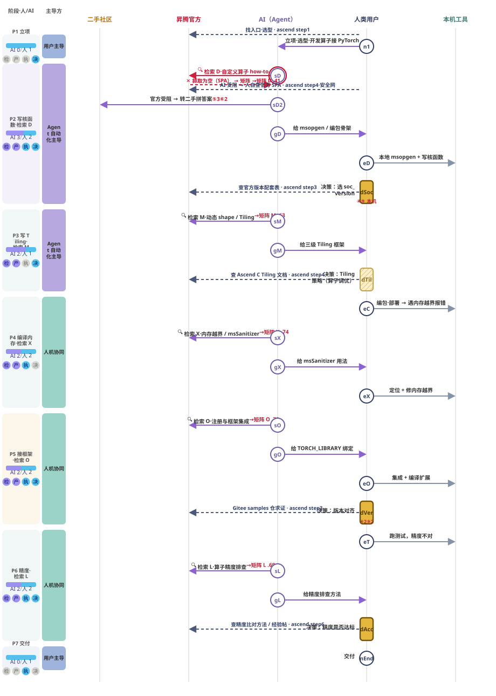

**② AI 主写 · 人审**（执行转交 AI；交接由 10 次降到 8 次，分支仍在）

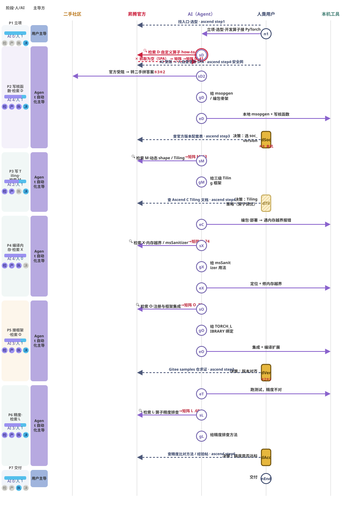

**③ 人委派 · AI 自管**（执行与决策全交 AI；**独立分支归零、安全网消失**，图上少了 6 条虚线）

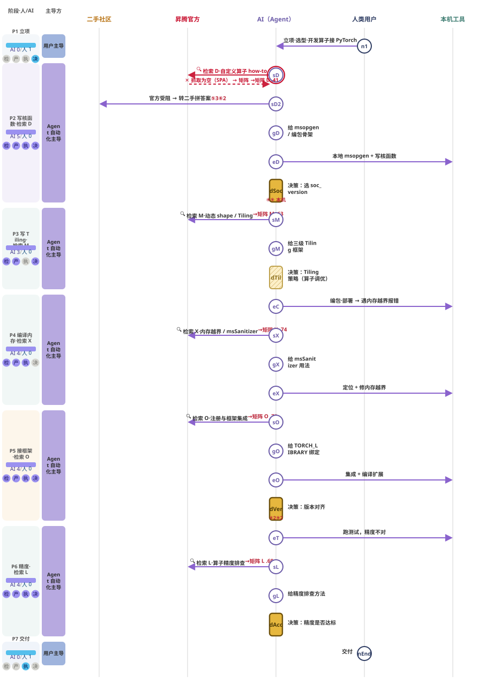


**任务分工 · 四轴**（原页折进生命线名里，现展开）：

| 轴 | 归属 | 是否随档位变 | 依据 |
| --- | --- | --- | --- |
| 检索 · 获取知识 | AI 100% | 恒 AI | 不论哪档，「搜什么 / 抓哪页 / 几轮够 / 怎么拼步骤骨架」始终由 AI 主导 |
| 产出 · 编写代码 | AI 为主（≈82%） | 恒 AI | 起草 msopgen 命令 / 核函数 / Tiling / aclnn 绑定 |
| 执行 · 本地运行 | ① 档：人 100%<br>②③ 档：AI 100% | **随档位转手** | 本地 msopgen / build.sh / 部署 OPP / 集成 / 跑测试 |
| 决策 · 裁定验收 | ① 档：人 100%<br>② 档：人（审批）<br>③ 档：AI（人终验） | **随档位转手** | soc_version / 版本 / 精度阈值等 A 类决策 |

> 原页特意说明**为何不写单一「AI 41%」**：那只是数了几个动作节点、是较弱的代理指标；换一轴比例就反转（按产出看 AI 为主、按执行 / 决策看归属）——拆四轴各看更诚实。

---

### 1.2 场景一 · 算子开发（原页默认场景）

开发一个 Ascend C 自定义算子并接入 PyTorch——沿时间串过 **5 次搜索（D 写 kernel → M Tiling → X 内存越界 → O 注册集成 → L 精度排查）**，每次对应 26 任务里不同的一个。**唯一官方真受阻的是写 kernel 的 D（.41）**。

#### 1.2.1 时序图（原图 · 档① 人主笔·AI 辅助）


#### 1.2.2 时序图（Mermaid 结构化等价）

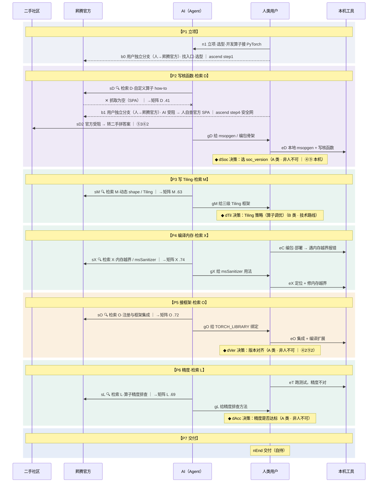

> 图为**档①**。切到档②③时 `gD/gM/gX/gO/gL` 的接收方由「人类用户」变为「AI 自身」，`eD/eC/eX/eO/eT` 的发起方也归 AI；6 条虚线（用户独立分支）在档③消失。

#### 1.2.2 阶段划分（含主导方与动作数）

| 阶段 | 时间步 | 主导方（该段动作多寡） | 人 / AI 动作数 | 该阶段边界说明（① 档口径） |
| --- | --- | --- | --- | --- |
| **P1 立项** | 0 | 用户主导 | AI 0 / 人 1 | `n1`<br>定目标「开发算子接 PyTorch」——一次开发沿时间撞上多次搜索。 |
| **P2 写核函数·检索 D** | 1–5 | Agent 自动化主导 | AI 3 / 人 2 | `sD–dSoc`<br>写核函数：**检索 D·自定义算子 how-to——整条旅程唯一官方真受阻的一搜（.41）**，转二手兜底；soc_version 非人不可。 |
| **P3 写 Tiling·检索 M** | 6–8 | Agent 自动化主导 | AI 2 / 人 1 | `sM / dTil`<br>写 Tiling：**检索 M**（官方可抓 .63，和 D 同子树却抓得到）；Tiling 策略＝算子调优。 |
| **P4 编译内存·检索 X** | 9–12 | 人机协同 | AI 2 / 人 2 | `eC–eX`<br>编译遇内存越界：**检索 X**（msSanitizer 官方满分可抓 .74，但二手薄）。 |
| **P5 接框架·检索 O** | 13–16 | 人机协同 | AI 2 / 人 2 | `sO–dVer`<br>接框架：**检索 O**（注册集成 .72）；版本对齐非人不可。 |
| **P6 精度·检索 L** | 17–20 | 人机协同 | AI 2 / 人 2 | `eT–dAcc`<br>精度排查：**检索 L**（.69）；精度达标由人按业务阈值判定。 |
| **P7 交付** | 21 | 用户主导 | AI 0 / 人 1 | `nEnd`<br>交付。 |

#### 1.2.3 时间步明细（22 步）

| # | 阶段 | 生命线 | 类型 | 标题 | 消息方向（frm → to） | 对应架构环节（`arch`） | 矩阵分 | 发生了什么 |
| --- | --- | --- | --- | --- | --- | --- | --- | --- |
| 0 | P1 立项 | 人类用户 | 起点 | **立项·选型·开发算子接 PyTorch** | 人类用户 → AI（Agent） | — | — | **用户给 AI 的原始输入：**「我要在昇腾 NPU 上写一个自定义算子（例如逐元素 AddCustom），用 Ascend C 实现，并注册进 PyTorch、能在 torch_npu 里调用——完整流程怎么走？」目标：开发一个 Ascend C 自定义算子并接入 PyTorch。立项即含**选型（step1 落地·找入口·选型）**——先去社区找入口、判断走 aclnn 简易工程还是完整自定义算子工程。之后这次开发会沿时间撞上多次搜索，每次对应 26 任务里不同的一个。 |
| 1 | P2 写核函数·检索 D | AI（Agent） | 检索（抓官方）·受阻 | **🔍 检索 D·自定义算子 how-to** | AI（Agent） → 昇腾官方 | — | →矩阵 D .41 | 写核函数前搜「怎么写自定义算子」。web_fetch 官方 how-to（devguide/opdevg SPA）正文抓取为空——**这是整条旅程唯一官方真受阻的一搜**。 |
| 2 | P2 写核函数·检索 D | AI（Agent） | 检索（多来源） | **官方受阻 → 转二手拼答案** | AI（Agent） → 二手社区 | — | ⑤3⑥2 | 官方抓不到，转 MindSpore 2.3.1 教程 + CSDN「AscendC 入门」+ 自带知识合成骨架。二手薄、扎堆 CSDN。 |
| 3 | P2 写核函数·检索 D | AI（Agent） | 起草 | **给 msopgen / 编包骨架** | AI（Agent） → 执行方（① 档＝人类用户，②③ 档＝AI） | — | — | 输出 msopgen gen ... 生成工程的步骤骨架，标注 soc_version 需核验。 |
| 4 | P2 写核函数·检索 D | 人类用户 | 执行 | **本地 msopgen + 写核函数** | 执行方（① 档＝人类用户，②③ 档＝AI） → 本机工具 | — | — | 用户在本机生成工程、写 Compute 核函数。 |
| 5 | P2 写核函数·检索 D | 人类用户 | 决策（A 类·非人不可） | **决策：选 soc_version** | 落在 人类用户 线上 | — | ④⑨ 本机 | AI 给不了本机芯片型号。用户 npu-smi info 查到 Ascend910B1。 |
| 6 | P3 写 Tiling·检索 M | AI（Agent） | 检索（抓官方） | **🔍 检索 M·动态 shape / Tiling** | AI（Agent） → 昇腾官方 | — | →矩阵 M .63 | 写 Tiling 时搜「动态 shape 怎么切」。opdevg Tiling 正文页 10_0047 ssr 可抓——和 D 同子树却抓得到。版本仍散、自带弱。 |
| 7 | P3 写 Tiling·检索 M | AI（Agent） | 起草 | **给三级 Tiling 框架** | AI（Agent） → 执行方（① 档＝人类用户，②③ 档＝AI） | — | — | 给 Copy-In/Compute/Copy-Out 三段流水线框架，留切分占位。 |
| 8 | P3 写 Tiling·检索 M | 人类用户 | 决策（B 类·技术路线） | **决策：Tiling 策略（算子调优）** | 落在 人类用户 线上 | — | — | **这一步＝算子级性能调优。**单核/多核切分、block 数、是否 double buffer，按本机实际 shape 定。 |
| 9 | P4 编译内存·检索 X | 人类用户 | 执行 | **编包·部署 → 遇内存越界报错** | 执行方（① 档＝人类用户，②③ 档＝AI） → 本机工具 | — | — | ash build.sh 编包、部署 OPP，运行时遇内存越界报错。 |
| 10 | P4 编译内存·检索 X | AI（Agent） | 检索（抓官方） | **🔍 检索 X·内存越界 / msSanitizer** | AI（Agent） → 昇腾官方 | — | →矩阵 X .74 | 搜「内存越界怎么定位」。官方 msSanitizer 文档 ③5 满分可抓——但二手仅 1 条、自带弱。 |
| 11 | P4 编译内存·检索 X | AI（Agent） | 起草 | **给 msSanitizer 用法** | AI（Agent） → 执行方（① 档＝人类用户，②③ 档＝AI） | — | — | 给 msSanitizer 命令与读法。 |
| 12 | P4 编译内存·检索 X | 人类用户 | 执行 | **定位 + 修内存越界** | 执行方（① 档＝人类用户，②③ 档＝AI） → 本机工具 | — | — | 用 msSanitizer 定位越界、修核函数。 |
| 13 | P5 接框架·检索 O | AI（Agent） | 检索（抓官方） | **🔍 检索 O·注册与框架集成** | AI（Agent） → 昇腾官方 | — | →矩阵 O .72 | 接 PyTorch 时搜「算子怎么注册集成」。doc_center SSR 镜像可抓。 |
| 14 | P5 接框架·检索 O | AI（Agent） | 起草 | **给 TORCH_LIBRARY 绑定** | AI（Agent） → 执行方（① 档＝人类用户，②③ 档＝AI） | — | — | 给 cpp_extension：TORCH_LIBRARY 注册、调 aclnn。 |
| 15 | P5 接框架·检索 O | 人类用户 | 执行 | **集成 + 编译扩展** | 执行方（① 档＝人类用户，②③ 档＝AI） → 本机工具 | — | — | 落地集成代码、编译扩展、import 验证。 |
| 16 | P5 接框架·检索 O | 人类用户 | 决策（A 类·非人不可） | **决策：版本对齐** | 落在 人类用户 线上 | — | ④2⑨2 | 确认本机 CANN 版本。实测版本散乱、目录 URL 会漂。 |
| 17 | P6 精度·检索 L | 人类用户 | 执行 | **跑测试，精度不对** | 执行方（① 档＝人类用户，②③ 档＝AI） → 本机工具 | — | — | 构造输入跑算子，与 CPU/GPU 参考比对，精度不达标。 |
| 18 | P6 精度·检索 L | AI（Agent） | 检索（抓官方） | **🔍 检索 L·算子精度排查** | AI（Agent） → 昇腾官方 | — | →矩阵 L .69 | 搜「算子精度怎么排查」。官方精度比对文档可抓，版本仍是短板。 |
| 19 | P6 精度·检索 L | AI（Agent） | 起草 | **给精度排查方法** | AI（Agent） → 执行方（① 档＝人类用户，②③ 档＝AI） | — | — | 给逐元素比对、定位误差来源的方法。 |
| 20 | P6 精度·检索 L | 人类用户 | 决策（A 类·非人不可） | **决策：精度是否达标** | 落在 人类用户 线上 | — | — | 按业务误差阈值判定。达标交付、不达标回改。 |
| 21 | P7 交付 | 人类用户 | 交付 | **交付** | 人类用户 → 自身（自持动作） | — | — | 算子开发完成、接入 PyTorch、精度达标，交付。 |

#### 1.2.4 用户独立分支（人 → 社区，脱离 AI 的独立动作，6 条）

| 触发于（节点 → 目标线） | 动作 | 说明 |
| --- | --- | --- |
| `n1` → 昇腾官方 · `ascend step1` | **找入口·选型** | 立项时人去昇腾社区找开发入口、判断走 aclnn 简易工程还是完整自定义算子工程。**【对应 ascend step1 落地·找入口·选型（据姊妹 UX 研究）】** · 单站全包、官网首页即露开发入口（不弱）；· 但**开发者中心埋在二级**，缺一个「先点这里」的最强单一 CTA。 |
| `sD` → 昇腾官方 · `ascend step4·安全网` | **AI 受阻 → 人自查官方 SPA** | AI fetch 受阻时，用户开浏览器人眼看渲染后正文——人能看到 AI 抓不到的内容（这条是安全网，非决策）。**档①②都在**：受阻时人仍会去看；**但前提是 AI 把受阻暴露给人**——若 AI 静默退二手不告知，人就看不到、安全网形同失效（越自主越不透明的风险）。**【对应 ascend step4 写·查文档（据姊妹 UX 研究 · 真实截图 2026-06-13）】** · 文档中心搜索框带字符上限（约 100 字），贴一整段报错会被**截断**；· 想去论坛提问，**发帖需登录华为账号**（门槛）；· 好在论坛按产品线分版（综合 / Ascend C / CANN…）、另有集中的 **AscendFAQ**，自助定位还算准。 |
| `dSoc` → 昇腾官方 · `ascend step3` | **查官方版本配套表** | 选 soc_version 时，人去查官方版本配套表、npu-smi 对应关系。**【对应 ascend step3 配环境·拿 SDK（据姊妹 UX 研究）】** · 多版本号并存，**选对版本本身就费劲**；· 想搜博客佐证，昇腾内容**SEO 偏弱、海外搜不到**。 |
| `dTil` → 昇腾官方 · `ascend step4` | **查 Ascend C Tiling 文档** | 定 Tiling 策略时，人去查 Ascend C Tiling 文档 / 样例。**【对应 ascend step4 写·查文档（据姊妹 UX 研究）】** · 文档中心搜索框**字符上限约 100 字**，长查询被截断；· 好在文档按 Ascend C 专版组织、定位还算准。 |
| `dVer` → 昇腾官方 · `ascend step3` | **Gitee samples 仓求证** | 版本对齐不确定时，人去 Gitee 官方 samples 仓对齐对应版本样例。**【对应 ascend step3 配环境·拿 SDK（据姊妹 UX 研究）】** · 想搜博客 / 帖子佐证版本，昇腾内容**SEO 偏弱、海外搜不到**、博客入口还埋在开发者中心二级；· Gitee 官方 samples 仓 + 按产品线分版的论坛，定位倒是准。 |
| `dAcc` → 昇腾官方 · `ascend step6` | **查精度比对方法 / 经验帖** | 判断精度是否达标时，人去查精度比对方法、求助论坛 / 经验帖。**【对应 ascend step6 调试·求助（据姊妹 UX 研究）】** · **发帖需登录华为账号**（门槛）；· 但论坛**按产品线分版**、另有集中的 **AscendFAQ**，自助定位还算准（长板）。 |

#### 1.2.5 决策点明细（4 个）

> 当前 `D_NODES` 里的决策点共 **4 个**：A 类 3 个、B 类 1 个。其中 `NDETAIL` 能命中的 **0 个** —— 详见文首「校订提示（2）」。

#### `dSoc` 决策：选 soc_version（A 类 · 非人不可）
> ⚠ 原页 `NDETAIL` 中**没有以 `dSoc` 为键的条目**，该决策的「决策依据 / 前置条件 / 决策链」在当前页面里不会弹出。内容仍存在数据层，见文末**附录 B**（按旧 ID 存放）。

**原页节点正文**：AI 给不了本机芯片型号。用户 npu-smi info 查到 Ascend910B1。

#### `dTil` 决策：Tiling 策略（算子调优）（B 类 · 技术路线）
> ⚠ 原页 `NDETAIL` 中**没有以 `dTil` 为键的条目**，该决策的「决策依据 / 前置条件 / 决策链」在当前页面里不会弹出。内容仍存在数据层，见文末**附录 B**（按旧 ID 存放）。

**原页节点正文**：**这一步＝算子级性能调优。**单核/多核切分、block 数、是否 double buffer，按本机实际 shape 定。

#### `dVer` 决策：版本对齐（A 类 · 非人不可）
> ⚠ 原页 `NDETAIL` 中**没有以 `dVer` 为键的条目**，该决策的「决策依据 / 前置条件 / 决策链」在当前页面里不会弹出。内容仍存在数据层，见文末**附录 B**（按旧 ID 存放）。

**原页节点正文**：确认本机 CANN 版本。实测版本散乱、目录 URL 会漂。

#### `dAcc` 决策：精度是否达标（A 类 · 非人不可）
> ⚠ 原页 `NDETAIL` 中**没有以 `dAcc` 为键的条目**，该决策的「决策依据 / 前置条件 / 决策链」在当前页面里不会弹出。内容仍存在数据层，见文末**附录 B**（按旧 ID 存放）。

**原页节点正文**：按业务误差阈值判定。达标交付、不达标回改。


---

### 1.3 场景二 · 训练

训练同样是 **5 次搜索的串联**，但与算子开发是**两种地形**：5 搜里**官方全部抓得到（② 全 4）**，最弱的 F 分布式也有 .72（中高）——没有 D 那种「.41 受阻、又最靠前」的深谷。真实摩擦不是文档受阻，而是**两类 AI 够不着的事实**：版本对齐、卡数 / 拓扑 / 显存 / 精度阈值。

#### 1.3.1 时序图（原图 · 档①）

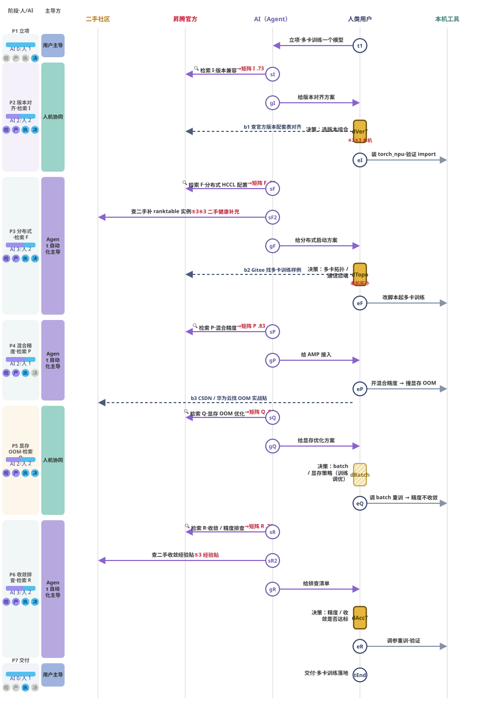

#### 1.3.2 时序图（Mermaid 结构化等价）

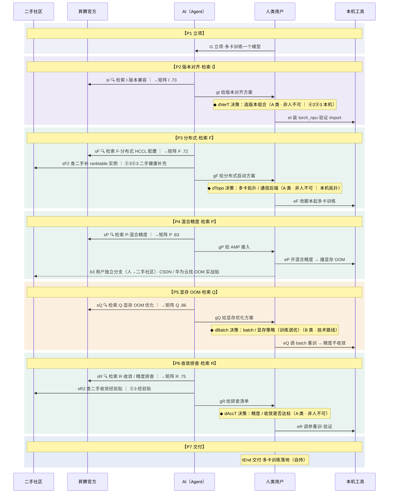

#### 1.3.2 阶段划分

| 阶段 | 时间步 | 主导方（该段动作多寡） | 人 / AI 动作数 | 该阶段边界说明（① 档口径） |
| --- | --- | --- | --- | --- |
| **P1 立项** | 0 | 用户主导 | AI 0 / 人 1 | `t1`<br>定目标「单卡脚本扩多卡昇腾训练」——AI 不介入。 |
| **P2 版本对齐·检索 I** | 1–4 | 人机协同 | AI 2 / 人 2 | `sI–eI / dVerT`<br>AI 检索版本配套 + 给对齐方案；用户按本机已装版本锁 torch_npu，并去官方配套表对齐（b1）。**官方抓得到，但版本号并存是训练第一坑。** |
| **P3 分布式·检索 F** | 5–9 | Agent 自动化主导 | AI 3 / 人 2 | `sF–eF / dTopo`<br>AI 抓官方 HCCL 机制 + **补二手 ranktable 实例（sF2）**；用户按本机卡数定拓扑、去 Gitee 找训练样例（b2）、起多卡。**本场景最弱的一搜（F .72，④版本散）。** |
| **P4 混合精度·检索 P** | 10–12 | Agent 自动化主导 | AI 2 / 人 1 | `sP–eP`<br>AI 给 AMP 接入；用户开混合精度提速，撞显存 OOM，自己也翻 CSDN 实战贴（b3）。 |
| **P5 显存 OOM·检索 Q** | 13–16 | 人机协同 | AI 2 / 人 2 | `sQ–eQ / dBatch`<br>AI 给显存优化（梯度累积 / 重计算）；用户按本机显存定 batch、重训。**最顺的一搜（Q .86）。** |
| **P6 收敛排查·检索 R** | 17–21 | Agent 自动化主导 | AI 3 / 人 2 | `sR–eR / dAccT`<br>AI 给收敛 / 精度排查清单 + **补二手经验贴（sR2）**；用户按业务阈值判定达标。 |
| **P7 交付** | 22 | 用户主导 | AI 0 / 人 1 | `tEnd`<br>多卡训练运行通过、精度收敛达标，交付。全程无受阻点。 |

#### 1.3.3 时间步明细（23 步）

| # | 阶段 | 生命线 | 类型 | 标题 | 消息方向（frm → to） | 对应架构环节（`arch`） | 矩阵分 | 发生了什么 |
| --- | --- | --- | --- | --- | --- | --- | --- | --- |
| 0 | P1 立项 | 人类用户 | 起点 | **立项·多卡训练一个模型** | 人类用户 → AI（Agent） | — | — | 已有单卡能运行的 PyTorch 训练脚本，目标扩到多卡昇腾 NPU 训练。一次训练落地会沿时间撞上多次搜索，每次对应 26 任务里不同的一个。 |
| 1 | P2 版本对齐·检索 I | AI（Agent） | 检索（抓官方） | **🔍 检索 I·版本兼容** | AI（Agent） → 昇腾官方 | ① 意图解析 → ③ 工具路由 → web_fetch 官方版本配套表 → ④ 研判（可抓） | →矩阵 I .73 | 开训前搜「torch_npu 与 CANN / PyTorch 版本怎么对」。官方版本配套表 + 二手命中——官方抓得到（②4），但版本号并存、需对本机已装版本。 |
| 2 | P2 版本对齐·检索 I | AI（Agent） | 起草 | **给版本对齐方案** | AI（Agent） → 执行方（① 档＝人类用户，②③ 档＝AI） | — | — | 给 CANN ↔ torch_npu ↔ PyTorch 的版本对应，标注需核对本机已装 CANN 版本。 |
| 3 | P2 版本对齐·检索 I | 人类用户 | 决策（A 类·非人不可） | **决策：选版本组合** | 落在 人类用户 线上 | — | ④2⑨3 本机 | AI 给不了本机已装的 CANN 版本。用户 npu-smi / pip 查本机版本，按配套表锁定 torch_npu。 |
| 4 | P2 版本对齐·检索 I | 人类用户 | 执行 | **装 torch_npu·验证 import** | 执行方（① 档＝人类用户，②③ 档＝AI） → 本机工具 | — | — | 按锁定版本装 torch_npu，import 验证环境通。 |
| 5 | P3 分布式·检索 F | AI（Agent） | 检索（抓官方） | **🔍 检索 F·分布式 HCCL 配置** | AI（Agent） → 昇腾官方 | ③ 工具路由 → web_fetch 官方 HCCL 页 → ④ 研判（ssr 可抓、但版本散） | →矩阵 F .72 | 搜「多卡怎么起、HCCL 怎么配」。官方 HCCL 页 ssr 可抓，但**版本散乱（④2）、二手同质**——本场景最弱的一搜（.72）。 |
| 6 | P3 分布式·检索 F | AI（Agent） | 检索（多来源） | **查二手补 ranktable 实例** | AI（Agent） → 二手社区 | ③ 工具路由 → web_search 二手（CSDN / 华为云）→ ⑥ 收敛（官方机制 + 二手实例合成） | ⑤3⑥3 二手健康补充 | 官方给机制、但完整 ranktable / 启动脚本实例多在 CSDN / 华为云开发者社区。**这里二手是「健康补充」——官方够用、二手添实例，区别于 D 的「官方塌了被迫转薄二手」。** |
| 7 | P3 分布式·检索 F | AI（Agent） | 起草 | **给分布式启动方案** | AI（Agent） → 执行方（① 档＝人类用户，②③ 档＝AI） | — | — | 给 init_process_group(backend='hccl') + ranktable / 环境变量 + 启动脚本骨架，留组网占位。 |
| 8 | P3 分布式·检索 F | 人类用户 | 决策（A 类·非人不可） | **决策：多卡拓扑 / 通信后端** | 落在 人类用户 线上 | — | 本机拓扑 | AI 给不了本机几张卡 / 怎么组网。用户按本机卡数、单机多卡 vs 多机定拓扑。 |
| 9 | P3 分布式·检索 F | 人类用户 | 执行 | **改脚本起多卡训练** | 执行方（① 档＝人类用户，②③ 档＝AI） → 本机工具 | — | — | 按方案改脚本、配 ranktable，启动多卡训练。 |
| 10 | P4 混合精度·检索 P | AI（Agent） | 检索（抓官方） | **🔍 检索 P·混合精度** | AI（Agent） → 昇腾官方 | ③ 工具路由 → web_search + web_fetch AMP 文档 → ⑥ 收敛（自带知识也够） | →矩阵 P .83 | 搜「混合精度怎么开」。官方 AMP / apex 文档可抓、自带知识也够（⑦4）——本场景较顺的一搜（.83）。 |
| 11 | P4 混合精度·检索 P | AI（Agent） | 起草 | **给 AMP 接入** | AI（Agent） → 执行方（① 档＝人类用户，②③ 档＝AI） | — | — | 给 torch_npu.npu.amp autocast + GradScaler 接入。 |
| 12 | P4 混合精度·检索 P | 人类用户 | 执行 | **开混合精度 → 撞显存 OOM** | 执行方（① 档＝人类用户，②③ 档＝AI） → 本机工具 | — | — | 开 AMP 提 batch 加速，运行时撞显存 OOM 报错。 |
| 13 | P5 显存 OOM·检索 Q | AI（Agent） | 检索（抓官方） | **🔍 检索 Q·显存 OOM 优化** | AI（Agent） → 昇腾官方 | ③ 工具路由 → web_search 显存优化 → ④ 研判（官方 + 二手都全） | →矩阵 Q .86 | 搜「OOM 怎么降显存」。官方显存优化 + 二手都全（①5、③5）——本场景最顺的一搜（.86）。 |
| 14 | P5 显存 OOM·检索 Q | AI（Agent） | 起草 | **给显存优化方案** | AI（Agent） → 执行方（① 档＝人类用户，②③ 档＝AI） | — | — | 给梯度累积 / 重计算 / batch 调整 / 释放策略。 |
| 15 | P5 显存 OOM·检索 Q | 人类用户 | 决策（B 类·技术路线） | **决策：batch / 显存策略（训练调优）** | 落在 人类用户 线上 | — | — | **这一步＝训练级调优。**按本机显存上限选 batch + 是否开重计算，权衡吞吐与显存。 |
| 16 | P5 显存 OOM·检索 Q | 人类用户 | 执行 | **调 batch 重训 → 精度不收敛** | 执行方（① 档＝人类用户，②③ 档＝AI） → 本机工具 | — | — | 调整后训练起来，但 loss 不收敛 / 精度对不上参考。 |
| 17 | P6 收敛排查·检索 R | AI（Agent） | 检索（抓官方） | **🔍 检索 R·收敛 / 精度排查** | AI（Agent） → 昇腾官方 | ③ 工具路由 → web_fetch 精度比对文档 → ④ 研判（可抓） | →矩阵 R .75 | 搜「精度 / 收敛怎么排查」。官方精度比对 + 二手可抓（③5），版本仍是短板。 |
| 18 | P6 收敛排查·检索 R | AI（Agent） | 检索（多来源） | **查二手收敛经验贴** | AI（Agent） → 二手社区 | ③ 工具路由 → web_search 二手收敛经验 → ⑥ 收敛 | ⑤3 经验贴 | loss 不收敛 / 精度对不齐的实战经验多在 CSDN / 知乎 / 华为云 bbs。二手在收敛排查上是有用补充，非被迫兜底。 |
| 19 | P6 收敛排查·检索 R | AI（Agent） | 起草 | **给排查清单** | AI（Agent） → 执行方（① 档＝人类用户，②③ 档＝AI） | — | — | 给 loss scaling / 数据管线 / lr / 算子精度逐项排查清单。 |
| 20 | P6 收敛排查·检索 R | 人类用户 | 决策（A 类·非人不可） | **决策：精度 / 收敛是否达标** | 落在 人类用户 线上 | — | — | 按业务精度阈值 + 收敛曲线判定。达标交付、不达标回调。 |
| 21 | P6 收敛排查·检索 R | 人类用户 | 执行 | **调参重训·验证** | 执行方（① 档＝人类用户，②③ 档＝AI） → 本机工具 | — | — | 按清单调参、重训，验证收敛与精度。 |
| 22 | P7 交付 | 人类用户 | 交付 | **交付·多卡训练落地** | 人类用户 → 自身（自持动作） | — | — | 多卡训练运行通过、精度收敛达标，交付。全程官方都抓得到，无 D 那种受阻点。 |

#### 1.3.4 用户独立分支（3 条）

| 触发于（节点 → 目标线） | 动作 | 说明 |
| --- | --- | --- |
| `dVerT` → 昇腾官方 | **查官方版本配套表对齐** | 版本不确定时，用户去 hiascend 官方版本配套表 / Gitee 仓对齐 torch_npu 与 CANN 版本。**【人自己用社区会撞到什么（据姊妹 UX 研究 · 真实截图 2026-06-13）】** · 文档中心搜索框带**字符上限（约 100 字）**，长查询 / 报错会被截断；· 好在配套问题多能在**集中的 AscendFAQ** 自助查到。 |
| `dTopo` → 昇腾官方 | **Gitee 找多卡训练样例** | 多卡拓扑 / ranktable 不确定时，用户去 Gitee 昇腾官方 samples 仓找多卡训练样例对齐。**【人自己用社区会撞到什么（据姊妹 UX 研究）】** · 想去论坛问拓扑，**发帖需登录华为账号**；· 论坛按产品线分版（MindSpeed / CANN…）定位准、Gitee 样例可直接照抄。 |
| `eP` → 二手社区 | **CSDN / 华为云找 OOM 实战贴** | 撞显存 OOM 时，用户也会自己去 CSDN / 华为云开发者社区翻实战经验贴——训练里人和二手社区也有直接交互。**【人自己用社区会撞到什么（据姊妹 UX 研究）】** · 官方搜不到就转二手，但昇腾二手**SEO 一般、内容偏同质**（扎堆 CSDN）；· 华为云开发者社区 bbs 的实战贴能整页读到，是有用补充。 |

#### 1.3.5 决策点明细（4 个）

#### `dVerT` 决策：选版本组合（A 类 · 非人不可）
- **决策依据**：**决策依据**：torch_npu 必须与本机已装的 CANN / PyTorch 版本严格配套，错配则 import 失败 / 算子缺失。AI 给得了配套表，**但给不了本机实际装的是哪个版本**。
- **前置条件**：能在本机查到已装 CANN / PyTorch 版本。

**人做版（档①②·实测口径）**

| 阶段 | 平台 / 工具 | 具体动作 |
| --- | --- | --- |
| ① 接收 | AI 对话界面 | AI 给 CANN↔torch_npu↔PyTorch 配套表。 |
| ② 研判 | npu-smi info（CANN） | 在本机查已装 CANN 版本。 |
| ③ 决策 | hiascend 版本配套表 | 按本机版本从配套表锁 torch_npu。 |
| ④ 反馈 | 本机终端 | 装锁定版本、import 验证。 |

**AI 接管版（档③·原页标注为「推演」）**

| 阶段 | 平台 / 工具 | 具体动作 |
| --- | --- | --- |
| ① 接收 | Agent 运行时 | 自动流程需定版本组合。 |
| ② 研判 | Agent 运行时 | AI 拿到配套表但缺本机已装版本。 |
| ③ 决策 | ⚠ AI 按最新版 | 推演：AI 默认按最新版——与本机实际已装版本未必对得上，import 可能直接失败。 |
| ④ 反馈 | Agent 运行时 | 按所选继续。 |

#### `dTopo` 决策：多卡拓扑 / 通信后端（A 类 · 非人不可）
- **决策依据**：**决策依据**：多卡拓扑（几张卡 / 单机多卡 / 多机）、ranktable 与本机组网强相关。AI 给得了 HCCL 模板，**给不了本机硬件拓扑**。
- **前置条件**：知道本机卡数与组网方式。

**人做版（档①②·实测口径）**

| 阶段 | 平台 / 工具 | 具体动作 |
| --- | --- | --- |
| ① 接收 | AI 对话界面 | AI 给 HCCL 启动 + ranktable 模板。 |
| ② 研判 | npu-smi info（CANN） | 在本机看几张卡、组网。 |
| ③ 决策 | 本机硬件拓扑 | 按本机卡数定单机多卡 / 多机方案。 |
| ④ 反馈 | 本机终端 | 配 ranktable、启动多卡。 |

**AI 接管版（档③·原页标注为「推演」）**

| 阶段 | 平台 / 工具 | 具体动作 |
| --- | --- | --- |
| ① 接收 | Agent 运行时 | 自动流程需定拓扑。 |
| ② 研判 | Agent 运行时 | AI 缺本机卡数 / 组网事实。 |
| ③ 决策 | ⚠ AI 按默认单机 | 推演：AI 假设单机 8 卡——与实际组网不符则启动失败。 |
| ④ 反馈 | Agent 运行时 | 按假设继续。 |

#### `dBatch` 决策：batch / 显存策略（训练调优）（B 类 · 技术路线）
- **决策依据**：**决策依据**：batch 大小、是否开重计算是**吞吐 vs 显存的权衡**——AI 能给策略，最终值要按本机显存上限定。这一步属训练级调优。
- **前置条件**：知道本机单卡显存上限与当前占用。

**人做版（档①②·实测口径）**

| 阶段 | 平台 / 工具 | 具体动作 |
| --- | --- | --- |
| ① 接收 | AI 对话界面 | AI 给梯度累积 / 重计算 / batch 调整选项。 |
| ② 研判 | 本机终端（显存占用） | 看当前显存占用与 OOM 余量。 |
| ③ 决策 | 本机显存上限 | 按显存定 batch + 是否开重计算。 |
| ④ 反馈 | 本机终端 | 调整后重训。 |

**AI 接管版（档③·原页标注为「推演」）**

| 阶段 | 平台 / 工具 | 具体动作 |
| --- | --- | --- |
| ① 接收 | Agent 运行时 | 自动流程需定 batch。 |
| ② 研判 | Agent 运行时 | AI 按通用经验估 batch。 |
| ③ 决策 | ⚠ AI 估 batch | 推演：AI 按通用值设 batch——本机显存不同则可能仍 OOM 或浪费算力。 |
| ④ 反馈 | Agent 运行时 | 按估值继续。 |

#### `dAccT` 决策：精度 / 收敛是否达标（A 类 · 非人不可）
- **决策依据**：**决策依据**：收敛 / 精度是否达标是**带业务容忍度的价值判断**——AI 没有业务精度阈值与收敛基准。
- **前置条件**：定好业务精度阈值 / 收敛判据。

**人做版（档①②·实测口径）**

| 阶段 | 平台 / 工具 | 具体动作 |
| --- | --- | --- |
| ① 接收 | AI 对话界面 | AI 给收敛 / 精度排查方法。 |
| ② 研判 | 本机（loss 曲线 + 比对） | 看收敛曲线、与参考精度比对。 |
| ③ 决策 | 业务需求（精度阈值） | 按业务阈值判定达标。 |
| ④ 反馈 | AI 对话界面 | 达标交付 / 不达标回调。 |

**AI 接管版（档③·原页标注为「推演」）**

| 阶段 | 平台 / 工具 | 具体动作 |
| --- | --- | --- |
| ① 接收 | Agent 运行时 | 训练出结果需判精度。 |
| ② 研判 | Agent 运行时 | AI 无业务阈值 / 收敛基准。 |
| ③ 决策 | ⚠ AI 按通用阈值 | 推演：AI 按通用阈值判 → 未必符合业务要求。 |
| ④ 反馈 | Agent 运行时 | 按通用阈值放行 / 驳回。 |


---

### 1.4 场景三 · 迁移（已归档 · 备扩）

原页把该场景归档备扩（`ARCHIVED_G`），数据仍在页内，**不参与 Tab 切换**。

#### 1.4.1 时序图（Mermaid —— 该场景**没有原图**）

> 原页把迁移场景放进 `ARCHIVED_G`，**没有注册进 `SCENARIOS`**，Tab 切换里也不出现，所以页面从未渲染过它。
> 另外 `G_FLOW` 里的目标写的是 **`comm`**，而 `renderV()` 的坐标表 `LX` 只有 `sec/off/ai/hu/tool` 五条线——一旦把这个场景接进 `SCENARIOS` 就会算出 `NaN` 坐标、箭头全乱。**故此处只给 Mermaid 版**（按「社区（官方 / 二手）」合并表示）。

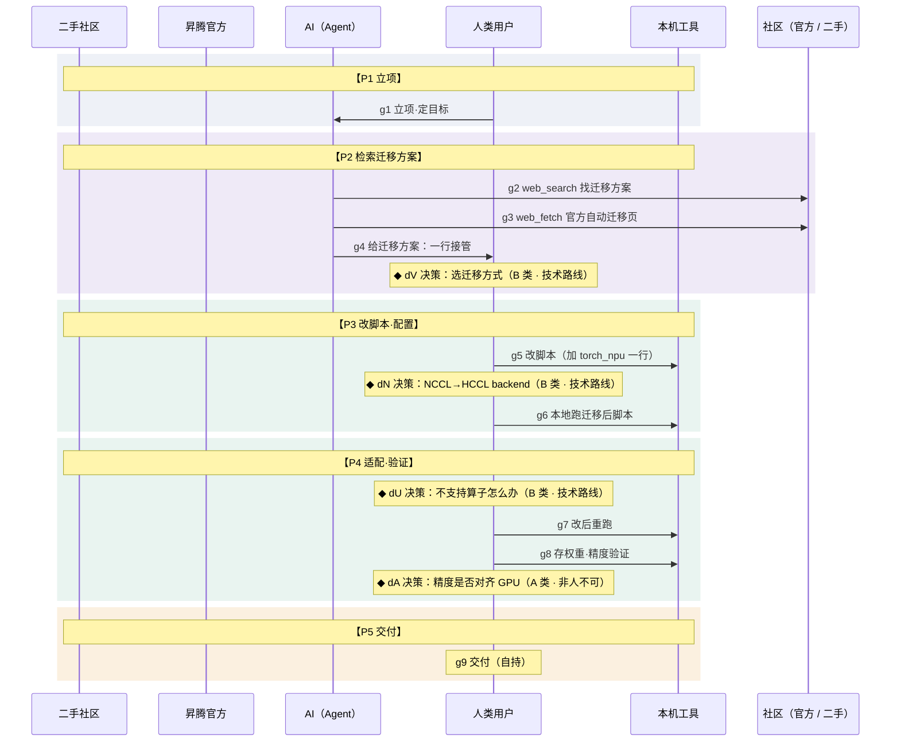

#### 1.4.2 阶段划分

| 阶段 | 时间步 | 主导方（该段动作多寡） | 人 / AI 动作数 | 该阶段边界说明（① 档口径） |
| --- | --- | --- | --- | --- |
| **P1 立项** | 0 | 用户主导 | AI 0 / 人 1 | `g1`<br>定目标「把 CUDA 脚本迁到 NPU」——AI 不介入。 |
| **P2 检索迁移方案** | 1–4 | Agent 自动化主导 | AI 3 / 人 1 | `g2–g4 / dV`<br>AI 自主检索 + 抓官方自动迁移页（ssr 可抓、主路径全）+ 给一行接管；用户选迁移方式。**G 顺畅的根源——官方页没受阻**。 |
| **P3 改脚本·配置** | 5–7 | 用户主导 | AI 0 / 人 3 | `g5 / dN / g6`<br>用户加一行 + 改显式 backend，本地直接跑。 |
| **P4 适配·验证** | 8–11 | 用户主导 | AI 0 / 人 4 | `dU / g7 / g8`<br>遇不支持算子按分析报告处理、重跑、存权重比对精度。 |
| **P5 交付** | 12 | 用户主导 | AI 0 / 人 1 | `dA / g9`<br>精度由人判定（对齐 GPU 参考），达标交付。 |

#### 1.4.3 时间步明细（13 步）

| # | 阶段 | 生命线 | 类型 | 标题 | 消息方向（frm → to） | 对应架构环节（`arch`） | 矩阵分 | 发生了什么 |
| --- | --- | --- | --- | --- | --- | --- | --- | --- |
| 0 | P1 立项 | 人类用户 | 起点 | **立项·定目标** | 人类用户 → AI（Agent） | — | — | 有一份 PyTorch CUDA 训练脚本，目标迁移到昇腾 NPU 跑起来。需求归人。 |
| 1 | P2 检索迁移方案 | AI（Agent） | 检索（多来源） | **web_search 找迁移方案** | AI（Agent） → 社区（官方 / 二手） | ① 意图解析 → ② 子目标拆解 → ③ 工具路由 → web_search | — | 模型检索迁移方式。实测命中：hiascend 自动迁移页、ms_fmk_transplt 分析迁移工具、华为云 ModelArts 迁移最佳实践、知乎/CSDN/博客园。 |
| 2 | P2 检索迁移方案 | AI（Agent） | 检索（抓官方） | **web_fetch 官方自动迁移页** | AI（Agent） → 社区（官方 / 二手） | ③ 工具路由 → web_fetch 官方自动迁移页 → ④ 研判（ssr 可抓、正文详尽）→ ⑥ 收敛 | — | 抓 hiascend atlasfmkt_16_0036（devaids/auxiliarydevtool）——**ssr 可抓且详尽**：transfer_to_npu 一行接管 + 步骤 + NCCL 自动转 HCCL + 明列支持 PyTorch 1.11/2.1/2.2。对比 D 的 s3 受阻，这里官方页直接拿到主路径全文。 |
| 3 | P2 检索迁移方案 | AI（Agent） | 起草 | **给迁移方案：一行接管** | AI（Agent） → 执行方（① 档＝人类用户，②③ 档＝AI） | ⑥ 收敛 → 终答（end_turn） | — | 输出 import torch_npu + from torch_npu.contrib import transfer_to_npu（一行自动迁移），并标注一键只覆盖简单场景、自定义算子/jit/channel_last 需手工适配。end_turn。 |
| 4 | P2 检索迁移方案 | 人类用户 | 决策（B 类·技术路线） | **决策：选迁移方式** | 落在 人类用户 线上 | — | — | 一键 transfer_to_npu（覆盖简单场景）vs 分析迁移工具 ms_fmk_transplt（出迁移报告、识别不支持 API）。按脚本复杂度选。 |
| 5 | P3 改脚本·配置 | 人类用户 | 执行 | **改脚本（加 torch_npu 一行）** | 执行方（① 档＝人类用户，②③ 档＝AI） → 本机工具 | — | — | 用户在脚本头部加 import torch_npu + transfer_to_npu 一行。 |
| 6 | P3 改脚本·配置 | 人类用户 | 决策（B 类·技术路线） | **决策：NCCL→HCCL backend** | 落在 人类用户 线上 | — | — | transfer_to_npu 自动转 backend，但脚本里**显式写死 nccl 的地方**需手改 hccl。 |
| 7 | P3 改脚本·配置 | 人类用户 | 执行 | **本地跑迁移后脚本** | 执行方（① 档＝人类用户，②③ 档＝AI） → 本机工具 | — | — | 在 NPU 上直接运行改后的脚本。 |
| 8 | P4 适配·验证 | 人类用户 | 决策（B 类·技术路线） | **决策：不支持算子怎么办** | 落在 人类用户 线上 | — | — | 遇不支持 API/算子：用分析迁移工具识别 / 改 npu_native_functions.yaml 挪 CPU / 写自定义 Ascend C。 |
| 9 | P4 适配·验证 | 人类用户 | 执行 | **改后重跑** | 执行方（① 档＝人类用户，②③ 档＝AI） → 本机工具 | — | — | 按选定方案处理不支持算子后重跑。 |
| 10 | P4 适配·验证 | 人类用户 | 执行 | **存权重·精度验证** | 执行方（① 档＝人类用户，②③ 档＝AI） → 本机工具 | — | — | 运行通过后存权重，与 GPU 侧参考输出比对精度。 |
| 11 | P4 适配·验证 | 人类用户 | 决策（A 类·非人不可） | **决策：精度是否对齐 GPU** | 落在 人类用户 线上 | — | — | 迁移后精度是否对齐 GPU 是带业务容忍度的判断，AI 替不了。 |
| 12 | P5 交付 | 人类用户 | 交付 | **交付** | 人类用户 → 自身（自持动作） | — | — | 脚本迁移到 NPU、精度对齐，交付。AI 仅辅助汇总。 |

#### 1.4.4 决策点明细（4 个）

#### `dV` 决策：选迁移方式（B 类 · 技术路线）
- **决策依据**：**决策依据**：一键 transfer_to_npu 覆盖简单场景、快；分析迁移工具 ms_fmk_transplt 出迁移报告、识别不支持 API。选哪条取决于脚本是否含 jit / 自定义算子等复杂场景。
- **前置条件**：了解两种工具的覆盖范围；清楚本脚本复杂度。

**人做版（档①②·实测口径）**

| 阶段 | 平台 / 工具 | 具体动作 |
| --- | --- | --- |
| ① 接收 | AI 对话界面 | AI 列一键 vs 分析工具两种方式及取舍。 |
| ② 研判 | hiascend 自动迁移文档 | 读官方页看一键覆盖范围与限制。 |
| ③ 决策 | 项目需求（脚本复杂度） | 简单脚本选一键 transfer_to_npu。 |
| ④ 反馈 | AI 对话界面 | 据此给一行接管代码。 |

**AI 接管版（档③·原页标注为「推演」）**

| 阶段 | 平台 / 工具 | 具体动作 |
| --- | --- | --- |
| ① 接收 | Agent 运行时 | 自动流程需选迁移方式。 |
| ② 研判 | Agent 运行时 | AI 按脚本特征评估两条路线。 |
| ③ 决策 | ⚠ AI 自主选 | 推演：默认选一键——但脚本是否含 jit / 自定义算子等复杂场景 AI 未必看全。 |
| ④ 反馈 | Agent 运行时 | 按所选继续。 |

#### `dN` 决策：NCCL→HCCL backend（B 类 · 技术路线）
- **决策依据**：**决策依据**：transfer_to_npu 自动把 NCCL backend 转 HCCL，但脚本里**显式写死 nccl 字符串处**需手改 hccl。
- **前置条件**：知道脚本里哪里显式写了 backend。

**人做版（档①②·实测口径）**

| 阶段 | 平台 / 工具 | 具体动作 |
| --- | --- | --- |
| ① 接收 | AI 对话界面 | AI 提示 backend 自动转、但显式处需手改。 |
| ② 研判 | 本机脚本（grep backend） | 查脚本里显式写死的 nccl 串。 |
| ③ 决策 | 本机脚本 | 把显式 nccl 改成 hccl。 |
| ④ 反馈 | 本机终端 | 改后继续运行。 |

**AI 接管版（档③·原页标注为「推演」）**

| 阶段 | 平台 / 工具 | 具体动作 |
| --- | --- | --- |
| ① 接收 | Agent 运行时 | 自动流程需处理 backend。 |
| ② 研判 | Agent 运行时 | AI 扫描脚本里的 backend 串。 |
| ③ 决策 | ⚠ AI 自动替换 | 推演：AI 自动替换——但显式 backend 散落处 / 条件分支 AI 未必扫全。 |
| ④ 反馈 | Agent 运行时 | 自动改后继续。 |

#### `dU` 决策：不支持算子怎么办（B 类 · 技术路线）
- **决策依据**：**决策依据**：跑时遇不支持的 API/算子——用分析迁移工具识别 / 改 npu_native_functions.yaml 把算子挪 CPU / 写自定义 Ascend C。一键迁移只覆盖简单场景，复杂处需手工适配。
- **前置条件**：能定位是哪个算子/API 不支持。

**人做版（档①②·实测口径）**

| 阶段 | 平台 / 工具 | 具体动作 |
| --- | --- | --- |
| ① 接收 | 本机终端（报错） | 跑时报某算子 / API 不支持。 |
| ② 研判 | ms_fmk_transplt 分析报告 | 用分析迁移工具识别不支持项。 |
| ③ 决策 | hiascend 文档 | 选挪 CPU（改 yaml）还是写自定义算子。 |
| ④ 反馈 | 本机脚本 | 按选定方案改。 |

**AI 接管版（档③·原页标注为「推演」）**

| 阶段 | 平台 / 工具 | 具体动作 |
| --- | --- | --- |
| ① 接收 | Agent 运行时 | AI 拿到不支持算子报错。 |
| ② 研判 | Agent 运行时 | AI 按报错推断处理方式。 |
| ③ 决策 | ⚠ AI 自主选 | 推演：AI 默认挪 CPU——但挪 CPU 对精度 / 性能的影响缺人校准。 |
| ④ 反馈 | Agent 运行时 | 自动改后重跑。 |

#### `dA` 决策：精度是否对齐 GPU（A 类 · 非人不可）
- **决策依据**：**决策依据**：迁移后存权重、与 GPU 参考输出比对，精度是否对齐 GPU 是**带业务容忍度的价值判断**，AI 没有 GPU 参考基准与业务阈值。
- **前置条件**：有 GPU 侧参考权重 / 输出；定好误差阈值。

**人做版（档①②·实测口径）**

| 阶段 | 平台 / 工具 | 具体动作 |
| --- | --- | --- |
| ① 接收 | AI 对话界面 | AI 给精度验证方法。 |
| ② 研判 | 本机（跑 + 比对 GPU 参考） | 跑迁移后脚本，与 GPU 输出逐项比对。 |
| ③ 决策 | 业务需求（精度阈值） | 按业务阈值判定是否对齐。 |
| ④ 反馈 | AI 对话界面 | 达标交付 / 不达标回查。 |

**AI 接管版（档③·原页标注为「推演」）**

| 阶段 | 平台 / 工具 | 具体动作 |
| --- | --- | --- |
| ① 接收 | Agent 运行时 | 迁移后出结果，需判精度。 |
| ② 研判 | Agent 运行时 | AI 没有 GPU 参考基准 / 业务容忍度。 |
| ③ 决策 | ⚠ AI 按通用阈值 | 推演：AI 按通用阈值判 → 未必符合你的业务要求。 |
| ④ 反馈 | Agent 运行时 | 按通用阈值放行 / 驳回。 |


---

### 1.5 综述 · 算子开发场景旅程（串 5 次搜索 · 最弱 D .41）

用**时序图独有的「时间 + 协同」视角**（横截面 19 看不出的）收敛成 **3 个判断 + 行动建议**——可用性**逐段在变·被最弱环节拖着**、人机**交接质量**、体感**前松后紧**。

#### 判断 1 · 一个算子开发是 5 次搜索的串联，被最弱、又最靠前的「写 kernel」拖着

> 核心一问：开发一个算子，AI 的可用性是一个数，还是一路在变？

开发一个算子**不是搜一次**，是沿时间撞上 **5 次搜索**：写 kernel(D) → Tiling(M) → 内存越界(X) → 注册集成(O) → 精度排查(L)。可用性**一路在变**，不是一个数。

5 次里 **4 次官方都抓得到**（M.63 / X.74 / O.72 / L.69，各有版本 / 二手的小坑），**只有写 kernel 的 D 官方真受阻（.41）**。但整条路的体感被 D 拖着——因为它**又最弱、又最靠前**：kernel 写不出，后面 Tiling / 编译 / 精度全建在二手地基上，到编译才报错。**场景可用性 ≈ 最弱且最靠前的那一搜。**

**怎么改**：优先修**最靠前的瓶颈**——把写 kernel 那页（opdevg）静态化（治本，见 19）；在此之前，AI 抓取为空时**显式报「官方未取得、以下二手」**，别让错误地基静默往下传。

**5 次搜索的可用性**（原页是 5 根横向条形，数值＝该搜的综合置信度 ×100）：

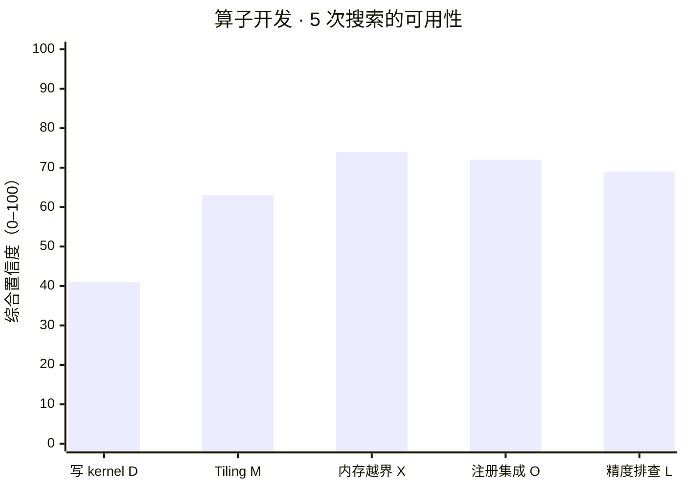

| 次序 | 搜索 | 值 | 原页标注 |
| --- | --- | --- | --- |
| 1 | 写 kernel | **41 / 100** | D .41 受阻 |
| 2 | Tiling | **63 / 100** | M .63 |
| 3 | 内存越界 | **74 / 100** | X .74 |
| 4 | 注册集成 | **72 / 100** | O .72 |
| 5 | 精度排查 | **69 / 100** | L .69 |

> 4 次官方都抓得到，唯独写 kernel 的 D 受阻、且最靠前——整条路被它拖着（横截面 19 给不出这条「逐段」曲线）。

**供给侧治本 / 使用侧治标**（原页两张 lo-fi 卡）：

| 侧 | 位置 | 现状 | 改后 |
| --- | --- | --- | --- |
| 昇腾社区侧 · 治根 | 官方文档站 · opdevg 写 kernel 页 | 现状（SPA）：`web_fetch` 只回导航 + meta、**正文 0 字**——AI 抓取为空，错误地基由此而起 | 改后（静态化）：正文 HTML 内含 msopgen 命令 + 参数表，**AI 一次抓全**、不必转二手 |
| AI 使用侧 · 治标 | AI 助手 · 回答 | 未加防护：抓不到就静默往下写 | 显式警示：`⚠ 官方 how-to 页未取得（SPA 抓取为空）；以下据二手 + 自带知识，请核对官方`；步骤逐条标来源（步骤一 `二手` / 步骤二 `自带知识`） |

#### 判断 2 · 真正卡住 D 的不是「技术难」，是人机「交接」的质量

> 核心一问：一次 D 开发，AI 和人交接了多少次？哪里最容易出问题？

时序图数得出来：全旅程**人机交接 10 次**（档①；原页文案写「约 8–10 次」，档②为 8 次、档③为 2 次），每一次交接都是一道**信息可能丢失的关口**：AI 给的命令带占位、人填错；人回灌的报错不全、AI 解读偏。**卡的不是「算子难写」，是这条人机流水线的接口质量。**

**怎么改**：把**交接做成产品的一等公民**——AI 主动标「这里要你填什么」、报错能**一键完整回灌**、每个交接点留 checkpoint。

**交接热度**（原页是「P2 检索 / P3 生成 / P4 核函数 / P5 编译部署 / P6 接入」的圆点行；该处阶段名是**另一套旧口径**，与当前 7 阶段对不上。下表按当前节点划分现算）：

| 档 | 阶段内交接分布（P1→P7） | 合计 |
| --- | --- | --- |
| ① 人主笔 | 0 · 1 · 1 · **2** · 1 · **2** · 0 | **10** |
| ② AI 主写 | 0 · 1 · 1 · 0 · 1 · 1 · 0 | **8** |
| ③ 人委派 | 0 · 0 · 0 · 0 · 0 · 0 · 0 | **2** |

> 算法：`handoffs(lvl)` = 相邻节点归属方发生变化的次数；「阶段内」为落在同一阶段内的相邻变化。按此口径，档①**最密的是 P4 编译内存 与 P6 精度（各 2 次）**，并非原页文案所说的「P5 编译部署段最密」——原页该处引用的是一套已被替换的阶段划分（检索 / 生成 / 核函数 / 编译部署 / 接入）。

| 侧 | 位置 | 现状 | 改后 |
| --- | --- | --- | --- |
| 昇腾社区侧 | 官方文档站 · 命令示例 | 命令散在正文、soc_version 不说怎么取 → AI 只能现编占位、人填错 | 一个可照抄块 + 内联「npu-smi info 查芯片」步骤 → 少一次人机来回 |
| AI 使用侧 | AI 助手 · 交接点 | 无标注：`msopgen … -c ai_core_` 直接给出，占位不显眼 | 运行处挂 `▢ 需你填 soc_version`；报错区提供「粘到这里，自动回灌给我解读」+ `一键回灌 ⟳` |

> 交接占位的根源一半在官方命令不完整——供给侧把命令做全，使用侧的交接负担自然轻。

#### 判断 3 · 体感「前松后紧」：AI 在检索段给虚假信心，落地段把人独自留下

> 核心一问：开发者走完这条路，「顺 / 难」的体感曲线是什么形状？

把旅程当一条体感曲线：**前段（检索 / 起草）AI 很顺、很能干**，给人「这件事 AI 能完成」的**虚假信心**；**后段（编译 / 部署 / 精度）越来越是人独自承担**，AI 退成旁边解读报错的副驾。

曲线最低点是 **A 类决策**（soc_version / 版本 / 精度）——AI 够不着本机 / 业务事实、只能猜，恰好都落在后半段：**前面越顺，这里落差越大**。真正的风险不是「AI 不行」，而是**「先让你以为可行、到深水区才发现得自己来」**。

**怎么改**：把这条**落差曲线显式化**——旅程一开始就告诉用户「这条路后段有 3 处只能你来（要本机芯片 / 版本 / 业务阈值）」，**别让落差到深水区才暴露**。

**体感弧线**（原页是一条 SVG 曲线 + 最低点标记；本文按段还原）：

| 旅程段 | 主导内容 | 谁在承担 | 体感 |
| --- | --- | --- | --- |
| 前段 · 检索 / 起草（P2） | 写 kernel 的 how-to 检索、拼骨架 | AI | **很顺、很能干** → 产生「这件事 AI 能完成」的虚假信心 |
| 中段 · 生成 / 执行（P3–P5） | Tiling、编包、集成 | 人机交替 | 逐步转向人执行 |
| 后段 · 编译 / 部署 / 精度（P4–P6） | 内存越界、版本、精度 | **人独自承担** | **落到最低点**；AI 退成解读报错的副驾 |
| 最低点 · A 类决策 ×3 | soc_version / 版本 / 精度阈值 | 人（AI 只能猜） | 恰好都在后半段 → **前面越顺，落差越大** |

| 侧 | 位置 | 现状 | 改后 |
| --- | --- | --- | --- |
| 昇腾社区侧 | 官方文档站 · 版本 | 多版本号并存、URL 还会漂——AI 锁不准版本 | 一个 canonical + 配套查询器（选机型 → 唯一命令） |
| AI 使用侧 | 开始前 · 本任务路线预览 | 无预告 | 路线图：`检索·起草（AI 主导）→ 生成工程（AI）→ ⚠ 选芯片（需你来）→ 编译·部署（协同）→ ⚠ 版本·精度（需你来）` |

> 但 soc_version / 精度阈值这两处 A 类**本质是本机 / 业务事实，供给侧治不了**——只能靠使用侧前置告知。「版本」是其中唯一能被供给侧治的一处。前段 AI 顺，后段有 3 处只能你亲自来——开始就告知，不到深水区才暴露。

**行动建议 · Agent / 产品体验侧**（供给侧文档站的 ROI 排序见 19）：

| 优先级 | 建议 | 对应节点 | 预期收益 |
| --- | --- | --- | --- |
| P0 | 先修**最靠前的瓶颈**：写 kernel 页 opdevg 静态化 + 抓不到「响亮」标注 | 判断 1 · `sD` | 把最弱且最靠前的环节抬起来 |
| P0 | 人机**交接做成一等公民**：AI 标需填项 + 报错一键完整回灌 | 判断 2 · 编译段 | 降交接处信息丢失 |
| P1 | **「前松后紧」前置告知**：旅程开头标后段需人核验的点 | 判断 3 · A 类 | 管理预期、不在深水区才报错 |
| P1 | 供给侧治本（opdevg 静态化 / 版本收口 / 补二手） | → 见 19 | 把原料做好，所有 AI 工具受益 |

> **总论：AI 能搬来知识，搬不动你的机器**——而且这条路是**「前松后紧」**的：真正的问题不是某个分数低，是**早期一次静默失败沿时间放大 + 后段人独自承担**。这是只有走一遍旅程才看得出的体感结论。

---

### 1.6 综述 · 训练场景旅程（串 5 次搜索 · 最弱 .72，无受阻深谷）

同样用**时序图独有的「时间 + 协同」视角**看**训练**这条路：单卡脚本扩到多卡昇腾训练，沿时间串过 **5 次搜索**——版本兼容(I) → 分布式 HCCL(F) → 混合精度(P) → 显存 OOM(Q) → 收敛排查(R)。与算子开发对照：**5 搜全在中高/高带、官方都抓得到，没有 D 那种「最弱且最靠前」的受阻深谷**。

#### 判断 1 · 换个场景，「逐段曲线」就从深谷变成平稳波动——可用性是任务相关的

> 核心一问：同一套 AI，换到训练场景，这条逐段可用性曲线长什么样？

训练也是 **5 次搜索的串联**，但和算子开发是**两种地形**：5 搜里**官方全部抓得到（②全 4）**，最弱的 F 分布式也有 .72（中高）、只是版本散；没有 D 写 kernel 那种 .41 受阻、又最靠前、把全程拖下水的深谷。

连**二手社区**这条线在两个场景里的角色都不同：D 是「官方塌了被迫转二手、二手还薄」（受阻兜底）；训练是「**官方够用、二手再添 ranktable 实例 / 收敛经验**」（健康补充）。而且训练里**人也直接和昇腾社区交互**——去官方配套表 / Gitee 样例对齐版本拓扑、撞 OOM 时自己翻 CSDN 实战贴。同一条线，地形不同、角色就不同。

这正印证**「可用性是任务相关的」**：越靠**采纳漏斗的上手 / 训练侧**（迁移、分布式、显存），华为投入越足、官方做得越厚；越往深处自研（写 kernel）越塌。**同一个 AI、同样按时间走，体感差一个量级**——这是横截面 19 的均值掩盖、只有逐段旅程才显出来的。

**怎么改**：训练这条路官方都抓得到，**治本重点不在「抓不到」而在「版本散」**——收口 F/I 的版本（一个 canonical + 配套查询器）最能把 .72 抬起来。

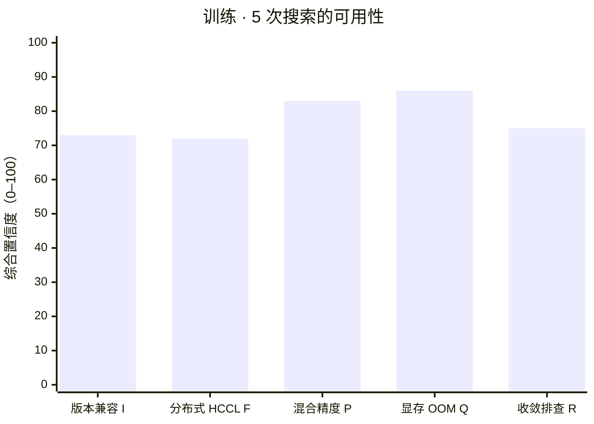

| 次序 | 搜索 | 值 | 原页标注 |
| --- | --- | --- | --- |
| 1 | 版本兼容 | **73 / 100** | I .73 |
| 2 | 分布式 HCCL | **72 / 100** | F .72 最弱 |
| 3 | 混合精度 | **83 / 100** | P .83 |
| 4 | 显存 OOM | **86 / 100** | Q .86 |
| 5 | 收敛排查 | **75 / 100** | R .75 |

> 对照算子开发的 D .41 受阻：训练 5 搜全是平稳小波动，最弱 .72 也远在受阻线之上——同一 AI、不同场景，曲线形状完全不同。

#### 判断 2 · 训练顺，那摩擦在哪？不在「抓不到」，在「版本对齐 + 本机拓扑」

> 核心一问：既然官方都抓得到，训练落地真正卡人的是什么？

训练的真实摩擦不是文档受阻，是**两类 AI 够不着的事实**：

- ① **版本对齐**——torch_npu 必须与本机已装的 CANN / PyTorch 严格配套，版本号又并存（④散乱），AI 给得了配套表、给不了本机装的是哪个；
- ② **本机拓扑**——多卡几张卡、怎么组网，AI 只能给 HCCL 模板。

这跟算子开发的 A 类决策同源（都是本机 / 业务事实回到人），但训练里它们**每一处都有官方文档兜着**、不叠加受阻——所以是「摩擦」而非「深谷」。**真正能被供给侧改善的，正是其中的「版本散」。**

**怎么改**：供给侧收口版本（治根）；使用侧把版本声明**前置**——开训前先核对本机 CANN / torch_npu 版本，别等 import 失败才发现配错。

| 侧 | 位置 | 现状 | 改后 |
| --- | --- | --- | --- |
| 昇腾社区侧 | 官方文档站 · 版本配套表 | CANN / torch_npu / PyTorch 版本号并存、配套关系散 → AI 锁不准、人对不齐 | canonical 配套表 + 查询器（选 CANN 版本 → 唯一 torch_npu） |
| AI 使用侧 | AI 助手 · 环境卡 | 无主动核对 | 显示「本机 CANN：`8.0.RC3` → 建议 torch_npu `2.1.0.post*` `需核对`」，并提供「跑 npu-smi info / pip show 把本机版本贴来，我帮你对配套表」+ `核对版本 ✓` |

#### 判断 3 · 体感是「平稳协同」，不是算子那条「前松后紧」

> 核心一问：两个场景的体感曲线，差在哪？

把训练当一条体感曲线：**全程都是「AI 给方案 → 人按本机调 → 验证」的均匀协同**，每段都有官方文档兜着，A 类决策（版本 / 拓扑 / 精度）**分散在各段、各自独立**，不像算子那样在后半段集中爆发。

所以训练**没有「检索段虚假信心 + 落地段独自承担」的落差**——它的难是**均匀分布的、可预期的**。对开发者体感而言：算子开发要管理的是「别被前段的顺骗了」，训练要管理的是「每段都得备好本机事实」。**同一个 AI，副驾的称职程度取决于这条路有没有官方兜底。**

**怎么改**：训练侧顺，重点是把**每段需要的本机事实清单前置**（版本 / 卡数 / 显存 / 精度阈值），让协同更省来回；供给侧继续收口版本即可。

**体感弧线对照**（原页两条 SVG 曲线：训练绿实线全程平稳、算子橙虚线前段高后段塌）：

| 场景 | 形状 | 说明 |
| --- | --- | --- |
| **训练**（绿实线） | 全程平稳、无回落 | 「AI 给方案 → 人按本机调 → 验证」均匀协同；每段都有官方文档兜着 |
| **算子**（橙虚线，对照） | 前段高 → 后段塌进受阻 | 检索段虚假信心、落地段独担；A 类决策在后半段集中爆发 |

**界面 lo-fi · 改法：开训前先列本机事实清单**

| # | 本机事实 | 状态 |
| --- | --- | --- |
| ① | CANN / torch_npu 版本 | ▢ 需你核对 |
| ② | 卡数 / 组网拓扑 | ▢ 需你填 |
| ③ | 单卡显存上限 / 业务精度阈值 | ▢ 需你填 |

> 训练的难是均匀、可预期的——开训前一次性备齐本机事实，每段协同都更省来回。

**行动建议 · 训练场景（Agent / 产品体验侧）**：

| 优先级 | 建议 | 对应节点 | 预期收益 |
| --- | --- | --- | --- |
| P0 | 供给侧**收口版本**：CANN / torch_npu canonical 配套表 + 查询器（治训练第一坑） | 判断 2 · `sF`/`sI` | 把最弱的 F .72 抬起来 |
| P0 | 使用侧**本机事实清单前置**：开训前核对版本 / 拓扑 / 显存 / 精度阈值 | 判断 3 · A 类 | 减少每段协同来回 |
| P1 | **版本声明前置**：环境卡先对配套表，别等 import 失败 | 判断 2 · `dVerT` | 避免「看着对、装不上」 |
| P1 | 补**带版本号的分布式 / HCCL 二手**（救 F 的 ⑤⑥ 同质） | → 见 19 | 降二手回声、抬可信度 |

---

## ② Agent 底层系统工程 · 跳出业务表层看技术实现

前三节是「业务层看到的旅程」；本节下沉到「P2 检索区段里，Agent 内部究竟如何运转」。

### 4.1 工具调用策略：为什么是有限次检索，而非更多 / 更少

时序图 `sD`–`sD2` 那几步里，AI 没有把检索工具刷到上限，实测 D 任务只搜了 ~1–2 轮就转入拼装。背后是两层机制叠加：

- **硬上限 = `max_uses`**：`web_search` 是 Anthropic Messages API 的**服务端工具**，注册时带 `max_uses` 封顶（如 5）；超过会返回 `max_uses_exceeded`，模型不能无限刷。
- **软停止 = 模型自主判断「信息已足够」**：服务端工具在**同一轮**内自带 loop——模型决定检索内容 → 平台执行并回灌结果 → 模型判断信息是否足够 → 不足则续检索、足够则停止并生成终答（`stop_reason: end_turn`；耗时较长会先 `pause_turn` 再继续）。所以「调用 N 次」不是写死的常量，而是 **min(max_uses, 模型判断收敛点)**。
- **为什么 D 任务收敛得早**：实测前 1–2 条结果（知乎 / ai6s.net / MindSpore 官方 / CSDN）已能拼出步骤骨架，边际信息递减；继续搜更多只会拿到同质 CSDN 互抄（D 的二手本就薄），模型据此判断「再搜性价比低」→ 提前停。**检索次数少 ≠ 偷懒，而是边际收益判断。**

### 输入优化：用户怎么写指令能显著抬升输出精准度

| 优化手段 | 对这条旅程的具体作用 |
| --- | --- |
| **补约束**：写明「要**可照抄的完整命令 + 锁定版本号**」 | 逼 AI 在给出 msopgen 命令那一步（现 `gD`）带上真实 soc_version 占位说明，而非泛泛描述，减少来回。 |
| **限范围**：写明芯片型号 / CANN 版本（如 910B1 + 8.0.RC3） | 直接消解版本对齐这个卡点（现 `dVer`）——AI 不必在多版本间猜，输出一次到位。 |
| **限渠道**：写明「优先官方文档，无法取得则说明受阻、不得编造」 | 触发 AI 在 `sD` 受阻时**诚实标注 SPA 无法抓取**并转二手，而不是用记忆补全一个看似正确、实则无法运行的步骤。 |
| **给反馈**：把编译报错**原文**贴回 | AI 解读的准确度直接取决于报错原文（现 `eC`），而非「我编译失败了」这类模糊描述。 |

> ⚠ 原页此表的节点引用是**旧 id**（`s5` / `d1` / `d2` / `s3` / `s9`），本文已按现节点标注，对应关系见附录 A。

### 4.2 大模型每一轮内部在做什么

把 P2 检索区段拆成模型的内部动作循环，逐轮对应到时序图节点。

| 轮次 | 内部动作 | 原页标注的图节点（旧 id） | 现节点 |
| --- | --- | --- | --- |
| 第 1 轮 | **规划**：解析「Ascend C 自定义算子 + 接 PyTorch」→ 拆成「找官方 how-to → 找工程脚手架 → 找 PyTorch 绑定方式」三个子目标；**决定先发 `web_search`**。 | `s2` | `sD` |
| （服务端） | **读结果 + 研判**：扫一遍搜索摘要，识别出官方页 + 知乎 + MindSpore + CSDN；判断官方页最权威 → **决定 `web_fetch` 官方 URL**。 | `s2→s3` | `sD` |
| 第 2 轮 | **遇阻分支判断**：fetch 回来只有 meta、正文缺失 → 识别为 SPA 受阻 → **不编造**，改判「靠二手 + 自带知识拼」→ 决定再读 MindSpore / CSDN。 | `s3（受阻）→s4` | `sD`（受阻）→ `sD2` |
| 第 3 轮 | **结果生成**：把二手碎片 + 自带知识合成步骤骨架，按「环境→msopgen→核函数→编包→部署→绑定」排序，**给占位 + 标注哪些需用户核验**（soc_version / 版本）→ 输出，`end_turn`。 | `s5` | `gD` |

关键内部动作 = **「研判信息是否足够」与「遇阻是否编造」两个判断点**。D 任务的特殊性在于：官方受阻 + 二手薄 + 自带知识在 Ascend C 深处也不厚 → 模型在第 2 轮就进入「没有强证据」状态，只能给骨架而非可照抄全程，这是综合分低的技术根因。

### 4.3 Agent 循环架构（图）+ 最小实现代码

> 示范实现 · 基于公开 Anthropic Messages API，**非 Claude 内部源码**。

「我平常如何运行」的 agent 循环流程：**输入**（原始问句 + system 约束 → messages，不预处理）→ 模型推理 **①意图解析 → ②子目标拆解 → ③工具路由** → **需要工具?**（`stop_reason`）→ 是：调 **`web_search`**（服务端）/ **`web_fetch`**（客户端）→ **`tool_result` 回灌** → **④ 证据是否充分?** → 充分：**⑥ 收敛 → 终答**；不足：**能否继续检索**（未达上限且预期有效，则换检索词回 ③ 再检索一轮，官方与二手仍一并返回）。检索穷尽后若仍无可靠证据，模型**无法可靠识别「自身不知道」，会凭记忆填补空缺 = 杜撰**（看似正确、实则有误）。否（`end_turn`）则不检索、直接依据自带知识作答。

#### 4.3.1 架构图（原图）

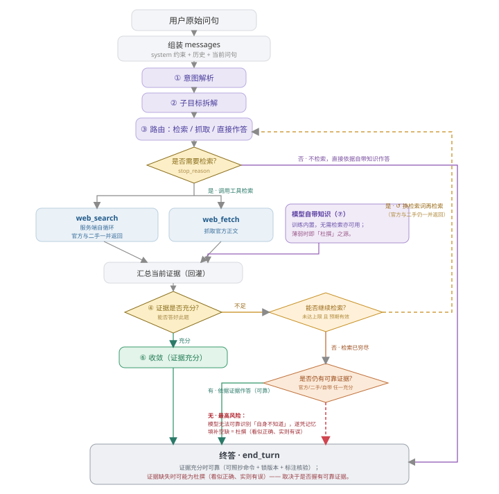

#### 4.3.2 架构图（Mermaid 结构化等价）

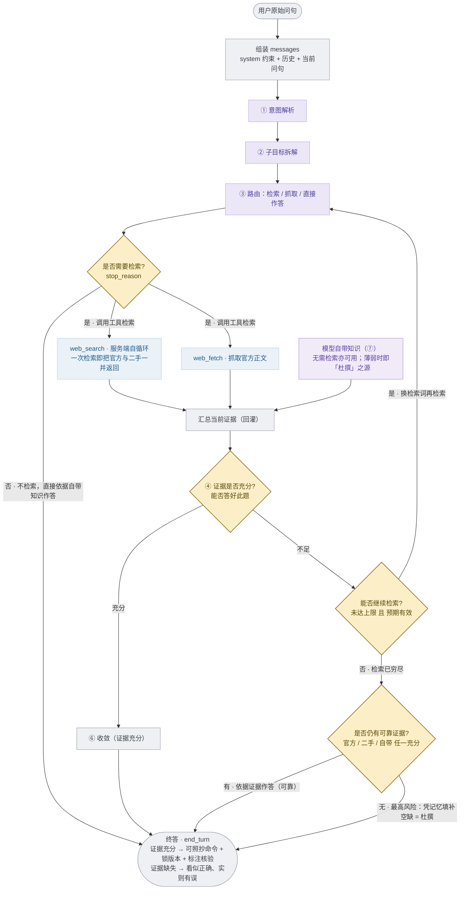


> **① 官方与二手由一次检索一并返回**，并非先检索官方、失败后才转二手；**② 自带知识无需检索亦在其中** —— 三者即矩阵中的三来源。

#### 4.3.3 节点职责（原页悬浮详情，逐项展开）

| 环节 | 职责 |
| --- | --- |
| **用户原始问句** | 开发者的原始自然语言需求，原样进入 `messages`、不做关键词抽取或模板化预处理。对 D：开发一个 Ascend C 自定义算子并接入 PyTorch。 |
| **组装 messages** | 将 **system 约束**（要求给可照抄命令、锁定版本、抓取不到则如实标注）+ 历史 + 当前问句拼成模型输入；理解全部交给模型。 |
| **① 意图解析** | 读出「需完成什么 + 目标产物 + 硬约束」。对 D＝识别「开发 Ascend C 算子并接入 PyTorch」，并捕捉隐含约束：可照抄、可运行、锁版本、与本机芯片型号强相关。 |
| **② 子目标拆解** | 切分为可分别检索的子问题：① 官方 how-to（msopgen→编包→部署）② 工程脚手架 ③ 接入 PyTorch 的绑定方式。 |
| **③ 路由：检索 / 抓取 / 直接作答** | 决定本轮如何获取信息：`web_search` 了解全貌 / `web_fetch` 抓取某官方页 / 信息已充分则直接作答。 |
| **是否需要检索?** | 模型本轮是**调用工具检索**（`tool_use`），还是**不检索、直接依据自带知识作答**（`end_turn`）。注意：选择直接作答时，若自带知识不可靠，同样可能杜撰。 |
| **web_search · 服务端工具** | 在**同一次调用内自循环**（生成 query→检索→研判→续检索/停止）。关键：它**一次检索即把官方文档与 CSDN / 知乎 / GitHub 等二手内容一并返回**——并非先检索官方、失败后才转二手。`max_uses` 封顶。 |
| **web_fetch · 客户端工具** | 需查看某官方页正文时，返回 `tool_use` 交由客户端抓取；抓取为空则如实返回「正文无法取回」。 |
| **模型自带知识（⑦）** | 模型训练内置的知识，**无需检索亦可用**，是矩阵三来源（官方 / 二手 / 自带）中的第三条。**充分时为可靠答案的底；薄弱、且检索未能补足时，即为「杜撰」之源**。 |
| **汇总当前证据（回灌）** | 将本轮取回的官方正文、二手内容连同自带知识一并提交模型，进入研判。 |
| **④ 证据是否充分?** | 判断手中证据**是否足以答好本题**。充分→收敛输出终答；不足→评估能否继续检索。对 D：第 2 轮即发现官方核心页 SPA 抓取为空、二手稀薄，判定「不足」。 |
| **⑥ 收敛（证据充分）** | 证据充分即停止检索，将片段组织为有序步骤（环境→msopgen→核函数→编包→部署→绑定），并标注需用户核验项。 |
| **能否继续检索?** | **继续检索的条件**：尚未达到检索次数上限（`max_uses` / 轮数），且模型判断「更换检索词或来源后再检索预期有效」。满足则**再检索一轮**（官方与二手仍一并返回）。 |
| **是否仍有可靠证据?（检索穷尽后）** | **停止检索的条件**：要么证据已充分，要么已无法继续（达到上限 / 判断再检索亦无效）。停止后被迫作答，此时答案可靠与否取决于——官方 / 二手 / 自带 中**是否至少有一条充分**。 |
| **终答 · end_turn** | **证据充分时**：可照抄命令 + 锁定版本 + 标注核验，结果可靠。**证据缺失时风险最高**：模型**无法可靠识别「自身不知道」**，会凭记忆填补空缺，产出「看似正确、实则有误」的命令 / 版本 / 来源——即上一页 Stack Overflow『66% 被此类答案误导』。 |

#### 4.3.4 受阻链路图（原页挂在 `sD` 节点上的迷你流程）

> 原页 `ARCHFLOW` 仅对 `D` 场景的 `sD` 配了链路图（训练 / 迁移的场景 `ARCHFLOW` 为空对象）。

**链路图 · 写 kernel 的官方 how-to 在哪一环受阻**

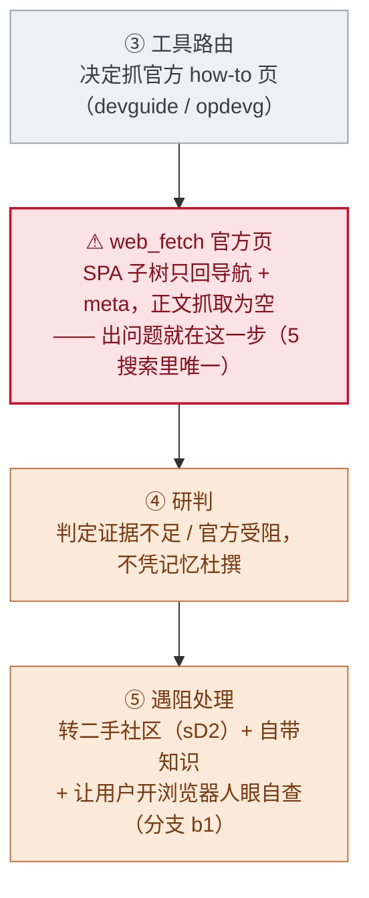


> **红＝出问题的环节** · **橙＝架构的应对**；节点名对应上面 4.3.1 的架构图。

#### 4.3.5 最小实现代码（A–D 段对应架构图各环节）

```python
import anthropic
client = anthropic.Anthropic()

# ① 工具注册：web_search 是服务端工具，max_uses 即 §4.1 的硬上限
TOOLS = [
    {"type": "web_search_20250305", "name": "web_search", "max_uses": 5},
    {"name": "web_fetch", "description": "抓取一个 URL 的正文",   # 客户端工具：演示通用 agent 循环
     "input_schema": {"type": "object",
         "properties": {"url": {"type": "string"}}, "required": ["url"]}},
]

def run_agent(user_question):
    # A. 接收并解析用户原始自然语言输入 —— 直接进 messages，模型负责理解
    messages = [{"role": "user", "content": user_question}]

    while True:
        # B. 调度：模型自己决定这一轮是搜 / 抓 / 还是直接答（§4.2 的「规划」）
        resp = client.messages.create(
            model="claude-opus-4-8", max_tokens=4096,
            system="优先给可照抄命令、锁定版本号；官方抓不到就说明受阻，绝不编造。",
            tools=TOOLS, messages=messages)
        messages.append({"role": "assistant", "content": resp.content})

        # C. 终止条件：模型不再要工具 → 收敛、返回终答（对应图中的 end_turn）
        if resp.stop_reason != "tool_use":
            return "".join(b.text for b in resp.content if b.type == "text")

        # D. 多轮循环：执行客户端工具并把结果回灌（受阻时如实标注，不编造 → 图 sD）
        results = []
        for b in resp.content:
            if b.type == "tool_use" and b.name == "web_fetch":
                body = fetch_url(b.input["url"])
                results.append({"type": "tool_result", "tool_use_id": b.id,
                    "content": body or "（SPA / robots：正文抽不到）"})
        messages.append({"role": "user", "content": results})
```

| 段 | 职责 |
| --- | --- |
| **A 段** | 接收解析用户自然语言：原始问句直接进 `messages`，不做模板化预处理——理解交给模型本身。 |
| **B 段** | 调度逻辑：每轮 `messages.create` 让模型自主决定搜 / 抓 / 答。`web_search` 的多轮在服务端同一次调用内闭环（§4.1 软停止）。 |
| **C 段** | 终止逻辑：`stop_reason != "tool_use"` 即模型判断信息足够、收敛产出终答——对应图中 `end_turn`。 |
| **D 段** | 多轮循环 + 受阻处理：客户端工具结果回灌；**抓不到正文时显式写「正文抽不到」而非留空或臆造**，这是「绝不编造」铁律在代码层的落点（图 `sD` 受阻）。 |

**诚实边界：** 上述为**公开 Messages API 的忠实示范**，用于解释 agent 循环骨架，**不是 Claude 产品的内部源码**；服务端 `web_search` 的内部检索 / 排序实现不可见，这里只能就「对外可观测的调用契约」作解。

---

## ③ 交付物汇总

> ⚠ 原页此节**未被 Mermaid 化的图形覆盖**（纯文字总结），原文保留；其中计数为旧口径，见文首「校订提示（3）」。

1. **全链路时序图**（本页 §1）：4 参与者（昇腾社区 ｜ AI ｜ 人类用户 ｜ 本机工具）、14 主节点 + 9 决策点（A 类 3 非人不可 + B 类 6 技术路线）+ 6 用户独立分支（人→昇腾官方，多数从决策块指出 + `sD` 安全网，对应 ascend step1/3/4/6）、人机交接连线（① 档 10 处、随档位变少）、7 阶段色带、主导方色带、逐节点悬浮详情——均锚定 D 任务实测事实。
2. **业务分析全部折进上图交互**：任务分工·四轴**折进生命线名悬浮**、协同交接量化**折进图例「消息·涉及 AI」悬浮**；用户决策依据 / 前置条件 / 决策链（含每步信息来源、随滑块在「人做」「AI 接管」两版切换）**折进 ◆ 节点悬浮**；人机主导权边界逐阶段**折进左侧阶段条悬浮**。结论见 §1 下方综述。
3. **技术拆解**（§2 Agent 系统工程）：工具调用策略（`max_uses` 硬上限 + 模型自主软停止）、输入优化、大模型逐轮内部动作、agent 循环架构图 + 代码；每个时序节点悬浮还标出「对应架构环节」。

**诚实声明与局限：**

① 旅程节点的**受阻 / 卡点 / 版本号 / 二手来源均为 D 任务实测检索所得**（见 `task_run_log.md`，也正是本项目真正测的「知识可用性」），但「一次完整开发」的**线性步骤顺序是基于实测骨架的合理重构**（开发步骤 msopgen / 编包 / aclnn 按官方文档复述、未实际运行验证），真实开发中 P4–P7 可能多次回退迭代（`d3` 驳回即触发），图为主路径示意。**滑块 3 档的分工差异为建模**（仅「① 人主笔」对应实测的这次检索，另两档非实测）；而**受阻事实在三档下不变**（同一 CANN 生态），变的只是「谁执行、人是否核查」。

② §4.3 代码是**公开 Messages API 的示范实现**，解释 agent 循环契约，**非 Claude 内部源码**；服务端 `web_search` 的检索 / 排序内部实现不可观测。

③ 工作量占比按**节点计数**而非真实工时；不同开发者熟练度会显著改变人侧耗时。

④ 本页只刻画 D 这一个「最难」任务的旅程；成熟任务（如 G 迁移、Z 概念对照）的人机协同形态会大不相同（AI 主导区段更长、卡点更少），详见热力矩阵与启发与方向。

---

## 附录 A · 图是怎么画出来的（原始代码，可直接复用）

三张/几张图的来源不同，分别列出。**这些代码没有改动，都是原页原文**。

### A.1 §① 时序图的绘制代码（原页 d3）

原页用 `d3.select("#journey")` + 下面这段函数现场生成 SVG。整段可直接复制到任何装了 d3 v7 的页面里用——渲染前需要先 `setScenario(<场景>)` 把 `NODES / FLOW / PHASE / BRANCH` 等全局量挂上（见 §1 各表，数据源同名同义）。

```js
const phaseColors=["#EEF1F7","#EFEAF7","#E9F4F0","#E9F4F0","#FBF0E0","#E9F4F0","#E6EDF8"];
const AIFILL="#ECE7F6", AISTROKE="#6B5BA8", HUFILL="#DCE8F7", HUSTROKE="#2f3d63";
const ownColors={hu:"#9fb4dd",ai:"#b7a9e0",co:"#9bd3c8"};
const ownName={hu:"用户主导",ai:"Agent 自动化主导",co:"人机协同"};
function fill(n){ return n.lane==="ai"?AIFILL:HUFILL; }
function stroke(n){ return n.lane==="ai"?AISTROKE:HUSTROKE; }

/* 每阶段「人/AI 占比」——全部从真实节点的 kind/lane 现算（不手填）
   动作数 = 该阶段 AI / 用户 节点计数；四轴 = 按 kind 归类(检索/产出/执行/决策)、lean=该节点泳道 */
const KIND_AXIS={search:0, fetch:0, draft:1, run:2, deliver:2, decision:3, start:3}; // 0检 1产 2执 3决
const AXNAME=["检","产","执","决"];
const DOT_AI="#9B91F0", DOT_HU="#54BFEC", DOT_NA="#d4d4cf";
function dotTextColor(l){ return l==="ai"?"#3C3489" : l==="hu"?"#0C447C" : "#8a8a85"; }
function phaseStats(ph){
  let ai=0,hu=0; const axLane=[null,null,null,null];
  NODES.forEach(n=>{
    if(n.xi>=ph.a && n.xi<=ph.b){
      if(n.lane==="ai") ai++; else hu++;
      const a=KIND_AXIS[n.kind];
      if(a!==undefined && axLane[a]===null) axLane[a]=n.lane;
    }
  });
  return {ai,hu,axLane};
}
function dotColor(l){ return l==="ai"?DOT_AI : l==="hu"?DOT_HU : DOT_NA; }
/* 动作数条（紫 AI 段从左、蓝 人 段铺底）；横竖共用 */
function drawRatioBar(parent, cx, y, width, st){
  const tot=st.ai+st.hu; if(tot===0) return;
  const x0=cx-width/2, aw=width*st.ai/tot;
  parent.append("rect").attr("x",x0).attr("y",y).attr("width",width).attr("height",9).attr("rx",3).attr("fill",DOT_HU);
  if(aw>0.5) parent.append("rect").attr("x",x0).attr("y",y).attr("width",aw).attr("height",9).attr("rx",3).attr("fill",DOT_AI);
}
/* 四轴点（检/产/执/决，色=该轴偏向谁）；横竖共用 */
function drawAxisDots(parent, cx, y, st){
  const r=7.5, gap=18, total=3*gap;
  st.axLane.forEach((l,i)=>{
    const g=parent.append("g").attr("transform",`translate(${cx-total/2+i*gap},${y})`);
    g.append("circle").attr("r",r).attr("fill",dotColor(l));
    g.append("text").attr("text-anchor","middle").attr("dy",3.2).attr("font-size",9).attr("font-weight",700).attr("fill",dotTextColor(l)).text(AXNAME[i]);
  });
}
/* 计数文字 AI n / 人 m（双色 tspan）；横竖共用 */
function drawCount(parent, cx, y, st){
  const t=parent.append("text").attr("x",cx).attr("y",y).attr("text-anchor","middle").attr("font-size",10);
  t.append("tspan").attr("fill","#3C3489").text("AI "+st.ai);
  t.append("tspan").attr("fill","#999").text("  /  ");
  t.append("tspan").attr("fill","#0C447C").text("人 "+st.hu);
}

/* ===== AI 自主度光谱（拖动条）：档位决定每个动作归谁，时序图随之 morph ===== */
const LVL=[
 {name:"人主笔，AI 辅助", exec:"人", decide:"人",
  covers:"问 ChatGPT/Claude、Copilot 全套(补全 / inline chat / 解释)、IDE AI 助手",
  desc:"代码由人编写、本地由人运行、决策由人裁定；AI 从旁提供片段 / 补全 / 解释。检索需人主动发起。"},
 {name:"AI 主写，人审校", exec:"AI", decide:"人",
  covers:"<b>Vibe Coding</b>——Cursor / Claude Code 的 <b>agent 模式</b>：AI 自己改文件 / 跑命令 / 读报错自迭代",
  desc:"AI 成段生成代码、自行调用工具运行、读取报错自迭代，人审查结果并修正。<b>执行转交 AI</b>；但<b>决策仍归人</b>、受阻时人仍会去社区核查（<b>安全网保留</b>，前提是 AI 暴露受阻、不静默退二手）。"},
 {name:"人委派，AI 自主完成", exec:"AI", decide:"AI",
  covers:"Devin(异步)、spec 驱动、多智能体——内部实现不同，对人均为「委派→获取结果」",
  desc:"人委派整体任务(或预先编写规格)，AI 自主执行并提交 PR，人仅作最终验收。<b>决策亦归 AI</b>；深水区(D)知识有缺口时风险最高、而人介入最少。"}
];
let curLvl=0;
/* 某动作在某档位归谁——只看 kind，与当前 lane 无关；lvl0 复现实测 */
function laneAt(n,lvl){
  if(n.kind==="start"||n.kind==="deliver") return "hu";   // 立项 / 终交付恒人
  const ax=KIND_AXIS[n.kind];
  if(ax===0||ax===1) return "ai";        // 检索 / 产出 恒 AI
  if(ax===2) return lvl>=1 ? "ai":"hu";  // 执行(run)：Vibe 档起转 AI
  if(ax===3) return lvl>=2 ? "ai":"hu";  // 决策：全自动档起转 AI
  return "hu";
}
/* 阶段主导方由当前档位下的多数 lane 推出（随拖动条 morph） */
function phaseOwner(ph){ const s=phaseStats(ph); return s.ai>s.hu?"ai":(s.hu>s.ai?"hu":"co"); }

const svg = d3.select("#journey");

/* 箭头 marker（每次重绘后需重建） */
function addDefs(){
  const defs = svg.append("defs");
  function arrow(id,color){
    defs.append("marker").attr("id",id).attr("viewBox","0 0 10 10")
      .attr("refX",8).attr("refY",5).attr("markerWidth",7).attr("markerHeight",7)
      .attr("orient","auto-start-reverse")
      .append("path").attr("d","M0,0 L10,5 L0,10 z").attr("fill",color);
  }
  arrow("ah","#8156c9"); arrow("at","#bbb"); arrow("ab","#2f3d63");
  arrow("ahg","#7a8aa0"); arrow("ahr","#C8102E");   // 灰=人/工具消息、红=受阻
  /* 决策条斜纹底（竖向激活条用） */
  const pat=defs.append("pattern").attr("id","diag")
    .attr("patternUnits","userSpaceOnUse").attr("width",6).attr("height",6)
    .attr("patternTransform","rotate(45)");
  pat.append("rect").attr("width",6).attr("height",6).attr("fill","#FCEFC7");
  pat.append("line").attr("x1",0).attr("y1",0).attr("x2",0).attr("y2",6)
    .attr("stroke","#E0C589").attr("stroke-width",2);
}

/* 节点造型（朝向无关，横竖共用）：形状 + 受阻红环 + id 角标 */
function drawNodeShape(sel,d){
  if(d.kind==="decision"){
    const A=d.dtier==="A";          // A=非人不可→实心深色；B=技术路线→浅色
    sel.append("rect").attr("x",-17).attr("y",-17).attr("width",34).attr("height",34)
      .attr("transform","rotate(45)").attr("rx",4)
      .attr("fill",A?"#E6B73E":"#FCEFC7").attr("stroke",A?"#6f520c":"#bfa24e").attr("stroke-width",A?2.4:2);
  } else if(d.kind==="run"||d.kind==="deliver"||d.kind==="start"){
    sel.append("rect").attr("x",-23).attr("y",-18).attr("width",46).attr("height",36)
      .attr("rx",7).attr("fill",fill(d)).attr("stroke",stroke(d)).attr("stroke-width",2);
  } else { /* search / fetch / draft → 圆 */
    sel.append("circle").attr("r",20).attr("fill",fill(d)).attr("stroke",stroke(d)).attr("stroke-width",2);
  }
  if(d.blocked){
    sel.append("circle").attr("r",24).attr("fill","none").attr("stroke","#C8102E").attr("stroke-width",2.5);
    sel.append("text").attr("x",18).attr("y",-16).attr("font-size",14).attr("font-weight",900)
      .attr("fill","#C8102E").text("✕");
  }
  sel.append("text").attr("text-anchor","middle").attr("dy",4)
    .attr("font-size",11).attr("font-weight",800)
    .attr("fill", d.kind==="decision"?(d.dtier==="A"?"#4d3a06":"#8a6d1a"):stroke(d)).text(d.id);
}

/* 多行换行（centerY: 让多行整体竖直居中） */
function wrapText(el,txt,max,lh,anchorX,centerVert){
  const lines=[];
  for(let i=0;i<txt.length;i+=max) lines.push(txt.slice(i,i+max));
  const startDy = centerVert ? -(lines.length-1)*lh/2 : 0;
  lines.forEach((ln,i)=>{
    el.append("tspan").attr("x",anchorX).attr("dy", i===0?startDy:lh).text(ln);
  });
}

/* 竖向激活条（经典 sequence）：三类 kind 用三种填充样式区分
   实色=AI 检索/起草 · 描边浅底=用户本地执行 · 斜条纹底=决策点；lane 仍用紫/蓝；受阻套红框✕ */
const BARW=24, BARH=42;
function drawBarV(sel,d){
  let fillv, strokev, idcol, sw;
  if(d.kind==="decision"){            // A=非人不可→实心深金；B=技术路线→斜条纹浅底
    if(d.dtier==="A"){ fillv="#E6B73E"; strokev="#6f520c"; idcol="#4d3a06"; sw=2.4; }
    else { fillv="url(#diag)"; strokev="#bfa24e"; idcol="#8a6d1a"; sw=2; }
  } else if(d.kind==="run"||d.kind==="start"||d.kind==="deliver"){ // 描边浅底
    fillv = d.lane==="ai" ? "#fff" : "#F1F5FC"; strokev=stroke(d); idcol=stroke(d); sw=2.4;
  } else {                            // 实色（AI search/fetch/draft）
    fillv = d.lane==="ai" ? "#C9BBE8" : "#BFD2F0"; strokev=stroke(d); idcol=stroke(d); sw=1.5;
  }
  sel.append("rect").attr("x",-BARW/2).attr("y",-BARH/2).attr("width",BARW).attr("height",BARH)
    .attr("rx",5).attr("fill",fillv).attr("stroke",strokev).attr("stroke-width",sw);
  if(d.blocked){
    sel.append("rect").attr("x",-BARW/2-4).attr("y",-BARH/2-4)
      .attr("width",BARW+8).attr("height",BARH+8).attr("rx",7)
      .attr("fill","none").attr("stroke","#C8102E").attr("stroke-width",2.5);
    sel.append("text").attr("x",BARW/2+8).attr("y",-BARH/2+3).attr("font-size",14)
      .attr("font-weight",900).attr("fill","#C8102E").text("✕");
  }
  sel.append("text").attr("text-anchor","middle").attr("dy",4)
    .attr("font-size",10.5).attr("font-weight",800).attr("fill",idcol).text(d.id);
}

/* ===================== 竖向视图 · 4 参与者真·时序图（时间自上而下） =====================
   每步＝参与者间一条消息（横向箭头，标题在箭头上方）；受阻＝红色空返回。
   生命线左→右：昇腾官方(off) ｜ 二手社区(sec) ｜ AI ｜ 人类用户 ｜ 本机工具。决策＝落在执行者生命线上的菱形。
   FLOW：frm/to 为参与者；"exec"＝执行方(Vibe 档起转 AI)，随滑块 morph（人靠边）。检索 = AI→官方(受阻则→二手)。 */
const D_FLOW={
  n1:{frm:"hu",to:"ai"},
  sD:{frm:"ai",to:"off", blocked:true}, sD2:{frm:"ai",to:"sec"}, gD:{frm:"ai",to:"exec"}, eD:{frm:"exec",to:"tool"},
  sM:{frm:"ai",to:"off"}, gM:{frm:"ai",to:"exec"},
  eC:{frm:"exec",to:"tool"}, sX:{frm:"ai",to:"off"}, gX:{frm:"ai",to:"exec"}, eX:{frm:"exec",to:"tool"},
  sO:{frm:"ai",to:"off"}, gO:{frm:"ai",to:"exec"}, eO:{frm:"exec",to:"tool"},
  eT:{frm:"exec",to:"tool"}, sL:{frm:"ai",to:"off"}, gL:{frm:"ai",to:"exec"},
  nEnd:{frm:"hu",to:"self"}
};
function renderV(){
  const phX=4, phW=70, owX=78, owW=44;
  const LX={sec:185, off:350, ai:515, hu:680, tool:845};
  const PCOL={off:"#C8102E", sec:"#BA7517", ai:"#6B5BA8", hu:"#2f3d63", tool:"#3f7d72"};
  const PNAME={off:"昇腾官方", sec:"二手社区", ai:"AI（Agent）", hu:"人类用户", tool:"本机工具"};
  const vTop=86, dyV=54, Wv=920;
  const Y = xi => vTop + xi*dyV;
  const Hv = Y(NODES.length-1) + 70;
  const exec = ()=> curLvl>=1 ? "ai" : "hu";        // 执行方：Vibe 档起转 AI
  const role = r => r==="exec" ? exec() : r;
  svg.attr("width",Wv).attr("height",Hv).attr("viewBox",`0 0 ${Wv} ${Hv}`);

  /* 阶段卡 + 主导方色带（最左，同前） */
  svg.append("text").attr("x",phX+phW/2).attr("y",vTop-62).attr("text-anchor","middle")
    .attr("font-size",10).attr("font-weight",800).attr("fill","#555").text("阶段·人/AI");
  PHASE.forEach((d,i)=>{
    const y0=Y(d.a)-dyV/2+5, h=(d.b-d.a)*dyV + dyV-10, cy=(Y(d.a)+Y(d.b))/2, cxp=phX+phW/2, st=phaseStats(d);
    svg.append("rect").attr("x",phX).attr("y",y0).attr("width",phW).attr("height",h)
      .attr("rx",8).attr("fill",phaseColors[i]).attr("opacity",.6).style("cursor","help")
      .on("mousemove",e=>showPhaseTip(e,i)).on("mouseleave",hideTip).on("click",e=>pinPhaseTip(e,i));
    const lab=svg.append("text").attr("text-anchor","middle").attr("font-size",9.5).attr("font-weight",700).attr("fill","#555");
    wrapText(lab, d.n, 6, 11, cxp, false); lab.attr("y",cy-24);
    drawRatioBar(svg, cxp, cy-6, Math.min(phW-14,84), st);
    drawCount(svg, cxp, cy+10, st);
    drawAxisDots(svg, cxp, cy+24, st);
    svg.append("rect").attr("x",phX).attr("y",y0).attr("width",phW).attr("height",h)
      .attr("rx",8).attr("fill","transparent").style("cursor","help")
      .on("mousemove",e=>showPhaseTip(e,i)).on("mouseleave",hideTip).on("click",e=>pinPhaseTip(e,i));
  });
  svg.append("text").attr("x",owX+owW/2).attr("y",vTop-62).attr("text-anchor","middle")
    .attr("font-size",10).attr("font-weight",800).attr("fill","#555").text("主导方");
  PHASE.forEach(d=>{
    const k=phaseOwner(d), y0=Y(d.a)-dyV/2+5, h=(d.b-d.a)*dyV + dyV-10;
    svg.append("rect").attr("x",owX).attr("y",y0).attr("width",owW).attr("height",h).attr("rx",6).attr("fill",ownColors[k]);
    const lab=svg.append("text").attr("text-anchor","middle").attr("font-size",9.5).attr("font-weight",700).attr("fill","#2b2b2b");
    wrapText(lab, ownName[k], 4, 12, owX+owW/2, true); lab.attr("y",(Y(d.a)+Y(d.b))/2+3);
  });

  /* 4 条参与者生命线 + 列头 */
  ["sec","off","ai","hu","tool"].forEach(k=>{
    const x=LX[k];
    svg.append("line").attr("x1",x).attr("x2",x).attr("y1",vTop-34).attr("y2",Hv-26)
      .attr("stroke","#e3e3e3").attr("stroke-width",1.5);
    const t=svg.append("text").attr("x",x).attr("y",vTop-46).attr("text-anchor","middle")
      .attr("font-size",11.5).attr("font-weight",800).attr("fill",PCOL[k]).text(PNAME[k]);
    if(k==="ai"||k==="hu") t.style("cursor","help")
      .on("mousemove",ev=>showLaneTip(ev,k)).on("mouseleave",hideTip).on("click",ev=>pinLaneTip(ev,k));
  });

  const drawMarker=(g,d,color,blocked)=>{
    if(blocked){ g.append("circle").attr("r",16).attr("fill","none").attr("stroke","#C8102E").attr("stroke-width",2.2); }
    g.append("circle").attr("r",13).attr("fill","#fff").attr("stroke",color).attr("stroke-width",2);
    g.append("text").attr("text-anchor","middle").attr("dy",4).attr("font-size",10).attr("font-weight",800).attr("fill",color).text(d.id);
  };
  const sideLabel=(g,d,toRight)=>{
    g.append("text").attr("text-anchor", toRight?"start":"end")
      .attr("font-size",10).attr("font-weight",600).attr("fill","#333")
      .each(function(){ wrapText(d3.select(this), d.t, 9, 12, (toRight?1:-1)*22, true); }).attr("y",0);
  };

  /* 每步＝一条消息（标题在箭头上方）；决策＝执行者线上的菱形。红色小字＝该步对应的矩阵指标分（打穿到 page 17） */
  const NS=SCENARIOS[curScen].nodeScore||{};
  NODES.forEach(d=>{
    const y=Y(d.xi);
    if(d.kind==="decision"){
      const x=LX[d.lane];
      const gx=svg.append("g").attr("transform",`translate(${x},${y})`).style("cursor","pointer")
        .on("mousemove",(e)=>showTip(e,d)).on("mouseleave",hideTip).on("click",(e)=>pinTip(e,d));
      drawBarV(gx,d);                       // 菱形按 dtier 深浅
      sideLabel(gx,d, d.lane==="ai");       // AI 在左→标题朝右(中央)；人在右→朝左(中央)
      if(NS[d.id]) gx.append("text").attr("x",0).attr("y",20).attr("text-anchor","middle")
        .attr("font-size",9).attr("font-weight",700).attr("fill","#bb2236").text(NS[d.id]);
      return;
    }
    const f=FLOW[d.id]; if(!f) return;
    const frm=role(f.frm), to=role(f.to), x1=LX[frm];
    if(to==="self" || frm===to){            // 自身动作 / 档②③ 交付·回灌塌缩为同侧
      const gx=svg.append("g").attr("transform",`translate(${x1},${y})`).style("cursor","pointer")
        .on("mousemove",(e)=>showTip(e,d)).on("mouseleave",hideTip).on("click",(e)=>pinTip(e,d));
      drawMarker(gx,d,PCOL[frm],false);
      sideLabel(gx,d, !(frm==="hu"||frm==="tool"));   // AI/社区侧→标题朝右；人/工具侧→朝左
      return;
    }
    const x2=LX[to], dir=x2>x1?1:-1;
    const isAi=frm==="ai"||to==="ai";
    const col=f.blocked?"#C8102E":(isAi?"#8156c9":"#7a8aa0");
    const mk=f.blocked?"url(#ahr)":(isAi?"url(#ah)":"url(#ahg)");
    svg.append("line").attr("x1",x1+dir*14).attr("y1",y).attr("x2",x2-dir*3).attr("y2",y)
      .attr("stroke",col).attr("stroke-width",2).attr("marker-end",mk).attr("opacity",.92);
    const tt=svg.append("text").attr("x",(x1+x2)/2).attr("y",y-7).attr("text-anchor","middle")
      .attr("font-size",10).attr("font-weight",600).attr("fill", f.blocked?"#C8102E":"#333");
    tt.append("tspan").text(d.t);
    if(NS[d.id] && !f.blocked) tt.append("tspan").attr("fill","#bb2236").attr("font-weight",700).text("　"+NS[d.id]);
    const gx=svg.append("g").attr("transform",`translate(${x1},${y})`).style("cursor","pointer")
      .on("mousemove",(e)=>showTip(e,d)).on("mouseleave",hideTip).on("click",(e)=>pinTip(e,d));
    drawMarker(gx,d,PCOL[frm],f.blocked);
    if(f.blocked){                          // 红色空返回 + ✕（核心发现可视化）+ 对应矩阵分
      const ry=y+17;
      svg.append("line").attr("x1",x2-dir*3).attr("y1",ry).attr("x2",x1+dir*14).attr("y2",ry)
        .attr("stroke","#C8102E").attr("stroke-width",2).attr("stroke-dasharray","5,4").attr("marker-end","url(#ahr)").attr("opacity",.92);
      svg.append("text").attr("x",(x1+x2)/2).attr("y",ry-4).attr("text-anchor","middle")
        .attr("font-size",9.5).attr("font-weight",700).attr("fill","#C8102E").text("✕ 抓取为空（SPA）"+(NS[d.id]?" → 矩阵 "+NS[d.id]:""));
    }
  });

  /* 用户独立分支 ＝ 人 → 昇腾社区（官方 or 二手）的独立消息（仅档①）；br.to 指定目标线，缺省 off */
  if(curLvl<=1) BRANCH.forEach(br=>{
    const src=byId[br.from], y=Y(src.xi)+(br.above?-22:(src.kind==="decision"?0:26)), tgt=br.to||"off", x2=LX[tgt];
    svg.append("line").attr("x1",LX.hu-14).attr("y1",y).attr("x2",x2+3).attr("y2",y)
      .attr("stroke","#2f3d63").attr("stroke-width",2).attr("stroke-dasharray","5,4").attr("marker-end","url(#ab)").attr("opacity",.85);
    svg.append("text").attr("x",(LX.hu+x2)/2).attr("y",y-5).attr("text-anchor","middle")
      .attr("font-size",9.5).attr("fill","#2f3d63").attr("font-weight",600).text(br.step ? (br.t+" · ascend "+br.step) : (br.id+" "+br.t))
      .style("cursor","pointer")
      .on("mousemove",(e)=>showTip(e,{id:br.id,t:br.t,meta:"用户独立分支 · 脱离 AI · 目标："+(tgt==="sec"?"二手社区":"昇腾官方"),b:br.b})).on("mouseleave",hideTip);
  });
}

/* ===== 视图调度 + 自主度拖动条 + 横竖 Tab ===== */
```

### A.2 §4.3 架构图的源码（静态内联 SVG）

**这张图不是 d3 画的**，是页面里手写的 `<svg viewBox="0 0 720 712">` 静态标记，因此可以整段搬走。每个节点的悬浮详情由 `data-k` 属性 + `ANODE` 表驱动（表已展开在 §4.3.3）。

```html
<svg viewBox="0 0 720 712" style="width:100%;max-width:660px;height:auto;display:block;margin:0 auto" role="img" aria-label="Agent 执行流程：路由→是否需要检索→三来源(官方/二手/自带)→研判证据是否充分→充分则收敛终答；不足则判断能否继续检索，检索穷尽且无可靠证据时模型会凭记忆杜撰">
  <defs>
    <marker id="aae" markerWidth="9" markerHeight="9" refX="7.5" refY="4.5" orient="auto-start-reverse"><path d="M0,0 L9,4.5 L0,9 z" fill="#8a8a8a"/></marker>
    <marker id="aaeg" markerWidth="9" markerHeight="9" refX="7.5" refY="4.5" orient="auto-start-reverse"><path d="M0,0 L9,4.5 L0,9 z" fill="#2a7a68"/></marker>
    <marker id="aaer" markerWidth="9" markerHeight="9" refX="7.5" refY="4.5" orient="auto-start-reverse"><path d="M0,0 L9,4.5 L0,9 z" fill="#D0454F"/></marker>
  </defs>
  <g class="anode" data-k="ask"><rect x="190" y="14" width="180" height="30" rx="8" fill="#f4f5f8" stroke="#d8dae0"/>
  <text x="280" y="34" text-anchor="middle" font-size="12" fill="#333">用户原始问句</text></g>
  <g class="anode" data-k="msg"><rect x="170" y="52" width="220" height="36" rx="8" fill="#f4f5f8" stroke="#d8dae0"/>
  <text x="280" y="69" text-anchor="middle" font-size="11" fill="#333">组装 messages</text>
  <text x="280" y="82" text-anchor="middle" font-size="9" fill="#888">system 约束 + 历史 + 当前问句</text></g>
  <g class="anode" data-k="intent"><rect x="205" y="98" width="150" height="28" rx="8" fill="#ECE7F6" stroke="#b9abe0"/>
  <text x="280" y="116" text-anchor="middle" font-size="11" fill="#4a3f9e">① 意图解析</text></g>
  <g class="anode" data-k="subgoal"><rect x="205" y="134" width="150" height="28" rx="8" fill="#ECE7F6" stroke="#b9abe0"/>
  <text x="280" y="152" text-anchor="middle" font-size="11" fill="#4a3f9e">② 子目标拆解</text></g>
  <g class="anode" data-k="route"><rect x="196" y="170" width="168" height="32" rx="8" fill="#ECE7F6" stroke="#b9abe0"/>
  <text x="280" y="190" text-anchor="middle" font-size="11" fill="#4a3f9e">③ 路由：检索 / 抓取 / 直接作答</text></g>
  <g class="anode" data-k="gate"><polygon points="280,212 348,238 280,264 212,238" fill="#FCEFC7" stroke="#8a6d1a"/>
  <text x="280" y="236" text-anchor="middle" font-size="10" fill="#8a6d1a">是否需要检索?</text>
  <text x="280" y="249" text-anchor="middle" font-size="8" fill="#a98a4a">stop_reason</text></g>
  <g class="anode" data-k="search"><rect x="52" y="300" width="176" height="48" rx="8" fill="#eaf1f7" stroke="#bcd0e0"/>
  <text x="140" y="318" text-anchor="middle" font-size="10.5" font-weight="700" fill="#1f5a8a">web_search</text>
  <text x="140" y="331" text-anchor="middle" font-size="8.2" fill="#3a6f9c">服务端自循环</text>
  <text x="140" y="343" text-anchor="middle" font-size="8.2" fill="#3a6f9c">官方与二手一并返回</text></g>
  <g class="anode" data-k="fetch"><rect x="244" y="300" width="150" height="48" rx="8" fill="#eaf1f7" stroke="#bcd0e0"/>
  <text x="319" y="320" text-anchor="middle" font-size="10.5" font-weight="700" fill="#1f5a8a">web_fetch</text>
  <text x="319" y="336" text-anchor="middle" font-size="8.2" fill="#3a6f9c">抓取官方正文</text></g>
  <g class="anode" data-k="own"><rect x="412" y="294" width="178" height="56" rx="8" fill="#F1EBF8" stroke="#a98fd0"/>
  <text x="421" y="312" font-size="9.4" font-weight="700" fill="#5a3fa0">模型自带知识（⑦）</text>
  <text x="421" y="327" font-size="8.2" fill="#6a52a8">训练内置，无需检索亦可用；</text>
  <text x="421" y="340" font-size="8.2" fill="#9a5a8a">薄弱时即「杜撰」之源。</text></g>
  <g class="anode" data-k="relay"><rect x="150" y="378" width="200" height="30" rx="8" fill="#f4f5f8" stroke="#d8dae0"/>
  <text x="250" y="398" text-anchor="middle" font-size="10.5" fill="#333">汇总当前证据（回灌）</text></g>
  <g class="anode" data-k="judge"><polygon points="250,420 320,450 250,480 180,450" fill="#FCEFC7" stroke="#8a6d1a"/>
  <text x="250" y="447" text-anchor="middle" font-size="9.6" fill="#8a6d1a">④ 证据是否充分?</text>
  <text x="250" y="460" text-anchor="middle" font-size="7.6" fill="#a98a4a">能否答好此题</text></g>
  <g class="anode" data-k="converge"><rect x="172" y="500" width="156" height="30" rx="8" fill="#E3F4EA" stroke="#3a9b6e"/>
  <text x="250" y="519" text-anchor="middle" font-size="10.5" fill="#1f7a52">⑥ 收敛（证据充分）</text></g>
  <g class="anode" data-k="redo"><polygon points="470,422 552,450 470,478 388,450" fill="#FFF1D9" stroke="#c79023"/>
  <text x="470" y="447" text-anchor="middle" font-size="9" fill="#9a6a18">能否继续检索?</text>
  <text x="470" y="459" text-anchor="middle" font-size="7.2" fill="#b08a3a">未达上限 且 预期有效</text></g>
  <g class="anode" data-k="hasEv"><polygon points="470,524 560,552 470,580 380,552" fill="#FBEAD9" stroke="#c0703a"/>
  <text x="470" y="549" text-anchor="middle" font-size="9" fill="#9a4a18">是否仍有可靠证据?</text>
  <text x="470" y="561" text-anchor="middle" font-size="7.2" fill="#b06a3a">官方/二手/自带 任一充分</text></g>
  <g class="anode" data-k="final"><rect x="130" y="640" width="460" height="58" rx="9" fill="#eef0f3" stroke="#9aa0aa"/>
  <text x="360" y="661" text-anchor="middle" font-size="12" font-weight="700" fill="#3a3f48">终答 · end_turn</text>
  <text x="360" y="677" text-anchor="middle" font-size="8.4" fill="#5a6470">证据充分时可靠（可照抄命令 + 锁版本 + 标注核验）；</text>
  <text x="360" y="690" text-anchor="middle" font-size="8.4" fill="#9a4048">证据缺失时可能为杜撰（看似正确、实则有误）—— 取决于是否握有可靠证据。</text></g>
  <line x1="280" y1="44" x2="280" y2="51" stroke="#8a8a8a" marker-end="url(#aae)"/>
  <line x1="280" y1="88" x2="280" y2="97" stroke="#8a8a8a" marker-end="url(#aae)"/>
  <line x1="280" y1="126" x2="280" y2="133" stroke="#8a8a8a" marker-end="url(#aae)"/>
  <line x1="280" y1="162" x2="280" y2="169" stroke="#8a8a8a" marker-end="url(#aae)"/>
  <line x1="280" y1="202" x2="280" y2="211" stroke="#8a8a8a" marker-end="url(#aae)"/>
  <path d="M280,264 V282" fill="none" stroke="#8a8a8a" stroke-width="1.2"/>
  <path d="M280,282 H140 V300" fill="none" stroke="#8a8a8a" stroke-width="1.2" marker-end="url(#aae)"/>
  <path d="M280,282 H319 V300" fill="none" stroke="#8a8a8a" stroke-width="1.2" marker-end="url(#aae)"/>
  <text x="300" y="278" font-size="8.4" fill="#2a7a68">是 · 调用工具检索</text>
  <path d="M348,238 H660 V666 H590" fill="none" stroke="#8a4fb0" stroke-width="1.2" marker-end="url(#aae)"/>
  <text x="430" y="232" font-size="8.4" fill="#7a4fa0">否 · 不检索，直接依据自带知识作答</text>
  <line x1="150" y1="348" x2="212" y2="378" stroke="#8a8a8a" stroke-width="1.1" marker-end="url(#aae)"/>
  <line x1="319" y1="348" x2="290" y2="378" stroke="#8a8a8a" stroke-width="1.1" marker-end="url(#aae)"/>
  <path d="M460,350 V366 H300 V378" fill="none" stroke="#8a4fb0" stroke-width="1.1" marker-end="url(#aae)"/>
  <line x1="250" y1="408" x2="250" y2="419" stroke="#8a8a8a" marker-end="url(#aae)"/>
  <path d="M250,480 V500" fill="none" stroke="#3a9b6e" stroke-width="1.3" marker-end="url(#aaeg)"/>
  <text x="258" y="494" font-size="8.4" fill="#2a7a68">充分</text>
  <path d="M250,530 V640" fill="none" stroke="#3a9b6e" stroke-width="1.3" marker-end="url(#aaeg)"/>
  <line x1="320" y1="450" x2="388" y2="450" stroke="#c79023" stroke-width="1.3" marker-end="url(#aae)"/>
  <text x="338" y="444" font-size="8.4" fill="#9a6a18">不足</text>
  <path d="M552,450 H652 V190 H364" fill="none" stroke="#c79023" stroke-width="1.3" stroke-dasharray="5,4" marker-end="url(#aae)"/>
  <text x="556" y="300" font-size="8.4" fill="#9a6a18">是 · ↺ 换检索词再检索</text>
  <text x="556" y="312" font-size="7.6" fill="#b08a3a">（官方与二手仍一并返回）</text>
  <line x1="470" y1="478" x2="470" y2="524" stroke="#c0703a" stroke-width="1.3" marker-end="url(#aae)"/>
  <text x="478" y="504" font-size="8" fill="#9a4a18">否 · 检索已穷尽</text>
  <path d="M380,552 H320 V640" fill="none" stroke="#3a9b6e" stroke-width="1.3" marker-end="url(#aaeg)"/>
  <text x="300" y="566" font-size="8" fill="#2a7a68">有 · 依据证据作答（可靠）</text>
  <path d="M470,580 V640" fill="none" stroke="#D0454F" stroke-width="1.5" stroke-dasharray="4,3" marker-end="url(#aaer)"/>
  <text x="300" y="602" font-size="8.2" font-weight="700" fill="#B0212B">无 · 最高风险：</text>
  <text x="300" y="614" font-size="7.8" fill="#A03038">模型无法可靠识别「自身不知道」，遂凭记忆</text>
  <text x="300" y="625" font-size="7.8" fill="#A03038">填补空缺 = 杜撰（看似正确、实则有误）</text>
</svg>
```

### A.3 受阻链路图的生成器（`ARCHFLOW` + `archFlowHtml()`）

```js
const D_ARCHFLOW={
  sD:{ title:"链路图 · 写 kernel 的官方 how-to 在哪一环受阻",
    steps:[
      {s:"ok",  t:"③ 工具路由",       note:"决定抓官方 how-to 页（devguide/opdevg）"},
      {s:"err", t:"web_fetch 官方页",  note:"SPA 子树只回导航 + meta，<b>正文抓取为空</b>——出问题就在这一步（5 搜索里唯一）"},
      {s:"fix", t:"④ 研判",            note:"判定证据不足 / 官方受阻，<b>不凭记忆杜撰</b>"},
      {s:"fix", t:"⑤ 遇阻处理",        note:"转二手社区（sD2）+ 自带知识 + 让用户开浏览器人眼自查（分支 b1）"}
    ]}
};
```

```js
function archFlowHtml(id){
  const f=ARCHFLOW[id]; if(!f) return "";
  let h=`<div class="tt-sec"><span class="lbl">${f.title}</span></div><div class="aflow">`;
  f.steps.forEach((st,i)=>{
    h+=`<div class="afstep"><div class="afnode ${st.s}">${st.s==="err"?"⚠ ":""}${st.t}</div><div class="afnote">${st.note||""}</div></div>`;
    if(i<f.steps.length-1) h+=`<div class="afarrow">↓</div>`;
  });
  h+=`</div><div class="tt-mini"><b style="color:#ff9ba6">红＝出问题的环节</b> · <b style="color:#f0c486">橙＝架构的应对</b>；节点名对应 §4.3 架构图。</div>`;
  return h;
}
```

### A.4 本次出图的复现脚本（用原页代码跑出 SVG）

原时序图不可静态抽取（是 d3 现场画的），所以用 jsdom + d3 v7 **把原页内联 `<script>` 端到端跑起来**，再序列化 `#journey` 元素。这样出来的图与页面里看到的**逐像素同源**，不是重画。

依赖：`npm i d3 jsdom`（本机在 `/Users/hsin/.workbuddy/binaries/node/workspace`）。

```js
/**
 * 用 20_human_ai_journey.html 自己的 d3 代码渲染出真实时序图 SVG。
 * 不重写绘制逻辑 —— 把原页内联 <script> 端到端跑起来，再序列化 #journey。
 * 每个配置用一套全新的 JSDOM（原脚本里有顶层 `let curLvl`，同域重跑会重复声明）。
 *
 * 用法：node render20.mjs
 * 依赖：npm i d3 jsdom（本机在 /Users/hsin/.workbuddy/binaries/node/workspace）
 * 产物写入 <repo>/md/figs/：20-seq-{D-l0,D-l1,D-l2,TR-l0}.svg
 */
import fs from 'node:fs';
import path from 'node:path';
import { fileURLToPath } from 'node:url';
import { createRequire } from 'node:module';

const HERE = path.dirname(fileURLToPath(import.meta.url));
const SRC = path.resolve(HERE, '..', '..', '20_human_ai_journey.html');
const OUTDIR = path.resolve(HERE, '..', 'figs');
fs.mkdirSync(OUTDIR, { recursive: true });

// ESM 的包解析只看「脚本自己所在的目录」，而 jsdom / d3 装在本机的公共目录里，
// 所以显式从 NODE_WS 去 require（Node 22 已支持 require(esm)）；失败再退回本地 import。
const WS = process.env.NODE_WS || '/Users/hsin/.workbuddy/binaries/node/workspace';
let JSDOM, d3;
try {
  const req = createRequire(path.join(WS, 'noop.cjs'));
  ({ JSDOM } = req('jsdom'));
  d3 = req('d3');
} catch (e) {
  ({ JSDOM } = await import('jsdom'));
  d3 = await import('d3');
}

const html = fs.readFileSync(SRC, 'utf8');
const js = [...html.matchAll(/<script(?![^>]*\bsrc=)[^>]*>([\s\S]*?)<\/script>/g)]
  .map(m => m[1]).reduce((a, b) => (b.length > a.length ? b : a));

function renderOnce(scen, lvl, tag) {
  const dom = new JSDOM(`<!DOCTYPE html><html><body>
<svg id="journey"></svg>
<input type="range" id="lvl" value="0">
<div id="lvlDesc"></div><div id="tip"></div><div id="tipmask"></div>
<div id="dscore"></div><div id="sctabs"></div><div id="conclbox"></div>
</body></html>`, { pretendToBeVisual: true, runScripts: 'outside-only' });

  const w = dom.window;
  global.window = w; global.document = w.document;
  try { Object.defineProperty(global, 'navigator', { value: w.navigator, configurable: true }); } catch (e) { }
  global.getComputedStyle = w.getComputedStyle;
  if (!w.SVGElement.prototype.getBBox) {
    w.SVGElement.prototype.getBBox = function () { return { x: 0, y: 0, width: 40, height: 14 }; };
  }
  w.d3 = d3;

  const driver = `setScenario(${JSON.stringify(scen)}); curLvl = ${lvl}; draw();`;
  try {
    w.eval(js + '\n;' + driver);
  } catch (e) {
    console.log(`!!! ${tag} 求值报错：`, e.message);
    return null;
  }
  const svg = w.document.getElementById('journey');
  // 源页的中文字体来自 body{font-family:'Noto Sans SC',sans-serif}，序列化后不会带上，
  // 这里补到根节点上，保证图在任何渲染器（含 GitHub / VS Code 预览）里字形一致。
  const FONT = "font-family:'Noto Sans SC','PingFang SC','Microsoft YaHei',sans-serif";
  const out = svg.outerHTML
    .replace('<svg ', '<svg xmlns="http://www.w3.org/2000/svg" ' +
      'xmlns:xlink="http://www.w3.org/1999/xlink" ')
    .replace(/(<svg\b[^>]*?)style="/, `$1style="${FONT};`)
    .replace(/<svg\b(?![^>]*style=)/, `<svg style="${FONT}" `);
  fs.writeFileSync(path.join(OUTDIR, `20-seq-${tag}.svg`), out, 'utf8');
  const texts = (out.match(/<text/g) || []).length;
  console.log(`  [${tag}] ${svg.getAttribute('width')}x${svg.getAttribute('height')}  ` +
    `text=${texts}  bytes=${out.length}`);
  return { tag, bytes: out.length, texts };
}

const done = [
  renderOnce('D', 0, 'D-l0'),
  renderOnce('D', 1, 'D-l1'),
  renderOnce('D', 2, 'D-l2'),
  renderOnce('TR', 0, 'TR-l0'),
];
console.log('完成', done.filter(Boolean).length, '张');
```

> 数据层（`D_NODES` / `D_BRANCH` / `D_PHASE` / `D_FLOW` / `D_NDETAIL` / `TR_*` / `G_*` / `ARCHIVED_G` / `ANODE`）体量较大，已全部展开为本文 §1 / §4.3 的表；如需原文，直接看 `20_human_ai_journey.html` 的内联 `<script>`。

---

## 附录 B · 「算子开发」场景未挂载的节点详情（旧 ID 数据）

以下内容存放在原页的 `D_NDETAIL` 中，**键名是旧一套节点 id**，与当前 `D_NODES` 无交集，因此在「算子开发」场景下**不会渲染**。此处按原文保留，并给出**推定的现节点对应**（推定列仅供参考，勿当结论引用）。

| 旧 ID | 类别 | 推定对应现节点 | 决策依据 | 前置条件 |
| --- | --- | --- | --- | --- |
| `s2` | 非决策节点 | `sD` | — | — |
| `s3` | 非决策节点 | `sD` | — | — |
| `s4` | 非决策节点 | `sD2` | — | — |
| `s5` | 非决策节点 | `gD` | — | — |
| `s7` | 非决策节点 | `gD` | — | — |
| `s9` | 非决策节点 | `eC` | — | — |
| `s11` | 非决策节点 | `gO` | — | — |
| `dR` | B 类 · 技术路线 | （无对应） | **决策依据**：aclnn 简易工程（`-f aclnn`，atlas_ascendc_10_0101）快、但封装多；完整自定义算子工程（msopgen + add_custom.json）可控到核函数级。AI 两条都能讲，选哪条取决于算子复杂度与需要的控制粒度。 | 了解两条路线的取舍；清楚本算子是否需要自定义 Tiling / 核函数级控制。 |
| `dP` | B 类 · 技术路线 | （无对应） | **决策依据**：定 add_custom.json 的算子原型——输入输出个数、dtype（fp16 / fp32）、format（ND / NZ）。AI 给模板，但实际类型取决于上游模型张量。实测 json 为 x/y/z fp16 ND。 | 知道上游模型喂进来的张量 dtype / format；清楚类型不符会导致精度损失或报错。 |
| `d1` | A 类 · 非人不可 | `dSoc` | **决策依据**：需先 **npu-smi info** 查到实际芯片型号（如 Ascend910B1）——AI 不知道用户机器插的是哪颗 NPU（本机环境事实、不在检索可得范围），必须线下核验。 | 能访问目标机器、会用 **npu-smi info**；soc_version 直接决定 msopgen 生成的工程能否在本机编译。 |
| `dT` | B 类 · 技术路线 | `dTil` | **决策依据**：核函数性能的核心决策——单核 vs 多核切分、每核 block 数、是否 double buffer 重叠搬运与计算。AI 给三级 Tiling 框架，但切分粒度取决于实际输入 shape 与数据量。 | 知道实际输入 shape / 数据量；理解 UB 空间上限与 double buffer 的收益与代价。 |
| `d2` | A 类 · 非人不可 | `dVer` | **决策依据**：需确认本机 CANN 版本落在 80RC2alpha001 / 80RC3 / 82RC1alpha003 哪条线——D 任务**版本散乱是实测短板**，连官方 URL 都从 devguide/opdevg/ 漂到 opdevg/Ascendcopdevg/，add_custom.json 字段与目录路径随版本变，AI 给的步骤未必匹配本机版本。 | 知道本机装的 CANN 确切版本；理解同一份步骤换版本可能无法运行通过。 |
| `dF` | B 类 · 技术路线 | （无对应） | **决策依据**：编译 / 部署报错后判断改哪里——add_custom.json 字段、算子注册信息、CANN 版本对齐、还是 Tiling。AI 解读报错给候选原因，用户对照本机实际定位。 | 能读懂报错日志、对照本机实际状态（装了什么、注册没注册）逐一排查。 |
| `dB` | B 类 · 技术路线 | （无对应） | **决策依据**：AI 给三种接 PyTorch 的方式——TORCH_LIBRARY / TORCH_LIBRARY_IMPL 注册、PYBIND11_MODULE、或直调 autogen aclnn API。用户按 torch 版本（ABI 稳定性）与工程习惯定夺。 | 知道本机 torch 版本与 ABI 约定；清楚是否要 python 侧直调。 |
| `d3` | A 类 · 非人不可 | `dAcc` | **决策依据**：需 CPU / GPU 参考输出做逐元素比对——算子结果精度是否足够是**带业务容忍度的价值判断**，多大误差可接受取决于下游模型，AI 无法替用户判定。 | 有 CPU / GPU 参考实现的输出做基准；定好误差阈值（如相对误差 < 1e-3）。 |
| `dQ` | B 类 · 技术路线 | （无对应） | **决策依据**：精度不达标时定修复方向——误差来自搬运精度、Tiling 边界、还是 dtype？改哪最划算。AI 给候选方向，用户结合比对结果定位、驳回回 P4。 | 有逐元素比对结果可定位误差来源；理解改核函数 / Tiling / dtype 各自的代价。 |

**旧 ID 的节点 → 架构环节映射**（`arch` 字段，当前同样不生效）：

| 旧 ID | 推定对应现节点 | 对应架构环节 |
| --- | --- | --- |
| `s2` | `sD` | ① 意图解析 → ② 子目标拆解 → ③ 工具路由 → web_search |
| `s3` | `sD` | ③ 工具路由 → web_fetch → ④ 研判（抓取为空）→ ⑤ 遇阻处理 |
| `s4` | `sD2` | ⑤ 遇阻处理（转二手 + 自带知识）→ 续检索 / 收敛 |
| `s5` | `gD` | ⑥ 收敛 → 终答（end_turn） |
| `s7` | `gD` | 模型产出（内容合成，属终答前的起草） |
| `s9` | `eC` | 报错回灌 messages → 模型重新研判 / 给改法 |
| `s11` | `gO` | 模型产出（aclnn / TORCH_LIBRARY 绑定代码） |

**旧 ID 的决策链**（`chain`＝人做版、`chainAI`＝AI 接管版）：

##### `dR`（B 类 · 技术路线 · 推定对应 （无对应））

| 版本 | ① 接收 | ② 研判 | ③ 决策 | ④ 反馈 |
| --- | --- | --- | --- | --- |
| **人做版（档①②）** | ① 接收<br>*AI 对话界面*<br>AI 列出两条实测路线及各自取舍。 | ② 研判<br>*hiascend 官方文档（两条路线页）*<br>读 aclnn 简易 / 完整工程两页文档，看各自能力边界。 | ③ 决策<br>*项目需求（算子复杂度）*<br>按本算子是否需核函数级控制，选完整自定义算子工程。 | ④ 反馈<br>*AI 对话界面*<br>告知 AI 走完整工程，AI 给 msopgen 完整命令。 |
| **AI 接管版（档③·推演）** | ① 接收<br>*Agent 运行时*<br>自动流程走到「选开发路线」。 | ② 研判<br>*Agent 运行时*<br>AI 按算子复杂度自行评估两条路线。 | ③ 决策<br>*⚠ AI 自主选*<br>推演：AI 默认选一条（如完整工程）——技术上可行，但**缺人对项目实际需求的校准**。 | ④ 反馈<br>*Agent 运行时*<br>按所选路线继续生成命令。 |

##### `dP`（B 类 · 技术路线 · 推定对应 （无对应））

| 版本 | ① 接收 | ② 研判 | ③ 决策 | ④ 反馈 |
| --- | --- | --- | --- | --- |
| **人做版（档①②）** | ① 接收<br>*AI 对话界面*<br>AI 给 add_custom.json 模板（IO 个数 / dtype / format 占位）。 | ② 研判<br>*PyTorch 模型（上游张量）*<br>看上游模型实际张量 dtype（fp16 / fp32）、format（ND / NZ）。 | ③ 决策<br>*add_custom.json（CANN）*<br>在 json 里定 x/y/z 为 fp16 ND（实测）。 | ④ 反馈<br>*AI 对话界面*<br>回填 json 字段，AI 据此继续。 |
| **AI 接管版（档③·推演）** | ① 接收<br>*Agent 运行时*<br>自动流程需定算子原型。 | ② 研判<br>*Agent 运行时*<br>AI 按常见配置假设 dtype / format。 | ③ 决策<br>*⚠ AI 默认假设*<br>推演：AI 默认 fp16 ND——但**上游模型实际张量类型 AI 未必知道**，类型不符会精度损失 / 报错。 | ④ 反馈<br>*Agent 运行时*<br>写进 json 继续。 |

##### `d1`（A 类 · 非人不可 · 推定对应 `dSoc`）

| 版本 | ① 接收 | ② 研判 | ③ 决策 | ④ 反馈 |
| --- | --- | --- | --- | --- |
| **人做版（档①②）** | ① 接收<br>*AI 对话界面*<br>AI 在 s5 给含 <soc_version> 占位的 msopgen 命令、提示需填实际型号。 | ② 研判<br>*AI 对话界面*<br>用户意识到 AI 无法知道本机 NPU，占位不能照抄。 | ③ 决策<br>*npu-smi info（CANN 工具）*<br>在本机终端运行 npu-smi info 查到 Ascend910B1。 | ④ 反馈<br>*AI 对话界面*<br>回填 soc_version（ai_core_Ascend910B1 替换占位），AI 据此在 s7 继续起草核函数 / Tiling。 |
| **AI 接管版（档③·推演）** | ① 接收<br>*Agent 运行时*<br>自动流程走到 msopgen 命令，需要填 soc_version。 | ② 研判<br>*Agent 运行时*<br>AI 尝试获取本机芯片型号——但**没有 npu-smi 访问权**、检索也查不到你机器插的是哪颗。 | ③ 决策<br>*⚠ AI 只能猜*<br>推演：AI 只能猜默认型号 / 留占位 → **决策不可靠**（本机事实拿不到）。 | ④ 反馈<br>*Agent 运行时*<br>写进工程；若猜错，要到编译期才暴露、无人兜底。 |

##### `dT`（B 类 · 技术路线 · 推定对应 `dTil`）

| 版本 | ① 接收 | ② 研判 | ③ 决策 | ④ 反馈 |
| --- | --- | --- | --- | --- |
| **人做版（档①②）** | ① 接收<br>*AI 对话界面*<br>AI 起草三级 Tiling 框架（Copy-In/Compute/Copy-Out），留切分参数占位。 | ② 研判<br>*输入 shape（上游模型）*<br>按实际输入 shape / 数据量估算每核负载、UB 空间是否够。 | ③ 决策<br>*hiascend Ascend C Tiling 文档*<br>对照 tiling API / UB 上限，定多核切分粒度 + 是否启用 double buffer。 | ④ 反馈<br>*AI 对话界面*<br>回填切分参数，AI 细化核函数。 |
| **AI 接管版（档③·推演）** | ① 接收<br>*Agent 运行时*<br>自动流程需定 Tiling 策略。 | ② 研判<br>*Agent 运行时*<br>AI 按典型 shape 假设切分。 | ③ 决策<br>*⚠ AI 自主定*<br>推演：AI 自定切分 / double buffer——但**真实输入 shape 与性能目标 AI 未必掌握**，可能非最优甚至溢出 UB。 | ④ 反馈<br>*Agent 运行时*<br>写进核函数继续。 |

##### `d2`（A 类 · 非人不可 · 推定对应 `dVer`）

| 版本 | ① 接收 | ② 研判 | ③ 决策 | ④ 反馈 |
| --- | --- | --- | --- | --- |
| **人做版（档①②）** | ① 接收<br>*AI 对话界面*<br>AI 给出某版本线的 msopgen / json 步骤（三条版本线之一）。 | ② 研判<br>*本机终端*<br>核对本机装的 CANN 确切版本，发现 json 字段 / 目录路径在版本间会变。 | ③ 决策<br>*Gitee samples 仓（浏览器）*<br>必要时脱离 AI、去 Gitee samples 仓对齐对应版本样例（分支 b2）。 | ④ 反馈<br>*AI 对话界面*<br>按本机版本修正步骤后再用。 |
| **AI 接管版（档③·推演）** | ① 接收<br>*Agent 运行时*<br>自动流程需匹配本机 CANN 版本。 | ② 研判<br>*Agent 运行时*<br>AI 不知道你本机装的确切版本（版本散乱、URL 都在漂）、**无本机访问**。 | ③ 决策<br>*⚠ AI 按假设*<br>推演：AI 按最新 / 最常见版本假设 → **可能与本机不符、步骤跑不通**。 | ④ 反馈<br>*Agent 运行时*<br>按假设版本生成步骤；不匹配则编译 / 部署期报错。 |

##### `dF`（B 类 · 技术路线 · 推定对应 （无对应））

| 版本 | ① 接收 | ② 研判 | ③ 决策 | ④ 反馈 |
| --- | --- | --- | --- | --- |
| **人做版（档①②）** | ① 接收<br>*AI 对话界面*<br>AI 解读报错日志（s9），给出几个可能原因。 | ② 研判<br>*本机终端（编译 / 部署报错日志）*<br>对照本机实际（版本、soc、注册）逐一排查。 | ③ 决策<br>*hiascend 文档 / Gitee（核对注册·版本）*<br>定位具体原因、选定改法（如改 json dtype / 重新注册）。 | ④ 反馈<br>*AI 对话界面*<br>按选定改法修正，重新编译（s10）。 |
| **AI 接管版（档③·推演）** | ① 接收<br>*Agent 运行时*<br>AI 拿到报错日志（回灌）。 | ② 研判<br>*Agent 运行时*<br>AI 按报错文本推断原因。 | ③ 决策<br>*⚠ AI 自主选改法*<br>推演：AI 自选改法重试——但**本机实际状态 AI 看不全**，可能反复试错或改错地方。 | ④ 反馈<br>*Agent 运行时*<br>自动改后重编译。 |

##### `dB`（B 类 · 技术路线 · 推定对应 （无对应））

| 版本 | ① 接收 | ② 研判 | ③ 决策 | ④ 反馈 |
| --- | --- | --- | --- | --- |
| **人做版（档①②）** | ① 接收<br>*AI 对话界面*<br>AI 列出三种绑定方式及适用场景（s11）。 | ② 研判<br>*PyTorch 文档（torch 版本 / ABI）*<br>按 torch 版本（ABI 稳定性）、是否要 python 直调判断。 | ③ 决策<br>*PyTorch 文档（TORCH_LIBRARY）*<br>选 TORCH_LIBRARY（torch 2.x ABI 稳定）注册。 | ④ 反馈<br>*本机终端（编译扩展）*<br>落地集成代码、编译扩展（s12）。 |
| **AI 接管版（档③·推演）** | ① 接收<br>*Agent 运行时*<br>自动流程需选绑定方式。 | ② 研判<br>*Agent 运行时*<br>AI 按 torch 版本与通用最佳实践评估。 | ③ 决策<br>*⚠ AI 自主选*<br>推演：AI 自选一种（如 TORCH_LIBRARY）——技术上合理，但**用户工程习惯 / 已有约定 AI 未必知道**。 | ④ 反馈<br>*Agent 运行时*<br>生成集成代码（仍需在本机编译）。 |

##### `d3`（A 类 · 非人不可 · 推定对应 `dAcc`）

| 版本 | ① 接收 | ② 研判 | ③ 决策 | ④ 反馈 |
| --- | --- | --- | --- | --- |
| **人做版（档①②）** | ① 接收<br>*AI 对话界面*<br>AI 给出算子实现与运行测试方法。 | ② 研判<br>*本机终端（torch_npu 跑测试 + 比对）*<br>运行算子，与 CPU / GPU 参考输出逐元素比对。 | ③ 决策<br>*业务需求（误差阈值）*<br>按下游业务的误差阈值判定精度是否达标。 | ④ 反馈<br>*AI 对话界面*<br>达标 → 交付（s14）；不达标 → 驳回（dQ 选修复方向）回 P4。 |
| **AI 接管版（档③·推演）** | ① 接收<br>*Agent 运行时*<br>算子运行出结果，需判定精度是否达标。 | ② 研判<br>*Agent 运行时*<br>AI 没有**下游业务的误差容忍度**，也未必有 CPU / GPU 参考基准。 | ③ 决策<br>*⚠ AI 按通用阈值*<br>推演：AI 按通用阈值（如 1e-3）判定 → **未必符合你的业务要求**。 | ④ 反馈<br>*Agent 运行时*<br>按通用阈值放行 / 驳回；业务级误判无人复核。 |

##### `dQ`（B 类 · 技术路线 · 推定对应 （无对应））

| 版本 | ① 接收 | ② 研判 | ③ 决策 | ④ 反馈 |
| --- | --- | --- | --- | --- |
| **人做版（档①②）** | ① 接收<br>*AI 对话界面*<br>d3 判定不达标，AI 给候选修复方向（核函数 / Tiling / dtype）。 | ② 研判<br>*本机比对结果（定位误差）*<br>结合逐元素比对结果判断误差来自哪：搬运精度、Tiling 边界、还是 dtype。 | ③ 决策<br>*hiascend Ascend C 文档*<br>对照文档选定改核函数（或 Tiling / dtype），驳回回 P4。 | ④ 反馈<br>*AI 对话界面*<br>AI 据选定方向协助改，重走 P4–P7。 |
| **AI 接管版（档③·推演）** | ① 接收<br>*Agent 运行时*<br>AI 拿到不达标的比对结果。 | ② 研判<br>*Agent 运行时*<br>AI 按误差大小推断可能来源。 | ③ 决策<br>*⚠ AI 自主选方向*<br>推演：AI 自选修复方向重走——但**误差是否在业务可接受范围、改哪最划算缺人校准**，可能空转。 | ④ 反馈<br>*Agent 运行时*<br>自动改后重测。 |

---

> 本文整理自 `20_human_ai_journey.html`。如有出入，以原文件为准。
