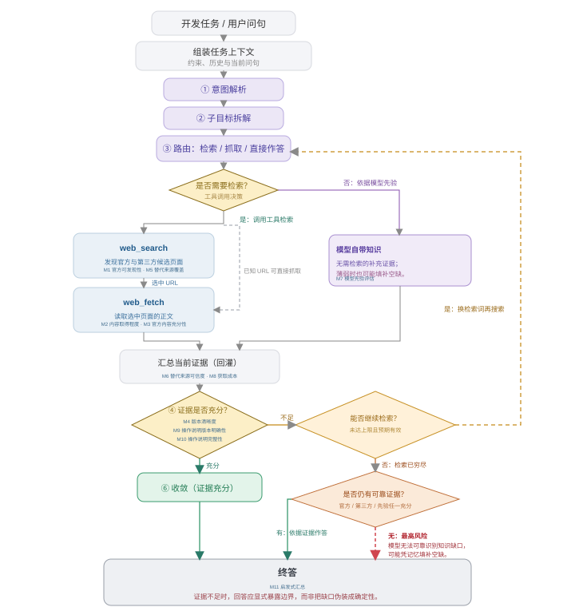
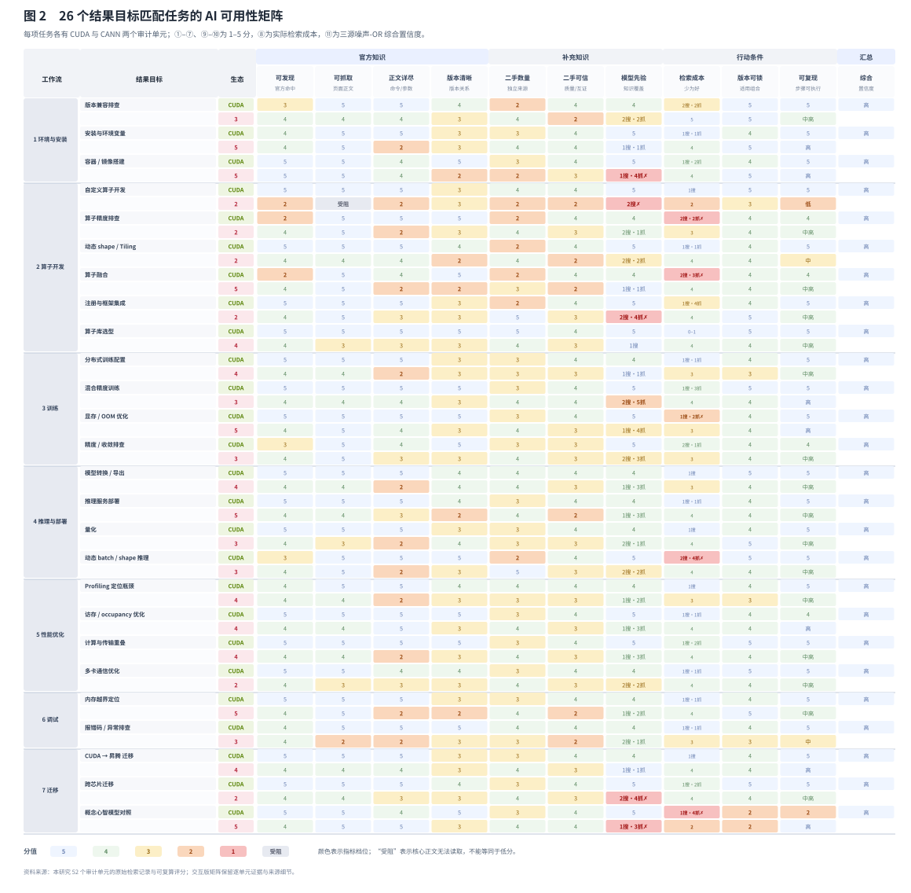

# AI 能找到开发者所需的吗？开发者生态中面向 AI 的知识可得性的定义与度量

> 英文投稿题目：*Can AI Find What Developers Need? Defining and Measuring Knowledge Availability for AI in Developer Ecosystems*

> 中文论文初稿 v0.1
> 证据截止：2026-06-11；写作日期：2026-09-04
> 研究类型：基于可追溯检索记录的任务级案例审计
> 证据范围：CANN 与 CUDA 的 26 组结果目标匹配开发任务；单一具备网页检索与网页读取能力的 Agent；不包含、也不声称包含开发者用户研究、真实算卡运行或硬件性能比较。

## 摘要

生成式 AI 正在成为开发者获取技术知识、解释报错和组织实施步骤的入口。对于版本敏感、生态特有的开发任务，AI 回答的可用性不只取决于模型本身，还取决于技术知识能否被发现、读取、解释、交叉核验并转化为带前置条件的行动。然而，现有评估常将最终答案正确性、网页面向人类的可用性或单一检索命中率作为主要对象，因而难以区分失败究竟源于检索路径、页面工程、版本治理、社区供给还是模型先验不足。

本文定义**面向 AI 的知识可得性**（Knowledge Availability for AI）：一个具备检索能力的 Agent 面对具体开发目标时，能否以可追溯、版本可判定、可执行的证据形成答案，以及为此付出的检索成本。我们以 CANN 与 CUDA 为案例，对 26 个结果目标相近的开发任务进行成对审计，覆盖环境与安装、算子开发、训练、推理与部署、性能优化、调试和迁移。对于每一对问题，研究按统一协议记录官方与第三方来源、网页读取结果、版本线索、模型自带知识、检索过程和答案产出；并以 11 项指标衡量官方可发现性、可抓取性、正文详尽度、版本清晰度、第三方支撑、模型自带知识、检索成本、版本可锁定性、步骤可复现性与综合置信度。综合置信度采用三源噪声-OR 公式，避免把“任一可靠渠道已足以支撑回答”的情形误判为平均分不足。

结果显示，**面向 AI 的知识可得性是任务条件的属性，而不是一个站点的常数**。CUDA 的 26 个任务均处于高置信度区间（均值 .920）；CANN 的均值为 .736，呈现 7 个高、16 个中高、2 个中和 1 个低的任务分布。CANN 的主要问题并非“全站无法读取”：26 个任务中仅自定义算子开发的核心 how-to 缺少可抓取正文或镜像兜底。更广泛的结构性限制是版本树分散、第三方知识的有效冗余不足，以及在专有、快速演进任务上的模型先验薄弱。进一步分析表明，最弱任务并不只由“技术深度”决定，而更受对生态专有知识和专有案例的依赖程度影响；调试类别的两栈差距最大（.287），自定义算子开发是 CANN 中唯一低置信度任务（.410）。

本文贡献包括：（1）给出面向可检索 Agent 的知识可得性定义和 11 指标测量框架；（2）提供 26 组任务级、来源可追溯的 CANN/CUDA 审计案例和可复算的评分管线；（3）识别“可见不等于可读”“可读不等于够用”“单一官方渠道不等于可用知识生态”等任务级失败模式；（4）提出面向 Agent 的文档、版本和社区知识基础设施设计建议。本文不将单一 Agent 的审计外推为所有模型能力，也不将分数解释为硬件、产品或人类开发者体验的总体排名。

**关键词：** 面向 AI 的知识可得性；技术知识生态；检索增强 Agent；开发者文档；版本治理；开发者社区；CANN；CUDA

---

## 1. 引言

开发工作长期是一个持续的信息寻径过程：开发者在代码、官方文档、示例、问答社区与搜索结果之间往返，以形成下一步可执行的判断 [1–4]。这类活动并不只是“找到一个链接”。开发者需要判断资料是否适用于手头版本、能否和现有代码拼接，以及何时还必须通过本机运行验证。尤其在 API、工具链和部署环境快速迭代时，技术文档与社区共同构成了开发者完成任务的知识生态。

AI Coding 正在重新组织这条路径。开发者可以把目标、报错或局部代码交给代码生成工具与 Agent，让它们检索网页、读取仓库、综合资料并起草命令或代码。已有研究显示，开发者会把生成结果用于探索与加速工作，同时通过阅读、比较、运行与外部查证来校验建议 [5,6]。因此，技术文档不再只由人类直接消费；它也成为 Agent 形成建议时必须取得、解释和引用的证据。

这一变化带来一个尚未被充分拆解的体验问题：**当开发者把知识寻径委托给 Agent 时，Agent 能否取得开发者真正需要、且足以支持下一步行动的知识？** 具备检索和工具调用能力的 Agent 通常以“理解目标—搜索—读取—推理—行动—根据反馈修订”的循环工作 [7–10]。现有 Agent 基准多以网页任务完成、代码 issue 修复或最终回答质量评价系统表现 [9–11]；这些评测对于比较 Agent 很重要，却较少说明失败究竟来自模型推理、工具调用，还是 Agent 所面对的外部知识供给不足。

这一区分对 HCI 与开发者生态设计具有直接意义。一个页面能被人类浏览器看到，并不表示 Agent 能取得其核心正文；一段正文可读取，也不表示它足以锁定版本、交叉核验或组织成可执行步骤。反过来，稳定的第三方教程、公开仓库与模型先验有时能够弥补官方入口的不足。若不在任务层面拆开这些条件，文档团队难以知道应优先改善机器可读性、版本关系、示例颗粒度还是社区知识冗余，Agent 产品也难以向开发者暴露证据边界与不确定性。

本文将这类供给侧条件定义为**面向 AI 的知识可得性**（Knowledge Availability for AI）：面对一个明确的开发目标，一个具备实时检索与网页读取能力的 Agent 能否从官方资料、第三方社区和模型自带知识中取得可追溯、版本可判定、可行动的证据，以及为此付出的检索成本。这里的“可得”不等于信息在网上存在；它要求知识能够被发现、读取、判断适用范围、与其他来源核验，并被转化为带前置条件的行动建议。该定义强调“技术知识生态”而非单一网页，也强调“任务”而非抽象站点评分。

我们以 CANN 与 CUDA 为案例开展 26 组任务级审计。两者服务于可比较的计算开发目标，但文档结构、版本体系、术语和社区规模不同。比较的单位不是 API 是否相同，更不是硬件性能；而是开发者要实现的结果目标是否相近，例如安装工具链、将模型转换为部署产物、定位内存越界、集成自定义算子或配置分布式训练。每个结果目标被编写成一对使用各自真实术语的问题，并按同一检索、取证和打分协议执行。

本文回答四个研究问题：

- **RQ1：** 如何将开发者生态中面向 AI 的知识可得性分解为可独立观察、可量化并能定位失败点的指标？
- **RQ2：** 在 26 个结果目标匹配的开发任务中，CANN 与 CUDA 的知识可得性呈现怎样的任务级分布？
- **RQ3：** 哪些知识供给条件最常导致 Agent 的证据链断裂、版本不确定或步骤不可执行？
- **RQ4：** 如何根据任务影响范围和反事实收益，为面向 Agent 的文档、版本和社区建设排序？

本文的贡献是：

1. 提出以“可追溯证据如何被搬进答案”为核心的面向 AI 的知识可得性定义，并将其操作化为 11 项指标与可复算综合公式；
2. 提供 26 个跨栈任务对、52 次审计单元及其检索日志、原始观测和评分程序；
3. 给出任务级而非站点级的实证发现，收窄了“SPA 全站不可用”等过度概括，并识别了版本治理、有效二手冗余和专有知识依赖的结构性作用；
4. 提出将技术文档建设为“人类读者与 Agent 都可行动”的知识基础设施的设计建议。

## 2. 相关研究与概念定位

### 2.1 生成式 AI 的开发者使用与校验

代码生成工具并非简单替代开发者。已有研究表明，开发者会把生成结果作为草稿、对话伙伴、搜索捷径或快速试验的起点，同时通过阅读 diff、运行测试、查阅外部资料和限制权限来管理风险 [5,6]。本文不对开发者行为作新的经验性主张；它关注这些行为发生之前的一个供给侧前提：Agent 究竟能否获得支撑建议的外部技术证据。

### 2.2 Agent 的检索—行动循环

与一次性补全不同，Agent 可以交织任务理解、检索、网页或文件读取、候选行动、工具调用和反馈修订 [7–10]。在本文中，这一循环不是对模型内部认知过程的解释，而是一个可观察的工作结构：每个答案都可能由官方材料、第三方材料、模型先验或这些来源的组合支撑。研究因此不把“回答是否流畅”视为充分结果，而检查证据是否实际到达、是否足够具体、是否与版本和步骤相容。

### 2.3 从门户可用性到知识生态可用性

开发者门户、文档、样例、版本矩阵、仓库、论坛和第三方文章共同构成技术知识生态 [1–4]。传统门户评价主要关心人类用户的导航、理解和任务效率；本研究的对象不同：一个具备网页检索和读取能力的 Agent 是否能发现、抓取、解释和行动化这些资源。二者相关但不能互相替代。页面视觉清晰不等于正文可被读取；SEO 命中不等于参数、版本和错误处理信息足以支持执行。

## 3. 研究设计

图 1 概括本研究所审计的可观察循环：面对一个开发目标，Agent 既可经由检索与网页读取获得外部证据，也可能直接使用模型先验；它随后需要判断手中证据是否足以支持版本明确、可执行的回答。本文并不声称刻画模型内部推理，而是以这条外显的证据循环界定何处应记录来源、读取状态、成本与答案边界。



**图 1　Agent 面向技术知识生态形成答案的证据循环。** Agent 先将开发任务解析为可检索的子目标；它既可能通过 `web_search` 与 `web_fetch` 从官方资料和第三方来源取得证据，也可能直接依赖模型先验。每一轮的关键并非是否已生成一段流畅文本，而是证据能否支持版本锁定与下一步行动：证据充分则收敛；不足而仍有有效检索空间则回到检索；若检索穷尽且没有可靠证据，系统应向用户暴露知识边界。本文的 11 项指标对应图中的来源、过程判断与答案产出节点，用以将这个循环中“哪里断了”变为可观察的审计结果。

### 3.1 审计对象与比较边界

研究以一个具备网页搜索与网页读取能力的 Agent 为测量视角。每个审计单元由“任务 × 技术生态”构成，共 26 个任务、52 个单元。任务覆盖七类工作流：环境与安装、算子开发、训练、推理与部署、性能优化、调试和迁移；并服务于四类开发者角色：应用开发者、模型/框架迁移工程师、算子开发者和系统调优/生态贡献者。

每个任务在 CUDA 和 CANN 中均采用目标相近、但术语与实施路径符合各自生态的问题。例如：

- 模型转换：PyTorch → ONNX → TensorRT 与 ONNX → ATC → `.om`；
- 性能定位：Nsight Systems 与 `msprof` / Ascend PyTorch Profiler；
- 自定义算子：CUDA kernel + extension 与 Ascend C + `msOpGen` + `aclnn`；
- 分布式训练：NCCL 与 HCCL；
- 内存越界定位：Compute Sanitizer 与 `msSanitizer`。

研究不要求两边 API 形式完全相同，也不比较性能、运行时长、硬件成本或真实项目完成率。它比较的是：面向相近结果目标时，Agent 获得可执行技术知识的条件。

### 3.2 统一检索与取证协议

每个任务按同一流程执行：

1. 明确开发者结果目标，并以两栈真实术语写成问题对；
2. 用目标、技术栈和关键工具词进行网页检索，记录命中顺序、检索轮次和是否必须改写查询；
3. 优先读取官方资料，并记录正文是否完整取得、部分取得、仅有导航/摘要，或被 robots/渲染方式阻断；
4. 在官方证据不足时检索第三方来源，区分官方仓/官方论坛与真正独立的社区来源；
5. 记录可识别的版本、前置条件、命令、代码、参数表、错误说明和验证步骤；
6. 按预定义函数将原始观测映射到 1–5 分，生成综合置信度，并保留日志、来源和原始字段供复核。

26 个任务分四批完成。原始过程在 `task_run_log.md`，字段与量化函数在 `score_metrics.py`，可视化矩阵、方法说明与发现汇总分别位于 `17_official_site_focus.html`、`18_metric_definition.html`、`19_findings_ux_synthesis.html`。所有结论均应能回指任务、来源、原始观测或公式；无法读取的正文标记为“受阻”，而不以推断补成低分。

### 3.3 指标体系：三源、两关、四类结果

指标体系从“把知识搬进答案”的链路推导，而不是从网页功能清单拼接。知识有三个渠道：官方一手、第三方社区、模型自带知识。对前两类渠道分别考察触达和质量；再加入跨渠道成本、答案产出与综合汇总，形成 11 项指标（表 1）。

| 层面 | 指标 | 所问问题 |
| --- | --- | --- |
| 官方触达 | ① 官方可发现性 | 官方资料能否在合理轮次内被找到？ |
| 官方触达 | ② 官方可抓取性 | Agent 能否取得核心正文，而不是只看到导航或摘要？ |
| 官方质量 | ③ 官方正文详尽度 | 是否含关键命令、代码、参数表、步骤或完整参考？ |
| 官方质量 | ④ 版本清晰度 | 是否存在 canonical 版本、明确适用范围与配套关系？ |
| 二手触达 | ⑤ 二手丰富度 | 是否存在足量、可发现的真正独立来源？ |
| 二手质量 | ⑥ 二手可信度/一致性 | 来源是否权威、够新、彼此独立并能相互验证？ |
| 模型先验 | ⑦ 模型自带知识 | 在不检索或检索受阻时，模型是否有足够稳定的基础覆盖？ |
| 过程 | ⑧ 检索成本 | 搜索、抓取、失败重试与改写查询带来的摩擦有多高？ |
| 产出 | ⑨ 版本可锁定性 | 最终回答能否确定到具体版本或兼容组合？ |
| 产出 | ⑩ 步骤可复现性 | 回答是否给出可照做或只需少量替换的步骤？ |
| 汇总 | ⑪ 综合置信度 | 在已取得证据下，答案可被可靠行动化的程度如何？ |

指标 ①–⑥和⑧由可追溯原始观测经函数计算；⑦包含训练覆盖密度的半主观判断，同时以技术迭代节奏加入知识截止风险惩罚；⑨和⑩为产出侧因变量，不重复进入综合公式。特别地，“找得到”“抓得到”和“抓到的内容够不够用”被拆为三个指标，以避免把三种不同失败混为一类。

### 3.4 综合置信度与评分规则

综合置信度不使用简单平均。对技术问答而言，一条可靠渠道可能已经足以支撑回答；相反，多个薄弱渠道也不能因均值而被误判为可用。因而我们以归一化后的指标计算三源噪声-OR：

```text
OFF = nm(①) × nm(②) × nm(③)
SEC = nm(⑤) × nm(⑥)
OWN = nm(⑦)
K   = 1 − (1 − OFF)(1 − SEC)(1 − OWN)

综合置信度 = K × [0.7 + 0.3 × nm(④)] × [0.9 + 0.1 × nm(⑧)]
```

其中 `nm(v)=v/5`。官方、第三方和模型先验任一渠道能稳定支撑答案时，`K` 会提高；版本不清和高检索成本则作为跨渠道折扣。若某渠道的核心正文受阻，渠道贡献按 0 计算，但“正文详尽度”仍保留为“受阻/无法实测”的中性状态，而不是伪造为 1 分。综合分的档位为：高（≥ .80）、中高（≥ .63）、中（≥ .45）、低（≥ .24）和很低（< .24）。

该公式的目的不是制造一个“生态总分”，而是让每个任务都能追问：哪一个渠道没有送达？版本和成本各造成了多少折扣？为什么同样的页面读取失败在另一个任务中未必导致回答失败？

### 3.5 可复算性与质量控制

评分脚本为 `score_metrics.py`，每个指标均有 `score_N()` 函数；运行 `python3 score_metrics.py --json` 可重新生成 26×2 的矩阵。二手来源按预定义类型锚定可信度，并加入时效与独立性惩罚：多篇内容若集中在同一平台或互相转述，不因“数量”而被视为独立互证。版本敏感度被保留为任务属性，不放入矩阵列，因为同一结果目标在两栈中通常同样敏感，不能帮助区分知识条件。

## 4. 结果

### 4.1 总体分布：差异存在于任务中，而不是抽象站点上

CUDA 侧 26 个任务的综合置信度均为高，范围为 .835–1.000，均值 .920。CANN 侧范围为 .410–.901，均值 .736：7 个高、16 个中高、2 个中、1 个低。这个分布首先否定了两个简单叙事：它既不支持“CANN 文档整体不可用”，也不支持“只要能搜到官方页，AI 就能稳定回答”。



**图 2　26 个结果目标匹配任务的面向 AI 的知识可得性矩阵。** 矩阵使结果可回溯至每个“任务 × 技术生态”单元，而非只呈现一个生态总分。单元格“受阻”表示关键正文未能被读取，需与低档分值区分；完整的来源、原始观察与逐单元说明保留在可复现补充材料中。

表 2 列出各类工作流的均值。迁移、环境与安装、训练属于 CANN 的较强区域；算子开发和调试较弱，其中调试既是 CANN 绝对值最低的一类，也是两栈差距最大的一类。

| 工作流 | CANN 均值 | CUDA 均值 | 差距 | 任务数 |
| --- | ---: | ---: | ---: | ---: |
| 迁移 | .810 | .907 | .097 | 3 |
| 环境与安装 | .799 | .904 | .105 | 3 |
| 训练 | .791 | .945 | .154 | 4 |
| 性能优化 | .752 | .957 | .204 | 4 |
| 推理与部署 | .723 | .920 | .197 | 4 |
| 算子开发 | .660 | .891 | .230 | 6 |
| 调试 | .646 | .933 | .287 | 2 |

因此，面向 AI 的知识可得性不是“某生态是否更适合 AI”的单一常数。一个生态可能在迁移入口把资料、工具与第三方实践组织得很厚，同时在报错、算子或版本专有任务上缺少足够的证据链。对于 Agent 产品而言，这意味着不能按域名简单决定信任策略；对于文档负责人而言，也意味着平均分不能替代对任务深谷的治理。

### 4.2 可抓取性并非平台常量：四种证据到达状态

早期观察曾把部分 CANN 文档的 SPA 视为系统性短板。26 个任务全量审计后，这一结论需要收窄。绝大多数主路径页面可通过 SSR、静态子树或镜像得到正文：`quickstart` 中的模型转换、面向 PyTorch 的 profiler、Tiling 正文、通信和最佳实践子树均提供了可用内容。唯一没有可抓取核心 how-to 或可靠镜像兜底的任务是 D（Ascend C 自定义算子开发），其核心 `opdevg` 引导链路的正文未能被 Agent 取得。

这不是“SPA 无关紧要”。D 恰好同时具有较弱第三方支撑和薄弱模型先验，因而三条知识渠道都未能兜底，综合分降至 .410，是唯一低档任务。相反，A（模型转换）和 B（性能定位）虽有深层参考页受限，但主路径 how-to 位于可抓取子树，仍能支撑中高置信度回答。

基于这一对照，证据到达不宜二分为“能抓/不能抓”，而应区分四态：

1. **完整可抓**：正文、命令和参数可直接得到；CUDA 侧所有任务和 CANN 多数主路径属于此类；
2. **部分可抓且有镜像兜底**：关键内容在替代入口可得，但链路并不直接，例如跨芯片迁移任务；
3. **可抓但内容泛化**：页面存在且可读，却不能解释关键场景，例如 EZ9999 等错误码的通用兜底说明；
4. **核心正文受阻且无兜底**：关键 how-to 不能取得，第三方和模型先验也不足以稳定补偿，例如自定义算子开发。

这一结果回答 RQ3 的一部分：可抓取性应按“任务所需的具体子树与正文”测量，不能根据站点技术栈或首页渲染方式整体赋值。

### 4.3 版本治理是覆盖面最广的折扣

CANN 的版本清晰度是最广泛的限制：26 个任务中有 12 个在指标④上为 2 分；取得 5 分的两个任务主要是版本无关的通识任务。问题并不只是“版本很多”，而是同一内容散布在 `8.0.RC2`、`80RC3alpha`、`82RC1alpha`、商业版与社区版等并存树中，缺乏清晰的 canonical 指向；同时 CANN、驱动、PyTorch、`torch_npu` 等往往需要跨多个页面拼接配套关系。

版本不清会对三条知识渠道同时施加折扣：官方文档即使正文充足，Agent 也难以确定它是否适用于当前组合；第三方文章可能引用旧版；模型先验则更容易在快速迭代的 API 上过时。反事实计算显示，若实现 canonical 版本入口和可查询的配套组合，并将④提升到 5，26 个 CANN 任务的平均综合置信度将提高 .104，16 个任务跨越档位。这是所有供给侧改进中覆盖面最大的项目。

### 4.4 有内容不等于有冗余：第三方与模型先验的双薄弱

当官方资料不足时，第三方和模型先验是 Agent 的两条绕行通道。CANN 的有效二手来源常为 2–3 条，且集中于 CSDN、华为云论坛等少数平台；部分任务还出现同平台多文互相转述的情况。知乎等平台的反爬会进一步缩小“人眼看到的社区”与“Agent 实际能读取的社区”之间的交集。相比之下，CUDA 任务更常拥有 Stack Overflow、独立博客、课程和代码仓等多平台互证。

模型自带知识的差异会放大这一问题。CANN 在 26 个任务上的模型先验均值约为 2.85，CUDA 无任务低于 4。对于成熟 CUDA 工具，检索常用于核对细节；对于快速变化且专有的 CANN 工具链，检索通常是形成答案的主要甚至唯一来源。于是，一旦官方正文、版本信息或二手社区中任一环节断裂，Agent 便更容易以类比外推填补空白。本文不把这种风险称为“模型幻觉率”，因为本研究没有测量模型内部真实性；它测量的是答案缺乏可追溯外部证据时的知识条件。

X（内存越界定位）说明了“官方正文很强仍可能不够”。该任务的 `msSanitizer` 官方正文详尽度为 5，但独立二手来源仅一条、模型先验为 2，因此总体仍处于中高而非高。对 Agent 而言，生态的可用性取决于是否存在可替代、可核验的证据网络，而不是单一官方页面的质量。

### 4.5 深度只是表象，专有知识依赖才是更接近的机制

若按开发流程深度分组，CANN 的均值从上手/环境侧 .77、训练/日常侧 .74 到算子/深处自研侧 .70，呈单调下降。但这不是充分解释。深层任务 U（访存/occupancy 优化）取得 .88，因为其最佳实践子树充足，且缓存与访存原理能从 CUDA 的通识心智模型迁移；反过来，较浅的 E（错误码排查）仅为 .55，因为它依赖专有错误码案例，官方页面内容泛化，第三方与模型先验也不足。

因此，更接近的解释不是“任务越深，文档越差”，而是**任务对生态专有知识、专有版本关系和专有案例的依赖越高，Agent 越缺少可替代的知识通道**。这一机制为文档投入提供了更精确的优先级：通识性原理可以由已有模型知识和跨栈经验部分兜底；错误码、版本组合、算子实现和设备特性等专有知识则不能依赖类比外推。

### 4.6 反事实改进排序：抬均值与修深谷是两本账

研究以当前原始分为基线，将不同供给侧改进的假设变化代回综合公式，得到表 3。它不是实际 A/B 测试，而是用于透明比较“若某一指标确实改善，哪些任务会受益”的反事实分析。

| 改进假设 | 平均综合提升 | 跨档任务 | 最大单任务提升 | 主要影响 |
| --- | ---: | ---: | ---: | --- |
| canonical 版本与配套查询器 | +.104 | 16/26 | +.18 | 全局版本清晰度 |
| 扶持独立二手生态 | +.056 | 7/26 | +.11 | 社区丰富度与互证 |
| 提供可被长期吸收的权威语料 | +.048 | 4/26 | +.11 | 模型先验（长期） |
| 机器可读出口（如 Markdown/文本导出） | +.027 | 4/26 | +.11 | 正文可读取性 |
| 页面组织与可抓取规范 | +.013 | 1/26 | +.06 | 已可读页面的正文深度 |
| 自定义算子 how-to 静态化 | +.004 | 1/26 | +.11 | D：.41 → .52 |
| 错误码“一码一页” | +.003 | 1/26 | +.09 | E：.55 → .64 |

“版本收口”在平均提升上断层领先，因为它影响广泛；但这不意味着只应做广覆盖项目。自定义算子 how-to 静态化和错误码细化只改变单个任务，均摊收益小，却分别修复了矩阵中唯一的低档任务和调试深谷。前者是普惠型投资，后者是最低体验救济；二者应使用不同的资源决策口径。

## 5. 讨论：面向 Agent 的知识基础设施

### 5.1 从“页面可见”转向“证据可行动”

面向 Agent 的文档不应被理解为把网页改成纯文本，而是让每个关键任务单元都能以明确证据被引用和执行。一个最低限度的证据单元应说明：任务目标、适用版本、前置条件、最小命令或代码、预期输出、常见失败、恢复路径和稳定 URL。这样做同时服务人类读者与 Agent：人能快速定位，Agent 能减少把片段拼成未经验证结论的需要。

### 5.2 版本关系应成为可查询的产品能力

版本号不应只是页面标题或 URL 片段。对于工具链生态，版本关系本身是一个需要被查询和验证的对象。可执行的做法包括：提供 canonical 当前版本和统一历史归档；在每页标注适用版本与最后验证时间；发布驱动、工具链、框架和插件之间的机器可读兼容矩阵；允许开发者或 Agent 用最小环境 manifest 查询唯一或有限的合法组合。否则，文档越多，Agent 与开发者越可能从不同版本树中取到互不兼容的片段。

### 5.3 将社区视作冗余网络，而非流量附属品

第三方内容的价值不只在于数量。对于 Agent，它承担官方证据不可达、过于概括或版本不匹配时的绕行与互证功能。因此，社区治理需要关注可访问性、独立性和可归因性：高质量样例、公开 issue、带版本的复盘、可索引的错误码讨论和不同平台的独立解释，比同平台内大量重复转载更能提高知识生态的韧性。

### 5.4 Agent 产品应暴露证据和未知，而非隐藏不确定性

当任务依赖专有版本、硬件拓扑或私有工程事实时，理想的 Agent 行为不是生成看似完整的答案，而是明确说明：哪些步骤已有来源支撑，哪些内容来自类比或旧知识，尚需用户提供什么事实，以及下一步最小验证是什么。本文的指标可以转化为 Agent 界面中的状态：来源已取得/部分取得/受阻，版本已锁定/待确认，步骤可直接执行/需要本机事实。这样，知识可得性评估不只诊断内容生态，也能反向塑造更可控的 Agent 交互。

## 6. 局限与有效性边界

本研究有以下限制。

第一，研究使用单一 Agent 与特定检索、网页读取配置，不能代表所有模型、搜索引擎、企业知识库或未来版本的能力；其结论应理解为一个明确测量条件下的案例审计。第二，单任务单元主要来自一次完整检索运行，虽保留了过程和可重算字段，但无法给出跨时间、跨模型的方差估计。第三，指标⑦“模型自带知识”仍含半主观判断；研究以技术迭代节奏加入知识截止风险，却不能直接观测训练语料覆盖。第四，第三、四批有部分问题文本在事后补编，尽管原始观测和过程记录仍可回溯，措辞差异仍可能影响检索。第五，反事实 ROI 只说明在既定公式与假设下的潜在收益，不是站方真实用户行为、流量转化或改版效果的因果估计。

更重要的是，本文不测量人类开发者的主观体验、实际完成率、协作方式或硬件性能。它也不声称 CUDA 与 CANN 的任何永久总体排名。人类开发者体验、真实项目协同和环境运行结果需要用不同的研究设计独立测量，而不能从本审计分数直接推出。

## 7. 结论

当 AI Agent 成为技术知识的重要使用者时，文档与社区不再只是供人浏览的内容集合，而是影响答案能否被可靠行动化的知识基础设施。通过 26 组 CANN/CUDA 开发任务的可追溯审计，本文表明：面向 AI 的知识可得性需要在任务层面理解；“可见、可读、够用、可锁版本、可复现”是相互独立的条件；最广泛的限制来自版本治理与有效知识冗余，而非笼统的页面可抓取性；最危险的深谷出现在高专有知识依赖的算子和调试任务。

这一视角为技术社区提出了一个可操作的目标：不仅让页面被人类读到，更要让 Agent 能取得可引用、可验证、可执行的证据，并在证据不足时清楚地暴露未知。对文档、工具链和 Agent 产品而言，面向人和 AI 的知识基础设施将成为同一项设计任务的两个侧面。

---

## 参考文献（引言文献地图首版；正式投稿前统一转 ACM 引用格式并逐条核验）

1. Brandt, J., Guo, P. J., Lewenstein, J., Dontcheva, M., & Klemmer, S. R. (2009). *Two Studies of Opportunistic Programming: Interleaving Web Foraging, Learning, and Writing Code*. Proceedings of the SIGCHI Conference on Human Factors in Computing Systems. https://doi.org/10.1145/1518701.1518944
2. Ko, A. J., DeLine, R., & Venolia, G. (2007). *Information Needs in Collocated Software Development Teams*. Proceedings of the 29th International Conference on Software Engineering. https://doi.org/10.1109/ICSE.2007.45
3. Sillito, J., Murphy, G. C., & De Volder, K. (2008). *Asking and Answering Questions During a Programming Change Task*. IEEE Transactions on Software Engineering, 34(4), 434–451.
4. Robillard, M. P. (2009). *What Makes APIs Hard to Learn? The Answers of Developers*. IEEE Software, 26(6), 27–34. https://doi.org/10.1109/MS.2009.116
5. Vaithilingam, P., Zhang, T., & Glassman, E. L. (2022). *Expectation vs. Experience: Evaluating the Usability of Code Generation Tools Powered by Large Language Models*. CHI Conference on Human Factors in Computing Systems Extended Abstracts. https://doi.org/10.1145/3491101.3519665
6. Barke, S., James, M. B., & Polikarpova, N. (2023). *Grounded Copilot: How Programmers Interact with Code-Generating Models*. Proceedings of the ACM on Programming Languages, 7(OOPSLA1). https://doi.org/10.1145/3586030
7. Lewis, P., Perez, E., Piktus, A., et al. (2020). *Retrieval-Augmented Generation for Knowledge-Intensive NLP Tasks*. Advances in Neural Information Processing Systems, 33.
8. Yao, S., Zhao, J., Yu, D., et al. (2023). *ReAct: Synergizing Reasoning and Acting in Language Models*. International Conference on Learning Representations.
9. Zhou, S., Xu, F. F., Zhu, H., et al. (2024). *WebArena: A Realistic Web Environment for Building Autonomous Agents*. International Conference on Learning Representations.
10. Yang, J., Jimenez, C. E., Wettig, A., et al. (2024). *SWE-agent: Agent-Computer Interfaces Enable Automated Software Engineering*. Advances in Neural Information Processing Systems.
11. Jimenez, C. E., Yang, J., Wettig, A., et al. (2024). *SWE-bench: Can Language Models Resolve Real-World GitHub Issues?* International Conference on Learning Representations.

## 附录 A：26 个任务与 CANN 综合置信度

| 代号 | 任务 | CANN 综合置信度 |
| --- | --- | ---: |
| A | 模型转换/导出 | .75 |
| B | Profiling 定位瓶颈 | .70 |
| C | 算子库选型 | .77 |
| D | 自定义算子开发 | .41 |
| E | 报错码/异常排查 | .55 |
| F | 分布式训练配置 | .72 |
| G | CUDA→昇腾迁移 | .84 |
| H | 量化 | .69 |
| I | 版本兼容排查 | .73 |
| J | 安装与环境变量 | .80 |
| K | 容器/镜像搭建 | .86 |
| L | 算子精度排查 | .69 |
| M | 动态 shape/Tiling | .63 |
| N | 算子融合 | .74 |
| O | 注册与框架集成 | .72 |
| P | 混合精度训练 | .83 |
| Q | 显存/OOM 优化 | .86 |
| R | 精度/收敛排查 | .75 |
| S | 推理服务部署 | .74 |
| T | 动态 batch/shape 推理 | .72 |
| U | 访存/occupancy 优化 | .88 |
| V | 计算与传输重叠 | .72 |
| W | 多卡通信优化 | .70 |
| X | 内存越界定位 | .74 |
| Y | 跨芯片迁移 | .68 |
| Z | 概念心智模型对照 | .90 |

## 附录 B：可追溯材料

- 任务级可视化矩阵：[`17_official_site_focus.html`](../../17_official_site_focus.html)
- 指标定义、评分锚点和公式：[`18_metric_definition.html`](../../18_metric_definition.html)
- 发现、反事实 ROI 和局限：[`19_findings_ux_synthesis.html`](../../19_findings_ux_synthesis.html)
- 原始检索过程：[`task_run_log.md`](../../task_run_log.md)
- 原始观测和重算脚本：[`score_metrics.py`](../../score_metrics.py)
