# AI 能找到开发者所需的知识吗？开发者生态中面向 AI 的知识可得性的定义与度量

## 摘要

AI Agent正在改变开发者查找技术资料和获得任务指导的方式。评价这条知识获取路径，需要考察Agent能否发现相关来源、取得所需内容，并形成具有明确依据和适用条件的建议。本文将这些条件概念化为面向AI的知识可得性，提出任务级记录协议及十一项指标，涵盖知识来源、获取成本和回答属性。我们将该方法应用于26类面向AI加速计算的软件开发任务，比较不同生态中的知识可得性。案例分析区分了核心操作正文未取得、正文可读但指导不足，以及主流程有据可依但部分参考资料仍不可得等情形，并识别出跨任务反复出现的版本问题。这些发现将开发者判断技术建议时所需的依据与具体知识缺口联系起来，为资料交付、内容完善、版本关系说明及Agent反馈等方面的改进提供方向。本文贡献一个概念框架、一套可检查的协议及其案例应用，用于诊断开发者通过AI获取技术知识时所面对的知识条件。

## 关键词

面向 AI 的知识可得性；开发者生态；技术文档；信息寻径；AI Agent；测量方法

## 引言

开发者在决定下一步行动时，常常往返于文档、代码示例、搜索结果和社区解释之间。关于机会式编程和开发者信息需求的研究表明，寻找与解释信息本身就是编程活动的一部分 [@brand2009; @ko2007; @sillito2008]。有用的信息必须契合当前任务：命令需要正确的选项，API 示例需要对应的版本，错误解释需要提供足够的上下文来指导排查。因此，文档的存在只是其有用性的一个条件。

具备检索与工具调用能力的开发 Agent 为这一知识环境增加了一条协作路径。开发者既可以围绕报错或局部代码提出问题，也可以描述待完成的变更或结果目标，将资料查找、文档阅读、实现步骤组织以及部分代码修改委派给 Agent。为推进任务，Agent 可能自行在官网、文档、仓库与社区之间搜索、读取和整合材料，再起草回答、实现方案或代码改动。关于代码生成工具、对话式编程辅助和 Agent 支持的研究既描述了这种支持带来的机会，也揭示了理解和核验生成建议的困难 [@vaithilingam2022; @barke2023; @programmerAssistant2023]。委托检索改变了支撑材料到达开发者的方式，但开发者仍需判断建议是否有可辨认的依据、是否符合本地环境，以及是否需要更多信息。Agent能否取得技术材料，是这些依据能否被呈现和检查的条件之一。测量这一获取过程，因而可以识别经由AI形成的指导所依赖的知识缺口。

设想 Agent 被问到如何实现并集成一个自定义加速器算子。搜索可能返回官方开发指南，但阅读工具只取得导航和元数据。在错误诊断任务中，同一工具可能取得完整的官方页面，页面却只有一条笼统的查看日志指令。检索成功指标可能将这两个问题都记为已有相关结果。访问指标能够区分第一种失败，却无法区分第二种。即便操作说明足够充分，若其引用了彼此不兼容的工具包与框架版本，也仍可能存在歧义。这些区别关系到文档团队应修复什么，以及 Agent 设计者应向用户暴露哪些不确定性。

现有评估方法已经区分了检索质量、上下文相关性、答案忠实度及其他相关属性。RAGAS 和 ARES 提供了对检索增强生成各组件的评估，ALCE 则考察生成答案及其引用 [@ragas2024; @ares2024; @gao2023alce]。本文处理的是一个互补的测量问题：如何检查 Agent 在处理具体开发任务时遇到的技术知识条件，包括访问失败、版本关系、替代来源，以及审计者判断的依据。这要求把开发者的信息需求与实际取得的资源联系起来，而不是从流畅的回答推断知识可得性。

我们将**面向 AI 的知识可得性**定义为：在明确的检索条件下，一个指定的 Agent 及工具配置能够发现、取得任务相关技术知识，并评估其适用性的程度。这是一个关系性构念：它涉及特定时点上的任务、知识环境，以及访问该环境的方式。我们通过证据记录协议和十一项指标将其操作化。这些指标区分来源条件、获取成本、回答检查，以及由 M1–M8 计算的综合置信度。

该方法面向开发者生态的建设与运营团队，以及Agent产品与界面团队，旨在帮助他们定位技术资料在发现、获取和任务支撑方面的缺口，并明确知识供给与Agent反馈需要改进的环节。案例应用展示了可服务于这些用途的诊断区别；其在团队工作中的实际价值仍需评价。

本文提出两个研究问题。**RQ1：** 如何定义并操作化面向 AI 的知识可得性，使任务特定的访问条件与证据缺口能够被系统记录和复核？**RQ2：** 该方法在不同开发任务中揭示了哪些知识可得性模式，这些模式如何为文档与 Agent 设计提供依据？

我们通过一个方法框架及其在面向 AI 加速计算的软件开发任务中的应用来回答这些问题。案例覆盖 26 类任务，共形成 52 条任务侧记录。其中，25 类任务比较 CANN 与 CUDA 开发情境；一类迁移任务以 ROCm/HIP 为对照目的地，单独处理。案例应用将任务级测量连接到跨任务模式与设计启示。具体贡献包括：（1）一个将知识条件与检索成功、答案正确性区分开的构念；（2）一套任务级协议、指标定义和可移植的分析材料；（3）具体案例与跨任务综合分析，区分不同断点，并将其连接到文档与 Agent 设计。

## 相关研究与构念边界

### 开发者信息寻找与文档

信息寻径理论将信息寻找行为与可用信息的结构和预期价值联系起来 [@pirolli1999]。编程研究展示了开发者如何交织进行搜索、学习和实现，以及他们的问题如何依赖于正在开展的工作 [@brand2009; @ko2007; @sillito2008]。API 学习中的困难也促使研究者关注技术接口周围的解释性资源 [@robillard2009]。这些研究表明，开发者需要什么信息，与正在完成的任务密切相关。因此，本文以具体开发任务为单位，考察Agent能否找到并取得所需资料，以及资料是否提供了完成任务所需的解释、参数说明和操作步骤。

本文方法不从机器访问情况推断人类可用性。浏览器能够读取的页面可能对某个特定抽取工具不可访问；反过来，Agent 容易抽取的文本也可能让人难以导航。我们考察的是受委托的知识获取路径所面对的条件。关于开发者时间、信任、满意度或任务完成情况的主张，需要另外的证据。

### 面向编程的 AI 支持

AI编程辅助研究区分了获得建议与理解、调整和检查建议。Vaithilingam等描述了理解、修改和调试生成代码时的困难 [@vaithilingam2022]；Barke等区分了开发者使用代码生成模型时的加速与探索模式 [@barke2023]；Ross等考察了围绕代码上下文开展的对话式辅助 [@programmerAssistant2023]。这些发现促使我们关注开发者考虑一项建议时能够获得哪些支撑信息。本文协议检查相关来源段落、版本条件和操作细节能否被取得并与建议关联，为研究开发者如何使用AI辅助提供知识条件层面的描述。

Agent 能够交织推理与工具使用，而检索增强生成提供了将外部信息纳入生成过程的方式 [@lewis2020; @yao2023]。WebArena、SWE-bench 和 SWE-agent 在贴近真实的网页与软件工程情境中评估或开发 Agent [@zhou2024webarena; @jimenez2024swebench; @yang2024sweagent]。其任务结果是系统表现的重要证据。本文框架则对这些系统运行时面对的知识条件提供互补描述。失败可能涉及证据不可得、对可得证据的解释不充分，或执行不成功；本文方法直接处理其中第一类问题，并记录有助于区分这些情形的信息。

### 检索、归因与可得性构念

RAGAS 和 ARES 评估检索上下文与生成答案的属性；ALCE 评估有引用支持的生成 [@ragas2024; @ares2024; @gao2023alce]。因此，我们并不声称既有评估将检索或答案质量视为不可拆分的整体。本文方法关注的是技术任务需求、获取过程与周围知识生态结构之间的联系。在这一情境中，版本兼容性、对操作指南的部分访问，以及对社区变通方案的依赖尤为重要。

表 1 中的区分界定了这一构念的位置。知识可得性可以是基于证据作答的必要条件，却不足以保证正确性。Agent 可能误解一个可得来源，也可能在未取得任何外部证据的情况下，凭先验知识给出正确答案。这些结果应保持可区分。

| 评估对象 | 核心问题 | 与本文方法的关系 |
| --- | --- | --- |
| 检索成功 | 是否返回了相关结果？ | 获取过程的一个条件；不能证明所需内容已被取得。 |
| 文档可用性 | 目标读者能否导航和理解这些材料？ | 相关的面向人类的属性，需要单独评估。 |
| 面向 AI 的知识可得性 | 在所记录条件下，哪些任务相关知识能够被取得？ | 本文所操作化的构念。 |
| 答案正确性与归因 | 回答是否正确，其来源是否支持其中的主张？ | 可以使用已取得证据进行的下游评估。 |
| 执行成功 | 所提出的行动能否在目标环境中奏效？ | 需要执行或其他独立的结果证据。 |

: 表1　构念边界与相邻的评估对象。

## 方法框架

### 分析单位与任务需求

分析单位是一次**任务侧知识获取过程**：使用明确的 Agent 和检索配置，在特定技术生态中围绕一个开发目标开展知识获取。任务说明记录期望结果、初始材料、约束、版本依赖，以及支撑下一步行动所需的证据。例如，模型转换可能需要转换命令、输入形状说明、目标设备设置，以及检查生成产物的方法。这些需求指导检查；页面长并不自动意味着内容充分。

任务选择必须服务于应用目的。生态评估可能寻求覆盖不同工作流；文档团队的审计可能聚焦反复出现的支持问题。若无进一步的抽样证据，两者都不能说明这些任务在总体中的发生频率。跨生态应用时，分析者应记录初始条件与任务范围的差异，而不是假设名称相近就意味着任务等价。该框架也可用于同一生态内部、不同版本之间或不同检索配置之间，只要比较条件得到明确说明。

图 1 将各项测量放在一条可观察的工具调用循环中。它是一个分析模型，而非对模型隐含推理过程的重建：Agent 先搜索候选来源、选择 URL、读取正文或记录失败，再汇总证据并检查任务充分性与版本适用性。证据不足而仍有可检索空间时，循环回到查询精化；模型先验则作为不产生可观察来源的独立分支登记。因此，先验知识不自动视为可追溯证据。

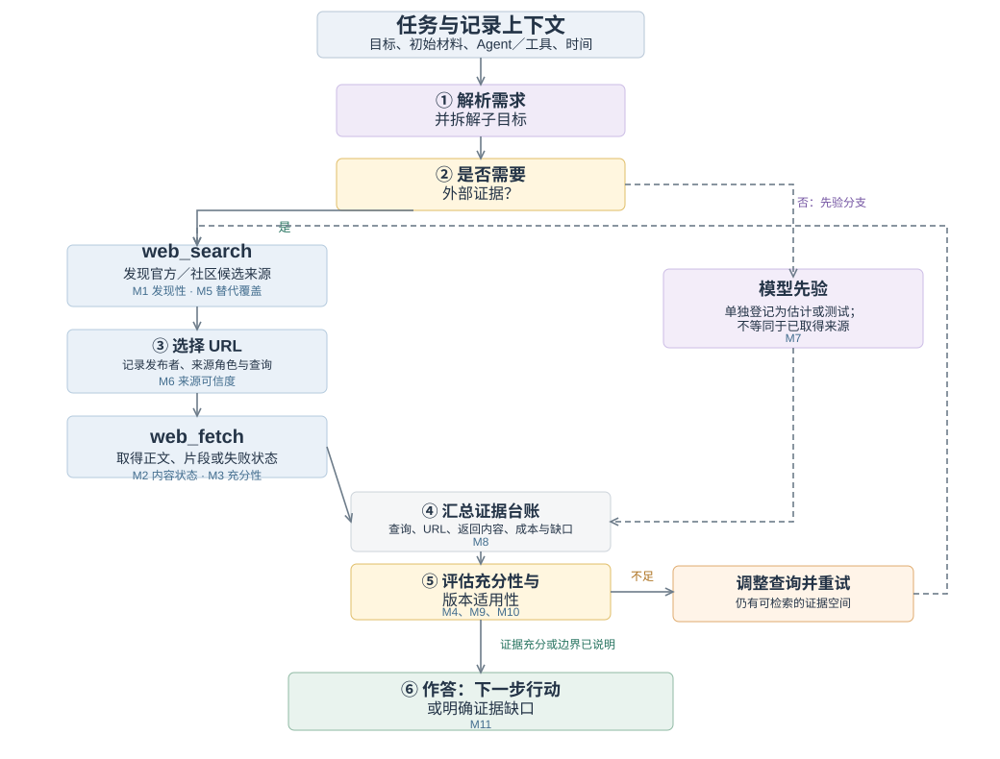{#fig:framework description="概念流程图从开发任务与上下文开始，展示意图解析、子目标拆解、路由和“是否需要检索”两个判断节点。检索分支显示 web_search 发现官方和第三方候选来源、选中 URL、web_fetch 抓取正文，以及已知 URL 时的直接抓取路径；另一分支为模型先验。各来源回灌至当前证据汇总，再经“证据是否充分”“能否继续检索”“是否仍有可靠证据”三个判断节点，通向收敛、重试或带风险的终答。所有 M1 至 M11 均以统一样式标出名称与测量位置。"}

### 来源、获取与行动条件

该框架考察三个知识渠道：官方材料、社区或第三方材料，以及模型先验知识。对于外部渠道，它将**访问**与**充分性**分开。发现关注是否找到了候选来源；获取关注阅读工具实际返回了什么；充分性则关注返回内容是否提供了任务所需的命令、解释、参数或诊断案例。版本适用性需要跨渠道考察，因为各个来源可能各自有用，却描述了不同的环境。

官方属性由发布者与材料的关系决定，而非由托管平台决定。厂商的代码仓库或博客属于该厂商的官方渠道；托管在同一平台上、由独立作者撰写的教程则可能具有不同属性。跨平台转载也使域名多样性成为衡量证据独立性的不完善代理。因此，协议保留来源身份、发布者、可获得的日期，以及观察到的衍生或重复关系。缺少这些细节时，应记录为不确定性。

该方法的产出是一份带有证据记录的**可得性剖面**。它标明找到了什么、取得了什么、哪些内容看起来充分、哪些适用条件仍未解决，以及获取这些知识所需的成本。可选的汇总指标有助于概括某套操作化方案，但不能取代这一剖面。尤其需要指出，模型内部知识即使能够支持回答，也不能让一个不可访问的外部来源变得可访问。

### 证据记录

证据记录将每项判断与其依据联系起来。最低限度的字段包括任务问句与初始条件、已知的 Agent 与工具配置、采集时间、查询和选定 URL、发布者与来源角色、返回内容或相关片段、访问结果、适用版本、内容所支持的任务需求、获取次数，以及编码决定及其理由。另设字段标明条目属于直接记录、后续编码、估计，还是不可获得。

这一区分可以避免一种常见的报告错误：仅仅因为脚本为某个解释赋予了数字，就把解释转化为观测。抽取失败反映工具与来源交互的结果；将某段解释判为充分，是对照任务需求作出的判断；估计模型对某个工具包的熟悉程度，则属于推断，除非有单独测试为其提供支持。数值编码不会消除这些差别。

## 操作化与测量协议

### 十一项指标及其证据角色

本方法以官方资料、第三方资料和模型自带知识为三类知识来源，分别考察资料的发现、获取与质量，并通过检索成本和回答产出指标连接知识获取过程与回答形成。十一项指标的定义及评分依据见表2。

| 编号 | 指标 | 证据与解释 |
| --- | --- | --- |
| M1 | 官方可发现性 | 衡量找到任务相关官方资料的难易程度，依据官方结果位置、检索轮次及是否需要调整查询评分。 |
| M2 | 官方正文可获取性 | 衡量工具获取任务相关官方正文的情况，记录选定页面的抓取形态、正文返回情况及访问障碍，并按获取状态评分。 |
| M3 | 官方正文详尽度 | 衡量官方正文提供任务所需知识的详细程度，结合内容覆盖层级及命令、代码的可操作程度评分。正文获取受阻时标记为“受阻”。 |
| M4 | 资料版本清晰度 | 衡量从官方资料中确定适用版本的明确程度，综合并存版本数、兼容矩阵及芯片与框架的配套条件评分。 |
| M5 | 第三方来源数量 | 衡量检索中获得的第三方资料数量，依据记录的来源条数分档评分。 |
| M6 | 第三方来源可信度 | 衡量第三方资料的可信程度，以来源类型为基础，结合发表时间、内容一致性和来源平台分布调整评分。 |
| M7 | 模型自带知识估计 | 估计模型已有知识对任务的支撑程度，以模型自评为基础，根据相关技术的更新节奏调整评分。 |
| M8 | 检索与获取成本 | 衡量获取知识所需的检索与抓取成本，根据检索轮数、抓取次数和抓取失败次数计算；成本越低，评分越高。 |
| M9 | 回答版本明确性 | 衡量回答对适用版本及组件组合的明确程度，按能否给出确切版本、基本确定版本、限定范围或仍难以确定分档评分。 |
| M10 | 回答步骤可操作性 | 衡量回答中的命令与步骤具备的操作条件，按可直接采用、需替换参数、需小幅修改或仅提供骨架分档评分。 |
| M11 | 综合置信度 | 综合官方资料、第三方资料与模型自带知识对回答的支撑，并结合版本清晰度和检索成本计算，公式见下文。 |

: 表2　十一项指标及各自能够支持的证据解释。

M1–M7描述三类知识来源提供的支撑，M8反映获取这些知识的成本，M9与M10分别考察回答的版本明确性与步骤可操作性。M11由M1–M8计算，回答产出指标单列呈现。分项指标与综合置信度共同构成任务级评价结果，用于分析知识支撑的组合及需要改进的环节。

### 协议的应用

**第一，定义任务与记录边界。** 说明开发结果、初始材料，以及评估充分性所依据的需求。记录 Agent、工具、语言、日期和上下文策略。明确分析单元包含新开展的获取、复用的观测，还是两者兼有。设置适合该应用的检索预算或其他可观察的停止标准；分析者不能仅根据查询次数，推断 Agent 停止的内部原因。

**第二，记录发现与获取。** 保留查询、候选来源、选定 URL 和阅读结果。检查官方材料，并记录实际遇到的社区替代来源，无论它们来自混合搜索结果，还是后续搜索。将阅读失败与搜索失败分开。当镜像或另一个版本提供了所需内容时，将其与原始尝试关联，使绕行方案保持可见。

**第三，评估任务支持与适用性。** 将已取得材料映射到任务需求。区分已返回但缺少必要内容的文档，与从未返回的文档。记录明确标注的版本和兼容依赖，包括尚未解决的本地事实。URL 中的版本号是一条线索，本身并不是已经核验的兼容关系。

**第四，依据观测评分。** 应用公开的锚点，说明各项观测对应的评分，并标注估计值与缺失字段。内容取得程度有四种状态：核心内容已取得；部分内容已取得；所需内容未取得；未知。访问路径另记为原入口、替代入口或未知。因此，经替代入口取得完整镜像正文时，内容仍为“核心正文已取得”，而不会仅因入口变化被降为部分内容。充分性可以使用有序锚点，从笼统片段、概述、可用的主路径材料，到详尽的任务相关参考材料。编码理由应指出覆盖了哪些具体需求，而不应只依赖页面长度。

**第五，检查操作说明并报告剖面。** 明确用于M9与M10评价的回答或指导内容，将其中的关键步骤与版本主张映射到已取得证据，并记录矛盾、来源依赖与缺乏支持的步骤。报告综合置信度的公式、缺失数据处理方式及计算假设。配套的填写示例呈现从需求到事件、来源、取得的证据及评分的链条，并将原始调用次数与M8成本评分并置。

该方法的新意在于将分析单位、证据记录、指标角色与诊断解释连接为一套明确规定。搜索排名、阅读成功与版本标签都是熟悉的观测。它们在这里的价值来自与一个开发任务需求的联系，以及说明观测如何转化为诊断。

### 评分规则与综合置信度

各项指标通过相应规则转换为1–5分的有序等级。以下按知识来源、获取成本、回答产出与综合置信度说明评分；附录A给出完整的优先判断条件和修正项，任务记录提供相应的观测字段。

**官方资料（M1–M4）。** 官方可发现性综合结果位置、检索轮次及查询调整情况；正文可获取性按实际抓取状态分档。正文详尽度结合任务内容覆盖与命令、代码的可操作程度；资料版本清晰度考察具体版本标识及其配套关系。图2呈现四项指标的分档：M3的低分区别在于是否已有任务相关细节，M4则区分版本标识缺失与版本已列但配套未明。M3在正文获取受阻时标记为“受阻”。

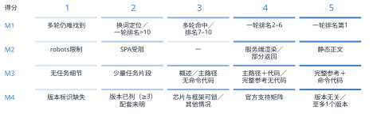{#fig:scoring-official description="四行共用1至5分刻度，分别呈现官方发现、正文获取、正文详尽度与资料版本清晰度。M3由无任务细节递进至少量任务片段；M4由版本标识缺失递进至版本已列但配套未明。M2的3分为空档。"}

**第三方资料、模型知识与成本（M5–M8）。** M5按去重第三方来源数分档。M6以来源类型基准分的均值为基础，再按内容一致性、发表时间与平台分布调整。M7从模型对任务的知识自评出发，按技术更新节奏修正；图3中部给出修正前的自评档位。M8采用加权成本 $c=r+0.5f+4e$，其中 $r$、$f$、$e$ 分别为检索轮数、抓取次数与失败次数。

{#fig:scoring-support description="中部是一行M7模型自评档位，下方并列两个阶梯图：M5随去重第三方来源数量增加而上升，M8随加权成本增加而下降。M8实心点表示计入该档的边界，空心点表示不计入。顶部M6计算过程图分为来源赋值、均值与修正、最终评分三个步骤。来源基准分2.5、3、3.5、4先取均值，再加一致性、时效与平台独立度修正，取整并限制在1至5分。"}

**回答产出（M9–M10）。** M9检查回答是否明确适用于当前任务的版本及组件组合；M10检查命令与步骤具备的操作条件。图4区分两类低分情形：版本线索已出现但适用性未定，高于没有具体版本信息；已有主要流程骨架但缺关键细节，高于仅有零散片段。两项指标单列呈现，用于将来源条件与形成的指导联系起来。

{#fig:scoring-answers description="两行1至5分刻度。M9从无具体版本、有版本线索、范围或部分明确、基本确定到确切版本；M10从零散示意、主要流程骨架、需小幅修改、需替换参数到可直接采用。"}

**综合置信度（M11）。** 综合置信度由M1–M8计算。对于指标评分 $s_i$，采用 $n(s_i)=s_i/5$ 进行归一化；M3标记为“受阻”时，其在官方来源分支中的计算贡献记为零：

$$
O=n(s_1)n(s_2)n(s_3),\quad C=n(s_5)n(s_6),\quad P=n(s_7).
$$

$$
I=\left[1-(1-O)(1-C)(1-P)\right]\left[0.7+0.3n(s_4)\right]\left[0.9+0.1n(s_8)\right].
$$

公式首先组合官方资料、第三方资料与模型自带知识的支撑，再通过版本清晰度和检索成本因子调整，体现不同知识渠道可能相互补充的关系。综合置信度采用各项有序评分的归一化值计算，并按图5所示区间呈现；M9与M10作为回答产出指标单独报告。

{#fig:scoring-confidence description="水平色阶用0、0.24、0.45、0.63、0.80和1划分很低、低、中、中高、高五档。"}

任务矩阵呈现各项评分，读取状态辅助图同时展示正文获取结果，便于结合具体材料解释评分。计算细则见附录A，逐任务计算示例见补充材料。

## 案例应用：CANN 与 CUDA 开发生态的案例分析

### 任务覆盖与比较范围

我们于 2026 年 6 月 10–11 日开展开发任务审计，覆盖环境配置、算子开发、训练、推理与部署、性能分析、调试和迁移。示例包括模型转换、自定义算子集成、分布式初始化、版本兼容和内存错误排查。任务集旨在覆盖工作流，并非通过抽样估计开发者遇到这些需求的频率。开发者角色分组用于组织任务场景，覆盖不同角色的典型知识需求。

CANN 与 CUDA 提供了有用的应用情境，因为这些任务涉及专门的 API、工具链、框架集成和版本依赖。任务问句使用各生态的术语。这形成了情境化比较，而非对等价 API 的受控替换。例如，在任务 A 中，CUDA 问题从 PyTorch 模型出发，询问 TensorRT 部署路径；CANN 问题则从 ONNX 模型出发，询问 ATC 转换。在解释成本与完整性时，这些范围差异必须保持可见。

任务 G 是一项独立的迁移类比。其对照问题涉及将 CUDA 代码迁移到 AMD ROCm/HIP，官方材料来自 AMD。它作为具体迁移案例列入 26 项任务集，但不纳入 CANN/CUDA 汇总比较，因此这些汇总使用 25 对任务和 50 条任务侧记录。对它的单独处理说明了为什么来源身份与比较对象身份应纳入测量协议。

### 任务实施与方法形成

我们使用过程日志记录任务问句、查询字符串、来源描述、阅读结果和评分依据，并将观测字段交由评分函数计算，形成交互式任务矩阵和分析可视化。初始任务采用逐步记录，后续批次使用结构化摘要汇总。部分早期阅读评估复用了同一会话中已经取得的观测。

任务分四批开展：前两批覆盖A–D和E–H，后两批通过并行子Agent覆盖I–S和T–Z。各批次的结构化观测在主会话中汇总，并核对官方与第三方来源的归属。任务问句与原始分派记录对应，后续批次的问句措辞按分派记录补入过程日志。

任务使用Claude及网页搜索、网页阅读工具开展；搜索返回候选来源，阅读工具对选定URL的HTML内容进行摘要。分析结合任务记录中的查询、工具返回内容及摘要、结构化观测字段和评分说明。M9与M10依据任务中形成的指导及相应记录，分别评估版本明确性与步骤可操作性。补充材料提供任务、来源与评分依据的对应关系。

该框架通过审计过程迭代形成。一次重要修订发生在主路径快速入门返回有用内容之后：此前关于全站访问情况的假设被否定。本文将协议整理成型，并区分观测、估计与汇总选择。补充协议与填写示例明确了由此形成的记录结构。

### 任务级评价结果

主比较包含25项CANN任务：22项取得核心正文，2项取得部分内容，1项未取得核心正文。对应的25项CUDA任务均取得核心正文。图6–8呈现全部十一项指标评分，并按环境与安装、算子开发、训练、推理与部署、性能与优化、调试和迁移等工作流分组；G 作为单独标注的 CANN／ROCm-HIP 迁移类比呈现，不计入 CANN/CUDA 汇总。

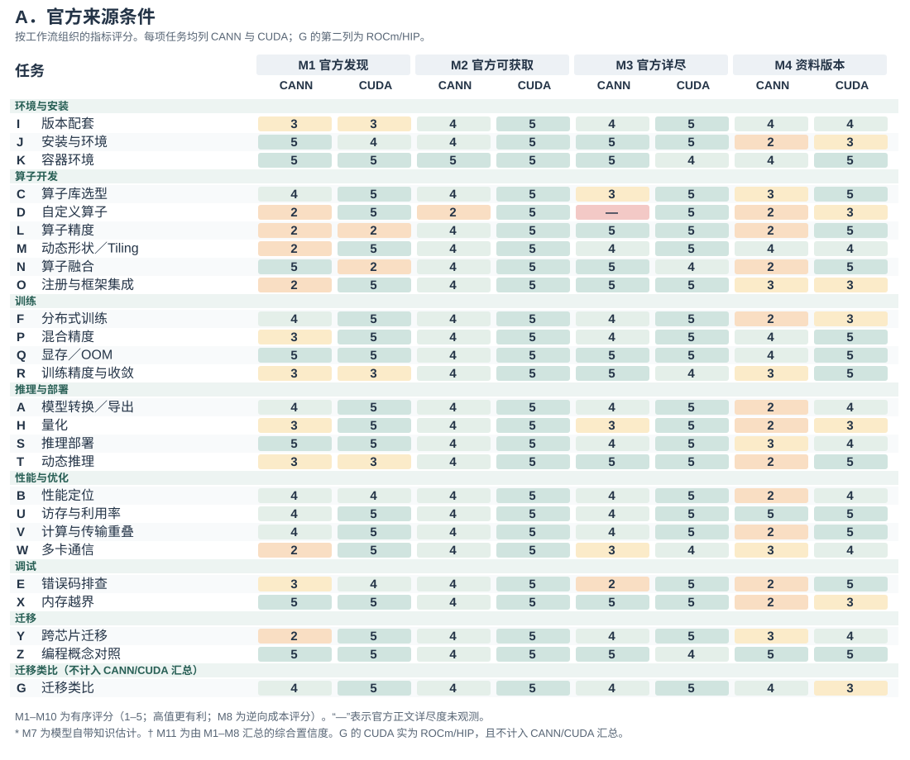{#fig:fullmatrixa description="工作流分组的任务矩阵。每行是一项开发任务；每个指标有 CANN 和 CUDA 两列。该分面显示 M1 官方可发现性、M2 官方正文可获取性、M3 官方正文详尽度和 M4 资料版本清晰度。G 为 CANN 与 ROCm/HIP 的迁移类比，单独标注且不进入 CANN/CUDA 汇总。"}

{#fig:fullmatrixb description="工作流分组的任务矩阵第二分面。每行与第一分面对应；每个指标有 CANN 和 CUDA 两列。该分面显示 M5 第三方来源数量、M6 第三方来源可信度、M7 模型自带知识估计和 M8 检索与获取成本。G 为单独标注的 CANN 与 ROCm/HIP 迁移类比。"}

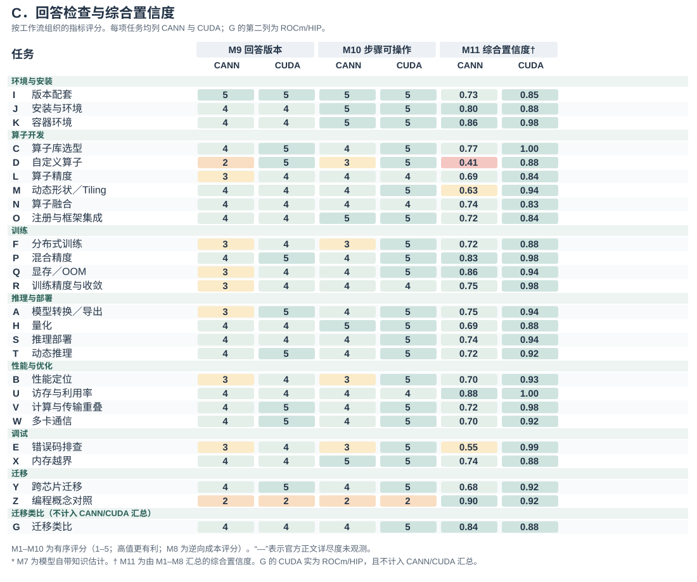{#fig:fullmatrixc description="工作流分组的任务矩阵第三分面。每行与前两分面对应；每个指标有 CANN 和 CUDA 两列。该分面显示 M9 回答版本明确性、M10 回答步骤可操作性和由 M1–M8 汇总的综合置信度。G 为单独标注的 CANN 与 ROCm/HIP 迁移类比。"}

图6–8呈现M1–M10的有序评分，以及由M1–M8计算的综合置信度。图9补充正文获取状态，使读者能够结合获取结果理解相应评分。

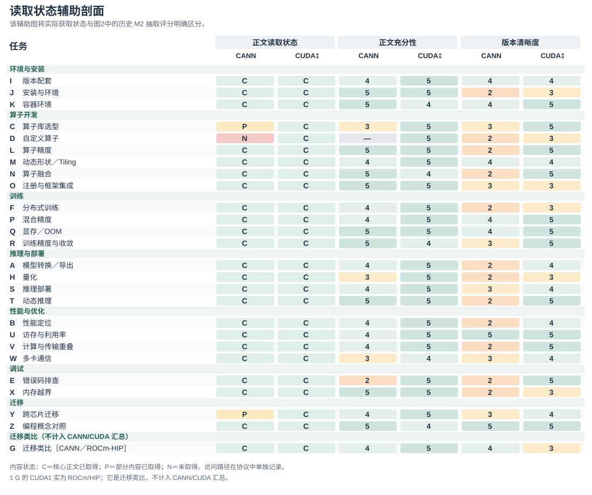{#fig:accessprofile description="工作流分组的辅助矩阵。每行比较CANN与CUDA的正文获取状态、官方正文详尽度和资料版本清晰度。C、P、N分别表示核心正文已取得、部分内容已取得、未取得。该图补充图6–8中的指标评分，具体入口路径在相应任务记录中说明。G为单独标注的CANN与ROCm/HIP迁移类比。"}

对于 25 对任务，综合置信度均值为 CANN .732、CUDA .922。下文结合各项指标，分析综合置信度在任务之间的差异。补充分析说明记录了来源归属修订、未决计数边界，以及结果对模型自带知识项的敏感性。

## 发现：跨开发任务的知识条件

沿任务与指标两个方向阅读矩阵，可以识别出四组相互关联的模式。获取失败集中于特定路径，而版本歧义在不同任务中反复出现；官方材料、第三方来源和模型自带知识估计构成不同的支撑组合，工作流位置本身也不足以解释这些组合。下面结合具体任务展开各项发现，并通过指标之间的联系定位其含义。

### 知识获取断点具有任务与路径差异

在安装、转换、训练和优化等CANN任务中，Agent取得了可用的官方内容，同时在少数路径中仅取得部分内容或未能取得内容。这一分布支持以任务及其选定资源为单位检查可得性。静态页面或动态渲染等站点标签，无法描述沿站内每条路径实际取得的内容。25项CUDA任务均取得官方核心正文，为这些获取路径提供了对照。搜索轮数也存在差异：25项CANN任务中，13项使用一轮搜索；CUDA为20项，其余均为两轮。这些计数将搜索成本与随后是否取得选定内容区分开来。

任务D要求创建Ascend C算子并将其与框架集成，需要实现代码、配置字段说明及编译部署步骤。对选定官方入口的WebFetch返回仅包含导航、元描述和文档链接，并明确报告“No code blocks, no implementation details, no step-by-step commands”（没有代码块、实现细节或分步命令）。该次读取因此未提供任务所需的实现内容。M1记录官方来源的发现条件，M2记录获取结果，M3标记为“受阻”。这一判断将改进对象定位到从所选入口取得实现正文的路径：入口应提供可继续读取的正文链接，或直接呈现实现与编译部署说明。对于实现建议的核验，此处缺少的是支撑其操作步骤的过程依据；仅有指南链接尚不能提供这一依据。

任务 E 暴露了另一类问题。官方 EZ9999 页面能够被找到和读取，但解释中的原因未明确，处理建议仅笼统要求检查安装或查看日志。较低的正文详尽度编码反映了返回材料缺少具体诊断指导。开发者的问题需要有关可能触发条件的信息，以及逐步缩小原因范围的过程。改善抽取后，这一内容问题仍然存在。D 与 E 因而将获取有用指导这一共同需求，连接到两种不同的干预：送达缺失的操作指南正文，以及充实已经可访问的错误解释。相应的信息需求是选择诊断检查项的依据。本地日志可以帮助区分可能的原因，文档或有来源的案例则需要解释这些观测与拟议检查之间的关系。

任务 A 展示了可用主路径与不可得参考资料并存的情况。已取得的转换快速入门提供 ATC 命令、输入形状与目标设备参数，以及设备信息查询步骤；更完整的 ATC/AIPP 参考页则仅返回导航和元数据。填写示例将快速入门关联到获得支持的转换需求，将缺失参考关联到尚未解决的高级设置。任务Y通过文档中心获取跨芯片迁移信息时，同样仅取得部分内容。这些案例说明，记录应同时保留取得了什么内容、它与哪项任务需求相关，并在有记录依据时单独说明访问路径。对于正在判断转换指导的开发者，这一区分标出了已有材料支持的主流程与仍需参考资料的高级设置，也限定了所取得来源能够为建议中的哪些操作提供依据。

### 版本适用信息是跨任务反复出现的问题

即使官方内容可访问，版本清晰度仍是反复出现的限制。25项CANN任务中有12项M4 = 2，涉及转换、安装、训练、算子开发、推理、优化与调试。只有 U 和 Z 的 M4 = 5，二者均被编码为版本不敏感；CUDA任务的M4评分则分布于3至5分。由于本文评分规则使用版本数量与兼容矩阵是否存在作为依据，这一分布引导分析者检查具体的版本证据，而不能仅凭版本数量认定存在歧义。

具体任务说明了这些版本信息如何影响知识的适用性。在 A 中，相似的快速入门材料出现在不同版本树中；在 I 中，回答兼容性问题需要跨文档、代码仓库和软件包记录，连接工具包、驱动、框架及集成包的信息。一页资料可以详尽且可读，同时仍需读者判断其中的操作说明支持哪种组合。因此，版本信息需要与内容共同呈现，并与任务环境建立联系。

M4 与 M9 使这一问题的两个环节分别可见。M4 描述来源环境中的版本清晰度，M9 记录所形成指导对适用版本或组合的明确程度。联合阅读两者，有助于判断下一步应改善文档中的配套信息，还是改善 Agent 组织回答的方式。相较于 D 中缺失官方正文的情况，这一反复出现的问题涉及更多任务，而局部获取失败对其对应任务仍然具有重要影响。检索委托给Agent后，还需判断资料声明的适用条件是否与开发者的设备和软件组合相符。来源适用范围与本地环境事实分别提供这一比较所需的信息：缺少配套关系时需要查证来源，未说明已安装版本时则需要检查本地环境。

### 不同任务具有不同的知识支撑组合

可访问的官方指南可以与有限的替代材料并存。在内存错误排查任务 X 中，已取得的内存检测工具文档为 M3 = 5，同时仅检索到一条第三方来源，M7 = 2。D 的模型自带知识估计同样较低，第三方可信度也较弱，同时缺少核心官方正文。两者的区别在于可用支撑的组合：X 拥有详尽的官方指导；D 则同时面临核心指南缺失和其他渠道支撑有限。仅用社区薄弱这一标签，会遮蔽这种差别。

在主比较中，CANN每项任务检索到的第三方候选来源平均为3.16条；对 H 中已知的官方博客归属进行排除后，CUDA 为 3.44 条。仅看数量，两者差异有限，也不能由此判断信息独立性。进一步检查检索结果发现，部分候选来源来自同一平台；另有第三方页面无法取得正文，只能读取搜索摘要。方法因此保留来源身份、获取状态和可信度判断，避免将多条条目自动解释为多个可用说明。

模型自带知识一列提供另一类支撑估计。CUDA 的评分均为 4 或 5；CANN 的估计较多偏低，其中 D、E、I、M、N、S、X 为 2。这些任务同时具有较低的先验估计，以及对生态专有命令、配套关系或诊断案例的需求，促使分析者检查哪些任务更需要检索材料提供支撑。该估计描述审计对模型已有知识的判断；来源观测则指出实际取得了哪些外部材料。

M9与M10通过评价任务中形成的指导的版本明确性和步骤可操作性，补全这一剖面。例如，X 同时具有详尽官方材料和高于 D 的步骤可操作性编码。这一对应关系为分析者提出具体检查问题：哪些步骤能够由已取得指南支持，哪些仍需从其他来源或本地环境补充信息？综合置信度汇总 M1–M8，回答产出评分则单独呈现，用于检查所形成的指导。

### 任务深度不足以解释全部差异

按工作流分组可以定位较低评分任务的集中位置。表 3 汇总 25 对任务的比较：CANN 的算子开发与调试均值低于环境与安装，调试也是两列差异最大的类别。调试组由 E 与 X 两项任务组成，它们不同的知识支撑剖面说明，为何阅读工作流均值时还需要查看构成该组的具体任务。该表描述的是所选任务集在本文评分规则下的分布。

| 工作流 | 任务数 | CANN | CUDA | 差值 |
| --- | ---: | ---: | ---: | ---: |
| 环境与安装 | 3 | 0.799 | 0.904 | 0.106 |
| 算子开发 | 6 | 0.660 | 0.891 | 0.230 |
| 训练 | 4 | 0.791 | 0.945 | 0.154 |
| 推理与部署 | 4 | 0.722 | 0.920 | 0.198 |
| 性能与优化 | 4 | 0.752 | 0.957 | 0.205 |
| 调试 | 2 | 0.646 | 0.933 | 0.287 |
| 迁移 | 2 | 0.793 | 0.921 | 0.128 |

: 表3　25对任务的各工作流的综合置信度均值。差值为 CUDA 减 CANN；不含 G。

整体分布近似呈现从上手到专门开发的梯度，但对照案例使这一解释更加具体。安装与容器环境的 CANN 综合分较高，自定义算子与动态形状／Tiling 任务则较低。然而，技术要求较高的访存与利用率任务 U 得分 .881，编程概念对照 Z 得分 .901；二者涉及能够跨架构表达的原理，且取得了官方材料。E 的问句相对直接，却依赖特定错误的诊断内容，得分 .554。因此，复杂程度或工作流位置本身会遗漏重要的知识需求差异。

对生态专有知识的依赖，为这些案例提供了一种解释视角。通用内存管理概念可以借助跨平台说明，特定厂商的错误、算子接口或配套组合则需要与该生态直接相关的信息。这个视角引导审计识别任务必须得到明确供给的知识，而非对所有进阶工作设定同一种预期。它也为开发者角色分组提供了实际用途：将某个角色关联的任务放在一起，可以定位需要关注的具体知识需求。本案例支持提出这一解释；其预测价值仍需通过明确的依赖度编码方案和更广泛的任务样本检验。

## 讨论：知识供给与 Agent 交互的设计启示

上述发现识别了开发者判断AI所提供指导时可能依赖的知识条件。下面讨论两类潜在改进对象：文档与社区提供的技术知识，以及呈现这些知识的Agent界面。各项建议从已观察的任务剖面推导而来。图10–15分别以供给侧与Agent侧各三张示意，说明兼容关系、诊断内容、可读出口、获取反馈、环境核对和来源检查。它们用于具体说明诊断的潜在应用，尚未开展干预效果评价。

### 供给侧设计：版本关系、任务指导与替代来源

反复出现的版本问题提示，应将适用性作为文档系统的一项属性。稳定的推荐版本入口可以与索引清晰的旧版本文档并存，每页同时声明适用版本和验证日期。驱动、工具包、框架及集成包之间的兼容关系可以通过可查询形式发布。对于 I 这类任务，开发者或 Agent 就能够针对已说明的环境请求受支持组合，减少从多个分散记录中拼接配套关系的需要。

图 10 将这一建议具体化为配套查询界面。设备与框架条件限定查询范围，返回的组合同时保留来源、适用范围和验证日期；未找到有依据的匹配时，界面呈现尚未确定的条件。这使 M4 所指向的版本问题成为可检查的信息关系，也为后续确认回答的适用性提供依据。

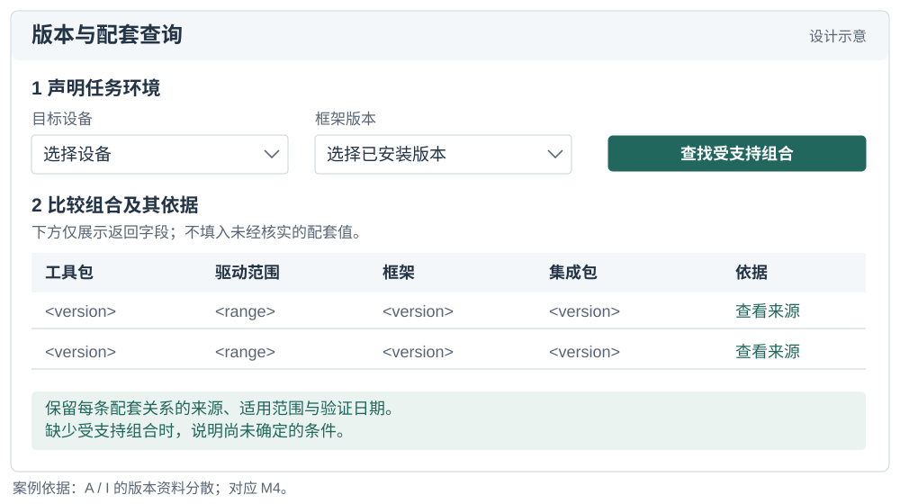{#fig:compatibilitydesign description="配套查询界面示意。上方选择目标设备和框架版本；下方列出工具包、驱动范围、框架、集成包及依据等结果字段。结果仅用占位字段，保留每条关系的来源、适用范围与验证日期，未匹配时说明未知条件。设计依据为任务 A 和 I 的版本资料分散问题。"}

局部获取与内容缺口则需要针对任务修复。D 提示应为算子开发核心指南提供可读路径，例如服务端渲染正文、文本导出或其他稳定入口。E 已经有独立错误页面，其改进需要充实该入口内的内容：错误语义、可能触发条件、诊断步骤、相关 issue 案例链接及适用版本。对于通用兜底错误，指南可以说明仅凭该错误码尚不能确定什么，并明确下一步需要哪些日志或本地观测。这样的页面围绕用户问题组织已有证据，以支持诊断。

图 11 以 E 的错误页说明任务导向内容的组织方式：从错误码能够支持的判断出发，明确需要收集的现场信息，将可观察现象关联到下一步检查和有来源的案例，并为未解决情境保留支持入口。实际填入的原因、检查步骤与案例需要由领域维护者确认；该结构帮助定位哪些知识需要补充。

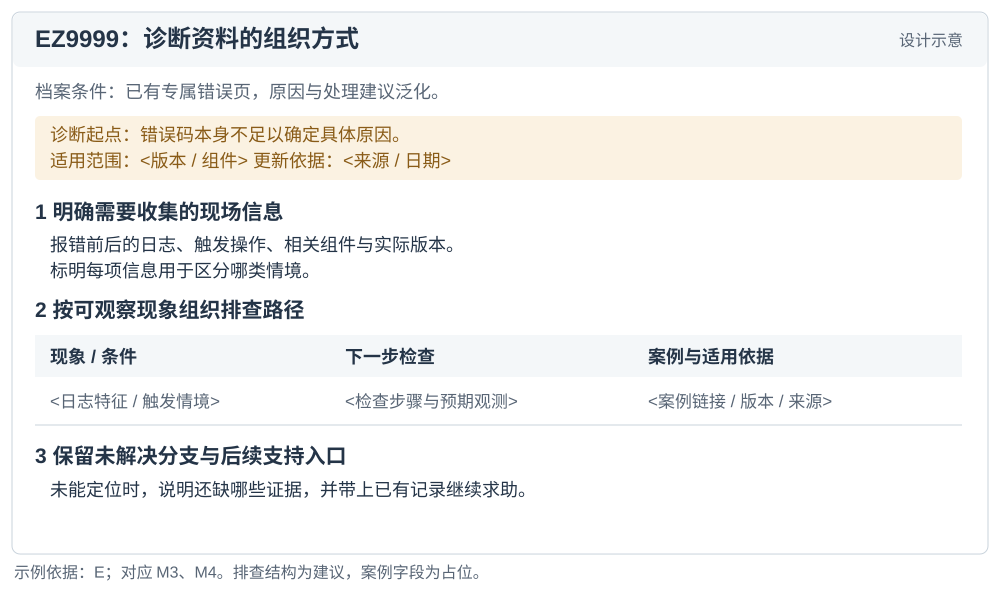{#fig:diagnosticdesign description="拟议的 EZ9999 诊断页面。先说明错误码本身不足以确定原因，再组织所需日志、触发操作与环境信息；表格连接可观察条件、下一步检查及案例来源，最后保留未解决分支与支持入口。内容结构为设计示意，没有编造已确认的错误原因或案例。"}

同样的任务导向结构可以用于其他文档单元。预期结果、前置条件、最小命令或代码、参数说明、预期输出和恢复信息，能够为人类阅读及 Agent 检索提供具体材料。机器可读导出与索引应保留这些关系及其版本范围。其效果可以依据最初促成改动的任务，检查相关内容获取和详尽度字段。

图 12 展示如何让同一任务资料通过文档正文和机器可读出口提供。以任务A中取得的转换快速入门所提供的命令与参数关系为例，导出同时保留任务、适用版本、来源、参数解释和关联步骤。对于 D 这类缺失核心正文的路径，目标是让相关指导实际送达；对于已有可读正文的路径，目标是避免导出时丢失上下文。验收应比较取得内容与任务要求的对应关系，而不只检查是否存在某种文件格式。

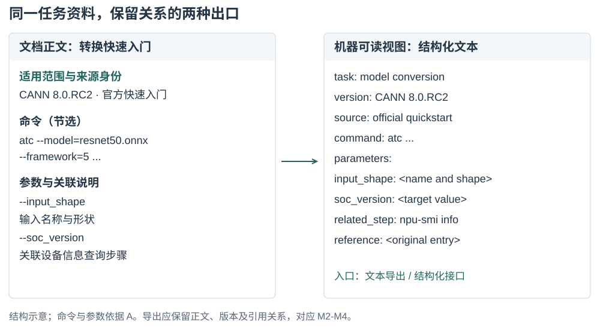{#fig:readableexportdesign description="左侧为模型转换快速入门的正文结构，包括版本、官方来源、ATC 命令节选及 input_shape、soc_version 参数说明。右侧为拟议的结构化文本出口，保留任务、版本、来源、命令、参数、关联步骤和原始入口。箭头表示内容关系在导出中保持，没有声称重新抓取或修复了实际站点。"}

第三方来源提供额外示例、解释及实际故障记录，其价值取决于 Agent 能够取得并明确归属的内容。支持可访问、带版本信息的示例和问题解决记录，可以扩展官方主路径之外的知识供给。M5 与 M6 使审计能够区分遇到的来源数量、可信度及衍生关系。当多篇文章重复同一材料，或某个详尽解释能被搜索命中却无法被阅读工具取得时，这一区分尤其有用。

知识供给的改进还涉及入口与维护。稳定且可检索的官方入口影响候选资料能否被发现；明确来源归属、修订日期及兼容关系则影响后续判断。团队可以将代表性任务作为持续检查单元：跟踪查询能否命中目标资料、正文是否完整送达、版本关系是否变化，以及社区案例是否仍适用。这样的维护机制也适用于没有专门界面示例的来源治理与第三方知识供给。

### Agent 侧设计：呈现知识支撑并补充任务事实

Agent 界面可以保留找到相关来源、取得正文和支持某个操作步骤之间的区别。对于 D，有用的状态信息应指出缺失的实现指南；对于 E，应说明官方解释较为笼统，并请求进一步诊断所需的日志或触发情境；对于 A，可以保留可用转换路径，同时标明尚未解决的高级参考设置。这些状态将一次检索事件连接到它对开发者当前任务的影响。

图13对照D与E的拟议响应。对于D，Agent先寻找正文链接或其他可读来源，并保留原始入口供开发者按需查看；对于E，Agent说明触发情境与相关日志片段如何用于查找诊断案例。开发者补入内容作为获取失败后的备选途径，核心指南的可获取性仍应由知识提供方维护。M1–M3定位缺口，M8记录后续尝试的成本。

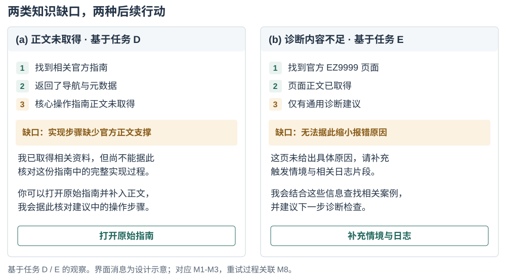{#fig:acquisitiondesign description="两个并列子图展示不同知识缺口的拟议反馈。左图基于 D：官方指南已找到，仅返回导航和元数据，提出先寻找正文链接或可读来源，并保留原始入口供按需查看。右图基于 E：官方 EZ9999 页正文已取得，但建议泛化，请求触发情境及日志以继续排查。两个子图均为设计示意，不是原始对话截图。"}

依赖版本的指导应将来源的适用范围与已有任务环境关联起来。在提出工具包／框架组合前，Agent可以利用任务中已提供的设备与软件事实，仅请求建立匹配所必需的其余信息。回答层指标随后检查建议是否说明适用版本条件，以及操作步骤是否明确了所需的替换或修改。

图 14 以独立的环境记录说明版本核对：先区分开发者提供的本机事实与来源声明的适用范围，再将比较结果记录为匹配、不匹配或信息不足。环境记录在任务内复用，并随用户补充而更新，以支持具体命令建议前的适用性判断。

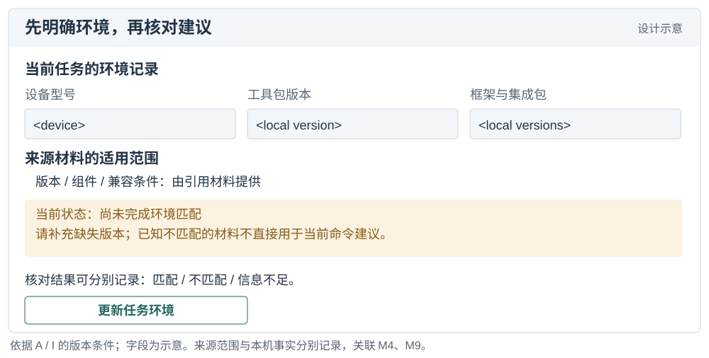{#fig:environmentdesign description="上方为当前任务的设备型号、工具包、框架和集成包字段，均为占位值。下方独立呈现引用资料的版本和兼容条件，并将尚未建立环境匹配显示为需要补充信息。核对状态可为匹配、不匹配或信息不足，用户可更新同一任务中的环境记录。"}

三个知识渠道还提示，应区分 Agent 呈现的支撑依据。引用的官方过程、社区绕行方案和基于模型已有知识的解释具有不同来源。呈现这些区别，有助于开发者判断回答中的哪一部分需要本地检查。检索循环可以将后续搜索指向尚未满足的需求，并在预算耗尽时报告剩余不确定性。这使来源检查能够通过可观察的信息需求和验证节点，与人机协作建立联系。

图 15 进一步示例来源核验与纠错反馈。开发者从命令展开引用段落，检查适用版本，并将实际报错或修正关联到原建议。原来源、任务环境与新增反馈共同保留，使下一轮检查能够聚焦具体分歧。这为 M9、M10 所描述的回答属性提供了可检查的依据，并支持后续修订。

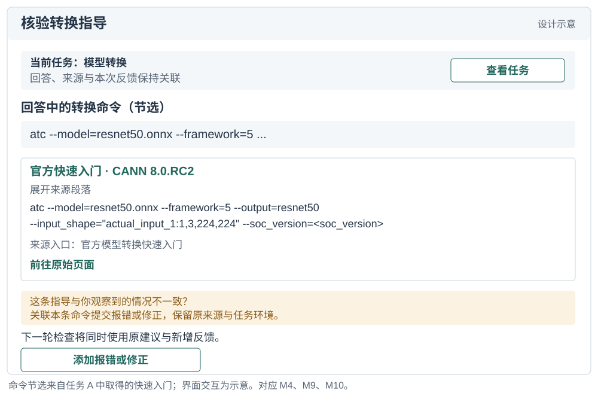{#fig:verificationdesign description="模型转换任务中，回答命令下方展开 CANN 8.0.RC2 官方快速入门的引用段落，并提供原始页面入口。用户可将报错或修正关联到该命令，保留原来源与任务上下文，用于下一轮核验。命令节选来自该快速入门材料，界面交互为设计示意。"}

这些建议将核验建议视为编程工作的一部分，与前文讨论的信息寻找及AI辅助研究相衔接 [@brand2009; @vaithilingam2022; @barke2023]。展示每次检索事件和全部来源段落，可能增加阅读负担，却未必使下一步行动更清楚。界面可以先呈现获得支持的步骤、相关版本范围与未决条件，再按需展开来源段落。这样既优先呈现当前判断所需的信息，也保留深入检查的入口。

请求环境事实也可能打断任务，尤其是在重复询问已经提供的信息时。每次请求应说明哪项建议依赖这一事实，并复用已有任务上下文；信息可能过时时再请开发者确认。对于诊断日志，应请求相关片段，并允许移除敏感内容。缺失的配套关系和笼统的错误解释需要文档与系统团队完善，收集更多本地事实本身不能补足这些解释。如何平衡核验、打断与有效指导，仍需在这些建议的后续评价中考察。

### 同时考虑广覆盖改进与局部断点修复

审计支持两种互补的改进组织方式。一种关注条件出现的广度：多个工作流中的版本歧义，提示建立共享的兼容性查询能力。另一种关注断点的严重程度与具体位置：缺失的算子指南或信息不足的错误页，提示修复特定任务路径。两种范围对应不同的进展单位。广覆盖改进可以跟踪多少受影响任务获得了更清楚的适用性信息；局部修复可以跟踪此前缺失的正文或诊断内容是否已经可得。

仅看均值容易偏向影响较多任务的改动，使针对一个严重缺口的修复显得很小；只关注最低分任务，则会遗漏其他地方反复出现的问题。完整剖面使两类关切能够同时保持可见。综合置信度在已说明规则下提供汇总，任务级观测则定位干预对象。补充材料提供公式敏感性与计算说明，以支持对这些汇总的检查。

### 诊断方法的复用

该方法将任务需求、来源或获取事件、指标编码，与判断技术建议所需信息的诊断连接起来。开发者生态的建设与运营团队可据此定位缺失的指导或适用关系，Agent产品与界面团队可据此区分需要继续查找来源的情形与需要补充本地事实的情形。分析者可以沿用记录结构，并替换领域特定需求，例如数据库SDK中的客户端与服务端兼容性，或Web框架的部署前置条件。这些构成方法的预期应用方向。

后续评估可以考察独立分析者是否形成相近剖面、诊断是否与专家对缺失信息的判断一致，以及文档团队是否认为它们有助于规划修复。这些问题直接来自方法的预期用途。本次应用提供任务级区别、填写示例与跨任务综合分析，为开展此类评估奠定基础。

## 局限与研究透明度

本案例展示了该方法如何区分知识发现、正文获取与任务充分性方面的断点。任务记录支持检查评分依据和复算结果。这些结果反映本次任务集及检索条件；不同模型、工具配置与检索预算下的稳定性，以及独立评分的一致性和跨生态适用性，仍需进一步评估。补充材料提供观测字段、评分实现、任务与来源对应表、计算差异说明及汇总脚本，支持复核与后续应用。

本研究评估知识条件与任务中形成的指导。开发者如何利用这些区别判断依据、核对本地适用性及决定何时需要更多信息，需要通过观察其与指导内容的交互进一步研究。评价还应考察拟议反馈能否支持这些判断，以及它所带来的阅读负担或任务打断。

## 结论

本文定义面向 AI 的知识可得性，并通过十一项指标连接知识来源、获取过程与回答属性。CANN 与 CUDA 开发生态的案例分析展示了这一多维视角如何识别不同的获取与内容失败、反复出现的版本问题，以及随任务变化的知识支撑组合。对照任务进一步提示，在考察工作流覆盖的同时，应关注任务对生态专有知识的需求。

该方法使经由AI形成的技术指导的依据成为可检查的对象：哪项来源支撑拟议步骤，哪项适用关系尚未明确，以及还需要什么信息。框架、协议与案例分析提供了定位这些条件，并将其关联到知识供给和Agent反馈的方法。文档修复、继续检索和请求本地事实分别对应不同的诊断，为后续评价提供具体方向。

## 附录A：评分计算细则 {.unnumbered}

**官方资料（M1–M4）。** M1先判断检索过程：至少两轮且调整查询为2分，至少两轮且未调整查询为3分；一轮检索时，首条官方结果排名1、2–6、7–10及10名以后分别为5、4、3、2分。1分描述多轮仍难找到相关官方来源的情形。M2按正文获取状态映射为图2所示的四档；M3在SPA或robots导致正文未取得时记“受阻”。正文已取得时，M3的1分表示无任务相关具体细节，2分表示仅有少量任务相关片段，3分表示概述或缺少命令代码的主路径材料；主路径含命令代码或完整参考不含命令代码为4分，两者兼具为5分。这里的命令代码指资料提供的操作内容。M4的1分表示版本标识缺失；2分已有至少三个具体版本，但配套关系未明。在版本信息可判定的情形下，依次判断：任务与版本无关或至多一个版本为5分，有官方支持矩阵为4分，芯片与框架双轴可锁为3分，至少三个版本且配套未明为2分，其余为3分。

**第三方资料（M5–M6）。** M5按去重来源数$n$分档：0、1–2、3–4、5、至少6条分别为1–5分。官方文档、官方仓库与官方论坛归入官方来源。M6先取第三方来源类型基准分的均值：聚合或转载2.5，个人技术博客3.0，有声誉的问答或专栏3.5，云厂商技术文章或学术论文4.0。再加三项修正：内容一致性高、中、低分别加1、0、−1；以2026年6月为基准，发表日期的中位月龄不超过36个月、超过36且不超过48个月、超过48个月分别加0、−0.25、−0.5；平台独立度$p$为去重平台数除以来源数，$p\geq0.8$、$0.6\leq p<0.8$、$p<0.6$分别加0、−0.25、−0.5。缺失日期不计入中位数；日期或平台全部缺失时对应修正为0。结果取最近整数，恰为半整数时取相邻偶数，再限制在1–5分。

**模型知识与获取成本（M7–M8）。** M7以图3所示模型自评档为起点，技术更新节奏稳定、中等、快速分别加0、−0.25、−0.5，取整及限幅同M6。M8计算加权成本$c=r+0.5f+4e$，其中$r$为检索轮数，$f$为抓取次数，$e$为抓取失败次数。$c\leq1.5$为5分，$1.5<c\leq2.5$为4分，$2.5<c\leq4$为3分，$4<c\leq6$为2分，$c>6$为1分。

**回答产出（M9–M10）。** M9的1分未提供具体版本，2分提供版本线索但尚未确定其对当前任务的适用性，3分明确范围或部分组件，4分基本确定，5分给出确切版本。M10的1分只有零散片段，2分已有主要流程骨架但缺关键落实细节，3分需小幅修改，4分仅需替换参数，5分可直接采用。

**综合置信度（M11）。** 正文公式将官方、第三方和模型自带知识分支组合，再由M4与M8调整。M3受阻时官方分支$O=0$。M9与M10单列。区间$[0,0.24)$、$[0.24,0.45)$、$[0.45,0.63)$、$[0.63,0.80)$和$[0.80,1]$依次标为很低、低、中、中高、高。
