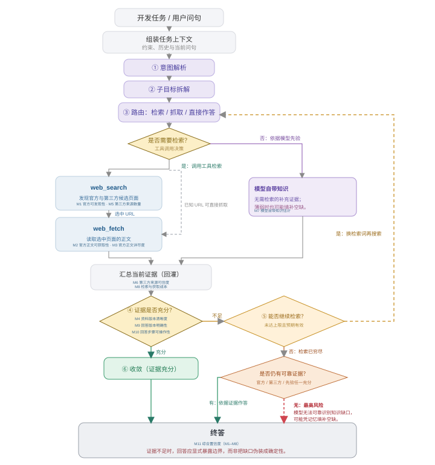
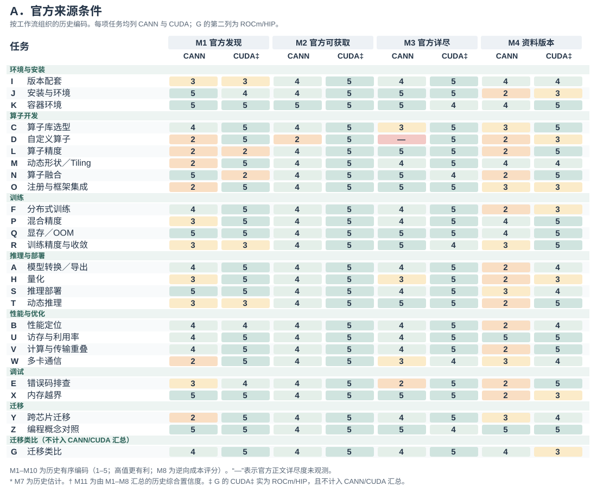
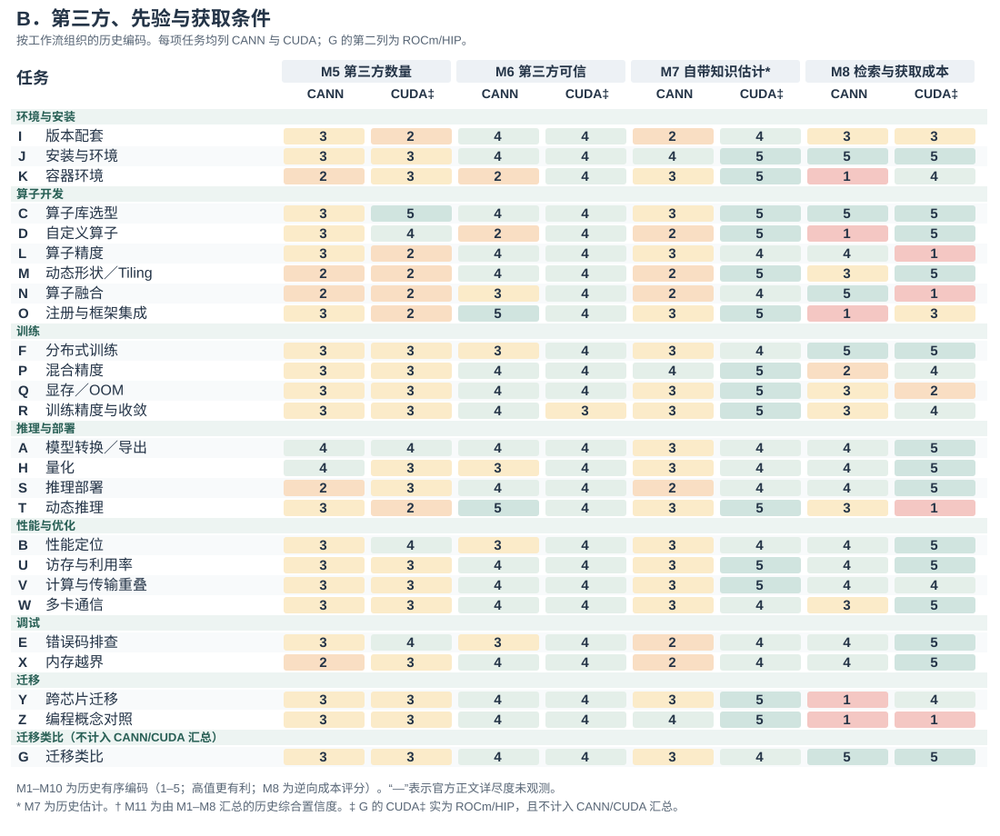
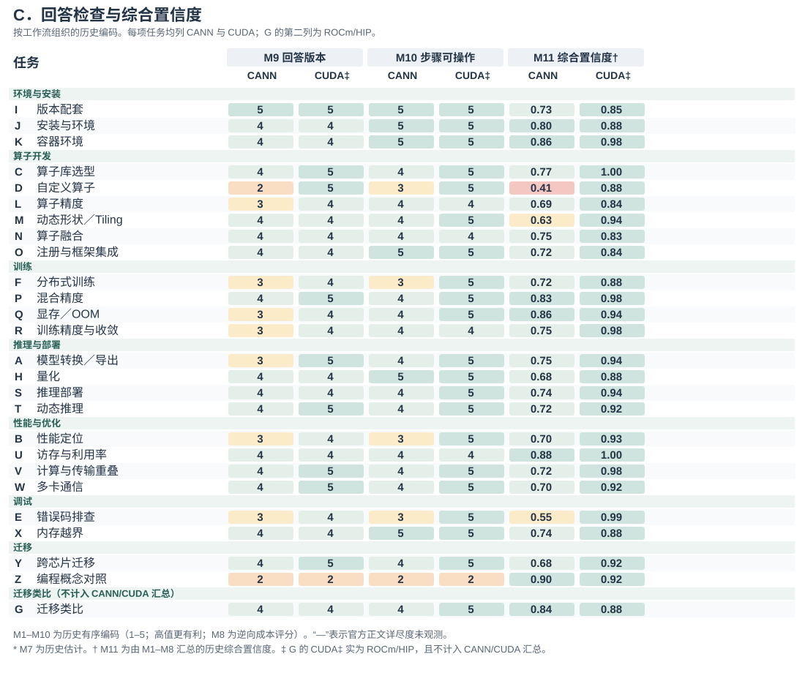
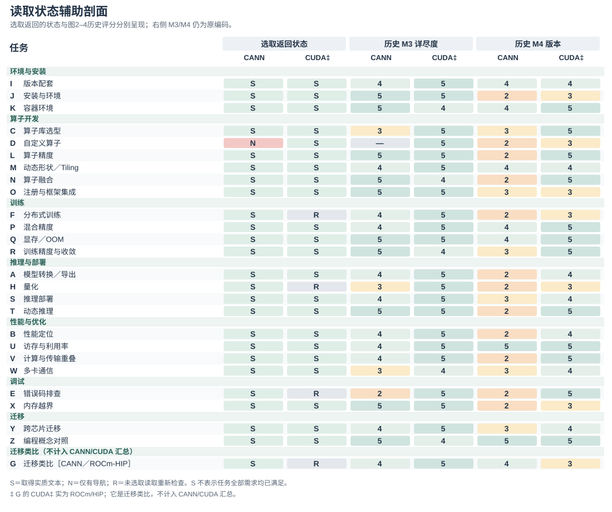
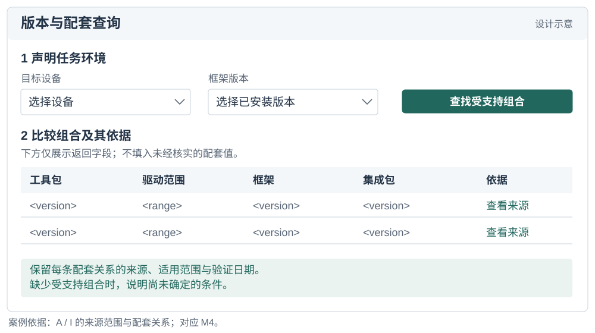
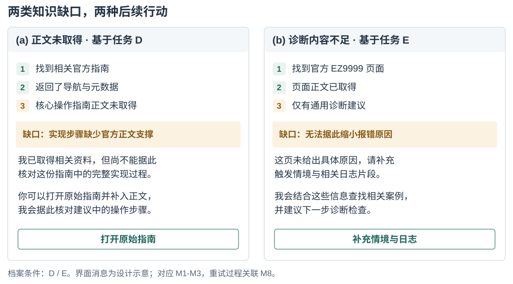
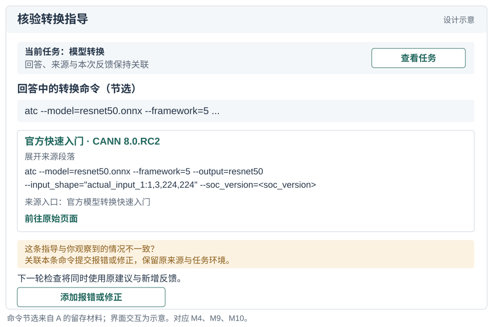

# AI 能找到开发者所需的知识吗？开发者生态中面向 AI 的知识可得性的定义与度量

## 摘要

AI Agent正日益成为开发者获取技术知识的中介。本文通过任务级协议定义面向AI的知识可得性，以十一项指标连接知识来源、获取成本与指导属性。回顾性应用包含26类开发任务：25组CANN/CUDA任务对及一项单列迁移类比。分析将任务问句连接到留存的工具调用、返回与审计报告，区分仅有导航的返回与可读但不足的指导，将来源适用范围与本机环境匹配分开，并揭示两个生态中的替代获取路径。具体案例展示这些区别如何改变需要关注的信息或资源。历史评分提供可检查的背景，任务级证据支撑主要发现。由此形成的启示涉及知识供给与Agent交互。本文贡献包括概念框架、可复用记录协议，以及展示知识条件如何支持分析和设计的原始记录应用。

## 关键词

面向 AI 的知识可得性；开发者生态；技术文档；信息寻径；AI Agent；测量方法

## 引言

开发者在决定下一步行动时，常常往返于文档、代码示例、搜索结果和社区解释之间。关于机会式编程和开发者信息需求的研究表明，寻找与解释信息本身就是编程活动的一部分 [@brand2009; @ko2007; @sillito2008]。有用的信息必须契合当前任务：命令需要正确的选项，API 示例需要对应的版本，错误解释需要提供足够的上下文来指导排查。因此，文档的存在只是其有用性的一个条件。

具备检索与工具调用能力的开发 Agent 为这一知识环境增加了一条协作路径。开发者既可以围绕报错或局部代码提出问题，也可以描述待完成的变更或结果目标，将资料查找、文档阅读、实现步骤组织以及部分代码修改委派给 Agent。为推进任务，Agent 可能自行在官网、文档、仓库与社区之间搜索、读取和整合材料，再起草回答、实现方案或代码改动。关于代码生成工具、对话式编程辅助和 Agent 支持的研究既描述了这种支持带来的机会，也揭示了理解和核验生成建议的困难 [@vaithilingam2022; @barke2023; @programmerAssistant2023]。委托信息寻找并不会消除对适用证据的需求。它改变的是谁接触文档、通过什么界面接触，以及哪些信息最终到达开发者。

设想 Agent 被问到如何实现并集成一个自定义加速器算子。搜索可能返回官方开发指南，但阅读工具只取得导航和元数据。在错误诊断任务中，同一工具可能取得完整的官方页面，页面却只有一条笼统的查看日志指令。检索成功指标可能将这两个问题都记为已有相关结果。访问指标能够区分第一种失败，却无法区分第二种。即便操作说明足够充分，若其引用了彼此不兼容的工具包与框架版本，也仍可能存在歧义。这些区别关系到文档团队应修复什么，以及 Agent 设计者应向用户暴露哪些不确定性。

现有评估方法已经区分了检索质量、上下文相关性、答案忠实度及其他相关属性。RAGAS 和 ARES 提供了对检索增强生成各组件的评估，ALCE 则考察生成答案及其引用 [@ragas2024; @ares2024; @gao2023alce]。本文处理的是一个互补的测量问题：如何检查 Agent 在处理具体开发任务时遇到的技术知识条件，包括访问失败、版本关系、替代来源，以及审计者判断的依据。这要求把开发者的信息需求与实际取得的资源联系起来，而不是从流畅的回答推断知识可得性。

我们将**面向 AI 的知识可得性**定义为：在明确的检索条件下，一个指定的 Agent 及工具配置能够发现、取得任务相关技术知识，并评估其适用性的程度。这是一个关系性构念：它涉及特定时点上的任务、知识环境，以及访问该环境的方式。我们通过证据记录协议和十一项指标将其操作化。这些指标区分来源条件、获取成本、回答检查，以及由 M1–M8 计算的综合置信度。

本文提出两个研究问题。**RQ1：** 如何定义并操作化面向 AI 的知识可得性，使任务特定的访问条件与证据缺口能够被系统记录和复核？**RQ2：** 该方法在不同开发任务中揭示了哪些知识可得性模式，这些模式如何为文档与 Agent 设计提供依据？

方法支持资料维护者、研究Agent知识获取的研究者和Agent设计者判断：应改善发现入口、送达缺失正文、补充任务指导、澄清适用关系，还是请求本机事实。

我们通过一个方法框架，以及对既有面向 AI 加速计算的软件开发任务审计的回顾性应用来回答这些问题。档案包含 26 类任务和 52 条任务侧记录。其中，25 类任务比较 CANN 与 CUDA 开发情境；一类迁移任务以 ROCm/HIP 为对照目的地，单独处理。案例应用将任务级测量连接到跨任务模式与设计启示。具体贡献包括：（1）一个将知识条件与检索成功、答案正确性区分开的构念；（2）一套任务级协议、指标定义和可移植的分析材料；（3）具体案例与跨任务综合分析，区分不同断点，并将其连接到文档与 Agent 设计。

## 相关研究与构念边界

### 开发者信息寻找与文档

信息寻径理论将信息寻找行为与可用信息的结构和预期价值联系起来 [@pirolli1999]。编程研究展示了开发者如何交织进行搜索、学习和实现，以及他们的问题如何依赖于正在开展的工作 [@brand2009; @ko2007; @sillito2008]。API 学习中的困难也促使研究者关注技术接口周围的解释性资源 [@robillard2009]。这些研究支持本文以任务为分析单位，并区分接触到某项资源与取得任务所需信息这两件事。

本文方法不从机器访问情况推断人类可用性。浏览器能够读取的页面可能对某个特定抽取工具不可访问；反过来，Agent 容易抽取的文本也可能让人难以导航。我们考察的是受委托的知识获取路径所面对的条件。关于开发者时间、信任、满意度或任务完成情况的主张，需要另外的证据。

信息质量也取决于使用者与使用情境 [@wang1996]。据此，命令、概念定义与配套关系对应不同的任务需求。PROV等溯源模型区分实体、活动和代理者 [@prov2013]；本文将这一关系具体用于任务需求、搜索/读取事件、返回材料与编码判断。贡献在于将这些关系操作化为开发任务评价，而非重新提出溯源或情境相关的信息质量概念。

### 面向编程的 AI 支持

关于代码生成与对话工具的研究考察了开发者如何使用和评价 AI 辅助 [@vaithilingam2022; @barke2023; @programmerAssistant2023]。这些工作提供了本文的交互背景：技术建议进入开发活动后，其适用性必须得到评估。我们首先关注支撑这些建议的知识是否可得，再讨论人们如何使用建议。

Agent 能够交织推理与工具使用，而检索增强生成提供了将外部信息纳入生成过程的方式 [@lewis2020; @yao2023]。WebArena、SWE-bench 和 SWE-agent 在贴近真实的网页与软件工程情境中评估或开发 Agent [@zhou2024webarena; @jimenez2024swebench; @yang2024sweagent]。其任务结果是系统表现的重要证据。本文框架则对这些系统运行时面对的知识条件提供互补描述。失败可能涉及证据不可得、对可得证据的解释不充分，或执行不成功；本文方法直接处理其中第一类问题，并记录有助于区分这些情形的信息。

### 检索、归因与可得性构念

RAGAS 和 ARES 评估检索上下文与生成答案的属性；ALCE 评估有引用支持的生成 [@ragas2024; @ares2024; @gao2023alce]。因此，我们并不声称既有评估将检索或答案质量视为不可拆分的整体。本文方法关注的是技术任务需求、获取过程与周围知识生态结构之间的联系。在这一情境中，版本兼容性、对操作指南的部分访问，以及对社区变通方案的依赖尤为重要。

表 1 中的区分界定了这一构念的位置。知识可得性可以是基于证据作答的必要条件，却不足以保证正确性。Agent 可能误解一个可得来源，也可能在未取得任何外部证据的情况下，凭先验知识给出正确答案。这些结果应保持可区分。

| 评估对象 | 核心问题 | 与本文方法的关系 |
| --- | --- | --- |
| 检索成功 | 是否返回了相关结果？ | 获取过程的一个条件；不能证明所需内容已被取得。 |
| 文档可用性 | 目标读者能否导航和理解这些材料？ | 相关的面向人类的属性，需要单独评估。 |
| 面向 AI 的知识可得性 | 在所记录条件下，哪些任务相关知识能够被取得？ | 本文所操作化的构念。 |
| 答案正确性与归因 | 回答是否正确，其来源是否支持其中的主张？ | 可以使用已取得证据进行的下游评估。 |
| 执行成功 | 所提出的行动能否在目标环境中奏效？ | 需要执行或其他独立的结果证据。 |

: 表1　构念边界与相邻的评估对象。

## 方法框架

### 分析单位与任务需求

分析单位是一次**任务侧知识获取过程**：使用明确的 Agent 和检索配置，在特定技术生态中围绕一个开发目标开展知识获取。任务说明记录期望结果、初始材料、约束、版本依赖，以及支撑下一步行动所需的证据。例如，模型转换可能需要转换命令、输入形状说明、目标设备设置，以及检查生成产物的方法。这些需求指导检查；页面长并不自动意味着内容充分。

任务选择必须服务于应用目的。生态评估可能寻求覆盖不同工作流；文档团队的审计可能聚焦反复出现的支持问题。若无进一步的抽样证据，两者都不能说明这些任务在总体中的发生频率。跨生态应用时，分析者应记录初始条件与任务范围的差异，而不是假设名称相近就意味着任务等价。该框架也可用于同一生态内部、不同版本之间或不同检索配置之间，只要比较条件得到明确说明。

图 1 将各项测量放在一条可观察的工具调用循环中。它是一个分析模型，而非对模型隐含推理过程的重建：Agent 先搜索候选来源、选择 URL、读取正文或记录失败，再汇总证据并检查任务充分性与版本适用性。证据不足而仍有可检索空间时，循环回到查询精化；模型先验则作为不产生可观察来源的独立分支登记。因此，先验知识不自动视为可追溯证据。

{#fig:framework description="概念流程图从开发任务与上下文开始，保留意图解析、子目标拆解、路由和“是否需要检索”两个判断节点。检索分支显示 web_search 发现官方和第三方候选来源、选中 URL、web_fetch 抓取正文，以及已知 URL 时的直接抓取路径；另一分支为模型先验。各来源回灌至当前证据汇总，再经“证据是否充分”“能否继续检索”“是否仍有可靠证据”三个判断节点，通向收敛、重试或带风险的终答。所有 M1 至 M11 均以统一样式标出名称与测量位置。"}

### 来源、获取与行动条件

该框架保留原审计中的三个渠道：官方材料、社区或第三方材料，以及模型先验知识。对于外部渠道，它将**访问**与**充分性**分开。发现关注是否找到了候选来源；获取关注阅读工具实际返回了什么；充分性则关注返回内容是否提供了任务所需的命令、解释、参数或诊断案例。版本适用性需要跨渠道考察，因为各个来源可能各自有用，却描述了不同的环境。

官方属性由发布者与材料的关系决定，而非由托管平台决定。厂商的代码仓库或博客属于该厂商的官方渠道；托管在同一平台上、由独立作者撰写的教程则可能具有不同属性。跨平台转载也使域名多样性成为衡量证据独立性的不完善代理。因此，协议保留来源身份、发布者、可获得的日期，以及观察到的衍生或重复关系。缺少这些细节时，应记录为不确定性。

该方法的产出是一份带有证据记录的**可得性剖面**。它标明找到了什么、取得了什么、哪些内容看起来充分、哪些适用条件仍未解决，以及记录了多少获取成本。可选的汇总指标有助于概括某套操作化方案，但不能取代这一剖面。尤其需要指出，模型内部知识即使能够支持回答，也不能让一个不可访问的外部来源变得可访问。

### 证据记录

证据记录将每项判断与其依据联系起来。最低限度的字段包括任务问句与初始条件、已知的 Agent 与工具配置、采集时间、查询和选定 URL、发布者与来源角色、返回内容或保留片段、访问结果、适用版本、内容所支持的任务需求、获取次数，以及编码决定及其理由。另设字段标明条目属于直接记录、后续编码、估计，还是不可获得。

这一区分可以避免一种常见的报告错误：仅仅因为脚本为某个解释赋予了数字，就把解释转化为观测。被记录的抽取失败，是对工具与来源交互的观测；将某段解释判为充分，是对照任务需求作出的判断；估计模型对某个工具包的熟悉程度，则属于推断，除非有单独测试为其提供支持。数值编码不会消除这些差别。

## 操作化与测量协议

### 十一项指标及其证据角色

表 2 列出了从审计中保留的指标，并澄清其证据角色。编号保留了与档案数据的对应关系。所提出的操作化方案以内容获取结果衡量访问，将推断的先验知识与已取得来源分开，并把产出检查解释为已记录操作说明的属性，而非成功执行。

| 编号 | 指标 | 证据与解释 |
| --- | --- | --- |
| M1 | 官方可发现性 | 记录查询轮次与官方结果位置；反映所选搜索条件下的发现成本。 |
| M2 | 官方正文可获取性 | 交付内容状态（实质文本、仅有导航、错误或未观测），任务需求覆盖另记；关注返回内容，而非站点实现技术。访问路径另列为原入口、替代入口或未知。 |
| M3 | 官方正文详尽度 | 已取得官方正文中任务所需命令、参数、解释和参考细节的层级；它记录内容细节，不能单独证明任务已经充分解决；内容未取得时，该项未被观察。 |
| M4 | 资料版本清晰度 | 来源材料的明确适用范围、兼容关系，以及尚未解决的版本分支；多个受维护版本本身并不意味着歧义。 |
| M5 | 第三方来源数量 | 官方渠道之外被记录的第三方来源条数；它不是以任务需求为分母计算的覆盖率。 |
| M6 | 第三方来源可信度 | 第三方来源的作者身份、时效、一致性，以及内容衍生关系的线索；域名多样性本身不能证明独立性或逐条内容正确。 |
| M7 | 模型自带知识估计 | 明确标注的估计，或单独开展的无检索测量；本档案包含的是估计，而非实测训练覆盖。 |
| M8 | 检索与获取成本 | 原始检索、读取、重试和查询精化次数；成本模型与这些次数分开披露，并不表示实际耗时、Token 或费用。历史矩阵展示逆向成本评分，填写示例则保留底层调用次数及其编码。 |
| M9 | 指导版本明确性 | 已记录回答或指导是否标明确切组合、受约束的范围，或尚未解决的依赖；不意味着该组合已经运行验证。 |
| M10 | 指导步骤可操作性 | 已记录回答或指导中的步骤能否照用、仅替换参数或经小幅修改采用；不能证明代码已经执行。 |
| M11 | 综合置信度 | 基于 M1–M8 的历史汇总分数；M9–M10 单列呈现。它反映公开的聚合假设，而不是经过校准的正确性或任务成功概率。 |

: 表2　十一项指标及各自能够支持的证据解释。

M1–M6 描述来源条件；M7 登记另一种可能支撑回答形成的依据；M8 描述检索与获取成本；M9–M10 检查回答的版本明确性与步骤可操作性；M11 汇总 M1–M8 的历史编码。这些组成部分可以共同变化，但不能相互替代。它们也不一定适用于所有任务：概念解释任务可能没有有意义的版本锁定需求。此类情况需要明确的“不适用”状态，而非虚构一次成功观测。

### 协议的应用

**第一，定义任务与记录边界。** 说明开发结果、初始材料，以及评估充分性所依据的需求。记录 Agent、工具、语言、日期和上下文策略。明确分析单元包含新开展的获取、复用的观测，还是两者兼有。设置适合该应用的检索预算或其他可观察的停止标准；分析者不能仅根据查询次数，推断 Agent 停止的内部原因。

**第二，记录发现与获取。** 保留查询、候选来源、选定 URL 和阅读结果。检查官方材料，并记录实际遇到的社区替代来源，无论它们来自混合搜索结果，还是后续搜索。将阅读失败与搜索失败分开。当镜像或另一个版本提供了所需内容时，将其与原始尝试关联，使绕行方案保持可见。

**第三，评估任务支持与适用性。** 将已取得材料映射到任务需求。区分已返回但缺少必要内容的文档，与从未返回的文档。记录明确标注的版本和兼容依赖，包括尚未解决的本地事实。URL 中的版本号是一条线索，本身并不是已经核验的兼容关系。

**第四，保留依据地编码。** 按读取记录交付结果：实质技术文本、仅有导航、工具或访问错误，或未观测返回。再将返回要素连接到任务需求，注明已支持、部分支持或在选取材料中尚未建立。单独保留路径与事件顺序；相同正文不会因替代入口而降低需求覆盖。编码依据指向具体命令、参数、解释与范围关系，页面长度与渲染技术不能替代这些观测。

**第五，检查指导并报告剖面。** 明确被评对象是最终开发者答复、审计报告中的具体指导，还是工具返回的来源指导。将其版本声明与操作要素连接到任务需求，分别记录来源适用范围与本机环境匹配。M9与M10指向这份明确的材料；历史pin/repro判断不当作本次重新检查过的最终答案。先报告证据剖面；可选的综合置信度必须注明数值输入版本，不能直接代入类别型的内容状态。

该方法的新意在于将分析单位、证据记录、指标角色与诊断解释连接为一套明确规定。搜索排名、阅读成功与版本标签都是熟悉的观测。它们在这里的价值来自与一个开发任务需求的联系，以及保留观测如何转化为诊断的过程。

### 有序锚点与历史汇总指标

档案中的实现将大多数字段映射到五个有序等级。例如，官方可发现性综合第一条官方结果的大致位置与是否需要再次搜索；官方正文详尽度区分片段、概述、主路径材料与详尽参考材料；资料版本清晰度使用观察到的版本数量及兼容矩阵是否存在。这些是操作化选择，并非天然具有等距性质的测量区间。尤其是版本规则，它是一种代理：更多版本既可能体现完善的历史归档，也可能意味着尚未解决的适用性问题。

档案还定义了一个综合置信度。对于历史评分 $s_i$，它使用 $n(s_i)=s_i/5$；当官方正文详尽度因未取得正文而不可观察时，官方分支的相应贡献记为零：

$$
O=n(s_1)n(s_2)n(s_3),\quad C=n(s_5)n(s_6),\quad P=n(s_7).
$$

$$
I=\left[1-(1-O)(1-C)(1-P)\right]\left[0.7+0.3n(s_4)\right]\left[0.9+0.1n(s_8)\right].
$$

这一采用噪声-OR 形式的表达式体现了一种设计直觉：不同渠道可能相互补偿。但其中的因子是有序评分的变换，而非经过校准的概率，来源独立性也未得到证实。因此，$I$ 保留为**综合置信度**：它汇总 M1–M8 的历史编码，M9–M10 则作为回答层检查单列呈现。即使在历史计算中，不可得分支的贡献记为零，未知的内容质量仍然是未知。

正式记录协议对M2采用实际交付内容的状态，对M4记录明确的任务—版本关系。历史实现则区分静态与服务端渲染返回，并以版本数量作代理。因此，图2–4保留原数值层，图5和逐任务记录另外实际应用证据协议。新类别不表述为修订后的1–5分，也不直接生成新的M11。方法与应用的变化由此明确：下文经验发现依据返回要素与需求关系，不重新解释旧量表的数值含义。

历史合成还有饱和条件：M7=5时，$P=1$，来源合成项恒为1，外部来源项不再改变该项。CUDA主比较有14/25条满足此条件，CANN没有。算术移除先验项后，均值由.732/.922变为.602/.846；差异仍在，但这不验证任一权重设定。补充材料保留计算过程。原始记录分析不以M11推断版本问题频次或任务复杂度的影响。

## 案例应用：CANN 与 CUDA 开发生态的案例分析

### 任务覆盖与比较范围

本次应用使用一项记录于 2026 年 6 月 10–11 日的开发任务审计。它覆盖环境配置、算子开发、训练、推理与部署、性能分析、调试和迁移。示例包括模型转换、自定义算子集成、分布式初始化、版本兼容和内存错误排查。任务集旨在覆盖工作流，并非通过抽样估计开发者遇到这些需求的频率。开发者角色分组用于组织任务场景，覆盖不同角色的典型知识需求。

CANN 与 CUDA 提供了有用的应用情境，因为这些任务涉及专门的 API、工具链、框架集成和版本依赖。任务问句使用各生态的术语。这形成了情境化比较，而非对等价 API 的受控替换。例如，在任务 A 中，CUDA 问题从 PyTorch 模型出发，询问 TensorRT 部署路径；CANN 问题则从 ONNX 模型出发，询问 ATC 转换。在解释成本与完整性时，这些范围差异必须保持可见。

任务 G 是一项独立的迁移类比。其对照问题涉及将 CUDA 代码迁移到 AMD ROCm/HIP，官方材料来自 AMD。它作为具体迁移案例保留在 26 项任务的档案中，但不纳入 CANN/CUDA 汇总比较，因此这些汇总使用 25 对任务和 50 条任务侧记录。对它的单独处理说明了为什么来源身份与比较对象身份应纳入测量协议。

### 留存材料及其分析用途

审计形成了任务问句、工具调用与返回、结构化任务报告、评分输入及原分析页面。原审计记录日期为2026年6月10–11日；主会话还复用了6月9日的相关前期获取。修订后的应用纳入49条与任务相关的主会话WebSearch/WebFetch事件，以及I–Z的31次子任务尝试中的301条事件。所纳入调用均连接到对应返回。I–Z的18类任务均至少有一份结构化报告；中断及重复运行作为尝试保留，不增加任务样本数。

相关助手记录将模型标为`claude-opus-4-8`，本文按日志标识报告。WebSearch返回检索材料，WebFetch按照URL和抽取提示交付经过处理的文本；分析检查工具实际交付了什么，不将其页面渲染标签当作浏览器检测。子任务提示指定任务问句、所需字段及两侧各找三至六条第三方候选来源的要求。因此，任务事件池除了主路径获取，还包含专门寻找来源与复核的过程。网页抽取模型及搜索提供方设置不由助手模型字段推断。

研究者引导的工作流确定审计范围并提出比较要求；记录中的Agent执行搜索与读取、提出结构化字段并汇总报告，主会话还保留来源归属与内容分类的纠正。本次编辑性再分析选取返回材料、连接任务需求，并保留与冻结编码的差异，不将Agent估计改称独立人工判断。I–Z报告是含有指导和编码的审计产出，并非另行要求生成的完整开发者答复。

| 材料 | 本次应用覆盖 | 分析用途 |
| --- | --- | --- |
| 问句与冻结编码 | 26类、52条任务侧记录 | 任务范围与历史数值层 |
| 外部工具调用—返回对 | 主会话49条；I–Z的31次尝试共301条 | 查询、URL、抽取提示、交付文本与错误 |
| 结构化子任务报告 | I–Z每类至少一份 | 原字段判断、来源与过程说明 |
| 选取的官方读取 | 52条任务侧记录中的48条 | 连接需求检查内容与指导 |
| 仅沿用整理记录的内容判断 | E/F/H的CUDA侧及G的ROCm/HIP侧 | 保留历史判断，不新增选取读取的内容判断 |

: 留存材料及其分析用途。事件数包含重试与复核，不等于成功数，也不等于历史M8计数。

补充材料将52条任务侧记录连接到问句、任务事件池、可用时选取的返回、已记录要素、需求边界及十一项指标的角色。选取返回用于明确比较对象，不代表穷尽任务全部材料。选择依据为与所述需求的关系及返回中的具体要素，同时保留仅有导航和指导泛化的对照。MAIN-E013、O-A01-E005等匿名事件ID指向补充包中的原文。补充包不包含整份私人会话、无关对话或隐藏推理。

### 将协议应用于返回证据

O展示了连接记录为何改变解释。其CANN问题要求将Ascend C算子注册到torch_npu/PyTorch。O-A01-E005返回注册示例，包括YAML条目、封装要素及构建指导；后续O-A01-E009检查另一个官方入口，只返回导航与元数据。原报告同时描述二者。可读返回发生在导航页检查之前，因此证据支持两条路径并存，不能重构成先失败再恢复的故事。

| 记录或需求 | 观察到的材料 | 协议判断及含义 |
| --- | --- | --- |
| 注册算子 | E005包含`npu_native_functions.yaml`条目 | M3记录注册要素获得支持，将指导关联到该来源 |
| 连接框架代码 | E005包含`EXEC_NPU_CMD`及构建要素 | M10识别具体操作要素；本机执行另行检查 |
| 检查另一官方入口 | E009只含导航与元数据 | M2按返回记录；E009不抹去E005已取得的内容 |
| 判断适用性 | 来源和示例携带版本情境 | M4保留来源范围；M9不宣称匹配未指定的本机环境 |
| 说明获取过程 | E005发生在E009之前 | M8保留顺序与目的，不将每次读取都视为重试 |

: 将协议用于O.cann。事件后缀对应补充台账中的O-A01。

A、D、E、I和Z提供互补案例。A区分获支持的转换路径与未取得的参考；D区分相关入口与缺少实现材料；E包含工具服务过载及随后取得的简短错误条目；I包含明确配套关系；Z包含CUDA导航/404返回及后续取得的定义。这些案例按不同条件及反例选择，并结合完整任务清单解释。

### 已记录的剖面

数值矩阵保留原26行记录，包括单列迁移类比，以便检查十一项指标的原始有序判断。原始记录应用另成证据层：52单元中48单元选取了官方读取。25对主比较中，24条CANN选取返回具有实质文本，1条仅有导航；CUDA有22条选取返回具有实质文本，另3条内容判断仅沿用整理记录。这些是选取返回的内容状态，不是任务需求全部得到满足的数量。C和Y具有实质但有限的材料，E则是简短错误条目。

{#fig:fullmatrixa description="工作流分组的任务矩阵。每行是一项开发任务；每个指标有 CANN 和 CUDA 两列。该分面显示 M1 官方可发现性、M2 官方正文可获取性、M3 官方正文详尽度和 M4 资料版本清晰度。G 为 CANN 与 ROCm/HIP 的迁移类比，单独标注且不进入 CANN/CUDA 汇总。"}

{#fig:fullmatrixb description="工作流分组的任务矩阵第二分面。每行与第一分面对应；每个指标有 CANN 和 CUDA 两列。该分面显示 M5 第三方来源数量、M6 第三方来源可信度、M7 模型自带知识估计和 M8 检索与获取成本。G 为单独标注的 CANN 与 ROCm/HIP 迁移类比。"}

{#fig:fullmatrixc description="工作流分组的任务矩阵第三分面。每行与前两分面对应；每个指标有 CANN 和 CUDA 两列。该分面显示 M9 回答版本明确性、M10 回答步骤可操作性和由 M1–M8 汇总的历史综合置信度。G 为单独标注的 CANN 与 ROCm/HIP 迁移类比。"}

图 2–4 中 M1–M10 为冻结档案的 1–5 有序编码，M11 为基于 M1–M8 计算的历史综合置信度；其中 M2 是历史官方正文可获取性评分，而非实际正文获取状态。为解释 D 等案例，图 5 将实际获取状态单独保留，使“正文未取得”不会被压缩为一个分数。

{#fig:accessprofile description="Selected tool-return states S, N and R, next to historical M3 and M4 codes for all 26 task pairs."}

25对任务的历史综合置信度均值为.732/.922，描述冻结数值层。修订后的应用则将每项任务需求连接到返回材料及有边界的解释，表4给出具体应用。来源清单计数与数值敏感性仍可在补充材料中复算。

## 发现：跨开发任务的知识条件

原始记录应用形成四项相连发现：任务与路径相关的获取条件、明确版本关系、不同知识支撑组合，以及任务特定知识需求的作用。每项先检查返回要素与对照，再联系历史矩阵；I、Z等限定初始解释的案例同时保留。

### 知识获取断点具有任务与路径差异

两个生态都包含未成功的中间返回和取得的有效材料。例如，Z.cuda先取得目录与404，随后Z-A02-E015返回编程模型定义；L/P/Q/R.cuda包含稳定版文档入口的重定向及后续版本页材料。需要比较的是哪项需求通过哪个事件取得可用内容，不能概括成一个生态全部可读、另一个全部受阻。矩阵保留原搜索轮数编码，补充事件池则揭示这些较窄计数之外的来源查找与复核调用。

任务 D 要求创建 Ascend C 算子并将其与框架集成，是最明确的获取断点。搜索结果包含社区示例与相关框架文档，但选定的官方操作指南未返回所需正文。M1 记录发现条件，M2 记录获取结果；对于缺失的正文，M3 保持未观测状态。相应的修复对象是任务所需的核心实现指南及其入口路径。该剖面将问题定位到具体资源，无须将生态内每个页面都视为受到同等影响。

E暴露了另一类问题。MAIN-E038是工具服务过载，不证明目标站点阻止访问；重试MAIN-E039返回EZ9999定义、标为N/A的原因，以及检查CANN包和环境变量的建议。尽管工具还描述返回中有导航，这些具体内容支持错误条目指导较薄的解释。M2记录取得了文本，M3识别任务特定排查指导尚未获得。D与E因此指向不同信息需求：从合适入口取得实现材料，或充实已取得的错误解释。

任务 A 展示了可用主路径与不可得参考资料并存的情况。已取得的转换快速入门提供 ATC 命令、输入形状与目标设备参数，以及设备信息查询步骤；更完整的 ATC/AIPP 参考页则仅返回导航和元数据。填写示例将快速入门关联到获得支持的转换需求，将缺失参考关联到尚未解决的高级设置。任务 Y 同样记录了涉及文档中心路径的部分内容获取，用于跨芯片迁移信息。这些案例说明，记录应同时保留取得了什么内容、它与哪项任务需求相关，并在有记录依据时单独说明访问路径。

### 版本关系与适用性核对贯穿任务

来源范围、配套关系与本机环境匹配是不同观测。A从两个版本树取得相似转换材料，说明存在多个带范围的来源，本身不证明冲突。I-A02-E005明确列出CANN/PyTorch/torch_npu配套；CUDA较早的兼容概述没有所需驱动表，I-A02-E008则提供驱动要求。因此，I也是取得适用性核对关系的正例。

其他任务也需要选择带范围的指导：P涉及AMP接口，T连接转换参数与运行时设置，Y涉及目标设备参数。选取返回提供了特定要素及来源情境，但不代表已经匹配未指定的本机完整配置。维护问题是必要关系中哪些已经明确、哪些分散于多个来源、哪些仍未解决。历史上十二条CANN的M4=2编码，不再用作十二条已证实版本歧义的计数。

M4记录来源侧的范围与关系。M9检查被评指导材料声明的范围，并注明对象是工具返回、报告还是最终答复。连接两者，有助于确定需补充来源关系，还是改进指导的限定方式；不必把存在多个版本本身当成缺陷。

### 不同任务具有不同的知识支撑组合

可访问的官方指南可以与有限的替代材料并存。在内存错误排查任务 X 中，已取得的内存检测工具文档为 M3 = 5，而档案只记录一条第三方来源，M7 = 2。D 的模型自带知识估计同样较低，第三方可信度也较弱，同时缺少核心官方正文。两者的区别在于可用支撑的组合：X 拥有详尽的官方指导；D 则同时面临核心指南缺失和其他渠道支撑有限。仅用社区薄弱这一标签，会遮蔽这种差别。

在主比较中，CANN 每项任务记录的第三方候选来源平均为 3.16 条；对 H 中已知的官方博客归属进行排除后，CUDA 为 3.44 条。仅看数量，两者差异有限，也不能由此判断信息独立性。过程记录提供了进一步的差异：部分记录中出现重复平台，另有第三方页面受阻，使可读内容停留在搜索摘要。方法因此保留来源身份、获取状态和可信度判断，避免将多条条目自动解释为多个可用说明。

模型自带知识一列提供另一类支撑估计。CUDA 的历史评分均为 4 或 5；CANN 的估计较多偏低，其中 D、E、I、M、N、S、X 为 2。在这些记录中，较低的先验估计与生态专有命令、配套关系或诊断案例的需求并存，促使分析者检查哪些任务更需要检索材料提供支撑。该估计描述审计对模型已有知识的判断；来源观测则指出实际取得了哪些外部材料。

M9 与 M10 通过描述已记录指导的版本明确性和步骤可操作性，补全这一剖面。例如，X 同时具有详尽官方材料和高于 D 的步骤可操作性编码。这一对应关系为分析者提出具体检查问题：哪些步骤能够由已取得指南支持，哪些仍需从其他来源或本地环境补充信息？综合置信度汇总 M1–M8，回答层编码则单独保留，用于检查所形成的指导。

### 任务知识需求限定工作流层面的解释

工作流分组仍用于组织矩阵，但其中包含不同证据需求。E需要特定错误的排查指导，X具有工具命令和输出示例，U则在技术要求较高的优化任务中取得缓冲初始化与流水解释。这些对照可以直接依据返回要素建立，无需使用综合置信度，也不通过给版本不敏感任务加分形成优势。

Z进一步限定这一解释。CUDA侧经历额外导航后才取得thread/block/grid定义；选取的CANN SPMD返回只覆盖所需硬件与存储概念的一部分，后续第三方对照又提供额外映射。因此，概念性问题仍可能需要互补来源，通用性不保证任一官方页面都能满足问句。

对生态专有知识的依赖是一项分析命题，而非已经检验的预测因素。分析者可以从任务问句识别所需API、设备关系或错误专属解释，再检查相应材料。补充任务对照表保留起点与产物差异，包括A的不同转换起点、M的优化配置与TilingData侧重点，以及H的不同量化流程；不由这些范围不一致的任务推断生态整体成本或成功差异。

## 讨论：知识供给与 Agent 交互的设计启示

上述发现将框架连接到两个设计对象：文档与社区提供的技术知识，以及开发者借以接触这些知识的 Agent 界面。以下启示是从已观察剖面推导出的设计建议，按问题发生的位置及其涉及的任务范围组织。讨论以知识供给的组织、交付与维护为重点，并延伸到 Agent 如何呈现支撑与接收现场事实。图6-11选取其中六项设计机会作具体说明。

### 供给侧设计：版本关系、任务指导与替代来源

反复出现的版本问题提示，应将适用性作为文档系统的一项属性。稳定的推荐版本入口可以与清晰索引的历史归档并存，每页同时声明适用版本和验证日期。驱动、工具包、框架及集成包之间的兼容关系可以通过可查询形式发布。对于 I 这类任务，开发者或 Agent 就能够针对已说明的环境请求受支持组合，减少从多个分散记录中拼接配套关系的需要。

图6展示配套查询界面。设备与框架条件限定查询，返回组合保留来源与适用范围。I说明有用的配套表已经存在；设计机会在于将这些关系连接到指定任务环境，并呈现未决部分。这样使M4观测成为可检查的信息关系，而不把所有多版本来源都呈现为缺陷。

{#fig:compatibilitydesign description="配套查询界面示意。上方选择目标设备和框架版本；下方列出工具包、驱动范围、框架、集成包及依据等结果字段。结果仅用占位字段，保留每条关系的来源、适用范围与验证日期，未匹配时说明未知条件。设计依据为任务 A 和 I 的版本资料分散问题。"}

局部获取与内容缺口则需要针对任务修复。D 提示应为算子开发核心指南提供可读路径，例如服务端渲染正文、文本导出或其他稳定入口。E 已经有独立错误页面，其改进需要充实该入口内的内容：错误语义、可能触发条件、诊断步骤、相关 issue 案例链接及适用版本。对于通用兜底错误，指南可以说明仅凭该错误码尚不能确定什么，并明确下一步需要哪些日志或本地观测。这样的页面围绕用户问题组织已有证据，以支持诊断。

图 7 以 E 的错误页说明任务导向内容的组织方式：从错误码能够支持的判断出发，明确需要收集的现场信息，将可观察现象关联到下一步检查和有来源的案例，并为未解决情境保留支持入口。实际填入的原因、检查步骤与案例需要由领域维护者确认；该结构帮助定位哪些知识需要补充。

{#fig:diagnosticdesign description="拟议的 EZ9999 诊断页面。先说明错误码本身不足以确定原因，再组织所需日志、触发操作与环境信息；表格连接可观察条件、下一步检查及案例来源，最后保留未解决分支与支持入口。内容结构为设计示意，没有编造已确认的错误原因或案例。"}

同样的任务导向结构可以用于其他文档单元。预期结果、前置条件、最小命令或代码、参数说明、预期输出和恢复信息，能够为人类阅读及 Agent 检索提供具体材料。机器可读导出与索引应保留这些关系及其版本范围。其效果可以依据最初促成改动的任务，检查相关内容获取和详尽度字段。

图 8 展示如何让同一任务资料通过文档正文和机器可读出口提供。以 A 的留存命令与参数关系为例，导出同时保留任务、适用版本、来源、参数解释和关联步骤。对于 D 这类缺失核心正文的路径，目标是让相关指导实际送达；对于已有可读正文的路径，目标是避免导出时丢失上下文。验收应比较取得内容与任务要求的对应关系，而不只检查是否存在某种文件格式。

{#fig:readableexportdesign description="左侧为模型转换快速入门的正文结构，包括版本、官方来源、ATC 命令节选及 input_shape、soc_version 参数说明。右侧为拟议的结构化文本出口，保留任务、版本、来源、命令、参数、关联步骤和原始入口。箭头表示内容关系在导出中保持，没有声称重新抓取或修复了实际站点。"}

第三方来源提供额外示例、解释及实际故障记录，其价值取决于 Agent 能够取得并明确归属的内容。支持可访问、带版本信息的示例和问题解决记录，可以扩展官方主路径之外的知识供给。M5 与 M6 使审计能够区分遇到的来源数量、可信度及衍生关系。当多篇文章重复同一材料，或某个详尽解释能被搜索命中却无法被阅读工具取得时，这一区分尤其有用。

知识供给的改进还涉及入口与维护。稳定且可检索的官方入口影响候选资料能否被发现；明确来源归属、修订日期及兼容关系则影响后续判断。团队可以将代表性任务作为持续检查单元：跟踪查询能否命中目标资料、正文是否完整送达、版本关系是否变化，以及社区案例是否仍适用。这样的维护机制也适用于没有专门界面示例的来源治理与第三方知识供给。

### Agent 侧设计：呈现知识支撑并补充任务事实

Agent 界面可以保留找到相关来源、取得正文和支持某个操作步骤之间的区别。对于 D，有用的状态信息应指出缺失的实现指南；对于 E，应说明官方解释较为笼统，并请求进一步诊断所需的日志或触发情境；对于 A，可以保留可用转换路径，同时标明尚未解决的高级参考设置。这些状态将一次检索事件连接到它对开发者当前任务的影响。

图 9 对照这两类缺口的交互响应。正文获取受阻时，界面保留原始指南入口，让开发者能够补入缺失内容；正文已取得却缺少具体诊断信息时，界面请求触发情境和日志，以支持进一步排查。M1-M3 的区别由此落实为不同的下一步行动，后续尝试及其成本则可通过 M8 记录。

{#fig:acquisitiondesign description="两个并列子图展示不同知识缺口的拟议反馈。左图基于 D：官方指南已找到，仅返回导航和元数据，提供原始指南入口并允许开发者补入正文。右图基于 E：官方 EZ9999 页正文已取得，但建议泛化，请求触发情境及日志以继续排查。两个子图均为设计示意，不是原始对话截图。"}

依赖版本的指导同样可以呈现建议所依据的环境事实。在提出特定工具包／框架组合前，Agent 可以请求当前驱动、软件包版本或目标设备信息，再将建议关联到相应兼容性来源。回答层指标为这一交互提供两项检查：回答是否明确适用版本条件，以及步骤是否具体到足以在指定的参数替换或修改后采用。

图 10 以独立的环境记录说明版本核对：先区分开发者提供的本机事实与来源声明的适用范围，再将比较结果记录为匹配、不匹配或信息不足。环境记录在任务内复用，并随用户补充而更新，以支持具体命令建议前的适用性判断。

{#fig:environmentdesign description="上方为当前任务的设备型号、工具包、框架和集成包字段，均为占位值。下方独立呈现引用资料的版本和兼容条件，并将尚未建立环境匹配显示为需要补充信息。核对状态可为匹配、不匹配或信息不足，用户可更新同一任务中的环境记录。"}

三个知识渠道还提示，应区分 Agent 呈现的支撑依据。引用的官方过程、社区绕行方案和基于模型已有知识的解释具有不同来源。呈现这些区别，有助于开发者判断回答中的哪一部分需要本地检查。检索循环可以将后续搜索指向尚未满足的需求，并在预算耗尽时报告剩余不确定性。这使来源检查能够通过可观察的信息需求和验证节点，与人机协作建立联系。

图 11 进一步示例来源核验与纠错反馈。开发者从命令展开引用段落，检查适用版本，并将实际报错或修正关联到原建议。原来源、任务环境与新增反馈共同保留，使下一轮检查能够聚焦具体分歧。这为 M9、M10 所描述的回答属性提供了可检查的依据，并支持后续修订。

{#fig:verificationdesign description="模型转换任务中，回答命令下方展开 CANN 8.0.RC2 官方快速入门的引用段落，并提供原始页面入口。用户可将报错或修正关联到该命令，保留原来源与任务上下文，用于下一轮核验。命令节选有档案依据，界面交互为设计示意。"}

任务需求还可以指导检索路由与进度呈现。针对生态专有接口、错误或兼容组合的问题，需要对照与这些需求相关的来源进行检查；基于通用原理的解释，则可以标明哪些假设仍需在目标环境中确认。检索较长时，界面可以说明正在查证的需求、遇到的获取失败，以及尝试替代来源的原因。同一份记录既可以为有经验的开发者提供简短操作序列，也可以为初学者补充前置条件与解释。这些设计机会可以通过最初促成它们的任务进一步评估。

简短状态可以指出尚未满足的需求，证据详情供展开检查。公开材料缺失时继续检索；本机配置或实际报错未明确时请求输入。日志请求应限定相关片段，并允许去除凭据、个人路径和项目标识。这些设计要求有待评价。

### 同时考虑广覆盖改进与局部断点修复

审计支持两种互补的改进组织方式。一种关注条件出现的广度：多个工作流中需要核对的版本关系，提示建立共享的兼容性查询能力。另一种关注断点的严重程度与具体位置：缺失的算子指南或信息不足的错误页，提示修复特定任务路径。两种范围对应不同的进展单位。广覆盖改进可以跟踪多少受影响任务获得了更清楚的适用性信息；局部修复可以跟踪此前缺失的正文或诊断内容是否已经可得。

仅看均值容易偏向影响较多任务的改动，使针对一个严重缺口的修复显得很小；只关注最低分任务，则会遗漏其他地方反复出现的问题。完整剖面使两类关切能够同时保持可见。综合置信度在已说明规则下提供汇总，任务级观测则定位干预对象。补充材料提供公式敏感性与历史计算说明，以支持对这些汇总的检查。

### 诊断方法的复用

可复用贡献在于连接任务需求、来源或获取事件、指标编码、诊断模式与拟议响应。分析者可以保留这一结构，并替换领域特定需求。例如，数据库 SDK 评估可检查客户端与服务端兼容性及迁移步骤；Web 框架评估可检查依赖组合及部署前置条件。在每种情况下，证据记录都明确什么支撑拟议行动，以及哪项来源或交互条件需要关注。

后续评估可以考察独立分析者是否形成相近剖面、诊断是否与专家对缺失信息的判断一致，以及文档团队是否认为它们有助于规划修复。这些问题直接来自方法的预期用途。本次应用提供任务级区别、填写示例与跨任务综合分析，为开展此类评估奠定基础。

### 连接记录增加了什么

需求与事件的关系改变了解释单位。O中，一个页面级访问标签无法同时表达E005提供注册材料而E009仅有导航；一个任务级成功标签又会遗漏有问题的入口。连接记录保留两者，并定位不同动作：在指导中呈现有用来源，同时检查另一入口的路径。E中的过载和简短错误条目也发生于同一获取过程，却需要不同响应。

| 评价关注点 | 同一案例中保留的信息 | 本文使用的额外关系 |
| --- | --- | --- |
| 检索上下文或引用评价 | 已取得文本是否相关、是否支撑回答主张 | 未获得材料的需求连接到尝试过的入口及其结果 |
| 任务导向信息质量 | 可用材料是否足以服务其目的 | 支持不同子需求的返回分别保留归属 |
| 通用溯源 | 实体、活动与负责的代理者 | 明确连接任务需求、交付要素、编码与候选修复 |

: 评价对象的分析性对照，不是竞争工具的性能测试。RAG评价已有上下文与回答属性的区分；本文进一步关注任务—事件关系。

连接记录使需求—证据区别可检查。后续独立应用可以检验其他分析者是否重现这些区别、何处需要澄清编码，以及所得信息是否改进维护决策。

## 局限与研究透明度

本次应用关注记录中的工具实际交付的技术材料。保留的调用与返回支持检查查询、选取材料、事件顺序及编码依据，不代表已经认证底层抽取过程或每条来源陈述的工程正确性。选取读取的检查中，四条任务侧内容判断仅沿用整理记录；多次子任务尝试也不是独立样本。证据剖面与冻结数值汇总分别报告。独立编码一致性、跨配置适用性及设计提案效果有待进一步评价。

## 结论

本文通过十一项指标的不同角色定义面向AI的知识可得性，连接来源、获取过程与指导属性。CANN/CUDA案例将留存问句、工具返回与结构化报告联系到任务需求，揭示不同入口与内容条件、明确或分散的版本关系，以及随任务变化的知识支撑组合。反例说明，来源复杂度、任务深度和历史汇总均不能替代对取得材料的检查。

这些诊断将测量连接到设计。共享的版本与兼容能力处理反复出现的条件，可读任务指南和具体诊断内容处理局部断点。Agent 界面则可以呈现相应支撑，请求缺失的环境事实，并组织下一步验证。本文的贡献是一种从任务证据记录走向具体诊断和适当设计响应的可复用方法，由可检查的协议与案例材料提供支持。
