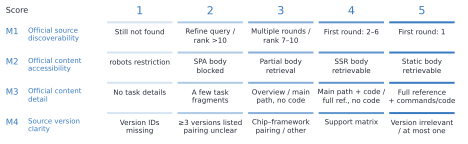
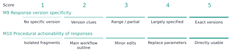
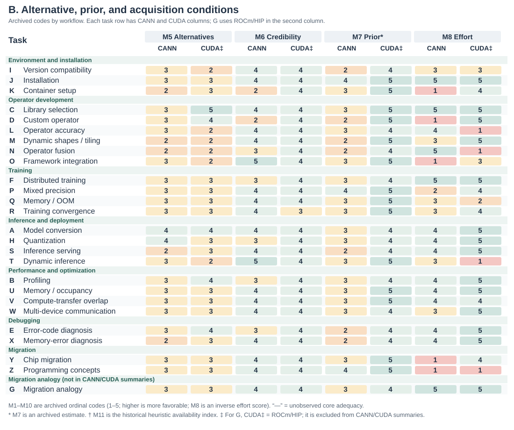
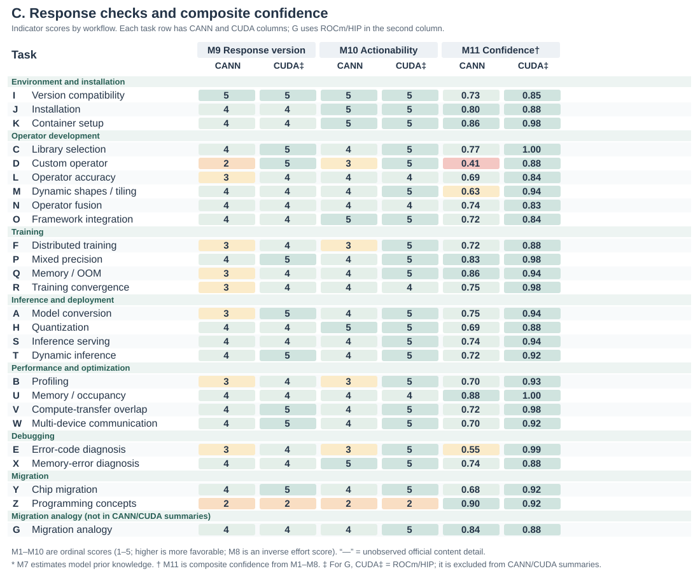
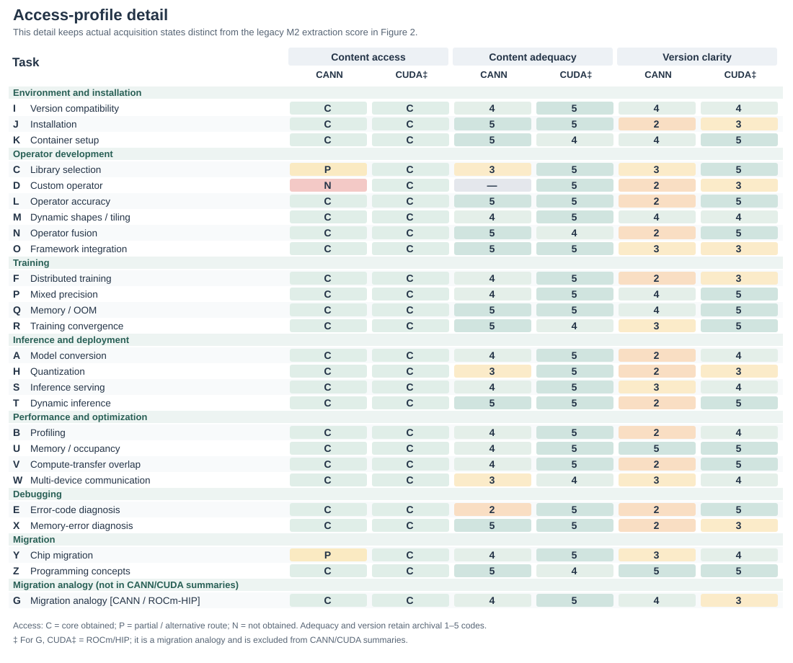
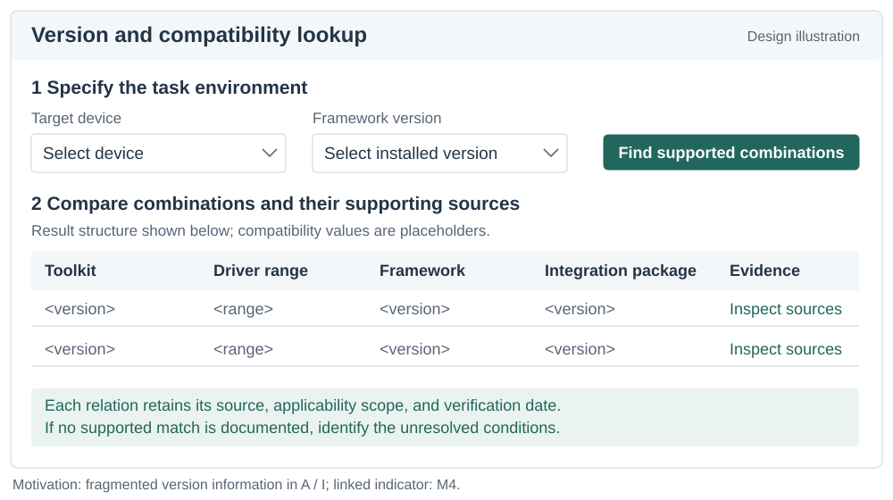
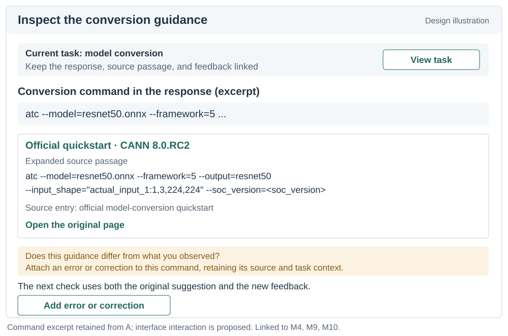

# Can AI Find What Developers Need? Defining and Measuring Knowledge Availability for AI in Developer Ecosystems

## Abstract

AI agents increasingly participate in software development, from retrieving technical resources and generating or modifying code to executing tasks through tools. Assisting developers with these tasks requires access to usable technical knowledge. We conceptualize these conditions as knowledge availability for AI and introduce a task-level protocol with eleven indicators covering knowledge sources, acquisition effort, and response properties. We apply the method to 26 categories of software development tasks for AI-accelerated computing, comparing knowledge availability across ecosystems. The analysis distinguishes unclear version information, failures to obtain core instructions, readable but insufficient guidance, and supported main procedures with unavailable references. These findings connect developers’ information needs when assessing technical suggestions with knowledge gaps, informing improvements in technical knowledge provision and agents’ acquisition and use of knowledge. We contribute a conceptual framework, an inspectable protocol, and a case application for diagnosing the knowledge conditions underlying agents’ assistance with development tasks.

## Keywords

knowledge availability for AI; developer ecosystems; technical documentation; information foraging; AI agents; measurement methods

## Introduction

Developers routinely move between documentation, code examples, search results, and community explanations while deciding what to do next. Research on opportunistic programming and developers' information needs shows that finding and interpreting information is part of programming itself [@brand2009; @ko2007; @sillito2008]. A useful result must fit the current task: a command needs the right options, an API example needs the right version, and an explanation of an error needs enough context to guide investigation. The existence of documentation is therefore only one condition for its usefulness.

Development agents with retrieval and tool-use capabilities introduce another collaborative route through this knowledge environment. A developer may ask about an error or a code fragment, or state a desired change or outcome and delegate information seeking, documentation reading, implementation planning, and portions of code modification to an agent. To advance such a task, the agent may search, read, and combine material across official sites, documentation, repositories, and communities before drafting a response, an implementation approach, or a code change. Studies of code-generation tools, conversational programming assistance, and agent support describe opportunities for this support alongside difficulties in understanding and checking generated suggestions [@vaithilingam2022; @barke2023; @programmerAssistant2023]. Delegating the search changes how supporting material reaches the developer, while leaving a need to judge whether a suggestion has an identifiable basis, fits the local environment, and requires further information. The agent's access to technical material is one condition for making that basis available for inspection. Measuring this access can therefore identify gaps in the knowledge on which AI-mediated guidance depends.

Consider an agent asked how to implement and integrate a custom accelerator operator. A search may return an official development guide, yet the reading tool may obtain only navigation and metadata. For an error-diagnosis task, the same tool may obtain the full official page, but the page may contain only a generic instruction to inspect logs. A retrieval-success measure can mark both questions as having relevant results. An access measure distinguishes the first failure but not the second. Even adequate instructions can remain ambiguous when they refer to incompatible toolkit and framework versions. These distinctions matter to documentation teams deciding what to repair and to agent designers deciding what uncertainty to expose.

Those building developer ecosystems need to understand not only whether an agent can provide usable technical guidance, but also which knowledge conditions constrain that guidance and where improvements are needed. Similar shortcomings in answers may arise from different conditions: official resources were not discovered, procedural content was not obtained, acquired content lacked task-specific detail, or the basis for selecting a version remained unclear. A usable answer may also rely on alternative sources, masking gaps in official resources. Final answers or task outcomes alone offer limited grounds for distinguishing these conditions. Taking developers’ task-specific knowledge needs as a reference, we compare how ecosystems support different development activities and examine sources, acquisition events, and acquired content to identify problems in resource provision, information organization, and complementary sources, informing ecosystem development and agent interaction.

We define **knowledge availability for AI** as the extent to which task-relevant technical knowledge can be discovered, obtained, and assessed for applicability by a specified agent and tool configuration under stated retrieval conditions. The construct is relational: it concerns a task, a knowledge environment, and a means of accessing that environment at a particular time. We operationalize it through an evidence-recording protocol and eleven indicators. The indicators distinguish source conditions, acquisition effort, response checks, and a composite confidence score calculated from M1-M8. The method is intended for professionals such as product managers, designers, technical writers, and software engineers who develop and maintain developer platforms, technical knowledge resources, or AI agents. It aims to help them identify gaps in the discovery, acquisition, and task support provided by technical resources, and locate opportunities to improve knowledge provision and agent feedback. The case application demonstrates diagnostic distinctions for these uses; their value in teams' work requires evaluation.

We ask two research questions. **RQ1:** How can knowledge availability for AI be defined and operationalized so that task-specific access conditions and evidence gaps can be systematically recorded and reviewed? **RQ2:** What patterns of knowledge availability does the method reveal across development tasks, and how can those patterns inform documentation and agent design?

We address these questions through a methodological framework and its application to software development tasks for AI-accelerated computing. The case covers 26 task categories, yielding 52 task-side records. Twenty-five categories compare CANN and CUDA development contexts; one migration category uses ROCm/HIP as the comparison destination and is treated separately. The case application connects task-level measurement to cross-task patterns and design implications. We contribute (1) a construct that distinguishes knowledge conditions from retrieval success and answer correctness; (2) a task-level protocol, indicator definitions, and portable analysis materials; and (3) worked cases and a cross-task synthesis that distinguish different breakdowns and connect them to documentation and agent design.

## Related Work and Construct Boundaries

### Developer information seeking and documentation

Information foraging theory relates information-seeking behavior to the structure and expected value of available information [@pirolli1999]. Programming studies show how developers interleave searching, learning, and implementation, and how their questions depend on the work they are performing [@brand2009; @ko2007; @sillito2008]. API-learning difficulties further motivate attention to the explanatory resources surrounding a technical interface [@robillard2009]. These studies show that developers’ information needs are closely tied to their current tasks. We therefore organize the assessment around specific development tasks, examining whether agents can find and obtain the required resources and whether those resources provide the explanations, parameter descriptions, and procedures needed for the task.

Our method does not infer human usability from machine access. A page readable by a browser can be inaccessible to a particular extraction tool; conversely, text readily extracted by an agent can still be difficult for a person to navigate. We examine the conditions of the delegated knowledge route. Claims about developers' time, trust, satisfaction, or task completion require separate evidence.

### AI support for programming

Studies of AI programming assistance distinguish obtaining a suggestion from understanding, adapting, and checking it. Vaithilingam et al. describe difficulties in understanding, editing, and debugging generated code [@vaithilingam2022]; Barke et al. distinguish acceleration and exploration in programmers' use of code-generating models [@barke2023]. Ross et al. examine conversational assistance around code context [@programmerAssistant2023]. These findings motivate attention to the supporting information available when a suggestion is considered. Our protocol examines whether relevant source passages, version conditions, and procedural details can be obtained and connected to that suggestion. It supplies an account of those knowledge conditions alongside studies of how developers engage with AI assistance.

Agents can interleave reasoning and tool use, and retrieval-augmented generation provides a way to incorporate external information into generation [@lewis2020; @yao2023]. WebArena, SWE-bench, and SWE-agent evaluate or develop agents in realistic web and software-engineering settings [@zhou2024webarena; @jimenez2024swebench; @yang2024sweagent]. Their task outcomes are valuable evidence of system performance. Our framework offers a complementary description of the knowledge conditions under which such systems operate. A failure can involve unavailable evidence, inadequate interpretation of available evidence, or unsuccessful execution; the present method directly addresses the first of these and records information relevant to separating them.

### Retrieval, attribution, and the availability construct

Existing research evaluates AI systems at several levels. ALCE examines the fluency, correctness, and citation quality of generated answers; RAGAs and ARES additionally assess the relevance of retrieved context and the faithfulness of answers to that context [@gao2023alce; @ragas2024; @ares2024]. AgentBoard analyzes agents’ action processes through measures such as fine-grained task progress, demonstrating the value of process information beyond final success rates [@ma2024agentboard]. These approaches provide a foundation for understanding system performance. Developing and maintaining a developer ecosystem also requires connecting performance to specific knowledge conditions: whether technical resources are readily discoverable, whether the required content is actually obtained, whether it supplies procedural detail, and whether versions have clear selection and compatibility guidance. We organize task-level measurement around these relationships to distinguish conditions calling for better acquisition paths, fuller content, or clearer version relations.

The distinctions in Table 1 position the construct. Availability can be necessary for an evidence-grounded answer without being sufficient for correctness. An agent can misinterpret an available source. It can also produce a correct answer from prior knowledge without obtaining any external evidence. These outcomes should remain distinguishable.

| Object of assessment | Central question | Relationship to this method |
| --- | --- | --- |
| Retrieval success | Was a relevant result returned? | One acquisition condition; not proof that required content was obtained. |
| Documentation usability | Can intended readers navigate and understand the material? | A related human-facing property requiring its own evaluation. |
| Knowledge availability for AI | What task-relevant knowledge was obtainable under the recorded conditions? | The construct operationalized here. |
| Answer correctness and attribution | Is the response correct, and do its sources support its claims? | A downstream evaluation that may use the acquired evidence. |
| Execution success | Do the proposed actions work in the target environment? | Requires execution or other independent outcome evidence. |

: Construct boundaries and neighboring objects of assessment.

## Methodological Framework

### Unit of analysis and task requirements

The unit is a **task-side acquisition episode**: a development objective pursued in a particular technical ecosystem using a stated agent and retrieval configuration. A task specification records the desired outcome, starting artifacts, constraints, version dependencies, and evidence required to support a next action. For example, model conversion may require a conversion command, an input-shape specification, a target-device setting, and a way to check the generated artifact. These requirements guide inspection; a long page is not automatically adequate.

Task selection must follow the purpose of the application. An ecosystem assessment may seek coverage across workflows; a documentation-team audit may focus on recurring support questions. Neither establishes the population frequency of those tasks without additional sampling evidence. For cross-ecosystem use, analysts record differences in starting conditions and task scope rather than assuming that similar names make tasks equivalent. The framework can also be applied within one ecosystem, across versions, or across retrieval configurations, provided the comparison conditions are made explicit.

Figure 1 locates the measurements in an observable tool-use loop. It is an analytic model, not a reconstruction of hidden model reasoning: the agent searches for candidate sources, selects URLs, fetches content or records a failure, then integrates evidence and assesses task adequacy and version applicability. When evidence is insufficient but remains searchable, the loop returns to query refinement. Model prior is registered as a separate branch that need not produce an observable source; it is therefore not automatically treated as traceable evidence.

{#fig:framework description="A conceptual process diagram starts with a development task and context, showing intent interpretation, subgoal decomposition, routing, and a Need retrieval? decision. The retrieval branch shows web search for official and third-party candidates, URL selection, web fetch for content, and a direct-fetch route for a known URL; the other branch is model prior. Sources feed back to a current-evidence record, then pass through Is evidence adequate?, Can retrieval continue?, and Any reliable evidence left? decisions to converge, retry, or a risk-marked final answer. All M1 through M11 labels use the same style and name their measurement location."}

### Sources, acquisition, and action conditions

The framework examines three knowledge channels: official materials, community or third-party materials, and model prior knowledge. For external channels, it separates **access** from **adequacy**. Discovery concerns whether a candidate source is found; acquisition concerns what the reading tool actually returns. Adequacy concerns whether that return supplies the task-required commands, explanations, parameters, or diagnostic cases. Version applicability is examined across channels because sources can be individually informative while describing different environments.

Official status is determined by the publisher's relationship to the material, not by its hosting platform. A vendor's repository or blog belongs to that vendor's official channel. An independently authored tutorial hosted on the same platform can have a different status. Cross-posting also makes domain diversity an imperfect proxy for independent evidence. The protocol therefore preserves source identity, publisher, date when available, and any observed derivation or duplication. Lack of these details is recorded as uncertainty.

The output of the method is an **availability profile** with an evidence trail. It identifies what was found, what was obtained, what appears adequate, what applicability conditions remain unresolved, and the effort required to acquire that knowledge. An optional aggregate can help summarize a chosen operationalization, but it cannot replace this profile. In particular, internal model knowledge cannot make an inaccessible external source accessible, even if it enables an answer.

### An evidence record

The evidence record connects each judgment to its basis. Its minimum fields are the task question and starting conditions; agent and tool configuration when known; collection time; queries and selected URLs; publisher and source role; returned content or a relevant excerpt; access outcome; applicable versions; task requirements supported by that content; acquisition counts; and the coding decision with a rationale. A field also identifies whether an entry is directly recorded, subsequently coded, estimated, or unavailable.

This distinction prevents a common reporting error: transforming an interpretation into an observation merely because a script assigns it a number. A logged extraction failure is an observation of the tool-source interaction. Labeling an explanation as sufficient is a judgment against task requirements. Estimating a model's familiarity with a toolkit is an inference unless a separate test supports it. Numerical coding does not erase these differences.

## Operationalization and Measurement Protocol

### Eleven indicators and their evidential roles

The method examines three knowledge sources: official material, third-party material, and model prior knowledge. It assesses discovery, acquisition, and source quality, and connects knowledge acquisition to response generation through measures of retrieval effort and response properties. Table 2 presents the eleven indicators and their scoring criteria.

| ID | Indicator | Evidence and interpretation |
| --- | --- | --- |
| M1 | Official source discoverability | Measures the ease of finding task-relevant official material using result position, search rounds, and the need for query refinement. |
| M2 | Official content accessibility | Assesses the retrieval of task-relevant official content using the selected page’s fetch category, returned body content, and access barriers. |
| M3 | Official content detail | Measures the detail of task-relevant official material using its coverage level and the actionability of commands and code. Content that cannot be retrieved is marked as blocked. |
| M4 | Source version clarity | Measures how clearly official material enables selection of an applicable version, considering coexisting versions, compatibility matrices, and device–framework compatibility conditions. |
| M5 | Third-party source count | Measures the amount of third-party material obtained during retrieval, with scores assigned according to the recorded source count. |
| M6 | Third-party source credibility | Assesses third-party credibility from source type, with adjustments for publication age, content consistency, and distribution across source platforms. |
| M7 | Estimated model prior knowledge | Estimates the support that existing model knowledge provides for a task, using model self-assessment adjusted for the pace of relevant technical change. |
| M8 | Search and acquisition effort | Measures retrieval effort from search rounds, fetch attempts, and failed fetches. Lower acquisition cost receives a higher score. |
| M9 | Response version specificity | Measures how precisely a response identifies applicable versions and component combinations, ranging from exact specifications to unresolved version choices. |
| M10 | Procedural actionability of responses | Assesses the operational completeness of response commands and steps, distinguishing direct use, parameter substitution, minor adaptation, and skeletal guidance. |
| M11 | Composite confidence score | Combines support from official material, third-party material, and model prior knowledge, with adjustments for version clarity and retrieval effort, using the formula below. |

: The eleven indicators and the evidence each can support.

M1–M7 describe support from the three knowledge sources, while M8 captures the effort required to acquire that knowledge. M9 and M10 assess response version specificity and procedural actionability. M11 is calculated from M1–M8, with response properties reported separately. Together, the individual indicators and composite confidence characterize each task’s knowledge support and help identify areas for improvement.

### Applying the protocol

**First, define the task and the recording boundary.** State the development outcome, starting artifacts, and requirements against which adequacy will be assessed. Record the agent, tools, language, date, and context policy. Specify whether the unit includes a fresh acquisition, reused observations, or both. Set a retrieval budget or another observable stopping criterion appropriate to the application; an analyst must not infer an agent's internal reasons for stopping from the number of queries alone.

**Second, record discovery and acquisition.** Preserve queries, candidate sources, selected URLs, and read outcomes. Inspect official materials and record the community alternatives actually encountered, whether from mixed search results or subsequent searches. Keep a failed read separate from a failed search. When a mirror or another version supplies the required content, link it to the original attempt so that the workaround remains visible.

**Third, assess task support and applicability.** Map acquired material to the task requirements. Distinguish a returned document with missing essential content from a document that was never returned. Record stated versions and compatibility dependencies, including unresolved local facts. A version number in a URL is a clue, not by itself a verified compatibility relation.

**Fourth, score from observations.** Apply published anchors and explain the score assigned to each observation, and mark estimates and missing fields. Content acquisition status has four states: core content obtained; partial content obtained; required content not obtained; and unknown. Record access route separately as original entry, alternative entry, or unknown. Thus a complete mirrored body remains core content obtained even when it arrived through an alternative entry. Adequacy can use ordered anchors ranging from a generic fragment, through an overview and a usable main path, to detailed task-relevant reference material. The coding rationale identifies the specific requirements covered; it should not rely only on page length.

**Fifth, inspect the instructions and report the profile.** Identify the response or guidance used to assess M9 and M10. Map its key steps and version claims to acquired evidence, and record contradictions, source dependencies, and unsupported steps. Report the composite-confidence formula, missing-data treatment, and calculation assumptions. The accompanying worked example connects requirements to events, sources, acquired evidence, and scores, with raw call counts shown alongside the M8 effort score.

The method's novelty lies in this connected specification of the unit, evidence record, indicator roles, and diagnostic interpretation. Search rank, reading success, and version labels are familiar observations. Their value here comes from relating them to the requirements of one development task and explaining how an observation becomes a diagnosis.

```{=latex}
\raggedbottom
```

### Scoring rules and composite confidence

Each indicator is mapped to an ordinal score from 1 to 5 using its scoring rule. We describe the anchors by knowledge source, acquisition effort, response properties, and composite confidence. Appendix A specifies decision priorities and adjustments; task records provide the corresponding observations.

**Official material (M1–M4).** Discoverability combines result position, search rounds, and query refinement; body accessibility considers robots restrictions followed by page delivery and observed body returns. Grade 3 denotes partial retrieval of task-relevant body content, with detailed conditions in Appendix A. Body detail combines task coverage with the actionability of commands and code, while source version clarity considers version identifiers and compatibility conditions. Figure 2 shows the four sets of anchors: the lowest M3 grades distinguish whether task-specific details are present, while M4 distinguishes missing identifiers from listed versions with unclear compatibility. M3 is marked blocked when its body cannot be acquired.

{#fig:scoring-official description="Four rows share a 1–5 scale for official discovery, body accessibility, body detail, and source version clarity. M3 progresses from no task details to a few task fragments; M4 progresses from missing version identifiers to listed versions with unclear compatibility. M2 distinguishes robots restrictions, SPA body barriers, partial body retrieval, and retrievable SSR and static bodies."}

**Third-party material, model knowledge, and effort (M5–M8).** M5 scores the number of distinct third-party sources. M6 starts from the mean source-type baseline, adjusted for consistency, publication age, and platform distribution. M7 starts from the model self-rating and adjusts for technical change; Figure 3 shows the anchors before adjustment. M8 uses weighted effort $c=r+0.5f+4e$, where $r$, $f$, and $e$ denote search rounds, fetch calls, and failed fetches.

{#fig:scoring-support description="The middle row shows M7 self-ratings. Two step plots below show M5 rising with distinct third-party source counts and M8 falling with weighted effort. Filled M8 endpoints are included; open endpoints are excluded. At the top, an M6 calculation flow separates source baselines, mean and adjustments, and the final integer score. Source baselines of 2.5, 3, 3.5, and 4 are averaged, adjusted for consistency, recency, and platform independence, then rounded and clamped to 1–5."}

**Response properties (M9–M10).** M9 examines whether a response specifies versions and component combinations applicable to the task; M10 examines the operational conditions of its commands and steps. Figure 4 distinguishes the lower grades: version clues with unresolved applicability score above no specific version information, and a main workflow outline lacking key details scores above isolated fragments. These separately reported properties connect source conditions to the guidance produced.

{#fig:scoring-answers description="Two rows show five grades. M9 progresses from no specific version through version clues, range or partial specification, largely specified, and exact versions. M10 progresses from isolated fragments through a main workflow outline, minor edits, parameter substitution, and direct usability."}

**Composite confidence (M11).** Composite confidence is calculated from M1–M8. Each indicator score $s_i$ is normalized using $n(s_i)=s_i/5$. When M3 is marked as blocked, its contribution to the official-source branch is set to zero:

$$
O=n(s_1)n(s_2)n(s_3),\quad C=n(s_5)n(s_6),\quad P=n(s_7).
$$

$$
I=\left[1-(1-O)(1-C)(1-P)\right]\left[0.7+0.3n(s_4)\right]\left[0.9+0.1n(s_8)\right].
$$

The formula first combines support from official material, third-party material, and model prior knowledge, then applies version-clarity and retrieval-effort factors. It represents the potential for different knowledge channels to complement one another. Composite confidence is calculated from normalized ordinal scores and displayed using the bands in Figure 5; M9 and M10 are reported separately as response properties.

{#fig:scoring-confidence description="A horizontal scale uses boundaries 0, 0.24, 0.45, 0.63, 0.80, and 1 to separate very low, low, medium, medium–high, and high composite confidence."}

The task matrix presents the indicator scores, while the access-profile figure shows the corresponding content-acquisition outcomes to support interpretation. Appendix A specifies the calculations; the supplement provides task-level worked examples.

```{=latex}
\flushbottom
```

## Case Study of the CANN and CUDA Developer Ecosystems

### Task coverage and comparison scope

We conducted the development-task audit on June 10-11, 2026, covering environment setup, operator development, training, inference and deployment, performance analysis, debugging, and migration. Examples include model conversion, custom-operator integration, distributed initialization, version compatibility, and memory-error investigation. The task set sought workflow coverage; it was not sampled to estimate how often developers encounter these needs. Developer-role groupings organize task scenarios around the typical knowledge needs of different roles.

CANN and CUDA provide a useful setting because the tasks involve specialized APIs, toolchains, framework integration, and version dependencies. The task wording uses each ecosystem's terminology. This yields contextual comparisons, not controlled substitutions of equivalent APIs. In task A, for example, the CUDA question begins with a PyTorch model and asks for a TensorRT deployment path, whereas the CANN question starts with an ONNX model and asks for an ATC conversion. These scope differences must remain visible when interpreting effort and completeness.

Task G is a distinct migration analogy. Its comparison question concerns moving CUDA code to AMD ROCm/HIP and its official material comes from AMD. It is included in the 26-task set as a worked migration case, but is excluded from CANN/CUDA aggregate comparisons, leaving 25 pairs and 50 task-side records for those summaries. Its separate treatment demonstrates why source and comparison identity belong in the measurement protocol.

### Task execution and development of the method

We used a process log to record task questions, query strings, source descriptions, read outcomes, and scoring rationales. Scoring functions converted the observation fields into an interactive task matrix and analytic visualizations. Initial tasks used stepwise records; later batches used structured summaries. Some early read assessments reused observations already obtained in the same session.

Tasks were conducted in four batches. The first two covered A–D and E–H; the later two covered I–S and T–Z through parallel subagents. Structured observations were consolidated in the main session, where official and third-party source ownership was checked. Task questions were linked to their original assignments, and wording for the later batches was added to the process log from those assignments.

Tasks used Claude (model identifier `claude-opus-4-8`) with web-search and web-reading tools. Search returned candidate sources, and the reading tool summarized HTML from selected URLs. The analysis combined recorded queries, tool-returned content and summaries, structured observations, and scoring rationales. M9 and M10 assessed version specificity and procedural actionability using the guidance produced during the tasks and its corresponding records. The supplement links tasks, sources, and scoring rationales.

The framework developed iteratively through the audit. A consequential revision was the rejection of a site-wide access assumption when a main-path quickstart returned useful content. This paper consolidates the protocol and separates observations from estimates and aggregation choices. The supplementary protocol and worked record make the resulting recording structure explicit.

The analysis proceeds at three levels. First, we compare indicator scores within corresponding task categories to locate differences in resource discovery, content acquisition, content detail, version clarity, and guidance properties. Second, we describe indicator distributions using means ($\bar{x}$), standard deviations ($SD$), and counts at each score level, and summarize composite confidence by workflow. Third, we interpret score differences using the corresponding acquisition records and returned content, comparing content support under the same acquisition state and knowledge conditions across tasks within a workflow. M3 means and standard deviations include only records for which content detail can be assessed; blocked-content records are reported separately. These statistics describe the selected task set and do not support population-level inference about the ecosystems.

Beyond workflow comparisons, we group the 25 task pairs by development activity into getting started and environment setup, training and routine use, and operators and in-depth development. Both ecosystems use the same task assignments to compare knowledge-support distributions across these scenarios; Table 5 reports the assignments and descriptive statistics. G, whose comparison side is ROCm/HIP, remains a separate case and is excluded from CANN/CUDA aggregates. Scenario grouping organizes the task comparison, while individual indicator scores and corresponding materials explain the specific knowledge conditions.

### Task-level assessment results

The main comparison includes 25 CANN tasks: core content was obtained in 22 tasks, partial content in two, and no core content in one. Core content was obtained in all 25 corresponding CUDA tasks. Figures 6–8 present all eleven indicator scores and group tasks by environment and installation, operator development, training, inference and deployment, performance and optimization, debugging, and migration. G is shown as a separately marked CANN/ROCm-HIP migration analogy and is excluded from CANN/CUDA summaries.

{#fig:fullmatrixa description="A workflow-grouped task matrix. Each row is a development task and each metric has CANN and CUDA columns. This facet shows M1 official source discoverability, M2 official content accessibility, M3 official content detail, and M4 source version clarity. G is a separately marked CANN and ROCm/HIP migration analogy and is excluded from CANN/CUDA summaries."}

{#fig:fullmatrixb description="The second facet of a workflow-grouped task matrix. Rows correspond to the first facet and each metric has CANN and CUDA columns. This facet shows M5 third-party source count, M6 third-party source credibility, M7 estimated model prior knowledge, and M8 search and acquisition effort. G is a separately marked CANN and ROCm/HIP migration analogy."}

{#fig:fullmatrixc description="The third facet of a workflow-grouped task matrix. Rows correspond to the first two facets and each metric has CANN and CUDA columns. This facet shows M9 response version specificity, M10 procedural actionability of responses, and the composite confidence score from M1–M8. G is a separately marked CANN and ROCm/HIP migration analogy."}

Figures 6–8 present the ordinal scores for M1–M10 and composite confidence calculated from M1–M8. Figure 9 adds content-acquisition states to support interpretation of the corresponding scores.

{#fig:accessprofile description="A workflow-grouped auxiliary matrix. Each row compares CANN and CUDA in content acquisition, official content detail, and source version clarity. C, P, and N indicate core content obtained, partial content obtained, and not obtained. The figure complements the indicator scores in Figures 6–8; specific entry paths are described in the corresponding task records. G is a separately marked CANN and ROCm/HIP migration analogy."}

Across the 25 task pairs, mean composite confidence is $\bar{x}=0.731$ for CANN and $\bar{x}=0.922$ for CUDA. Indicator-level summaries show differences of varying sizes in content detail, source version clarity, search and acquisition effort, and procedural actionability of responses. Table 3 reports the means and standard deviations of these four indicators. The findings below interpret the corresponding knowledge conditions using score distributions and specific resources.

| Indicator | CANN $\bar{x}$ ($SD$) | CUDA $\bar{x}$ ($SD$) |
| --- | ---: | ---: |
| M3 Official content detail | 4.21 (0.83) | 4.80 (0.41) |
| M4 Source version clarity | 2.88 (1.01) | 4.24 (0.83) |
| M8 Search and acquisition effort | 3.24 (1.36) | 3.88 (1.51) |
| M10 Procedural actionability of responses | 4.00 (0.76) | 4.72 (0.68) |

: Descriptive statistics for four indicators, scored from 1 to 5. $SD$ denotes the sample standard deviation. For M3, CANN has $n=24$, excluding the blocked-content record D, and CUDA has $n=25$. Both sides have $n=25$ for the other indicators. Higher M8 scores indicate lower search and acquisition effort. Means and standard deviations describe the ordinal score distributions.

## Findings: Knowledge Conditions Across Development Tasks

Task-level comparisons reveal three connected findings. First, the ecosystems show different distributions of knowledge support across development scenarios. Second, differences in specific tasks involve official-content delivery, detail, and version organization. Finally, third-party material and estimates of model prior knowledge also vary by task and require examination alongside official resources. We present scenario comparisons, specific knowledge gaps, and complementarity among sources in that order.

### Knowledge-support distributions differ between ecosystems across development scenarios

Across workflows, CANN's mean composite confidence is $\bar{x}=0.799$ for environment and installation, $\bar{x}=0.658$ for operator development, and $\bar{x}=0.646$ for debugging; the corresponding CUDA means are $\bar{x}=0.904$, $\bar{x}=0.891$, and $\bar{x}=0.933$ (Table 4). Debugging has the largest between-ecosystem difference, at 0.287. The comparison directs attention to specific development activities: in this task set, CANN provides stronger knowledge support for environment configuration than for operator development and debugging.

| Workflow | Tasks | CANN $\bar{x}$ | CUDA $\bar{x}$ | Difference |
| --- | ---: | ---: | ---: | ---: |
| Environment and installation | 3 | 0.799 | 0.904 | 0.106 |
| Operator development | 6 | 0.658 | 0.891 | 0.233 |
| Training | 4 | 0.791 | 0.945 | 0.154 |
| Inference and deployment | 4 | 0.722 | 0.920 | 0.198 |
| Performance and optimization | 4 | 0.752 | 0.957 | 0.205 |
| Debugging | 2 | 0.646 | 0.933 | 0.287 |
| Migration | 2 | 0.787 | 0.921 | 0.133 |

: Workflow means of the composite confidence score for 25 task pairs. Difference = CUDA minus CANN; G is excluded.

| Development scenario | Task pairs | CANN $\bar{x}$ ($SD$) | CUDA $\bar{x}$ ($SD$) |
| --- | ---: | ---: | ---: |
| Getting started and environment setup | 9 | 0.762 (0.078) | 0.915 (0.038) |
| Training and routine use | 5 | 0.743 (0.121) | 0.953 (0.045) |
| Operators and in-depth development | 11 | 0.699 (0.113) | 0.914 (0.062) |

: Mean composite confidence and sample standard deviation for 25 task pairs grouped by development scenario. Getting started and environment setup comprises A, H, I, J, K, S, T, Y, Z; training and routine use comprises E, F, P, Q, R; operators and in-depth development comprises B, C, D, L, M, N, O, U, V, W, X. Both ecosystems use identical assignments, excluding G.

Scenario grouping further shows CANN's mean composite confidence decreasing from $\bar{x}=0.762$ for getting started and environment setup to $\bar{x}=0.743$ for training and routine use and $\bar{x}=0.699$ for operators and in-depth development. CUDA's corresponding means are $\bar{x}=0.915$, $\bar{x}=0.953$, and $\bar{x}=0.914$, without the same descending pattern. This comparison identifies weaker knowledge support for in-depth development in CANN, allowing the assessment to produce specific insights into how an ecosystem supports different development activities.

Cases within the groups clarify the knowledge these scenarios require. CANN's tiling task M and custom-operator task D score 0.628 and 0.410, respectively. Memory-access and utilization task U, also in the in-depth development group, scores 0.881 and obtained official best-practice material. Error-code task E in the training and routine-use group scores 0.554; its acquired official explanation lacked diagnostic detail. We next examine acquisition and content records to identify the knowledge-provision issues involved in these scenario differences.

### Official-content delivery, detail, and version organization create distinct knowledge gaps

In the main comparison, 22 of the 25 CANN tasks obtained core content, two obtained partial content, and one did not obtain core content; all 25 CUDA tasks obtained core content. Most tasks acquired official material, while acquisition obstacles were concentrated in a few paths. Those paths require examination against task requirements to identify the missing procedural material.

Task D requires creating an Ascend C operator and integrating it with a framework, with implementation code, configuration-field explanations, and compilation and deployment steps. The WebFetch return for the selected official entry contained navigation, metadata, and documentation links, explicitly reporting “No code blocks, no implementation details, no step-by-step commands.” This read therefore did not supply the implementation content required by the task. The corresponding CUDA task obtained detailed official content, with M3 = 5. The comparison locates the difference in delivery of material needed for implementation, beyond whether an official guide appears in search results. M1 records official-source discovery conditions, M2 records the acquisition outcome, and M3 is marked as blocked. This assessment locates an improvement target in the path from the selected entry to the implementation body: the entry should expose a body link that the reading tool can follow, or directly present the implementation, compilation, and deployment instructions. For assessing an implementation suggestion, the missing information is the procedure that would support its steps; a link to the guide alone does not supply that basis.

Once content is obtained, its task support still differs. Among CANN's 24 assessable records, ten each have M3 = 4 and M3 = 5, and four have M3 = 2 or 3; all 25 CUDA records have M3 = 4 or 5. CANN task E obtained an EZ9999 explanation that left the cause unspecified and provided only generic checks, with M3 = 2. The corresponding CUDA task obtained a checking-tool guide with specific commands, tool options, and report formats, with M3 = 5. This difference concerns whether the acquired material supplies the steps and explanations needed for diagnosis.

Task X, also a debugging task, obtained detailed official guidance in both ecosystems, with M3 = 5 on each side. Comparing E and X locates the issue in specific task content: CANN's memory-checking task already has substantial official guidance, while its error-code diagnosis task lacks information needed to select the next check. The improvement target is the content of error explanations and diagnostic guidance.

Task A shows how useful main-path material and unavailable references can coexist. The acquired conversion quickstart supplied an ATC command, input-shape and target-device parameters, and a device-information step. A more extensive ATC/AIPP reference returned navigation and metadata. The worked recording example links the quickstart to supported conversion requirements and the missing reference to unresolved advanced settings. In task Y, accessing chip-migration information through the document center likewise yielded only partial content. These cases motivate recording both the content obtained and its relation to a task requirement, with the access route recorded separately where available. For a developer assessing the conversion guidance, this distinction identifies a supported main procedure and advanced settings that still require reference material. It bounds which parts of a proposed action the acquired sources can substantiate.

Acquisition processes also differ. Thirteen CANN tasks and 20 CUDA tasks found candidate sources in one search round; the remainder used two rounds. Both sides of K obtained official core content, but CANN recorded four fetches and one fetch failure, whereas CUDA recorded two fetches without failure, yielding M8 = 1 and M8 = 4, respectively. These records include additional attempts along resource-entry and acquisition paths in the analysis of knowledge-provision conditions.

Version organization affects a broader range of tasks. Mean M4 is $\bar{x}=2.88$ for CANN and $\bar{x}=4.24$ for CUDA. Twelve CANN tasks score 2, spanning conversion, installation, training, operator development, inference, optimization, and debugging. In A, similar quickstarts appear in different version trees, leaving a version choice after content acquisition; its M4 is 2, compared with 4 for the corresponding CUDA task. These differences direct attention to the organization of recommended versions, applicability scopes, and compatibility evidence.

Both sides of I obtained compatibility information, with M4 = 4 and response-version explicitness M9 = 5. The CANN task combined sources about the toolkit, driver, framework, and integration package; the acquired compatibility matrix supplied a basis for connecting these relations. Version assessment can thus identify insufficient selection guidance and record how existing compatibility information supports a task. For ecosystem development, the relevant object is the set of queryable and verifiable relations among resources.

After retrieval is delegated to an agent, the applicability declared by a source still needs comparison with the developer's device and software combination. Source applicability and local environment facts supply different information for this comparison: missing compatibility relations require source investigation, while unspecified installed versions require a local environment check.

### Complementary support and limitations across knowledge sources

Across the 25 task pairs, the mean number of third-party candidate sources per task is $\bar{x}=3.16$ for CANN and $\bar{x}=3.44$ for CUDA; five and six tasks, respectively, have only one or two candidates. Complementary support requires task-specific examination. In X, both ecosystems obtained detailed official guidance, with one and three third-party candidates, respectively; I has three and two. Differences in counts do not run in the same direction for every task.

Source records further show that platform distribution and acquisition conditions affect candidate entries. For K, both CANN candidates come from CSDN, while CUDA's four candidates span different platforms. CANN records for N, O, and Q include blocked acquisition of Zhihu content. Platform distribution helps identify source relationships to inspect, while returned content determines whether entries can supply usable explanations. Whether different articles on the same platform are independent still requires content examination.

Source combinations make complementarity between official and community knowledge concrete. CANN task X has few third-party candidates but detailed official guidance; D lacks core official content and also has a low third-party credibility score. E records continued searching for cases after the official error explanation proved insufficient. These cases point, respectively, to experience supplementing official guidance, jointly limited core guidance and alternative support, and a need for diagnostic information from other sources. Ecosystem knowledge development therefore needs to examine which task requirements official resources support and which still depend on discoverable, obtainable practical cases and independent explanations.

Model prior-knowledge estimates provide another support indicator. In the main comparison, mean M7 is $\bar{x}=2.84$ for CANN and $\bar{x}=4.56$ for CUDA. CANN tasks D, E, I, M, N, S, and X score 2, while all CUDA tasks score 4 or 5. Reading this estimate alongside source records identifies tasks whose external knowledge support warrants closer inspection. We did not separately test performance without retrieval; the estimate describes the configuration of knowledge support and does not validate independent task completion by the model.

M9 and M10 further record the guidance formed during tasks. For example, X has M10 = 5 in both ecosystems, whereas E has M10 = 3 and M10 = 5, respectively. These response properties and the acquired materials provide joint grounds for inspection, extending analysis from knowledge sources to the version statements and procedural conditions in the resulting guidance.

## Discussion: Design Implications for Knowledge Provision and Agent Interaction

The comparisons develop an account of ecosystem knowledge support through development scenarios, specific knowledge gaps, and complementary sources. We use these results to discuss development priorities, improvements to official resources and agent feedback, and community knowledge and source inspection. The design illustrations make potential applications concrete; their effects have not been evaluated.

### Setting development priorities through scenarios and knowledge requirements

The scenario comparison identifies limited knowledge support for in-depth development in CANN as an area requiring attention. Examining D, M, and related tasks locates specific needs for implementation guides, procedural detail, and supplementary cases; E also identifies diagnostic knowledge as task content requiring development. This demonstrates the diagnostic value of task-level research: comparing development activities and their knowledge requirements produces specific insights into ecosystem development priorities.

These insights imply different scopes of improvement. Version issues recurring across workflows motivate shared recommended entries and organized compatibility relations; D's missing core content and E's limited diagnostic detail call for repairs to the corresponding tasks. Tasks with limited third-party support also require examination of practical-case and independent-explanation coverage. Improvements can be checked by returning to the original tasks and examining whether their knowledge requirements receive stronger support.

### Improving official knowledge provision and agent feedback

Recurring version issues suggest treating applicability as a property of a documentation system. A stable recommended-version entry can coexist with clearly indexed documentation for earlier versions, while each page states its applicable versions and verification date. Compatibility relations among drivers, toolkits, frameworks, and integration packages can be published in a queryable form. For a task such as I, this would let a developer or agent request the supported combinations for a stated environment, reducing the need to assemble the relation from several disconnected records.

Figure 10 makes this proposal concrete through a compatibility lookup interface. Device and framework constraints define the query, and each returned combination retains its sources, applicability scope, and verification date. Where no supported match is documented, the interface identifies unresolved conditions. The version problem registered by M4 becomes an inspectable relation, providing a basis for subsequently checking the applicability of a response.

{#fig:compatibilitydesign description="A proposed compatibility lookup interface has target-device and framework-version selectors, followed by result fields for toolkit, driver range, framework, integration package, and supporting sources. Placeholder fields illustrate the structure without asserting compatibility values. Each relation retains provenance, applicability scope, and a verification date; unmatched queries identify unresolved conditions. The motivation is fragmented version information in tasks A and I."}

Version-dependent guidance should connect a source's applicability to the available task environment. Before proposing a toolkit/framework combination, an agent can use device and software facts already supplied in the task, requesting only information that remains necessary to establish the match. The response indicators then ask whether the recommendation states its applicable version conditions and provides actionable steps with explicit substitutions or modifications.

Figure 11 illustrates version checking through a separate environment record. It distinguishes developer-supplied local facts from the applicability declared by a source, then records the comparison as matched, mismatched, or insufficient information. The record is reused within the task and updated with additional user input to support applicability checks before specific commands are recommended.

{#fig:environmentdesign description="An environment record contains placeholder fields for device model, toolkit, framework, and integration versions. A separate area presents the cited material's version and compatibility conditions and identifies the missing information needed to establish a match. Checks can be matched, mismatched, or insufficient information, and the developer can update the task's environment record."}

Localized acquisition and content gaps call for task-specific repairs. D motivates a readable route to the core operator-development guide, through server-rendered content, a text export, or another stable entry. E already has a dedicated error page; its improvement requires more informative content within that entry: error semantics, possible triggers, diagnostic steps, links to issue cases, and applicable versions. For a catch-all error, a guide can state what the code alone leaves unresolved and specify which logs or local observations are needed next. Such a page supports diagnosis by organizing available evidence around the user's problem.

Figure 12 illustrates task-oriented content through E's error page. It starts with what the code can establish, identifies local information to collect, links observable symptoms to checks and attributed cases, and retains a support route for unresolved situations. Domain maintainers would need to establish the actual causes, checks, and cases; the structure helps locate the knowledge that needs to be supplied.

{#fig:diagnosticdesign description="A proposed EZ9999 diagnostic page first states that the code alone does not identify a cause, then organizes logs, triggering operations, and environment information. A table connects observable conditions to checks and attributed cases, followed by unresolved branches and support. The content structure is illustrative and asserts no verified causes or cases."}

The same task-oriented structure can guide other documentation units. An intended outcome, prerequisites, minimal commands or code, parameter explanations, expected output, and recovery information provide concrete material for both human reading and agent retrieval. Machine-readable exports and indexes should preserve those relationships and their version scope. Their success can be checked against the relevant content-acquisition and detail fields for the task that motivated the change.

Figure 13 illustrates delivery of the same task material through a document body and a machine-readable export. Using the command and parameter relations in the conversion quickstart acquired in task A, the export preserves the task, applicable version, source, parameter explanations, and related steps. For a route such as D's, the aim is to deliver the missing core guidance; where a readable body already exists, the aim is to preserve its context during export. Acceptance checks should compare acquired content with task requirements, rather than only checking for a particular file format.

{#fig:readableexportdesign description="The left side structures a model-conversion quickstart with version, official source, an ATC command excerpt, and input_shape and soc_version instructions. The right side is a proposed structured export retaining task, version, source, command, parameters, related steps, and original entry. The arrow indicates preservation of content relationships, not a new acquisition or a demonstrated site repair."}

An agent interface can preserve the difference between finding a relevant source, obtaining its body, and supporting a proposed step. For D, an informative status would identify the missing implementation guide. For E, it would indicate that the official explanation is generic and request the logs or trigger context needed for further diagnosis. For A, it could retain the usable conversion path while marking advanced reference settings as unresolved. These statuses connect a retrieval event to its consequence for the developer's current task.

Figure 14 contrasts proposed responses to D and E. For D, the agent first seeks a linked body page or another readable source, while retaining the original entry for optional inspection. For E, it explains how trigger context and relevant log excerpts would guide a search for diagnostic cases. Developer-supplied content is a fallback for acquisition failures; accessible core guidance remains a responsibility of the knowledge provider. M1-M3 locate the gap, while M8 records the effort of subsequent attempts.

{#fig:acquisitiondesign description="Two side-by-side subfigures show proposed feedback for distinct knowledge gaps. The left, based on D, shows a found guide returning only navigation and metadata, then proposes looking for body links or readable sources and retains optional access to the original entry. The right, based on E, shows the official EZ9999 body obtained but containing only generic advice, then requests trigger context and logs. Both are design illustrations, not original dialogue screenshots."}

Knowledge provision also involves entry points and maintenance. Stable, searchable official entries affect whether candidate materials are discovered; explicit ownership, revision dates, and compatibility relations support subsequent assessment. Teams can use representative tasks as recurring inspection units, tracking whether queries reach the intended material, its body is delivered, version relations have changed, and community cases remain applicable. Such maintenance also addresses source governance and third-party knowledge provision beyond the illustrated interfaces.

### Expanding community knowledge and supporting source inspection

Community knowledge development can address task situations that lack adequate support, including specific failures, operating experience under different configurations, and alternative implementations. Tasks with few candidate sources require checking which supplementary explanations are missing; concentrated or inaccessible sources require checking independent practical evidence and content-delivery conditions. The aim is for task-relevant experience to be discoverable, obtainable, and attributable, beyond simply increasing the number of entries.

Agents can retain source passages, applicability conditions, and their relationships to suggestions to help developers inspect available support. Where content remains missing, they should identify unsupported parts of the task and direct further searches or requests for necessary local information accordingly. The source-inspection and corrective-feedback illustration makes these information relationships concrete.

Figure 15 further illustrates source inspection and corrective feedback. A developer can expand the cited passage for a command, inspect its applicable version, and attach an encountered error or correction to the suggestion. The original source, task environment, and new feedback remain connected so the next check can address the specific discrepancy. This provides inspectable support for the response properties described by M9 and M10 and for subsequent revision.

{#fig:verificationdesign description="Within a model-conversion task, the response command expands into a cited passage from the official CANN 8.0.RC2 quickstart and an original-page entry. A developer can attach an error or correction to that command, retaining the source and task context for the next check. The command excerpt comes from that quickstart material; the interface interaction is proposed."}

These proposals treat checking suggestions as part of programming work, consistent with the information-seeking and AI-assistance studies discussed earlier [@brand2009; @vaithilingam2022; @barke2023]. Exposing every retrieval event or source passage could add reading effort without clarifying the next action. An interface could first show the supported step, relevant version scope, and unresolved condition, with source passages available on demand. This prioritizes the information needed for the current judgment while retaining a route to detailed inspection.

Requests for environment facts can likewise interrupt a task, especially when they repeat information already provided. A request should explain which recommendation depends on the missing fact and reuse task context where available, with confirmation when it may be stale. For diagnostic logs, it should request relevant excerpts and allow sensitive details to be removed. Missing compatibility relations and generic error explanations require work by documentation and system teams; collecting more local facts cannot supply those missing explanations. The balance between inspection, interruption, and useful guidance remains a question for evaluating these proposals.

### Reusing the diagnostic method

The method connects a task requirement to a source or acquisition event, an indicator code, and a diagnosis of the information needed to assess a proposed action. Professionals such as product managers, designers, technical writers, and software engineers who develop and maintain developer platforms, technical knowledge resources, or AI agents could use the profile to locate missing guidance or applicability relations and distinguish further source retrieval from a request for a local fact. Analysts can reuse the record structure with domain-specific requirements, such as client-server compatibility in a database SDK or deployment prerequisites in a web framework. These are intended applications of the method.

Subsequent evaluation can examine whether independent analysts produce comparable profiles, whether the diagnoses correspond to expert assessments of missing information, and whether documentation teams find them useful for planning repairs. These questions follow directly from the intended use of the method. The present application supplies the task-level distinctions, worked records, and cross-task synthesis on which such evaluation can build.

## Limitations and Research Transparency

The case demonstrates how the method distinguishes breakdowns in discovery, content acquisition, and task adequacy. Task records support inspection of scoring rationales and reproduction of the calculations. The results reflect this task set and its retrieval conditions. Stability across models, tool configurations, and retrieval budgets, as well as independent scoring agreement and applicability across ecosystems, requires further evaluation. The supplement provides observation fields, the scoring implementation, task-to-source mappings, calculation discrepancy notes, and summary scripts to support inspection and subsequent applications.

The study assesses knowledge conditions and recorded guidance. How developers use these distinctions to evaluate evidence, check local applicability, and decide when further information is needed requires observation of their interaction with that guidance. Evaluation should also examine whether the proposed feedback supports those judgments and what reading effort or interruptions it introduces.

## Conclusion

We define knowledge availability for AI through eleven indicators connecting knowledge sources, acquisition processes, and response properties. Task-level comparisons of CANN and CUDA identify differences in knowledge support across development scenarios, including weaker support for in-depth development in CANN, and reveal specific conditions involving content delivery, diagnostic detail, version organization, and supplementary sources. Connecting scores with task requirements and acquired material produces concrete insights into how ecosystems support development activities and which knowledge resources require improvement.

The method makes the basis for AI-mediated technical guidance an object of inspection: which source supports a proposed step, which applicability relation remains unresolved, and what additional information is needed. The framework, protocol, and case analysis provide a way to locate these conditions and relate them to knowledge provision and agent feedback. Documentation repairs, source retrieval, and requests for local facts follow from different diagnoses, offering concrete directions for subsequent evaluation.


## Appendix A: Scoring calculations {.unnumbered}

**Official material (M1–M4).** M1 first considers the search process: at least two rounds with query refinement scores 2; at least two rounds without refinement scores 3. For a single round, the first official result at rank 1, 2–6, 7–10, or beyond 10 scores 5, 4, 3, or 2, respectively. Grade 1 describes difficulty finding a relevant official source after repeated searches. Under the study’s tool configuration, M2 first considers robots restrictions, then page delivery and observed returns: robots restriction, 1; SPA preventing body retrieval, 2; partial retrieval of task-relevant bodies, 3; retrievable server-rendered body, 4; retrievable static body, 5. Grade 3 means that some targeted body content was obtained while other targeted body content remained technically inaccessible; it does not denote insufficient detail in obtained material or follow automatically from using an alternative entry. M3 is blocked when SPA or robots barriers prevent body acquisition. For acquired content, grade 1 provides no task-specific details, grade 2 only a few task-specific fragments, and grade 3 an overview or a main path without commands/code. A main path with commands/code or a complete reference without them scores 4; a complete reference with them scores 5. Commands/code denotes operational content in the material. For M4, grade 1 lacks version identifiers; grade 2 lists at least three versions but leaves their compatibility unclear. Where version information is assessable, apply these conditions in order: version-irrelevant task or at most one version, 5; official support matrix, 4; identifiable device–framework pairing, 3; at least three versions with unclear compatibility, 2; remaining cases, 3.

**Third-party material (M5–M6).** For M5, distinct source counts $n$ of 0, 1–2, 3–4, 5, and at least 6 map to grades 1–5. Official documents, repositories, and forums belong to the official channel. M6 starts with the mean source-type baseline: aggregators or reposts, 2.5; personal technical blogs, 3.0; established Q&A or columns, 3.5; cloud-vendor technical articles or academic papers, 4.0. Three adjustments follow. High, medium, and low content consistency add 1, 0, and −1. Relative to June 2026, median publication ages of at most 36 months, over 36 through 48 months, and over 48 months add 0, −0.25, and −0.5. Platform independence $p$ is distinct platforms divided by source count; $p\geq 0.8$, $0.6\leq  p<0.8$, and $p<0.6$ add 0, −0.25, and −0.5. Missing dates are excluded from the median; an entirely missing date or platform field yields zero for that adjustment. Round the result to the nearest integer, resolving half-integer ties to the even integer, then clamp to 1–5.

**Model knowledge and acquisition effort (M7–M8).** M7 starts from the self-rating anchors in Figure 3. Stable, moderate, and fast technical change add 0, −0.25, and −0.5, respectively; rounding and clamping follow M6. M8 uses weighted effort $c=r+0.5f+4e$, where $r$ is search rounds, $f$ fetch calls, and $e$ failed fetch calls. The intervals $c\leq 1.5$, $1.5<c\leq 2.5$, $2.5<c\leq 4$, $4<c\leq 6$, and $c>6$ map to grades 5, 4, 3, 2, and 1.

**Response properties (M9–M10).** M9 grade 1 provides no specific version; grade 2 supplies version clues but leaves applicability to the task unresolved; grade 3 specifies a range or some components; grade 4 largely specifies versions; grade 5 gives exact versions. M10 grade 1 offers isolated fragments; grade 2 outlines the main workflow but lacks key implementation details; grade 3 requires minor edits; grade 4 only parameter substitution; grade 5 is directly usable.

**Composite confidence (M11).** The main-text formula combines official, third-party, and model-knowledge branches, adjusted by M4 and M8. A blocked M3 sets the official branch $O=0$. M9 and M10 remain separate. The five bands in Figure 5 have lower bounds of 0, 0.24, 0.45, 0.63, and 0.80. Each lower bound is inclusive; each upper bound is exclusive, except that the highest band includes 1.
