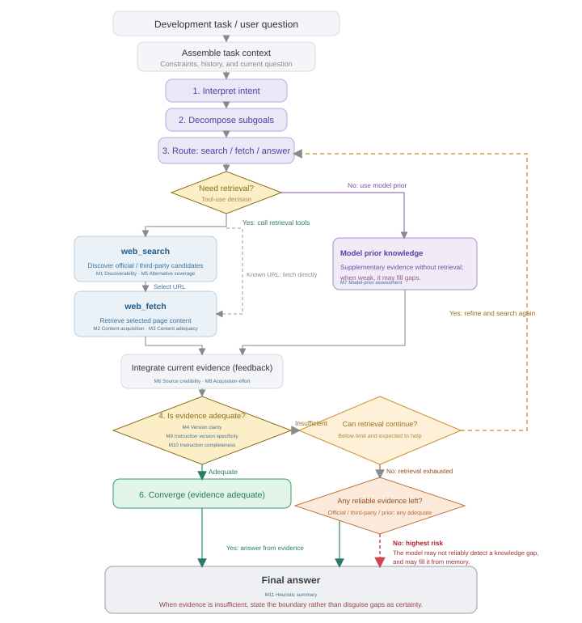
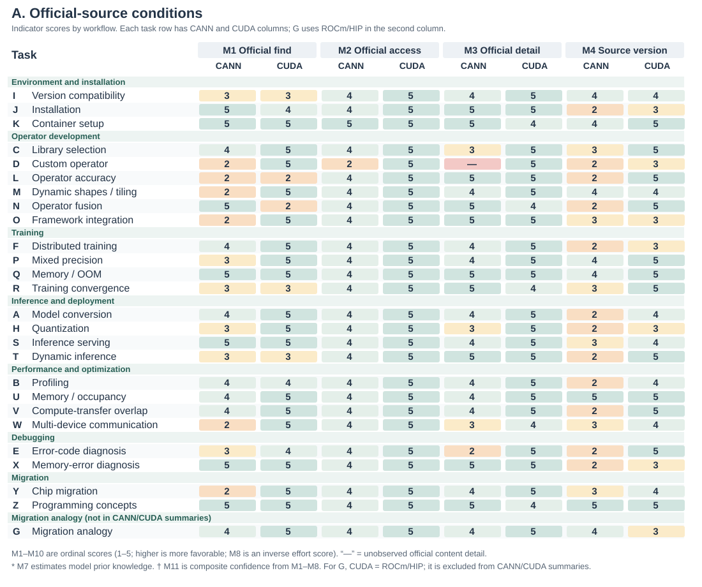

# Can AI Find What Developers Need? Defining and Measuring Knowledge Availability for AI in Developer Ecosystems

## Abstract

AI agents increasingly mediate developers' access to technical knowledge. Retrieving relevant pages, however, does not establish that an agent can obtain the version-specific evidence a development task requires. We define knowledge availability for AI and operationalize it through a task-level protocol with eleven indicators spanning source access, content adequacy, applicability, acquisition effort, and output checks. A retrospective application uses records covering 26 accelerator-development tasks, comprising 25 CANN/CUDA task pairs and a separately identified migration analogy. Worked cases distinguish inaccessible guidance, accessible but insufficient explanations, alternative access paths, and unresolved version dependencies. The application also exposes measurement choices that require explicit treatment, including source attribution, inferred model knowledge, and composite-score saturation. We contribute a framework, an inspectable operationalization, and a case-based examination of their diagnostic scope. The method characterizes evidence conditions; its heuristic scores do not estimate answer correctness or execution success.

## Keywords

knowledge availability for AI; developer ecosystems; technical documentation; information foraging; AI agents; measurement methods

## Introduction

Developers routinely move between documentation, code examples, search results, and community explanations while deciding what to do next. Research on opportunistic programming and developers' information needs shows that finding and interpreting information is part of programming itself [@brand2009; @ko2007; @sillito2008]. A useful result must fit the current task: a command needs the right options, an API example needs the right version, and an explanation of an error needs enough context to guide investigation. The existence of documentation is therefore only one condition for its usefulness.

AI assistants introduce another route through this knowledge environment. A developer can delegate a question to an agent that searches, reads, combines sources, and drafts a response. Studies of code-generation tools and conversational programming assistance describe opportunities for this support alongside difficulties in understanding and checking generated suggestions [@vaithilingam2022; @barke2023; @programmerAssistant2023]. Delegating information seeking does not remove the need for applicable evidence. It changes who encounters the documentation, through which interface, and what information reaches the developer.

Consider an agent asked how to implement and integrate a custom accelerator operator. A search may return an official development guide, yet the reading tool may obtain only navigation and metadata. For an error-diagnosis task, the same tool may obtain the full official page, but the page may contain only a generic instruction to inspect logs. A retrieval-success measure can mark both questions as having relevant results. An access measure distinguishes the first failure but not the second. Even adequate instructions can remain ambiguous when they refer to incompatible toolkit and framework versions. These distinctions matter to documentation teams deciding what to repair and to agent designers deciding what uncertainty to expose.

Existing evaluation approaches already distinguish retrieval quality, context relevance, answer faithfulness, and related properties. RAGAS and ARES provide component-level evaluation of retrieval-augmented generation, while ALCE examines generated answers and their citations [@ragas2024; @ares2024; @gao2023alce]. Our contribution addresses a complementary measurement problem: how to inspect the technical knowledge conditions encountered by an agent while addressing a concrete development task, including access failures, version relations, alternative sources, and the provenance of an auditor's judgments. This requires connecting the developer's information requirement to the resources actually obtained, rather than inferring availability from a fluent answer.

We define **knowledge availability for AI** as the extent to which task-relevant technical knowledge can be discovered, obtained, and assessed for applicability by a specified agent and tool configuration under stated retrieval conditions. The construct is relational: it concerns a task, a knowledge environment, and a means of accessing that environment at a particular time. We operationalize it through an evidence-recording protocol and eleven indicators. The indicators distinguish source conditions, acquisition effort, output checks, and an optional heuristic aggregate; they do not constitute eleven independent measurements of a single latent ability.

We ask two research questions. **RQ1:** How can knowledge availability for AI be defined and operationalized so that task-specific access conditions and evidence gaps can be systematically recorded and reviewed? **RQ2:** What diagnoses does the method support in development-task cases, and how do recording, coding, and aggregation choices delimit those diagnoses?

We address these questions through a methodological framework and a retrospective application to an existing accelerator-development audit. The archive contains 26 task categories and 52 task-side records. Twenty-five categories compare CANN and CUDA development contexts; one migration category uses ROCm/HIP as the comparison destination and is treated separately. The contribution is the method and its inspectable application, not an enduring ranking of accelerator ecosystems. We contribute (1) a construct that distinguishes knowledge conditions from retrieval success and answer correctness; (2) a task-level protocol, indicator definitions, and portable analysis materials; and (3) worked cases and an examination of measurement assumptions that show what the method can diagnose and where further validation is needed.

## Related Work and Construct Boundaries

### Developer information seeking and documentation

Information foraging theory relates information-seeking behavior to the structure and expected value of available information [@pirolli1999]. Programming studies show how developers interleave searching, learning, and implementation, and how their questions depend on the work they are performing [@brand2009; @ko2007; @sillito2008]. API-learning difficulties further motivate attention to the explanatory resources surrounding a technical interface [@robillard2009]. These studies motivate our task-level unit and the distinction between encountering a resource and obtaining what a task requires.

Our method does not infer human usability from machine access. A page readable by a browser can be inaccessible to a particular extraction tool; conversely, text readily extracted by an agent can still be difficult for a person to navigate. We examine the conditions of the delegated knowledge route. Claims about developers' time, trust, satisfaction, or task completion require separate evidence.

### AI support for programming

Research on code-generation and conversational tools examines how developers use and evaluate AI assistance [@vaithilingam2022; @barke2023; @programmerAssistant2023]. This work provides the interaction context for our study: technical suggestions enter development activities where their applicability must be assessed. We focus on the availability of supporting knowledge before drawing conclusions about how people use those suggestions.

Agents can interleave reasoning and tool use, and retrieval-augmented generation provides a way to incorporate external information into generation [@lewis2020; @yao2023]. WebArena, SWE-bench, and SWE-agent evaluate or develop agents in realistic web and software-engineering settings [@zhou2024webarena; @jimenez2024swebench; @yang2024sweagent]. Their task outcomes are valuable evidence of system performance. Our framework offers a complementary description of the knowledge conditions under which such systems operate. A failure can involve unavailable evidence, inadequate interpretation of available evidence, or unsuccessful execution; the present method directly addresses the first of these and records information relevant to separating them.

### Retrieval, attribution, and the availability construct

RAGAS and ARES assess properties of retrieved context and generated answers; ALCE evaluates citation-supported generation [@ragas2024; @ares2024; @gao2023alce]. Accordingly, we do not claim that previous evaluation treats retrieval or answer quality as indivisible. Our methodological focus is the connection between technical-task requirements, the acquisition process, and the structure of the surrounding knowledge ecosystem. Version compatibility, partial access to a how-to guide, and dependence on a community workaround are particularly consequential in this setting.

The distinctions in Table 1 position the construct. Availability can be necessary for an evidence-grounded answer without being sufficient for correctness. An agent can misinterpret an available source. It can also produce a correct answer from prior knowledge without obtaining any external evidence. These outcomes should remain distinguishable.

| Object of assessment | Central question | Relationship to this method |
| --- | --- | --- |
| Retrieval success | Was a relevant result returned? | One acquisition condition; not proof that required content was obtained. |
| Documentation usability | Can intended readers navigate and understand the material? | A related human-facing property requiring its own evaluation. |
| Knowledge availability for AI | What task-relevant knowledge was obtainable under the recorded conditions? | The construct operationalized here. |
| Answer correctness and attribution | Is the response correct, and do its sources support its claims? | A downstream evaluation that may use the acquired evidence. |
| Execution success | Do the proposed actions work in the target environment? | Requires execution or other independent outcome evidence. |

: Construct boundaries and neighboring objects of assessment.

## Methodological Framework

### Unit of analysis and task requirements

The unit is a **task-side acquisition episode**: a development objective pursued in a particular technical ecosystem using a stated agent and retrieval configuration. A task specification records the desired outcome, starting artifacts, constraints, version dependencies, and evidence required to support a next action. For example, model conversion may require a conversion command, an input-shape specification, a target-device setting, and a way to check the generated artifact. These requirements guide inspection; a long page is not automatically adequate.

Task selection must follow the purpose of the application. An ecosystem assessment may seek coverage across workflows; a documentation-team audit may focus on recurring support questions. Neither establishes the population frequency of those tasks without additional sampling evidence. For cross-ecosystem use, analysts record differences in starting conditions and task scope rather than assuming that similar names make tasks equivalent. The framework can also be applied within one ecosystem, across versions, or across retrieval configurations, provided the comparison conditions are made explicit.

Figure 1 locates the measurements in an observable tool-use loop. It is an analytic model, not a reconstruction of hidden model reasoning: the agent searches for candidate sources, selects URLs, fetches content or records a failure, then integrates evidence and assesses task adequacy and version applicability. When evidence is insufficient but remains searchable, the loop returns to query refinement. Model prior is registered as a separate branch that need not produce an observable source; it is therefore not automatically treated as traceable evidence.

{#fig:framework description="A conceptual process diagram starts with a task and recorded context, then shows need and subgoal interpretation, a decision about external evidence, web search for official and community candidates, URL selection, web fetch for content, an integrated evidence ledger, and adequacy and version-applicability assessment. Dashed branches show model prior and query refinement with retry. The end state is either a next action supported by evidence or an explicit evidence gap. Nodes identify locations of indicators M1 through M11."}

### Sources, acquisition, and action conditions

The framework retains three channels from the original audit: official materials, community or third-party materials, and model prior knowledge. For external channels, it separates **access** from **adequacy**. Discovery concerns whether a candidate source is found; acquisition concerns what the reading tool actually returns. Adequacy concerns whether that return supplies the task-required commands, explanations, parameters, or diagnostic cases. Version applicability is examined across channels because sources can be individually informative while describing different environments.

Official status is determined by the publisher's relationship to the material, not by its hosting platform. A vendor's repository or blog belongs to that vendor's official channel. An independently authored tutorial hosted on the same platform can have a different status. Cross-posting also makes domain diversity an imperfect proxy for independent evidence. The protocol therefore preserves source identity, publisher, date when available, and any observed derivation or duplication. Lack of these details is recorded as uncertainty.

The output of the method is an **availability profile** with an evidence trail. It identifies what was found, what was obtained, what appears adequate, what applicability conditions remain unresolved, and what acquisition effort was recorded. An optional aggregate can help summarize a chosen operationalization, but it cannot replace this profile. In particular, internal model knowledge cannot make an inaccessible external source accessible, even if it enables an answer.

### An evidence ledger

The ledger connects each judgment to its basis. Its minimum fields are the task question and starting conditions; agent and tool configuration when known; collection time; queries and selected URLs; publisher and source role; returned content or a retained excerpt; access outcome; applicable versions; task requirements supported by that content; acquisition counts; and the coding decision with a rationale. A field also identifies whether an entry is directly recorded, subsequently coded, estimated, or unavailable.

This distinction prevents a common reporting error: transforming an interpretation into an observation merely because a script assigns it a number. A logged extraction failure is an observation of the tool-source interaction. Labeling an explanation as sufficient is a judgment against task requirements. Estimating a model's familiarity with a toolkit is an inference unless a separate test supports it. Numerical coding does not erase these differences.

## Operationalization and Measurement Protocol

### Eleven indicators and their evidential roles

Table 2 specifies the indicators retained from the audit and clarifies their evidential roles. The numbering preserves the connection to the archived data. The proposed operationalization uses content outcomes for access, distinguishes inferred prior knowledge from acquired sources, and interprets output checks as properties of recorded instructions rather than successful execution.

| ID | Indicator | Evidence and interpretation |
| --- | --- | --- |
| M1 | Official discoverability | Recorded query rounds and official-result position; identifies discovery effort under the selected search conditions. |
| M2 | Content acquisition status | Core content obtained, partial content obtained, not obtained, or unknown; concerns returned content, not the site's implementation technology. Access route is recorded separately as original entry, alternative entry, or unknown. |
| M3 | Official content adequacy | Task-required commands, parameters, explanations, and reference detail in the acquired content; unobserved when the content was not obtained. |
| M4 | Version clarity | Explicit scope, compatibility relations, and unresolved version branches; several maintained versions do not by themselves imply ambiguity. |
| M5 | Alternative-source coverage | Observed usable sources beyond the official channel, with source identities and any attribution uncertainty retained. |
| M6 | Alternative-source credibility | Authorship, currency, consistency, and evidence of derivation; domain diversity alone does not establish independence. |
| M7 | Model-prior assessment | Explicitly identified estimate or separate no-retrieval measurement; the archive contains estimates, not measured training coverage. |
| M8 | Acquisition effort | Raw search, read, retry, and refinement counts; a cost model is disclosed separately from those counts. The historical matrix displays an inverse effort score, while the worked record retains the underlying calls alongside its code. |
| M9 | Version specificity of instructions | Whether the recorded guidance identifies an exact combination, a constrained range, or unresolved dependencies. |
| M10 | Instruction completeness | Whether the recorded guidance includes the necessary steps and parameter substitutions; not proof that code was executed. |
| M11 | Heuristic summary | A declared aggregation of selected indicators; interpreted only within its assumptions and accompanied by the profile. |

: The eleven indicators and the evidence each can support.

M1-M6 describe source conditions; M7 registers a different basis for possible answer formation; M8 describes process effort; M9-M10 check the specificity and completeness of instructions; M11 summarizes an operationalization. These components can covary, but they are not interchangeable. They also need not apply to every task: a concept-explanation task may have no meaningful version-pinning requirement. Such cases require an explicit not-applicable state rather than a fabricated successful observation.

### Applying the protocol

**First, define the task and the recording boundary.** State the development outcome, starting artifacts, and requirements against which adequacy will be assessed. Record the agent, tools, language, date, and context policy. Specify whether the unit includes a fresh acquisition, reused observations, or both. Set a retrieval budget or another observable stopping criterion appropriate to the application; an analyst must not infer an agent's internal reasons for stopping from the number of queries alone.

**Second, record discovery and acquisition.** Preserve queries, candidate sources, selected URLs, and read outcomes. Inspect official materials and record the community alternatives actually encountered, whether from mixed search results or subsequent searches. Keep a failed read separate from a failed search. When a mirror or another version supplies the required content, link it to the original attempt so that the workaround remains visible.

**Third, assess task support and applicability.** Map acquired material to the task requirements. Distinguish a returned document with missing essential content from a document that was never returned. Record stated versions and compatibility dependencies, including unresolved local facts. A version number in a URL is a clue, not by itself a verified compatibility relation.

**Fourth, code with provenance.** Apply published anchors, retain the observation-to-code mapping, and mark estimates and missing fields. Content acquisition status has four states: core content obtained; partial content obtained; required content not obtained; and unknown. Record access route separately as original entry, alternative entry, or unknown. Thus a complete mirrored body remains core content obtained even when it arrived through an alternative entry. Adequacy can use ordered anchors ranging from a generic fragment, through an overview and a usable main path, to detailed task-relevant reference material. The coding rationale identifies the specific requirements covered; it should not rely only on page length.

**Fifth, inspect the instructions and report the profile.** Where the final response is retained, map its material steps and version claims to acquired evidence. Where only notes about possible instructions remain, identify M9-M10 as judgments about those notes. Report contradictions, source dependencies, and unsupported steps. If an aggregate is included, report its formula, missing-data treatment, and dependence on assumptions. The accompanying worked recording example makes the chain from requirement to event, source, saved evidence, and code explicit, including raw calls alongside the M8 effort code. This final distinction is essential for retrospective use of incomplete archives.

The method's novelty lies in this connected specification of the unit, ledger, indicator roles, and diagnostic interpretation. Search rank, reading success, and version labels are familiar observations. Their value here comes from relating them to the requirements of one development task and preserving how an observation becomes a diagnosis.

### Ordinal anchors and the historical aggregate

The archived implementation maps most fields to five ordered levels. For example, official discoverability combines the approximate position of the first official result with whether another search was needed; content adequacy distinguishes fragments, overviews, main-path material, and extensive reference material. Version clarity uses the observed number of versions and presence of a compatibility matrix. These are operational choices, not natural measurement intervals. The version rule in particular is a proxy: a larger version count can reflect good archival coverage as well as unresolved applicability.

The archive also defines a heuristic aggregate. For historical scores $s_i$, it uses $n(s_i)=s_i/5$, with unavailable official adequacy contributing zero to the official branch:

$$
O=n(s_1)n(s_2)n(s_3),\quad C=n(s_5)n(s_6),\quad P=n(s_7).
$$

$$
I=\left[1-(1-O)(1-C)(1-P)\right]\left[0.7+0.3n(s_4)\right]\left[0.9+0.1n(s_8)\right].
$$

The noisy-OR-shaped expression represents a design intuition: different channels may compensate for one another. Its factors are ordinal transformations, however, not calibrated probabilities, and source independence is not established. We therefore call $I$ a **heuristic availability index**, replacing the archive's label of overall confidence. M9-M10 do not enter this formula and cannot validate it merely by being coded alongside it. Unknown content quality remains unknown even when its unavailable branch contributes zero to a historical calculation.

The archive's M2 rule awards static pages a higher value than server-rendered pages. We retain that rule only to reproduce the archived index; the protocol above evaluates returned content regardless of rendering technology. This separation preserves the historical record without prescribing an unjustified implementation-based penalty. The index is presented as one auditable aggregation choice, while the profile and worked evidence chains carry the methodological argument.

## Case Application: Accelerator Development Ecosystems

### Task coverage and comparison scope

The application draws on a development-task audit recorded on June 10-11, 2026. It covers environment setup, operator development, training, inference and deployment, performance analysis, debugging, and migration. Examples include model conversion, custom-operator integration, distributed initialization, version compatibility, and memory-error investigation. The task set sought workflow coverage; it was not sampled to estimate how often developers encounter these needs. Developer-role groupings in the archive are organizing categories, not empirically recruited participant groups.

CANN and CUDA provide a useful setting because the tasks involve specialized APIs, toolchains, framework integration, and version dependencies. The task wording uses each ecosystem's terminology. This yields contextual comparisons, not controlled substitutions of equivalent APIs. In task A, for example, the CUDA question begins with a PyTorch model and asks for a TensorRT deployment path, whereas the CANN question starts with an ONNX model and asks for an ATC conversion. These scope differences must remain visible when interpreting effort and completeness.

Task G is a distinct migration analogy. Its comparison question concerns moving CUDA code to AMD ROCm/HIP and its official material comes from AMD. It remains in the 26-task archive as a worked migration case, but is excluded from CANN/CUDA aggregate comparisons, leaving 25 pairs and 50 task-side records for those summaries. Its separate treatment demonstrates why source and comparison identity belong in the measurement protocol.

### Records and the development of the method

The evidence consists of the process log, structured observation fields and scoring functions, an interactive task matrix, indicator definitions, and analytic visualizations. The process log retains questions, query strings, source descriptions, read outcomes, and coding explanations at different levels of detail. The initial tasks include longer stepwise accounts; later tasks often contain more compact summaries. Some early read assessments refer to observations already available in the original session. The archive should therefore be understood as an evolving audit record, not 52 uniformly isolated experimental trials.

The first two batches covered A-D and E-H. Later batches covered I-S and T-Z through parallel subagents whose structured observations were consolidated in the main session. The log describes source reclassification during that consolidation. It also states that the later question wording was recovered from the original task-assignment transcript. We retain those questions with that provenance; we do not describe them as invented after the audit. The full transcript referenced by the log is not included in the materials analyzed here.

The recorded system is identified as Claude using web search and a web-reading tool that summarized HTML. The archive does not establish the exact deployed model identifier, extraction-model version, search-provider configuration, or a uniform stopping budget across episodes. Complete returns and final responses are not consistently retained; M9-M10 therefore preserve archival assessments of the available guidance. Code in the original explanatory visualization is explicitly illustrative and is not used to fill these gaps. These limits constrain claims about rerunning the acquisition, but do not prevent inspection of the retained observations and computation.

The framework developed through the audit rather than preceding it as a preregistered instrument. A consequential revision was the rejection of a site-wide access assumption when a main-path quickstart returned useful content. This paper consolidates the protocol and separates observations from estimates and aggregation choices. Applying the method retrospectively does not make the earlier protocol uniform; the differences between its specification and the available case records are part of the methodological evaluation.

### Recorded profiles

Among the 25 CANN task-side records in the main comparison, 22 are coded as core content obtained, two as partial content obtained, and one as core content not obtained. The corresponding CUDA records are all coded as core content obtained. The frozen archive does not consistently retain whether an entry was original or alternative, so route is not inferred retrospectively. Figures 2–4 present all eleven archival indicators and group tasks by environment and installation, operator development, training, inference and deployment, performance and optimization, debugging, and migration. G remains a separately marked CANN/ROCm-HIP migration analogy and is excluded from CANN/CUDA summaries.

{#fig:fullmatrixa description="A workflow-grouped task matrix. Each row is a development task and each metric has CANN and CUDA columns. This facet shows M1 official discoverability, M2 historical extraction score, M3 official content adequacy, and M4 version clarity. G is a separately marked CANN and ROCm/HIP migration analogy and is excluded from CANN/CUDA summaries."}

{#fig:fullmatrixb description="The second facet of a workflow-grouped task matrix. Rows correspond to the first facet and each metric has CANN and CUDA columns. This facet shows M5 alternative-source coverage, M6 alternative-source credibility, M7 estimated model prior, and M8 acquisition effort. G is a separately marked CANN and ROCm/HIP migration analogy."}

{#fig:fullmatrixc description="The third facet of a workflow-grouped task matrix. Rows correspond to the first two facets and each metric has CANN and CUDA columns. This facet shows M9 instruction version pinning, M10 instruction completeness, and M11 historical heuristic availability index. G is a separately marked CANN and ROCm/HIP migration analogy."}

In Figures 2–4, M1–M10 are frozen archival ordinal codes from 1 to 5, while M11 is the historical heuristic index computed from those codes. M2 is a historical extraction score rather than the actual state of content acquisition. To make D and similar cases interpretable, Figure 5 retains the acquisition state separately so that “content not obtained” is not collapsed into a score.

{#fig:accessprofile description="A workflow-grouped auxiliary matrix. Each row compares CANN and CUDA in actual content acquisition, archival content adequacy, and version clarity. Acquisition uses C, P, and N for core content obtained, partial content obtained, and not obtained. Access route is a separate protocol field and is not inferred from the archival status. It distinguishes actual acquisition from the historical M2 extraction score shown in Figures 2 through 4. G is a separately marked CANN and ROCm/HIP migration analogy."}

The archive includes 12 CANN tasks with the lowest commonly observed version-clarity level, each present in the main comparison. The two highest version-clarity codes concern tasks treated as version-insensitive. This pattern directs attention to applicability evidence and illustrates why version relations must be recorded separately from content acquisition.

## Method Evaluation Through Worked Cases

### Discovery, access, and adequacy produce different diagnoses

Task D asks about creating an Ascend C operator and integrating it with a framework. The record describes search results containing community examples and related framework documentation, while the selected official how-to return lacks the required body. The diagnosis is specific: this acquisition route did not supply the core implementation guidance. It locates an intervention: make the required content accessible through a stable route and retain evidence of which route succeeds.

Task E concerns an accelerator error code. Here the log records an acquired official page containing a generic internal-error explanation, an unspecified cause, and broad instructions to check the installation or inspect logs. This is an adequacy limitation. The content was obtained, but did not narrow the task to a concrete trigger or diagnostic sequence. Repairing extraction alone would leave that requirement unmet. The comparison material includes more explicit error semantics and community explanations, although the two questions should not be assumed to require equal diagnostic effort.

Taken together, D and E demonstrate the diagnostic purpose of separating M1, M2, and M3. A retrieval-hit-only description cannot identify the missing official body in D; an access-only description would conceal E's lack of task-specific guidance.

### Partial routes can support a task without making all references available

In A, the CANN quickstart return includes an ATC command, input and target-device parameters, and a device-information step. The log also describes an attempted read of a more extensive reference page that did not supply its body. A page-level failure count alone would not indicate whether the conversion's main path remained supported. Conversely, a successful quickstart read would not justify marking the complete reference as acquired.

This case motivates requirement-level recording. The ledger can link the acquired quickstart to the conversion requirements it supports and leave advanced configuration requirements unresolved. It also exposes a bookkeeping issue: the structured record lists three reads and zero failed reads, whereas the process account describes a missing reference body. The archival materials do not resolve whether the counter excluded ancillary references or whether the entry is inconsistent. We preserve the discrepancy rather than silently choosing a new failure count. A reproducible formula cannot repair an ambiguous counting boundary.

### Version specificity and alternative evidence remain separate from access

Task I concerns compatibility among a toolkit, a framework integration package, drivers, and related components. Its notes describe available compatibility information distributed across repositories, package information, and documentation. The relevant diagnosis is the work required to connect those relations for the intended combination, not simply that several version numbers appear online. The framework makes the required environment facts explicit so that a version mismatch need not be attributed to unavailable text.

Task X concerns memory-error investigation. The archived CANN record assigns the acquired sanitizer documentation the highest adequacy level, while recording limited alternative material and a low estimate of model prior knowledge. Those observations describe different properties. A thin alternative channel can matter if the official guide does not cover a subsequent error, but it does not prove that the acquired guide was insufficient for the original question. Accordingly, the case supports reporting alternative coverage alongside adequacy; it does not establish that community breadth is always necessary for an actionable answer.

These examples also temper a simple account based on task depth. A conceptually demanding optimization question can have accessible, detailed guidance, while an apparently straightforward error lookup can lack a useful explanation. Dependence on ecosystem-specific examples is a plausible interpretation to investigate, not a causal mechanism established by this archive.

### Traceability, attribution, and the limits of recomputation

The portable analysis reproduces the historical scores from the retained fields and preserves all 52 task-side records. It also separates the 25-pair comparison from G and records known coding issues. One such issue occurs in H: a NVIDIA developer blog was included among alternative sources in the historical fields. The method's publisher-based rule places that material in the official channel. The supplement flags this discrepancy and does not silently rewrite the historical matrix into a purportedly recoded dataset.

These checks establish computational traceability for the frozen implementation and provide fields, mappings, and discrepancy annotations that can be reused in later independent coding and cross-ecosystem applications.

### Interpretation of the heuristic index

For the 25 pairs, the historical heuristic means are .732 for CANN and .922 for CUDA. These values retain the original coding and aggregation assumptions; they are provided for traceability rather than as corrected estimates of ecosystem quality. The excluded migration analogy and the flagged source and counting issues remain visible in the supplement. No significance test or population-level ranking is inferred from these task categories.

The formula itself illustrates why profiles must accompany aggregates. If the model-prior assessment is five, then $P=1$ and the channel-combination term equals one regardless of official and alternative-source values. Fourteen of the archive's 26 records labeled CUDA have this property. Thus, an apparently high index can be insensitive to missing external evidence. This is a mathematical property of the implementation, not an observed ability to answer without that evidence.

An archival sensitivity calculation that sets the prior contribution to zero, keeping other values fixed, changes the 26-row means from .736 to .606 for CANN and from .920 to .848 for the historical comparison column. This 26-row calculation includes G solely to reproduce the original implementation's scope. It is not a no-retrieval experiment and does not measure model knowledge. The calculation shows that absolute scores depend on the treatment of estimated priors; it does not by itself refute the usefulness of the source profiles.

The same caution applies to counterfactual improvement estimates. Raising the version code in a formula can reveal which recorded tasks the chosen aggregation rewards, but it is not an estimate of the return from a deployed documentation change. We therefore use the case to examine the index's assumptions rather than to prescribe an investment ranking from simulated score increases. Methodological usefulness rests on identifying an interpretable evidence gap and an appropriate response, not on maximizing the aggregate.

## Implications for HCI and Developer Ecosystem Design

### Making delegated information seeking inspectable

The framework identifies information that can be exposed when a developer delegates a question to an agent: whether the main source was obtained, which version conditions are unresolved, which steps have acquired support, and which local facts are still needed. These are candidates for interface design, not interface features evaluated in this study. A status such as “compatibility relation not yet established” expresses a more actionable limitation than an unexplained confidence number.

This connection is the HCI motivation for the method. The developer is affected by the evidence that reaches the interaction, even when they do not visit the source themselves. Documentation owners and agent designers can use a shared task-level account to distinguish a source that needs a readable export, a guide that needs a diagnostic example, and an interaction that needs to request an environment fact. These responses act at different points in the knowledge route.

### Documentation as evidence for a next action

A useful task-oriented documentation unit can state its intended outcome, applicable versions, prerequisites, minimal commands or code, expected output, and recovery information. These elements give an auditor concrete adequacy criteria and give an agent material it can cite. Access should be assessed at this unit rather than inferred from a site's framework or homepage. Static HTML, server rendering, or a textual export are implementation options; the relevant outcome is that the necessary content reaches the specified reader.

Version relationships deserve similar treatment. A supported combination of driver, toolkit, framework, and plugin is a relation to be checked, not merely a set of recognizable version strings. Explicit compatibility tables and task-linked environment requirements can reduce the need to assemble this relation from disconnected pages. Their effect on task success, however, must be evaluated through actual use or execution.

### Reusing and evaluating the method

To transfer the framework, an analyst replaces the domain-specific tasks and adequacy requirements while retaining the observation-to-diagnosis structure. A database SDK audit might inspect migration guides and client-server compatibility; a web-framework audit might inspect dependency versions and deployment prerequisites. These are proposed applications, not additional empirical cases. The framework supplies a way to record them consistently but does not establish transfer validity in advance.

Further evaluation should address whether independent analysts reach comparable codes, whether diagnosed gaps correspond to expert judgments of missing evidence, and whether the profiles support better remediation decisions than simpler summaries. Such evaluation is different from merely repeating the scoring script. The present case establishes an inspectable operationalization and demonstrates distinctions it can express; it leaves broader reliability, criterion validity, and practical benefit open to testing.

## Limitations and Research Transparency

The case demonstrates how the method distinguishes breakdowns in discovery, content acquisition, and task adequacy. The retained records support inspection of coding decisions and reproduction of score calculations. Some model and tool settings could not be recovered from the available materials, leaving stability across configurations unassessed. Independent coding agreement and applicability across ecosystems require further evaluation. The supplement provides frozen observation fields, the original scoring implementation, task and provenance tables, discrepancy notes, and scripts for the archival summaries so that subsequent work can evaluate the method under stated configurations and independent coding conditions.

## Conclusion

Knowledge availability for AI concerns whether task-relevant technical knowledge can reach an agent under specified conditions and be assessed for applicability. We define this construct, operationalize it through eleven indicators and an evidence ledger, and examine it through an accelerator-development case archive. The cases show why discovery, access, adequacy, version specificity, and alternative-source coverage need separate treatment. They also expose the consequences of counting boundaries, attribution choices, inferred priors, and aggregation rules.

The methodological contribution is a way to connect a development requirement to an inspectable evidence profile. It enables documentation and agent researchers to ask which knowledge condition requires attention while retaining the distinction between available evidence, generated answers, and successful action. That distinction is a necessary basis for evaluating how technical knowledge infrastructure supports AI-assisted development.

## AI Assistance Disclosure

AI tools assisted with manuscript organization, translation, language revision, analysis scripting, and figure preparation. The case archive itself was produced through AI-assisted retrieval, as described in the method. AI-generated suggestions and archival model-prior estimates are not presented as independent human validation.
