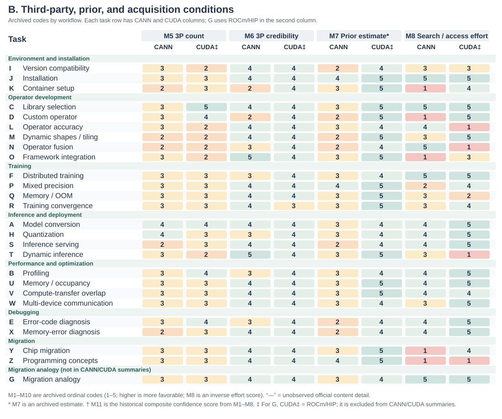
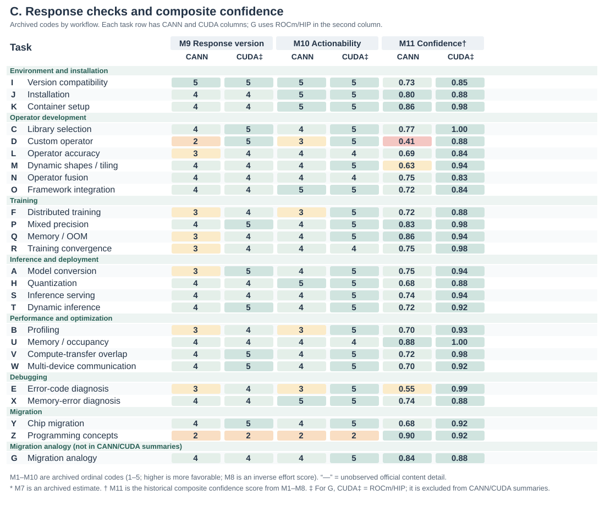
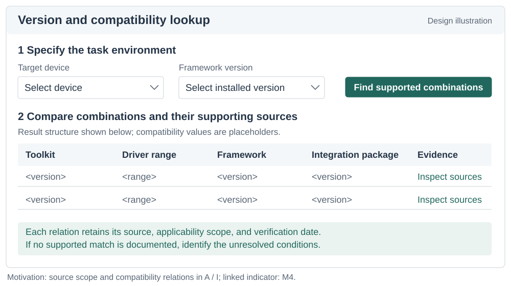
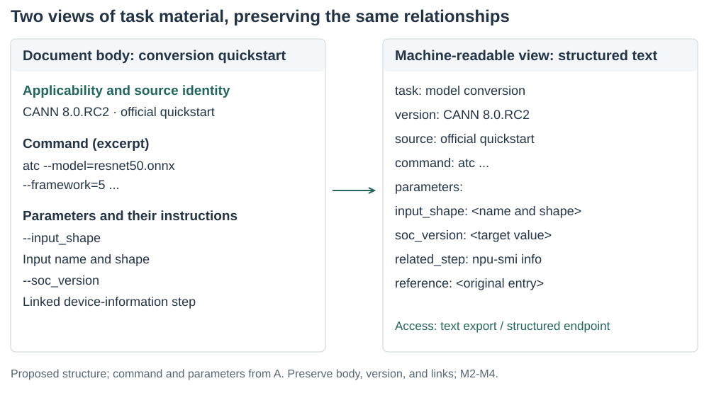
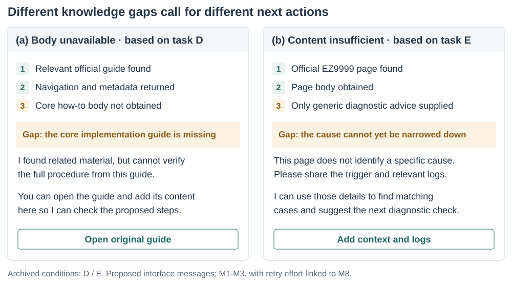

# Can AI Find What Developers Need? Defining and Measuring Knowledge Availability for AI in Developer Ecosystems

## Abstract

AI agents increasingly mediate developers' access to technical knowledge. We define knowledge availability for AI through a task-level protocol with eleven indicators linking sources, acquisition effort, and guidance properties. A retrospective application examines 26 development tasks: 25 CANN/CUDA pairs and a separate migration analogy. The analysis links task questions to retained tool calls, returns, and audit reports. It distinguishes navigation-only returns from readable but insufficient guidance, separates source applicability from local environment matching, and reveals alternative acquisition paths in both ecosystems. Worked cases demonstrate how these distinctions change the information or resource requiring attention. Historical scores provide an inspectable backdrop; task-linked evidence supports the findings. The resulting implications address knowledge provision and agent interaction. We contribute a framework, a reusable recording protocol, and a trace-based application showing how knowledge conditions inform analysis and design.

## Keywords

knowledge availability for AI; developer ecosystems; technical documentation; information foraging; AI agents; measurement methods

## Introduction

Developers routinely move between documentation, code examples, search results, and community explanations while deciding what to do next. Research on opportunistic programming and developers' information needs shows that finding and interpreting information is part of programming itself [@brand2009; @ko2007; @sillito2008]. A useful result must fit the current task: a command needs the right options, an API example needs the right version, and an explanation of an error needs enough context to guide investigation. The existence of documentation is therefore only one condition for its usefulness.

Development agents with retrieval and tool-use capabilities introduce another collaborative route through this knowledge environment. A developer may ask about an error or a code fragment, or state a desired change or outcome and delegate information seeking, documentation reading, implementation planning, and portions of code modification to an agent. To advance such a task, the agent may search, read, and combine material across official sites, documentation, repositories, and communities before drafting a response, an implementation approach, or a code change. Studies of code-generation tools, conversational programming assistance, and agent support describe opportunities for this support alongside difficulties in understanding and checking generated suggestions [@vaithilingam2022; @barke2023; @programmerAssistant2023]. Delegating information seeking does not remove the need for applicable evidence. It changes who encounters the documentation, through which interface, and what information reaches the developer.

Consider an agent asked how to implement and integrate a custom accelerator operator. A search may return an official development guide, yet the reading tool may obtain only navigation and metadata. For an error-diagnosis task, the same tool may obtain the full official page, but the page may contain only a generic instruction to inspect logs. A retrieval-success measure can mark both questions as having relevant results. An access measure distinguishes the first failure but not the second. Even adequate instructions can remain ambiguous when they refer to incompatible toolkit and framework versions. These distinctions matter to documentation teams deciding what to repair and to agent designers deciding what uncertainty to expose.

Existing evaluation approaches already distinguish retrieval quality, context relevance, answer faithfulness, and related properties. RAGAS and ARES provide component-level evaluation of retrieval-augmented generation, while ALCE examines generated answers and their citations [@ragas2024; @ares2024; @gao2023alce]. Our contribution addresses a complementary measurement problem: how to inspect the technical knowledge conditions encountered by an agent while addressing a concrete development task, including access failures, version relations, alternative sources, and the provenance of an auditor's judgments. This requires connecting the developer's information requirement to the resources actually obtained, rather than inferring availability from a fluent answer.

We define **knowledge availability for AI** as the extent to which task-relevant technical knowledge can be discovered, obtained, and assessed for applicability by a specified agent and tool configuration under stated retrieval conditions. The construct is relational: it concerns a task, a knowledge environment, and a means of accessing that environment at a particular time. We operationalize it through an evidence-recording protocol and eleven indicators. The indicators distinguish source conditions, acquisition effort, response checks, and a composite confidence score calculated from M1-M8.

We ask two research questions. **RQ1:** How can knowledge availability for AI be defined and operationalized so that task-specific access conditions and evidence gaps can be systematically recorded and reviewed? **RQ2:** What patterns of knowledge availability does the method reveal across development tasks, and how can those patterns inform documentation and agent design?

The method supports documentation maintainers, researchers evaluating agent-mediated knowledge access, and agent designers in deciding whether to improve discovery, deliver a missing body, enrich task guidance, clarify applicability, or request a local fact.

We address these questions through a methodological framework and a retrospective application to an existing audit of software development tasks for AI-accelerated computing. The archive contains 26 task categories and 52 task-side records. Twenty-five categories compare CANN and CUDA development contexts; one migration category uses ROCm/HIP as the comparison destination and is treated separately. The case application connects task-level measurement to cross-task patterns and design implications. We contribute (1) a construct that distinguishes knowledge conditions from retrieval success and answer correctness; (2) a task-level protocol, indicator definitions, and portable analysis materials; and (3) worked cases and a cross-task synthesis that distinguish different breakdowns and connect them to documentation and agent design.

## Related Work and Construct Boundaries

### Developer information seeking and documentation

Information foraging theory relates information-seeking behavior to the structure and expected value of available information [@pirolli1999]. Programming studies show how developers interleave searching, learning, and implementation, and how their questions depend on the work they are performing [@brand2009; @ko2007; @sillito2008]. API-learning difficulties further motivate attention to the explanatory resources surrounding a technical interface [@robillard2009]. These studies motivate our task-level unit and the distinction between encountering a resource and obtaining what a task requires.

Our method does not infer human usability from machine access. A page readable by a browser can be inaccessible to a particular extraction tool; conversely, text readily extracted by an agent can still be difficult for a person to navigate. We examine the conditions of the delegated knowledge route. Claims about developers' time, trust, satisfaction, or task completion require separate evidence.

Information quality also depends on the consumer and context of use [@wang1996]. This supports treating a command, a concept definition, and a compatibility relation as different task requirements. Provenance models such as PROV distinguish entities, activities, and agents [@prov2013]; we specialize that relationship to task requirements, search/read events, returned material, and coding decisions. The contribution lies in the operational connection used for development-task assessment, rather than in inventing provenance or context-dependent quality.

### AI support for programming

Research on code-generation and conversational tools examines how developers use and evaluate AI assistance [@vaithilingam2022; @barke2023; @programmerAssistant2023]. This work provides the interaction context for our study: technical suggestions enter development activities where their applicability must be assessed. We focus on the availability of supporting knowledge before drawing conclusions about how people use those suggestions.

Agents can interleave reasoning and tool use, and retrieval-augmented generation provides a way to incorporate external information into generation [@lewis2020; @yao2023]. WebArena, SWE-bench, and SWE-agent evaluate or develop agents in realistic web and software-engineering settings [@zhou2024webarena; @jimenez2024swebench; @yang2024sweagent]. Their task outcomes are valuable evidence of system performance. Our framework offers a complementary description of the knowledge conditions under which such systems operate. A failure can involve unavailable evidence, inadequate interpretation of available evidence, or unsuccessful execution; the present method directly addresses the first of these and records information relevant to separating them.

### Retrieval, attribution, and the availability construct

RAGAS and ARES assess properties of retrieved context and generated answers; ALCE evaluates citation-supported generation [@ragas2024; @ares2024; @gao2023alce]. Accordingly, we do not claim that previous evaluation treats retrieval or answer quality as indivisible. Our methodological focus is the connection between technical-task requirements, the acquisition process, and the structure of the surrounding knowledge ecosystem. Version compatibility, partial access to a how-to guide, and dependence on a community workaround are particularly consequential in this setting.

The distinctions in Table 1 position the construct. Availability can be necessary for an evidence-grounded answer without being sufficient for correctness. An agent can misinterpret an available source. It can also produce a correct answer from prior knowledge without obtaining any external evidence. These outcomes should remain distinguishable.

| Object of assessment | Central question | Relationship to this method |
| --- | --- | --- |
| Retrieval success | Was a relevant result returned? | One acquisition condition; not proof that required content was obtained. |
| Documentation usability | Can intended readers navigate and understand the material? | A related human-facing property requiring its own evaluation. |
| Knowledge availability for AI | What task-relevant knowledge was obtainable under the recorded conditions? | The construct operationalized here. |
| Answer correctness and attribution | Is the response correct, and do its sources support its claims? | A downstream evaluation that may use the acquired evidence. |
| Execution success | Do the proposed actions work in the target environment? | Requires execution or other independent outcome evidence. |

: Construct boundaries and neighboring objects of assessment.

## Methodological Framework

### Unit of analysis and task requirements

The unit is a **task-side acquisition episode**: a development objective pursued in a particular technical ecosystem using a stated agent and retrieval configuration. A task specification records the desired outcome, starting artifacts, constraints, version dependencies, and evidence required to support a next action. For example, model conversion may require a conversion command, an input-shape specification, a target-device setting, and a way to check the generated artifact. These requirements guide inspection; a long page is not automatically adequate.

Task selection must follow the purpose of the application. An ecosystem assessment may seek coverage across workflows; a documentation-team audit may focus on recurring support questions. Neither establishes the population frequency of those tasks without additional sampling evidence. For cross-ecosystem use, analysts record differences in starting conditions and task scope rather than assuming that similar names make tasks equivalent. The framework can also be applied within one ecosystem, across versions, or across retrieval configurations, provided the comparison conditions are made explicit.

Figure 1 locates the measurements in an observable tool-use loop. It is an analytic model, not a reconstruction of hidden model reasoning: the agent searches for candidate sources, selects URLs, fetches content or records a failure, then integrates evidence and assesses task adequacy and version applicability. When evidence is insufficient but remains searchable, the loop returns to query refinement. Model prior is registered as a separate branch that need not produce an observable source; it is therefore not automatically treated as traceable evidence.

{#fig:framework description="A conceptual process diagram starts with a development task and context, retaining intent interpretation, subgoal decomposition, routing, and a Need retrieval? decision. The retrieval branch shows web search for official and third-party candidates, URL selection, web fetch for content, and a direct-fetch route for a known URL; the other branch is model prior. Sources feed back to a current-evidence record, then pass through Is evidence adequate?, Can retrieval continue?, and Any reliable evidence left? decisions to converge, retry, or a risk-marked final answer. All M1 through M11 labels use the same style and name their measurement location."}

### Sources, acquisition, and action conditions

The framework retains three channels from the original audit: official materials, community or third-party materials, and model prior knowledge. For external channels, it separates **access** from **adequacy**. Discovery concerns whether a candidate source is found; acquisition concerns what the reading tool actually returns. Adequacy concerns whether that return supplies the task-required commands, explanations, parameters, or diagnostic cases. Version applicability is examined across channels because sources can be individually informative while describing different environments.

Official status is determined by the publisher's relationship to the material, not by its hosting platform. A vendor's repository or blog belongs to that vendor's official channel. An independently authored tutorial hosted on the same platform can have a different status. Cross-posting also makes domain diversity an imperfect proxy for independent evidence. The protocol therefore preserves source identity, publisher, date when available, and any observed derivation or duplication. Lack of these details is recorded as uncertainty.

The output of the method is an **availability profile** with an evidence trail. It identifies what was found, what was obtained, what appears adequate, what applicability conditions remain unresolved, and what acquisition effort was recorded. An optional aggregate can help summarize a chosen operationalization, but it cannot replace this profile. In particular, internal model knowledge cannot make an inaccessible external source accessible, even if it enables an answer.

### An evidence record

The evidence record connects each judgment to its basis. Its minimum fields are the task question and starting conditions; agent and tool configuration when known; collection time; queries and selected URLs; publisher and source role; returned content or a retained excerpt; access outcome; applicable versions; task requirements supported by that content; acquisition counts; and the coding decision with a rationale. A field also identifies whether an entry is directly recorded, subsequently coded, estimated, or unavailable.

This distinction prevents a common reporting error: transforming an interpretation into an observation merely because a script assigns it a number. A logged extraction failure is an observation of the tool-source interaction. Labeling an explanation as sufficient is a judgment against task requirements. Estimating a model's familiarity with a toolkit is an inference unless a separate test supports it. Numerical coding does not erase these differences.

## Operationalization and Measurement Protocol

### Eleven indicators and their evidential roles

Table 2 specifies the indicators retained from the audit and clarifies their evidential roles. The numbering preserves the connection to the archived data. The proposed operationalization uses content outcomes for access, distinguishes inferred prior knowledge from acquired sources, and interprets output checks as properties of recorded instructions rather than successful execution.

| ID | Indicator | Evidence and interpretation |
| --- | --- | --- |
| M1 | Official source discoverability | Recorded query rounds and official-result position; identifies discovery effort under the selected search conditions. |
| M2 | Official content accessibility | Delivered-content state (substantive text, navigation only, an error, or unobserved), with requirement coverage recorded separately; concerns returned content, not the site's implementation technology. Access route is recorded separately as original entry, alternative entry, or unknown. |
| M3 | Official content detail | The level of task-required commands, parameters, explanations, and reference detail in acquired official content; it records content detail and does not by itself establish that a task is adequately resolved; unobserved when the content was not obtained. |
| M4 | Source version clarity | Explicit scope, compatibility relations, and unresolved version branches in source materials; several maintained versions do not by themselves imply ambiguity. |
| M5 | Third-party source count | The number of recorded third-party sources beyond the official channel; it is not a coverage rate with task requirements as its denominator. |
| M6 | Third-party source credibility | Authorship, currency, consistency, and evidence of derivation for third-party sources; domain diversity alone establishes neither independence nor the correctness of every item. |
| M7 | Estimated model prior knowledge | Explicitly identified estimate or separate no-retrieval measurement; the archive contains estimates, not measured training coverage. |
| M8 | Search and acquisition effort | Raw search, read, retry, and refinement counts; a cost model is disclosed separately from those counts and does not represent actual time, tokens, or monetary cost. The historical matrix displays an inverse effort score, while the worked record retains the underlying calls alongside its code. |
| M9 | Guidance version specificity | Whether the recorded response or guidance identifies an exact combination, a constrained range, or unresolved dependencies; it does not mean the combination was execution-verified. |
| M10 | Procedural actionability of guidance | Whether the recorded response or guidance can be followed directly, with parameter substitution, or after minor adaptation; not proof that code was executed. |
| M11 | Composite confidence score | Historical aggregate computed from M1-M8; M9-M10 are reported separately. It reflects disclosed aggregation assumptions, not a calibrated probability of correctness or task success. |

: The eleven indicators and the evidence each can support.

M1-M6 describe source conditions; M7 registers a different basis for possible answer formation; M8 describes search and acquisition effort; M9-M10 check response version specificity and procedural actionability; M11 aggregates the historical M1-M8 codes. These components can covary, but they are not interchangeable. They also need not apply to every task: a concept-explanation task may have no meaningful version-pinning requirement. Such cases require an explicit not-applicable state rather than a fabricated successful observation.

### Applying the protocol

**First, define the task and the recording boundary.** State the development outcome, starting artifacts, and requirements against which adequacy will be assessed. Record the agent, tools, language, date, and context policy. Specify whether the unit includes a fresh acquisition, reused observations, or both. Set a retrieval budget or another observable stopping criterion appropriate to the application; an analyst must not infer an agent's internal reasons for stopping from the number of queries alone.

**Second, record discovery and acquisition.** Preserve queries, candidate sources, selected URLs, and read outcomes. Inspect official materials and record the community alternatives actually encountered, whether from mixed search results or subsequent searches. Keep a failed read separate from a failed search. When a mirror or another version supplies the required content, link it to the original attempt so that the workaround remains visible.

**Third, assess task support and applicability.** Map acquired material to the task requirements. Distinguish a returned document with missing essential content from a document that was never returned. Record stated versions and compatibility dependencies, including unresolved local facts. A version number in a URL is a clue, not by itself a verified compatibility relation.

**Fourth, code with provenance.** Record what each read delivers: substantive technical text, navigation only, a tool or access error, or an unobserved return. Separately link returned elements to task requirements as supported, partly supported, or not established in the selected material. Keep route and event order explicit. An alternative route does not reduce the coverage of an otherwise identical body. The coding rationale identifies concrete commands, parameters, explanations and scope relations; page length and rendering technology are not substitutes for these observations.

**Fifth, inspect guidance and report the profile.** Identify the assessed artifact: a final developer-facing answer, concrete guidance in an audit report, or tool-delivered source guidance. Map its version statements and procedural elements to the task requirements. Report source scope separately from a match to the local environment. M9 and M10 refer to the identified artifact; an archived pin/repro judgment is not treated as a new inspection of a final answer. Report the evidence profile first. An optional Composite Confidence Score requires an explicit numeric input version and cannot be computed by silently substituting categorical content states.

The method's novelty lies in this connected specification of the unit, evidence record, indicator roles, and diagnostic interpretation. Search rank, reading success, and version labels are familiar observations. Their value here comes from relating them to the requirements of one development task and preserving how an observation becomes a diagnosis.

### Ordinal anchors and the historical aggregate

The archived implementation maps most fields to five ordered levels. For example, official discoverability combines the approximate position of the first official result with whether another search was needed; official content detail distinguishes fragments, overviews, main-path material, and extensive reference material. Source version clarity uses the observed number of versions and presence of a compatibility matrix. These are operational choices, not natural measurement intervals. The version rule in particular is a proxy: a larger version count can reflect good archival coverage as well as unresolved applicability.

The numerical implementation is retained as a historical comparison layer. For archived score $s_i$, it uses $n(s_i)=s_i/5$; an unobserved official-content-detail term contributes zero to the official branch:

$$
O=n(s_1)n(s_2)n(s_3),\quad C=n(s_5)n(s_6),\quad P=n(s_7).
$$

$$
I=\left[1-(1-O)(1-C)(1-P)\right]\left[0.7+0.3n(s_4)\right]\left[0.9+0.1n(s_8)\right].
$$

The noisy-OR-shaped expression represents a design intuition: different channels may compensate for one another. Its factors are ordinal transformations, however, not calibrated probabilities, and source independence is not established. We therefore retain $I$ as a **composite confidence score**: it aggregates the historical M1-M8 codes, while M9-M10 are reported separately as response-level checks. Unknown content quality remains unknown even when its unavailable branch contributes zero to a historical calculation.

The final recording protocol uses delivered-content states for M2 and explicit task/version relations for M4. The historical implementation instead distinguishes static from server-rendered returns and uses version counts as a proxy. We therefore preserve its numerical values as an archival layer in Figures 2–4 and apply the evidence protocol separately in Figure 5 and the task records. The new categories are not represented as revised 1–5 scores or inputs to a new M11. This makes the definition-to-application change explicit: the empirical findings below are supported by returned elements and requirement relations, not by reinterpreting the old numerical scale.

The historical aggregation also has a saturation condition: when M7 = 5, $P=1$ and the source-combination term is one regardless of the external-source terms. This occurs in 14 of 25 CUDA records and none of the CANN records. Removing the prior term arithmetically gives means of .602/.846 rather than .732/.922; the difference persists, but this does not validate either weighting. The supplement contains these calculations. The trace analysis does not use M11 to infer the frequency of version problems or the effect of task complexity.

## Case Study of the CANN and CUDA Developer Ecosystems

### Task coverage and comparison scope

The application draws on a development-task audit recorded on June 10-11, 2026. It covers environment setup, operator development, training, inference and deployment, performance analysis, debugging, and migration. Examples include model conversion, custom-operator integration, distributed initialization, version compatibility, and memory-error investigation. The task set sought workflow coverage; it was not sampled to estimate how often developers encounter these needs. Developer-role groupings organize task scenarios around the typical knowledge needs of different roles.

CANN and CUDA provide a useful setting because the tasks involve specialized APIs, toolchains, framework integration, and version dependencies. The task wording uses each ecosystem's terminology. This yields contextual comparisons, not controlled substitutions of equivalent APIs. In task A, for example, the CUDA question begins with a PyTorch model and asks for a TensorRT deployment path, whereas the CANN question starts with an ONNX model and asks for an ATC conversion. These scope differences must remain visible when interpreting effort and completeness.

Task G is a distinct migration analogy. Its comparison question concerns moving CUDA code to AMD ROCm/HIP and its official material comes from AMD. It remains in the 26-task archive as a worked migration case, but is excluded from CANN/CUDA aggregate comparisons, leaving 25 pairs and 50 task-side records for those summaries. Its separate treatment demonstrates why source and comparison identity belong in the measurement protocol.

### Retained materials and their analytical use

The audit produced task questions, tool calls and returns, structured task reports, scoring inputs, and the original analysis pages. The recorded audit dates are June 10–11, 2026; relevant preliminary acquisitions from June 9 were reused in the main session. The revised application includes 49 task-related main-session WebSearch/WebFetch events and 301 events from 31 I–Z subtask attempts. Each included call is paired with its returned record. All 18 I–Z task categories have at least one structured report; interrupted attempts and repeated runs are retained as attempts, not additional task samples.

The relevant assistant records identify the model as `claude-opus-4-8`. This is the recorded model identifier. WebSearch returns search material, and WebFetch returns text processed in response to a URL and extraction prompt; we inspect what the tool delivered rather than treating its rendering-technology labels as browser measurements. Subtask prompts specify the paired questions, requested fields, and a balanced search for three to six secondary candidates per side. This explains why a task's event pool includes dedicated source-finding and checking as well as the main acquisition path. The extraction model and search-provider settings are not inferred from the assistant model field.

The researcher-directed workflow sets the audit scope and requests comparisons. The recorded agent workflow performs searches and reads, proposes the structured fields, and assembles the reports; the main-session record also contains corrections to source attribution and content classifications. The present editorial reanalysis selects returned material, connects it to task requirements, and preserves differences from frozen codes. It does not relabel agent estimates as independent human judgments. The I–Z reports are audit outputs containing guidance and codes, rather than separately elicited complete developer answers.

| Material | Coverage in this application | Analytical use |
| --- | --- | --- |
| Questions and frozen codes | 26 categories, 52 task-side records | Task scope and historical numerical layer |
| External-tool call/return pairs | 49 main-session; 301 across 31 I–Z attempts | Queries, URLs, extraction prompts, delivered text and errors |
| Structured subtask reports | At least one for each I–Z category | Recorded field judgments, sources and process accounts |
| Selected official reads | 48 of 52 task-side records | Requirement-linked content and guidance inspection |
| Compiled-only content assessments | E/F/H CUDA and G ROCm/HIP | Historical assessment retained; no new selected-read content judgment |

: Retained materials and their analytical uses. Event counts include retries and checks; they are not success counts or the archived M8 counters.

The supplement links all 52 task-side records to their questions, task event pools, the selected return where available, documented elements, requirement boundaries, and all eleven indicator roles. Selecting a return establishes a defined comparison object, not exhaustive coverage of the task. The selection uses relevance to the stated requirement and concrete returned elements, retaining contrasting navigation-only and generic-content cases. Event IDs such as MAIN-E013 or O-A01-E005 locate the exact text in the anonymous supplement. The original session, unrelated dialogue, and hidden reasoning are not part of that supplement.

### Applying the protocol to returned evidence

Task O illustrates why the connected record changes the interpretation. Its CANN question asks how to register an Ascend C operator with torch_npu/PyTorch. O-A01-E005 returns a registration example, including a YAML entry, wrapper elements, and build guidance. O-A01-E009 subsequently returns navigation and metadata from another official entry. The original report describes both. The readable return precedes the navigation-only check, so the evidence supports coexisting access paths, not a reconstructed story of failure followed by recovery.

| Record or requirement | Observed material | Protocol judgment and implication |
| --- | --- | --- |
| Register the operator | E005 includes a `npu_native_functions.yaml` entry | M3 records support for registration elements; connect the guidance to this source |
| Connect framework code | E005 includes `EXEC_NPU_CMD` and build-related elements | M10 identifies concrete procedural elements; local execution remains a separate check |
| Inspect another official entry | E009 contains navigation/metadata | M2 is recorded per return; useful content in E005 is not erased by E009 |
| Determine applicability | Sources and examples carry version contexts | M4 retains source scope; M9 does not claim a match to an unspecified local environment |
| Account for acquisition | E005 precedes E009 in the attempt | M8 preserves event order and purpose rather than treating every read as a retry |

: Applying the protocol to O.cann. Event suffixes refer to O-A01 in the supplemental ledger.

A, D, E, I, and Z supply complementary cases. A separates a supported conversion path from an unavailable reference. D contrasts a relevant entry with absent implementation material. E contains a tool-service overload followed by a short error entry. I contains explicit compatibility relations. Z includes CUDA navigation/404 returns before a later return with definitions. These cases were selected to cover distinct conditions and counterexamples, and are interpreted alongside the full task inventory.

### Recorded profiles

The numerical matrix retains the original 26-row record, including the separate migration analogy. It makes the original ordinal judgments inspectable across all eleven indicators. The trace application is a separate evidence layer: selected official reads cover 48 of 52 units. For the 25-pair set, substantive text is present in the selected returns for 24 CANN units, with one navigation-only return, and 22 CUDA units; three CUDA content assessments remain compiled-only. These are selected-return content states, not counts of fully supported tasks. In particular, C and Y contain substantive but limited material, and E contains a short error entry.

{#fig:fullmatrixa description="A workflow-grouped task matrix. Each row is a development task and each metric has CANN and CUDA columns. This facet shows M1 official source discoverability, M2 official content accessibility, M3 official content detail, and M4 source version clarity. G is a separately marked CANN and ROCm/HIP migration analogy and is excluded from CANN/CUDA summaries."}

{#fig:fullmatrixb description="The second facet of a workflow-grouped task matrix. Rows correspond to the first facet and each metric has CANN and CUDA columns. This facet shows M5 third-party source count, M6 third-party source credibility, M7 estimated model prior knowledge, and M8 search and acquisition effort. G is a separately marked CANN and ROCm/HIP migration analogy."}

{#fig:fullmatrixc description="The third facet of a workflow-grouped task matrix. Rows correspond to the first two facets and each metric has CANN and CUDA columns. This facet shows M9 response version specificity, M10 procedural actionability of responses, and the historical composite confidence score from M1–M8. G is a separately marked CANN and ROCm/HIP migration analogy."}

In Figures 2–4, M1–M10 are frozen archival ordinal codes from 1 to 5, while M11 is the historical composite confidence score computed from M1–M8. M2 is a historical official-content-accessibility score rather than the actual state of content acquisition. To make D and similar cases interpretable, Figure 5 retains the acquisition state separately so that “content not obtained” is not collapsed into a score.

{#fig:accessprofile description="Selected tool-return states S, N and R, next to historical M3 and M4 codes for all 26 task pairs."}

The archived Composite Confidence Score means are .732/.922 for the 25 pairs. They describe the frozen numerical layer. The revised application instead connects each task requirement to returned material and a bounded interpretation; Table 4 gives the worked example. The source-list counts and numerical sensitivities remain reproducible in the supplement.

## Findings: Knowledge Conditions Across Development Tasks

The trace application develops four connected findings: task- and path-specific acquisition conditions, explicit version relations, differing knowledge-support configurations, and the role of task-specific knowledge requirements. For each, we inspect returned elements and contrasts before relating them to the historical matrix. Cases that qualify the initial interpretation, including I and Z, are retained.

### Acquisition breakdowns vary by task and access path

Both ecosystems contain unsuccessful intermediate returns and useful acquired material. For example, Z.cuda first returns a table of contents and a 404 before Z-A02-E015 provides programming-model definitions. L/P/Q/R.cuda include stable-documentation redirects followed by versioned material. The relevant difference is therefore which requirement received usable content through which event, rather than a contrast between a uniformly readable ecosystem and a uniformly blocked one. Original search-round codes remain in the matrix, while the supplemental event pools also expose source-finding and verification calls outside those narrower counters.

Task D, creating an Ascend C operator and integrating it with a framework, is the clearest acquisition breakdown. Search results contained community examples and related framework documentation, but the selected official how-to return lacked the required body. M1 registers the discovery conditions and M2 the acquisition outcome; M3 remains unobserved for that missing body. The resulting repair target is the task's core implementation guide and its entry path. The profile identifies a specific resource to make accessible without treating every page in the ecosystem as equally affected.

Task E exposes a different problem. MAIN-E038 is a tool-service overload, not evidence that the target site blocked access. The retry, MAIN-E039, returns an EZ9999 definition, a cause listed as N/A, and instructions to check the CANN package and environment variable. These concrete contents support a thin diagnostic-entry interpretation, even though the tool also describes navigation in the return. M2 records obtained text; M3 identifies the absent task-specific investigation guidance. D and E consequently point to different information needs: obtain implementation material from a suitable entry, or enrich the acquired diagnostic explanation.

Task A shows how useful main-path material and unavailable references can coexist. The acquired conversion quickstart supplied an ATC command, input-shape and target-device parameters, and a device-information step. A more extensive ATC/AIPP reference returned navigation and metadata. The worked recording example links the quickstart to supported conversion requirements and the missing reference to unresolved advanced settings. Task Y likewise records a partial acquisition involving a document-center route for chip-migration information. These cases motivate recording both the content obtained and its relation to a task requirement, with the access route recorded separately where available.

### Version relations and applicability checks recur across tasks

Source scope, compatibility relations, and a match to the local environment are different observations. A supplies similar conversion material from two version trees; this shows multiple scoped sources, not an inconsistency by itself. I-A02-E005 explicitly lists CANN/PyTorch/torch_npu pairings, whereas an earlier CUDA compatibility overview lacks the requested driver table and I-A02-E008 supplies driver requirements. I is thus also a positive case of obtaining relations needed for checking applicability.

Other tasks require selecting among scoped guidance: P involves AMP interfaces, T combines conversion parameters with runtime setters, and Y concerns target-device parameters. Their selected returns identify particular elements and source contexts, but not an unspecified machine's complete configuration. The useful maintenance question is which necessary relation is explicit, distributed across sources, or still unresolved. The historical count of twelve CANN M4 = 2 codes is not reused as a count of twelve demonstrated ambiguities.

M4 records the source-side scope and relations. M9 checks the scope stated in the assessed guidance artifact, with the object identified as a tool return, report, or final answer. Their connection directs attention either to missing source relations or to the way guidance is qualified. It does not require treating the mere existence of several versions as a defect.

### Knowledge-support profiles differ across tasks

An accessible official guide can coexist with limited alternative material. In X, memory-error investigation, the acquired sanitizer documentation receives M3 = 5, while the archive records one third-party source and M7 = 2. D also has a low model-prior estimate and weak third-party credibility, but lacks the core official body. The distinction is the available support configuration: X has detailed official guidance, whereas D combines a missing core guide with limited support in the other channels. A single label such as a thin community would obscure this difference.

Across the main comparison, recorded third-party candidates average 3.16 per CANN task and 3.44 per CUDA task after the known vendor-blog exclusion in H. Counts alone provide a modest contrast and do not establish informational independence. The process notes add relevant variation: repeated platforms occur in some records, and blocked third-party pages reduce what can be read beyond a search snippet. The method preserves source identity, acquisition outcome, and credibility assessment so that multiple entries are not automatically interpreted as multiple usable explanations.

The model-prior column adds a separate estimate of support. The CUDA archival scores are all 4 or 5; CANN estimates are frequently lower, including 2 for D, E, I, M, N, S, and X. In these records, lower prior estimates coexist with needs for ecosystem-specific commands, compatibility relations, or diagnostic examples. They motivate examining where retrieved sources must carry more of the task's support. The estimates describe the audit's assessment of available model knowledge; the source observations identify the external material actually obtained.

M9 and M10 complete the profile by describing the version specificity and actionability of the recorded guidance. For example, X combines detailed official material with a higher procedural-actionability code than D. This association gives an analyst a concrete question to inspect: which steps can be supported by the acquired guide, and which still need information from another source or the local environment? The composite confidence score summarizes M1-M8, while these response-level codes remain available for examining the resulting guidance.

### Task knowledge requirements qualify workflow-level interpretations

The workflow groups remain useful for organizing the matrix, but they combine different evidential needs. E requires diagnostic guidance for a particular error; X has tool-specific commands and output examples; U obtains buffer-initialization and pipeline explanations for a technically demanding optimization task. These contrasts can be made directly from the returned elements, without using their Composite Confidence Scores or assigning version-insensitive tasks a numerical advantage.

Z further qualifies the interpretation. Its CUDA sequence needs additional navigation before obtaining definitions of threads, blocks, and grids, while the selected CANN SPMD return covers only part of the requested hardware and memory concepts. A later third-party comparison supplies additional mappings. A conceptual question can therefore still require complementary sources. Generality does not guarantee that any single official page meets the question.

Dependence on ecosystem-specific knowledge is an interpretive proposition rather than a tested predictor. Analysts can identify the required API, device relation, or error-specific explanation from the task question and then inspect corresponding material. The supplemental paired-task table preserves different starting states and output requirements, including A's different conversion starting points, M's optimization-profile versus TilingData focus, and H's different quantization workflows. We do not infer ecosystem-wide cost or success differences from these unmatched scopes.

## Discussion: Design Implications for Knowledge Provision and Agent Interaction

The findings connect the framework to two sites of design: the technical knowledge supplied by documentation and communities, and the agent interface through which a developer encounters that knowledge. The following implications are design proposals derived from the observed profiles. The discussion emphasizes the organization, delivery, and maintenance of knowledge provision, then extends to how agents present support and receive local facts. Figures 6-11 illustrate six selected design opportunities within these implications.

### Supply-side design: version relations, task guidance, and alternative sources

Recurring version issues suggest treating applicability as a property of a documentation system. A stable recommended-version entry can coexist with a clearly indexed archive, while each page states its applicable versions and verification date. Compatibility relations among drivers, toolkits, frameworks, and integration packages can be published in a queryable form. For a task such as I, this would let a developer or agent request the supported combinations for a stated environment, reducing the need to assemble the relation from several disconnected records.

Figure 6 illustrates a compatibility-query interface. Device and framework conditions constrain the query, and returned combinations retain their sources and scope. I shows that useful pairing tables already exist; the design opportunity is to connect such relations to a specified task environment and expose unresolved parts. This turns the M4 observation into a checkable information relationship without presenting every multi-version source as deficient.

{#fig:compatibilitydesign description="A proposed compatibility lookup interface has target-device and framework-version selectors, followed by result fields for toolkit, driver range, framework, integration package, and supporting sources. Placeholder fields illustrate the structure without asserting compatibility values. Each relation retains provenance, applicability scope, and a verification date; unmatched queries identify unresolved conditions. The motivation is fragmented version information in tasks A and I."}

Localized acquisition and content gaps call for task-specific repairs. D motivates a readable route to the core operator-development guide, through server-rendered content, a text export, or another stable entry. E already has a dedicated error page; its improvement requires more informative content within that entry: error semantics, possible triggers, diagnostic steps, links to issue cases, and applicable versions. For a catch-all error, a guide can state what the code alone leaves unresolved and specify which logs or local observations are needed next. Such a page supports diagnosis by organizing available evidence around the user's problem.

Figure 7 illustrates task-oriented content through E's error page. It starts with what the code can establish, identifies local information to collect, links observable symptoms to checks and attributed cases, and retains a support route for unresolved situations. Domain maintainers would need to establish the actual causes, checks, and cases; the structure helps locate the knowledge that needs to be supplied.

{#fig:diagnosticdesign description="A proposed EZ9999 diagnostic page first states that the code alone does not identify a cause, then organizes logs, triggering operations, and environment information. A table connects observable conditions to checks and attributed cases, followed by unresolved branches and support. The content structure is illustrative and asserts no verified causes or cases."}

The same task-oriented structure can guide other documentation units. An intended outcome, prerequisites, minimal commands or code, parameter explanations, expected output, and recovery information provide concrete material for both human reading and agent retrieval. Machine-readable exports and indexes should preserve those relationships and their version scope. Their success can be checked against the relevant content-acquisition and detail fields for the task that motivated the change.

Figure 8 illustrates delivery of the same task material through a document body and a machine-readable export. Using A's retained command and parameter relations, the export preserves the task, applicable version, source, parameter explanations, and related steps. For a route such as D's, the aim is to deliver the missing core guidance; where a readable body already exists, the aim is to preserve its context during export. Acceptance checks should compare acquired content with task requirements, rather than only checking for a particular file format.

{#fig:readableexportdesign description="The left side structures a model-conversion quickstart with version, official source, an ATC command excerpt, and input_shape and soc_version instructions. The right side is a proposed structured export retaining task, version, source, command, parameters, related steps, and original entry. The arrow indicates preservation of content relationships, not a new acquisition or a demonstrated site repair."}

Third-party sources offer additional examples, explanations, and records of encountered failures. Their value depends on what an agent can actually obtain and attribute. Supporting accessible, versioned examples and accounts of issue resolution can extend the available knowledge beyond an official main path. M5 and M6 allow an audit to distinguish the number of encountered sources from their credibility and derivation. This is particularly useful when several posts repeat the same material or when a detailed explanation is visible in search but unavailable to the reading tool.

Knowledge provision also involves entry points and maintenance. Stable, searchable official entries affect whether candidate materials are discovered; explicit ownership, revision dates, and compatibility relations support subsequent assessment. Teams can use representative tasks as recurring inspection units, tracking whether queries reach the intended material, its body is delivered, version relations have changed, and community cases remain applicable. Such maintenance also addresses source governance and third-party knowledge provision beyond the illustrated interfaces.

### Agent-side design: expose support and request missing task facts

An agent interface can preserve the difference between finding a relevant source, obtaining its body, and supporting a proposed step. For D, an informative status would identify the missing implementation guide. For E, it would indicate that the official explanation is generic and request the logs or trigger context needed for further diagnosis. For A, it could retain the usable conversion path while marking advanced reference settings as unresolved. These statuses connect a retrieval event to its consequence for the developer's current task.

Figure 9 contrasts interaction responses to these two gaps. When the body is unavailable, the interface retains the original guide entry so the developer can supply missing content. When acquired content lacks diagnostic detail, it requests trigger context and logs to support further investigation. The M1-M3 distinctions thus lead to different next actions; subsequent attempts and their acquisition effort can be recorded through M8.

{#fig:acquisitiondesign description="Two side-by-side subfigures show proposed feedback for distinct knowledge gaps. The left, based on D, shows a found guide returning only navigation and metadata, then offers its original entry so the developer can supply the body. The right, based on E, shows the official EZ9999 body obtained but containing only generic advice, then requests trigger context and logs. Both are design illustrations, not original dialogue screenshots."}

Version-dependent guidance can similarly surface the environment facts on which a recommendation relies. Before proposing a specific toolkit/framework combination, the agent can request the current driver, package versions, or target device and associate the resulting recommendation with the relevant compatibility source. The response-level indicators supply two checks for this interaction: whether the answer identifies its applicable version conditions and whether its steps are concrete enough to adopt with the stated substitutions or modifications.

Figure 10 illustrates version checking through a separate environment record. It distinguishes developer-supplied local facts from the applicability declared by a source, then records the comparison as matched, mismatched, or insufficient information. The record is reused within the task and updated with additional user input to support applicability checks before specific commands are recommended.

{#fig:environmentdesign description="An environment record contains placeholder fields for device model, toolkit, framework, and integration versions. A separate area presents the cited material's version and compatibility conditions and identifies the missing information needed to establish a match. Checks can be matched, mismatched, or insufficient information, and the developer can update the task's environment record."}

The three knowledge channels also suggest useful distinctions in how an agent presents support. A cited official procedure, a community workaround, and an explanation based on model prior knowledge have different provenance. Showing those differences can help a developer identify which part of a response warrants a local check. The retrieval loop can direct further searches toward a missing requirement and report remaining uncertainty when its budget is reached. This connects source inspection to collaboration through observable information needs and verification points.

Figure 11 further illustrates source inspection and corrective feedback. A developer can expand the cited passage for a command, inspect its applicable version, and attach an encountered error or correction to the suggestion. The original source, task environment, and new feedback remain connected so the next check can address the specific discrepancy. This provides inspectable support for the response properties described by M9 and M10 and for subsequent revision.

{#fig:verificationdesign description="Within a model-conversion task, the response command expands into a cited passage from the official CANN 8.0.RC2 quickstart and an original-page entry. A developer can attach an error or correction to that command, retaining the source and task context for the next check. The command excerpt is archival and the interface interaction is proposed."}

Task requirements can also guide retrieval routing and progress reporting. Questions about ecosystem-specific interfaces, errors, or compatibility combinations call for checks against sources tied to those requirements. Explanations based on general principles can identify which assumptions still need confirmation for the target environment. During a longer search, the interface can report the requirement being investigated, an encountered acquisition failure, and the reason for trying an alternative source. The same record can support a short action sequence for an experienced developer or additional prerequisites and explanations for a newcomer. These are design opportunities for evaluation through the tasks that motivated them.

A short status can identify the unmet requirement, with expandable evidence for inspection. Continue retrieval for missing public material; request input for local configuration or observed failures. Log requests should target relevant excerpts and allow removal of credentials, personal paths and project identifiers. These design requirements remain to be evaluated.

### Prioritizing widespread improvements and localized repairs

The audit supports two complementary ways to organize improvement work. One considers how widely a condition recurs: version relations requiring checks across several workflows motivates a shared compatibility capability. The other considers the severity and specificity of a breakdown: a missing operator guide or uninformative error page motivates repair of a particular task path. These scopes imply different units of progress. Broad improvements can be tracked by the number of affected tasks whose applicability information becomes clearer; local repairs can be tracked by whether the previously missing body or diagnostic content becomes available.

A mean score alone favors changes that touch many tasks and can make a repair to one severe gap appear small. Conversely, focusing only on the lowest-scored task would leave recurring issues elsewhere unaddressed. The full profile allows both concerns to remain visible. Composite confidence can provide a summary within the declared rules, while task-level observations identify the intervention target. Formula sensitivity and historical calculation notes are supplied in the supplement to support inspection of those summaries.

### Reusing the diagnostic method

The reusable contribution is the connection from a task requirement to a source or acquisition event, an indicator code, a diagnostic pattern, and a proposed response. Analysts can retain this structure while replacing the domain-specific requirements. A database SDK assessment might inspect client-server compatibility and migration steps; a web-framework assessment might inspect dependency combinations and deployment prerequisites. In each case, the evidence record specifies what supports a proposed action and which source or interaction condition needs attention.

Subsequent evaluation can examine whether independent analysts produce comparable profiles, whether the diagnoses correspond to expert assessments of missing information, and whether documentation teams find them useful for planning repairs. These questions follow directly from the intended use of the method. The present application supplies the task-level distinctions, worked records, and cross-task synthesis on which such evaluation can build.

### What the connected record adds

A relation between requirements and events changes the unit of explanation. In O, a page-level access label cannot express that registration material is available from E005 while E009 is navigation-only. A task-level success label loses the problematic entry. The connected record preserves both and locates different actions: expose the useful source in guidance and inspect the other entry's route. In E, the overload and the thin error entry likewise require different responses even though both occur in one acquisition sequence.

| Assessment focus | Information retained in the same case | Additional relation used here |
| --- | --- | --- |
| Retrieved-context or citation assessment | Whether acquired text is relevant and supports a response claim | A requirement with no obtained material is linked to the attempted entry and its outcome |
| Task-oriented information quality | Whether available material is sufficiently useful for its purpose | Different returns supporting different subrequirements remain separately attributable |
| General provenance | Entities, activities and responsible agents | Task requirement, delivered element, code and candidate repair are explicitly connected |

: Analytic comparison of assessment objects, not a performance test of competing tools. RAG evaluation can already separate context and response properties; the additional claim concerns the task-to-event relationship.

The connected record makes requirement-to-evidence distinctions inspectable. Independent application can test whether another analyst reproduces these distinctions, where coding needs clarification, and whether the resulting information improves maintenance decisions.

## Limitations and Research Transparency

The application concerns the technical material delivered by the recorded tools. The retained calls and returns support inspection of queries, selected material, event order and coding rationale; they do not certify the underlying extraction process or the engineering correctness of every source statement. Four task-side content assessments remain compiled-only in the selected-read review, and multiple subtask attempts are not independent samples. The evidence profiles and frozen numerical summaries are reported separately. Independent coding agreement, generalization across configurations, and the effects of the proposed designs remain to be evaluated.

## Conclusion

We define knowledge availability for AI through eleven indicator roles connecting sources, acquisition processes and guidance properties. The CANN/CUDA case links retained questions, tool returns and structured reports to task requirements. It reveals different entry and content conditions, explicit and distributed version relations, and task-dependent combinations of knowledge support. Counterexamples show why source complexity, task depth and the historical aggregate cannot substitute for inspecting the acquired material.

These diagnoses connect measurement to design. Shared version and compatibility capabilities address recurring conditions, while readable task guides and concrete diagnostic content address localized breakdowns. Agent interfaces can expose the corresponding support, request missing environment facts, and organize the next verification step. The contribution is a reusable way to move from recorded task evidence to a specific diagnosis and an appropriate design response, supported by an inspectable protocol and case materials.
